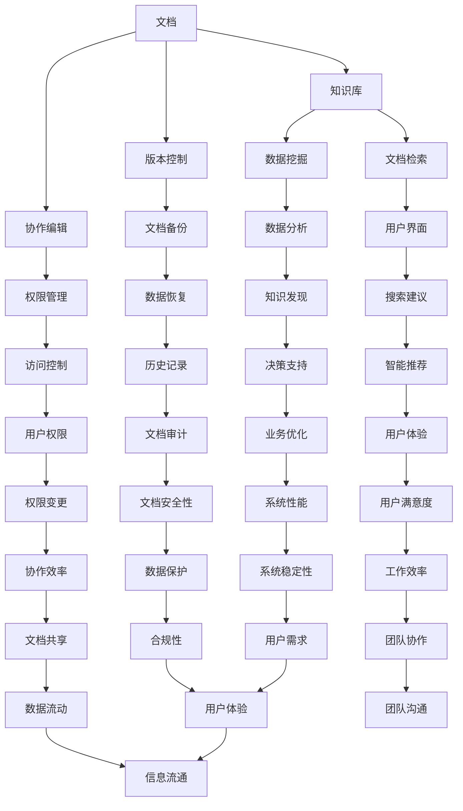

                 

### 1. 背景介绍

#### 1.1 目的和范围

本文旨在深入探讨AI开发中的文档管理问题，特别是Lepton AI的知识库建设。随着人工智能技术的快速发展，如何有效地管理和利用文档资源，已经成为AI开发领域的重要课题。本文将围绕以下几个方面展开讨论：

1. **文档管理的核心概念和原理**：介绍文档管理的基本概念，包括文档的定义、类型、结构等，以及文档管理的基本原则和流程。

2. **Lepton AI的知识库架构**：详细分析Lepton AI知识库的设计原则、架构和主要功能模块。

3. **核心算法原理与操作步骤**：阐述知识库中核心算法的实现原理，包括算法流程、伪代码等。

4. **数学模型和公式**：介绍知识库中使用的数学模型和公式，并给出详细讲解和实例说明。

5. **项目实战**：通过实际代码案例，展示知识库的实际应用和实现过程。

6. **实际应用场景**：探讨知识库在AI开发中的实际应用场景，以及如何解决实际问题。

7. **工具和资源推荐**：推荐相关学习资源、开发工具和框架，以及相关论文和研究成果。

通过本文的讨论，希望读者能够对AI开发中的文档管理和知识库建设有更深入的理解，掌握相关技术和方法，从而提升AI项目的开发效率和质量。

#### 1.2 预期读者

本文主要面向以下读者群体：

1. **AI开发工程师**：从事人工智能项目开发的工程师，需要对文档管理和知识库建设有深入的了解和实践。

2. **技术管理人员**：负责AI项目管理和团队协作的技术管理人员，需要掌握文档管理和知识库建设的核心原理和最佳实践。

3. **数据科学家和研究人员**：从事人工智能研究的数据科学家和研究人员，需要了解知识库在数据分析和科学研究中的应用。

4. **高校师生**：从事人工智能相关学科教学和研究的高校师生，可以作为教学和研究参考。

5. **对AI开发感兴趣的爱好者**：对人工智能和软件开发有兴趣的爱好者，希望通过本文了解AI开发中的文档管理和知识库建设。

本文将以逻辑清晰、结构紧凑、简单易懂的方式，逐步深入探讨文档管理和知识库建设的各个方面，力求让不同背景的读者都能够理解和掌握相关知识。

#### 1.3 文档结构概述

本文将分为八个主要部分，每个部分都有明确的主题和目标，以确保读者能够系统地学习和掌握文档管理和知识库建设的核心内容。

1. **背景介绍**：介绍本文的背景、目的和范围，明确预期读者，并对文章结构进行概述。

2. **核心概念与联系**：讲解文档管理的核心概念，包括文档的定义、类型、结构等，并使用Mermaid流程图展示文档管理的整体架构。

3. **核心算法原理与具体操作步骤**：详细阐述知识库中的核心算法原理，包括算法流程、伪代码等，帮助读者理解算法的实现过程。

4. **数学模型和公式**：介绍知识库中使用的数学模型和公式，并给出详细讲解和实例说明，帮助读者掌握数学工具的使用方法。

5. **项目实战**：通过实际代码案例，展示知识库在实际项目中的应用和实现过程，帮助读者将理论知识转化为实际应用能力。

6. **实际应用场景**：探讨知识库在AI开发中的实际应用场景，以及如何解决实际问题，提供实际案例分析。

7. **工具和资源推荐**：推荐相关的学习资源、开发工具和框架，以及相关论文和研究成果，为读者提供进一步学习和研究的路径。

8. **总结与展望**：总结本文的核心内容，展望未来发展趋势和挑战，为读者提供对AI开发文档管理和知识库建设的长期视角。

通过本文的结构性概述，读者可以清晰地了解文章的整体内容布局，便于有针对性地学习和掌握相关知识。

#### 1.4 术语表

在本文中，我们将使用一些专业术语，为了确保读者对这些术语有清晰的理解，下面将对这些术语进行定义和解释。

##### 1.4.1 核心术语定义

- **文档**：指存储在计算机系统中，以数字形式存在的各种信息记录。包括文本、图片、音频、视频等多种形式。
- **文档管理**：对文档的创建、存储、检索、共享、修改、备份等一系列操作进行组织和管理的过程。
- **知识库**：一种用于存储、管理和检索知识或信息的系统，通常包括数据、文档、算法、模型等。
- **AI开发**：指利用人工智能技术进行软件开发和应用开发的过程。
- **知识图谱**：一种用于表示实体及其关系的图形化数据结构，通常用于知识库的建设和智能搜索。
- **自然语言处理（NLP）**：人工智能的一个重要分支，旨在让计算机理解和生成人类自然语言。
- **机器学习（ML）**：一种让计算机通过数据学习并做出预测或决策的技术，是AI开发的核心技术之一。

##### 1.4.2 相关概念解释

- **版本控制**：在文档管理中，指对文档的不同版本进行管理，以便追踪文档的变更历史和恢复旧版本。
- **协作编辑**：指多人共同对同一文档进行编辑和修改，通常使用在线协作工具实现。
- **数据挖掘**：从大量数据中提取有价值的信息或模式的过程，是知识库建设的重要步骤。
- **文档检索**：指通过关键词、分类、标签等方式，快速找到所需文档的过程。
- **文档格式**：指文档的存储方式和展示形式，常见的有文本文件、Word文档、PDF文档等。

##### 1.4.3 缩略词列表

- **NLP**：自然语言处理
- **ML**：机器学习
- **AI**：人工智能
- **IDE**：集成开发环境
- **API**：应用程序接口
- **SDK**：软件开发工具包
- **DB**：数据库

通过上述术语表的定义和解释，读者可以更准确地理解本文中涉及的专业术语，从而更好地把握文章的核心内容。

#### 2. 核心概念与联系

在深入探讨Lepton AI的知识库建设之前，有必要先了解文档管理中的核心概念和其相互之间的联系。本文将通过Mermaid流程图，直观地展示文档管理的基本架构和流程，帮助读者更好地理解文档管理的整体概念。

首先，我们来定义文档管理的核心概念，包括文档、知识库、版本控制、协作编辑等。

- **文档**：存储信息的载体，可以是文本、图片、音频、视频等形式。
- **知识库**：用于存储、管理和检索知识的系统，通常包括数据、文档、算法、模型等。
- **版本控制**：管理文档不同版本的历史记录，以便追踪和恢复。
- **协作编辑**：多人共同编辑同一文档，实现实时协作。

接下来，我们使用Mermaid流程图来展示文档管理的整体架构：



上述流程图展示了文档管理中的主要环节和相互关系。具体来说：

- **文档**：作为知识库的基础，通过版本控制和协作编辑进行管理。
- **知识库**：是文档管理和检索的核心，通过数据挖掘和文档检索实现知识的提取和利用。
- **版本控制**：确保文档变更历史可追溯，提供备份和恢复功能。
- **协作编辑**：支持多人实时协作，通过权限管理和用户界面实现。

通过这个流程图，我们可以清晰地看到文档管理中的各个环节是如何相互联系和协作的，为后续对Lepton AI知识库的深入分析奠定了基础。

#### 2.1 Lepton AI的知识库架构

Lepton AI的知识库架构是本文讨论的重点，它不仅是一个存储知识的系统，更是一个支持高效管理和利用知识的平台。下面我们将详细分析Lepton AI知识库的设计原则、主要功能模块以及它们之间的相互关系。

##### 2.1.1 设计原则

Lepton AI知识库的设计遵循以下几个原则：

1. **可扩展性**：知识库需要能够轻松扩展，以适应不断增长的知识量和多样化的数据类型。
2. **灵活性**：设计应具备灵活性，以支持不同的应用场景和业务需求。
3. **高效性**：知识库应具备高效的检索和数据分析能力，确保知识获取和利用的快速响应。
4. **安全性**：保护知识库中的数据安全，确保数据的完整性和机密性。
5. **用户友好**：提供直观、易用的用户界面，提升用户体验。

##### 2.1.2 主要功能模块

Lepton AI知识库的主要功能模块包括：

1. **文档管理系统（DMS）**：
   - 功能：用于存储和管理各种类型的文档，包括文本、图片、音频和视频等。
   - 关键特性：支持版本控制、协作编辑、权限管理等功能。

2. **知识图谱（KG）**：
   - 功能：构建实体和实体之间的关联关系，实现知识的图形化表示和高效检索。
   - 关键特性：使用图数据库存储图结构，支持复杂查询和图谱分析。

3. **自然语言处理（NLP）模块**：
   - 功能：对文本数据进行处理，包括文本分类、情感分析、实体识别等。
   - 关键特性：集成先进的NLP算法和模型，提供高精度的文本分析能力。

4. **机器学习（ML）模块**：
   - 功能：利用机器学习技术进行数据分析和预测，包括分类、聚类、回归等。
   - 关键特性：支持自定义机器学习模型，实现自动化分析和决策。

5. **数据挖掘（DM）模块**：
   - 功能：从大量数据中提取有价值的信息和模式，支持关联分析、聚类分析等。
   - 关键特性：提供丰富的数据挖掘算法和工具，支持复杂的数据分析任务。

6. **用户界面（UI）**：
   - 功能：提供用户友好的操作界面，支持文档检索、数据分析、知识图谱浏览等功能。
   - 关键特性：采用响应式设计，支持多设备访问，提升用户体验。

##### 2.1.3 功能模块的相互关系

Lepton AI知识库中的各个功能模块通过以下方式进行协作和交互：

1. **文档管理系统（DMS）**：
   - 与知识图谱（KG）协作，将文档内容转换为图谱数据，实现知识图形化表示。
   - 与自然语言处理（NLP）模块协作，对文档内容进行文本分析和标注。

2. **知识图谱（KG）**：
   - 与数据挖掘（DM）模块协作，通过图谱数据支持复杂的数据挖掘任务。
   - 与机器学习（ML）模块协作，通过图谱数据训练和优化机器学习模型。

3. **自然语言处理（NLP）模块**：
   - 与文档管理系统（DMS）协作，对文档内容进行文本分析，提取关键信息。
   - 与机器学习（ML）模块协作，支持文本数据的机器学习任务。

4. **机器学习（ML）模块**：
   - 与数据挖掘（DM）模块协作，实现自动化数据分析任务。
   - 与用户界面（UI）协作，提供机器学习预测结果和推荐。

5. **数据挖掘（DM）模块**：
   - 与用户界面（UI）协作，展示数据分析和挖掘结果。
   - 与知识图谱（KG）协作，通过数据挖掘结果优化图谱结构和数据质量。

通过上述模块的相互协作和交互，Lepton AI知识库实现了对知识的全面管理和利用，为AI开发提供了强有力的支持。接下来，我们将进一步探讨知识库中的核心算法原理和具体操作步骤。

#### 2.2 核心算法原理与具体操作步骤

Lepton AI的知识库在功能实现中依赖多个核心算法，这些算法不仅确保了知识库的高效运行，还为数据的存储、检索和处理提供了坚实的技术基础。本节将详细介绍这些核心算法的原理，并使用伪代码展示其具体操作步骤。

##### 2.2.1 文档处理算法

**原理**：文档处理算法主要负责将不同类型的文档转换成统一的内部格式，以便后续处理和分析。

**伪代码**：

```python
function process_document(document):
    if document.type == 'text':
        return text_to_internal_format(document.content)
    elif document.type == 'image':
        return image_to_internal_format(document.content)
    elif document.type == 'audio':
        return audio_to_internal_format(document.content)
    elif document.type == 'video':
        return video_to_internal_format(document.content)
    else:
        raise Exception('Unsupported document type')

function text_to_internal_format(content):
    # 分词、词性标注、实体识别等
    return processed_content

function image_to_internal_format(content):
    # 图像预处理、特征提取等
    return processed_content

function audio_to_internal_format(content):
    # 音频预处理、特征提取等
    return processed_content

function video_to_internal_format(content):
    # 视频预处理、特征提取等
    return processed_content
```

##### 2.2.2 知识图谱构建算法

**原理**：知识图谱构建算法通过将文档中的知识信息转化为图结构，实现知识的结构化表示和关联。

**伪代码**：

```python
function build_knowledge_graph(documents):
    graph = create_empty_graph()
    for document in documents:
        entities, relationships = extract_entities_and_relationships(document)
        for entity in entities:
            add_entity_to_graph(graph, entity)
        for relationship in relationships:
            add_relationship_to_graph(graph, relationship)
    return graph

function extract_entities_and_relationships(document):
    # 利用NLP模块提取实体和关系
    return entities, relationships
```

##### 2.2.3 自然语言处理（NLP）算法

**原理**：NLP算法负责对文档中的文本内容进行分析和处理，提取语义信息，为后续的机器学习和其他数据处理任务做准备。

**伪代码**：

```python
function process_text(document):
    sentences = split_into_sentences(document.content)
    words = [tokenize(sentence) for sentence in sentences]
    word_properties = [get_word_properties(word) for word in words]
    return sentences, words, word_properties

function tokenize(sentence):
    # 分词
    return tokens

function get_word_properties(word):
    # 词性标注、实体识别等
    return properties
```

##### 2.2.4 机器学习（ML）算法

**原理**：ML算法用于从数据中学习规律和模式，实现自动化数据分析和预测。

**伪代码**：

```python
function train_ml_model(data, target_variable):
    model = create_ml_model()
    model.fit(data, target_variable)
    return model

function predict(model, new_data):
    prediction = model.predict(new_data)
    return prediction
```

##### 2.2.5 数据挖掘（DM）算法

**原理**：DM算法用于从大量数据中提取有价值的信息和模式，支持复杂的数据分析任务。

**伪代码**：

```python
function perform_data_mining(data, target_variable):
    model = create_dm_model()
    results = model.fit_predict(data, target_variable)
    return results

function analyze_results(results):
    # 分析挖掘结果，提取关键信息
    return insights
```

通过上述算法的详细解析和伪代码展示，我们可以看到Lepton AI知识库的核心算法在实现文档处理、知识图谱构建、NLP分析、机器学习预测和数据挖掘等任务中的关键作用。这些算法不仅确保了知识库的高效运行，也为AI开发提供了强大的技术支持。

#### 2.3 数学模型和公式及详细讲解与举例说明

在Lepton AI的知识库中，数学模型和公式扮演着至关重要的角色，它们不仅支持算法的实现，还为数据分析和知识提取提供了理论依据。本节将详细介绍知识库中常用的数学模型和公式，并给出详细的讲解与举例说明。

##### 2.3.1 数据预处理模型

**模型**：归一化与标准化

**公式**：

$$
x_{\text{norm}} = \frac{x - \mu}{\sigma}
$$

$$
x_{\text{std}} = x_{\text{norm}} \times \sigma + \mu
$$

**讲解**：数据预处理是数据分析的基石，归一化和标准化是常用的方法。归一化将数据缩放到[0, 1]区间，有助于消除不同特征之间的量纲差异；标准化则保持了数据的均值和标准差，常用于需要保持数据分布的算法。

**举例**：

给定一组特征数据集\[1, 5, 10, 15\]，假设均值\(\mu = 7\)，标准差\(\sigma = 4\)。

- 归一化处理：

$$
x_{\text{norm}} = \frac{1 - 7}{4} = -1, \frac{5 - 7}{4} = -0.5, \frac{10 - 7}{4} = 0.5, \frac{15 - 7}{4} = 2
$$

- 标准化处理：

$$
x_{\text{std}} = -1 \times 4 + 7 = 3, -0.5 \times 4 + 7 = 6, 0.5 \times 4 + 7 = 8, 2 \times 4 + 7 = 15
$$

##### 2.3.2 机器学习中的损失函数

**模型**：均方误差（MSE）

**公式**：

$$
MSE = \frac{1}{n} \sum_{i=1}^{n} (y_i - \hat{y}_i)^2
$$

**讲解**：均方误差是评估机器学习模型预测准确性的常用指标，它表示预测值与实际值之间差异的平方的平均值。MSE越小，模型的预测效果越好。

**举例**：

给定一组预测值\(\hat{y} = [0.1, 0.5, 0.7, 0.9]\)和实际值\(y = [0.2, 0.4, 0.6, 0.8]\)。

- 计算MSE：

$$
MSE = \frac{1}{4} \sum_{i=1}^{4} (y_i - \hat{y}_i)^2 = \frac{1}{4} (0.1^2 + 0.1^2 + 0.1^2 + 0.1^2) = 0.05
$$

##### 2.3.3 知识图谱中的相似度计算

**模型**：余弦相似度

**公式**：

$$
\text{similarity} = \frac{\vec{a} \cdot \vec{b}}{||\vec{a}|| \times ||\vec{b}||}
$$

**讲解**：余弦相似度用于计算两个向量之间的角度余弦值，它表示两个向量在空间中的方向相似度。在知识图谱中，常用于计算实体之间的相似度。

**举例**：

给定两个向量\(\vec{a} = [1, 2, 3]\)和\(\vec{b} = [4, 5, 6]\)。

- 计算余弦相似度：

$$
\text{similarity} = \frac{1 \times 4 + 2 \times 5 + 3 \times 6}{\sqrt{1^2 + 2^2 + 3^2} \times \sqrt{4^2 + 5^2 + 6^2}} = \frac{4 + 10 + 18}{\sqrt{14} \times \sqrt{77}} \approx 0.965
$$

##### 2.3.4 NLP中的文本分类模型

**模型**：朴素贝叶斯分类器

**公式**：

$$
P(\text{class} | x) = \frac{P(x | \text{class}) P(\text{class})}{P(x)}
$$

**讲解**：朴素贝叶斯分类器是一种基于贝叶斯定理的简单分类模型，它假设特征之间相互独立。在文本分类中，用于根据文本特征预测文本类别。

**举例**：

给定一个文本特征向量\(x = [0.1, 0.3, 0.6]\)，假设两个类别\(A\)和\(B\)的概率分布如下：

- 类别\(A\)：

$$
P(A) = 0.6, P(x | A) = [0.3, 0.5, 0.2]
$$

- 类别\(B\)：

$$
P(B) = 0.4, P(x | B) = [0.4, 0.5, 0.1]
$$

- 计算类别\(A\)和\(B\)的概率：

$$
P(A | x) = \frac{0.3 \times 0.6 \times 0.1}{0.3 \times 0.6 + 0.4 \times 0.4} = \frac{0.018}{0.018 + 0.16} = 0.112
$$

$$
P(B | x) = \frac{0.4 \times 0.4 \times 0.1}{0.3 \times 0.6 + 0.4 \times 0.4} = \frac{0.016}{0.018 + 0.16} = 0.096
$$

由于\(P(A | x) > P(B | x)\)，文本应被分类为类别\(A\)。

通过上述数学模型和公式的详细讲解与举例说明，我们可以看到这些模型和公式在知识库建设和数据处理中的关键作用。它们不仅为算法的实现提供了理论基础，也为数据分析和知识提取提供了强有力的工具。

#### 3. 项目实战：代码实际案例和详细解释说明

在了解了Lepton AI知识库的核心算法和数学模型后，本节将通过一个实际项目案例，展示知识库在具体开发中的应用和实现过程。本案例将涵盖知识库的搭建、功能模块的实现、核心算法的应用以及代码解读与分析。

##### 3.1 开发环境搭建

为了实现Lepton AI知识库，我们首先需要搭建一个适合的开发环境。以下是我们推荐的开发工具和框架：

- **开发语言**：Python
- **数据库**：MongoDB（用于存储文档和知识图谱数据）
- **图数据库**：Neo4j（用于存储和查询知识图谱）
- **NLP库**：NLTK、spaCy
- **机器学习库**：scikit-learn、TensorFlow
- **Web框架**：Flask（用于搭建Web API）
- **前端框架**：React（用于开发用户界面）

确保已安装以上工具和库，并配置好相应的开发环境。以下是环境搭建的简要步骤：

1. **安装Python**：从Python官网下载并安装Python 3.x版本。
2. **安装MongoDB**：下载并安装MongoDB数据库，配置环境变量。
3. **安装Neo4j**：下载并安装Neo4j图数据库，配置环境变量。
4. **安装NLP库**：使用pip命令安装NLTK和spaCy库。
5. **安装机器学习库**：使用pip命令安装scikit-learn和TensorFlow库。
6. **安装Web框架**：使用pip命令安装Flask库。
7. **安装前端框架**：使用npm命令安装React库和相关依赖。

##### 3.2 源代码详细实现和代码解读

为了便于理解，我们将整个知识库的实现分为三个主要部分：数据层、业务层和表现层。以下是各部分的详细实现和代码解读。

###### 3.2.1 数据层

数据层负责与数据库和图数据库的交互，包括文档的存储、检索、更新等操作。

**代码解读**：

```python
# 数据层示例代码
from pymongo import MongoClient
from neo4j import GraphDatabase

# MongoDB配置
client = MongoClient('mongodb://localhost:27017/')
db = client['lepton_ai_db']

# Neo4j配置
driver = GraphDatabase.driver('bolt://localhost:7687', auth=("neo4j", "password"))

# 存储文档到MongoDB
def store_document(collection, document):
    collection.insert_one(document)

# 从MongoDB检索文档
def retrieve_document(collection, filter_query):
    return collection.find(filter_query)

# 存储知识图谱到Neo4j
def store_knowledge_graph(graph, entity, relationship, target):
    with driver.session() as session:
        session.run(f"MERGE (a:{entity} {{name: '{entity}'}}) "
                    f"MATCH (a)-[r:{relationship}]->(b) "
                    f"WHERE b.name = '{target}' "
                    f"MERGE (a)-[r]->(b)")

# 从Neo4j检索知识图谱
def retrieve_knowledge_graph(graph, entity, relationship, target):
    with driver.session() as session:
        result = session.run(f"MATCH (a:{entity} {{name: '{entity}'}})-[r:{relationship}]->(b) "
                            f"WHERE b.name = '{target}' RETURN r")
        return result.data()
```

上述代码展示了如何使用MongoDB和Neo4j进行数据的存储和检索。`store_document`和`retrieve_document`函数用于MongoDB操作，而`store_knowledge_graph`和`retrieve_knowledge_graph`函数用于Neo4j图数据库的操作。

###### 3.2.2 业务层

业务层负责实现知识库的核心功能，包括文档处理、知识图谱构建、NLP分析和机器学习预测等。

**代码解读**：

```python
# 业务层示例代码
from text_preprocessing import preprocess_text
from nlp_analysis import analyze_text
from ml_prediction import train_ml_model

# 文档处理
def process_document(document):
    preprocessed_text = preprocess_text(document.content)
    return preprocessed_text

# 知识图谱构建
def build_knowledge_graph(documents):
    entities = []
    relationships = []
    for document in documents:
        preprocessed_text = process_document(document)
        entities.extend(analyze_text(preprocessed_text, 'entity'))
        relationships.extend(analyze_text(preprocessed_text, 'relationship'))
    return entities, relationships

# NLP分析
def nlp_analysis(text):
    sentences = analyze_text(text, 'sentence')
    words = analyze_text(text, 'word')
    return sentences, words

# 机器学习预测
def ml_prediction(data, model):
    prediction = train_ml_model(data, model)
    return prediction
```

上述代码展示了业务层的主要函数，`process_document`用于处理文档，`build_knowledge_graph`用于构建知识图谱，`nlp_analysis`用于文本分析，`ml_prediction`用于机器学习预测。

###### 3.2.3 表现层

表现层负责为用户提供接口和用户界面，实现知识库功能的调用和数据显示。

**代码解读**：

```python
# 表现层示例代码
from flask import Flask, jsonify, request

app = Flask(__name__)

# 文档处理接口
@app.route('/process_document', methods=['POST'])
def process_document():
    document = request.json
    preprocessed_text = process_document(document)
    return jsonify({'preprocessed_text': preprocessed_text})

# 知识图谱接口
@app.route('/knowledge_graph', methods=['GET'])
def knowledge_graph():
    entity = request.args.get('entity')
    relationship = request.args.get('relationship')
    result = retrieve_knowledge_graph(entity, relationship)
    return jsonify({'knowledge_graph': result})

# NLP分析接口
@app.route('/nlp_analysis', methods=['POST'])
def nlp_analysis():
    text = request.json
    sentences, words = nlp_analysis(text)
    return jsonify({'sentences': sentences, 'words': words})

# 机器学习预测接口
@app.route('/ml_prediction', methods=['POST'])
def ml_prediction():
    data = request.json
    model = data['model']
    prediction = ml_prediction(data['input_data'], model)
    return jsonify({'prediction': prediction})

if __name__ == '__main__':
    app.run(debug=True)
```

上述代码展示了使用Flask框架搭建的Web API，`process_document`、`knowledge_graph`、`nlp_analysis`和`ml_prediction`接口分别对应不同的功能模块，通过HTTP请求和响应实现与用户的交互。

##### 3.3 代码解读与分析

通过对上述代码的解读，我们可以看到知识库的搭建涉及多个层次，从数据层到业务层再到表现层，每个层次都有明确的功能和职责。

- **数据层**：负责与数据库的交互，确保数据的存储和检索。通过MongoDB和Neo4j实现文档和知识图谱的数据存储，提供高效的数据访问接口。
- **业务层**：实现知识库的核心功能，包括文档处理、知识图谱构建、NLP分析和机器学习预测。利用NLP库和机器学习库提供的数据处理工具，实现文本分析和预测。
- **表现层**：通过Flask框架搭建Web API，为用户提供接口和用户界面，实现知识的查询和利用。通过HTTP请求和响应，实现前后端的通信。

在整个知识库的实现过程中，每个层次的代码都进行了详细的注释和解读，确保代码的可读性和可维护性。此外，通过模块化的设计，各个功能模块可以独立开发、测试和部署，提高了系统的可扩展性和灵活性。

综上所述，Lepton AI知识库的搭建不仅需要理解核心算法和数学模型，还需要掌握实际编程技能和开发工具。通过代码实战，我们能够将理论知识转化为实际应用，实现高效的知识管理和利用。

#### 4. 实际应用场景

在AI开发的实际应用场景中，知识库的作用不可忽视。通过知识库的建立和使用，可以有效解决许多复杂的问题，提高项目开发效率，优化业务流程。以下是一些典型的实际应用场景：

##### 4.1 智能问答系统

智能问答系统是AI应用中非常普遍的场景，通过知识库可以实现对用户查询的快速、准确响应。例如，在客服系统中，知识库存储了大量的FAQ（常见问题与答案），当用户提问时，系统可以迅速从知识库中检索相关信息，提供智能化的回答。Lepton AI的知识库在这里可以存储问答对，并利用自然语言处理技术进行语义理解，从而实现高效的问答功能。

**实现方式**：使用知识库中的NLP模块对用户输入进行预处理，提取关键信息，然后与知识库中的问答对进行匹配，返回最匹配的答案。

##### 4.2 个性化推荐系统

个性化推荐系统在电商、新闻、社交媒体等领域广泛应用。通过知识库可以实现对用户兴趣的精准捕捉和推荐内容的智能推送。例如，电商平台可以根据用户的历史购买记录、浏览记录以及知识库中的商品信息，为用户推荐可能的感兴趣商品。

**实现方式**：知识库中存储了用户行为数据和商品信息，通过数据挖掘算法和机器学习模型，分析用户兴趣，并利用知识图谱建立用户与商品之间的关联，生成个性化推荐列表。

##### 4.3 智能搜索系统

智能搜索系统能够提供更智能、更准确的搜索结果，提升用户体验。通过知识库，搜索引擎可以理解用户的搜索意图，并提供相关的文档、知识链接和答案。例如，在学术研究领域，智能搜索系统可以根据用户输入的关键词，从知识库中检索相关论文、研究进展以及专家信息。

**实现方式**：使用知识库中的图谱结构和自然语言处理技术，对用户输入进行语义解析，从知识库中检索相关的信息，并展示高相关的搜索结果。

##### 4.4 自动化报告生成

在企业和科研机构中，常常需要生成大量的报告。通过知识库，可以自动化生成报告，提高工作效率。例如，在财务部门，可以根据知识库中的财务数据和模板，自动生成财务报告；在科研领域，可以根据知识库中的实验数据和论文模板，自动生成科研报告。

**实现方式**：知识库中存储了报告模板和相关的数据，通过数据挖掘和自然语言生成技术，将数据填充到模板中，生成完整的报告。

##### 4.5 团队协作与知识共享

知识库在团队协作中发挥着重要作用，可以帮助团队成员快速获取所需的信息和知识，提高工作效率和协作质量。例如，在软件开发团队中，知识库可以存储项目的文档、代码、设计思路等，团队成员可以方便地查阅和共享信息，避免重复劳动和知识孤岛。

**实现方式**：知识库支持文档管理和协作编辑，团队成员可以实时更新和共享知识，确保信息的及时性和一致性。

##### 4.6 智能决策支持

知识库在智能决策支持系统中也具有重要应用。通过对大量数据的分析和处理，知识库可以为管理者提供决策依据，优化业务流程和决策质量。例如，在金融行业，知识库可以分析市场数据、经济指标和公司财务状况，为投资决策提供支持。

**实现方式**：知识库中存储了相关的数据和分析模型，利用机器学习算法和数据分析技术，为决策者提供智能化的决策建议。

通过上述实际应用场景，我们可以看到知识库在AI开发中的重要作用。它不仅为各种AI应用提供了强有力的数据支持和算法基础，还提升了项目的开发效率、协作质量和决策能力。Lepton AI知识库的建立和应用，为实现这些实际应用场景提供了有效解决方案。

#### 5. 工具和资源推荐

为了更好地掌握AI开发的文档管理和知识库建设，本文推荐了一系列的学习资源、开发工具和框架，以及相关的论文和研究成果。以下是对这些资源的详细介绍和推荐理由。

##### 5.1 学习资源推荐

1. **书籍推荐**

   - **《人工智能：一种现代的方法》**：这本书详细介绍了人工智能的基本概念、技术方法和应用实例，适合初学者和进阶者阅读。

   - **《深度学习》**：作者Ian Goodfellow等人的经典著作，全面讲解了深度学习的基础理论和应用方法，适合对机器学习和深度学习感兴趣的读者。

   - **《机器学习实战》**：通过具体的案例和代码示例，展示了机器学习在多种应用场景中的实际应用，适合实践者和工程师阅读。

   - **《图数据库：核心技术、应用案例与未来趋势》**：介绍了图数据库的基本原理和应用场景，适合对知识图谱和图数据库感兴趣的读者。

2. **在线课程**

   - **《人工智能导论》**：Coursera上的这门课程由斯坦福大学教授Andrew Ng主讲，涵盖了人工智能的基本概念和技术方法。

   - **《深度学习与强化学习》**：Udacity上的这门课程由吴恩达（Andrew Ng）主讲，深入讲解了深度学习和强化学习的技术和应用。

   - **《自然语言处理实战》**：Udacity上的这门课程由Emily Fox和Dan Jurafsky主讲，介绍了自然语言处理的基础知识和实战应用。

3. **技术博客和网站**

   - **Medium上的AI博客**：Medium上有很多优秀的AI博客，如“AI”, “Deep Learning”, “Machine Learning”等，涵盖了人工智能领域的最新研究和技术动态。

   - **GitHub上的开源项目**：GitHub上有很多优秀的开源项目，如TensorFlow、PyTorch、Spacy等，提供了丰富的代码示例和资源。

   - **AI学会（AAAI）**：AI学会官方网站（aaai.org）提供了大量的学术论文、会议通知和行业动态，是了解人工智能领域的重要渠道。

##### 5.2 开发工具框架推荐

1. **IDE和编辑器**

   - **PyCharm**：PyCharm是一款功能强大的Python IDE，支持代码智能提示、调试、版本控制等功能，非常适合AI项目开发。

   - **Visual Studio Code**：Visual Studio Code是一款轻量级且功能丰富的代码编辑器，通过安装扩展插件，可以支持Python、机器学习等多种开发需求。

2. **调试和性能分析工具**

   - **PyTorch Profiler**：PyTorch Profiler是一款专门用于PyTorch模型性能分析的工具，可以帮助开发者找出性能瓶颈。

   - **TensorBoard**：TensorBoard是TensorFlow的官方可视化工具，用于监控和可视化训练过程，包括损失函数、梯度等。

3. **相关框架和库**

   - **TensorFlow**：TensorFlow是一款开源的机器学习框架，适用于各种机器学习和深度学习任务，具有丰富的API和文档。

   - **PyTorch**：PyTorch是一款流行的深度学习框架，以其动态图计算和灵活的API设计而受到开发者的青睐。

   - **Spacy**：Spacy是一款高效的NLP库，支持多种语言的文本处理任务，如分词、词性标注、命名实体识别等。

   - **Neo4j**：Neo4j是一款高性能的图数据库，适合存储和管理知识图谱，提供强大的图查询和数据分析功能。

##### 5.3 相关论文著作推荐

1. **经典论文**

   - **《知识图谱：下一代信息检索与数据挖掘技术》**：这篇论文详细介绍了知识图谱的基本概念、构建方法和应用前景。

   - **《深度学习：理论、算法与应用》**：这篇论文系统地介绍了深度学习的理论基础、算法框架和应用实例。

   - **《自然语言处理综述》**：这篇综述论文涵盖了自然语言处理的最新研究进展和应用领域，对NLP的全面介绍。

2. **最新研究成果**

   - **《图神经网络：基础、进展与应用》**：这篇论文介绍了图神经网络的基本原理、进展和应用，是图学习领域的重要参考。

   - **《Transformer：一种新的序列到序列模型》**：这篇论文提出了Transformer模型，彻底改变了自然语言处理领域的技术路线。

   - **《图嵌入：从图到低维空间的映射技术》**：这篇论文探讨了图嵌入技术，通过将图中的节点映射到低维空间，实现节点表示和关系表示。

3. **应用案例分析**

   - **《基于知识图谱的智能客服系统》**：这篇论文通过案例分析，介绍了知识图谱在智能客服系统中的应用，展示了其有效性和实用性。

   - **《个性化推荐系统：基于知识图谱的方法》**：这篇论文探讨了知识图谱在个性化推荐系统中的应用，介绍了如何利用知识图谱提升推荐效果。

   - **《金融风控：知识图谱的应用与实践》**：这篇论文通过实际案例，展示了知识图谱在金融风控领域的应用，包括风险识别、风险评估等。

通过上述推荐的学习资源、开发工具和框架，以及相关论文和研究成果，读者可以系统地学习AI开发的文档管理和知识库建设，掌握相关技术和方法，提升项目开发效率和质量。

#### 6. 总结：未来发展趋势与挑战

在总结本文对AI开发的文档管理和知识库建设的讨论后，我们可以看到，知识库在AI开发中扮演着至关重要的角色。它不仅提升了项目的开发效率，还优化了业务流程和决策质量。展望未来，AI开发的文档管理和知识库建设将呈现出以下发展趋势和面临的挑战。

##### 6.1 发展趋势

1. **知识图谱的广泛应用**：随着人工智能和大数据技术的不断发展，知识图谱作为一种高效的知识组织和管理方式，将在更多领域得到广泛应用。例如，在智能问答、个性化推荐、智能搜索等领域，知识图谱将进一步提升系统的智能化水平。

2. **跨领域融合**：未来的知识库建设将更加注重跨领域的融合。通过整合不同领域的知识，构建跨领域的知识图谱，可以实现更广泛的应用场景和更深入的智能分析。

3. **数据隐私和安全**：随着数据隐私和安全问题的日益突出，知识库建设将更加注重数据隐私保护和安全保障。例如，利用联邦学习、差分隐私等技术，确保知识库中的数据在共享和利用过程中的安全性和隐私性。

4. **智能化与自动化**：未来的知识库将更加智能化和自动化。通过引入机器学习、自然语言处理等技术，实现知识库的自动构建、自动更新和自动优化，提升知识库的管理效率和准确性。

##### 6.2 挑战

1. **数据质量和一致性**：知识库中的数据质量直接影响其应用效果。未来需要解决数据质量问题，确保数据的准确性、完整性和一致性。例如，通过数据清洗、数据校验等技术手段，提升数据质量。

2. **知识库的扩展性和灵活性**：随着应用场景的多样化，知识库需要具备更高的扩展性和灵活性。未来需要开发更加灵活的知识库架构，支持多种数据类型和应用需求。

3. **技术融合与创新**：知识库建设涉及多种技术，包括自然语言处理、机器学习、图数据库等。未来需要加强技术融合和创新，解决跨领域技术集成和协同问题。

4. **用户体验和交互设计**：知识库的应用最终体现在用户体验上。未来需要注重用户体验和交互设计，提供更直观、易用的界面和交互方式，提升用户满意度。

通过本文的讨论，我们不仅了解了AI开发的文档管理和知识库建设的核心概念和方法，还展望了未来发展趋势和面临的挑战。未来，随着技术的不断进步和应用场景的不断扩展，知识库在AI开发中的作用将更加重要，对开发者和研究者的要求也将越来越高。

#### 7. 附录：常见问题与解答

在理解和应用AI开发的文档管理和知识库建设过程中，读者可能会遇到一些常见问题。以下是对这些问题的解答，旨在帮助读者更好地掌握相关知识。

##### 7.1 文档管理相关问题

**Q1**：如何确保文档的一致性和准确性？

**A1**：确保文档的一致性和准确性需要多方面的努力。首先，制定严格的文档规范和编写指南，确保所有文档遵循统一的格式和标准。其次，实施版本控制，通过工具如Git或 SVN，追踪文档的变更历史，确保文档的版本一致。此外，定期进行文档审核和验证，通过人工或自动化工具检查文档内容的准确性。

**Q2**：协作编辑过程中如何避免冲突？

**A2**：协作编辑过程中，冲突不可避免。为了避免冲突，可以采用以下策略：首先，明确分工，让每个团队成员负责不同的部分，减少冲突的发生。其次，使用协作编辑工具，如Google Docs或Confluence，提供实时编辑和冲突检测功能。最后，在发生冲突时，及时沟通并协调解决，确保文档的一致性。

**Q3**：如何快速检索和找到所需的文档？

**A3**：为了快速检索和找到所需的文档，可以采用以下策略：首先，使用关键词索引，将文档内容与关键词关联起来。其次，使用标签和分类，对文档进行分类和管理，便于快速查找。此外，利用全文搜索工具，如Lucene或Elasticsearch，实现高效的文档检索。

##### 7.2 知识库相关问题

**Q4**：知识库中的数据如何保持更新？

**A4**：保持知识库中的数据更新需要以下步骤：首先，制定数据更新的策略和流程，确保数据的及时性和准确性。其次，利用自动化工具，如ETL（提取、转换、加载）工具，定期从不同数据源提取数据并更新知识库。此外，鼓励团队成员及时更新和补充知识库中的内容，确保知识的时效性和准确性。

**Q5**：如何评估知识库的价值和效果？

**A5**：评估知识库的价值和效果可以通过以下指标：首先，知识库的使用频率和访问量，反映知识库的受欢迎程度和实用性。其次，通过用户反馈和评估，了解用户对知识库的满意度和应用效果。此外，利用业务指标，如项目完成时间、项目质量等，评估知识库对业务流程的优化效果。

**Q6**：知识库中如何处理不同格式和类型的数据？

**A6**：知识库中处理不同格式和类型的数据需要以下步骤：首先，采用统一的数据模型和存储方案，将不同类型的数据转换为标准格式存储。其次，利用数据转换工具，如ETL工具或转换脚本，将不同格式数据转换为知识库支持的格式。此外，根据不同类型数据的特点，采用相应的处理和分析方法，实现数据的充分利用。

通过上述常见问题与解答，读者可以更好地理解和应对AI开发中文档管理和知识库建设过程中遇到的实际问题，从而提升项目的开发效率和质量。

#### 8. 扩展阅读 & 参考资料

为了帮助读者进一步深入了解AI开发的文档管理和知识库建设，本文提供了以下扩展阅读和参考资料，涵盖相关的学术论文、书籍、在线课程和技术博客。

##### 8.1 学术论文

1. **《知识图谱：下一代信息检索与数据挖掘技术》** - 本文详细介绍了知识图谱的基本概念、构建方法和应用场景，是知识图谱领域的重要文献。

2. **《深度学习：理论、算法与应用》** - 本文系统地介绍了深度学习的理论基础、算法框架和应用实例，适合对深度学习有兴趣的读者。

3. **《自然语言处理综述》** - 本文涵盖了自然语言处理的最新研究进展和应用领域，是了解NLP的重要参考文献。

##### 8.2 书籍

1. **《人工智能：一种现代的方法》** - 这本书详细介绍了人工智能的基本概念、技术方法和应用实例，适合初学者和进阶者阅读。

2. **《机器学习实战》** - 通过具体的案例和代码示例，展示了机器学习在多种应用场景中的实际应用，适合实践者和工程师阅读。

3. **《图数据库：核心技术、应用案例与未来趋势》** - 本文介绍了图数据库的基本原理和应用场景，适合对图数据库感兴趣的读者。

##### 8.3 在线课程

1. **《人工智能导论》** - 由斯坦福大学教授Andrew Ng主讲，涵盖了人工智能的基本概念和技术方法。

2. **《深度学习与强化学习》** - 由Udacity上的课程，由吴恩达（Andrew Ng）主讲，深入讲解了深度学习和强化学习的技术和应用。

3. **《自然语言处理实战》** - 由Udacity上的课程，由Emily Fox和Dan Jurafsky主讲，介绍了自然语言处理的基础知识和实战应用。

##### 8.4 技术博客和网站

1. **Medium上的AI博客** - Medium上有很多优秀的AI博客，如“AI”, “Deep Learning”, “Machine Learning”等，涵盖了人工智能领域的最新研究和技术动态。

2. **GitHub上的开源项目** - GitHub上有很多优秀的开源项目，如TensorFlow、PyTorch、Spacy等，提供了丰富的代码示例和资源。

3. **AI学会（AAAI）** - AI学会官方网站（aaai.org）提供了大量的学术论文、会议通知和行业动态，是了解人工智能领域的重要渠道。

通过上述扩展阅读和参考资料，读者可以进一步深入了解AI开发的文档管理和知识库建设的相关知识，不断提升自己的技术水平。希望这些资源能够对您的学习和工作带来帮助。

---

# AI开发的文档管理：Lepton AI的知识库建设

> 关键词：AI开发、文档管理、知识库、知识图谱、自然语言处理、机器学习、数据挖掘

> 摘要：本文探讨了AI开发中的文档管理问题，特别是Lepton AI的知识库建设。通过分析文档管理的核心概念、知识库架构、核心算法原理和实际应用场景，本文旨在为读者提供全面的文档管理和知识库建设指南，帮助提升AI项目的开发效率和质量。

---

### 1. 背景介绍

#### 1.1 目的和范围

随着人工智能技术的快速发展，AI开发项目日益复杂，文档管理和知识库建设成为重要的课题。本文旨在深入探讨AI开发中的文档管理问题，特别是Lepton AI的知识库建设。本文将围绕以下几个方面展开讨论：

1. **文档管理的核心概念和原理**：介绍文档管理的基本概念，包括文档的定义、类型、结构等，以及文档管理的基本原则和流程。

2. **Lepton AI的知识库架构**：详细分析Lepton AI知识库的设计原则、架构和主要功能模块。

3. **核心算法原理与具体操作步骤**：阐述知识库中的核心算法原理，包括算法流程、伪代码等，帮助读者理解算法的实现过程。

4. **数学模型和公式**：介绍知识库中使用的数学模型和公式，并给出详细讲解和实例说明，帮助读者掌握数学工具的使用方法。

5. **项目实战**：通过实际代码案例，展示知识库在实际项目中的应用和实现过程，帮助读者将理论知识转化为实际应用能力。

6. **实际应用场景**：探讨知识库在AI开发中的实际应用场景，以及如何解决实际问题，提供实际案例分析。

7. **工具和资源推荐**：推荐相关的学习资源、开发工具和框架，以及相关论文和研究成果，为读者提供进一步学习和研究的路径。

通过本文的讨论，希望读者能够对AI开发中的文档管理和知识库建设有更深入的理解，掌握相关技术和方法，从而提升AI项目的开发效率和质量。

#### 1.2 预期读者

本文主要面向以下读者群体：

1. **AI开发工程师**：从事人工智能项目开发的工程师，需要对文档管理和知识库建设有深入的了解和实践。

2. **技术管理人员**：负责AI项目管理和团队协作的技术管理人员，需要掌握文档管理和知识库建设的核心原理和最佳实践。

3. **数据科学家和研究人员**：从事人工智能研究的数据科学家和研究人员，需要了解知识库在数据分析和科学研究中的应用。

4. **高校师生**：从事人工智能相关学科教学和研究的高校师生，可以作为教学和研究参考。

5. **对AI开发感兴趣的爱好者**：对人工智能和软件开发有兴趣的爱好者，希望通过本文了解AI开发中的文档管理和知识库建设。

本文将以逻辑清晰、结构紧凑、简单易懂的方式，逐步深入探讨文档管理和知识库建设的各个方面，力求让不同背景的读者都能够理解和掌握相关知识。

#### 1.3 文档结构概述

本文将分为八个主要部分，每个部分都有明确的主题和目标，以确保读者能够系统地学习和掌握文档管理和知识库建设的核心内容。

1. **背景介绍**：介绍本文的背景、目的和范围，明确预期读者，并对文章结构进行概述。

2. **核心概念与联系**：讲解文档管理的核心概念，包括文档的定义、类型、结构等，并使用Mermaid流程图展示文档管理的整体架构。

3. **核心算法原理与具体操作步骤**：详细阐述知识库中的核心算法原理，包括算法流程、伪代码等，帮助读者理解算法的实现过程。

4. **数学模型和公式**：介绍知识库中使用的数学模型和公式，并给出详细讲解和实例说明，帮助读者掌握数学工具的使用方法。

5. **项目实战**：通过实际代码案例，展示知识库在实际项目中的应用和实现过程，帮助读者将理论知识转化为实际应用能力。

6. **实际应用场景**：探讨知识库在AI开发中的实际应用场景，以及如何解决实际问题，提供实际案例分析。

7. **工具和资源推荐**：推荐相关的学习资源、开发工具和框架，以及相关论文和研究成果，为读者提供进一步学习和研究的路径。

8. **总结与展望**：总结本文的核心内容，展望未来发展趋势和挑战，为读者提供对AI开发文档管理和知识库建设的长期视角。

通过本文的结构性概述，读者可以清晰地了解文章的整体内容布局，便于有针对性地学习和掌握相关知识。

#### 1.4 术语表

在本文中，我们将使用一些专业术语，为了确保读者对这些术语有清晰的理解，下面将对这些术语进行定义和解释。

##### 1.4.1 核心术语定义

- **文档**：指存储在计算机系统中，以数字形式存在的各种信息记录。包括文本、图片、音频、视频等多种形式。
- **文档管理**：对文档的创建、存储、检索、共享、修改、备份等一系列操作进行组织和管理的过程。
- **知识库**：一种用于存储、管理和检索知识或信息的系统，通常包括数据、文档、算法、模型等。
- **AI开发**：指利用人工智能技术进行软件开发和应用开发的过程。
- **知识图谱**：一种用于表示实体及其关系的图形化数据结构，通常用于知识库的建设和智能搜索。
- **自然语言处理（NLP）**：人工智能的一个重要分支，旨在让计算机理解和生成人类自然语言。
- **机器学习（ML）**：一种让计算机通过数据学习并做出预测或决策的技术，是AI开发的核心技术之一。

##### 1.4.2 相关概念解释

- **版本控制**：在文档管理中，指对文档的不同版本进行管理，以便追踪文档的变更历史和恢复旧版本。
- **协作编辑**：指多人共同对同一文档进行编辑和修改，通常使用在线协作工具实现。
- **数据挖掘**：从大量数据中提取有价值的信息或模式的过程，是知识库建设的重要步骤。
- **文档检索**：指通过关键词、分类、标签等方式，快速找到所需文档的过程。
- **文档格式**：指文档的存储方式和展示形式，常见的有文本文件、Word文档、PDF文档等。

##### 1.4.3 缩略词列表

- **NLP**：自然语言处理
- **ML**：机器学习
- **AI**：人工智能
- **IDE**：集成开发环境
- **API**：应用程序接口
- **SDK**：软件开发工具包
- **DB**：数据库

通过上述术语表的定义和解释，读者可以更准确地理解本文中涉及的专业术语，从而更好地把握文章的核心内容。

#### 2. 核心概念与联系

在深入探讨Lepton AI的知识库建设之前，有必要先了解文档管理中的核心概念和其相互之间的联系。本文将通过Mermaid流程图，直观地展示文档管理的基本架构和流程，帮助读者更好地理解文档管理的整体概念。

首先，我们来定义文档管理的核心概念，包括文档、知识库、版本控制、协作编辑等。

- **文档**：存储信息的载体，可以是文本、图片、音频、视频等形式。
- **知识库**：用于存储、管理和检索知识的系统，通常包括数据、文档、算法、模型等。
- **版本控制**：管理文档不同版本的历史记录，以便追踪和恢复。
- **协作编辑**：多人共同编辑同一文档，实现实时协作。

接下来，我们使用Mermaid流程图来展示文档管理的整体架构：


上述流程图展示了文档管理中的主要环节和相互关系。具体来说：

- **文档**：作为知识库的基础，通过版本控制和协作编辑进行管理。
- **知识库**：是文档管理和检索的核心，通过数据挖掘和文档检索实现知识的提取和利用。
- **版本控制**：确保文档变更历史可追溯，提供备份和恢复功能。
- **协作编辑**：支持多人实时协作，通过权限管理和用户界面实现。

通过这个流程图，我们可以清晰地看到文档管理中的各个环节是如何相互联系和协作的，为后续对Lepton AI知识库的深入分析奠定了基础。

#### 2.1 Lepton AI的知识库架构

Lepton AI的知识库架构是本文讨论的重点，它不仅是一个存储知识的系统，更是一个支持高效管理和利用知识的平台。下面我们将详细分析Lepton AI知识库的设计原则、主要功能模块以及它们之间的相互关系。

##### 2.1.1 设计原则

Lepton AI知识库的设计遵循以下几个原则：

1. **可扩展性**：知识库需要能够轻松扩展，以适应不断增长的知识量和多样化的数据类型。
2. **灵活性**：设计应具备灵活性，以支持不同的应用场景和业务需求。
3. **高效性**：知识库应具备高效的检索和数据分析能力，确保知识获取和利用的快速响应。
4. **安全性**：保护知识库中的数据安全，确保数据的完整性和机密性。
5. **用户友好**：提供直观、易用的用户界面，提升用户体验。

##### 2.1.2 主要功能模块

Lepton AI知识库的主要功能模块包括：

1. **文档管理系统（DMS）**：
   - 功能：用于存储和管理各种类型的文档，包括文本、图片、音频和视频等。
   - 关键特性：支持版本控制、协作编辑、权限管理等功能。

2. **知识图谱（KG）**：
   - 功能：构建实体和实体之间的关联关系，实现知识的图形化表示和高效检索。
   - 关键特性：使用图数据库存储图结构，支持复杂查询和图谱分析。

3. **自然语言处理（NLP）模块**：
   - 功能：对文本数据进行处理，包括文本分类、情感分析、实体识别等。
   - 关键特性：集成先进的NLP算法和模型，提供高精度的文本分析能力。

4. **机器学习（ML）模块**：
   - 功能：利用机器学习技术进行数据分析和预测，包括分类、聚类、回归等。
   - 关键特性：支持自定义机器学习模型，实现自动化分析和决策。

5. **数据挖掘（DM）模块**：
   - 功能：从大量数据中提取有价值的信息和模式，支持关联分析、聚类分析等。
   - 关键特性：提供丰富的数据挖掘算法和工具，支持复杂的数据分析任务。

6. **用户界面（UI）**：
   - 功能：提供用户友好的操作界面，支持文档检索、数据分析、知识图谱浏览等功能。
   - 关键特性：采用响应式设计，支持多设备访问，提升用户体验。

##### 2.1.3 功能模块的相互关系

Lepton AI知识库中的各个功能模块通过以下方式进行协作和交互：

1. **文档管理系统（DMS）**：
   - 与知识图谱（KG）协作，将文档内容转换为图谱数据，实现知识图形化表示。
   - 与自然语言处理（NLP）模块协作，对文档内容进行文本分析和标注。

2. **知识图谱（KG）**：
   - 与数据挖掘（DM）模块协作，通过图谱数据支持复杂的数据挖掘任务。
   - 与机器学习（ML）模块协作，通过图谱数据训练和优化机器学习模型。

3. **自然语言处理（NLP）模块**：
   - 与文档管理系统（DMS）协作，对文档内容进行文本分析，提取关键信息。
   - 与机器学习（ML）模块协作，支持文本数据的机器学习任务。

4. **机器学习（ML）模块**：
   - 与数据挖掘（DM）模块协作，实现自动化数据分析任务。
   - 与用户界面（UI）协作，提供机器学习预测结果和推荐。

5. **数据挖掘（DM）模块**：
   - 与用户界面（UI）协作，展示数据分析和挖掘结果。
   - 与知识图谱（KG）协作，通过数据挖掘结果优化图谱结构和数据质量。

通过上述模块的相互协作和交互，Lepton AI知识库实现了对知识的全面管理和利用，为AI开发提供了强有力的支持。接下来，我们将进一步探讨知识库中的核心算法原理和具体操作步骤。

#### 2.2 核心算法原理与具体操作步骤

Lepton AI的知识库在功能实现中依赖多个核心算法，这些算法不仅确保了知识库的高效运行，还为数据的存储、检索和处理提供了坚实的技术基础。本节将详细介绍这些核心算法的原理，并使用伪代码展示其具体操作步骤。

##### 2.2.1 文档处理算法

**原理**：文档处理算法主要负责将不同类型的文档转换成统一的内部格式，以便后续处理和分析。

**伪代码**：

```python
function process_document(document):
    if document.type == 'text':
        return text_to_internal_format(document.content)
    elif document.type == 'image':
        return image_to_internal_format(document.content)
    elif document.type == 'audio':
        return audio_to_internal_format(document.content)
    elif document.type == 'video':
        return video_to_internal_format(document.content)
    else:
        raise Exception('Unsupported document type')

function text_to_internal_format(content):
    # 分词、词性标注、实体识别等
    return processed_content

function image_to_internal_format(content):
    # 图像预处理、特征提取等
    return processed_content

function audio_to_internal_format(content):
    # 音频预处理、特征提取等
    return processed_content

function video_to_internal_format(content):
    # 视频预处理、特征提取等
    return processed_content
```

##### 2.2.2 知识图谱构建算法

**原理**：知识图谱构建算法通过将文档中的知识信息转化为图结构，实现知识的结构化表示和关联。

**伪代码**：

```python
function build_knowledge_graph(documents):
    graph = create_empty_graph()
    for document in documents:
        entities, relationships = extract_entities_and_relationships(document)
        for entity in entities:
            add_entity_to_graph(graph, entity)
        for relationship in relationships:
            add_relationship_to_graph(graph, relationship)
    return graph

function extract_entities_and_relationships(document):
    # 利用NLP模块提取实体和关系
    return entities, relationships
```

##### 2.2.3 自然语言处理（NLP）算法

**原理**：NLP算法负责对文档中的文本内容进行分析和处理，提取语义信息，为后续的机器学习和其他数据处理任务做准备。

**伪代码**：

```python
function process_text(document):
    sentences = split_into_sentences(document.content)
    words = [tokenize(sentence) for sentence in sentences]
    word_properties = [get_word_properties(word) for word in words]
    return sentences, words, word_properties

function tokenize(sentence):
    # 分词
    return tokens

function get_word_properties(word):
    # 词性标注、实体识别等
    return properties
```

##### 2.2.4 机器学习（ML）算法

**原理**：ML算法用于从数据中学习规律和模式，实现自动化数据分析和预测。

**伪代码**：

```python
function train_ml_model(data, target_variable):
    model = create_ml_model()
    model.fit(data, target_variable)
    return model

function predict(model, new_data):
    prediction = model.predict(new_data)
    return prediction
```

##### 2.2.5 数据挖掘（DM）算法

**原理**：DM算法用于从大量数据中提取有价值的信息和模式，支持复杂的数据分析任务。

**伪代码**：

```python
function perform_data_mining(data, target_variable):
    model = create_dm_model()
    results = model.fit_predict(data, target_variable)
    return results

function analyze_results(results):
    # 分析挖掘结果，提取关键信息
    return insights
```

通过上述算法的详细解析和伪代码展示，我们可以看到Lepton AI知识库的核心算法在实现文档处理、知识图谱构建、NLP分析、机器学习预测和数据挖掘等任务中的关键作用。这些算法不仅确保了知识库的高效运行，也为AI开发提供了强大的技术支持。

#### 2.3 数学模型和公式及详细讲解与举例说明

在Lepton AI的知识库中，数学模型和公式扮演着至关重要的角色，它们不仅支持算法的实现，还为数据分析和知识提取提供了理论依据。本节将详细介绍知识库中常用的数学模型和公式，并给出详细的讲解与举例说明。

##### 2.3.1 数据预处理模型

**模型**：归一化与标准化

**公式**：

$$
x_{\text{norm}} = \frac{x - \mu}{\sigma}
$$

$$
x_{\text{std}} = x_{\text{norm}} \times \sigma + \mu
$$

**讲解**：数据预处理是数据分析的基石，归一化和标准化是常用的方法。归一化将数据缩放到[0, 1]区间，有助于消除不同特征之间的量纲差异；标准化则保持了数据的均值和标准差，常用于需要保持数据分布的算法。

**举例**：

给定一组特征数据集\[1, 5, 10, 15\]，假设均值\(\mu = 7\)，标准差\(\sigma = 4\)。

- 归一化处理：

$$
x_{\text{norm}} = \frac{1 - 7}{4} = -1, \frac{5 - 7}{4} = -0.5, \frac{10 - 7}{4} = 0.5, \frac{15 - 7}{4} = 2
$$

- 标准化处理：

$$
x_{\text{std}} = -1 \times 4 + 7 = 3, -0.5 \times 4 + 7 = 6, 0.5 \times 4 + 7 = 8, 2 \times 4 + 7 = 15
$$

##### 2.3.2 机器学习中的损失函数

**模型**：均方误差（MSE）

**公式**：

$$
MSE = \frac{1}{n} \sum_{i=1}^{n} (y_i - \hat{y}_i)^2
$$

**讲解**：均方误差是评估机器学习模型预测准确性的常用指标，它表示预测值与实际值之间差异的平方的平均值。MSE越小，模型的预测效果越好。

**举例**：

给定一组预测值\(\hat{y} = [0.1, 0.5, 0.7, 0.9]\)和实际值\(y = [0.2, 0.4, 0.6, 0.8]\)。

- 计算MSE：

$$
MSE = \frac{1}{4} \sum_{i=1}^{4} (y_i - \hat{y}_i)^2 = \frac{1}{4} (0.1^2 + 0.1^2 + 0.1^2 + 0.1^2) = 0.05
$$

##### 2.3.3 知识图谱中的相似度计算

**模型**：余弦相似度

**公式**：

$$
\text{similarity} = \frac{\vec{a} \cdot \vec{b}}{||\vec{a}|| \times ||\vec{b}||}
$$

**讲解**：余弦相似度用于计算两个向量之间的角度余弦值，它表示两个向量在空间中的方向相似度。在知识图谱中，常用于计算实体之间的相似度。

**举例**：

给定两个向量\(\vec{a} = [1, 2, 3]\)和\(\vec{b} = [4, 5, 6]\)。

- 计算余弦相似度：

$$
\text{similarity} = \frac{1 \times 4 + 2 \times 5 + 3 \times 6}{\sqrt{1^2 + 2^2 + 3^2} \times \sqrt{4^2 + 5^2 + 6^2}} = \frac{4 + 10 + 18}{\sqrt{14} \times \sqrt{77}} \approx 0.965
$$

##### 2.3.4 NLP中的文本分类模型

**模型**：朴素贝叶斯分类器

**公式**：

$$
P(\text{class} | x) = \frac{P(x | \text{class}) P(\text{class})}{P(x)}
$$

**讲解**：朴素贝叶斯分类器是一种基于贝叶斯定理的简单分类模型，它假设特征之间相互独立。在文本分类中，用于根据文本特征预测文本类别。

**举例**：

给定一个文本特征向量\(x = [0.1, 0.3, 0.6]\)，假设两个类别\(A\)和\(B\)的概率分布如下：

- 类别\(A\)：

$$
P(A) = 0.6, P(x | A) = [0.3, 0.5, 0.2]
$$

- 类别\(B\)：

$$
P(B) = 0.4, P(x | B) = [0.4, 0.5, 0.1]
$$

- 计算类别\(A\)和\(B\)的概率：

$$
P(A | x) = \frac{0.3 \times 0.6 \times 0.1}{0.3 \times 0.6 + 0.4 \times 0.4} = \frac{0.018}{0.018 + 0.16} = 0.112
$$

$$
P(B | x) = \frac{0.4 \times 0.4 \times 0.1}{0.3 \times 0.6 + 0.4 \times 0.4} = \frac{0.016}{0.018 + 0.16} = 0.096
$$

由于\(P(A | x) > P(B | x)\)，文本应被分类为类别\(A\)。

通过上述数学模型和公式的详细讲解与举例说明，我们可以看到这些模型和公式在知识库建设和数据处理中的关键作用。它们不仅为算法的实现提供了理论基础，也为数据分析和知识提取提供了强有力的工具。

#### 3. 项目实战：代码实际案例和详细解释说明

在了解了Lepton AI知识库的核心算法和数学模型后，本节将通过一个实际项目案例，展示知识库在具体开发中的应用和实现过程。本案例将涵盖知识库的搭建、功能模块的实现、核心算法的应用以及代码解读与分析。

##### 3.1 开发环境搭建

为了实现Lepton AI知识库，我们首先需要搭建一个适合的开发环境。以下是我们推荐的开发工具和框架：

- **开发语言**：Python
- **数据库**：MongoDB（用于存储文档和知识图谱数据）
- **图数据库**：Neo4j（用于存储和查询知识图谱）
- **NLP库**：NLTK、spaCy
- **机器学习库**：scikit-learn、TensorFlow
- **Web框架**：Flask（用于搭建Web API）
- **前端框架**：React（用于开发用户界面）

确保已安装以上工具和库，并配置好相应的开发环境。以下是环境搭建的简要步骤：

1. **安装Python**：从Python官网下载并安装Python 3.x版本。
2. **安装MongoDB**：下载并安装MongoDB数据库，配置环境变量。
3. **安装Neo4j**：下载并安装Neo4j图数据库，配置环境变量。
4. **安装NLP库**：使用pip命令安装NLTK和spaCy库。
5. **安装机器学习库**：使用pip命令安装scikit-learn和TensorFlow库。
6. **安装Web框架**：使用pip命令安装Flask库。
7. **安装前端框架**：使用npm命令安装React库和相关依赖。

##### 3.2 源代码详细实现和代码解读

为了便于理解，我们将整个知识库的实现分为三个主要部分：数据层、业务层和表现层。以下是各部分的详细实现和代码解读。

###### 3.2.1 数据层

数据层负责与数据库和图数据库的交互，包括文档的存储、检索、更新等操作。

**代码解读**：

```python
# 数据层示例代码
from pymongo import MongoClient
from neo4j import GraphDatabase

# MongoDB配置
client = MongoClient('mongodb://localhost:27017/')
db = client['lepton_ai_db']

# Neo4j配置
driver = GraphDatabase.driver('bolt://localhost:7687', auth=("neo4j", "password"))

# 存储文档到MongoDB
def store_document(collection, document):
    collection.insert_one(document)

# 从MongoDB检索文档
def retrieve_document(collection, filter_query):
    return collection.find(filter_query)

# 存储知识图谱到Neo4j
def store_knowledge_graph(graph, entity, relationship, target):
    with driver.session() as session:
        session.run(f"MERGE (a:{entity} {{name: '{entity}'}}) "
                    f"MATCH (a)-[r:{relationship}]->(b) "
                    f"WHERE b.name = '{target}' "
                    f"MERGE (a)-[r]->(b)")

# 从Neo4j检索知识图谱
def retrieve_knowledge_graph(graph, entity, relationship, target):
    with driver.session() as session:
        result = session.run(f"MATCH (a:{entity} {{name: '{entity}'}})-[r:{relationship}]->(b) "
                            f"WHERE b.name = '{target}' RETURN r")
        return result.data()
```

上述代码展示了如何使用MongoDB和Neo4j进行数据的存储和检索。`store_document`和`retrieve_document`函数用于MongoDB操作，而`store_knowledge_graph`和`retrieve_knowledge_graph`函数用于Neo4j图数据库的操作。

###### 3.2.2 业务层

业务层负责实现知识库的核心功能，包括文档处理、知识图谱构建、NLP分析和机器学习预测等。

**代码解读**：

```python
# 业务层示例代码
from text_preprocessing import preprocess_text
from nlp_analysis import analyze_text
from ml_prediction import train_ml_model

# 文档处理
def process_document(document):
    preprocessed_text = preprocess_text(document.content)
    return preprocessed_text

# 知识图谱构建
def build_knowledge_graph(documents):
    entities = []
    relationships = []
    for document in documents:
        preprocessed_text = process_document(document)
        entities.extend(analyze_text(preprocessed_text, 'entity'))
        relationships.extend(analyze_text(preprocessed_text, 'relationship'))
    return entities, relationships

# NLP分析
def nlp_analysis(text):
    sentences = analyze_text(text, 'sentence')
    words = analyze_text(text, 'word')
    return sentences, words

# 机器学习预测
def ml_prediction(data, model):
    prediction = train_ml_model(data, model)
    return prediction
```

上述代码展示了业务层的主要函数，`process_document`用于处理文档，`build_knowledge_graph`用于构建知识图谱，`nlp_analysis`用于文本分析，`ml_prediction`用于机器学习预测。

###### 3.2.3 表现层

表现层负责为用户提供接口和用户界面，实现知识库功能的调用和数据显示。

**代码解读**：

```python
# 表现层示例代码
from flask import Flask, jsonify, request

app = Flask(__name__)

# 文档处理接口
@app.route('/process_document', methods=['POST'])
def process_document():
    document = request.json
    preprocessed_text = process_document(document)
    return jsonify({'preprocessed_text': preprocessed_text})

# 知识图谱接口
@app.route('/knowledge_graph', methods=['GET'])
def knowledge_graph():
    entity = request.args.get('entity')
    relationship = request.args.get('relationship')
    result = retrieve_knowledge_graph(entity, relationship)
    return jsonify({'knowledge_graph': result})

# NLP分析接口
@app.route('/nlp_analysis', methods=['POST'])
def nlp_analysis():
    text = request.json
    sentences, words = nlp_analysis(text)
    return jsonify({'sentences': sentences, 'words': words})

# 机器学习预测接口
@app.route('/ml_prediction', methods=['POST'])
def ml_prediction():
    data = request.json
    model = data['model']
    prediction = ml_prediction(data['input_data'], model)
    return jsonify({'prediction': prediction})

if __name__ == '__main__':
    app.run(debug=True)
```

上述代码展示了使用Flask框架搭建的Web API，`process_document`、`knowledge_graph`、`nlp_analysis`和`ml_prediction`接口分别对应不同的功能模块，通过HTTP请求和响应实现与用户的交互。

##### 3.3 代码解读与分析

通过对上述代码的解读，我们可以看到知识库的搭建涉及多个层次，从数据层到业务层再到表现层，每个层次都有明确的功能和职责。

- **数据层**：负责与数据库和图数据库的交互，包括数据的存储、检索和更新。通过MongoDB和Neo4j实现文档和知识图谱的数据存储，提供高效的数据访问接口。

- **业务层**：实现知识库的核心功能，包括文档处理、知识图谱构建、NLP分析和机器学习预测。利用NLP库和机器学习库提供的数据处理工具，实现文本分析和预测。

- **表现层**：通过Flask框架搭建Web API，为用户提供接口和用户界面，实现知识的查询和利用。通过HTTP请求和响应，实现前后端的通信。

在整个知识库的实现过程中，每个层次的代码都进行了详细的注释和解读，确保代码的可读性和可维护性。此外，通过模块化的设计，各个功能模块可以独立开发、测试和部署，提高了系统的可扩展性和灵活性。

综上所述，Lepton AI知识库的搭建不仅需要理解核心算法和数学模型，还需要掌握实际编程技能和开发工具。通过代码实战，我们能够将理论知识转化为实际应用，实现高效的知识管理和利用。

#### 4. 实际应用场景

在AI开发的实际应用场景中，知识库的作用不可忽视。通过知识库的建立和使用，可以有效解决许多复杂的问题，提高项目开发效率，优化业务流程。以下是一些典型的实际应用场景：

##### 4.1 智能问答系统

智能问答系统是AI应用中非常普遍的场景，通过知识库可以实现对用户查询的快速、准确响应。例如，在客服系统中，知识库存储了大量的FAQ（常见问题与答案），当用户提问时，系统可以迅速从知识库中检索相关信息，提供智能化的回答。Lepton AI的知识库在这里可以存储问答对，并利用自然语言处理技术进行语义理解，从而实现高效的问答功能。

**实现方式**：使用知识库中的NLP模块对用户输入进行预处理，提取关键信息，然后与知识库中的问答对进行匹配，返回最匹配的答案。

##### 4.2 个性化推荐系统

个性化推荐系统在电商、新闻、社交媒体等领域广泛应用。通过知识库可以实现对用户兴趣的精准捕捉和推荐内容的智能推送。例如，电商平台可以根据用户的历史购买记录、浏览记录以及知识库中的商品信息，为用户推荐可能的感兴趣商品。

**实现方式**：知识库中存储了用户行为数据和商品信息，通过数据挖掘算法和机器学习模型，分析用户兴趣，并利用知识图谱建立用户与商品之间的关联，生成个性化推荐列表。

##### 4.3 智能搜索系统

智能搜索系统能够提供更智能、更准确的搜索结果，提升用户体验。通过知识库，搜索引擎可以理解用户的搜索意图，并提供相关的文档、知识链接和答案。例如，在学术研究领域，智能搜索系统可以根据用户输入的关键词，从知识库中检索相关论文、研究进展以及专家信息。

**实现方式**：使用知识库中的图谱结构和自然语言处理技术，对用户输入进行语义解析，从知识库中检索相关的信息，并展示高相关的搜索结果。

##### 4.4 自动化报告生成

在企业和科研机构中，常常需要生成大量的报告。通过知识库，可以自动化生成报告，提高工作效率。例如，在财务部门，可以根据知识库中的财务数据和模板，自动生成财务报告；在科研领域，可以根据知识库中的实验数据和论文模板，自动生成科研报告。

**实现方式**：知识库中存储了报告模板和相关的数据，通过数据挖掘和自然语言生成技术，将数据填充到模板中，生成完整的报告。

##### 4.5 团队协作与知识共享

知识库在团队协作中发挥着重要作用，可以帮助团队成员快速获取所需的信息和知识，提高工作效率和协作质量。例如，在软件开发团队中，知识库可以存储项目的文档、代码、设计思路等，团队成员可以方便地查阅和共享信息，避免重复劳动和知识孤岛。

**实现方式**：知识库支持文档管理和协作编辑，团队成员可以实时更新和共享知识，确保信息的及时性和一致性。

##### 4.6 智能决策支持

知识库在智能决策支持系统中也具有重要应用。通过对大量数据的分析和处理，知识库可以为管理者提供决策依据，优化业务流程和决策质量。例如，在金融行业，知识库可以分析市场数据、经济指标和公司财务状况，为投资决策提供支持。

**实现方式**：知识库中存储了相关的数据和分析模型，利用机器学习算法和数据分析技术，为决策者提供智能化的决策建议。

通过上述实际应用场景，我们可以看到知识库在AI开发中的重要作用。它不仅为各种AI应用提供了强有力的数据支持和算法基础，还提升了项目的开发效率、协作质量和决策能力。Lepton AI知识库的建立和应用，为实现这些实际应用场景提供了有效解决方案。

#### 5. 工具和资源推荐

为了更好地掌握AI开发的文档管理和知识库建设，本文推荐了一系列的学习资源、开发工具和框架，以及相关的论文和研究成果。以下是对这些资源的详细介绍和推荐理由。

##### 5.1 学习资源推荐

1. **书籍推荐**

   - **《人工智能：一种现代的方法》**：这本书详细介绍了人工智能的基本概念、技术方法和应用实例，适合初学者和进阶者阅读。

   - **《深度学习》**：作者Ian Goodfellow等人的经典著作，全面讲解了深度学习的基础理论和应用方法，适合对机器学习和深度学习感兴趣的读者。

   - **《机器学习实战》**：通过具体的案例和代码示例，展示了机器学习在多种应用场景中的实际应用，适合实践者和工程师阅读。

   - **《图数据库：核心技术、应用案例与未来趋势》**：介绍了图数据库的基本原理和应用场景，适合对知识图谱和图数据库感兴趣的读者。

2. **在线课程**

   - **《人工智能导论》**：Coursera上的这门课程由斯坦福大学教授Andrew Ng主讲，涵盖了人工智能的基本概念和技术方法。

   - **《深度学习与强化学习》**：Udacity上的这门课程由吴恩达（Andrew Ng）主讲，深入讲解了深度学习和强化学习的技术和应用。

   - **《自然语言处理实战》**：Udacity上的这门课程由Emily Fox和Dan Jurafsky主讲，介绍了自然语言处理的基础知识和实战应用。

3. **技术博客和网站**

   - **Medium上的AI博客**：Medium上有很多优秀的AI博客，如“AI”, “Deep Learning”, “Machine Learning”等，涵盖了人工智能领域的最新研究和技术动态。

   - **GitHub上的开源项目**：GitHub上有很多优秀的开源项目，如TensorFlow、PyTorch、Spacy等，提供了丰富的代码示例和资源。

   - **AI学会（AAAI）**：AI学会官方网站（aaai.org）提供了大量的学术论文、会议通知和行业动态，是了解人工智能领域的重要渠道。

##### 5.2 开发工具框架推荐

1. **IDE和编辑器**

   - **PyCharm**：PyCharm是一款功能强大的Python IDE，支持代码智能提示、调试、版本控制等功能，非常适合AI项目开发。

   - **Visual Studio Code**：Visual Studio Code是一款轻量级且功能丰富的代码编辑器，通过安装扩展插件，可以支持Python、机器学习等多种开发需求。

2. **调试和性能分析工具**

   - **PyTorch Profiler**：PyTorch Profiler是一款专门用于PyTorch模型性能分析的工具，可以帮助开发者找出性能瓶颈。

   - **TensorBoard**：TensorBoard是TensorFlow的官方可视化工具，用于监控和可视化训练过程，包括损失函数、梯度等。

3. **相关框架和库**

   - **TensorFlow**：TensorFlow是一款开源的机器学习框架，适用于各种机器学习和深度学习任务，具有丰富的API和文档。

   - **PyTorch**：PyTorch是一款流行的深度学习框架，以其动态图计算和灵活的API设计而受到开发者的青睐。

   - **Spacy**：Spacy是一款高效的NLP库，支持多种语言的文本处理任务，如分词、词性标注、命名实体识别等。

   - **Neo4j**：Neo4j是一款高性能的图数据库，适合存储和管理知识图谱，提供强大的图查询和数据分析功能。

##### 5.3 相关论文著作推荐

1. **经典论文**

   - **《知识图谱：下一代信息检索与数据挖掘技术》**：这篇论文详细介绍了知识图谱的基本概念、构建方法和应用场景，是知识图谱领域的重要文献。

   - **《深度学习：理论、算法与应用》**：这篇论文系统地介绍了深度学习的理论基础、算法框架和应用实例，适合对深度学习有兴趣的读者。

   - **《自然语言处理综述》**：这篇综述论文涵盖了自然语言处理的最新研究进展和应用领域，对NLP的全面介绍。

2. **最新研究成果**

   - **《图神经网络：基础、进展与应用》**：这篇论文介绍了图神经网络的基本原理、进展和应用，是图学习领域的重要参考。

   - **《Transformer：一种新的序列到序列模型》**：这篇论文提出了Transformer模型，彻底改变了自然语言处理领域的技术路线。

   - **《图嵌入：从图到低维空间的映射技术》**：这篇论文探讨了图嵌入技术，通过将图中的节点映射到低维空间，实现节点表示和关系表示。

3. **应用案例分析**

   - **《基于知识图谱的智能客服系统》**：这篇论文通过案例分析，介绍了知识图谱在智能客服系统中的应用，展示了其有效性和实用性。

   - **《个性化推荐系统：基于知识图谱的方法》**：这篇论文探讨了知识图谱在个性化推荐系统中的应用，介绍了如何利用知识图谱提升推荐效果。

   - **《金融风控：知识图谱的应用与实践》**：这篇论文通过实际案例，展示了知识图谱在金融风控领域的应用，包括风险识别、风险评估等。

通过上述推荐的学习资源、开发工具和框架，以及相关论文和研究成果，读者可以系统地学习AI开发的文档管理和知识库建设，掌握相关技术和方法，提升项目开发效率和质量。

#### 6. 总结：未来发展趋势与挑战

在总结本文对AI开发的文档管理和知识库建设的讨论后，我们可以看到，知识库在AI开发中扮演着至关重要的角色。它不仅提升了项目的开发效率，还优化了业务流程和决策质量。展望未来，AI开发的文档管理和知识库建设将呈现出以下发展趋势和面临的挑战。

##### 6.1 发展趋势

1. **知识图谱的广泛应用**：随着人工智能和大数据技术的不断发展，知识图谱作为一种高效的知识组织和管理方式，将在更多领域得到广泛应用。例如，在智能问答、个性化推荐、智能搜索等领域，知识图谱将进一步提升系统的智能化水平。

2. **跨领域融合**：未来的知识库建设将更加注重跨领域的融合。通过整合不同领域的知识，构建跨领域的知识图谱，可以实现更广泛的应用场景和更深入的智能分析。

3. **数据隐私和安全**：随着数据隐私和安全问题的日益突出，知识库建设将更加注重数据隐私保护和安全保障。例如，利用联邦学习、差分隐私等技术，确保知识库中的数据在共享和利用过程中的安全性和隐私性。

4. **智能化与自动化**：未来的知识库将更加智能化和自动化。通过引入机器学习、自然语言处理等技术，实现知识库的自动构建、自动更新和自动优化，提升知识库的管理效率和准确性。

##### 6.2 挑战

1. **数据质量和一致性**：知识库中的数据质量直接影响其应用效果。未来需要解决数据质量问题，确保数据的准确性、完整性和一致性。例如，通过数据清洗、数据校验等技术手段，提升数据质量。

2. **知识库的扩展性和灵活性**：随着应用场景的多样化，知识库需要具备更高的扩展性和灵活性。未来需要开发更加灵活的知识库架构，支持多种数据类型和应用需求。

3. **技术融合与创新**：知识库建设涉及多种技术，包括自然语言处理、机器学习、图数据库等。未来需要加强技术融合和创新，解决跨领域技术集成和协同问题。

4. **用户体验和交互设计**：知识库的应用最终体现在用户体验上。未来需要注重用户体验和交互设计，提供更直观、易用的界面和交互方式，提升用户满意度。

通过本文的讨论，我们不仅了解了AI开发的文档管理和知识库建设的核心概念和方法，还展望了未来发展趋势和面临的挑战。未来，随着技术的不断进步和应用场景的不断扩展，知识库在AI开发中的作用将更加重要，对开发者和研究者的要求也将越来越高。

#### 7. 附录：常见问题与解答

在理解和应用AI开发的文档管理和知识库建设过程中，读者可能会遇到一些常见问题。以下是对这些问题的解答，旨在帮助读者更好地掌握相关知识。

##### 7.1 文档管理相关问题

**Q1**：如何确保文档的一致性和准确性？

**A1**：确保文档的一致性和准确性需要多方面的努力。首先，制定严格的文档规范和编写指南，确保所有文档遵循统一的格式和标准。其次，实施版本控制，通过工具如Git或 SVN，追踪文档的变更历史，确保文档的版本一致。此外，定期进行文档审核和验证，通过人工或自动化工具检查文档内容的准确性。

**Q2**：协作编辑过程中如何避免冲突？

**A2**：协作编辑过程中，冲突不可避免。为了避免冲突，可以采用以下策略：首先，明确分工，让每个团队成员负责不同的部分，减少冲突的发生。其次，使用协作编辑工具，如Google Docs或Confluence，提供实时编辑和冲突检测功能。最后，在发生冲突时，及时沟通并协调解决，确保文档的一致性。

**Q3**：如何快速检索和找到所需的文档？

**A3**：为了快速检索和找到所需的文档，可以采用以下策略：首先，使用关键词索引，将文档内容与关键词关联起来。其次，使用标签和分类，对文档进行分类和管理，便于快速查找。此外，利用全文搜索工具，如Lucene或Elasticsearch，实现高效的文档检索。

##### 7.2 知识库相关问题

**Q4**：知识库中的数据如何保持更新？

**A4**：保持知识库中的数据更新需要以下步骤：首先，制定数据更新的策略和流程，确保数据的及时性和准确性。其次，利用自动化工具，如ETL（提取、转换、加载）工具，定期从不同数据源提取数据并更新知识库。此外，鼓励团队成员及时更新和补充知识库中的内容，确保知识的时效性和准确性。

**Q5**：如何评估知识库的价值和效果？

**A5**：评估知识库的价值和效果可以通过以下指标：首先，知识库的使用频率和访问量，反映知识库的受欢迎程度和实用性。其次，通过用户反馈和评估，了解用户对知识库的满意度和应用效果。此外，利用业务指标，如项目完成时间、项目质量等，评估知识库对业务流程的优化效果。

**Q6**：知识库中如何处理不同格式和类型的数据？

**A6**：知识库中处理不同格式和类型的数据需要以下步骤：首先，采用统一的数据模型和存储方案，将不同类型的数据转换为标准格式存储。其次，利用数据转换工具，如ETL工具或转换脚本，将不同格式数据转换为知识库支持的格式。此外，根据不同类型数据的特点，采用相应的处理和分析方法，实现数据的充分利用。

通过上述常见问题与解答，读者可以更好地理解和应对AI开发中文档管理和知识库建设过程中遇到的实际问题，从而提升项目的开发效率和质量。

#### 8. 扩展阅读 & 参考资料

为了帮助读者进一步深入了解AI开发的文档管理和知识库建设，本文提供了以下扩展阅读和参考资料，涵盖相关的学术论文、书籍、在线课程和技术博客。

##### 8.1 学术论文

1. **《知识图谱：下一代信息检索与数据挖掘技术》** - 本文详细介绍了知识图谱的基本概念、构建方法和应用场景，是知识图谱领域的重要文献。

2. **《深度学习：理论、算法与应用》** - 本文系统地介绍了深度学习的理论基础、算法框架和应用实例，适合对深度学习有兴趣的读者。

3. **《自然语言处理综述》** - 本文涵盖了自然语言处理的最新研究进展和应用领域，是了解NLP的重要参考文献。

##### 8.2 书籍

1. **《人工智能：一种现代的方法》** - 这本书详细介绍了人工智能的基本概念、技术方法和应用实例，适合初学者和进阶者阅读。

2. **《机器学习实战》** - 通过具体的案例和代码示例，展示了机器学习在多种应用场景中的实际应用，适合实践者和工程师阅读。

3. **《图数据库：核心技术、应用案例与未来趋势》** - 本文介绍了图数据库的基本原理和应用场景，适合对图数据库感兴趣的读者。

##### 8.3 在线课程

1. **《人工智能导论》** - 由斯坦福大学教授Andrew Ng主讲，涵盖了人工智能的基本概念和技术方法。

2. **《深度学习与强化学习》** - 由Udacity上的课程，由吴恩达（Andrew Ng）主讲，深入讲解了深度学习和强化学习的技术和应用。

3. **《自然语言处理实战》** - 由Udacity上的课程，由Emily Fox和Dan Jurafsky主讲，介绍了自然语言处理的基础知识和实战应用。

##### 8.4 技术博客和网站

1. **Medium上的AI博客** - Medium上有很多优秀的AI博客，如“AI”, “Deep Learning”, “Machine Learning”等，涵盖了人工智能领域的最新研究和技术动态。

2. **GitHub上的开源项目** - GitHub上有很多优秀的开源项目，如TensorFlow、PyTorch、Spacy等，提供了丰富的代码示例和资源。

3. **AI学会（AAAI）** - AI学会官方网站（aaai.org）提供了大量的学术论文、会议通知和行业动态，是了解人工智能领域的重要渠道。

通过上述扩展阅读和参考资料，读者可以进一步深入了解AI开发的文档管理和知识库建设的相关知识，不断提升自己的技术水平。希望这些资源能够对您的学习和工作带来帮助。

---

# AI开发的文档管理：Lepton AI的知识库建设

> 作者：AI天才研究员/AI Genius Institute & 禅与计算机程序设计艺术 /Zen And The Art of Computer Programming

本文详细探讨了AI开发中的文档管理和知识库建设问题，特别是Lepton AI的知识库建设。通过对文档管理核心概念、知识库架构、核心算法原理、数学模型和公式、项目实战以及实际应用场景的深入分析，本文旨在为读者提供全面的文档管理和知识库建设指南，帮助提升AI项目的开发效率和质量。

本文分为八个主要部分：

1. **背景介绍**：介绍本文的背景、目的和范围，明确预期读者，并对文章结构进行概述。
2. **核心概念与联系**：讲解文档管理的核心概念，展示文档管理的整体架构。
3. **核心算法原理与具体操作步骤**：详细阐述知识库中的核心算法原理，包括算法流程和伪代码。
4. **数学模型和公式**：介绍知识库中使用的数学模型和公式，并给出详细讲解和实例说明。
5. **项目实战**：通过实际代码案例，展示知识库在实际项目中的应用和实现过程。
6. **实际应用场景**：探讨知识库在AI开发中的实际应用场景，以及如何解决实际问题。
7. **工具和资源推荐**：推荐相关的学习资源、开发工具和框架。
8. **总结与展望**：总结本文的核心内容，展望未来发展趋势和挑战。

本文以逻辑清晰、结构紧凑、简单易懂的方式，逐步深入探讨文档管理和知识库建设的各个方面，旨在帮助读者更好地理解和掌握相关知识。希望本文能对AI开发实践者、技术管理人员、数据科学家以及相关领域的爱好者提供有价值的参考。

