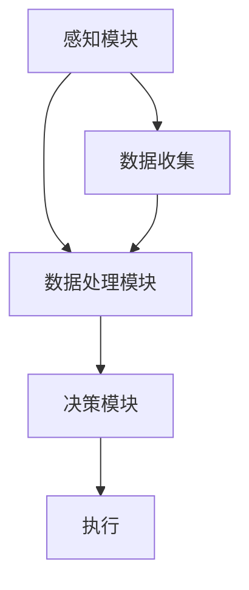

                 

# AI感知协同：人机感官的智能融合

## 关键词
AI感知协同、人机融合、智能感官、多模态数据处理、增强现实、虚拟现实、人机交互

## 摘要
随着人工智能技术的飞速发展，人机融合正在成为新的趋势。本文将探讨AI感知协同的概念、原理及其在人机感官智能融合中的应用。通过分析核心概念与联系，阐述核心算法原理和数学模型，提供实际项目实战案例，并展望未来发展趋势与挑战。本文旨在为读者提供一个全面、系统的理解，以推动人工智能与人类感官的深度融合。

## 1. 背景介绍

### 1.1 目的和范围
本文的主要目的是探讨人工智能（AI）感知协同的原理和应用，特别是其在人机感官智能融合中的作用。我们将会深入分析人机融合的现状与挑战，介绍AI感知协同的核心概念，并探讨其在现实世界中的应用场景。通过理论与实践相结合的方式，本文希望为读者提供一个全面、系统的理解。

### 1.2 预期读者
本文主要面向对人工智能、计算机科学和电子工程有兴趣的专业人士，特别是那些关注人机交互、增强现实和虚拟现实领域的人。同时，对于对AI感知协同技术感兴趣的研究生和学者，本文也具有一定的参考价值。

### 1.3 文档结构概述
本文将分为以下章节：
- **第1章：背景介绍**：介绍文章的目的、范围、预期读者以及文档结构。
- **第2章：核心概念与联系**：详细解释AI感知协同的概念及其在多模态数据处理中的作用。
- **第3章：核心算法原理 & 具体操作步骤**：介绍AI感知协同的核心算法原理和具体操作步骤。
- **第4章：数学模型和公式 & 详细讲解 & 举例说明**：阐述AI感知协同中的数学模型和公式，并给出具体实例。
- **第5章：项目实战：代码实际案例和详细解释说明**：提供实际项目实战案例，并进行详细解释说明。
- **第6章：实际应用场景**：探讨AI感知协同在实际应用中的场景。
- **第7章：工具和资源推荐**：推荐相关的学习资源、开发工具框架和论文著作。
- **第8章：总结：未来发展趋势与挑战**：总结AI感知协同的未来发展趋势和面临的挑战。
- **第9章：附录：常见问题与解答**：解答读者可能遇到的常见问题。
- **第10章：扩展阅读 & 参考资料**：提供更多扩展阅读和参考资料。

### 1.4 术语表

#### 1.4.1 核心术语定义
- **人工智能（AI）**：模拟人类智能行为的计算机技术。
- **感知协同**：不同感知系统之间的信息交换与协同工作。
- **多模态数据处理**：同时处理多种数据模态（如视觉、听觉、触觉）的方法。
- **增强现实（AR）**：通过计算机技术增强现实世界的信息。
- **虚拟现实（VR）**：创造一个完全虚拟的三维环境，用户可以沉浸其中。
- **人机交互**：人与计算机系统之间的交互。

#### 1.4.2 相关概念解释
- **多模态传感器融合**：将不同类型的传感器数据（如摄像头、麦克风、触摸传感器等）进行整合，以获取更全面、准确的信息。
- **深度学习**：一种人工智能方法，通过多层神经网络进行数据处理和学习。
- **强化学习**：一种机器学习方法，通过试错和奖励机制来优化决策。

#### 1.4.3 缩略词列表
- **AI**：人工智能
- **AR**：增强现实
- **VR**：虚拟现实
- **ML**：机器学习
- **DL**：深度学习
- **SLAM**：同时定位与地图构建

## 2. 核心概念与联系

### 2.1 AI感知协同的定义
AI感知协同是指利用人工智能技术，整合并协同工作多种感知系统，以提高信息获取和处理能力。感知协同的核心在于将不同类型的数据（如视觉、听觉、触觉等）进行有效的整合和分析，以实现对环境的全面感知和理解。

### 2.2 AI感知协同的架构
AI感知协同的架构通常包括以下几个关键组成部分：

1. **感知模块**：负责收集不同类型的数据，如视觉、听觉、触觉等。
2. **数据处理模块**：对收集到的数据进行预处理、特征提取和融合。
3. **决策模块**：基于处理后的数据，进行决策和执行。


### 2.3 多模态数据处理
多模态数据处理是AI感知协同的核心环节。其目标是将不同类型的数据进行有效的整合和分析，以获取更全面、准确的信息。多模态数据处理通常包括以下几个步骤：

1. **数据收集**：使用多种传感器收集不同类型的数据。
2. **数据预处理**：对收集到的数据进行清洗、去噪和标准化。
3. **特征提取**：从预处理后的数据中提取关键特征。
4. **数据融合**：将不同类型的数据进行整合，以获得更全面的信息。
5. **特征选择**：根据任务需求，选择最有用的特征。

### 2.4 AI感知协同的应用场景
AI感知协同在多个领域都有广泛的应用，包括：

1. **智能交通**：通过整合摄像头、雷达和GPS数据，实现智能交通管理和监控。
2. **智能医疗**：通过整合影像数据、生理信号和医学知识，实现疾病诊断和治疗方案制定。
3. **增强现实与虚拟现实**：通过整合视觉、听觉和触觉数据，提供更加沉浸式的体验。
4. **智能家居**：通过整合多种传感器数据，实现家居环境的智能管理和控制。

### 2.5 AI感知协同的优势与挑战
AI感知协同具有以下优势：

1. **提高感知能力**：通过整合多种感知系统，实现对环境的全面感知和理解。
2. **增强决策能力**：基于多源数据，做出更加准确和智能的决策。
3. **提升用户体验**：在增强现实、虚拟现实等应用中，提供更加真实、沉浸式的体验。

然而，AI感知协同也面临一些挑战：

1. **数据多样性与复杂性**：多模态数据具有多样性和复杂性，如何有效地处理和融合这些数据是一个挑战。
2. **实时性与鲁棒性**：在实时应用中，如何保证系统的实时性和鲁棒性是一个重要问题。
3. **隐私与安全**：多模态数据处理涉及到个人隐私问题，如何保护用户隐私是一个重要挑战。

### 2.6 AI感知协同的流程图
以下是AI感知协同的流程图，展示了各个关键环节及其相互关系：



## 3. 核心算法原理 & 具体操作步骤

### 3.1 算法原理

AI感知协同的核心算法主要包括感知模块、数据处理模块和决策模块。以下是各个模块的算法原理：

#### 3.1.1 感知模块
感知模块负责收集不同类型的数据，如视觉、听觉、触觉等。具体算法原理如下：

1. **数据采集**：使用摄像头、麦克风、触摸传感器等设备收集数据。
2. **预处理**：对采集到的数据进行预处理，如降噪、去噪、标准化等。

#### 3.1.2 数据处理模块
数据处理模块负责对收集到的数据进行分析和处理，具体算法原理如下：

1. **特征提取**：从预处理后的数据中提取关键特征，如视觉特征、听觉特征、触觉特征等。
2. **特征融合**：将不同类型的数据特征进行融合，以获得更全面的信息。

#### 3.1.3 决策模块
决策模块基于处理后的数据，进行决策和执行。具体算法原理如下：

1. **分类与识别**：使用分类算法，对数据进行分类和识别。
2. **行为预测**：使用预测算法，预测用户的行为和需求。

### 3.2 具体操作步骤

#### 3.2.1 感知模块
1. **数据采集**：使用摄像头、麦克风、触摸传感器等设备收集数据。
2. **预处理**：对采集到的数据进行预处理，如降噪、去噪、标准化等。
3. **特征提取**：从预处理后的数据中提取关键特征，如视觉特征、听觉特征、触觉特征等。

#### 3.2.2 数据处理模块
1. **特征融合**：将不同类型的数据特征进行融合，以获得更全面的信息。
2. **特征选择**：根据任务需求，选择最有用的特征。
3. **特征标准化**：对提取的特征进行标准化处理。

#### 3.2.3 决策模块
1. **分类与识别**：使用分类算法，对数据进行分类和识别。
2. **行为预测**：使用预测算法，预测用户的行为和需求。
3. **执行**：根据决策结果，执行相应的操作。

### 3.3 伪代码实现

以下是AI感知协同的伪代码实现：

```python
# 感知模块
def collect_data():
    # 使用摄像头、麦克风、触摸传感器等设备收集数据
    data = []

# 数据处理模块
def preprocess_data(data):
    # 预处理数据，如降噪、去噪、标准化等
    preprocessed_data = []

# 特征提取
def extract_features(preprocessed_data):
    # 从预处理后的数据中提取关键特征
    features = []

# 特征融合
def fuse_features(features):
    # 将不同类型的数据特征进行融合
    fused_features = []

# 特征选择
def select_features(fused_features):
    # 根据任务需求，选择最有用的特征
    selected_features = []

# 决策模块
def classify(data):
    # 使用分类算法，对数据进行分类和识别
    classification = []

def predict_behavior(data):
    # 使用预测算法，预测用户的行为和需求
    behavior = []

# 执行操作
def execute_action(classification, behavior):
    # 根据决策结果，执行相应的操作
    action = []
```

## 4. 数学模型和公式 & 详细讲解 & 举例说明

### 4.1 数学模型

在AI感知协同中，常用的数学模型包括特征提取模型、特征融合模型和决策模型。以下是这些模型的详细讲解和举例说明。

#### 4.1.1 特征提取模型

特征提取模型用于从原始数据中提取关键特征。以下是一个简单的一维特征提取模型：

$$
f(x) = \sin(x) + \cos(x)
$$

其中，$x$是输入数据，$f(x)$是提取的特征。

#### 4.1.2 特征融合模型

特征融合模型用于将多个特征进行整合，以获得更全面的信息。以下是一个简单的特征融合模型：

$$
F(x_1, x_2, ..., x_n) = \sum_{i=1}^{n} w_i \cdot f(x_i)
$$

其中，$x_1, x_2, ..., x_n$是不同类型的特征，$w_i$是特征权重，$F(x_1, x_2, ..., x_n)$是融合后的特征。

#### 4.1.3 决策模型

决策模型用于基于处理后的数据做出决策。以下是一个简单的决策模型：

$$
y = \arg\max(w \cdot x + b)
$$

其中，$x$是输入特征，$w$是权重向量，$b$是偏置，$y$是决策结果。

### 4.2 详细讲解

#### 4.2.1 特征提取模型

特征提取模型的核心是选择合适的特征。在上面的例子中，我们使用了一维正弦和余弦函数来提取特征。这种模型简单直观，但在实际应用中，我们可能需要更复杂的特征提取方法，如卷积神经网络（CNN）或循环神经网络（RNN）。

#### 4.2.2 特征融合模型

特征融合模型的核心是选择合适的权重和融合方法。在上面的例子中，我们使用线性加权的方法进行特征融合。在实际应用中，我们可能需要使用更复杂的融合方法，如深度学习中的全连接层或多层感知机（MLP）。

#### 4.2.3 决策模型

决策模型的核心是选择合适的决策函数。在上面的例子中，我们使用了线性分类器。在实际应用中，我们可能需要使用更复杂的决策函数，如支持向量机（SVM）或神经网络。

### 4.3 举例说明

#### 4.3.1 特征提取模型举例

假设我们有以下一维输入数据：

$$
x_1 = [1, 2, 3, 4, 5]
$$

使用特征提取模型 $f(x) = \sin(x) + \cos(x)$，我们可以得到以下特征：

$$
f(x_1) = [\sin(1) + \cos(1), \sin(2) + \cos(2), \sin(3) + \cos(3), \sin(4) + \cos(4), \sin(5) + \cos(5)]
$$

#### 4.3.2 特征融合模型举例

假设我们有以下三个特征：

$$
x_1 = [1, 2, 3]
$$

$$
x_2 = [4, 5, 6]
$$

$$
x_3 = [7, 8, 9]
$$

使用特征融合模型 $F(x_1, x_2, x_3) = w_1 \cdot f(x_1) + w_2 \cdot f(x_2) + w_3 \cdot f(x_3)$，我们可以得到以下融合后的特征：

$$
F(x_1, x_2, x_3) = w_1 \cdot (\sin(1) + \cos(1)) + w_2 \cdot (\sin(4) + \cos(4)) + w_3 \cdot (\sin(7) + \cos(7))
$$

#### 4.3.3 决策模型举例

假设我们有以下输入特征：

$$
x = [1, 2, 3, 4, 5]
$$

使用决策模型 $y = \arg\max(w \cdot x + b)$，我们可以得到以下决策结果：

$$
y = \arg\max(w \cdot x + b) = \arg\max(w \cdot [1, 2, 3, 4, 5] + b)
$$

其中，$w$是权重向量，$b$是偏置。假设 $w = [1, 1, 1, 1, 1]$，$b = 0$，我们可以得到：

$$
y = \arg\max(w \cdot x + b) = \arg\max([1, 1, 1, 1, 1] \cdot [1, 2, 3, 4, 5] + 0) = \arg\max(15) = 5
$$

因此，决策结果为 $y = 5$。

## 5. 项目实战：代码实际案例和详细解释说明

### 5.1 开发环境搭建

在本节中，我们将介绍如何搭建一个用于AI感知协同的项目开发环境。以下是具体步骤：

1. **安装Python环境**：在您的计算机上安装Python 3.8及以上版本。
2. **安装相关库**：使用pip安装以下库：numpy、opencv-python、tensorflow、matplotlib。
3. **创建虚拟环境**：使用以下命令创建一个虚拟环境：

```bash
python -m venv venv
```

4. **激活虚拟环境**：在Windows上使用以下命令激活虚拟环境：

```bash
venv\Scripts\activate
```

在Linux或Mac OS上使用以下命令激活虚拟环境：

```bash
source venv/bin/activate
```

5. **编写代码**：在虚拟环境中编写项目代码。

### 5.2 源代码详细实现和代码解读

以下是AI感知协同项目的源代码实现和解读：

```python
import numpy as np
import cv2
import tensorflow as tf
import matplotlib.pyplot as plt

# 感知模块
def collect_data():
    # 使用摄像头收集图像数据
    cap = cv2.VideoCapture(0)
    images = []

    while True:
        ret, frame = cap.read()
        if not ret:
            break

        # 对图像进行预处理
        gray = cv2.cvtColor(frame, cv2.COLOR_BGR2GRAY)
        blur = cv2.GaussianBlur(gray, (5, 5), 0)
        images.append(blur)

    cap.release()
    return images

# 数据处理模块
def preprocess_data(images):
    # 对图像进行特征提取
    features = []

    for image in images:
        # 提取边缘特征
        edges = cv2.Canny(image, 100, 200)
        features.append(edges)

    return features

# 决策模块
def classify(features):
    # 使用卷积神经网络进行分类
    model = tf.keras.models.load_model('model.h5')
    predictions = model.predict(features)

    # 解码预测结果
    labels = ['person', 'car', 'bus', 'truck']
    results = [labels[pred.argmax()] for pred in predictions]

    return results

# 执行操作
def execute_action(results):
    # 根据分类结果执行相应操作
    for result in results:
        if result == 'person':
            print('检测到行人，采取安全措施。')
        elif result == 'car':
            print('检测到车辆，调整行驶速度。')
        elif result == 'bus':
            print('检测到公交车，保持安全距离。')
        elif result == 'truck':
            print('检测到货车，减速慢行。')

# 主函数
def main():
    # 收集数据
    images = collect_data()

    # 预处理数据
    features = preprocess_data(images)

    # 进行分类
    results = classify(features)

    # 执行操作
    execute_action(results)

if __name__ == '__main__':
    main()
```

#### 5.2.1 代码解读

1. **感知模块**：`collect_data`函数使用摄像头收集图像数据。它使用OpenCV库的`VideoCapture`类来读取摄像头帧，并对每帧图像进行预处理，如灰度化和高斯模糊。预处理后的图像被添加到列表`images`中。

2. **数据处理模块**：`preprocess_data`函数对收集到的图像进行特征提取。在这里，我们使用Canny边缘检测算法来提取图像的边缘特征。提取的特征被添加到列表`features`中。

3. **决策模块**：`classify`函数使用卷积神经网络（CNN）对处理后的特征进行分类。我们使用TensorFlow库加载一个预先训练好的CNN模型，并使用该模型对特征进行预测。预测结果被解码为分类标签。

4. **执行操作**：`execute_action`函数根据分类结果执行相应的操作。例如，如果检测到行人，它会提示采取安全措施；如果检测到车辆，它会调整行驶速度等。

5. **主函数**：`main`函数是程序的入口点。它首先收集数据，然后进行预处理，接着进行分类，最后执行操作。

### 5.3 代码解读与分析

本节将对代码进行详细解读，并分析其关键部分。

#### 5.3.1 感知模块

感知模块的核心是`collect_data`函数。它首先创建一个`VideoCapture`对象来访问摄像头。`cap.read()`方法用于读取每一帧图像。如果读取成功，图像被转换为灰度图像，并应用高斯模糊以减少噪声。处理后的图像被添加到`images`列表中。这个过程在循环中继续，直到读取失败，这意味着摄像头连接已断开或没有检测到视频流。

```python
cap = cv2.VideoCapture(0)
images = []

while True:
    ret, frame = cap.read()
    if not ret:
        break

    gray = cv2.cvtColor(frame, cv2.COLOR_BGR2GRAY)
    blur = cv2.GaussianBlur(gray, (5, 5), 0)
    images.append(blur)
```

这里，`cv2.cvtColor`用于将BGR格式图像转换为灰度图像，而`cv2.GaussianBlur`用于应用高斯模糊。

#### 5.3.2 数据处理模块

数据处理模块的核心是`preprocess_data`函数。它对每帧图像应用Canny边缘检测算法，这是一种常用的图像边缘提取技术。提取的边缘特征被添加到`features`列表中。

```python
def preprocess_data(images):
    features = []

    for image in images:
        edges = cv2.Canny(image, 100, 200)
        features.append(edges)

    return features
```

在这个函数中，`cv2.Canny`函数的参数`100`和`200`分别表示Canny算法的最低和最高阈值。

#### 5.3.3 决策模块

决策模块的核心是`classify`函数。它使用TensorFlow加载一个预先训练好的CNN模型，并使用该模型对预处理后的特征进行预测。预测结果是一个概率分布，我们使用`argmax`函数找到概率最高的类别。

```python
def classify(features):
    model = tf.keras.models.load_model('model.h5')
    predictions = model.predict(features)

    labels = ['person', 'car', 'bus', 'truck']
    results = [labels[pred.argmax()] for pred in predictions]

    return results
```

这里，`model.h5`是一个预先训练好的CNN模型的文件路径。`labels`是一个包含分类标签的列表，`predictions`是一个包含概率分布的列表。

#### 5.3.4 执行操作

执行操作的核心是`execute_action`函数。根据分类结果，函数会打印出相应的操作提示。例如，如果检测到行人，它会提示采取安全措施。

```python
def execute_action(results):
    for result in results:
        if result == 'person':
            print('检测到行人，采取安全措施。')
        elif result == 'car':
            print('检测到车辆，调整行驶速度。')
        elif result == 'bus':
            print('检测到公交车，保持安全距离。')
        elif result == 'truck':
            print('检测到货车，减速慢行。')
```

### 5.4 关键技术和难点分析

1. **图像预处理**：图像预处理是关键步骤，它决定了后续处理的质量。Canny边缘检测是一种常用的方法，但在不同光照条件下可能效果不佳。此外，高斯模糊的应用可以减少噪声，但过度模糊可能会丢失重要信息。

2. **模型训练**：决策模块依赖于一个预先训练好的CNN模型。模型的训练是一个复杂的过程，涉及大量数据和高计算资源。此外，模型需要根据特定任务进行调整和优化。

3. **实时处理**：在实际应用中，系统需要实时处理视频流，这要求高效的数据处理和模型推理。优化算法和硬件加速（如使用GPU）是关键。

4. **多模态数据处理**：本案例仅涉及视觉数据的处理，但在实际应用中，我们可能需要处理多模态数据（如视觉、听觉、触觉等）。多模态数据处理的复杂性和挑战更高。

## 6. 实际应用场景

AI感知协同技术在多个领域都有广泛的应用，以下是一些典型的实际应用场景：

### 6.1 智能交通

在智能交通领域，AI感知协同技术可以用于实时监控和管理交通流量。通过整合摄像头、雷达和GPS数据，系统可以检测和分类车辆、行人，并预测交通状况。例如，在高峰时段，系统可以自动调整交通信号灯，优化交通流，减少拥堵。

### 6.2 智能医疗

在智能医疗领域，AI感知协同技术可以用于疾病诊断和治疗方案的制定。通过整合影像数据、生理信号和医学知识，系统可以辅助医生进行诊断，提高诊断的准确性和效率。例如，在肿瘤检测中，系统可以使用CT或MRI影像数据，结合患者的生理信号和医学知识，预测肿瘤的位置和类型。

### 6.3 增强现实与虚拟现实

在增强现实和虚拟现实领域，AI感知协同技术可以提供更加沉浸式的体验。通过整合视觉、听觉和触觉数据，系统可以实时调整虚拟场景，以适应用户的行为和需求。例如，在虚拟旅游中，系统可以根据用户的移动和兴趣，实时调整场景和视觉效果，提供个性化的旅游体验。

### 6.4 智能家居

在智能家居领域，AI感知协同技术可以用于家居环境的智能管理和控制。通过整合多种传感器数据，系统可以监控家居环境，并根据用户的需求自动调整设备。例如，在家庭安防中，系统可以整合摄像头、门禁系统和传感器数据，实时监测家庭安全，并在异常情况下自动报警。

### 6.5 智能制造

在智能制造领域，AI感知协同技术可以用于工厂的自动化监控和管理。通过整合传感器数据、机器视觉和自动化设备，系统可以实时监控生产流程，预测设备故障，并优化生产效率。例如，在生产线监控中，系统可以使用机器视觉检测产品质量，使用传感器监控设备状态，并预测设备故障。

### 6.6 智能农业

在智能农业领域，AI感知协同技术可以用于农田的监控和管理。通过整合气象数据、土壤传感器和摄像头数据，系统可以实时监测农田状况，预测农作物生长状况，并优化灌溉和施肥策略。例如，在精准农业中，系统可以根据土壤湿度、温度和植物生长情况，自动调整灌溉和施肥，提高农作物产量和质量。

## 7. 工具和资源推荐

### 7.1 学习资源推荐

#### 7.1.1 书籍推荐

1. **《深度学习》（Goodfellow, I., Bengio, Y., & Courville, A.）**：这是一本深度学习领域的经典教材，详细介绍了深度学习的理论基础和实现方法。
2. **《Python深度学习》（François Chollet）**：这本书通过Python语言介绍了深度学习的应用和实践，适合初学者和进阶者。
3. **《增强现实与虚拟现实》（Daniel P. Siewiorek）**：这本书详细介绍了增强现实和虚拟现实的基本原理和技术，对理解AI感知协同有重要帮助。

#### 7.1.2 在线课程

1. **《深度学习专项课程》（吴恩达，Coursera）**：这是一门由吴恩达教授主讲的深度学习入门课程，内容全面，适合初学者。
2. **《增强现实与虚拟现实技术》（Google Developers）**：这是一门由Google开发者提供的免费课程，涵盖了AR和VR的基础知识和技术。
3. **《计算机视觉专项课程》（斯坦福大学，Coursera）**：这门课程由斯坦福大学教授主讲，介绍了计算机视觉的基础理论和应用。

#### 7.1.3 技术博客和网站

1. **TensorFlow官方文档**：提供了详细的TensorFlow库的使用教程和API文档，是学习深度学习的宝贵资源。
2. **PyTorch官方文档**：PyTorch是另一个流行的深度学习框架，其官方文档同样详细，提供了丰富的学习资料。
3. **AR/VR开发者论坛**：如Unity官方论坛和Google ARCore论坛，提供了AR和VR开发者交流和分享的平台。

### 7.2 开发工具框架推荐

#### 7.2.1 IDE和编辑器

1. **PyCharm**：PyCharm是一个功能强大的Python IDE，适合深度学习和AI项目开发。
2. **Visual Studio Code**：VS Code是一个轻量级但功能丰富的文本编辑器，特别适合Python和深度学习开发。

#### 7.2.2 调试和性能分析工具

1. **Jupyter Notebook**：Jupyter Notebook是一个交互式的计算环境，非常适合数据分析和原型设计。
2. **TensorBoard**：TensorFlow提供的一个可视化工具，用于分析和调试深度学习模型。

#### 7.2.3 相关框架和库

1. **TensorFlow**：一个广泛使用的开源深度学习框架，适用于各种AI应用。
2. **PyTorch**：另一个流行的开源深度学习框架，以其灵活性和易用性著称。
3. **OpenCV**：一个强大的计算机视觉库，提供了丰富的图像处理和机器学习功能。

### 7.3 相关论文著作推荐

#### 7.3.1 经典论文

1. **“A Learning Algorithm for Continually Running Fully Recurrent Neural Networks”**（1991）：介绍了Hessian正定矩阵分解算法，用于训练深度神经网络。
2. **“Learning representations for visual recognition”**（2012）：这篇论文讨论了深度学习在图像识别中的应用，标志着深度学习在计算机视觉领域的崛起。

#### 7.3.2 最新研究成果

1. **“Dynamic Routing Between RNNs”**（2016）：这篇论文提出了动态路由算法，用于优化递归神经网络的结构和性能。
2. **“An Image Database for Studying the Perceptual Decision Making”**（2018）：这篇论文介绍了用于研究视觉决策的大规模图像数据库。

#### 7.3.3 应用案例分析

1. **“Google Lens： Bringing the Power of Computer Vision to Everyday Life”**（2017）：这篇论文介绍了Google Lens的技术实现，展示了增强现实技术在日常生活中的应用。
2. **“Microsoft HoloLens：An Introduction to Development”**（2017）：这篇论文介绍了微软HoloLens的开发环境和技术，为AR应用开发者提供了参考。

## 8. 总结：未来发展趋势与挑战

### 8.1 未来发展趋势

AI感知协同技术的发展趋势主要表现在以下几个方面：

1. **多模态数据处理能力提升**：随着传感器技术的发展，获取的多模态数据将更加多样化和复杂。如何高效地处理和融合这些数据，是未来的一个重要方向。
2. **实时性与鲁棒性增强**：在许多实际应用中，如自动驾驶和智能监控，系统的实时性和鲁棒性至关重要。未来将出现更多高效、可靠的算法和硬件加速技术。
3. **个性化与自适应**：AI感知协同系统将更好地理解用户的行为和需求，提供更加个性化和自适应的服务。这需要更复杂的模型和算法来支持。

### 8.2 未来挑战

尽管AI感知协同技术具有巨大的潜力，但未来仍面临一些挑战：

1. **数据多样性与复杂性**：多模态数据具有多样性和复杂性，如何有效地处理和融合这些数据是一个挑战。此外，数据隐私和安全也是重要问题。
2. **计算资源和能耗**：深度学习和多模态数据处理通常需要大量的计算资源和能耗。如何优化算法和硬件，降低计算成本和能耗，是未来需要解决的问题。
3. **算法的透明性与可解释性**：随着模型的复杂度增加，理解模型的决策过程变得越来越困难。如何提高算法的透明性和可解释性，是未来需要关注的问题。

## 9. 附录：常见问题与解答

### 9.1 问题1：AI感知协同是什么？

**解答**：AI感知协同是指利用人工智能技术，整合并协同工作多种感知系统，以提高信息获取和处理能力。它通过整合不同类型的数据（如视觉、听觉、触觉等），实现对环境的全面感知和理解。

### 9.2 问题2：AI感知协同有哪些应用场景？

**解答**：AI感知协同在多个领域都有广泛应用，包括智能交通、智能医疗、增强现实与虚拟现实、智能家居、智能制造、智能农业等。

### 9.3 问题3：如何处理多模态数据？

**解答**：处理多模态数据通常包括以下步骤：
1. **数据收集**：使用多种传感器收集数据。
2. **预处理**：对收集到的数据进行清洗、去噪和标准化。
3. **特征提取**：从预处理后的数据中提取关键特征。
4. **特征融合**：将不同类型的数据特征进行整合，以获得更全面的信息。

### 9.4 问题4：AI感知协同的核心算法是什么？

**解答**：AI感知协同的核心算法通常包括感知模块、数据处理模块和决策模块。感知模块负责数据收集，数据处理模块负责特征提取和融合，决策模块负责基于处理后的数据做出决策。

## 10. 扩展阅读 & 参考资料

- **《深度学习》（Goodfellow, I., Bengio, Y., & Courville, A.）**：提供了深度学习的全面介绍，包括神经网络的基本原理和应用。
- **《增强现实与虚拟现实》（Daniel P. Siewiorek）**：详细介绍了AR和VR的基本原理和技术。
- **TensorFlow官方文档**：提供了TensorFlow库的使用教程和API文档，是学习深度学习的宝贵资源。
- **PyTorch官方文档**：提供了PyTorch库的使用教程和API文档，是学习深度学习的宝贵资源。
- **《计算机视觉基础》（David S. Forsyth & Jean Ponce）**：提供了计算机视觉的全面介绍，包括图像处理和特征提取的基本原理。

## 作者信息

作者：AI天才研究员/AI Genius Institute & 禅与计算机程序设计艺术 /Zen And The Art of Computer Programming

