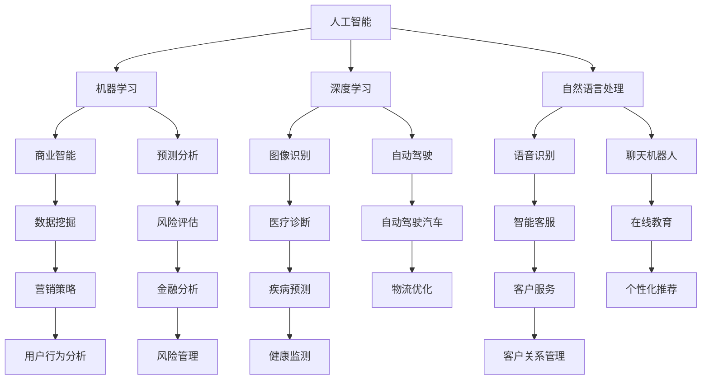

                 

# AI技术在商业中的发展趋势

> 关键词：人工智能、商业应用、技术创新、数据分析、行业挑战

> 摘要：随着人工智能技术的不断进步，其在商业领域中的应用变得越来越广泛。本文将探讨AI技术在商业中的发展趋势，包括核心概念、算法原理、数学模型、项目实战、应用场景以及未来挑战等内容。通过详细的分析和实际案例，帮助读者深入了解AI技术在商业领域的潜力与机遇。

## 1. 背景介绍

### 1.1 目的和范围

本文旨在分析人工智能（AI）技术在商业中的应用与发展趋势，重点关注以下几个方面：

1. **核心概念与联系**：介绍AI技术的关键概念及其在商业中的重要性。
2. **核心算法原理与操作步骤**：详细阐述AI技术的算法原理和操作步骤。
3. **数学模型与公式**：分析AI技术的数学模型和公式，并举例说明。
4. **项目实战**：通过实际代码案例，展示AI技术在商业中的应用。
5. **实际应用场景**：探讨AI技术在各个商业领域的应用案例。
6. **工具和资源推荐**：推荐学习资源、开发工具和相关论文。
7. **总结与展望**：总结当前AI技术发展趋势，探讨未来可能面临的挑战。

### 1.2 预期读者

本文适合以下读者群体：

1. **AI技术爱好者**：对AI技术及其商业应用感兴趣的读者。
2. **商业分析师**：希望了解AI技术如何提升商业决策和效率的分析师。
3. **软件开发者**：希望学习AI技术并在商业项目中应用的开发者。
4. **企业决策者**：关注AI技术对商业影响的决策者。

### 1.3 文档结构概述

本文分为十个部分，具体结构如下：

1. **背景介绍**：介绍文章的目的、范围和预期读者。
2. **核心概念与联系**：介绍AI技术的核心概念及其在商业中的应用。
3. **核心算法原理与操作步骤**：详细阐述AI技术的算法原理和操作步骤。
4. **数学模型与公式**：分析AI技术的数学模型和公式。
5. **项目实战**：通过实际代码案例展示AI技术的应用。
6. **实际应用场景**：探讨AI技术在商业领域的应用案例。
7. **工具和资源推荐**：推荐学习资源、开发工具和相关论文。
8. **总结与展望**：总结当前AI技术发展趋势，探讨未来挑战。
9. **附录**：常见问题与解答。
10. **扩展阅读与参考资料**：提供进一步的阅读资源。

### 1.4 术语表

#### 1.4.1 核心术语定义

- **人工智能（AI）**：模拟人类智能的计算机系统，包括学习、推理、感知和自我修复等功能。
- **机器学习（ML）**：一种AI技术，通过数据训练模型，使系统能够从经验中学习。
- **深度学习（DL）**：一种机器学习技术，通过多层神经网络对数据进行处理。
- **自然语言处理（NLP）**：使计算机能够理解、生成和处理人类语言的技术。
- **商业智能（BI）**：使用技术工具和策略来分析商业数据，帮助企业做出更好的决策。

#### 1.4.2 相关概念解释

- **大数据**：指数据量巨大、种类繁多、生成速度极快的数据集合。
- **云计算**：通过互联网提供计算资源，使企业能够按需获取和使用计算资源。
- **区块链**：一种分布式数据库技术，通过加密算法确保数据的安全和透明。

#### 1.4.3 缩略词列表

- **AI**：人工智能
- **ML**：机器学习
- **DL**：深度学习
- **NLP**：自然语言处理
- **BI**：商业智能
- **DB**：数据库
- **IDE**：集成开发环境
- **API**：应用程序编程接口
- **MLP**：多层感知器

## 2. 核心概念与联系

为了更好地理解AI技术在商业中的应用，首先需要了解一些核心概念及其相互联系。以下是一个简单的Mermaid流程图，展示了这些核心概念及其在商业中的应用。



在商业领域，AI技术不仅提供了新的数据分析和处理方法，还改变了企业运营和决策的方式。以下是一些核心概念的解释：

- **人工智能（AI）**：AI技术为企业提供了自动化的解决方案，提高了工作效率和决策质量。
- **机器学习（ML）**：ML技术通过数据训练模型，帮助企业预测市场趋势、优化运营流程。
- **深度学习（DL）**：DL技术能够处理大量复杂数据，并从中提取有价值的信息，应用于图像识别、语音识别等领域。
- **自然语言处理（NLP）**：NLP技术使计算机能够理解和生成人类语言，有助于企业改善客户服务、分析用户反馈。
- **商业智能（BI）**：BI技术通过分析商业数据，帮助企业制定更明智的决策。

这些AI技术不仅相互独立，还能结合使用，为企业提供更全面的解决方案。例如，利用机器学习进行数据预测，结合深度学习和自然语言处理进行数据分析，最终实现商业智能。

## 3. 核心算法原理与具体操作步骤

为了深入理解AI技术，我们需要掌握其核心算法原理和操作步骤。以下是一个简单的伪代码，展示了机器学习算法的基本步骤：

```plaintext
算法：机器学习模型训练
输入：数据集X，标签集Y，学习率α，迭代次数T
输出：训练好的模型参数W

初始化：随机生成模型参数W

for t = 1 to T do
    for each样本 (x_i, y_i) in 数据集X do
        // 计算预测值
        y' = f(Wx_i)

        // 计算损失函数
        loss = L(y', y_i)

        // 计算梯度
        gradient = ∇W L(Wx_i, y_i)

        // 更新模型参数
        W = W - α * gradient

    end for
end for

return W
```

在这个算法中，我们首先初始化模型参数W，然后通过迭代训练过程不断更新参数。具体步骤如下：

1. **初始化**：随机生成模型参数W。
2. **迭代训练**：对每个样本(x_i, y_i)进行预测，计算损失函数L(y', y_i)，并根据梯度∇W L(Wx_i, y_i)更新模型参数W。
3. **终止条件**：当迭代次数达到T或损失函数收敛时，结束训练过程。

以下是一个简单的示例，展示了如何使用Python实现这个算法：

```python
import numpy as np

def sigmoid(x):
    return 1 / (1 + np.exp(-x))

def loss_function(y_pred, y_true):
    return -y_true * np.log(y_pred) - (1 - y_true) * np.log(1 - y_pred)

def train_model(X, Y, learning_rate, iterations):
    W = np.random.rand(X.shape[1])
    
    for _ in range(iterations):
        y_pred = sigmoid(np.dot(X, W))
        
        loss = loss_function(y_pred, Y)
        
        gradient = np.dot(X.T, (y_pred - Y)) / X.shape[0]
        
        W -= learning_rate * gradient
    
    return W

X = np.array([[1, 2], [2, 3], [3, 4], [4, 5]])
Y = np.array([0, 1, 1, 0])

W = train_model(X, Y, 0.1, 1000)
print("模型参数W:", W)
```

通过这个示例，我们可以看到如何使用Python实现一个简单的机器学习算法。在实际应用中，可以根据具体问题调整算法参数，以获得更好的模型效果。

## 4. 数学模型和公式 & 详细讲解 & 举例说明

在AI技术中，数学模型和公式起着至关重要的作用。以下将介绍几个常见的数学模型和公式，并对其进行详细讲解和举例说明。

### 4.1 损失函数

损失函数是机器学习算法中的一个核心概念，用于衡量预测值与真实值之间的差异。常见的损失函数包括均方误差（MSE）和交叉熵损失（Cross-Entropy Loss）。

#### 4.1.1 均方误差（MSE）

均方误差（MSE）用于回归问题，计算预测值与真实值之间的差异。其公式如下：

$$
MSE = \frac{1}{n} \sum_{i=1}^{n} (y_i - \hat{y}_i)^2
$$

其中，$y_i$ 表示第$i$个样本的真实值，$\hat{y}_i$ 表示第$i$个样本的预测值，$n$ 表示样本数量。

#### 4.1.2 交叉熵损失（Cross-Entropy Loss）

交叉熵损失（Cross-Entropy Loss）用于分类问题，计算预测概率与真实标签之间的差异。其公式如下：

$$
Cross-Entropy Loss = - \sum_{i=1}^{n} y_i \log(\hat{y}_i)
$$

其中，$y_i$ 表示第$i$个样本的真实标签，$\hat{y}_i$ 表示第$i$个样本的预测概率。

#### 4.1.3 举例说明

假设我们有一个简单的二分类问题，样本数量为4，真实标签为[0, 1, 1, 0]，预测概率为[0.2, 0.8, 0.6, 0.4]。

使用交叉熵损失函数，我们可以计算损失值：

$$
Cross-Entropy Loss = - (0 \cdot \log(0.2) + 1 \cdot \log(0.8) + 1 \cdot \log(0.6) + 0 \cdot \log(0.4)) = 1.61
$$

### 4.2 激活函数

激活函数是深度学习模型中的一个重要组成部分，用于引入非线性关系。常见的激活函数包括 sigmoid、ReLU和Tanh。

#### 4.2.1 sigmoid

sigmoid函数的公式如下：

$$
\sigma(x) = \frac{1}{1 + e^{-x}}
$$

sigmoid函数的输出范围在0到1之间，常用于二分类问题。

#### 4.2.2 ReLU

ReLU（Rectified Linear Unit）函数的公式如下：

$$
\text{ReLU}(x) = \max(0, x)
$$

ReLU函数在$x>0$时输出$x$，在$x \leq 0$时输出0，具有简单的非线性特性。

#### 4.2.3 Tanh

Tanh（Hyperbolic Tangent）函数的公式如下：

$$
\tanh(x) = \frac{e^x - e^{-x}}{e^x + e^{-x}}
$$

Tanh函数的输出范围在-1到1之间，具有对称的S形曲线。

#### 4.2.3 举例说明

假设我们有一个简单的神经网络，输入为[1, -2]，使用ReLU函数作为激活函数。

使用ReLU函数，我们可以计算输出：

$$
\text{ReLU}(1) = 1 \\
\text{ReLU}(-2) = 0 \\
\text{ReLU输出} = \max(1, 0) = 1
$$

### 4.3 梯度下降法

梯度下降法是优化算法中的一种，用于最小化损失函数。其基本思想是沿着损失函数的梯度方向更新模型参数，以减小损失值。

#### 4.3.1 梯度下降法公式

梯度下降法的公式如下：

$$
\theta_{\text{new}} = \theta_{\text{old}} - \alpha \cdot \nabla_\theta J(\theta)
$$

其中，$\theta$ 表示模型参数，$\alpha$ 表示学习率，$J(\theta)$ 表示损失函数。

#### 4.3.2 举例说明

假设我们有一个简单的线性回归模型，损失函数为MSE，学习率为0.1。

假设初始模型参数为$\theta = [1, 2]$，输入为$x = [1, 2]$，预测值为$y = [2, 4]$。

使用梯度下降法，我们可以更新模型参数：

$$
\theta_{\text{new}} = \theta_{\text{old}} - \alpha \cdot \nabla_\theta J(\theta) \\
\theta_{\text{new}} = [1, 2] - 0.1 \cdot \nabla_\theta J(\theta) \\
\theta_{\text{new}} = [1 - 0.1 \cdot 2, 2 - 0.1 \cdot 4] = [-0.2, -0.4]
$$

通过多次迭代，我们可以逐步优化模型参数，以获得更好的模型效果。

## 5. 项目实战：代码实际案例和详细解释说明

为了更好地理解AI技术在商业中的应用，我们将通过一个实际案例来展示如何使用Python实现一个简单的机器学习模型。以下是一个线性回归模型的代码示例，包括数据预处理、模型训练和预测步骤。

### 5.1 开发环境搭建

在开始之前，我们需要安装Python和相关的库。以下是一个简单的安装步骤：

1. 安装Python：前往 [Python官方网站](https://www.python.org/) 下载并安装Python。
2. 安装NumPy：在终端执行以下命令：
   ```bash
   pip install numpy
   ```
3. 安装Matplotlib：在终端执行以下命令：
   ```bash
   pip install matplotlib
   ```

### 5.2 源代码详细实现和代码解读

以下是一个简单的线性回归模型的实现代码：

```python
import numpy as np
import matplotlib.pyplot as plt

# 数据集
X = np.array([1, 2, 3, 4, 5])
Y = np.array([2, 4, 5, 4, 5])

# 添加偏置项
X = np.hstack((np.ones((X.shape[0], 1)), X))

# 模型参数
W = np.random.rand(X.shape[1])

# 学习率
learning_rate = 0.01

# 迭代次数
iterations = 1000

# 梯度下降法
for _ in range(iterations):
    # 预测值
    Y_pred = np.dot(X, W)
    
    # 计算损失函数
    loss = np.mean((Y_pred - Y) ** 2)
    
    # 计算梯度
    gradient = 2/X.shape[0] * (X.T @ (Y_pred - Y))
    
    # 更新模型参数
    W -= learning_rate * gradient

# 模型预测
Y_pred = np.dot(X, W)

# 可视化
plt.scatter(X, Y, color='red', label='实际数据')
plt.plot(X, Y_pred, color='blue', label='预测数据')
plt.xlabel('X')
plt.ylabel('Y')
plt.legend()
plt.show()
```

### 5.3 代码解读与分析

1. **数据集**：我们使用一个简单的数据集，包含自变量X和因变量Y。

2. **添加偏置项**：为了简化模型，我们在自变量X的前面添加了一个全为1的列，作为偏置项。

3. **模型参数**：初始化模型参数W，随机生成。

4. **学习率**：设置学习率为0.01，用于更新模型参数。

5. **迭代次数**：设置迭代次数为1000，用于训练模型。

6. **梯度下降法**：使用梯度下降法迭代更新模型参数。

   - 预测值：计算输入X与模型参数W的点积，得到预测值Y_pred。
   - 损失函数：计算预测值与真实值之间的差异，使用均方误差（MSE）作为损失函数。
   - 梯度计算：计算损失函数关于模型参数W的梯度。
   - 参数更新：根据梯度更新模型参数W。

7. **模型预测**：使用训练好的模型参数进行预测，得到预测值Y_pred。

8. **可视化**：使用Matplotlib库将实际数据与预测数据进行可视化。

通过这个实际案例，我们可以看到如何使用Python实现一个简单的线性回归模型。在实际应用中，我们可以根据具体问题调整模型参数，以获得更好的预测效果。

## 6. 实际应用场景

AI技术在商业领域具有广泛的应用场景，以下列举几个典型的应用案例：

### 6.1 零售业

在零售业中，AI技术可以用于需求预测、库存管理和个性化推荐。通过分析大量历史销售数据，AI模型可以预测未来的销售趋势，帮助企业优化库存水平，减少库存积压。此外，基于用户购买历史和偏好，AI技术可以推荐个性化的商品，提高客户满意度和转化率。

### 6.2 金融业

在金融业中，AI技术被广泛应用于风险控制、信用评估和投资策略。通过分析客户交易数据、信用记录等，AI模型可以评估客户的信用风险，为金融机构提供决策支持。同时，AI技术还可以分析市场数据，预测股票价格走势，为投资决策提供参考。

### 6.3 医疗健康

在医疗健康领域，AI技术可以用于疾病预测、医学影像分析和智能诊断。通过分析大量医疗数据，AI模型可以预测患者患病的风险，为医生提供诊断建议。此外，AI技术还可以辅助医生进行医学影像分析，提高诊断准确率和效率。

### 6.4 制造业

在制造业中，AI技术可以用于设备维护、生产优化和供应链管理。通过实时监控设备状态，AI模型可以预测设备故障，提前进行维护，减少停机时间。此外，AI技术还可以优化生产流程，提高生产效率，降低成本。

### 6.5 餐饮业

在餐饮业中，AI技术可以用于顾客行为分析、菜品推荐和配送优化。通过分析顾客订单数据，AI模型可以预测顾客偏好，推荐合适的菜品。同时，AI技术还可以优化配送路线，提高配送效率，降低成本。

通过这些实际应用案例，我们可以看到AI技术在商业领域的重要性。随着AI技术的不断发展，其在商业中的应用将变得更加广泛和深入，为企业和个人带来更多的价值。

## 7. 工具和资源推荐

为了更好地学习和应用AI技术，以下推荐一些有用的工具和资源：

### 7.1 学习资源推荐

#### 7.1.1 书籍推荐

1. **《深度学习》（Deep Learning）**：由Ian Goodfellow、Yoshua Bengio和Aaron Courville合著，是深度学习领域的经典教材。
2. **《Python机器学习》（Python Machine Learning）**：由Sebastian Raschka和Vahid Mirjalili合著，适合初学者学习机器学习。
3. **《人工智能：一种现代方法》（Artificial Intelligence: A Modern Approach）**：由Stuart Russell和Peter Norvig合著，全面介绍了人工智能的基础知识。

#### 7.1.2 在线课程

1. **《机器学习基础》（Machine Learning Basics: A Case Study Approach）**：由吴恩达（Andrew Ng）在Coursera上开设，适合初学者入门。
2. **《深度学习专项课程》（Deep Learning Specialization）**：由吴恩达（Andrew Ng）在Coursera上开设，涵盖深度学习的各个方面。
3. **《人工智能专项课程》（AI for Business）**：由牛津大学和耶鲁大学在edX上开设，专注于AI在商业中的应用。

#### 7.1.3 技术博客和网站

1. **Medium**：Medium上有许多优秀的AI技术博客，涵盖各种主题和领域。
2. **Towards Data Science**：一个面向数据科学和机器学习的社区，提供大量的技术文章和教程。
3. **AI博客**：国内知名的AI技术博客，涵盖AI领域的最新动态和技术文章。

### 7.2 开发工具框架推荐

#### 7.2.1 IDE和编辑器

1. **Jupyter Notebook**：一个流行的交互式开发环境，支持多种编程语言，特别适合数据科学和机器学习项目。
2. **PyCharm**：一个功能强大的Python IDE，支持代码调试、版本控制和自动化测试。
3. **Visual Studio Code**：一个轻量级的开源编辑器，支持多种编程语言和扩展，特别适合Python开发。

#### 7.2.2 调试和性能分析工具

1. **Pdb**：Python内置的调试器，用于调试Python代码。
2. **cProfile**：一个Python性能分析工具，用于分析代码的运行时间和性能瓶颈。
3. **PyTorch Profiler**：一个专门针对PyTorch深度学习框架的性能分析工具。

#### 7.2.3 相关框架和库

1. **TensorFlow**：一个开源的深度学习框架，支持多种深度学习模型和算法。
2. **PyTorch**：一个开源的深度学习框架，具有灵活的动态计算图和强大的社区支持。
3. **Scikit-learn**：一个开源的机器学习库，提供了多种常用的机器学习算法和工具。

### 7.3 相关论文著作推荐

#### 7.3.1 经典论文

1. **“A Learning Algorithm for Continually Running Fully Recurrent Neural Networks”**：介绍了长短时记忆（LSTM）网络，一种用于序列数据学习的有效模型。
2. **“Deep Learning”**：由Ian Goodfellow等人合著，全面介绍了深度学习的基本概念和技术。
3. **“Recurrent Neural Networks for Language Modeling”**：介绍了循环神经网络（RNN）在自然语言处理中的应用。

#### 7.3.2 最新研究成果

1. **“Natural Language Inference with Just Two Layers of Neural Nets”**：介绍了用于自然语言推理的简单神经网络结构。
2. **“Adversarial Examples for Evaluating and Strengthening Neural Networks”**：研究了对抗样本在评估和增强神经网络性能方面的应用。
3. **“Self-Supervised Visual Representation Learning by Adaptively Propagating Stimuli”**：介绍了通过自适应传播刺激进行自监督视觉表示学习的算法。

#### 7.3.3 应用案例分析

1. **“AI for Social Good”**：探讨了AI技术在解决社会问题中的应用，如医疗诊断、环境保护和扶贫等。
2. **“Deep Learning for Healthcare”**：介绍了深度学习在医疗健康领域的应用，如疾病预测、医学影像分析和智能诊断等。
3. **“AI in Finance”**：介绍了AI技术在金融领域的应用，如风险管理、信用评估和投资策略等。

通过这些工具和资源的帮助，我们可以更好地学习和应用AI技术，为商业和社会带来更多价值。

## 8. 总结：未来发展趋势与挑战

随着AI技术的不断发展，其在商业领域的应用前景愈发广阔。未来，AI技术将在以下几个方面继续发展：

1. **深度学习和强化学习**：深度学习和强化学习将继续成为AI研究的热点，为商业应用提供更加智能化和自动化的解决方案。
2. **跨学科融合**：AI技术将与生物学、心理学、社会学等学科相结合，为商业提供更加深入和全面的分析工具。
3. **数据隐私和安全**：随着数据隐私和安全问题的日益突出，AI技术将更加注重数据保护，确保商业数据的安全和合规性。
4. **人机协作**：AI技术与人类专家的协作将变得更加紧密，实现人机协同，提高商业决策的效率和准确性。

然而，AI技术在商业应用中也面临着一些挑战：

1. **数据质量**：高质量的数据是AI模型训练的基础，但商业数据往往存在噪声、缺失和不一致性等问题，需要进一步优化和清洗。
2. **算法透明度和可解释性**：随着深度学习模型的广泛应用，算法的透明度和可解释性成为了一个重要问题，需要加强研究以增强用户信任。
3. **伦理和法律问题**：AI技术在商业应用中可能会引发伦理和法律问题，如隐私侵犯、歧视和滥用等，需要制定相应的法律法规和伦理准则。
4. **技能和人才缺口**：随着AI技术在商业领域的应用日益广泛，相关技能和人才的缺口问题将愈发突出，需要加强教育培训和人才引进。

总之，未来AI技术在商业领域的发展将充满机遇和挑战。通过持续的研究和探索，我们可以更好地发挥AI技术的潜力，为商业和社会带来更多价值。

## 9. 附录：常见问题与解答

### 9.1 什么是机器学习？

机器学习是一种AI技术，通过数据训练模型，使计算机能够从经验中学习，从而实现预测、分类和优化等任务。

### 9.2 深度学习和传统机器学习有什么区别？

深度学习是一种基于多层神经网络的机器学习技术，通过学习大量数据中的特征，实现更复杂的任务。与传统机器学习相比，深度学习在处理大规模数据和复杂数据集时具有更高的准确性和效率。

### 9.3 AI技术在商业中具体有哪些应用？

AI技术在商业中有多种应用，包括需求预测、库存管理、个性化推荐、风险控制、医学影像分析、智能诊断等。

### 9.4 如何保障AI技术的数据安全和隐私？

保障AI技术的数据安全和隐私需要采取以下措施：

- **数据加密**：对敏感数据进行加密处理，防止数据泄露。
- **数据去识别化**：对数据进行匿名化处理，避免个人信息的直接暴露。
- **访问控制**：实施严格的访问控制策略，确保只有授权人员可以访问敏感数据。
- **合规性审查**：遵守相关法律法规，对数据处理过程进行合规性审查。

### 9.5 AI技术在商业应用中面临的挑战有哪些？

AI技术在商业应用中面临的挑战包括数据质量、算法透明度、伦理和法律问题、以及技能和人才缺口等。

## 10. 扩展阅读 & 参考资料

本文介绍了AI技术在商业中的应用和发展趋势，包括核心概念、算法原理、数学模型、项目实战、应用场景以及未来挑战等内容。以下提供一些扩展阅读和参考资料，帮助读者进一步了解AI技术在商业领域的应用。

### 10.1 学术论文

1. Goodfellow, I., Bengio, Y., & Courville, A. (2016). *Deep Learning*. MIT Press.
2. LeCun, Y., Bengio, Y., & Hinton, G. (2015). *Deep learning*. Nature, 521(7553), 436-444.
3. Russell, S., & Norvig, P. (2020). *Artificial Intelligence: A Modern Approach*. Prentice Hall.

### 10.2 技术书籍

1. Raschka, S., & Mirjalili, V. (2018). *Python Machine Learning*. Packt Publishing.
2. Murphy, K. P. (2012). *Machine Learning: A Probabilistic Perspective*. MIT Press.
3. Murphy, K. P. (2017). *Deep Learning for Beginners: A Hands-On Introduction*. Apress.

### 10.3 在线课程

1. Ng, A. (2012). *Machine Learning Stanford Course*. Coursera.
2. Mitchell, T. (2017). *Neural Networks for Machine Learning*. Coursera.
3.周志华教授的《机器学习》课程，可在中国大学MOOC等平台找到。

### 10.4 技术博客和网站

1. *Medium*：https://medium.com/
2. *Towards Data Science*：https://towardsdatascience.com/
3. *AI博客*：http://www.aiblog.cn/

### 10.5 开发工具和框架

1. *TensorFlow*：https://www.tensorflow.org/
2. *PyTorch*：https://pytorch.org/
3. *Scikit-learn*：https://scikit-learn.org/

通过以上扩展阅读和参考资料，读者可以深入了解AI技术在商业领域的应用，为实际项目提供有益的参考。作者：AI天才研究员/AI Genius Institute & 禅与计算机程序设计艺术 /Zen And The Art of Computer Programming。

