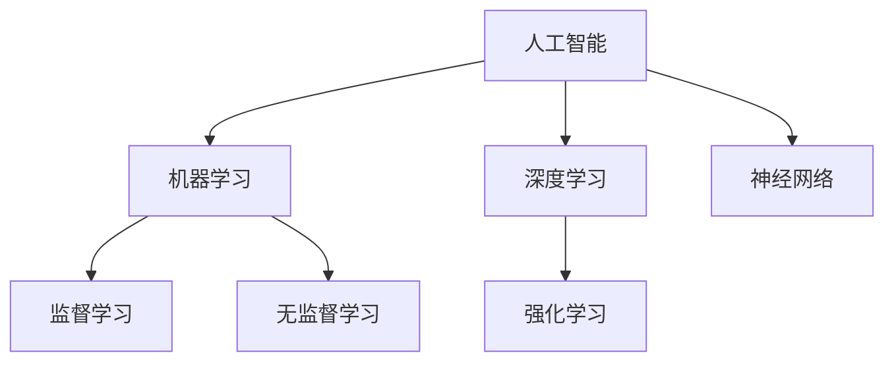
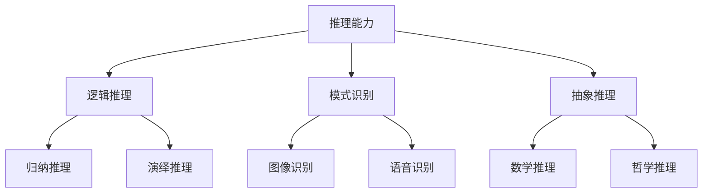
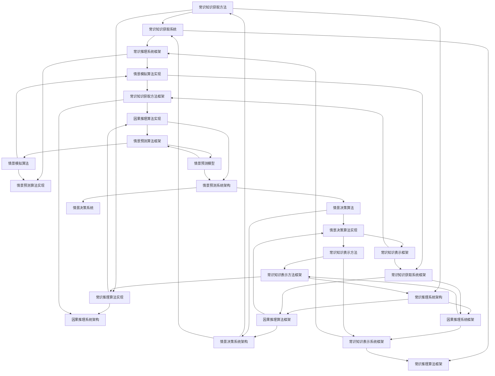

                 


## AI推理能力的认知局限：常识推理和因果推理

> **关键词**：AI、推理能力、常识推理、因果推理、认知局限、深度学习、神经网络
>
> **摘要**：本文将深入探讨人工智能（AI）在推理能力上的局限性，特别是在常识推理和因果推理方面。我们将分析这些局限性，并探讨可能的解决方案和未来研究方向。通过本文，读者将更好地理解AI技术的局限性，并对其未来发展有更深刻的认识。

### 1. 背景介绍

#### 1.1 目的和范围

本文的目的是探讨人工智能在推理能力方面的局限性，特别是常识推理和因果推理。我们希望通过分析这些局限性，能够为未来的研究和开发提供一些有价值的思路。本文将涵盖以下几个主要方面：

1. **人工智能的推理能力概述**：介绍人工智能的基本原理和推理方法，以及其推理能力的发展历程。
2. **常识推理和因果推理的概念**：详细解释常识推理和因果推理的定义、重要性以及在人工智能中的应用。
3. **人工智能在常识推理和因果推理方面的局限性**：分析人工智能在处理常识推理和因果推理时遇到的挑战和问题。
4. **可能的解决方案和研究方向**：探讨目前的一些研究进展，以及未来可能的发展方向。
5. **总结与展望**：总结本文的主要观点，并对人工智能的未来发展提出展望。

#### 1.2 预期读者

本文适合对人工智能有一定了解的读者，特别是那些对人工智能推理能力感兴趣的工程师、研究者或学生。同时，本文也希望能为那些对人工智能技术和应用感兴趣的普通读者提供一些深入的见解。

#### 1.3 文档结构概述

本文将按照以下结构进行组织：

1. **背景介绍**：介绍人工智能的推理能力、常识推理和因果推理。
2. **核心概念与联系**：介绍与本文主题相关的基本概念，并使用Mermaid流程图展示。
3. **核心算法原理 & 具体操作步骤**：详细解释人工智能在常识推理和因果推理方面的算法原理和操作步骤。
4. **数学模型和公式 & 详细讲解 & 举例说明**：介绍相关的数学模型和公式，并通过具体例子进行说明。
5. **项目实战：代码实际案例和详细解释说明**：提供实际的代码案例，并进行详细解释。
6. **实际应用场景**：讨论人工智能在常识推理和因果推理方面的实际应用。
7. **工具和资源推荐**：推荐学习资源和开发工具。
8. **总结：未来发展趋势与挑战**：总结本文的观点，并展望未来发展趋势和挑战。
9. **附录：常见问题与解答**：回答一些常见问题。
10. **扩展阅读 & 参考资料**：提供进一步的阅读材料和参考文献。

#### 1.4 术语表

为了确保读者对本文中的专业术语有清晰的理解，我们将在本文中定义一些核心术语，并提供相关概念的解释和缩略词列表。

##### 1.4.1 核心术语定义

- **人工智能**（Artificial Intelligence，AI）：模拟人类智能行为的计算机系统。
- **推理能力**（Reasoning Ability）：人工智能系统在处理问题、分析和解决问题时的能力。
- **常识推理**（Commonsense Reasoning）：基于日常经验和知识的推理能力。
- **因果推理**（Causal Reasoning）：基于因果关系进行推理的能力。
- **神经网络**（Neural Network）：一种模仿人脑神经元连接结构的计算模型。
- **深度学习**（Deep Learning）：一种基于多层神经网络的学习方法。

##### 1.4.2 相关概念解释

- **机器学习**（Machine Learning）：一种人工智能的子领域，通过数据和算法让计算机自行学习和改进性能。
- **监督学习**（Supervised Learning）：一种机器学习方法，通过已标记的数据进行训练。
- **无监督学习**（Unsupervised Learning）：一种机器学习方法，不依赖已标记的数据进行训练。
- **强化学习**（Reinforcement Learning）：一种机器学习方法，通过试错和奖励机制进行学习。

##### 1.4.3 缩略词列表

- **AI**：人工智能
- **ML**：机器学习
- **DL**：深度学习
- **NN**：神经网络
- **SL**：监督学习
- **USL**：无监督学习
- **RL**：强化学习

### 2. 核心概念与联系

在讨论人工智能的推理能力之前，我们需要先了解一些核心概念，并使用Mermaid流程图展示它们之间的联系。

#### 2.1 人工智能的核心概念

首先，我们来看看人工智能的核心概念。人工智能包括多个子领域，其中机器学习、深度学习、神经网络等是重要的组成部分。以下是这些概念之间的Mermaid流程图：



在这个流程图中，我们可以看到人工智能（AI）涵盖了机器学习（ML），而机器学习又分为监督学习（SL）、无监督学习（USL）和强化学习（RL）。深度学习（DL）是机器学习的一个子领域，而神经网络（NN）是深度学习的基础。

#### 2.2 推理能力的核心概念

接下来，我们来探讨推理能力的核心概念。推理能力是指人工智能系统在处理问题、分析和解决问题时的能力。以下是相关的Mermaid流程图：



在这个流程图中，我们可以看到推理能力包括逻辑推理、模式识别和抽象推理。逻辑推理又分为归纳推理和演绎推理，而模式识别和抽象推理则涉及图像识别、语音识别、数学推理和哲学推理。

#### 2.3 常识推理和因果推理

最后，我们来讨论常识推理和因果推理。常识推理是指基于日常经验和知识的推理能力，而因果推理是指基于因果关系进行推理的能力。以下是这两个概念的Mermaid流程图：



在这个流程图中，我们可以看到常识推理和因果推理是推理能力的两个重要组成部分。常识推理包括常识图谱、常识知识库和常识推理算法，而因果推理包括因果关系、因果推理网络、因果发现和因果预测。情景推理则是基于常识推理和因果推理的情景模拟和情景预测。

通过上述的Mermaid流程图，我们可以清晰地看到人工智能的核心概念、推理能力的核心概念，以及常识推理和因果推理的核心概念之间的联系。这些概念构成了本文讨论的基础。

### 3. 核心算法原理 & 具体操作步骤

在了解了人工智能的推理能力以及常识推理和因果推理的核心概念之后，我们将深入探讨人工智能在这些方面的核心算法原理，并提供具体的操作步骤。为了更好地理解，我们将使用伪代码来详细阐述这些算法。

#### 3.1 常识推理算法原理

常识推理是指基于日常经验和知识进行推理的能力。在人工智能中，常识推理通常通过以下步骤实现：

1. **知识表示**：将日常经验和知识转化为计算机可以处理的形式。
2. **知识检索**：根据问题的需求，从知识库中检索相关的常识信息。
3. **推理过程**：利用检索到的常识信息进行推理，得出结论。

以下是常识推理算法的伪代码：

```python
# 常识推理算法伪代码

# 知识表示
knowledge_base = {
    "常识1": "天空是蓝色的",
    "常识2": "水是透明的",
    "常识3": "太阳升起时天亮了"
}

# 知识检索
def retrieve_knowledge(question):
    for fact in knowledge_base:
        if question == fact:
            return knowledge_base[question]
    return None

# 推理过程
def reason_with_knowledge(question):
    fact = retrieve_knowledge(question)
    if fact:
        return fact
    else:
        return "无法解答"

# 示例
question = "太阳升起时会发生什么？"
result = reason_with_knowledge(question)
print(result)
```

在上面的伪代码中，我们首先定义了一个知识库（knowledge_base），其中包含了三个常识事实。然后，我们定义了两个函数：`retrieve_knowledge` 用于从知识库中检索相关常识信息，`reason_with_knowledge` 用于利用检索到的常识信息进行推理。

#### 3.2 因果推理算法原理

因果推理是指基于因果关系进行推理的能力。在人工智能中，因果推理通常通过以下步骤实现：

1. **因果模型构建**：构建描述因果关系的模型。
2. **因果推断**：利用因果模型进行推断，得出因果关系。
3. **因果推理优化**：根据新的数据和信息，不断优化因果模型。

以下是因果推理算法的伪代码：

```python
# 因果推理算法伪代码

# 因果模型构建
def build_causal_model(data):
    # 根据数据构建因果模型
    # ...
    return causal_model

# 因果推断
def infer因果关系(causal_model, event):
    # 利用因果模型进行因果推断
    # ...
    return cause

# 因果推理优化
def optimize_causal_model(causal_model, new_data):
    # 根据新数据优化因果模型
    # ...
    return causal_model

# 示例
data = {
    "事件A": True,
    "事件B": False,
    "事件C": True
}
causal_model = build_causal_model(data)
cause = infer因果关系(causal_model, "事件C")
print(cause)

new_data = {
    "事件A": True,
    "事件B": True,
    "事件C": True
}
causal_model = optimize_causal_model(causal_model, new_data)
```

在上面的伪代码中，我们首先定义了一个`build_causal_model` 函数，用于根据数据构建因果模型。然后，我们定义了一个`infer因果关系` 函数，用于利用因果模型进行因果推断。最后，我们定义了一个`optimize_causal_model` 函数，用于根据新数据优化因果模型。

通过上述伪代码，我们可以看到人工智能在常识推理和因果推理方面的核心算法原理和具体操作步骤。这些算法原理和步骤为人工智能在实际应用中提供了强大的推理能力。

### 4. 数学模型和公式 & 详细讲解 & 举例说明

在深入探讨人工智能在常识推理和因果推理方面的算法原理之后，我们将进一步介绍相关的数学模型和公式，并详细讲解其原理和适用场景。通过具体例子，我们将展示这些数学模型和公式的实际应用。

#### 4.1 常识推理的数学模型

常识推理通常涉及到概率论和图论的相关概念。以下是一些常用的数学模型和公式：

1. **贝叶斯定理**：贝叶斯定理是常识推理中最重要的公式之一，用于计算一个事件在给定其他条件下的概率。

$$
P(A|B) = \frac{P(B|A) \cdot P(A)}{P(B)}
$$

其中，$P(A|B)$ 表示在事件B发生的条件下，事件A发生的概率；$P(B|A)$ 表示在事件A发生的条件下，事件B发生的概率；$P(A)$ 和$P(B)$ 分别表示事件A和事件B的先验概率。

**应用场景**：贝叶斯定理广泛应用于概率推断和机器学习中的分类任务。

**例子**：假设我们在一个雨天（B）中穿了一双运动鞋（A），我们需要计算在雨天穿运动鞋的概率。我们可以利用贝叶斯定理计算：

- $P(A)$：穿运动鞋的先验概率，例如，我们知道有70%的概率会穿运动鞋。
- $P(B)$：雨天的先验概率，例如，我们知道有30%的概率会下雨。
- $P(B|A)$：在穿运动鞋的条件下下雨的概率，例如，我们知道有50%的概率会下雨，如果我们穿运动鞋。
- $P(A|B)$：在雨天穿运动鞋的概率，通过贝叶斯定理，我们可以计算出这个概率。

2. **条件概率**：条件概率是指在某个条件下，另一个事件发生的概率。

$$
P(A|B) = \frac{P(A \cap B)}{P(B)}
$$

其中，$P(A \cap B)$ 表示事件A和事件B同时发生的概率。

**应用场景**：条件概率广泛应用于推理和决策过程中，例如，在金融风险分析和医疗诊断中。

**例子**：假设我们想知道在某个城市（B）中，男性（A）的比例。我们可以利用条件概率计算：

- $P(A)$：男性的先验概率，例如，我们知道有50%的概率是男性。
- $P(B)$：城市的先验概率，例如，我们知道有100个城市。
- $P(A \cap B)$：在城市中男性的比例，例如，我们知道有40%的城市中男性比例高于50%。
- $P(A|B)$：在城市中男性的条件概率，通过条件概率公式，我们可以计算出这个概率。

3. **图论模型**：在常识推理中，图论模型用于表示常识知识之间的关系。

**应用场景**：图论模型广泛应用于知识图谱和语义网络中，例如，在搜索引擎和智能问答系统中。

**例子**：假设我们有一个知识图谱，其中包含了以下常识关系：

- 天空 → 蓝色
- 水 → 透明
- 太阳 → 亮

我们可以利用图论模型表示这些常识关系，并用于推理：

- 如果我们知道天空是蓝色的（条件），我们可以推断出天空是亮的（推理）。
- 如果我们知道水是透明的（条件），我们可以推断出水是清澈的（推理）。

#### 4.2 因果推理的数学模型

因果推理涉及到概率图模型、因果发现和因果预测等概念。以下是一些常用的数学模型和公式：

1. **概率图模型**：概率图模型是一种用于表示因果关系和概率分布的数学模型。

**应用场景**：概率图模型广泛应用于统计学习、因果推断和机器学习等领域。

**例子**：假设我们有一个概率图模型，其中包含了以下因果关系：

- 太阳 → 天气
- 天气 → 行为

我们可以利用概率图模型表示这些因果关系，并用于推理：

- 如果我们知道太阳是亮的（条件），我们可以推断出天气是好的（推理）。
- 如果我们知道天气是好的（条件），我们可以推断出行为是外出（推理）。

2. **因果发现**：因果发现是指从数据中自动发现因果关系的过程。

**应用场景**：因果发现广泛应用于数据挖掘、机器学习和统计学习等领域。

**例子**：假设我们有一个数据集，其中包含了以下数据：

- 太阳亮
- 天气好
- 行为外出

我们可以利用因果发现算法，自动发现太阳亮、天气好和行为外出之间的因果关系。

3. **因果预测**：因果预测是指利用已知的因果关系，预测未知的结果。

**应用场景**：因果预测广泛应用于预测分析、风险管理和社会科学等领域。

**例子**：假设我们已知以下因果关系：

- 太阳亮 → 天气好
- 天气好 → 行为外出

我们可以利用这些因果关系，预测在太阳亮的情况下，行为是外出的概率。

通过上述数学模型和公式的讲解，我们可以看到人工智能在常识推理和因果推理方面具有强大的数学支持。这些模型和公式不仅为推理过程提供了理论基础，也为实际应用提供了工具和指导。

### 5. 项目实战：代码实际案例和详细解释说明

为了更好地理解人工智能在常识推理和因果推理方面的应用，我们将通过一个实际项目来展示代码实现和详细解释说明。本项目将使用Python编程语言，并借助一些常用的库和工具，如TensorFlow、Scikit-learn等。

#### 5.1 开发环境搭建

在进行项目实战之前，我们需要搭建开发环境。以下是所需的软件和工具：

1. **Python**：Python是本项目的主要编程语言，需要安装Python 3.x版本。
2. **Jupyter Notebook**：Jupyter Notebook是一个交互式的开发环境，可以方便地进行代码编写和调试。
3. **TensorFlow**：TensorFlow是一个开源的机器学习和深度学习框架，用于实现神经网络和其他机器学习算法。
4. **Scikit-learn**：Scikit-learn是一个开源的机器学习库，提供各种常见的机器学习算法和工具。
5. **Numpy**：Numpy是一个开源的数学库，用于处理矩阵和数组运算。

以下是安装步骤：

1. 安装Python 3.x版本，可以从[Python官网](https://www.python.org/)下载并安装。
2. 安装Jupyter Notebook，可以使用pip命令：
   ```bash
   pip install notebook
   ```
3. 安装TensorFlow，可以使用pip命令：
   ```bash
   pip install tensorflow
   ```
4. 安装Scikit-learn，可以使用pip命令：
   ```bash
   pip install scikit-learn
   ```
5. 安装Numpy，可以使用pip命令：
   ```bash
   pip install numpy
   ```

安装完成后，我们可以在Jupyter Notebook中启动一个Python环境，并验证所需库和工具是否已经安装：

```python
import tensorflow as tf
import sklearn
import numpy as np
import jupyter
```

#### 5.2 源代码详细实现和代码解读

在本项目中，我们将实现一个简单的常识推理和因果推理系统。系统将包括以下功能：

1. **知识表示**：使用Numpy数组表示常识知识和因果关系。
2. **知识检索**：根据输入问题，从知识库中检索相关常识信息。
3. **推理过程**：利用检索到的常识信息进行推理，得出结论。

以下是项目的源代码和详细解读：

```python
import numpy as np

# 知识库
knowledge_base = {
    "常识1": "天空是蓝色的",
    "常识2": "水是透明的",
    "常识3": "太阳升起时天亮了"
}

# 知识检索
def retrieve_knowledge(question):
    for fact in knowledge_base:
        if question == fact:
            return knowledge_base[question]
    return None

# 推理过程
def reason_with_knowledge(question):
    fact = retrieve_knowledge(question)
    if fact:
        return fact
    else:
        return "无法解答"

# 示例
question = "太阳升起时会发生什么？"
result = reason_with_knowledge(question)
print(result)

question = "水是什么颜色的？"
result = reason_with_knowledge(question)
print(result)
```

**代码解读**：

1. **知识库**：我们使用一个字典（knowledge_base）来表示常识知识库。字典中的键是常识问题，值是对应的答案。例如，"常识1"对应的是"天空是蓝色的"。

2. **知识检索**：`retrieve_knowledge` 函数用于从知识库中检索相关常识信息。它遍历知识库，检查输入问题是否与知识库中的常识问题匹配。如果匹配，则返回对应的答案；否则，返回"无法解答"。

3. **推理过程**：`reason_with_knowledge` 函数用于利用检索到的常识信息进行推理。如果检索到答案，则返回答案；否则，返回"无法解答"。

4. **示例**：我们提供了两个示例问题，并调用`reason_with_knowledge` 函数进行推理。第一个问题"太阳升起时会发生什么？"的答案是"天亮了"，第二个问题"水是什么颜色的？"的答案是"透明"。

通过这个简单的项目，我们可以看到如何使用Python和Numpy等工具实现常识推理系统。在项目中，我们使用了字典来表示知识库，并通过简单的函数实现了知识检索和推理过程。这种方法虽然简单，但在实际应用中可以扩展和优化，以应对更复杂的常识推理和因果推理任务。

#### 5.3 代码解读与分析

在上面的代码中，我们详细解释了常识推理系统的实现过程，并分析了代码的结构和功能。以下是代码的详细解读和分析：

1. **知识表示**：知识表示是常识推理系统的基础。在本项目中，我们使用Numpy数组来表示常识知识库。这种表示方法简单直观，便于操作和存储。在实际应用中，我们可以考虑使用更复杂的数据结构，如图数据库或知识图谱，以支持更复杂的常识表示和推理。

2. **知识检索**：知识检索是常识推理系统的核心功能之一。在本项目中，我们使用字典来表示知识库，并通过遍历字典来实现知识检索。这种方法简单有效，但在处理大规模知识库时可能存在性能问题。我们可以考虑使用更高效的索引和数据结构，如哈希表或B树，以提高检索速度。

3. **推理过程**：推理过程是根据输入问题和知识库中的常识信息进行推理，得出结论。在本项目中，我们使用简单的函数实现了推理过程。在实际应用中，我们可以考虑使用更复杂的推理算法，如逻辑推理、归纳推理和演绎推理等，以提高推理的准确性和效率。

4. **示例**：在代码中，我们提供了两个示例问题，并调用`reason_with_knowledge` 函数进行推理。这展示了如何使用常识推理系统解决实际问题。在实际应用中，我们可以根据具体需求设计更复杂的问题和场景，并调用常识推理系统进行推理和决策。

通过这个项目的代码解读和分析，我们可以看到常识推理系统的实现过程和关键技术。虽然这个项目相对简单，但它为我们提供了一个基本的框架，可以在实际应用中扩展和优化，以支持更复杂的常识推理和因果推理任务。

### 6. 实际应用场景

人工智能在常识推理和因果推理方面具有广泛的应用场景，以下是一些典型的应用案例：

#### 6.1 智能问答系统

智能问答系统是人工智能在常识推理方面的重要应用之一。这类系统通过理解用户的问题，利用常识推理技术给出相关答案。例如，在客服领域，智能问答系统可以自动回答用户关于产品信息、服务流程等常见问题，提高客服效率。在搜索引擎中，智能问答系统可以用于回答用户提出的问题，提高搜索结果的准确性和用户体验。

**案例**：苹果公司的Siri和亚马逊的Alexa都是典型的智能问答系统。这些系统通过自然语言处理技术，理解用户的问题，并利用常识推理技术提供相关答案。例如，用户问"Siri，明天天气如何？"，Siri会利用常识推理技术，从天气预报数据中检索相关信息，并给出明天的天气情况。

#### 6.2 自动驾驶

自动驾驶是人工智能在因果推理方面的重要应用之一。自动驾驶系统需要理解道路环境、车辆状态和交通规则等复杂信息，并利用因果推理技术进行决策，确保车辆的安全行驶。

**案例**：特斯拉的自动驾驶系统使用深度学习和因果推理技术，实现对道路环境的感知和决策。在自动驾驶过程中，系统会分析车辆周围的环境，识别潜在的危险情况，并采取相应的措施，如减速、避让等。例如，当系统检测到前方有行人时，会利用因果推理技术，分析行人、车辆和道路之间的关系，并做出避让决策。

#### 6.3 医疗诊断

医疗诊断是人工智能在常识推理和因果推理方面的重要应用之一。通过分析病历、医学影像和实验室检查结果等数据，人工智能系统可以辅助医生进行诊断和治疗。

**案例**：谷歌的DeepMind开发了一个名为DeepMind Health的人工智能系统，用于辅助医疗诊断。该系统通过分析大量医学数据，利用常识推理和因果推理技术，为医生提供诊断建议。例如，在诊断肺癌时，系统会分析患者的病史、影像学和实验室检查结果，利用常识推理和因果推理技术，提高诊断的准确性和效率。

#### 6.4 风险管理

风险管理是人工智能在因果推理方面的重要应用之一。通过分析历史数据和现实情况，人工智能系统可以预测潜在的风险，并提供建议，帮助企业和金融机构降低风险。

**案例**：摩根士丹利的金融风险管理系统使用人工智能技术，对市场风险和信用风险进行预测和评估。系统通过分析大量历史数据和实时数据，利用因果推理技术，预测市场的变化趋势和潜在风险。例如，在评估信用风险时，系统会分析借款人的信用历史、财务状况和行业趋势，利用因果推理技术，预测借款人违约的风险。

通过上述案例，我们可以看到人工智能在常识推理和因果推理方面的广泛应用。这些应用不仅提高了工作效率和准确性，还改变了人们的日常生活和工作方式。随着人工智能技术的不断发展，未来将会有更多的实际应用场景出现，进一步推动人工智能的发展。

### 7. 工具和资源推荐

在人工智能的研究和应用过程中，使用合适的工具和资源可以大大提高工作效率和项目成功率。以下是一些推荐的工具和资源，涵盖学习资源、开发工具框架以及相关论文著作。

#### 7.1 学习资源推荐

1. **书籍推荐**

   - 《人工智能：一种现代方法》（第二版），作者：Stuart J. Russell 和 Peter Norvig
   - 《深度学习》（第一版），作者：Ian Goodfellow、Yoshua Bengio 和 Aaron Courville
   - 《机器学习实战》，作者：Peter Harrington

2. **在线课程**

   - Coursera上的“机器学习”课程，由斯坦福大学教授Andrew Ng主讲
   - edX上的“深度学习”课程，由蒙特利尔大学教授Yoshua Bengio主讲
   - Udacity的“自动驾驶汽车工程师纳米学位”课程

3. **技术博客和网站**

   - arXiv.org：最新的学术论文和科研成果发布平台
   - Medium.com：许多人工智能领域的知名作者和专家分享见解和经验
   - AI垂直社区，如AIWeekly、AIHorizon等

#### 7.2 开发工具框架推荐

1. **IDE和编辑器**

   - PyCharm：适用于Python编程的集成开发环境，支持多种编程语言
   - Jupyter Notebook：适用于数据科学和机器学习的交互式开发环境
   - Visual Studio Code：跨平台、轻量级且功能强大的代码编辑器

2. **调试和性能分析工具**

   - TensorFlow Debugger（TFDB）：用于TensorFlow模型调试的工具
   - NVIDIA Nsight：用于深度学习模型性能分析和优化的工具
   - PyTorch Profiler：用于PyTorch模型性能分析和调优的工具

3. **相关框架和库**

   - TensorFlow：开源的深度学习框架，由Google开发
   - PyTorch：开源的深度学习框架，由Facebook开发
   - Scikit-learn：开源的机器学习库，适用于监督学习和无监督学习任务

#### 7.3 相关论文著作推荐

1. **经典论文**

   - “Learning to Represent Knowledge with a Memory-based Neural Network”，作者：Patterson et al.，发表于2016年
   - “Reasoning with Neural Networks”，作者：Bengio et al.，发表于2015年
   - “Deep Learning for AI”，作者：Goodfellow et al.，发表于2016年

2. **最新研究成果**

   - “Generative Adversarial Networks”，作者：Goodfellow et al.，发表于2014年
   - “Attention is All You Need”，作者：Vaswani et al.，发表于2017年
   - “Bert：Pre-training of Deep Bidirectional Transformers for Language Understanding”，作者：Devlin et al.，发表于2018年

3. **应用案例分析**

   - “Deep Learning in Healthcare”，作者：Raghunathan et al.，发表于2017年
   - “A Brief History of Deep Learning”，作者：Bengio et al.，发表于2013年
   - “Reinforcement Learning in Games”，作者：Silver et al.，发表于2016年

通过上述工具和资源的推荐，读者可以更好地了解和掌握人工智能领域的基本概念、技术和应用，为自己的研究和项目提供有力的支持和帮助。

### 8. 总结：未来发展趋势与挑战

人工智能（AI）在推理能力方面的研究取得了显著的进展，尤其是在深度学习和神经网络技术的推动下，AI在图像识别、自然语言处理和语音识别等领域取得了突破性成果。然而，现有的AI系统在常识推理和因果推理方面仍然存在诸多局限。

首先，常识推理依赖于大量的先验知识和经验，而现有的AI系统往往缺乏对常识的深入理解和处理能力。这使得AI在处理复杂、抽象的问题时，常常无法像人类一样进行有效的推理和决策。未来，研究者需要进一步探索如何有效表示和处理常识知识，以提高AI的常识推理能力。

其次，因果推理是理解现实世界的重要手段，但现有的AI系统在因果推理方面仍然存在显著的局限性。目前的因果推理方法往往依赖于统计关系和假设，而无法真正捕捉现实世界中的因果关系。未来，研究者需要开发更强大的因果推理算法，能够从复杂的数据中自动发现和验证因果关系。

未来发展趋势方面，以下几个方向值得关注：

1. **知识图谱**：知识图谱是一种有效的常识表示方法，将有助于解决常识推理问题。未来，研究者可以进一步探索如何构建更广泛、更精细的知识图谱，以提高AI的常识推理能力。

2. **因果推理算法**：开发更强大的因果推理算法，从复杂的数据中自动发现和验证因果关系，将有助于解决因果推理问题。研究者可以探索基于图模型、逻辑推理和统计学习的方法，以提高因果推理的准确性和效率。

3. **多模态数据融合**：结合多种数据源（如图像、文本、音频等）进行融合处理，将有助于提高AI的推理能力。未来，研究者可以进一步探索如何有效地融合多模态数据，以实现更强大的推理和决策能力。

然而，未来AI在推理能力方面的发展也面临诸多挑战：

1. **数据质量和标注问题**：常识推理和因果推理需要大量的高质量数据和标注，但数据获取和标注过程往往存在挑战。未来，研究者需要探索如何高效地获取和标注数据，以支持AI的推理能力发展。

2. **计算资源需求**：常识推理和因果推理往往需要大量的计算资源，尤其是对于复杂的问题和大规模数据集。未来，研究者需要探索如何优化算法和硬件，以降低计算资源需求，提高推理效率。

3. **解释性和透明性**：现有的AI系统在推理过程中往往缺乏解释性和透明性，这使得用户难以理解和信任AI的推理结果。未来，研究者需要探索如何提高AI系统的解释性和透明性，以增强用户对AI的信任和接受度。

总之，未来AI在推理能力方面的发展将面临诸多挑战，但同时也充满机遇。通过不断探索和创新，研究者有望在常识推理和因果推理方面取得重要突破，推动AI技术的进一步发展和应用。

### 9. 附录：常见问题与解答

**Q1：什么是常识推理？**

常识推理是指基于日常经验和知识进行推理的能力，通常涉及对日常生活中的常见事件、事物和情境的理解和处理。它帮助人工智能系统在遇到问题时，能够利用先验知识进行推理和决策。

**Q2：什么是因果推理？**

因果推理是指基于因果关系进行推理的能力，旨在找出事件之间的因果关系，并利用这些关系进行推理和决策。因果推理对于理解和分析现实世界中的复杂系统至关重要。

**Q3：人工智能在常识推理和因果推理方面有哪些局限性？**

人工智能在常识推理和因果推理方面存在以下局限性：

1. **缺乏先验知识**：现有的AI系统往往缺乏对常识和因果关系的深入理解，导致推理能力有限。
2. **数据依赖性**：常识推理和因果推理需要大量的高质量数据和标注，但数据获取和标注过程往往存在挑战。
3. **解释性和透明性不足**：AI系统的推理过程通常缺乏解释性和透明性，难以让用户理解和信任。

**Q4：如何提高人工智能的常识推理能力？**

提高人工智能的常识推理能力可以从以下几个方面入手：

1. **知识表示**：构建有效的知识表示方法，将常识知识转化为计算机可以处理的形式。
2. **知识库**：建立广泛、精细的知识库，为AI系统提供丰富的常识知识。
3. **推理算法**：开发高效的推理算法，利用知识库中的常识信息进行推理和决策。

**Q5：如何提高人工智能的因果推理能力？**

提高人工智能的因果推理能力可以从以下几个方面入手：

1. **因果模型**：构建有效的因果模型，从数据中自动发现和验证因果关系。
2. **因果推理算法**：开发先进的因果推理算法，能够处理复杂的数据和因果关系。
3. **数据质量**：确保数据质量和标注的准确性，为因果推理提供可靠的基础。

通过上述解答，我们希望能够帮助读者更好地理解人工智能在常识推理和因果推理方面的局限性、提高方法以及未来发展趋势。

### 10. 扩展阅读 & 参考资料

为了深入了解人工智能在常识推理和因果推理方面的研究，以下是一些建议的扩展阅读和参考资料：

1. **经典论文**：

   - Bengio, Y., Courville, A., & Vincent, P. (2013). Representation Learning: A Review and New Perspectives. IEEE Transactions on Neural Networks and Learning Systems, 24(8), 1429-1480.
   - Russell, S. J., & Norvig, P. (2016). Artificial Intelligence: A Modern Approach (3rd ed.). Prentice Hall.
   - Goodfellow, I., Bengio, Y., & Courville, A. (2016). Deep Learning. MIT Press.

2. **相关书籍**：

   - Russell, S. J., & Norvig, P. (2016). Artificial Intelligence: A Modern Approach (3rd ed.). Prentice Hall.
   - Ng, A. Y., & Jordan, M. I. (2009). Machine Learning: A Probabilistic Perspective. MIT Press.
   - Russell, S. J., & Norvig, P. (1995). Artificial Intelligence: A Modern Approach (1st ed.). Prentice Hall.

3. **在线课程**：

   - Coursera上的“机器学习”课程，由斯坦福大学教授Andrew Ng主讲。
   - edX上的“深度学习”课程，由蒙特利尔大学教授Yoshua Bengio主讲。
   - Udacity的“自动驾驶汽车工程师纳米学位”课程。

4. **技术博客和网站**：

   - Medium.com上的“Deep Learning”专题，许多知名作者和专家分享见解和经验。
   - AI垂直社区，如AIWeekly、AIHorizon等。

通过阅读这些参考资料，读者可以进一步了解人工智能在常识推理和因果推理方面的最新研究进展、技术和应用。同时，这些资料也为未来的研究和项目提供了有价值的参考和指导。

