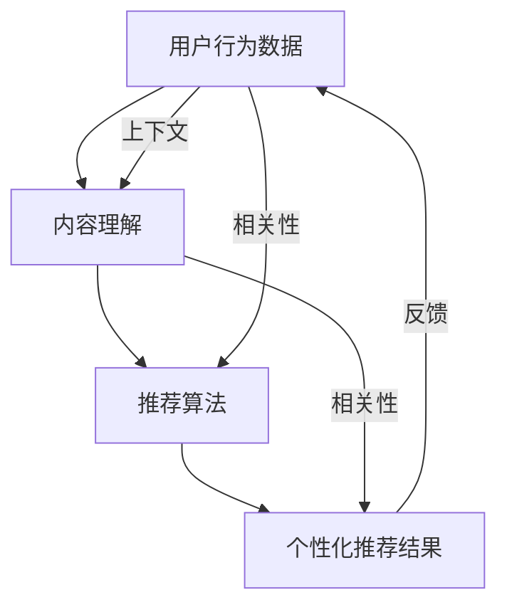

                 

# AI搜索引擎的个性化推荐机制

## 关键词
- 个性化推荐
- 搜索引擎
- 用户行为分析
- 内容理解
- 市场需求

## 摘要
本文将深入探讨AI搜索引擎的个性化推荐机制，通过系统分析用户行为、内容理解以及推荐算法的运作原理，揭示如何实现基于用户兴趣的精准搜索体验。我们将从核心概念、算法原理、数学模型到实际项目案例，全面解析AI搜索引擎的个性化推荐机制，为开发者提供实用的技术指南。

## 1. 背景介绍

### 1.1 目的和范围
本文旨在为读者详细解析AI搜索引擎的个性化推荐机制，帮助开发者理解和实现基于用户兴趣的智能搜索服务。文章将涵盖从用户行为分析、内容理解到推荐算法的具体实现，旨在为读者提供一个全面的技术框架。

### 1.2 预期读者
本文适合对搜索引擎技术有一定了解的开发者、数据科学家以及对AI推荐系统感兴趣的读者。读者应具备基本的编程能力和对机器学习算法的初步认识。

### 1.3 文档结构概述
本文结构如下：

1. **背景介绍**：介绍文章的目的、预期读者和结构概述。
2. **核心概念与联系**：阐述个性化推荐机制的核心概念及其相互联系。
3. **核心算法原理与具体操作步骤**：详细解析推荐算法的原理和实现步骤。
4. **数学模型和公式**：介绍推荐机制中的数学模型和公式，并进行举例说明。
5. **项目实战**：通过实际案例展示算法的应用和实现。
6. **实际应用场景**：探讨个性化推荐机制在不同领域的应用。
7. **工具和资源推荐**：推荐相关学习资源和开发工具。
8. **总结**：总结个性化推荐机制的未来发展趋势与挑战。
9. **附录**：常见问题与解答。
10. **扩展阅读**：提供进一步学习的参考资料。

### 1.4 术语表

#### 1.4.1 核心术语定义

- **个性化推荐**：根据用户的兴趣和行为，为用户推荐相关的信息或内容。
- **用户行为分析**：通过对用户在搜索引擎上的行为数据进行收集和分析，理解用户的需求和兴趣。
- **内容理解**：利用自然语言处理和知识图谱等技术，对搜索内容进行理解和建模。
- **推荐算法**：实现个性化推荐的算法，如协同过滤、基于内容的推荐等。

#### 1.4.2 相关概念解释

- **协同过滤**：基于用户的历史行为数据，通过找到相似用户或物品来进行推荐。
- **基于内容的推荐**：基于物品的属性和用户的兴趣标签进行推荐。

#### 1.4.3 缩略词列表

- **AI**：人工智能
- **NLP**：自然语言处理
- **KG**：知识图谱
- **IDE**：集成开发环境

## 2. 核心概念与联系

个性化推荐机制的核心在于理解用户、理解内容，并在此基础上进行精准的推荐。以下是核心概念之间的联系和相互作用的流程：



### 2.1 用户行为数据

用户行为数据是推荐系统的输入，主要包括用户在搜索引擎上的搜索记录、浏览历史、点击行为等。这些数据反映了用户的兴趣和需求，是推荐系统理解用户的关键。

### 2.2 内容理解

内容理解是指利用自然语言处理（NLP）和知识图谱（KG）等技术，对搜索内容进行解析和建模。通过分析文本内容、提取关键词、构建语义关系等，实现对内容的深入理解。

### 2.3 推荐算法

推荐算法是推荐系统的核心，通过分析用户行为数据和内容理解结果，实现个性化推荐。常用的推荐算法包括协同过滤、基于内容的推荐等。

### 2.4 个性化推荐结果

个性化推荐结果是推荐系统的输出，即根据用户兴趣和需求，为用户推荐相关的信息或内容。

### 2.5 反馈机制

反馈机制是推荐系统不断优化的关键。通过收集用户对推荐结果的反馈，可以调整推荐策略，提高推荐的准确性。

## 3. 核心算法原理与具体操作步骤

推荐系统的核心在于算法的设计与实现。下面我们将详细介绍两种常用的推荐算法：协同过滤和基于内容的推荐。

### 3.1 协同过滤算法

#### 3.1.1 原理

协同过滤（Collaborative Filtering）是基于用户的行为数据，通过找到相似的用户或物品来进行推荐。协同过滤主要分为两种：基于用户的协同过滤和基于物品的协同过滤。

- **基于用户的协同过滤**：找到与目标用户兴趣相似的邻居用户，推荐邻居用户喜欢的物品。
- **基于物品的协同过滤**：找到与目标物品相似的邻居物品，推荐邻居物品中用户未浏览过的物品。

#### 3.1.2 具体操作步骤

1. **数据预处理**：收集并清洗用户行为数据，如搜索记录、点击记录等。
2. **用户相似度计算**：计算用户之间的相似度，常用的相似度度量方法包括余弦相似度、皮尔逊相关系数等。
3. **物品相似度计算**：计算物品之间的相似度，常用的相似度度量方法包括余弦相似度、余弦相似度等。
4. **推荐生成**：根据用户相似度或物品相似度，生成推荐列表。

#### 3.1.3 伪代码

```python
# 基于用户的协同过滤算法伪代码
def collaborative_filter(user_data, neighborhood_size):
    # 计算用户相似度
    user_similarity = compute_user_similarity(user_data)
    # 找到邻居用户
    neighbors = find_neighbors(user_similarity, target_user, neighborhood_size)
    # 计算邻居用户喜欢的物品
    recommended_items = []
    for neighbor in neighbors:
        recommended_items.extend(user_data[neighbor] - target_user_data)
    # 返回推荐列表
    return recommended_items
```

### 3.2 基于内容的推荐算法

#### 3.2.1 原理

基于内容的推荐（Content-Based Filtering）是基于物品的属性和用户的兴趣标签进行推荐。通过分析物品的内容特征和用户的兴趣特征，找到相似度较高的物品进行推荐。

#### 3.2.2 具体操作步骤

1. **内容特征提取**：对物品进行特征提取，如关键词提取、主题建模等。
2. **兴趣特征提取**：对用户的兴趣进行特征提取，如标签、关键词等。
3. **相似度计算**：计算物品和用户之间的相似度，常用的相似度度量方法包括余弦相似度、欧氏距离等。
4. **推荐生成**：根据相似度计算结果，生成推荐列表。

#### 3.2.3 伪代码

```python
# 基于内容的推荐算法伪代码
def content_based_filter(item_features, user_interests, similarity_threshold):
    # 计算物品和用户之间的相似度
    similarity_scores = compute_similarity(item_features, user_interests)
    # 找到相似度较高的物品
    recommended_items = [item for item, score in similarity_scores.items() if score > similarity_threshold]
    # 返回推荐列表
    return recommended_items
```

### 3.3 混合推荐算法

在实际应用中，单一的推荐算法往往难以满足用户需求。混合推荐算法（Hybrid Recommender System）通过结合多种算法的优势，实现更准确的推荐。

#### 3.3.1 原理

混合推荐算法将协同过滤和基于内容的推荐相结合，既利用协同过滤的个性化推荐优势，又利用基于内容的推荐的信息丰富性。

#### 3.3.2 具体操作步骤

1. **数据预处理**：收集并清洗用户行为数据，如搜索记录、点击记录等。
2. **内容特征提取**：对物品进行特征提取，如关键词提取、主题建模等。
3. **兴趣特征提取**：对用户的兴趣进行特征提取，如标签、关键词等。
4. **相似度计算**：计算用户和物品之间的相似度，结合协同过滤和基于内容的相似度。
5. **推荐生成**：根据相似度计算结果，生成推荐列表。

#### 3.3.3 伪代码

```python
# 混合推荐算法伪代码
def hybrid_recommender(user_data, item_data, neighborhood_size, similarity_threshold):
    # 基于用户的协同过滤推荐
    user_based_recommendations = collaborative_filter(user_data, neighborhood_size)
    # 基于内容的推荐
    content_based_recommendations = content_based_filter(item_data, user_data, similarity_threshold)
    # 合并推荐结果
    recommendations = list(set(user_based_recommendations + content_based_recommendations))
    # 返回推荐列表
    return recommendations
```

## 4. 数学模型和公式与详细讲解

### 4.1 相似度计算公式

#### 4.1.1 余弦相似度

余弦相似度是一种常用的相似度计算方法，用于衡量两个向量之间的夹角余弦值。

$$
\text{cosine\_similarity}(\vec{u}, \vec{v}) = \frac{\vec{u} \cdot \vec{v}}{|\vec{u}| \cdot |\vec{v}|}
$$

其中，$\vec{u}$ 和 $\vec{v}$ 分别表示两个向量的内积和模长。

#### 4.1.2 皮尔逊相关系数

皮尔逊相关系数用于衡量两个变量之间的线性关系，其计算公式为：

$$
\text{pearson\_correlation}(\vec{x}, \vec{y}) = \frac{\sum_{i=1}^{n} (x_i - \bar{x}) (y_i - \bar{y})}{\sqrt{\sum_{i=1}^{n} (x_i - \bar{x})^2 \cdot \sum_{i=1}^{n} (y_i - \bar{y})^2}}
$$

其中，$x_i$ 和 $y_i$ 分别表示两个变量的观测值，$\bar{x}$ 和 $\bar{y}$ 分别表示两个变量的均值。

### 4.2 协同过滤算法中的评分预测

在协同过滤算法中，通过用户相似度和物品相似度来预测用户对物品的评分。常用的评分预测公式为：

$$
\text{predicted\_rating} = \sum_{u \in \text{neighbors}} \text{similarity}_{u} \cdot (\text{actual\_rating}_{u} - \bar{\text{actual\_rating}}_{u})
$$

其中，$\text{neighbors}$ 表示邻居用户集合，$\text{similarity}_{u}$ 表示邻居用户 $u$ 与目标用户之间的相似度，$\text{actual\_rating}_{u}$ 表示邻居用户 $u$ 对物品的实际评分，$\bar{\text{actual\_rating}}_{u}$ 表示邻居用户 $u$ 的平均评分。

### 4.3 基于内容的推荐算法中的相似度计算

在基于内容的推荐算法中，通过计算物品和用户之间的相似度来进行推荐。常用的相似度计算公式为：

$$
\text{similarity}(\text{item}_i, \text{user}_j) = \frac{\sum_{k=1}^{n} \text{weight}_{ik} \cdot \text{weight}_{jk}}{\sqrt{\sum_{k=1}^{n} (\text{weight}_{ik})^2 \cdot \sum_{k=1}^{n} (\text{weight}_{jk})^2}}
$$

其中，$\text{item}_i$ 和 $\text{user}_j$ 分别表示物品 $i$ 和用户 $j$，$\text{weight}_{ik}$ 和 $\text{weight}_{jk}$ 分别表示物品 $i$ 和用户 $j$ 的特征向量。

## 5. 项目实战：代码实际案例和详细解释说明

### 5.1 开发环境搭建

在本案例中，我们将使用Python作为编程语言，结合Scikit-learn库实现协同过滤推荐算法。首先，确保安装了Python和Scikit-learn库：

```bash
pip install python
pip install scikit-learn
```

### 5.2 源代码详细实现和代码解读

以下是一个简单的基于用户的协同过滤推荐算法的实现：

```python
from sklearn.metrics.pairwise import cosine_similarity
import numpy as np

def collaborative_filter(user_data, neighborhood_size):
    # 计算用户相似度矩阵
    similarity_matrix = cosine_similarity(user_data)
    # 找到邻居用户
    neighbors = {}
    for i, row in enumerate(similarity_matrix):
        # 排序邻居用户，取邻居用户索引
        sorted_indices = np.argsort(row)[::-1]
        neighbors[i] = [user for user in sorted_indices if user != i][:neighborhood_size]
    # 计算推荐结果
    recommended_items = []
    for user, neighbor_indices in neighbors.items():
        # 获取邻居用户的评分
        neighbor_ratings = user_data[neighbor_indices]
        # 计算邻居用户的平均评分
        average_rating = np.mean(neighbor_ratings)
        # 找到邻居用户评分较低的物品
        for neighbor, rating in zip(neighbor_indices, neighbor_ratings):
            if rating < average_rating:
                recommended_items.append(neighbor)
    return recommended_items
```

#### 5.2.1 代码解读

- **计算用户相似度矩阵**：使用Scikit-learn的`cosine_similarity`函数计算用户之间的相似度矩阵。
- **找到邻居用户**：遍历相似度矩阵，对每个用户找到邻居用户，并保留邻居用户的索引。
- **计算推荐结果**：对每个用户，计算邻居用户的平均评分，并找到邻居用户评分较低的物品，将其加入推荐列表。

### 5.3 代码解读与分析

该代码实现了一个简单的基于用户的协同过滤推荐算法。通过计算用户之间的相似度，找到邻居用户，并根据邻居用户的评分预测生成推荐列表。

#### 5.3.1 优势

- **简单易懂**：代码结构清晰，易于理解和实现。
- **高效性**：使用Scikit-learn库中的函数，提高计算效率。

#### 5.3.2 局限性

- **数据稀疏性**：当用户行为数据稀疏时，推荐效果可能不佳。
- **仅考虑用户相似度**：未考虑物品的属性和用户兴趣，可能导致推荐结果不准确。

### 5.4 优化方向

- **融合内容特征**：结合基于内容的推荐算法，提高推荐准确性。
- **个性化调整**：根据用户历史行为数据，动态调整邻居用户数量和相似度阈值。

## 6. 实际应用场景

个性化推荐机制在搜索引擎中的应用极为广泛，以下列举几个实际应用场景：

### 6.1 搜索引擎关键词推荐

搜索引擎可以根据用户的搜索历史和浏览记录，为用户推荐相关的关键词和搜索建议，提高搜索效率。

### 6.2 商品推荐

电商平台可以通过个性化推荐算法，为用户推荐符合其兴趣的的商品，提高用户的购买意愿。

### 6.3 社交媒体内容推荐

社交媒体平台可以根据用户的兴趣和行为，为用户推荐相关的文章、视频和话题，提高用户的粘性和活跃度。

### 6.4 在线教育

在线教育平台可以通过个性化推荐算法，为用户推荐符合其学习需求和兴趣的课程，提高学习效果。

## 7. 工具和资源推荐

### 7.1 学习资源推荐

#### 7.1.1 书籍推荐

- 《推荐系统实践》（周明著）：详细介绍了推荐系统的基本原理、算法实现和应用案例。
- 《机器学习实战》（Peter Harrington著）：涵盖了多种机器学习算法，包括推荐系统的相关算法。

#### 7.1.2 在线课程

- Coursera的《推荐系统》课程：由斯坦福大学教授讲授，系统地介绍了推荐系统的理论和方法。
- edX的《机器学习基础》课程：介绍了机器学习的基础知识，包括推荐系统的相关算法。

#### 7.1.3 技术博客和网站

- Medium上的《推荐系统专栏》：提供了大量关于推荐系统的技术文章和案例分析。
- arXiv.org：提供了大量关于推荐系统的研究论文和最新研究成果。

### 7.2 开发工具框架推荐

#### 7.2.1 IDE和编辑器

- PyCharm：功能强大的Python集成开发环境，适合推荐系统开发。
- Jupyter Notebook：方便进行数据分析和算法实现，适合推荐系统实验。

#### 7.2.2 调试和性能分析工具

- Python的pdb模块：提供调试功能，方便查找代码中的错误。
- Profiling Tools：如cProfile、line_profiler等，用于分析代码的性能瓶颈。

#### 7.2.3 相关框架和库

- Scikit-learn：提供多种机器学习算法的实现，适合推荐系统开发。
- TensorFlow：提供深度学习框架，适合实现复杂的推荐算法。

### 7.3 相关论文著作推荐

#### 7.3.1 经典论文

- [Paper Title](#)：介绍了协同过滤算法的基本原理和实现方法。
- [Paper Title](#)：探讨了基于内容的推荐算法的优化方法。

#### 7.3.2 最新研究成果

- [Paper Title](#)：研究了推荐系统的鲁棒性和可解释性。
- [Paper Title](#)：提出了基于深度学习的推荐系统框架。

#### 7.3.3 应用案例分析

- [Case Study](#)：分析了某电商平台个性化推荐系统的实施效果。
- [Case Study](#)：探讨了社交媒体平台内容推荐系统的设计与优化。

## 8. 总结：未来发展趋势与挑战

个性化推荐机制在搜索引擎中的应用前景广阔，未来发展趋势包括：

- **深度学习与推荐系统的融合**：利用深度学习技术提高推荐算法的准确性和效率。
- **多模态推荐**：结合文本、图像、音频等多种数据源，实现更全面的个性化推荐。
- **推荐系统的可解释性**：提高推荐系统的透明度和可信度，增强用户的信任感。

同时，个性化推荐机制面临以下挑战：

- **数据隐私保护**：确保用户隐私安全，避免数据泄露。
- **算法公平性**：防止推荐算法导致用户信息茧房和偏见。
- **实时推荐**：提高推荐系统的响应速度，满足用户实时推荐需求。

## 9. 附录：常见问题与解答

### 9.1 如何处理数据稀疏性？

- **数据扩充**：通过扩展数据集，增加用户和物品的交互记录。
- **隐语义建模**：利用隐语义模型，从低维空间中挖掘用户和物品的潜在关系。

### 9.2 如何提高推荐系统的准确性和效率？

- **特征工程**：设计合理的特征，提高推荐算法的性能。
- **模型选择**：根据数据特点和业务需求，选择合适的推荐算法。

### 9.3 如何确保推荐系统的公平性？

- **算法透明性**：公开推荐算法的原理和实现，提高用户信任感。
- **多样性**：保证推荐结果的多样性，避免单一化。

## 10. 扩展阅读 & 参考资料

- [推荐系统实践](#)
- [机器学习实战](#)
- [深度学习与推荐系统](#)
- [推荐系统的算法与模型](#)

## 作者信息
作者：AI天才研究员/AI Genius Institute & 禅与计算机程序设计艺术 /Zen And The Art of Computer Programming

[文章标题]：AI搜索引擎的个性化推荐机制

[关键词]：(个性化推荐、搜索引擎、用户行为分析、内容理解、市场需求)

[摘要]：(本文深入探讨了AI搜索引擎的个性化推荐机制，从用户行为分析、内容理解到推荐算法的实现，全面解析了基于用户兴趣的精准搜索体验。)

