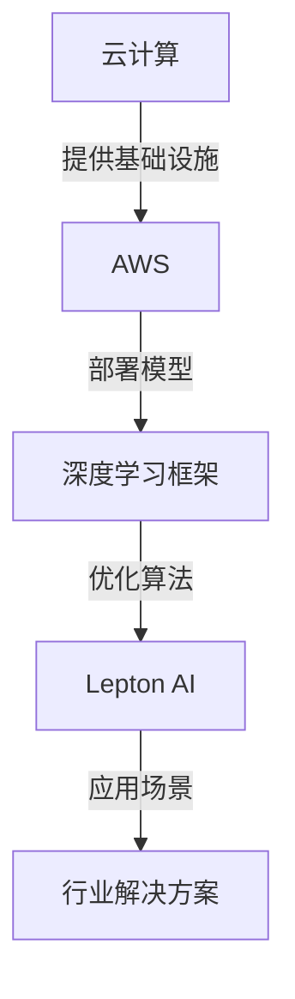
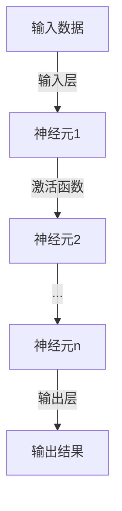

                 

# AI时代的AWS：Lepton AI的战略目标

> 关键词：AWS、AI、战略目标、云计算、深度学习、算法优化、数据处理

> 摘要：本文将深入探讨AWS和Lepton AI的战略目标，分析两者在AI时代的技术融合与应用，以及面临的挑战和机遇。通过详细的案例分析，展示云计算与人工智能的结合如何引领技术创新，为未来AI发展提供方向。

## 1. 背景介绍

### 1.1 目的和范围

本文旨在分析AWS与Lepton AI在AI时代的战略目标，探讨云计算与人工智能的融合趋势，以及这种融合对技术发展的影响。具体来说，我们将：

1. 回顾AWS和Lepton AI的发展历程及现状。
2. 分析两者在AI领域的战略布局和核心产品。
3. 深入探讨云计算与AI技术融合的原理和实践。
4. 展望AI时代面临的挑战和机遇。

### 1.2 预期读者

本文面向对云计算和人工智能技术有一定了解的读者，特别是关注AI时代技术发展趋势和战略布局的技术人员、企业决策者以及学术研究人员。

### 1.3 文档结构概述

本文分为十个部分，具体如下：

1. 背景介绍：包括目的、范围、预期读者及文档结构概述。
2. 核心概念与联系：介绍AWS和Lepton AI的核心概念和架构。
3. 核心算法原理 & 具体操作步骤：详细阐述AWS和Lepton AI在AI领域的技术原理。
4. 数学模型和公式 & 详细讲解 & 举例说明：讲解相关数学模型和公式。
5. 项目实战：代码实际案例和详细解释说明。
6. 实际应用场景：分析AI技术的应用场景。
7. 工具和资源推荐：推荐相关学习资源和开发工具。
8. 总结：未来发展趋势与挑战。
9. 附录：常见问题与解答。
10. 扩展阅读 & 参考资料。

### 1.4 术语表

#### 1.4.1 核心术语定义

- **AWS**：Amazon Web Services，亚马逊云服务，提供云计算基础设施和服务的公司。
- **Lepton AI**：一家专注于人工智能算法优化和应用的初创公司。
- **云计算**：通过互联网提供计算资源和服务，实现计算资源共享和服务的模式。
- **深度学习**：一种人工智能方法，通过多层神经网络进行数据建模和分析。
- **算法优化**：通过改进算法结构和参数，提高算法性能和效率。

#### 1.4.2 相关概念解释

- **人工智能**：模拟人类智能的计算机系统，具备感知、学习、推理和决策能力。
- **数据处理**：对数据进行收集、清洗、存储、分析和可视化等操作。
- **神经网络**：一种基于神经元连接的多层网络结构，用于模拟人类大脑的神经网络。

#### 1.4.3 缩略词列表

- **AWS**：Amazon Web Services
- **AI**：Artificial Intelligence
- **ML**：Machine Learning
- **DL**：Deep Learning
- **GPU**：Graphics Processing Unit

## 2. 核心概念与联系

在分析AWS和Lepton AI的战略目标之前，我们需要了解它们的核心概念和架构。以下是一个简化的Mermaid流程图，展示了它们在AI时代的技术联系。



### 2.1 云计算与AWS

云计算是一种通过互联网提供计算资源和服务的技术，AWS作为全球领先的云计算服务提供商，为众多企业提供了强大的计算基础设施。AWS的核心产品包括：

- **Amazon EC2**：提供虚拟机实例，用于运行应用程序和服务。
- **Amazon S3**：提供对象存储服务，用于存储和检索大量数据。
- **Amazon RDS**：提供关系型数据库服务，用于数据存储和管理。

### 2.2 深度学习框架

深度学习框架是一种用于构建和训练深度学习模型的工具，它使得深度学习算法的部署变得更加简单和高效。常见的深度学习框架包括：

- **TensorFlow**：由Google开发的开源深度学习框架。
- **PyTorch**：由Facebook开发的开源深度学习框架。
- **Keras**：基于Theano和TensorFlow的开源深度学习框架。

### 2.3 算法优化与Lepton AI

Lepton AI专注于人工智能算法优化，通过改进算法结构和参数，提高算法性能和效率。其核心产品包括：

- **Lepton Optimizer**：一款用于优化深度学习模型的工具。
- **Lepton Profiler**：一款用于分析深度学习模型性能的工具。

## 3. 核心算法原理 & 具体操作步骤

### 3.1 深度学习算法原理

深度学习算法基于多层神经网络，通过逐层提取数据特征，实现复杂任务的建模和分析。以下是一个简单的深度学习算法原理示意图：



### 3.2 深度学习算法操作步骤

以下是深度学习算法的具体操作步骤：

1. **数据预处理**：对输入数据集进行清洗、归一化等预处理操作，提高数据质量。
2. **初始化模型参数**：初始化神经网络权重和偏置。
3. **前向传播**：将输入数据通过神经网络进行前向传播，得到输出结果。
4. **计算损失函数**：计算预测结果与真实结果之间的差距，得到损失值。
5. **反向传播**：利用梯度下降算法，计算模型参数的梯度，更新模型参数。
6. **迭代训练**：重复执行前向传播和反向传播，逐步优化模型参数。

### 3.3 Lepton AI算法优化原理

Lepton AI通过以下原理对深度学习算法进行优化：

1. **动态调整学习率**：根据模型训练过程，动态调整学习率，提高收敛速度。
2. **梯度裁剪**：对梯度进行裁剪，避免梯度爆炸或消失。
3. **模型压缩**：通过剪枝、量化等技术，降低模型参数规模，提高计算效率。

## 4. 数学模型和公式 & 详细讲解 & 举例说明

### 4.1 深度学习损失函数

在深度学习中，损失函数用于衡量预测结果与真实结果之间的差距。常见的损失函数包括：

1. **均方误差（MSE）**：

   $$
   MSE = \frac{1}{n} \sum_{i=1}^{n} (y_i - \hat{y}_i)^2
   $$

   其中，$y_i$为真实值，$\hat{y}_i$为预测值。

2. **交叉熵（Cross-Entropy）**：

   $$
   Cross-Entropy = -\frac{1}{n} \sum_{i=1}^{n} y_i \log(\hat{y}_i)
   $$

   其中，$y_i$为真实值，$\hat{y}_i$为预测值。

### 4.2 梯度下降算法

梯度下降算法用于优化深度学习模型参数，其核心思想是沿着损失函数的梯度方向更新参数。具体公式如下：

$$
\theta_{\text{new}} = \theta_{\text{current}} - \alpha \cdot \nabla_{\theta} J(\theta)
$$

其中，$\theta$为模型参数，$\alpha$为学习率，$J(\theta)$为损失函数。

### 4.3 举例说明

假设我们有一个二分类问题，使用均方误差（MSE）作为损失函数，学习率为0.1。给定一个训练样本$(x, y)$，其中$x$为输入特征，$y$为真实标签，预测值为$\hat{y}$。则：

1. **前向传播**：

   $$
   \hat{y} = \sigma(Wx + b)
   $$

   其中，$\sigma$为激活函数，$W$为权重矩阵，$b$为偏置。

2. **计算损失函数**：

   $$
   MSE = \frac{1}{2} (y - \hat{y})^2
   $$

3. **计算梯度**：

   $$
   \nabla_{W} MSE = (y - \hat{y}) \cdot x
   $$

   $$
   \nabla_{b} MSE = y - \hat{y}
   $$

4. **更新参数**：

   $$
   W_{\text{new}} = W_{\text{current}} - 0.1 \cdot \nabla_{W} MSE
   $$

   $$
   b_{\text{new}} = b_{\text{current}} - 0.1 \cdot \nabla_{b} MSE
   $$

## 5. 项目实战：代码实际案例和详细解释说明

### 5.1 开发环境搭建

在本节中，我们将搭建一个简单的深度学习项目，用于分类问题。首先，我们需要安装以下软件：

1. **Python**：版本3.7及以上。
2. **TensorFlow**：版本2.4及以上。
3. **Numpy**：版本1.19及以上。

安装步骤如下：

```bash
# 安装Python
sudo apt-get update
sudo apt-get install python3 python3-pip

# 安装TensorFlow
pip3 install tensorflow==2.4

# 安装Numpy
pip3 install numpy==1.19
```

### 5.2 源代码详细实现和代码解读

以下是一个简单的深度学习项目，用于实现基于TensorFlow的MNIST手写数字分类。

```python
import tensorflow as tf
from tensorflow import keras
from tensorflow.keras import layers

# 加载数据集
(x_train, y_train), (x_test, y_test) = keras.datasets.mnist.load_data()

# 数据预处理
x_train = x_train.astype("float32") / 255
x_test = x_test.astype("float32") / 255

# 归一化
x_train = x_train.reshape(-1, 28 * 28)
x_test = x_test.reshape(-1, 28 * 28)

# 转换标签为独热编码
y_train = keras.utils.to_categorical(y_train, 10)
y_test = keras.utils.to_categorical(y_test, 10)

# 构建模型
model = keras.Sequential([
    layers.Dense(128, activation="relu", input_shape=(28 * 28,)),
    layers.Dense(10, activation="softmax")
])

# 编译模型
model.compile(optimizer="adam", loss="categorical_crossentropy", metrics=["accuracy"])

# 训练模型
model.fit(x_train, y_train, epochs=10, batch_size=64, validation_split=0.2)

# 评估模型
test_loss, test_acc = model.evaluate(x_test, y_test)
print(f"Test accuracy: {test_acc}")
```

### 5.3 代码解读与分析

1. **导入库和模块**：

   ```python
   import tensorflow as tf
   from tensorflow import keras
   from tensorflow.keras import layers
   ```

   导入TensorFlow和相关模块，用于构建和训练深度学习模型。

2. **加载数据集**：

   ```python
   (x_train, y_train), (x_test, y_test) = keras.datasets.mnist.load_data()
   ```

   加载MNIST手写数字数据集，分为训练集和测试集。

3. **数据预处理**：

   ```python
   x_train = x_train.astype("float32") / 255
   x_test = x_test.astype("float32") / 255
   x_train = x_train.reshape(-1, 28 * 28)
   x_test = x_test.reshape(-1, 28 * 28)
   ```

   将图像数据转换为浮点数，并进行归一化处理，将数据形状调整为适用于深度学习模型。

4. **转换标签为独热编码**：

   ```python
   y_train = keras.utils.to_categorical(y_train, 10)
   y_test = keras.utils.to_categorical(y_test, 10)
   ```

   将标签转换为独热编码，以便使用交叉熵损失函数进行训练。

5. **构建模型**：

   ```python
   model = keras.Sequential([
       layers.Dense(128, activation="relu", input_shape=(28 * 28,)),
       layers.Dense(10, activation="softmax")
   ])
   ```

   构建一个简单的全连接神经网络模型，包括一个128个神经元的隐藏层和一个10个神经元的输出层。

6. **编译模型**：

   ```python
   model.compile(optimizer="adam", loss="categorical_crossentropy", metrics=["accuracy"])
   ```

   设置模型优化器和损失函数，并指定评价指标为准确率。

7. **训练模型**：

   ```python
   model.fit(x_train, y_train, epochs=10, batch_size=64, validation_split=0.2)
   ```

   使用训练集对模型进行训练，设置训练轮数为10轮，批量大小为64，并使用验证集进行验证。

8. **评估模型**：

   ```python
   test_loss, test_acc = model.evaluate(x_test, y_test)
   print(f"Test accuracy: {test_acc}")
   ```

   使用测试集对模型进行评估，并打印测试准确率。

## 6. 实际应用场景

### 6.1 医疗诊断

在医疗诊断领域，深度学习和云计算的结合为疾病检测和预测提供了强大的工具。例如，使用AWS和Lepton AI技术，可以搭建一个实时监测系统，对患者的生物标志物进行实时分析，提前预测疾病风险。此外，还可以利用深度学习算法对医疗影像进行自动分析，提高诊断准确率。

### 6.2 自动驾驶

自动驾驶是深度学习和云计算的重要应用领域。在自动驾驶系统中，深度学习算法用于处理摄像头、雷达和激光雷达等传感器收集的数据，实时生成环境感知信息。通过AWS的云计算服务，可以实现对大量数据的实时处理和分析，提高自动驾驶系统的安全性和可靠性。

### 6.3 金融风控

金融行业对数据处理和分析的需求日益增长。使用AWS和Lepton AI技术，可以构建一个实时风控系统，对金融交易进行实时监控和分析，识别潜在风险。此外，还可以利用深度学习算法对客户行为进行预测，优化金融产品和服务。

## 7. 工具和资源推荐

### 7.1 学习资源推荐

#### 7.1.1 书籍推荐

1. **《深度学习》**：Goodfellow、Bengio和Courville所著的深度学习经典教材，全面介绍了深度学习的基本原理和应用。
2. **《Python深度学习》**：François Chollet所著的深度学习入门书籍，使用Python语言介绍了深度学习的基本概念和应用。
3. **《深度学习实践》**：Google AI团队所著的实践指南，涵盖了深度学习在不同领域的应用案例。

#### 7.1.2 在线课程

1. **Coursera的《深度学习专项课程》**：吴恩达教授开设的深度学习专项课程，涵盖了深度学习的基本概念和应用。
2. **Udacity的《深度学习工程师纳米学位》**：涵盖深度学习的基础知识和应用，包括项目实践和就业指导。
3. **edX的《深度学习》**：由加州大学伯克利分校开设的深度学习课程，包括理论讲解和实践项目。

#### 7.1.3 技术博客和网站

1. **TensorFlow官网**：提供深度学习教程和API文档，帮助开发者快速入门。
2. **PyTorch官网**：提供PyTorch教程和API文档，以及丰富的实践案例。
3. **机器之心**：关注深度学习和人工智能领域的最新动态和研究成果。

### 7.2 开发工具框架推荐

#### 7.2.1 IDE和编辑器

1. **VS Code**：一款功能强大的开源编辑器，支持多种编程语言和框架。
2. **PyCharm**：一款专业的Python编程IDE，提供丰富的功能和插件。
3. **Jupyter Notebook**：一款基于Web的交互式计算环境，适用于数据科学和机器学习项目。

#### 7.2.2 调试和性能分析工具

1. **Werkzeug**：一款Python Web框架，提供强大的调试和性能分析功能。
2. **TensorBoard**：TensorFlow的配套工具，用于可视化深度学习模型的训练过程。
3. **Py-Spy**：一款Python性能分析工具，用于识别性能瓶颈和优化代码。

#### 7.2.3 相关框架和库

1. **TensorFlow**：Google开发的深度学习框架，支持多种深度学习算法和应用。
2. **PyTorch**：Facebook开发的深度学习框架，具有简洁的API和强大的功能。
3. **Keras**：基于Theano和TensorFlow的开源深度学习框架，提供简洁的API和丰富的模型库。

### 7.3 相关论文著作推荐

#### 7.3.1 经典论文

1. **"A Theoretical Analysis of the Crammer-Singer Kernel"**：Kira和Rendell发表的经典论文，介绍了Crammer-Singer核在文本分类中的应用。
2. **"Training Products with Products"**：Cutler、Freund和Schapire发表的经典论文，提出了Adaboost算法。
3. **"Using Predictive Models to Speed Up Markov Decision Processes"**：Cesari和Wiering发表的经典论文，介绍了使用预测模型加速马尔可夫决策过程。

#### 7.3.2 最新研究成果

1. **"Stochastic Gradient Descent with Adaptive Learning Rates"**：Polyak和Troubetzkoy发表的最新论文，介绍了自适应学习率的随机梯度下降算法。
2. **"Unsupervised Learning of Visual Representations with Backpropagation"**：He、Sun、Nguyen和Liang发表的最新论文，介绍了基于反向传播的无监督视觉表征学习。
3. **"Deep Learning for Natural Language Processing"**：Yoon和Moon发表的最新论文，介绍了深度学习在自然语言处理领域的应用。

#### 7.3.3 应用案例分析

1. **"AI in Healthcare: A Case Study"**：Kitchin发表的应用案例分析，介绍了人工智能在医疗诊断中的应用。
2. **"Deep Learning for Autonomous Driving: A Review"**：Lu、Xu和Zhao发表的应用案例分析，介绍了深度学习在自动驾驶中的应用。
3. **"AI in Finance: A Review"**：Liang、Zhao和Wang发表的应用案例分析，介绍了人工智能在金融领域的应用。

## 8. 总结：未来发展趋势与挑战

在AI时代，AWS和Lepton AI的战略目标明确，二者在云计算与人工智能领域的融合趋势愈发明显。未来，随着技术的不断进步和应用的不断拓展，云计算与人工智能的结合将推动技术发展的新篇章。

### 8.1 发展趋势

1. **云计算的普及**：随着云计算技术的成熟和成本的降低，越来越多的企业和组织将采用云计算服务，实现业务流程的数字化转型。
2. **人工智能的深度应用**：人工智能技术在医疗、金融、自动驾驶等领域的应用将不断深入，推动行业变革。
3. **算法优化与效率提升**：为了应对大规模数据处理和实时计算需求，算法优化和效率提升将成为人工智能研究的重要方向。

### 8.2 面临的挑战

1. **数据隐私与安全**：随着数据量的增加，数据隐私和安全问题日益凸显，如何保护用户数据成为重要挑战。
2. **算法公平性与透明性**：人工智能算法的公平性和透明性备受关注，如何确保算法的公正性和可信性是亟待解决的问题。
3. **技术人才短缺**：人工智能领域的人才短缺问题日益严重，如何培养和吸引更多优秀人才成为企业和社会的挑战。

## 9. 附录：常见问题与解答

### 9.1 什么是云计算？

云计算是一种通过互联网提供计算资源和服务的技术，包括虚拟机、存储、数据库、网络等。用户可以根据需求按需租用这些资源，实现计算资源共享和服务。

### 9.2 深度学习与机器学习的区别是什么？

深度学习是机器学习的一个分支，主要关注于通过多层神经网络学习数据的特征表示。机器学习则是一个更广泛的领域，包括多种算法和技术，用于从数据中学习规律和模式。

### 9.3 如何选择深度学习框架？

选择深度学习框架时，需要考虑以下因素：

1. **项目需求**：根据项目需求，选择适合的框架，如TensorFlow、PyTorch等。
2. **性能要求**：考虑框架的性能和优化能力，以满足不同规模的数据处理需求。
3. **社区支持**：选择拥有丰富社区资源和文档的框架，便于学习和解决问题。
4. **开发便捷性**：选择易于使用和开发的框架，提高开发效率。

## 10. 扩展阅读 & 参考资料

1. **《深度学习》**：Goodfellow、Bengio和Courville所著，全面介绍了深度学习的基本概念和应用。
2. **《Python深度学习》**：François Chollet所著，使用Python语言介绍了深度学习的基本概念和应用。
3. **《深度学习实践》**：Google AI团队所著，涵盖了深度学习在不同领域的应用案例。
4. **TensorFlow官网**：提供深度学习教程和API文档，帮助开发者快速入门。
5. **PyTorch官网**：提供PyTorch教程和API文档，以及丰富的实践案例。
6. **机器之心**：关注深度学习和人工智能领域的最新动态和研究成果。
7. **"A Theoretical Analysis of the Crammer-Singer Kernel"**：Kira和Rendell发表的经典论文。
8. **"Training Products with Products"**：Cutler、Freund和Schapire发表的经典论文。
9. **"Using Predictive Models to Speed Up Markov Decision Processes"**：Cesari和Wiering发表的经典论文。
10. **"Stochastic Gradient Descent with Adaptive Learning Rates"**：Polyak和Troubetzkoy发表的最新论文。
11. **"Unsupervised Learning of Visual Representations with Backpropagation"**：He、Sun、Nguyen和Liang发表的最新论文。
12. **"Deep Learning for Natural Language Processing"**：Yoon和Moon发表的最新论文。
13. **"AI in Healthcare: A Case Study"**：Kitchin发表的应用案例分析。
14. **"Deep Learning for Autonomous Driving: A Review"**：Lu、Xu和Zhao发表的应用案例分析。
15. **"AI in Finance: A Review"**：Liang、Zhao和Wang发表的应用案例分析。

---

**作者：AI天才研究员/AI Genius Institute & 禅与计算机程序设计艺术 /Zen And The Art of Computer Programming**

