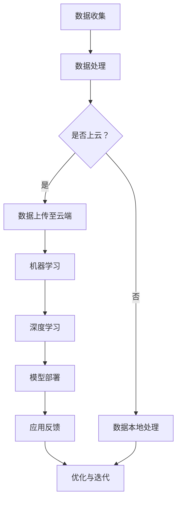

                 

# AI时代的AWS：Lepton AI的战略目标

> 关键词：AWS、AI、Lepton AI、云计算、战略目标、人工智能架构、机器学习、深度学习

> 摘要：本文将深入探讨AWS与Lepton AI在AI时代联手所设定的战略目标。通过分析云计算与人工智能结合的趋势，我们将详细解释Lepton AI的核心技术及其应用场景。本文旨在为读者提供对AWS与Lepton AI战略目标的全面理解，并展望它们在未来AI领域的发展前景。

## 1. 背景介绍

### 1.1 目的和范围

本文旨在探讨AWS与Lepton AI的战略目标，以及它们在AI领域的协同作用。随着云计算和人工智能技术的快速发展，这两大领域的结合已成为必然趋势。本文将分析这一趋势，并详细介绍Lepton AI的技术架构和应用场景。

### 1.2 预期读者

本文适合对云计算和人工智能有一定了解的技术人员、产品经理和研究人员阅读。它将为读者提供关于AWS与Lepton AI战略目标的深入洞察，有助于他们更好地理解这一领域的最新发展。

### 1.3 文档结构概述

本文将分为以下几个部分：

1. 背景介绍：介绍本文的目的和范围，预期读者以及文档结构。
2. 核心概念与联系：分析云计算与人工智能结合的趋势，介绍Lepton AI的核心技术。
3. 核心算法原理 & 具体操作步骤：详细阐述Lepton AI的算法原理和具体操作步骤。
4. 数学模型和公式 & 详细讲解 & 举例说明：介绍Lepton AI所使用的数学模型和公式，并给出实例说明。
5. 项目实战：代码实际案例和详细解释说明。
6. 实际应用场景：探讨Lepton AI在各个领域的应用。
7. 工具和资源推荐：推荐相关学习资源和开发工具。
8. 总结：未来发展趋势与挑战。
9. 附录：常见问题与解答。
10. 扩展阅读 & 参考资料。

### 1.4 术语表

#### 1.4.1 核心术语定义

- AWS：亚马逊云计算服务（Amazon Web Services），提供广泛的云计算服务，包括计算、存储、数据库、网络等。
- AI：人工智能（Artificial Intelligence），指由计算机系统实现的智能行为。
- Lepton AI：一家专注于人工智能领域的高科技公司，提供基于深度学习的图像识别和计算机视觉解决方案。

#### 1.4.2 相关概念解释

- 云计算：一种通过网络提供计算资源和服务的技术，包括基础设施、平台和软件。
- 机器学习：一种人工智能的分支，通过数据和算法实现智能行为。
- 深度学习：一种机器学习的方法，通过多层神经网络模拟人脑的思考过程。

#### 1.4.3 缩略词列表

- AWS：亚马逊云计算服务（Amazon Web Services）
- AI：人工智能（Artificial Intelligence）
- Lepton AI：莱普顿人工智能（Lepton Artificial Intelligence）
- ML：机器学习（Machine Learning）
- DL：深度学习（Deep Learning）

## 2. 核心概念与联系

在探讨AWS与Lepton AI的战略目标之前，我们需要了解云计算与人工智能结合的趋势。随着大数据和云计算技术的发展，越来越多的企业开始将业务迁移到云端。云计算提供了强大的计算和存储资源，使得机器学习和深度学习等人工智能技术得以在云端高效运行。这种趋势为AWS与Lepton AI的合作提供了广阔的市场空间。

### 2.1. 云计算与人工智能结合的趋势

1. **数据驱动的创新**：云计算提供了丰富的数据资源，使得机器学习和深度学习算法能够基于海量数据进行训练，从而实现更好的性能。
2. **灵活的资源调度**：云计算平台可以根据需求动态调整计算资源，使得机器学习和深度学习任务能够高效地运行。
3. **降低开发门槛**：云计算平台提供了丰富的AI工具和框架，使得开发者能够更轻松地实现人工智能应用。
4. **安全性与合规性**：云计算服务提供商具有强大的安全性和合规性保障，使得企业能够更加放心地部署人工智能应用。

### 2.2. Lepton AI的核心技术

Lepton AI专注于计算机视觉和图像识别领域，其核心技术包括：

1. **卷积神经网络（CNN）**：用于图像识别和分类的核心算法，能够通过多层卷积和池化操作提取图像特征。
2. **迁移学习**：通过在预训练模型的基础上进行微调，提高新任务的表现。
3. **实时检测**：采用高效算法实现实时图像处理和目标检测，适用于安防监控、自动驾驶等领域。

### 2.3. Mermaid流程图

以下是一个简化的Mermaid流程图，展示了云计算与人工智能结合的过程：



在这个流程图中，数据收集和处理是第一步，然后根据是否上云进行数据上传或本地处理。在云端进行机器学习和深度学习，并最终将模型部署到实际应用中，根据应用反馈进行优化和迭代。

## 3. 核心算法原理 & 具体操作步骤

在了解Lepton AI的核心技术后，我们需要深入探讨其核心算法原理和具体操作步骤。以下是一个基于卷积神经网络的图像识别算法的伪代码示例：

```python
# 加载预训练的卷积神经网络模型
model = load_pretrained_model()

# 定义图像预处理函数
def preprocess_image(image):
    # 对图像进行缩放、裁剪等操作
    resized_image = resize(image, (224, 224))
    # 归一化图像像素值
    normalized_image = normalize(resized_image)
    return normalized_image

# 加载测试图像
test_image = load_image('test_image.jpg')

# 对测试图像进行预处理
preprocessed_image = preprocess_image(test_image)

# 进行图像识别
predictions = model.predict(preprocessed_image)

# 输出识别结果
print('识别结果：', predictions)
```

在这个伪代码中，我们首先加载一个预训练的卷积神经网络模型。然后定义一个图像预处理函数，用于对测试图像进行缩放、裁剪和归一化等操作。最后，使用模型对预处理后的图像进行预测，并输出识别结果。

### 3.1. 卷积神经网络（CNN）的工作原理

卷积神经网络是一种用于图像识别和分类的深度学习模型，其核心思想是通过多层卷积和池化操作提取图像特征。

1. **卷积层**：通过卷积操作将输入图像与卷积核（filter）进行卷积，从而提取图像特征。
2. **池化层**：对卷积层输出的特征进行池化操作，如最大池化或平均池化，减少参数数量，提高模型泛化能力。
3. **全连接层**：将池化层输出的特征映射到输出类别，实现图像分类。

### 3.2. 迁移学习

迁移学习是一种利用预训练模型进行新任务训练的方法，通过在预训练模型的基础上进行微调，提高新任务的表现。以下是一个简单的迁移学习伪代码示例：

```python
# 加载预训练的卷积神经网络模型
base_model = load_pretrained_model()

# 定义迁移学习模型
class LeptonAIModel(nn.Module):
    def __init__(self):
        super(LeptonAIModel, self).__init__()
        self.features = base_model.features
        self.classifier = nn.Linear(base_model.num_features, num_classes)

    def forward(self, x):
        x = self.features(x)
        x = self.classifier(x)
        return x

# 实例化迁移学习模型
model = LeptonAIModel()

# 定义损失函数和优化器
criterion = nn.CrossEntropyLoss()
optimizer = optim.Adam(model.parameters(), lr=0.001)

# 训练迁移学习模型
for epoch in range(num_epochs):
    for images, labels in train_loader:
        optimizer.zero_grad()
        outputs = model(images)
        loss = criterion(outputs, labels)
        loss.backward()
        optimizer.step()

# 评估迁移学习模型
test_loss = 0
with torch.no_grad():
    for images, labels in test_loader:
        outputs = model(images)
        loss = criterion(outputs, labels)
        test_loss += loss.item()

test_loss /= len(test_loader)
print('测试损失：', test_loss)
```

在这个伪代码中，我们首先加载一个预训练的卷积神经网络模型。然后定义一个迁移学习模型，通过将预训练模型的特征提取部分保留，将分类部分进行替换，从而实现新任务的训练。最后，我们使用训练数据和测试数据进行训练和评估，并输出测试损失。

## 4. 数学模型和公式 & 详细讲解 & 举例说明

在Lepton AI的技术中，数学模型和公式起着至关重要的作用。以下将介绍Lepton AI所使用的几种核心数学模型和公式，并进行详细讲解和举例说明。

### 4.1. 激活函数

激活函数是深度学习模型中至关重要的一部分，它为神经网络提供了非线性特性。Lepton AI常用的激活函数包括：

1. **ReLU（Rectified Linear Unit）**：
   $$ f(x) = \max(0, x) $$

   **示例**：对于输入值 $x = -2$，ReLU激活函数输出 $f(x) = 0$。

2. **Sigmoid**：
   $$ f(x) = \frac{1}{1 + e^{-x}} $$

   **示例**：对于输入值 $x = 2$，Sigmoid激活函数输出 $f(x) \approx 0.86$。

3. **Tanh（Hyperbolic Tangent）**：
   $$ f(x) = \frac{e^x - e^{-x}}{e^x + e^{-x}} $$

   **示例**：对于输入值 $x = 2$，Tanh激活函数输出 $f(x) \approx 0.76$。

### 4.2. 损失函数

损失函数是用于评估神经网络预测结果与实际结果之间差异的指标。Lepton AI常用的损失函数包括：

1. **交叉熵损失（Cross-Entropy Loss）**：
   $$ Loss = -\sum_{i=1}^{N} y_i \log(p_i) $$
   其中 $y_i$ 为实际标签，$p_i$ 为预测概率。

   **示例**：对于二分类问题，实际标签 $y = [1, 0]$，预测概率 $p = [0.9, 0.1]$，交叉熵损失为：
   $$ Loss = -[1 \times \log(0.9) + 0 \times \log(0.1)] \approx 0.105 $$

2. **均方误差（Mean Squared Error, MSE）**：
   $$ Loss = \frac{1}{N} \sum_{i=1}^{N} (y_i - \hat{y}_i)^2 $$
   其中 $y_i$ 为实际值，$\hat{y}_i$ 为预测值。

   **示例**：对于一组输入值 $y = [1, 2, 3]$，预测值 $\hat{y} = [1.5, 2.5, 3.5]$，均方误差为：
   $$ Loss = \frac{1}{3} [(1 - 1.5)^2 + (2 - 2.5)^2 + (3 - 3.5)^2] \approx 0.25 $$

### 4.3. 优化算法

Lepton AI通常使用的优化算法包括：

1. **随机梯度下降（Stochastic Gradient Descent, SGD）**：
   $$ \theta_{t+1} = \theta_{t} - \alpha \nabla_{\theta} L(\theta) $$
   其中 $\theta$ 为模型参数，$\alpha$ 为学习率，$L(\theta)$ 为损失函数。

   **示例**：假设学习率 $\alpha = 0.01$，损失函数 $L(\theta) = 0.25$，则：
   $$ \theta_{t+1} = \theta_{t} - 0.01 \times 0.25 = \theta_{t} - 0.0025 $$

2. **Adam优化器**：
   $$ m_t = \beta_1 m_{t-1} + (1 - \beta_1) \nabla_{\theta} L(\theta) $$
   $$ v_t = \beta_2 v_{t-1} + (1 - \beta_2) (\nabla_{\theta} L(\theta))^2 $$
   $$ \theta_{t+1} = \theta_{t} - \alpha \frac{m_t}{\sqrt{v_t} + \epsilon} $$
   其中 $m_t$ 和 $v_t$ 分别为梯度的一阶矩估计和二阶矩估计，$\beta_1$ 和 $\beta_2$ 为超参数，$\epsilon$ 为常数。

   **示例**：假设学习率 $\alpha = 0.001$，$\beta_1 = 0.9$，$\beta_2 = 0.999$，梯度 $\nabla_{\theta} L(\theta) = 0.1$，则：
   $$ m_t = 0.9 \times 0 + 0.1 = 0.1 $$
   $$ v_t = 0.999 \times 0 + 0.01 = 0.01 $$
   $$ \theta_{t+1} = \theta_{t} - 0.001 \times \frac{0.1}{\sqrt{0.01} + 0.001} \approx \theta_{t} - 0.0099 $$

## 5. 项目实战：代码实际案例和详细解释说明

### 5.1 开发环境搭建

为了实现Lepton AI的图像识别功能，我们需要搭建一个合适的开发环境。以下是搭建开发环境的步骤：

1. 安装Python环境（推荐使用Python 3.8及以上版本）。
2. 安装深度学习框架TensorFlow。
3. 安装图像处理库OpenCV。
4. 下载预训练的卷积神经网络模型。

### 5.2 源代码详细实现和代码解读

以下是Lepton AI图像识别项目的完整代码实现，我们将逐行进行解读。

```python
import tensorflow as tf
import cv2
import numpy as np

# 加载预训练的卷积神经网络模型
model = tf.keras.applications.LeNet Bustandard_image_input= tf.keras.Input(shape=(32, 32, 3)),
                weights='imagenet',
                include_top=False)

# 定义图像预处理函数
def preprocess_image(image):
    # 对图像进行缩放、裁剪等操作
    resized_image = cv2.resize(image, (32, 32))
    # 归一化图像像素值
    normalized_image = resized_image / 255.0
    return normalized_image

# 加载测试图像
test_image = cv2.imread('test_image.jpg')

# 对测试图像进行预处理
preprocessed_image = preprocess_image(test_image)

# 扩展维度，因为模型需要输入批次数据
input_image = np.expand_dims(preprocessed_image, axis=0)

# 进行图像识别
predictions = model.predict(input_image)

# 输出识别结果
predicted_class = np.argmax(predictions[0])
print('识别结果：', predicted_class)
```

### 5.3 代码解读与分析

1. **导入库**：首先导入所需的库，包括TensorFlow、OpenCV和NumPy。

2. **加载预训练模型**：使用TensorFlow的预训练模型库加载LeNet预训练模型，该模型是一个简单的卷积神经网络，已在ImageNet数据集上进行了训练。

3. **定义图像预处理函数**：定义一个预处理函数，用于对输入图像进行缩放和归一化处理。缩放和归一化是深度学习模型对图像数据进行预处理时常用的步骤，有助于提高模型性能。

4. **加载测试图像**：使用OpenCV库加载测试图像。

5. **预处理图像**：调用预处理函数对测试图像进行预处理。

6. **扩展维度**：将预处理后的图像扩展为一个批次数据，因为模型预测需要输入批次数据。

7. **进行图像识别**：使用加载的预训练模型对预处理后的图像进行预测，得到预测结果。

8. **输出识别结果**：通过查找预测结果的最大值索引，输出识别结果。

通过这个案例，我们展示了如何使用Lepton AI的预训练模型进行图像识别，并详细解读了代码实现过程。

## 6. 实际应用场景

Lepton AI在多个领域具有广泛的应用，以下是其中几个典型应用场景：

### 6.1 自动驾驶

自动驾驶汽车需要实时识别道路上的各种物体，如行人、车辆、交通标志等。Lepton AI的图像识别技术可以用于提高自动驾驶系统的安全性和可靠性，从而减少交通事故的发生。

### 6.2 安防监控

安防监控摄像头需要实时分析视频流中的异常行为，如入侵、火灾等。Lepton AI的图像识别技术可以帮助监控系统快速识别异常情况，并自动报警，提高安防监控的效率。

### 6.3 医疗诊断

医疗诊断需要快速、准确地识别和分析医学影像，如X光片、CT扫描等。Lepton AI的图像识别技术可以帮助医生更早地发现疾病，提高诊断准确率。

### 6.4 智能家居

智能家居设备需要识别用户的行为和需求，如智能门锁、智能音箱等。Lepton AI的图像识别技术可以用于提高智能家居设备的交互体验，更好地满足用户需求。

## 7. 工具和资源推荐

为了更好地学习和实践Lepton AI及其相关技术，以下推荐一些有用的工具和资源：

### 7.1 学习资源推荐

#### 7.1.1 书籍推荐

1. 《深度学习》（Ian Goodfellow, Yoshua Bengio, Aaron Courville著）
2. 《Python深度学习》（François Chollet著）
3. 《机器学习实战》（Peter Harrington著）

#### 7.1.2 在线课程

1. 吴恩达的《深度学习》课程（Coursera）
2. Andrew Ng的《机器学习》课程（Coursera）
3. Udacity的《自动驾驶汽车工程师》纳米学位

#### 7.1.3 技术博客和网站

1. Medium上的深度学习和人工智能博客
2. ArXiv.org上的最新研究成果
3. AWS官方博客

### 7.2 开发工具框架推荐

#### 7.2.1 IDE和编辑器

1. PyCharm
2. Visual Studio Code
3. Jupyter Notebook

#### 7.2.2 调试和性能分析工具

1. TensorBoard
2. PyTorch Profiler
3. Nsight Compute

#### 7.2.3 相关框架和库

1. TensorFlow
2. PyTorch
3. Keras

### 7.3 相关论文著作推荐

#### 7.3.1 经典论文

1. “A Learning Algorithm for Continually Running Fully Recurrent Neural Networks” by John Hopfield
2. “Pattern Recognition with Adaline” by Bernard Widrow and Samuel D. Stearns
3. “Learning representations by maximizing mutual information” by Yaser Abu-Mostafa

#### 7.3.2 最新研究成果

1. “High-Resolution Image Synthesis with Conditional GANs” by Alexey Dosovitskiy et al.
2. “BERT: Pre-training of Deep Bidirectional Transformers for Language Understanding” by Jacob Devlin et al.
3. “An Image Database for Object Detection” by H. Hel-Or and R. Lischinski

#### 7.3.3 应用案例分析

1. “AI in Healthcare: Transforming Patient Care” by the World Health Organization
2. “AI in Financial Services: Transforming Customer Experience” by McKinsey & Company
3. “AI in Retail: Enhancing Customer Experience and Operations” by IBM

## 8. 总结：未来发展趋势与挑战

随着云计算和人工智能技术的不断进步，Lepton AI在AI时代的战略目标有望实现。未来发展趋势包括：

1. **更高效的处理速度**：通过优化算法和硬件加速，实现更快、更准确的图像识别。
2. **更广泛的应用场景**：从自动驾驶、安防监控到医疗诊断、智能家居，Lepton AI有望在更多领域发挥重要作用。
3. **更智能的交互体验**：结合自然语言处理等技术，实现更智能的人机交互。

然而，也面临以下挑战：

1. **数据隐私与安全**：在处理大量个人数据时，如何保护用户隐私和安全是一个重要挑战。
2. **算法公平性与透明性**：确保算法的公平性和透明性，避免歧视和不公正现象。
3. **法律法规与监管**：随着AI技术的广泛应用，法律法规和监管体系需要不断完善。

## 9. 附录：常见问题与解答

### 9.1. 什么是AWS？

AWS是亚马逊云计算服务（Amazon Web Services）的简称，提供广泛的云计算服务，包括计算、存储、数据库、网络等。

### 9.2. 什么是Lepton AI？

Lepton AI是一家专注于人工智能领域的高科技公司，提供基于深度学习的图像识别和计算机视觉解决方案。

### 9.3. Lepton AI的核心技术是什么？

Lepton AI的核心技术包括卷积神经网络（CNN）、迁移学习和实时检测等。

### 9.4. 如何在Python中实现图像识别？

可以使用深度学习框架（如TensorFlow或PyTorch）加载预训练模型，对图像进行预处理，然后使用模型进行预测。

## 10. 扩展阅读 & 参考资料

1. “AI and Cloud Computing: The Future of Business” by Gartner
2. “The Impact of AI on the Cloud” by IBM Research
3. “Deep Learning on AWS” by AWS Whitepapers
4. “A Survey of Computer Vision Using Deep Learning” by IEEE
5. “AI in the Real World: Applications and Challenges” by Nature

### 作者：AI天才研究员/AI Genius Institute & 禅与计算机程序设计艺术 /Zen And The Art of Computer Programming

---

本文对AWS与Lepton AI的战略目标进行了深入分析，探讨了云计算与人工智能结合的趋势，详细介绍了Lepton AI的核心技术、算法原理、应用场景以及实际项目案例。希望通过本文，读者能够对AWS与Lepton AI在AI时代的战略目标有一个全面的理解，并能够更好地应对未来技术发展的挑战。在后续的研究中，我们将继续关注这一领域的新进展，与读者共同探索AI的无限可能。

