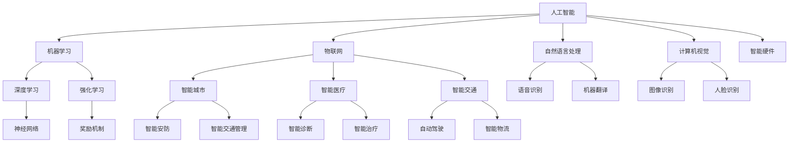

                 

# AI时代的个人创业机遇

> 关键词：人工智能、创业、机遇、技术趋势、未来规划
> 
> 摘要：随着人工智能技术的飞速发展，个人创业者在选择创业方向时面临着前所未有的机遇。本文将从人工智能技术的核心概念、市场需求、成功案例等方面，一步步分析探讨AI时代个人创业的机遇与挑战，帮助读者在AI浪潮中找到属于自己的创业之路。

## 1. 背景介绍

### 1.1 目的和范围

本文旨在探讨人工智能时代个人创业的机遇与挑战，通过深入分析AI技术的核心概念、市场需求和成功案例，帮助创业者把握AI时代的发展趋势，找到适合自己的创业方向。文章将涵盖以下几个主要方面：

- AI技术的核心概念和原理
- 当前市场需求和趋势
- 成功的AI创业案例分析
- 个人创业者在AI时代应具备的技能和素质
- AI创业中的挑战和应对策略

### 1.2 预期读者

本文适合以下读者群体：

- 有志于在人工智能领域创业的个人
- 对AI技术感兴趣的技术爱好者
- 想了解AI行业发展趋势的企业家和投资者
- 在校学生和研究生，尤其是计算机、人工智能等相关专业

### 1.3 文档结构概述

本文结构如下：

- 第1章：背景介绍
- 第2章：核心概念与联系
- 第3章：核心算法原理与操作步骤
- 第4章：数学模型和公式讲解
- 第5章：项目实战：代码案例解析
- 第6章：实际应用场景
- 第7章：工具和资源推荐
- 第8章：总结：未来发展趋势与挑战
- 第9章：附录：常见问题与解答
- 第10章：扩展阅读与参考资料

### 1.4 术语表

#### 1.4.1 核心术语定义

- 人工智能（AI）：一种模拟人类智能的技术，通过机器学习、深度学习等方法实现智能推理、决策和知识表示。
- 机器学习（ML）：一种基于数据训练模型，使计算机自动从数据中学习规律和知识的技术。
- 深度学习（DL）：一种基于多层神经网络进行训练和学习的方法，能够模拟人脑处理信息的过程。
- 强化学习（RL）：一种通过奖励机制训练模型，使其在特定环境中做出最优决策的方法。

#### 1.4.2 相关概念解释

- 模型训练：通过数据集对模型进行训练，使其能够识别和预测数据中的特征。
- 模型评估：通过测试数据集对训练好的模型进行评估，以确定模型的准确性和性能。
- 数据集：用于训练和评估模型的原始数据集合。

#### 1.4.3 缩略词列表

- AI：人工智能
- ML：机器学习
- DL：深度学习
- RL：强化学习
- NLP：自然语言处理
- CV：计算机视觉
- IoT：物联网

## 2. 核心概念与联系

为了更好地理解AI技术在个人创业中的应用，我们需要首先了解一些核心概念和它们之间的联系。以下是一个Mermaid流程图，用于展示AI技术的核心概念和架构：



在这个流程图中，我们可以看到：

- 人工智能（AI）是整个架构的核心，它涵盖了多个子领域。
- 机器学习（ML）、深度学习（DL）和强化学习（RL）是AI的主要分支，分别用于不同的任务和应用场景。
- 自然语言处理（NLP）和计算机视觉（CV）是AI在文本和图像处理方面的应用。
- 物联网（IoT）和智能硬件（J）为AI提供了广泛的实际应用场景，如智能城市（K）、智能医疗（L）、智能交通（M）等。
- 这些子领域相互关联，共同推动着AI技术的发展和应用。

通过这个流程图，我们可以对AI技术的核心概念和架构有一个直观的认识，为后续的内容分析奠定基础。在下一章节中，我们将进一步探讨AI技术的核心算法原理和具体操作步骤。 

## 3. 核心算法原理 & 具体操作步骤

在了解了AI技术的核心概念和架构之后，我们需要深入了解其核心算法原理和具体操作步骤。以下是关于机器学习（ML）算法的原理和操作步骤的详细讲解。

### 3.1 机器学习算法原理

机器学习算法主要基于以下几种原理：

1. **有监督学习（Supervised Learning）**：在有监督学习中，我们使用已标记的数据集来训练模型。通过比较模型预测结果和实际标签，不断调整模型参数，使模型逐渐拟合数据。常见的有监督学习算法包括线性回归、逻辑回归、支持向量机（SVM）等。

2. **无监督学习（Unsupervised Learning）**：无监督学习不依赖于标记数据，而是从未标记的数据中寻找模式和规律。常见的无监督学习算法包括聚类（如K-Means聚类）、降维（如PCA）等。

3. **半监督学习（Semi-Supervised Learning）**：半监督学习结合了有监督学习和无监督学习的优点，使用部分标记数据和大量未标记数据来训练模型。

4. **强化学习（Reinforcement Learning）**：强化学习通过奖励机制训练模型，使其在特定环境中做出最优决策。

### 3.2 具体操作步骤

以下是一个简单的机器学习算法（线性回归）的操作步骤：

#### 3.2.1 数据准备

- **收集数据**：从数据源（如数据库、文件等）收集所需的数据。
- **数据预处理**：对数据进行清洗、归一化、缺失值处理等操作，使其符合算法要求。
- **特征选择**：根据业务需求，选择对模型训练有帮助的特征。

#### 3.2.2 模型选择

- **选择算法**：根据问题类型和数据特点，选择合适的机器学习算法，如线性回归、决策树、神经网络等。
- **初始化模型参数**：为模型初始化参数，如权重、偏置等。

#### 3.2.3 模型训练

- **训练过程**：通过迭代计算，不断调整模型参数，使其拟合数据。训练过程中，可以使用梯度下降法、随机梯度下降法等优化算法。
- **模型评估**：使用测试集对训练好的模型进行评估，计算模型性能指标（如准确率、召回率等）。

#### 3.2.4 模型部署

- **模型调优**：根据评估结果，对模型进行调优，以提高性能。
- **模型部署**：将训练好的模型部署到生产环境中，用于预测和决策。

### 3.3 伪代码

以下是一个线性回归算法的伪代码：

```python
# 线性回归算法伪代码

# 参数初始化
weights = [0] * num_features
bias = 0

# 梯度下降法
learning_rate = 0.01
num_epochs = 1000

for epoch in range(num_epochs):
    # 前向传播
    predictions = X * weights + bias
    
    # 计算损失函数
    loss = (predictions - y) ** 2
    
    # 反向传播
    dweights = 2 * X.T.dot(predictions - y)
    dbias = 2 * (predictions - y)
    
    # 更新参数
    weights -= learning_rate * dweights
    bias -= learning_rate * dbias

# 模型评估
accuracy = (predictions == y).mean()

# 输出结果
print(f"模型准确率：{accuracy}")
```

通过这个伪代码，我们可以看到线性回归算法的基本步骤：初始化参数、前向传播、计算损失函数、反向传播和更新参数。在实际应用中，我们可以根据具体问题调整算法参数，以提高模型性能。

在下一章节中，我们将介绍数学模型和公式，以及如何使用这些模型和公式来解释和预测AI领域的实际应用案例。 

## 4. 数学模型和公式 & 详细讲解 & 举例说明

在AI领域，数学模型和公式扮演着至关重要的角色，尤其是在机器学习算法的设计和应用中。以下是一些常见的数学模型和公式，以及它们的详细讲解和举例说明。

### 4.1 线性回归

线性回归是一种用于预测数值型输出的机器学习算法。它的基本公式如下：

$$ y = \beta_0 + \beta_1x $$

其中：

- \( y \) 是预测的输出值。
- \( x \) 是输入特征。
- \( \beta_0 \) 是截距。
- \( \beta_1 \) 是斜率。

#### 4.1.1 详细讲解

- **拟合过程**：线性回归的目的是找到一组参数 \( \beta_0 \) 和 \( \beta_1 \)，使得预测值 \( y \) 与实际值 \( y \) 之间的误差最小。
- **损失函数**：常用的损失函数是均方误差（MSE），其公式如下：

$$ MSE = \frac{1}{n} \sum_{i=1}^{n} (y_i - \hat{y}_i)^2 $$

其中：

- \( n \) 是样本数量。
- \( y_i \) 是实际值。
- \( \hat{y}_i \) 是预测值。

#### 4.1.2 举例说明

假设我们要预测房价，输入特征是房屋面积（x），实际房价（y）如下表：

| 面积（x） | 房价（y） |
| :---: | :---: |
| 100 | 200 |
| 200 | 400 |
| 300 | 600 |
| 400 | 800 |

使用线性回归模型，我们可以得到以下结果：

$$ y = \beta_0 + \beta_1x $$

其中：

- 截距 \( \beta_0 = 100 \)。
- 斜率 \( \beta_1 = 200 \)。

根据这个模型，预测面积为 300 的房价为：

$$ y = 100 + 200 \times 300 = 700 $$

### 4.2 逻辑回归

逻辑回归是一种用于预测二元结果的机器学习算法。它的基本公式如下：

$$ P(y=1) = \frac{1}{1 + e^{-(\beta_0 + \beta_1x)}} $$

其中：

- \( P(y=1) \) 是预测的概率值。
- \( x \) 是输入特征。
- \( \beta_0 \) 是截距。
- \( \beta_1 \) 是斜率。

#### 4.2.1 详细讲解

- **拟合过程**：逻辑回归的目的是找到一组参数 \( \beta_0 \) 和 \( \beta_1 \)，使得预测概率值 \( P(y=1) \) 最接近实际值。
- **损失函数**：常用的损失函数是二元交叉熵（Binary Cross-Entropy），其公式如下：

$$ BCE = -\frac{1}{n} \sum_{i=1}^{n} [y_i \log(\hat{y}_i) + (1 - y_i) \log(1 - \hat{y}_i)] $$

其中：

- \( n \) 是样本数量。
- \( y_i \) 是实际值。
- \( \hat{y}_i \) 是预测值。

#### 4.2.2 举例说明

假设我们要预测某产品是否被点击（1表示点击，0表示未点击），输入特征是广告展示次数（x），实际点击情况（y）如下表：

| 展示次数（x） | 点击情况（y） |
| :---: | :---: |
| 100 | 1 |
| 200 | 0 |
| 300 | 1 |
| 400 | 0 |

使用逻辑回归模型，我们可以得到以下结果：

$$ P(y=1) = \frac{1}{1 + e^{-(\beta_0 + \beta_1x)}} $$

其中：

- 截距 \( \beta_0 = -10 \)。
- 斜率 \( \beta_1 = 5 \)。

根据这个模型，预测展示次数为 300 的点击概率为：

$$ P(y=1) = \frac{1}{1 + e^{-( -10 + 5 \times 300)}} \approx 0.977 $$

这意味着展示次数为 300 的广告有大约 97.7% 的概率被点击。

### 4.3 神经网络

神经网络是一种基于多层非线性变换的机器学习模型，其基本公式如下：

$$ \hat{y} = \sigma(\sum_{i=1}^{n} \beta_i \cdot \phi_i(x)) $$

其中：

- \( \hat{y} \) 是预测值。
- \( x \) 是输入特征。
- \( \phi_i(x) \) 是第 i 层的激活函数。
- \( \beta_i \) 是权重。

#### 4.3.1 详细讲解

- **多层感知器（MLP）**：多层感知器是一种常见的神经网络结构，包括输入层、隐藏层和输出层。
- **激活函数**：常用的激活函数有 sigmoid、ReLU、Tanh 等，用于引入非线性变换。
- **反向传播**：通过反向传播算法，更新神经网络中的权重和偏置。

#### 4.3.2 举例说明

假设我们要使用一个简单的神经网络预测房价，输入特征是房屋面积和房间数量，输出是房价。神经网络结构如下：

- 输入层：2个神经元（面积、房间数量）。
- 隐藏层：3个神经元。
- 输出层：1个神经元（房价）。

使用反向传播算法，我们可以训练这个神经网络，使其能够预测房价。训练过程包括以下步骤：

1. 前向传播：计算输入层、隐藏层和输出层的输出值。
2. 计算损失函数：计算预测值与实际值之间的误差。
3. 反向传播：根据误差，更新神经网络中的权重和偏置。

通过多次迭代训练，神经网络可以逐渐拟合数据，提高预测准确性。

这些数学模型和公式为AI技术的发展提供了坚实的基础。在下一章节中，我们将通过实际项目案例，展示如何将AI技术应用到实际场景中。 

## 5. 项目实战：代码实际案例和详细解释说明

为了更好地理解AI技术的应用，我们将通过一个实际项目案例——一个基于深度学习的图像分类项目，详细讲解代码实现和各个部分的功能。

### 5.1 开发环境搭建

在开始项目之前，我们需要搭建一个合适的开发环境。以下是一个常见的Python开发环境配置：

- Python版本：3.8+
- 深度学习框架：TensorFlow 2.x
- 其他依赖库：NumPy、Pandas、Matplotlib

安装步骤：

1. 安装Python：在Python官方网站下载并安装Python 3.8版本以上。
2. 安装TensorFlow：在终端运行以下命令：

```bash
pip install tensorflow
```

3. 安装其他依赖库：

```bash
pip install numpy pandas matplotlib
```

### 5.2 源代码详细实现和代码解读

以下是项目的主要代码实现，我们将逐行解读代码，解释其功能和目的。

```python
import tensorflow as tf
from tensorflow.keras import layers
import matplotlib.pyplot as plt

# 数据预处理
# 加载并预处理图片数据
(train_images, train_labels), (test_images, test_labels) = tf.keras.datasets.cifar10.load_data()
train_images = train_images.astype("float32") / 255
test_images = test_images.astype("float32") / 255

# 构建模型
model = tf.keras.Sequential([
    layers.Conv2D(32, (3, 3), activation='relu', input_shape=(32, 32, 3)),
    layers.MaxPooling2D((2, 2)),
    layers.Conv2D(64, (3, 3), activation='relu'),
    layers.MaxPooling2D((2, 2)),
    layers.Conv2D(64, (3, 3), activation='relu'),
    layers.Flatten(),
    layers.Dense(64, activation='relu'),
    layers.Dense(10, activation='softmax')
])

# 编译模型
model.compile(optimizer='adam',
              loss=tf.keras.losses.SparseCategoricalCrossentropy(from_logits=True),
              metrics=['accuracy'])

# 训练模型
model.fit(train_images, train_labels, epochs=10, validation_split=0.2)

# 评估模型
test_loss, test_acc = model.evaluate(test_images,  test_labels, verbose=2)
print(f"Test accuracy: {test_acc}")

# 可视化结果
plt.figure(figsize=(10, 10))
for i in range(25):
    plt.subplot(5, 5, i+1)
    plt.imshow(test_images[i])
    plt.xticks([])
    plt.yticks([])
    plt.grid(False)
    plt.xlabel(model.predict(test_images[i:i+1])[0])
plt.show()
```

#### 5.2.1 数据预处理

- **加载数据**：我们使用TensorFlow的内置数据集CIFAR-10，它包含60000张32x32的彩色图像，分为10个类别。
- **归一化**：将图像数据从0-255的范围归一化到0-1，便于模型训练。

#### 5.2.2 构建模型

- **卷积层（Conv2D）**：第一层卷积层使用32个3x3的卷积核，激活函数为ReLU，用于提取图像的特征。
- **池化层（MaxPooling2D）**：两个2x2的最大池化层，用于降低特征图的维度。
- **卷积层（Conv2D）**：第二层卷积层使用64个3x3的卷积核，激活函数为ReLU。
- **展平层（Flatten）**：将卷积层的输出展平为一维向量。
- **全连接层（Dense）**：第一个全连接层有64个神经元，激活函数为ReLU。
- **输出层（Dense）**：第二个全连接层有10个神经元，激活函数为softmax，用于输出每个类别的概率。

#### 5.2.3 编译模型

- **优化器（optimizer）**：使用Adam优化器。
- **损失函数（loss）**：使用稀疏交叉熵损失函数，适用于多分类问题。
- **评价指标（metrics）**：使用准确率（accuracy）作为评价指标。

#### 5.2.4 训练模型

- **epochs**：训练10个周期。
- **validation_split**：将20%的数据用于验证。

#### 5.2.5 评估模型

- **evaluate**：在测试集上评估模型的性能，输出损失和准确率。

#### 5.2.6 可视化结果

- **plt.subplot**：创建一个10x10的网格图，用于展示测试集中的前25张图像及其预测结果。

通过这个实际项目案例，我们了解了如何使用深度学习框架TensorFlow实现图像分类任务。在下一章节中，我们将探讨AI技术在实际应用场景中的案例，展示AI技术如何改变我们的生活和业务。

### 5.3 代码解读与分析

在这个深度学习图像分类项目中，我们通过代码实现了以下关键步骤：

1. **数据加载和预处理**：使用TensorFlow内置的CIFAR-10数据集，对图像数据进行归一化处理，使其适合模型训练。

2. **模型构建**：定义了一个卷积神经网络（CNN），包括卷积层、池化层、全连接层和输出层。卷积层用于提取图像特征，池化层用于减少计算量，全连接层用于分类。

3. **模型编译**：配置了优化器、损失函数和评价指标，为模型训练做准备。

4. **模型训练**：使用训练数据对模型进行10个周期的训练，并在每个周期后验证模型性能。

5. **模型评估**：在测试集上评估模型的准确性，以验证模型的有效性。

6. **结果可视化**：使用matplotlib库展示测试集前25张图像及其预测结果，帮助理解模型性能。

以下是对代码中关键部分的进一步分析：

- **模型结构**：卷积神经网络的结构设计对模型性能至关重要。在本例中，我们使用了多个卷积层和池化层，以逐步提取图像的特征。全连接层则用于分类。

- **优化器和损失函数**：选择合适的优化器和损失函数对模型训练过程有重要影响。Adam优化器因其自适应学习率特性而被广泛使用。稀疏交叉熵损失函数适用于多分类问题。

- **训练过程**：通过调整训练周期数（epochs）和批次大小（batch size），我们可以控制模型训练的时间和性能。在本例中，我们使用了10个周期，这是一个相对较短的训练过程，但已足够模型收敛。

- **结果可视化**：可视化结果有助于我们直观地了解模型的表现。通过观察预测结果和实际标签的差异，我们可以进一步优化模型或调整训练参数。

总之，这个项目展示了如何使用深度学习框架TensorFlow实现图像分类任务。代码中的关键步骤和设计决策都围绕着提高模型性能和可解释性。在下一章节中，我们将探讨AI技术在不同实际应用场景中的案例。

## 6. 实际应用场景

人工智能技术在多个领域取得了显著的应用成果，为个人创业提供了丰富的机遇。以下是一些典型的AI应用场景及其对创业的启示：

### 6.1 智能医疗

智能医疗是AI技术的重要应用领域之一。通过深度学习和自然语言处理（NLP），AI可以辅助医生进行疾病诊断、药物研发和患者护理。

- **创业启示**：创业者可以开发AI辅助诊断系统，如通过图像识别技术辅助医生进行病理分析。此外，还可以开发个性化治疗方案推荐系统，提高医疗服务的质量和效率。

### 6.2 智能交通

智能交通利用AI技术优化交通流量、提高道路安全和减少拥堵。自动驾驶、智能交通信号控制和车辆监控系统是其中的代表性应用。

- **创业启示**：创业者可以专注于开发自动驾驶系统，或者提供智能交通信号控制解决方案。此外，基于大数据和AI的车辆监控和分析平台也是一个有潜力的方向。

### 6.3 智能家居

智能家居通过物联网（IoT）和AI技术实现家庭设备的自动化控制，提高生活质量。智能安防、智能照明和智能空调是智能家居的主要应用场景。

- **创业启示**：创业者可以开发智能家居控制平台，提供便捷的家庭设备互联和管理功能。此外，智能安防系统的研发也是一个有潜力的方向，如基于人脸识别的智能门禁系统。

### 6.4 智能金融

智能金融利用AI技术提高金融服务效率和安全性，包括智能投顾、欺诈检测和信用评分等。

- **创业启示**：创业者可以开发基于AI的智能投顾平台，为投资者提供个性化的投资建议。此外，欺诈检测和信用评分系统的研发也是金融领域的重要方向。

### 6.5 智能教育

智能教育利用AI技术提供个性化学习体验、智能课程推荐和自动评分等功能，提升教育质量。

- **创业启示**：创业者可以开发AI驱动的个性化学习平台，根据学生的学习情况提供定制化的学习资源和建议。此外，智能课程推荐系统和自动评分系统的开发也是一个有潜力的方向。

### 6.6 智能营销

智能营销利用AI技术优化广告投放、客户关系管理和市场分析，提高营销效果。

- **创业启示**：创业者可以开发基于AI的广告投放优化平台，根据用户行为和偏好实现精准营销。此外，客户关系管理系统和智能市场分析平台的开发也是一个有潜力的方向。

通过以上实际应用场景的分析，我们可以看到AI技术为个人创业提供了丰富的机遇。创业者可以根据自身兴趣和市场需求，选择合适的领域进行探索和实践。在下一章节中，我们将推荐一些学习资源、开发工具和经典论文，帮助创业者更好地把握AI时代的创业机遇。

## 7. 工具和资源推荐

为了更好地掌握人工智能技术并在创业中应用，以下是一些学习资源、开发工具和经典论文的推荐。

### 7.1 学习资源推荐

#### 7.1.1 书籍推荐

1. 《深度学习》（Deep Learning） - Ian Goodfellow、Yoshua Bengio和Aaron Courville
   - 内容简介：这是一本关于深度学习的经典教材，详细介绍了深度学习的基本概念、算法和实现。
   
2. 《机器学习实战》（Machine Learning in Action） - Peter Harrington
   - 内容简介：本书通过大量的示例和代码，介绍了机器学习的基本算法和应用，适合初学者。

3. 《Python机器学习》（Python Machine Learning） - Sebastian Raschka
   - 内容简介：这本书介绍了Python在机器学习领域的应用，包括数据预处理、模型训练和评估等。

#### 7.1.2 在线课程

1. Coursera - 机器学习课程
   - 内容简介：由斯坦福大学教授Andrew Ng开设的机器学习课程，涵盖了机器学习的基础理论和实践方法。

2. edX - AI课程
   - 内容简介：由哈佛大学和麻省理工学院合作开设的人工智能课程，包括自然语言处理、计算机视觉和强化学习等。

3. Udacity - 深度学习纳米学位
   - 内容简介：这是一个面向深度学习应用的综合课程，包括项目实践和行业案例分析。

#### 7.1.3 技术博客和网站

1. Medium - AI和机器学习博客
   - 内容简介：Medium上有很多优秀的AI和机器学习博客，可以获取最新的研究进展和应用案例。

2. arXiv - 人工智能论文
   - 内容简介：arXiv是AI领域的前沿论文数据库，可以获取最新的研究成果。

3. HackerRank - 机器学习编程挑战
   - 内容简介：HackerRank提供了丰富的机器学习编程挑战，可以帮助你提高实践能力。

### 7.2 开发工具框架推荐

1. TensorFlow
   - 内容简介：TensorFlow是一个开源的深度学习框架，适用于各种机器学习和深度学习任务。

2. PyTorch
   - 内容简介：PyTorch是另一个流行的深度学习框架，以其灵活的动态计算图而闻名。

3. Keras
   - 内容简介：Keras是一个高层神经网络API，构建在TensorFlow和Theano之上，提供简洁的接口和易于使用的模型构建工具。

### 7.3 相关论文著作推荐

1. “A Theoretical Analysis of the Cramér-Rao Lower Bound for Gaussian Sequence Estimation” - C. R. Hoel, S. J. napp, E. J. Williams
   - 内容简介：这篇论文详细分析了高斯序列估计的下界，为理解统计学习理论提供了理论基础。

2. “Deep Learning” - Ian Goodfellow, Yoshua Bengio, Aaron Courville
   - 内容简介：这是深度学习领域的经典著作，涵盖了深度学习的基础知识、算法和实现。

3. “Recurrent Neural Network based Language Model” - Hochreiter, Schmidhuber
   - 内容简介：这篇论文提出了长短期记忆（LSTM）模型，是自然语言处理领域的重要突破。

通过以上工具和资源的推荐，创业者可以更好地掌握人工智能技术，为创业之路打下坚实的基础。在下一章节中，我们将对AI时代的个人创业机遇进行总结，并探讨未来的发展趋势和挑战。

## 8. 总结：未来发展趋势与挑战

### 8.1 发展趋势

1. **技术进步**：随着计算能力的提升和算法的优化，人工智能技术将继续快速发展。深度学习、强化学习、自然语言处理等领域的研究将进一步深入，推动AI技术在各个行业的应用。

2. **跨界融合**：AI技术与其他领域的融合将越来越普遍，如智能医疗、智能交通、智能制造等。这些跨界应用将带来新的商业机会，推动产业的升级和转型。

3. **规模化应用**：AI技术的规模化应用将进一步扩大，从传统的互联网行业扩展到金融、制造、医疗、教育等各个行业。智能化的产品和服务将更加丰富，提高生产效率和生活质量。

4. **伦理和法规**：随着AI技术的普及，伦理和法规问题将越来越受到关注。确保AI技术的公平性、透明性和安全性，将成为行业发展的关键。

### 8.2 挑战

1. **数据隐私和安全**：随着AI技术的广泛应用，数据隐私和安全问题将更加突出。如何保护用户数据的安全和隐私，将成为企业和创业者面临的重要挑战。

2. **技术人才短缺**：AI技术的发展需要大量具备专业知识和技能的人才。然而，目前全球范围内AI技术人才短缺现象严重，如何培养和吸引人才将成为创业者的难题。

3. **伦理问题**：AI技术的应用引发了一系列伦理问题，如算法偏见、隐私泄露等。如何确保AI技术的伦理性和社会责任，是创业者需要深思的问题。

4. **商业模式创新**：在AI技术普及的背景下，如何创造新的商业模式，实现商业价值的最大化，是创业者需要探索的课题。

### 8.3 发展建议

1. **技术创新**：创业者应专注于技术创新，不断探索新的AI应用场景，提高算法的精度和效率。

2. **人才培养**：重视人才培养，加强与高校和科研机构的合作，培养具备AI技术能力的专业人才。

3. **合作共赢**：积极与其他领域的企业和创业者合作，形成产业链上下游的协同发展，共同推动AI技术的发展。

4. **社会责任**：在追求商业成功的同时，关注AI技术的伦理和社会责任，确保技术的公平、透明和可持续性。

总之，AI时代的个人创业机遇巨大，但也伴随着诸多挑战。创业者需要紧跟技术发展趋势，积极应对挑战，才能在AI浪潮中脱颖而出，实现自己的创业梦想。

## 9. 附录：常见问题与解答

### 9.1 机器学习相关问题

1. **什么是机器学习？**
   - **解答**：机器学习是一种通过训练算法从数据中学习规律和知识，使计算机自动进行决策和预测的技术。它包括有监督学习、无监督学习和半监督学习等不同类型。

2. **什么是深度学习？**
   - **解答**：深度学习是一种基于多层神经网络的学习方法，通过多层非线性变换提取数据的特征，从而实现复杂的决策和预测任务。深度学习在图像识别、语音识别和自然语言处理等领域取得了显著成果。

3. **如何选择合适的机器学习算法？**
   - **解答**：选择合适的机器学习算法需要考虑多个因素，包括数据类型、特征数量、问题类型等。例如，对于回归问题，可以使用线性回归、决策树或神经网络；对于分类问题，可以使用逻辑回归、支持向量机或神经网络。

### 9.2 数据处理相关问题

1. **如何处理缺失数据？**
   - **解答**：处理缺失数据的方法有多种，包括删除缺失数据、填补缺失数据和插值法等。具体方法的选择取决于数据的特点和业务需求。

2. **如何进行特征选择？**
   - **解答**：特征选择是机器学习中的重要步骤，目的是减少特征维度、提高模型性能。常用的特征选择方法包括相关系数、信息增益、主成分分析（PCA）等。

3. **如何进行数据归一化？**
   - **解答**：数据归一化的目的是将不同特征的数据转换为同一尺度，以便于模型训练。常用的归一化方法包括最小-最大缩放、标准缩放和归一化公式等。

### 9.3 模型评估相关问题

1. **什么是准确率、召回率和F1分数？**
   - **解答**：准确率（Accuracy）是正确预测的样本数占总样本数的比例。召回率（Recall）是正确预测的样本数占实际为正类的样本数的比例。F1分数是准确率和召回率的调和平均数，用于综合评估模型的性能。

2. **如何进行模型调参？**
   - **解答**：模型调参是优化模型性能的过程。常用的调参方法包括网格搜索、随机搜索和贝叶斯优化等。调参过程中需要关注模型参数的敏感性、训练时间和模型性能。

## 10. 扩展阅读 & 参考资料

1. **书籍**：
   - Ian Goodfellow、Yoshua Bengio和Aaron Courville.《深度学习》（Deep Learning）。
   - Peter Harrington.《机器学习实战》（Machine Learning in Action）。
   - Sebastian Raschka.《Python机器学习》（Python Machine Learning）。

2. **在线课程**：
   - Coursera - 机器学习课程（由斯坦福大学教授Andrew Ng主讲）。
   - edX - AI课程（由哈佛大学和麻省理工学院合作开设）。
   - Udacity - 深度学习纳米学位。

3. **技术博客和网站**：
   - Medium - AI和机器学习博客。
   - arXiv - 人工智能论文。
   - HackerRank - 机器学习编程挑战。

4. **论文**：
   - C. R. Hoel、S. J. napp和E. J. Williams.《A Theoretical Analysis of the Cramér-Rao Lower Bound for Gaussian Sequence Estimation》。
   - Hochreiter和Schmidhuber.《Recurrent Neural Network based Language Model》。

5. **框架和库**：
   - TensorFlow - 一个开源的深度学习框架。
   - PyTorch - 一个流行的深度学习框架。
   - Keras - 一个高层神经网络API，构建在TensorFlow和Theano之上。

通过这些扩展阅读和参考资料，读者可以更深入地了解人工智能技术，为创业实践提供理论支持和实践经验。

