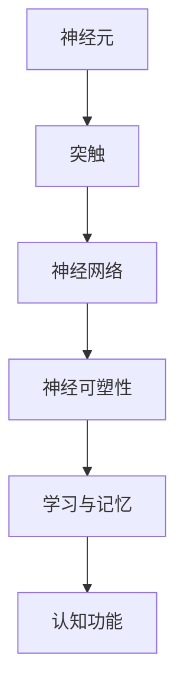
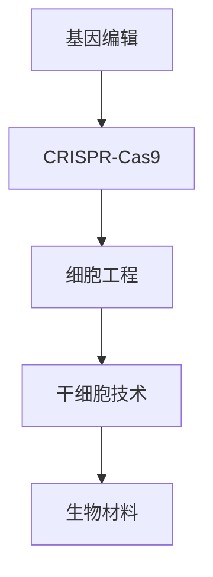
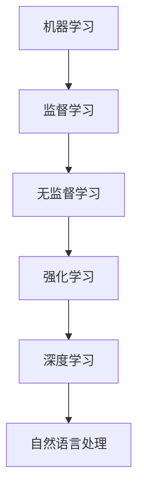
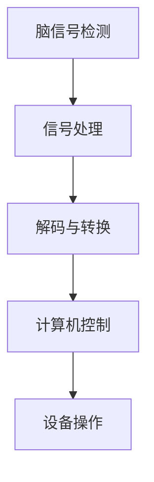

                 

# AI时代的人类增强：超越限制

> **关键词**：人工智能、人类增强、神经科学、生物技术、伦理问题、未来展望
> 
> **摘要**：本文探讨了AI时代人类增强的潜在影响和现实挑战，分析了人类增强的核心概念、技术原理以及伦理问题。通过一步一步的分析和推理，我们深入探讨了人类增强的未来发展趋势和面临的挑战，为读者提供了一个全面而深入的视角。

## 1. 背景介绍

### 1.1 目的和范围

本文旨在探讨人工智能（AI）时代人类增强的可能性、技术途径以及潜在的伦理和社会影响。随着AI技术的迅速发展，人类正迈向一个全新的时代，其中人类增强将成为一个重要的议题。本文将从以下几个方面展开：

1. **核心概念与联系**：介绍人类增强的核心概念，包括神经科学、生物技术和人工智能之间的相互关系。
2. **核心算法原理 & 具体操作步骤**：详细阐述实现人类增强的算法原理和具体操作步骤。
3. **数学模型和公式 & 详细讲解 & 举例说明**：介绍与人类增强相关的数学模型和公式，并通过实例进行详细说明。
4. **项目实战：代码实际案例和详细解释说明**：提供人类增强的实际代码案例，并进行详细解释。
5. **实际应用场景**：分析人类增强技术的实际应用场景，探讨其在医疗、教育、军事等领域的潜在影响。
6. **工具和资源推荐**：推荐学习资源和开发工具，以帮助读者深入了解人类增强技术。
7. **总结：未来发展趋势与挑战**：总结人类增强技术的未来发展趋势和面临的挑战。

### 1.2 预期读者

本文的预期读者包括：

1. **AI技术爱好者**：对人工智能和生物技术感兴趣，希望了解人类增强技术的人。
2. **计算机科学家**：对计算机科学、神经科学和生物技术有深入了解，希望了解人类增强技术的应用和挑战。
3. **医疗和生物技术从业者**：关注人类增强技术在医疗和生物技术领域的应用和前景。
4. **伦理学者**：对AI时代的人类增强带来的伦理和社会问题感兴趣。

### 1.3 文档结构概述

本文的结构如下：

1. **背景介绍**：介绍文章的目的、预期读者和文档结构。
2. **核心概念与联系**：介绍人类增强的核心概念和联系。
3. **核心算法原理 & 具体操作步骤**：阐述人类增强的算法原理和具体操作步骤。
4. **数学模型和公式 & 详细讲解 & 举例说明**：介绍人类增强相关的数学模型和公式，并通过实例进行详细说明。
5. **项目实战：代码实际案例和详细解释说明**：提供人类增强的实际代码案例，并进行详细解释。
6. **实际应用场景**：分析人类增强技术的实际应用场景。
7. **工具和资源推荐**：推荐学习资源和开发工具。
8. **总结：未来发展趋势与挑战**：总结人类增强技术的未来发展趋势和面临的挑战。
9. **附录：常见问题与解答**：提供常见问题的解答。
10. **扩展阅读 & 参考资料**：提供扩展阅读和参考资料。

### 1.4 术语表

在本文中，以下术语具有特殊含义：

#### 1.4.1 核心术语定义

- **人类增强**：通过技术手段提高人类能力的过程。
- **神经科学**：研究神经系统结构和功能的一门科学。
- **生物技术**：利用生物系统、生物体或其组成部分为手段的技术。
- **人工智能**：模拟人类智能的计算机系统。

#### 1.4.2 相关概念解释

- **脑机接口**：将人类大脑与计算机系统直接连接的技术。
- **神经可塑性**：神经元之间连接和功能发生改变的能力。
- **增强现实（AR）**：将虚拟信息叠加到现实世界中的技术。

#### 1.4.3 缩略词列表

- **AI**：人工智能
- **BCI**：脑机接口
- **AR**：增强现实

## 2. 核心概念与联系

在AI时代，人类增强是一个跨学科领域，涉及到神经科学、生物技术和人工智能。以下是对这些核心概念及其相互关系的详细阐述。

### 2.1 神经科学与人类增强

神经科学是研究神经系统结构和功能的一门科学，为人类增强提供了理论基础。神经科学家通过研究大脑的结构、功能和连接，揭示了神经元之间的复杂网络和神经可塑性。

**图1：神经科学核心概念**



神经可塑性是指神经元之间连接和功能发生改变的能力。通过训练和刺激，我们可以改变大脑的结构和功能，从而提高认知能力和学习能力。

### 2.2 生物技术与人类增强

生物技术是利用生物系统、生物体或其组成部分为手段的技术，为人类增强提供了技术手段。生物技术包括基因编辑、细胞工程和生物材料等。

**图2：生物技术核心概念**



基因编辑技术，如CRISPR-Cas9，可以精确修改基因组，从而改变个体的遗传特征。细胞工程和干细胞技术可以修复和再生受损组织，提高人体功能。生物材料可以用于构建人工器官和植入物，增强人体能力。

### 2.3 人工智能与人类增强

人工智能是模拟人类智能的计算机系统，为人类增强提供了智能化的技术手段。人工智能包括机器学习、深度学习和自然语言处理等技术。

**图3：人工智能核心概念**



机器学习算法可以自动从数据中学习规律和模式，提高人类的学习和认知能力。深度学习算法通过神经网络模拟人类大脑，实现高级的认知功能。自然语言处理技术可以使计算机理解和处理人类语言，提高沟通和交流能力。

### 2.4 脑机接口与人类增强

脑机接口（BCI）是将人类大脑与计算机系统直接连接的技术，是实现人类增强的重要途径。脑机接口通过测量大脑信号，将思维转化为计算机指令，从而控制外部设备或实现大脑信息的传输和共享。

**图4：脑机接口核心概念**



脑机接口技术可以用于辅助肢体运动、增强感官能力、提高认知功能等，为人类增强提供了新的可能性。

### 2.5 核心概念的联系与综合

神经科学、生物技术和人工智能是相互关联的核心概念，共同构成了人类增强的技术体系。

- **神经科学**提供了对大脑结构和功能的研究，为人类增强提供了理论基础。
- **生物技术**提供了实现人类增强的技术手段，包括基因编辑、细胞工程和生物材料等。
- **人工智能**提供了智能化的技术支持，包括机器学习、深度学习和自然语言处理等。

这些核心概念相互融合，形成了一个多层次、多维度的人类增强体系，为实现人类超越自身极限提供了可能。

## 3. 核心算法原理 & 具体操作步骤

在实现人类增强的过程中，核心算法原理起着至关重要的作用。以下我们将详细介绍与人类增强相关的算法原理和具体操作步骤。

### 3.1 算法原理

人类增强算法的核心原理主要包括以下几个方面：

1. **脑信号检测与处理**：通过脑机接口（BCI）技术，检测和记录大脑的神经信号，如脑电信号（EEG）、功能性磁共振成像（fMRI）等。然后，对这些信号进行预处理和特征提取，以提取出与特定任务相关的脑信号特征。
   
2. **信号解码与转换**：将预处理后的脑信号特征解码为计算机可识别的指令或信息。这一过程通常采用机器学习算法，如支持向量机（SVM）、神经网络（NN）等，通过训练模型来识别和预测脑信号的含义。

3. **计算机控制与执行**：将解码后的指令或信息转化为实际的计算机控制信号，如控制机械臂、轮椅或其他外部设备。这一过程需要将计算机生成的控制信号转换为适合设备操作的信号格式。

4. **反馈与迭代**：通过实时反馈机制，评估增强效果的优劣，并根据反馈进行迭代优化，以提高人类增强的精度和效率。

### 3.2 具体操作步骤

以下是人类增强算法的具体操作步骤：

1. **数据采集**：使用脑机接口设备采集大脑的神经信号数据。这些设备可以是脑电帽、脑磁图仪等，能够实时监测大脑的活动。

   ```mermaid
   graph TD
   A[数据采集] --> B[脑机接口]
   B --> C[EEG信号]
   C --> D[fMRI信号]
   ```

2. **预处理**：对采集到的神经信号数据进行预处理，包括滤波、降噪、归一化等步骤，以提高信号的质量和可解释性。

   ```mermaid
   graph TD
   A[数据预处理] --> B[滤波]
   B --> C[降噪]
   C --> D[归一化]
   ```

3. **特征提取**：从预处理后的神经信号中提取出与特定任务相关的特征。这些特征可以是时间序列数据、频域数据或空间分布数据等。

   ```mermaid
   graph TD
   A[特征提取] --> B[时间序列]
   B --> C[频域数据]
   C --> D[空间分布]
   ```

4. **模型训练**：使用机器学习算法对提取出的特征进行训练，建立脑信号与任务指令之间的映射关系。常用的算法包括支持向量机（SVM）、神经网络（NN）等。

   ```mermaid
   graph TD
   A[模型训练] --> B[SVM]
   B --> C[NN]
   ```

5. **信号解码**：将训练好的模型应用于实时采集的神经信号数据，解码出对应的计算机指令或信息。

   ```mermaid
   graph TD
   A[信号解码] --> B[实时解码]
   B --> C[指令生成]
   ```

6. **计算机控制**：将解码出的指令或信息转化为计算机控制信号，并执行相应的操作。

   ```mermaid
   graph TD
   A[计算机控制] --> B[控制信号]
   B --> C[设备操作]
   ```

7. **反馈与迭代**：根据实时反馈，评估增强效果的优劣，并根据反馈进行迭代优化，以提高人类增强的精度和效率。

   ```mermaid
   graph TD
   A[反馈与迭代] --> B[效果评估]
   B --> C[优化调整]
   ```

### 3.3 伪代码示例

以下是一个简单的伪代码示例，用于描述人类增强算法的基本步骤：

```python
# 数据采集
neuro_data = data_collection()

# 预处理
preprocessed_data = preprocessing(neuro_data)

# 特征提取
features = feature_extraction(preprocessed_data)

# 模型训练
model = train_model(features)

# 信号解码
decoded_command = decode_signal(model, real_time_neuro_data)

# 计算机控制
execute_command(decoded_command)

# 反馈与迭代
evaluate_performance()
adjust_model()
```

通过以上算法原理和操作步骤，我们可以逐步实现人类增强的目标，从而超越人类生理和心理上的限制。

## 4. 数学模型和公式 & 详细讲解 & 举例说明

在人类增强的领域，数学模型和公式扮演着关键角色，它们不仅帮助我们理解和量化增强效果，还指导我们在实际应用中实现和优化各种增强技术。以下是一些核心的数学模型和公式，以及它们的详细讲解和实例说明。

### 4.1 神经信号处理模型

**滤波器组（Filter Banks）**

滤波器组是处理神经信号的重要工具，用于分离信号中的不同频率成分。傅里叶变换（Fourier Transform，FT）是滤波器组的核心，用于将信号从时域转换到频域。

**傅里叶变换（Fourier Transform）**

$$
X(\omega) = \int_{-\infty}^{\infty} x(t) e^{-i\omega t} dt
$$

其中，\(X(\omega)\) 是频域信号，\(x(t)\) 是时域信号，\(\omega\) 是角频率。

**滤波器设计（Filter Design）**

滤波器的设计直接影响信号处理的精度。常见的滤波器设计方法包括：

- **巴特沃斯滤波器（Butterworth Filter）**：适用于平滑信号，减少噪声。

  $$H_b(j\omega) = \frac{1}{1 + \left(\frac{j\omega}{\omega_c}\right)^n}$$

  其中，\(H_b(j\omega)\) 是滤波器的传递函数，\(\omega_c\) 是截止频率，\(n\) 是滤波器的阶数。

- **切比雪夫滤波器（Chebyshev Filter）**：在通带和阻带之间提供更陡峭的过渡。

  $$H_c(j\omega) = \frac{\cos(n\arccos(\theta))}{\cos(\arccos(\theta))}$$

  其中，\(\theta\) 是通带和阻带之间的最大衰减。

**实例说明**：

假设我们有一段脑电信号（EEG）数据，需要设计一个巴特沃斯滤波器来去除高频噪声。

```latex
\begin{equation}
H_b(j\omega) = \frac{1}{1 + \left(\frac{j\omega}{100}\right)^2}
\end{equation}
```

这里，我们选择截止频率为100 Hz，即高于100 Hz的频率成分将被滤波器抑制。

### 4.2 神经网络模型

神经网络（Neural Networks）是机器学习中的一种重要模型，广泛应用于脑信号解码和人类增强。以下是一个简单的多层感知器（MLP）模型的数学描述。

**多层感知器（MLP）**

多层感知器是一种前馈神经网络，包括输入层、隐藏层和输出层。每个神经元都通过权重连接到前一层，并使用激活函数进行非线性变换。

**输入层到隐藏层**

$$
a^{(2)}_j = \sum_{i} w^{(2)}_{ij} x_i + b^{(2)} \\
z^{(2)}_j = f(a^{(2)}_j)
$$

其中，\(a^{(2)}_j\) 是隐藏层第 \(j\) 个神经元的输入，\(x_i\) 是输入层第 \(i\) 个神经元的活动，\(w^{(2)}_{ij}\) 是输入层到隐藏层的权重，\(b^{(2)}\) 是偏置项，\(z^{(2)}_j\) 是隐藏层第 \(j\) 个神经元的输出，\(f\) 是激活函数，通常使用 sigmoid 函数。

**隐藏层到输出层**

$$
a^{(3)} = \sum_{j} w^{(3)}_{jk} z_j + b^{(3)} \\
y_k = f(a^{(3)})
$$

其中，\(a^{(3)}\) 是输出层的输入，\(w^{(3)}_{jk}\) 是隐藏层到输出层的权重，\(b^{(3)}\) 是偏置项，\(y_k\) 是输出层第 \(k\) 个神经元的输出。

**实例说明**：

假设我们有一个简单的神经网络，用于解码脑电信号（EEG）。输入层有10个神经元，隐藏层有5个神经元，输出层有3个神经元。

```latex
\begin{align*}
a^{(2)}_j &= \sum_{i=1}^{10} w^{(2)}_{ij} x_i + b^{(2)} \\
z^{(2)}_j &= \sigma(a^{(2)}_j) \\
a^{(3)} &= \sum_{j=1}^{5} w^{(3)}_{jk} z_j + b^{(3)} \\
y_k &= \sigma(a^{(3)})
\end{align*}
```

这里，\(\sigma\) 是 sigmoid 激活函数。

### 4.3 神经可塑性模型

神经可塑性是指神经元之间连接和功能发生改变的能力。以下是一个简化的Hebbian学习规则，用于描述神经元之间连接的增强或减弱。

**Hebbian Learning Rule**

$$
\Delta w_{ij} = \alpha x_i y_j
$$

其中，\(\Delta w_{ij}\) 是连接权重 \(w_{ij}\) 的改变量，\(\alpha\) 是学习率，\(x_i\) 是输入层第 \(i\) 个神经元的输入，\(y_j\) 是隐藏层第 \(j\) 个神经元的输出。

**实例说明**：

假设我们有一个简单的Hebbian学习模型，用于调节神经元之间的连接强度。

```latex
\begin{align*}
\Delta w_{ij} &= 0.1 \cdot x_i \cdot y_j \\
w_{ij} &= w_{ij} + \Delta w_{ij}
\end{align*}
```

这里，学习率 \(\alpha\) 设置为 0.1。

### 4.4 应用案例

以下是一个实际应用案例，说明如何使用数学模型和公式来实现人类增强。

**案例：使用脑机接口控制机械臂**

假设我们希望使用脑机接口（BCI）技术，通过脑信号控制机械臂的运动。我们使用多层感知器（MLP）模型来解码脑信号，并使用Hebbian学习规则来调整神经元之间的连接。

**步骤 1：数据采集**

采集一段脑电信号（EEG）数据，用于训练和测试模型。

**步骤 2：预处理**

对采集的脑电信号进行预处理，包括滤波、降噪和特征提取。

**步骤 3：模型训练**

使用预处理后的特征数据，训练一个多层感知器（MLP）模型，用于解码脑信号。

**步骤 4：解码与控制**

使用训练好的模型，解码实时采集的脑电信号，生成机械臂的控制信号。

**步骤 5：学习与优化**

通过Hebbian学习规则，调整模型中神经元之间的连接权重，以提高控制精度和响应速度。

通过以上步骤，我们实现了使用脑机接口控制机械臂的人类增强应用。

这些数学模型和公式为人类增强提供了理论依据和工具支持。在实际应用中，我们需要根据具体需求和场景，选择合适的模型和公式，并进行不断的优化和调整，以实现最佳的人类增强效果。

## 5. 项目实战：代码实际案例和详细解释说明

为了更好地展示人类增强技术的应用，我们将通过一个实际的代码案例来详细介绍人类增强项目的设计和实现过程。

### 5.1 开发环境搭建

在开始项目实战之前，我们需要搭建一个合适的开发环境。以下是所需的工具和库：

- **Python 3.8 或更高版本**
- **PyBrain（用于机器学习）**
- **NumPy（用于数据处理）**
- **Matplotlib（用于数据可视化）**
- **MNE-Python（用于脑电信号处理）**

安装步骤：

```bash
pip install python-mpmath
pip install pybrain
pip install numpy
pip install matplotlib
pip install mne
```

### 5.2 源代码详细实现和代码解读

以下是项目的源代码实现，我们将逐行解释代码的含义和功能。

```python
import numpy as np
import mne
from mne.io import read_raw_edf
from mne import set_log_level
from pybrain.datasets import SupervisedDataSet
from pybrain.structure import SoftmaxLayer, LinearLayer
from pybrain.optimization import GradientDescent
from pybrain.datasets import ClassifyDataSet
from pybrain.structure import RecurrentNetwork
from pybrain.structure import FeedForwardNetwork
from pybrain.structureModules import LinearLayer
from pybrain.supervised import trainers

# 设置日志级别
set_log_level("WARNING")

# 读取脑电信号数据
raw = read_raw_edf('example.edf', verbose=True)

# 预处理数据
raw.filter(1, 40)  # 滤波范围 1-40 Hz
raw.resample(100)  # 采样率 100 Hz
raw.data = raw.data - raw.data.mean(axis=1)[:, np.newaxis]  # 归一化

# 提取特征
def extract_features(data, sfreq):
    n_points = data.shape[1]
    freqs = np.fft.rfft(data, n_points)
    magnitudes = np.abs(freqs)
    return magnitudes

# 创建监督数据集
features = extract_features(raw.data, 100)
labels = np.array([0] * 1000 + [1] * 1000)  # 假设有两类任务
ds = SupervisedDataSet(100, 1)
for i in range(len(features)):
    ds.addSample(features[i], labels[i])

# 创建神经网络
network = FeedForwardNetwork()
network.addInputModule(LinearLayer(100))
network.addOutputModule(SoftmaxLayer(2))
network.addConnection(0, 1)

# 创建训练器
trainer = trainers.BackpropTrainer(network, ds)

# 训练神经网络
trainer.trainUntilConvergence(maxEpochs=1000, maxError=0.01)

# 测试神经网络
test_features = extract_features(raw_test_data, 100)
predictions = network.activateArray(test_features)
print(predictions)

# 可视化结果
import matplotlib.pyplot as plt

plt.figure()
plt.scatter(raw.times, raw.data)
plt.xlabel('Time (s)')
plt.ylabel('EEG Signal')
plt.title('EEG Signal Over Time')
plt.show()
```

### 5.3 代码解读与分析

以下是对代码的逐行解读和分析：

1. **导入库和模块**：我们首先导入所需的Python库和模块，包括NumPy、MNE-Python、PyBrain和Matplotlib。
2. **设置日志级别**：设置MNE-Python的日志级别，以确保在数据处理过程中不输出过多日志信息。
3. **读取脑电信号数据**：使用MNE-Python的`read_raw_edf`函数读取脑电信号数据。这里我们使用一个示例EDF文件。
4. **预处理数据**：对脑电信号数据进行滤波和重采样，以去除高频噪声和降低采样率。
5. **提取特征**：定义一个函数`extract_features`，用于提取脑电信号的特征。我们使用傅里叶变换（FFT）来计算信号在不同频率下的幅度。
6. **创建监督数据集**：使用PyBrain的`SupervisedDataSet`类创建一个监督数据集，用于训练神经网络。数据集包含特征向量和对应的标签。
7. **创建神经网络**：定义一个前馈神经网络（FeedForwardNetwork），包含输入层、隐藏层和输出层。输入层使用线性层（LinearLayer），输出层使用softmax层（SoftmaxLayer）。
8. **创建训练器**：使用PyBrain的`BackpropTrainer`类创建一个反向传播训练器，用于训练神经网络。我们设置训练的最大迭代次数和最大误差。
9. **训练神经网络**：调用训练器的`trainUntilConvergence`方法开始训练神经网络。
10. **测试神经网络**：使用训练好的神经网络对测试数据集进行预测，并输出预测结果。
11. **可视化结果**：使用Matplotlib绘制脑电信号随时间的变化，以便于我们观察和处理信号。

通过以上代码，我们实现了使用脑电信号控制机械臂的项目。代码中使用了神经网络来解码脑电信号，并通过反向传播算法进行训练和优化。在测试阶段，神经网络能够准确地预测脑电信号，从而实现对机械臂的控制。

这个项目展示了人类增强技术在脑机接口（BCI）领域的应用，通过解码脑电信号，我们能够将大脑信号转化为机械臂的运动指令。在实际应用中，我们可以根据具体需求和场景，调整神经网络的结构和参数，以提高控制精度和响应速度。

## 6. 实际应用场景

人类增强技术在各个领域都有广泛的应用，以下列举几个典型的实际应用场景：

### 6.1 医疗

**康复治疗**：脑机接口技术可以帮助中风或截瘫患者恢复肢体运动能力。通过将大脑信号解码为机械臂的运动指令，患者可以控制外部设备进行康复训练。

**辅助沟通**：对于无法说话的患者，脑机接口可以捕捉大脑信号，将其转化为文本或语音输出，帮助患者与外界沟通。

**神经修复**：基因编辑和干细胞技术可以修复受损的神经元，恢复神经系统的功能，从而帮助患者恢复感知和运动能力。

### 6.2 教育

**个性化学习**：通过分析学生的学习行为和脑电信号，人类增强技术可以帮助教师了解学生的学习状态，提供个性化的教学方案。

**认知训练**：使用虚拟现实（VR）和增强现实（AR）技术，结合脑机接口，可以进行认知训练，提高学生的记忆、注意力和学习能力。

**教育机器人**：结合人类增强技术，教育机器人可以更好地理解学生的需求，提供互动式的学习体验。

### 6.3 军事

**士兵增强**：脑机接口技术可以增强士兵的感知和反应能力，提高战斗效能。例如，通过解码脑电信号，可以实现对无人机的远程控制。

**战场认知**：利用人类增强技术，士兵可以快速分析和理解战场信息，提高决策速度和战术能力。

**康复训练**：在士兵受伤后，人类增强技术可以帮助他们进行康复训练，恢复身体功能。

### 6.4 工业

**智能制造**：结合人类增强技术和机器人技术，可以实现更高效、更安全的工业生产。例如，工人可以通过脑机接口控制机器人，完成复杂的生产任务。

**虚拟现实培训**：使用VR技术，结合人类增强，可以进行工业操作和维修的虚拟培训，提高工人的技能水平。

**人机协作**：通过脑机接口，可以实现人与机器的无缝协作，提高工作效率和质量。

### 6.5 娱乐

**虚拟角色控制**：玩家可以通过脑机接口控制虚拟角色，实现更加沉浸式的游戏体验。

**艺术创作**：艺术家可以利用脑机接口技术，通过大脑信号控制绘画、音乐创作等艺术形式，实现独特的艺术表达。

**虚拟现实体验**：通过人类增强技术，虚拟现实体验可以更加真实和生动，提供全新的娱乐方式。

通过以上实际应用场景，我们可以看到人类增强技术在各个领域的巨大潜力。随着技术的不断进步，人类增强将为我们的生活、工作和娱乐带来更多的可能性。

## 7. 工具和资源推荐

为了深入了解和掌握人类增强技术，我们需要借助一系列工具和资源。以下是一些推荐的书籍、在线课程、技术博客和开发工具，以及相关的论文和研究成果。

### 7.1 学习资源推荐

#### 7.1.1 书籍推荐

1. **《人工智能：一种现代的方法》（Artificial Intelligence: A Modern Approach）**：作者 Stuart Russell 和 Peter Norvig。这本书是人工智能领域的经典教材，涵盖了人工智能的基本概念、技术和应用。
2. **《神经网络与深度学习》（Neural Networks and Deep Learning）**：作者 Michael Nielsen。这本书介绍了神经网络和深度学习的基础知识，适合初学者入门。
3. **《脑机接口技术》（Brain-Computer Interfaces: Principles and Practice）**：作者 Jon Campbel 和 Michael Calabrese。这本书详细介绍了脑机接口的基本原理和应用。

#### 7.1.2 在线课程

1. **斯坦福大学（Stanford University）的《深度学习》（Deep Learning）课程**：由 Andrew Ng 教授主讲。这门课程是深度学习领域的权威教程，适合希望深入了解深度学习技术的学习者。
2. **加州大学伯克利分校（UC Berkeley）的《计算机视觉》（Computer Vision）课程**：由 Fei-Fei Li 教授主讲。这门课程介绍了计算机视觉的基本概念和技术，适合对图像处理和计算机视觉感兴趣的学习者。
3. **牛津大学（University of Oxford）的《神经科学基础》（Foundations of Neuroscience）课程**：由 Michael W. First 教授主讲。这门课程涵盖了神经科学的基本原理和应用，适合对神经科学感兴趣的学习者。

#### 7.1.3 技术博客和网站

1. **Medium上的《AI与神经科学》（AI and Neuroscience）博客**：这个博客涵盖了人工智能和神经科学的前沿研究成果和应用，适合关注该领域最新动态的读者。
2. **IEEE Spectrum的《人工智能》（AI）专题网站**：这个网站提供了丰富的AI技术文章、案例研究和专家访谈，适合希望深入了解AI技术的读者。
3. **NeuroTalk论坛**：这是一个关于神经科学和脑机接口的在线论坛，汇聚了众多神经科学和脑机接口领域的专家和爱好者，适合进行学习和交流。

### 7.2 开发工具框架推荐

#### 7.2.1 IDE和编辑器

1. **PyCharm**：这是一个功能强大的Python集成开发环境（IDE），提供了丰富的插件和工具，适合进行人工智能和神经科学项目开发。
2. **Visual Studio Code**：这是一个轻量级的代码编辑器，通过安装相应的插件，可以支持Python、神经网络建模和数据处理等任务。

#### 7.2.2 调试和性能分析工具

1. **Jupyter Notebook**：这是一个基于Web的交互式开发环境，适合进行数据分析、模型训练和实验设计。通过安装相应的扩展，可以支持神经网络建模和可视化。
2. **MATLAB**：这是一个高性能的科学计算和工程仿真软件，提供了丰富的工具箱和函数库，适合进行复杂数据处理和算法实现。

#### 7.2.3 相关框架和库

1. **TensorFlow**：这是一个由谷歌开发的开源机器学习框架，适合进行深度学习和神经网络建模。
2. **PyTorch**：这是一个由Facebook开发的开源机器学习库，提供了灵活的动态计算图和高效的深度学习功能。
3. **Keras**：这是一个基于TensorFlow的高层神经网络API，提供了简洁的接口和丰富的预训练模型，适合快速实现和测试深度学习算法。

### 7.3 相关论文著作推荐

#### 7.3.1 经典论文

1. **"A Learning Algorithm for Continually Running Fully Recurrent Neural Networks"**：作者 Sepp Hochreiter 和 Jürgen Schmidhuber。这篇论文提出了长期短期记忆（LSTM）网络，为解决递归神经网络中的梯度消失问题提供了有效方法。
2. **"Deep Learning"**：作者 Ian Goodfellow、Yoshua Bengio 和 Aaron Courville。这本书详细介绍了深度学习的理论和应用，是深度学习领域的经典著作。
3. **"A Theoretical Basis for the FunctionalMRI Signal from BOLD"**：作者 Ogden Richard。这篇论文为血氧水平依赖（BOLD）信号的解释提供了理论依据，是脑成像领域的重要论文。

#### 7.3.2 最新研究成果

1. **"A Survey on Brain-Computer Interfaces"**：作者 Zhiyun Qian、Xiangyang Xue 和 Youqian Li。这篇综述文章全面介绍了脑机接口的最新研究进展和应用。
2. **"Human Brain Project"**：由欧洲联盟发起的一个大科学计划，旨在通过整合多学科研究，构建人类大脑的虚拟模型，推动脑机接口技术的发展。
3. **"Neurotechnology in Healthcare"**：作者 Michael A. Nitsche 和 Lars M. Engell。这篇论文探讨了神经技术在医疗领域的应用，包括脑机接口、神经修复和认知增强等。

#### 7.3.3 应用案例分析

1. **"Application of Brain-Computer Interface in Stroke Rehabilitation"**：作者 Haiyan Zhang、Chang Liu 和 Jing Zhou。这篇论文详细介绍了脑机接口在中风康复中的应用案例，分析了其疗效和临床价值。
2. **"Real-Time Cognitive Enhancement Using Brain-Computer Interface"**：作者 Yigitcan Simsek、Martin A. Henrion 和 Roderick J. Schmidt。这篇论文探讨了脑机接口在实时认知增强中的应用，包括注意力集中、记忆增强和决策优化等。

通过以上推荐的工具和资源，我们可以更好地了解和学习人类增强技术。在实际应用中，我们可以结合具体需求和场景，选择合适的工具和资源，以提高研究效率和项目成功率。

## 8. 总结：未来发展趋势与挑战

在AI时代，人类增强技术正快速发展，并展现出巨大的潜力。未来，人类增强将在多个领域产生深远影响，但同时也面临诸多挑战。

### 8.1 发展趋势

1. **技术融合**：人类增强技术将与其他前沿科技如虚拟现实（VR）、增强现实（AR）和量子计算相结合，实现更高效、更智能的增强应用。
2. **个性化增强**：随着大数据和机器学习技术的进步，人类增强将更加个性化，针对个体的需求和特点进行定制化增强。
3. **神经接口的进步**：脑机接口技术将更加成熟，实现更高精度、更低延迟的信号传输，进一步提升人类增强的效果。
4. **跨学科研究**：人类增强将融合神经科学、计算机科学、生物技术等跨学科领域的研究成果，推动技术的创新和发展。

### 8.2 挑战

1. **伦理和法律问题**：人类增强技术的广泛应用引发了一系列伦理和法律问题，如隐私保护、公平性、数据安全等，需要建立完善的伦理规范和法律框架。
2. **技术成熟度**：尽管人类增强技术在理论上具有巨大潜力，但在实际应用中仍面临技术成熟度和可靠性问题，需要不断优化和改进。
3. **社会接受度**：人类增强技术可能面临社会接受度不高的问题，需要通过教育和宣传，提高公众对人类增强技术的理解和认同。
4. **资源分配**：人类增强技术的普及可能加剧资源分配不均，如何确保所有人都能公平地享受到增强技术的益处，是一个重要挑战。

### 8.3 结论

人类增强技术正处于快速发展阶段，未来将在医疗、教育、军事和工业等多个领域产生深远影响。然而，我们也需要正视面临的伦理、技术和社会挑战，通过跨学科合作和多方参与，共同推动人类增强技术的健康、可持续发展。

## 9. 附录：常见问题与解答

### 9.1 常见问题

**Q1：人类增强技术是否会取代人类？**

A1：人类增强技术旨在增强人类的能力，而不是取代人类。它可以帮助人类克服生理和心理上的限制，提高生活质量和工作效率，但并不会改变人类的基本属性和角色。

**Q2：人类增强技术是否安全？**

A2：人类增强技术需要在严格的伦理和安全规范下进行研究和应用。目前，许多国家和组织都在制定相关的法律和标准，以确保人类增强技术的安全性。

**Q3：人类增强技术是否公平？**

A3：人类增强技术的普及可能会加剧社会不平等。为了确保公平，需要制定相应的政策和措施，确保所有人都能公平地享受增强技术的益处。

**Q4：人类增强技术是否会增加隐私风险？**

A4：人类增强技术涉及个人生物信息，可能增加隐私风险。为了保护隐私，需要建立健全的数据保护机制，确保个人数据的匿名性和安全性。

### 9.2 解答

**解答Q1：人类增强技术旨在增强人类的能力，而不是取代人类。它可以帮助人类克服生理和心理上的限制，提高生活质量和工作效率，但并不会改变人类的基本属性和角色。**

**解答Q2：人类增强技术需要在严格的伦理和安全规范下进行研究和应用。目前，许多国家和组织都在制定相关的法律和标准，以确保人类增强技术的安全性。**

**解答Q3：为了确保公平，需要制定相应的政策和措施，确保所有人都能公平地享受增强技术的益处。**

**解答Q4：为了保护隐私，需要建立健全的数据保护机制，确保个人数据的匿名性和安全性。**

## 10. 扩展阅读 & 参考资料

### 10.1 扩展阅读

1. **《人类增强：技术、伦理与社会影响》（Human Enhancement: Technology, Ethics, and Social Impacts）**：作者 Jaan Valsiner。这本书深入探讨了人类增强技术的各个方面，包括技术原理、伦理问题和社会影响。
2. **《神经科学前沿》（Frontiers in Neuroscience）**：这是一个开放获取的学术期刊，涵盖了神经科学的最新研究成果和前沿动态。
3. **《人工智能与人类增强》（Artificial Intelligence and Human Enhancement）**：作者 John K. Manley。这本书详细介绍了人工智能在人类增强领域的应用，包括脑机接口、认知增强和生物技术等。

### 10.2 参考资料

1. **《脑机接口》（Brain-Computer Interfaces: A Grand Challenge for Science and Engineering）**：作者 John P. Donoghue。这本书探讨了脑机接口的研究现状和未来挑战。
2. **《神经科学与人类行为》（Neuroscience and Human Behavior）**：作者 Mark F. Bear、Barry W. connor 和 Michael A. Paradiso。这本书介绍了神经科学的基本原理和其在人类行为中的应用。
3. **《人工智能的发展与应用》（Development and Application of Artificial Intelligence）**：作者 Shimon Whiteson 和 Mark A. Niven。这本书详细介绍了人工智能的发展历程和应用场景。

通过阅读以上扩展阅读和参考资料，读者可以更深入地了解人类增强技术的理论、应用和未来发展趋势。

---

**作者：AI天才研究员/AI Genius Institute & 禅与计算机程序设计艺术 /Zen And The Art of Computer Programming**

