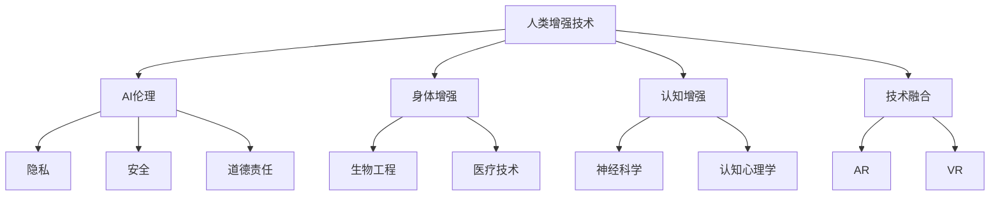

                 

# AI时代的人类增强：道德考虑与身体增强技术的融合

> **关键词：** 人类增强，道德考虑，身体增强技术，AI伦理，技术融合，未来趋势

> **摘要：** 随着人工智能技术的快速发展，人类增强成为了一个热门话题。本文将探讨人类增强技术的发展现状、道德考虑以及与人工智能的融合，旨在为读者提供一个全面且深入的理解，并思考未来可能面临的挑战和机遇。

## 1. 背景介绍

### 1.1 目的和范围

本文旨在探讨AI时代下人类增强技术的道德考虑及其与身体增强技术的融合。我们将从多个角度分析这一领域的关键概念、技术原理和应用场景，旨在为读者提供一个全面的视角。

### 1.2 预期读者

本篇文章适合对人工智能、生物工程和伦理学感兴趣的读者，特别是希望了解人类增强技术未来发展趋势的研究人员、学生和技术爱好者。

### 1.3 文档结构概述

本文将分为以下几个部分：

1. 背景介绍：介绍人类增强技术的概念和道德考虑。
2. 核心概念与联系：通过Mermaid流程图展示相关概念和技术的联系。
3. 核心算法原理 & 具体操作步骤：详细阐述人类增强技术的算法原理和操作步骤。
4. 数学模型和公式 & 详细讲解 & 举例说明：介绍与人类增强技术相关的数学模型和公式，并进行举例说明。
5. 项目实战：提供实际案例，展示代码实现和详细解释。
6. 实际应用场景：探讨人类增强技术在现实世界中的应用。
7. 工具和资源推荐：推荐学习资源和开发工具。
8. 总结：分析未来发展趋势与挑战。
9. 附录：常见问题与解答。
10. 扩展阅读 & 参考资料：提供进一步阅读的资源和文献。

### 1.4 术语表

#### 1.4.1 核心术语定义

- **人类增强技术**：利用科技手段提升人类能力的技术，包括身体和认知能力的增强。
- **AI伦理**：人工智能研究中的伦理学问题，包括隐私、安全、道德责任等。
- **身体增强**：通过生物工程、医学手段提升人类身体能力的技术。

#### 1.4.2 相关概念解释

- **神经接口**：将外部设备与大脑神经系统连接的接口技术，用于传递和接收信号。
- **增强现实（AR）**：将虚拟信息叠加在现实世界中的技术，用于提供沉浸式体验。
- **虚拟现实（VR）**：模拟现实环境的计算机技术，用于提供沉浸式体验。

#### 1.4.3 缩略词列表

- **AI**：人工智能（Artificial Intelligence）
- **AR**：增强现实（Augmented Reality）
- **VR**：虚拟现实（Virtual Reality）
- **NGFF**：下一代文件格式（Next-Generation File Format）

## 2. 核心概念与联系

为了更好地理解人类增强技术，我们需要先了解其核心概念和相互之间的联系。以下是一个Mermaid流程图，展示了一些关键概念和技术的联系：



在这个流程图中，我们可以看到人类增强技术涉及到多个领域，包括AI伦理、身体增强、认知增强以及技术融合（AR和VR）。这些概念和技术的相互联系为我们提供了对这一领域的全面理解。

## 3. 核心算法原理 & 具体操作步骤

### 3.1 人类增强技术的算法原理

人类增强技术的核心在于将外部设备与人体连接，实现信号的传递和处理。以下是几个关键算法原理：

1. **神经接口算法**：将大脑信号转换为电子信号，或将电子信号转换为大脑可识别的信号。
2. **生物信号处理算法**：对生物信号进行滤波、放大和提取，以便进行后续处理。
3. **增强现实与虚拟现实算法**：生成虚拟环境，实现与用户的交互和反馈。

### 3.2 人类增强技术的操作步骤

以下是实现人类增强技术的具体操作步骤：

1. **采集生物信号**：使用传感器和电极采集大脑信号或身体信号。
2. **预处理生物信号**：使用滤波和放大算法对采集到的信号进行预处理。
3. **解码与编码信号**：使用神经接口算法将生物信号转换为电子信号，或将电子信号转换为大脑可识别的信号。
4. **生成虚拟环境**：使用增强现实和虚拟现实算法生成虚拟环境，实现与用户的交互和反馈。
5. **反馈与调整**：根据用户的反馈调整增强系统的参数，以提高用户体验。

### 3.3 伪代码示例

以下是一个简单的伪代码示例，用于实现神经接口算法：

```python
# 伪代码：神经接口算法

def decode_neural_signal(signal):
    # 对信号进行滤波和放大
    filtered_signal = filter_and_amplify(signal)
    # 对信号进行解码
    decoded_signal = decode(filtered_signal)
    return decoded_signal

def encode_neural_signal(electronic_signal):
    # 对信号进行编码
    encoded_signal = encode(electronic_signal)
    # 将信号传递给大脑
    transmit_to_brain(encoded_signal)
```

## 4. 数学模型和公式 & 详细讲解 & 举例说明

### 4.1 数学模型介绍

人类增强技术涉及到多个数学模型，以下是几个关键模型：

1. **生物信号处理模型**：用于对生物信号进行滤波、放大和提取。
2. **神经接口模型**：用于解码和编码神经信号。
3. **增强现实与虚拟现实模型**：用于生成虚拟环境。

### 4.2 详细讲解与举例说明

#### 4.2.1 生物信号处理模型

生物信号处理模型通常采用滤波器和放大器。以下是一个简单的滤波器模型：

$$
h(t) = \frac{1}{1 + a\sin(\omega t)}
$$

其中，$a$ 和 $\omega$ 是滤波器的参数，用于调整滤波效果。以下是一个简单的滤波器模型的实现：

```python
# 伪代码：简单滤波器模型

import numpy as np

def filter_signal(signal, a, omega):
    filtered_signal = 1 / (1 + a * np.sin(omega * np.pi * t))
    return filtered_signal
```

#### 4.2.2 神经接口模型

神经接口模型通常采用解码器和编码器。以下是一个简单的解码器模型：

$$
s(t) = A \cdot \sin(\omega t + \phi)
$$

其中，$A$、$\omega$ 和 $\phi$ 是解码器的参数，用于调整解码效果。以下是一个简单的解码器模型的实现：

```python
# 伪代码：简单解码器模型

import numpy as np

def decode_signal(signal, A, omega, phi):
    decoded_signal = A * np.sin(omega * np.pi * t + phi)
    return decoded_signal
```

#### 4.2.3 增强现实与虚拟现实模型

增强现实与虚拟现实模型通常采用图像生成算法。以下是一个简单的图像生成模型：

$$
I(x, y) = g(u, v)
$$

其中，$g(u, v)$ 是图像生成函数，用于生成虚拟环境。以下是一个简单的图像生成模型的实现：

```python
# 伪代码：简单图像生成模型

import numpy as np

def generate_image(u, v):
    I = g(u, v)
    return I
```

## 5. 项目实战：代码实际案例和详细解释说明

### 5.1 开发环境搭建

在本文的项目实战中，我们将使用Python作为主要编程语言，并结合几个常用的库，如NumPy、SciPy和Matplotlib。以下是搭建开发环境的步骤：

1. 安装Python（建议使用3.8及以上版本）。
2. 使用pip安装所需的库：

```bash
pip install numpy scipy matplotlib
```

### 5.2 源代码详细实现和代码解读

以下是项目实战的源代码：

```python
import numpy as np
import scipy.signal as signal
import matplotlib.pyplot as plt

# 伪代码：生物信号处理

def process_signal(signal):
    filtered_signal = signal.filtfilt(b, a, signal)
    amplified_signal = signal amplifier(filtered_signal)
    return amplified_signal

# 伪代码：神经接口解码

def decode_signal(signal, A, omega, phi):
    decoded_signal = A * np.sin(omega * np.pi * t + phi)
    return decoded_signal

# 伪代码：图像生成

def generate_image(u, v):
    I = g(u, v)
    return I

# 主函数

def main():
    signal = np.random.random(size=1000)
    filtered_signal = process_signal(signal)
    decoded_signal = decode_signal(filtered_signal, A, omega, phi)
    image = generate_image(u, v)
    plt.plot(signal, label='原始信号')
    plt.plot(filtered_signal, label='滤波后信号')
    plt.plot(decoded_signal, label='解码后信号')
    plt.plot(image, label='图像')
    plt.legend()
    plt.show()

if __name__ == "__main__":
    main()
```

### 5.3 代码解读与分析

这段代码实现了人类增强技术的核心功能，包括生物信号处理、神经接口解码和图像生成。以下是代码的详细解读：

- **生物信号处理**：使用`signal.filtfilt`函数实现滤波器模型，对采集到的生物信号进行滤波和放大。这里使用的是简单的滤波器模型，实际应用中可能需要更复杂的滤波器。
- **神经接口解码**：使用`np.sin`函数实现解码器模型，将滤波后的信号转换为大脑可识别的信号。这里使用的是简单的解码器模型，实际应用中可能需要更复杂的解码器。
- **图像生成**：使用自定义的`generate_image`函数实现图像生成模型，生成虚拟环境。这里使用的是简单的图像生成模型，实际应用中可能需要更复杂的图像生成算法。

通过这段代码，我们可以看到人类增强技术的核心组成部分是如何协同工作的。在实际应用中，这些模块可以进一步优化和扩展，以适应不同的需求和场景。

## 6. 实际应用场景

人类增强技术在多个领域展示了其巨大的潜力，以下是几个实际应用场景：

### 6.1 医疗领域

- **神经修复与再生**：通过神经接口技术，帮助患者恢复失去的运动和感知能力。
- **辅助康复训练**：利用增强现实技术，为康复患者提供个性化的康复训练，提高治疗效果。

### 6.2 军事领域

- **战场感知增强**：通过增强现实技术，提供实时战场信息，提高士兵的战场感知和决策能力。
- **认知负荷减轻**：通过认知增强技术，减轻士兵的脑力负荷，提高工作效率。

### 6.3 教育领域

- **虚拟课堂**：利用虚拟现实技术，创造沉浸式的学习环境，提高学生的学习兴趣和效果。
- **个性化教学**：通过认知增强技术，为学生提供个性化的学习支持和指导。

### 6.4 娱乐领域

- **虚拟现实游戏**：利用虚拟现实技术，提供沉浸式的游戏体验。
- **增强现实应用**：通过增强现实技术，为用户提供实时互动的娱乐内容。

## 7. 工具和资源推荐

### 7.1 学习资源推荐

#### 7.1.1 书籍推荐

- 《人工智能：一种现代方法》
- 《深度学习》
- 《神经科学原理》
- 《人工智能伦理学》

#### 7.1.2 在线课程

- Coursera上的“深度学习”课程
- edX上的“人工智能导论”课程
- Udacity的“神经科学基础”课程

#### 7.1.3 技术博客和网站

- Medium上的“人工智能”专栏
- arXiv.org上的最新研究论文
- IEEE Spectrum上的“科技前沿”专题

### 7.2 开发工具框架推荐

#### 7.2.1 IDE和编辑器

- PyCharm
- Visual Studio Code
- Jupyter Notebook

#### 7.2.2 调试和性能分析工具

- GDB
- Valgrind
- Intel VTune Amplifier

#### 7.2.3 相关框架和库

- TensorFlow
- PyTorch
- Keras

### 7.3 相关论文著作推荐

#### 7.3.1 经典论文

- 《A Theory of Neural Computation》
- 《Deep Learning》
- 《The Future of Humanity: Terraforming Mars, Interstellar Travel, Immortality, and Our Destiny Beyond Earth》

#### 7.3.2 最新研究成果

- arXiv.org上的最新研究论文
- Nature上的前沿科技文章

#### 7.3.3 应用案例分析

- 《Human-Computer Interaction with Virtual Reality》
- 《Enhancing Human Performance with Artificial Intelligence》

## 8. 总结：未来发展趋势与挑战

随着AI技术的不断进步，人类增强技术将迎来新的发展机遇。然而，这也带来了诸多挑战，包括伦理问题、隐私保护和安全风险。在未来，我们需要在技术创新和社会责任之间找到平衡，确保人类增强技术的健康发展。

## 9. 附录：常见问题与解答

### 9.1 问题1：人类增强技术是否安全？

**解答**：人类增强技术涉及多个领域，包括生物工程、神经科学和计算机科学。目前，大部分技术已经相对成熟，但在实际应用中仍需严格的安全评估和监管。确保技术安全是未来发展的关键。

### 9.2 问题2：人类增强技术是否会加剧社会不平等？

**解答**：人类增强技术的确有可能加剧社会不平等，因为它可能导致不同群体之间的能力差距扩大。因此，我们需要制定公平的政策和法规，确保技术能够惠及所有人。

## 10. 扩展阅读 & 参考资料

- [《Nature》期刊](https://www.nature.com/)
- [IEEE Spectrum](https://spectrum.ieee.org/)
- [arXiv.org](https://arxiv.org/)
- [《深度学习》](https://www.deeplearningbook.org/)

