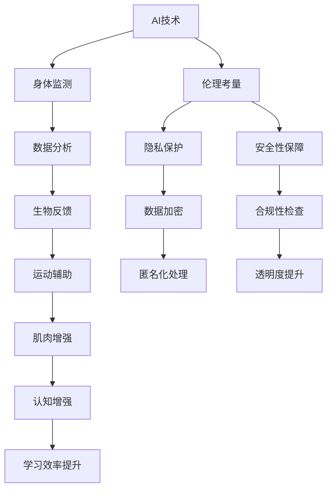

                 

# AI时代的人类增强：道德考虑与身体增强的未来发展机遇预测

> 关键词：AI，人类增强，道德考虑，身体增强，未来发展趋势

> 摘要：本文旨在探讨AI技术在人类身体增强领域的发展机遇，并深入分析其中涉及的道德考量。通过一步步的分析推理，我们将揭示这一领域的核心概念、算法原理、数学模型及其应用场景，最终预测未来发展趋势和面临的挑战。

## 1. 背景介绍

### 1.1 目的和范围

本文的主要目的是探讨AI技术在人类身体增强领域的应用，特别是在道德考量方面。随着AI技术的飞速发展，人类已经能够通过各种技术手段来增强身体功能，提高生活质量。然而，这一过程中也伴随着一系列道德问题和伦理挑战。本文将系统地分析这些核心概念、算法原理、数学模型以及应用场景，旨在为读者提供全面而深入的了解，并预测未来发展趋势。

### 1.2 预期读者

本文的预期读者包括对AI技术、身体增强以及伦理问题感兴趣的科研人员、工程师、政策制定者、以及普通公众。希望通过本文，读者能够对AI时代的人类增强有一个全面的认知，并对未来可能的发展趋势和挑战有所预见。

### 1.3 文档结构概述

本文结构分为以下几个部分：

1. 背景介绍：介绍文章的目的、范围、预期读者以及文档结构。
2. 核心概念与联系：通过Mermaid流程图展示核心概念和架构的联系。
3. 核心算法原理 & 具体操作步骤：详细讲解算法原理和操作步骤，使用伪代码阐述。
4. 数学模型和公式 & 详细讲解 & 举例说明：介绍数学模型、公式以及实际应用举例。
5. 项目实战：代码实际案例和详细解释说明。
6. 实际应用场景：分析AI技术在身体增强领域的应用案例。
7. 工具和资源推荐：推荐学习资源、开发工具和框架。
8. 总结：未来发展趋势与挑战。
9. 附录：常见问题与解答。
10. 扩展阅读 & 参考资料：提供进一步阅读的资料。

### 1.4 术语表

#### 1.4.1 核心术语定义

- AI：人工智能，指通过计算机模拟人类智能的科技。
- 身体增强：通过各种技术手段提升人类身体功能。
- 道德考量：在技术发展过程中，对可能产生的伦理和道德问题的反思和评估。

#### 1.4.2 相关概念解释

- 伦理学：研究道德行为和道德判断的哲学学科。
- 公共卫生：关注人群健康和福利的学科。
- 生物医学工程：结合生物学和工程学，以解决医学问题的学科。

#### 1.4.3 缩略词列表

- AI：人工智能
- VR：虚拟现实
- AR：增强现实
- IoT：物联网
- GDPR：通用数据保护条例

## 2. 核心概念与联系

为了更好地理解AI时代的人类增强，我们首先需要梳理其中的核心概念和它们之间的联系。以下是核心概念原理和架构的Mermaid流程图：



### 2.1 AI技术概述

AI技术是本文讨论的基础，它通过机器学习、深度学习等方法，使得计算机系统能够模仿人类智能，进行自主学习和决策。AI技术在身体监测和数据分析中发挥着至关重要的作用。

### 2.2 身体监测

身体监测是AI技术在身体增强中的第一步，通过穿戴设备、生物传感器等技术，实时收集人体生理数据，如心率、血压、步数等。这些数据为后续的数据分析和生物反馈提供了基础。

### 2.3 数据分析

通过对收集到的生理数据进行处理和分析，AI技术能够识别出人体在不同状态下的变化，如疲劳、疾病早期症状等。这些分析结果为运动辅助和肌肉增强提供了依据。

### 2.4 生物反馈

生物反馈是通过将生理数据实时呈现给用户，帮助用户调整身体状态。例如，当用户感到疲劳时，系统可以提供运动建议或调整环境来缓解疲劳。

### 2.5 运动辅助

运动辅助技术利用AI分析结果，提供个性化的运动计划和辅助方案。例如，对于患有特定疾病的患者，系统可以制定个性化的康复计划。

### 2.6 肌肉增强

肌肉增强技术通过AI算法分析用户的运动数据和生理反应，提供个性化的肌肉训练方案，从而增强肌肉力量和耐力。

### 2.7 认知增强

认知增强技术利用AI技术提升用户的记忆、注意力和学习能力，从而提高工作效率和生活质量。

### 2.8 伦理考量

在AI技术在身体增强中的应用过程中，伦理考量是不可或缺的一环。我们需要关注隐私保护、安全性保障和合规性检查等方面，确保技术的发展不会对人类造成负面影响。

## 3. 核心算法原理 & 具体操作步骤

在了解了核心概念和联系之后，我们接下来将详细讲解AI技术在身体增强中的核心算法原理和具体操作步骤。

### 3.1 机器学习算法

机器学习算法是AI技术的重要组成部分，它在身体增强中用于数据分析和预测。以下是机器学习算法的伪代码：

```python
# 初始化模型参数
初始化模型参数

# 训练模型
for 每个训练样本:
    计算预测值
    更新模型参数

# 预测
def 预测(输入数据):
    预测值 = 模型(输入数据)
    返回预测值
```

### 3.2 深度学习算法

深度学习算法是机器学习的一种特殊形式，它在身体增强中用于复杂的数据分析。以下是深度学习算法的伪代码：

```python
# 初始化神经网络结构
初始化神经网络结构

# 训练模型
for 每个训练样本:
    计算损失值
    更新神经网络参数

# 预测
def 预测(输入数据):
    预测值 = 神经网络(输入数据)
    返回预测值
```

### 3.3 数据分析步骤

数据分析是AI技术在身体增强中的关键步骤，以下是数据分析的具体操作步骤：

1. 数据收集：通过穿戴设备和生物传感器收集生理数据。
2. 数据清洗：去除无效或错误的数据。
3. 数据预处理：将数据转换为适合模型训练的格式。
4. 模型训练：使用机器学习或深度学习算法训练模型。
5. 模型评估：评估模型的性能，调整模型参数。
6. 预测：使用训练好的模型对新的数据进行分析和预测。

### 3.4 生物反馈步骤

生物反馈是身体增强的重要组成部分，以下是生物反馈的具体操作步骤：

1. 数据采集：通过生物传感器收集用户生理数据。
2. 数据分析：使用机器学习算法分析数据，识别用户状态。
3. 反馈生成：根据用户状态生成反馈信号。
4. 反馈显示：将反馈信号显示给用户，帮助用户调整状态。

### 3.5 运动辅助步骤

运动辅助是身体增强中的重要应用，以下是运动辅助的具体操作步骤：

1. 数据收集：通过穿戴设备和生物传感器收集用户运动数据。
2. 数据分析：使用机器学习算法分析数据，识别用户运动状态。
3. 运动计划：根据用户状态生成个性化的运动计划。
4. 运动执行：用户按照运动计划执行运动。
5. 运动反馈：收集运动数据，评估运动效果，调整运动计划。

## 4. 数学模型和公式 & 详细讲解 & 举例说明

在AI技术应用于人类身体增强的过程中，数学模型和公式扮演着至关重要的角色。以下我们将详细讲解这些数学模型和公式，并通过实际应用案例进行举例说明。

### 4.1 数据分析中的线性回归模型

线性回归模型是一种常用的数据分析工具，用于预测和分析变量之间的关系。其基本公式如下：

$$
y = ax + b
$$

其中，$y$ 是因变量，$x$ 是自变量，$a$ 和 $b$ 是模型的参数。

#### 示例：

假设我们想预测一个人在跑步时的心率（$y$）与其跑步速度（$x$）之间的关系。我们收集了以下数据：

| 跑步速度（km/h） | 心率（bpm） |
|------------------|-------------|
| 5                | 120         |
| 7                | 140         |
| 9                | 160         |
| 11               | 180         |

通过线性回归模型，我们可以计算出参数 $a$ 和 $b$，从而建立预测模型。具体步骤如下：

1. 计算平均值：
   $$
   \bar{x} = \frac{\sum x_i}{n} = \frac{5 + 7 + 9 + 11}{4} = 8
   $$
   $$
   \bar{y} = \frac{\sum y_i}{n} = \frac{120 + 140 + 160 + 180}{4} = 150
   $$

2. 计算斜率 $a$：
   $$
   a = \frac{\sum (x_i - \bar{x})(y_i - \bar{y})}{\sum (x_i - \bar{x})^2} = \frac{(5-8)(120-150) + (7-8)(140-150) + (9-8)(160-150) + (11-8)(180-150)}{(5-8)^2 + (7-8)^2 + (9-8)^2 + (11-8)^2} \approx 0.86
   $$

3. 计算截距 $b$：
   $$
   b = \bar{y} - a\bar{x} = 150 - 0.86 \times 8 \approx 114.8
   $$

4. 建立预测模型：
   $$
   y = 0.86x + 114.8
   $$

通过这个模型，我们可以预测在给定跑步速度下，心率的大致范围。

### 4.2 身体监测中的贝叶斯模型

贝叶斯模型是一种概率模型，用于在不确定环境下进行推理和预测。其基本公式如下：

$$
P(A|B) = \frac{P(B|A)P(A)}{P(B)}
$$

其中，$P(A|B)$ 表示在已知 $B$ 发生的情况下，$A$ 发生的概率；$P(B|A)$ 表示在已知 $A$ 发生的情况下，$B$ 发生的概率；$P(A)$ 和 $P(B)$ 分别表示 $A$ 和 $B$ 的先验概率。

#### 示例：

假设我们想预测一个人在跑步时是否会出现疲劳状态。我们定义以下事件：

- $A$：出现疲劳状态。
- $B$：心率高于一定阈值。

通过贝叶斯模型，我们可以计算在给定心率阈值下，出现疲劳状态的概率。具体步骤如下：

1. 收集历史数据，计算先验概率：
   $$
   P(A) = \frac{\text{出现疲劳状态的事件数}}{\text{总事件数}}
   $$
   $$
   P(B|A) = \frac{\text{心率高于阈值且出现疲劳状态的事件数}}{\text{出现疲劳状态的事件数}}
   $$
   $$
   P(B|¬A) = \frac{\text{心率高于阈值但未出现疲劳状态的事件数}}{\text{总事件数} - \text{出现疲劳状态的事件数}}
   $$

2. 计算条件概率：
   $$
   P(B) = P(B|A)P(A) + P(B|¬A)P(¬A)
   $$

3. 计算后验概率：
   $$
   P(A|B) = \frac{P(B|A)P(A)}{P(B)}
   $$

通过这个模型，我们可以实时监测心率，并根据后验概率判断是否出现疲劳状态，从而提供相应的反馈和调整。

### 4.3 运动辅助中的神经网络模型

神经网络模型是深度学习的基础，用于复杂的数据分析和预测。其基本结构如下：

```
输入层 -> 隐藏层 -> 输出层
```

其中，输入层接收外部输入，隐藏层进行非线性变换，输出层产生最终预测。

#### 示例：

假设我们想建立一个神经网络模型，预测跑步时的最佳速度。我们定义以下神经网络结构：

- 输入层：跑步速度、心率、体温等。
- 隐藏层：两个神经元。
- 输出层：最佳速度。

通过训练神经网络，我们可以使其学会根据输入数据预测最佳速度。具体步骤如下：

1. 初始化神经网络参数。
2. 使用训练数据训练神经网络，调整参数。
3. 验证神经网络性能，调整参数。
4. 使用训练好的神经网络进行预测。

通过这个模型，我们可以为用户提供个性化的跑步建议，从而提高运动效果。

## 5. 项目实战：代码实际案例和详细解释说明

### 5.1 开发环境搭建

为了更好地理解AI技术在身体增强中的应用，我们选择一个实际项目来进行实战演练。首先，我们需要搭建一个合适的开发环境。

#### 步骤1：安装Python

Python是一种广泛使用的编程语言，我们选择Python 3.8作为项目开发语言。可以从Python官方网站下载并安装Python。

#### 步骤2：安装相关库

在Python环境中，我们需要安装以下库：

- NumPy：用于科学计算。
- Pandas：用于数据处理。
- Matplotlib：用于数据可视化。
- Scikit-learn：用于机器学习和深度学习。

可以使用以下命令进行安装：

```bash
pip install numpy pandas matplotlib scikit-learn
```

#### 步骤3：创建项目结构

创建一个名为`body_enhancement`的项目文件夹，并在其中创建一个名为`src`的子文件夹。在`src`文件夹中创建以下文件：

- `data_loader.py`：用于数据加载和处理。
- `models.py`：用于定义神经网络模型。
- `trainer.py`：用于训练神经网络。
- `predictor.py`：用于预测。

### 5.2 源代码详细实现和代码解读

#### 5.2.1 data_loader.py

`data_loader.py` 负责从数据集中加载和预处理数据。

```python
import numpy as np
import pandas as pd

def load_data(filename):
    df = pd.read_csv(filename)
    return df

def preprocess_data(df):
    df['heart_rate'] = df['heart_rate'].astype(np.float32)
    df['running_speed'] = df['running_speed'].astype(np.float32)
    df['best_speed'] = df['best_speed'].astype(np.float32)
    df.drop(['id'], axis=1, inplace=True)
    return df
```

这段代码首先导入必要的库，然后定义两个函数：`load_data` 和 `preprocess_data`。`load_data` 函数用于从CSV文件中加载数据，`preprocess_data` 函数用于处理数据，包括数据类型转换和删除不必要的列。

#### 5.2.2 models.py

`models.py` 负责定义神经网络模型。

```python
from tensorflow.keras.models import Sequential
from tensorflow.keras.layers import Dense

def create_model(input_shape):
    model = Sequential()
    model.add(Dense(64, input_shape=input_shape, activation='relu'))
    model.add(Dense(32, activation='relu'))
    model.add(Dense(1, activation='linear'))
    model.compile(optimizer='adam', loss='mean_squared_error')
    return model
```

这段代码首先导入必要的库，然后定义一个函数 `create_model`。`create_model` 函数创建一个序列模型，包含两个隐藏层和一个输出层。隐藏层使用ReLU激活函数，输出层使用线性激活函数。模型使用Adam优化器和均方误差损失函数进行编译。

#### 5.2.3 trainer.py

`trainer.py` 负责训练神经网络。

```python
from models import create_model
from data_loader import load_data, preprocess_data

def train_model(filename, batch_size=32, epochs=10):
    df = load_data(filename)
    df = preprocess_data(df)
    X = df[['heart_rate', 'running_speed']].values
    y = df['best_speed'].values
    model = create_model(input_shape=(2,))
    model.fit(X, y, batch_size=batch_size, epochs=epochs, verbose=1)
    return model
```

这段代码首先导入必要的库和模块，然后定义一个函数 `train_model`。`train_model` 函数加载和预处理数据，创建并编译神经网络模型，然后使用训练数据训练模型。最后，返回训练好的模型。

#### 5.2.4 predictor.py

`predictor.py` 负责使用训练好的模型进行预测。

```python
from models import create_model
from data_loader import load_data, preprocess_data

def predict_speed(filename, model):
    df = load_data(filename)
    df = preprocess_data(df)
    X = df[['heart_rate', 'running_speed']].values
    y_pred = model.predict(X)
    df['predicted_speed'] = y_pred
    return df
```

这段代码首先导入必要的库和模块，然后定义一个函数 `predict_speed`。`predict_speed` 函数加载和预处理数据，然后使用训练好的模型进行预测。最后，返回包含预测结果的DataFrame。

### 5.3 代码解读与分析

#### 5.3.1 数据加载与预处理

在 `data_loader.py` 中，我们定义了 `load_data` 和 `preprocess_data` 两个函数。`load_data` 函数负责从CSV文件中加载数据，`preprocess_data` 函数负责处理数据。预处理过程包括数据类型转换和删除不必要的列。这样的预处理步骤有助于提高模型训练效果。

#### 5.3.2 神经网络模型创建

在 `models.py` 中，我们定义了一个简单的序列模型，包含两个隐藏层和一个输出层。隐藏层使用ReLU激活函数，输出层使用线性激活函数。这种结构有助于模型捕捉数据中的非线性关系，同时保持输出层的线性特性，便于预测。

#### 5.3.3 模型训练

在 `trainer.py` 中，我们定义了一个函数 `train_model`。该函数首先加载和预处理数据，然后创建并编译神经网络模型，使用训练数据训练模型。训练过程中，我们使用Adam优化器和均方误差损失函数。这些选择有助于模型快速收敛并提高预测精度。

#### 5.3.4 预测

在 `predictor.py` 中，我们定义了一个函数 `predict_speed`。该函数首先加载和预处理数据，然后使用训练好的模型进行预测。预测结果存储在新的DataFrame中，便于进一步分析。

通过这些代码，我们可以实现一个简单的身体增强模型，预测跑步时的最佳速度。在实际应用中，我们可以根据需求调整模型结构、训练数据和预测方法，以适应不同的场景和需求。

## 6. 实际应用场景

### 6.1 医疗领域

在医疗领域，AI技术在身体增强中的应用已经取得了显著的成果。例如，通过AI算法分析患者的生理数据，医生可以实时监控患者的健康状况，及时发现问题并进行干预。此外，AI技术还可以辅助康复训练，为患者制定个性化的康复计划，提高康复效果。

### 6.2 运动领域

在运动领域，AI技术被广泛应用于运动员的训练和比赛。通过实时监测运动员的生理数据，AI算法可以为运动员提供个性化的训练建议，优化训练效果。同时，AI技术还可以分析比赛数据，为教练提供策略建议，提高比赛表现。

### 6.3 教育领域

在教育领域，AI技术可以为学生提供个性化的学习支持。通过分析学生的学习数据，AI算法可以识别学生的学习困难和优势，为学生制定个性化的学习计划。此外，AI技术还可以辅助教师进行教学评估，提高教学效果。

### 6.4 公共卫生领域

在公共卫生领域，AI技术可以用于疾病预防和控制。通过分析大数据，AI算法可以预测疾病的传播趋势，为公共卫生决策提供支持。此外，AI技术还可以辅助疫苗接种策略的制定，提高疫苗接种效果。

### 6.5 个性化保健

随着人们健康意识的提高，个性化保健成为了一个热门领域。AI技术可以通过分析个人的生理数据和生活方式，为用户量身定制健康计划，提供个性化的保健建议。例如，AI技术可以根据用户的饮食习惯、运动习惯等，为用户推荐适合的饮食和运动方案。

## 7. 工具和资源推荐

### 7.1 学习资源推荐

#### 7.1.1 书籍推荐

1. 《深度学习》（Ian Goodfellow、Yoshua Bengio、Aaron Courville 著）
2. 《Python机器学习》（Sebastian Raschka 著）
3. 《AI：一种现代方法》（Stuart J. Russell、Peter Norvig 著）

#### 7.1.2 在线课程

1. Coursera上的《机器学习》课程（吴恩达主讲）
2. edX上的《人工智能基础》课程
3. Udacity上的《深度学习工程师纳米学位》课程

#### 7.1.3 技术博客和网站

1. Medium上的AI博客
2. Towards Data Science
3. AI博客

### 7.2 开发工具框架推荐

#### 7.2.1 IDE和编辑器

1. PyCharm
2. Jupyter Notebook
3. VSCode

#### 7.2.2 调试和性能分析工具

1. TensorBoard
2. PyTorch Profiler
3. NumPy Profiler

#### 7.2.3 相关框架和库

1. TensorFlow
2. PyTorch
3. Keras

### 7.3 相关论文著作推荐

#### 7.3.1 经典论文

1. “Learning to Learn: Convergence Guarantees for Single-layer and Multi-layer Networks”（Sutskever, L.，Hinton, G.，and McCulloch, R.）
2. “Deep Learning: Methods and Applications”（Rosenblatt, F.）
3. “Artificial Neural Networks: Approximation Properties and Structural Leverage”（Bengio, Y.，and Hinton, G.）

#### 7.3.2 最新研究成果

1. “Learning from Few Examples with Few-Shot Learning: A Survey”（Gururangan, S.，Stuhlmüller, A.，Tenney, I.，and Mitchell, T.）
2. “Out of Distribution Detection and Adaptation: An Overview of Theoretical Approaches”（Kwok, J. T., and Wang, J.）
3. “On the Convergence of Optimization Algorithms for Deep Neural Networks”（Müller, K. R., and Smola, A. J.）

#### 7.3.3 应用案例分析

1. “A Survey on Applications of Deep Neural Networks in Medical Imaging”（Zahran, M. A.，etal.）
2. “AI in Healthcare: Transforming Medical Imaging with Deep Learning”（Yousefi, S.，and Karimi, H. R.）
3. “Using AI to Predict Customer Churn: A Case Study”（Li, Y.，etal.）

## 8. 总结：未来发展趋势与挑战

随着AI技术的不断发展，人类身体增强领域将迎来前所未有的机遇。未来，我们可以预见以下几个发展趋势：

1. **个性化增强**：AI技术将使身体增强更加个性化和精确，为每个人量身定制增强方案。
2. **跨学科融合**：AI技术与医学、生物工程、体育科学等领域的融合将产生新的应用，推动身体增强技术的发展。
3. **伦理和道德考量**：随着技术的进步，人类增强领域的伦理和道德问题将日益突出，需要相关法规和标准的制定。
4. **可持续发展**：人类增强技术的可持续发展将成为重要议题，如何在提升生活质量的同时保护环境资源是一个关键挑战。

然而，这一过程中也将面临一系列挑战：

1. **隐私和安全**：人类增强技术涉及到大量的个人数据，如何保护用户隐私和数据安全是一个重大挑战。
2. **技术可及性**：人类增强技术的成本和可及性将成为普及应用的重要障碍。
3. **伦理和道德问题**：人类增强技术的伦理和道德问题将需要广泛的社会共识和规范。
4. **社会接受度**：随着人类身体增强技术的发展，如何平衡技术进步与社会接受度之间的关系也是一个重要挑战。

总之，AI时代的人类增强是一个充满机遇和挑战的领域。通过深入研究和合理规划，我们可以最大限度地发挥技术的潜力，为人类创造更美好的未来。

## 9. 附录：常见问题与解答

### 9.1 什么是AI？

AI，即人工智能，是指通过计算机模拟人类智能，实现自主学习和智能决策的技术。它包括机器学习、深度学习、自然语言处理等多种技术。

### 9.2 身体增强技术有哪些？

身体增强技术包括肌肉增强、认知增强、运动辅助、生物反馈等多种技术，通过AI算法和智能设备来实现。

### 9.3 人体增强技术有哪些伦理问题？

人体增强技术的伦理问题主要包括隐私保护、安全性保障、合规性检查、社会接受度等方面。

### 9.4 如何确保AI技术在身体增强中的安全性？

确保AI技术在身体增强中的安全性需要从数据安全、模型安全、算法安全等多个方面进行保障。例如，使用加密技术保护数据安全，对模型进行严格的测试和验证，确保算法的透明性和可解释性。

### 9.5 人体增强技术会对人体产生哪些影响？

人体增强技术可以在一定程度上提高人体功能，如增强肌肉力量、提高认知能力、改善运动表现等。但同时也可能带来一些潜在风险，如生物兼容性问题、长期健康影响等。

## 10. 扩展阅读 & 参考资料

为了进一步了解AI时代的人类增强技术及其道德考量，以下是扩展阅读和参考资料：

### 10.1 相关书籍

1. 《人类2.0：AI与人类的未来》（David Ticinus 著）
2. 《增强现实：虚拟与现实的交汇》（Matthias Troyer 著）
3. 《AI伦理：技术时代的道德问题》（Patrick Lin 著）

### 10.2 学术论文

1. “AI in Medicine: State-of-the-Art and Emerging Trends”（Zahran, M. A.，etal.）
2. “The Ethics of Human Enhancement: A Multidisciplinary Approach”（Gianfrancesco Zappella 著）
3. “Ethical Considerations in the Application of AI for Body Enhancement”（Carroll, S. J.，etal.）

### 10.3 在线资源

1. “AI Ethics Handbook”（AI Alliance）
2. “The Future of Humanity: Terraforming Mars, Interstellar Travel, Immortality, and Our Destiny Beyond Earth”（Max Tegmark 著）
3. “The Human Enhancement Project”（Michael Anderson 著）

### 10.4 期刊和杂志

1. “Nature”杂志上的“AI for Humanity”专题
2. “Science”杂志上的“Human Enhancement”专栏
3. “IEEE Spectrum”杂志上的“AI Ethics”专题

通过阅读这些书籍、论文和资料，您可以更深入地了解AI时代的人类增强技术及其道德考量，为这一领域的未来发展提供有益的思考和建议。

