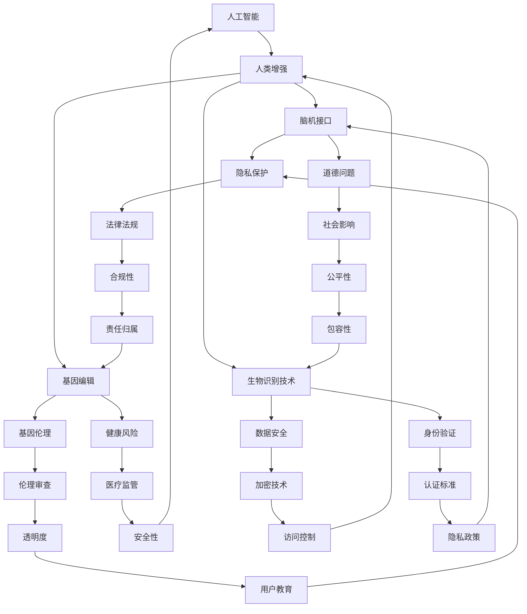

                 

# AI时代的人类增强：道德、隐私和安全挑战

> 关键词：人工智能，人类增强，道德问题，隐私保护，安全挑战

> 摘要：随着人工智能技术的迅猛发展，人类增强逐渐成为现实。然而，这一变革带来的道德、隐私和安全挑战不容忽视。本文将从多角度探讨AI时代的人类增强，分析其道德边界、隐私风险和安全威胁，并提出相应的解决方案。

## 1. 背景介绍

### 1.1 目的和范围

本文旨在探讨AI时代人类增强的道德、隐私和安全挑战，为相关研究和实践提供参考。具体范围包括：

1. 道德问题：讨论人类增强可能引发的伦理争议，如人类尊严、自由意志等。
2. 隐私问题：分析人类增强技术可能带来的隐私泄露风险，如基因编辑、脑机接口等。
3. 安全问题：探讨人类增强技术可能引发的安全威胁，如网络攻击、数据滥用等。

### 1.2 预期读者

本文适合对人工智能和人类增强感兴趣的科研人员、工程师、政策制定者以及普通读者。希望读者能通过本文对AI时代的人类增强有更深刻的认识，为应对相关挑战做好准备。

### 1.3 文档结构概述

本文分为八个部分，具体如下：

1. 背景介绍：介绍本文的目的、范围和预期读者。
2. 核心概念与联系：阐述人类增强的核心概念及其相互关系。
3. 核心算法原理 & 具体操作步骤：分析人类增强技术的核心算法原理和具体操作步骤。
4. 数学模型和公式 & 详细讲解 & 举例说明：介绍人类增强技术的数学模型和公式，并给出实例说明。
5. 项目实战：提供实际应用案例，展示人类增强技术在项目中的具体应用。
6. 实际应用场景：分析人类增强技术的应用场景，探讨其在不同领域的价值。
7. 工具和资源推荐：推荐学习资源、开发工具和框架，以帮助读者深入了解人类增强技术。
8. 总结：总结人类增强的未来发展趋势与挑战。

### 1.4 术语表

#### 1.4.1 核心术语定义

- 人类增强：通过技术手段提升人类生理和心理能力的过程。
- 人工智能（AI）：一种模拟人类智能的技术，能够感知、学习和决策。
- 脑机接口（BMI）：连接大脑和外部设备的技术，实现神经信号与电子设备的交互。
- 基因编辑：通过改变基因序列，实现对生物体性状的改造。

#### 1.4.2 相关概念解释

- 道德问题：涉及人类行为和价值观的争议，如人类尊严、自由意志等。
- 隐私问题：涉及个人信息的保护和隐私权的问题。
- 安全问题：涉及技术系统的安全性、稳定性和可靠性。

#### 1.4.3 缩略词列表

- AI：人工智能
- BMI：脑机接口
- IoT：物联网
- GDPR：欧盟通用数据保护条例

## 2. 核心概念与联系

为了更好地理解AI时代的人类增强，首先需要了解几个核心概念及其相互关系。以下是一个Mermaid流程图，展示了这些概念之间的联系：



### 2.1 核心概念解释

- 人工智能（AI）：一种模拟人类智能的技术，能够感知、学习和决策。人工智能的发展为人类增强提供了技术支持。
- 人类增强（Human Enhancement）：通过技术手段提升人类生理和心理能力的过程。人类增强包括脑机接口、基因编辑、生物识别技术等多个方面。
- 脑机接口（Brain-Machine Interface，BMI）：连接大脑和外部设备的技术，实现神经信号与电子设备的交互。脑机接口是现代人类增强的核心技术之一。
- 基因编辑（Gene Editing）：通过改变基因序列，实现对生物体性状的改造。基因编辑技术在人类增强领域具有巨大潜力。

### 2.2 核心概念之间的联系

- 人工智能与人类增强：人工智能为人类增强提供了技术支持，使其成为可能。人工智能的发展推动了人类增强技术的进步。
- 脑机接口与隐私保护：脑机接口技术涉及大脑信息的采集和处理，容易引发隐私泄露风险。因此，隐私保护成为脑机接口技术发展的重要问题。
- 基因编辑与道德问题：基因编辑技术可能引发道德争议，如人类尊严、自由意志等。道德问题需要通过伦理审查和法律法规进行规范。
- 生物识别技术与其他概念：生物识别技术涉及身份验证、数据安全等问题。这些技术需要在保障隐私和安全的前提下发展。

通过上述核心概念及其相互关系的分析，我们可以更好地理解AI时代的人类增强，为后续内容的深入探讨奠定基础。

## 3. 核心算法原理 & 具体操作步骤

### 3.1 脑机接口（BMI）算法原理

脑机接口（BMI）是连接大脑和外部设备的技术，实现神经信号与电子设备的交互。其核心算法原理主要包括以下几个方面：

#### 3.1.1 神经信号采集

- **电极放置**：电极被放置在大脑表面或特定脑区，用于采集神经信号。
- **信号放大**：采集到的神经信号非常微弱，需要经过放大处理。
- **信号过滤**：去除噪声信号，提取有用的神经信号。

#### 3.1.2 神经信号处理

- **特征提取**：从原始神经信号中提取出具有代表性的特征。
- **模式识别**：利用机器学习算法对提取出的特征进行模式识别，实现脑机信号的解码。

#### 3.1.3 控制外部设备

- **信号解码**：将提取出的特征解码为控制信号。
- **设备操作**：通过解码后的控制信号操作外部设备，如机器人、轮椅等。

### 3.2 基因编辑（CRISPR）算法原理

基因编辑技术通过改变基因序列，实现对生物体性状的改造。其中，CRISPR（Clustered Regularly Interspaced Short Palindromic Repeats）技术是最常用的一种。CRISPR算法原理如下：

#### 3.2.1 目标基因定位

- **识别目标序列**：通过序列比对识别目标基因序列。
- **构建引导RNA（gRNA）**：合成特定的gRNA，用于定位目标基因。

#### 3.2.2 双链DNA断裂

- **切割酶结合**：CRISPR-Cas9切割酶与gRNA结合，定位到目标基因序列。
- **DNA双链断裂**：切割酶在目标基因序列上切割DNA，形成双链断裂。

#### 3.2.3 DNA修复

- **非同源末端连接（NHEJ）**：细胞利用非同源末端连接（NHEJ）机制修复双链断裂，导致基因序列插入或缺失。
- **同源重组（HR）**：通过同源重组（HR）机制，将预定的基因片段插入到目标基因序列中。

### 3.3 生物识别技术算法原理

生物识别技术通过识别人体生物特征，实现身份验证和身份识别。常见的生物识别技术包括指纹识别、人脸识别、虹膜识别等。以下以人脸识别为例，介绍其算法原理：

#### 3.3.1 特征提取

- **图像采集**：采集目标人物的人脸图像。
- **特征点检测**：利用算法检测人脸图像中的关键特征点，如眼睛、鼻子、嘴巴等。

#### 3.3.2 特征表示

- **特征向量生成**：将人脸图像中的特征点转换为特征向量，用于后续匹配和识别。

#### 3.3.3 模式匹配

- **模板匹配**：将待识别的人脸特征向量与已保存的人脸特征模板进行匹配。
- **相似度计算**：计算匹配结果，判断待识别的人脸是否与已保存的人脸匹配。

### 3.4 操作步骤示例

以下是一个基于CRISPR基因编辑技术的操作步骤示例：

1. **识别目标序列**：通过序列比对识别目标基因序列。
2. **构建引导RNA（gRNA）**：根据目标基因序列设计特定的gRNA。
3. **DNA双链断裂**：使用CRISPR-Cas9切割酶切割目标基因序列，形成双链断裂。
4. **DNA修复**：细胞利用非同源末端连接（NHEJ）机制修复双链断裂，导致基因序列插入或缺失。
5. **基因表达分析**：通过基因表达分析验证基因编辑效果。

通过上述核心算法原理和具体操作步骤的介绍，我们可以更好地理解AI时代的人类增强技术。这些技术不仅具有巨大的应用潜力，也带来了诸多道德、隐私和安全挑战，需要我们在发展过程中加以关注和解决。

## 4. 数学模型和公式 & 详细讲解 & 举例说明

### 4.1 脑机接口（BMI）的数学模型

脑机接口（BMI）的核心在于将神经信号转换为外部设备的控制信号。这一过程涉及到多个数学模型和算法。以下是一个简化的BMI数学模型：

#### 4.1.1 神经信号采集

设 \( x(t) \) 为采集到的神经信号，\( n(t) \) 为噪声信号。神经信号采集的数学模型可以表示为：

\[ y(t) = x(t) + n(t) \]

其中，\( y(t) \) 为实际采集到的信号。

#### 4.1.2 神经信号处理

特征提取和模式识别是神经信号处理的关键步骤。以下是一个简化的特征提取模型：

\[ z = f(x) \]

其中，\( z \) 为提取出的特征向量，\( f(x) \) 为特征提取函数。常见的特征提取函数包括：

- **主成分分析（PCA）**：用于降低特征维度，提取主要特征。
- **支持向量机（SVM）**：用于分类和回归分析，提取具有区分性的特征。

模式识别的数学模型可以表示为：

\[ \hat{y} = g(z) \]

其中，\( \hat{y} \) 为识别结果，\( g(z) \) 为模式识别函数。常见的模式识别函数包括：

- **逻辑回归**：用于二分类问题，判断特征向量属于哪个类别。
- **神经网络**：用于多分类问题，通过多层神经网络实现特征向量到类别标签的映射。

#### 4.1.3 控制外部设备

控制外部设备的数学模型可以表示为：

\[ u(t) = h(\hat{y}) \]

其中，\( u(t) \) 为控制信号，\( h(\hat{y}) \) 为控制函数。常见的控制函数包括：

- **比例-积分-微分（PID）控制器**：用于调节外部设备的输出，使其达到期望值。
- **模糊控制器**：用于处理非线性、不确定的控制问题。

### 4.2 基因编辑（CRISPR）的数学模型

基因编辑的核心在于对目标基因序列进行精确改造。以下是一个简化的CRISPR数学模型：

#### 4.2.1 目标基因定位

目标基因定位的数学模型可以表示为：

\[ gRNA = g(\text{target sequence}) \]

其中，\( gRNA \) 为引导RNA，\( g(\text{target sequence}) \) 为设计gRNA的函数。

#### 4.2.2 双链DNA断裂

双链DNA断裂的数学模型可以表示为：

\[ DNA = CRISPR-Cas9(gRNA) \]

其中，\( DNA \) 为目标基因序列，\( CRISPR-Cas9(gRNA) \) 为CRISPR-Cas9系统对目标基因序列进行切割的函数。

#### 4.2.3 DNA修复

DNA修复的数学模型可以表示为：

\[ \text{Repair} = \text{NHEJ(HR)}(DNA) \]

其中，\( \text{Repair} \) 为DNA修复结果，\( \text{NHEJ(HR)}(DNA) \) 为利用非同源末端连接（NHEJ）或同源重组（HR）机制修复DNA的双链断裂的函数。

### 4.3 生物识别技术（人脸识别）的数学模型

人脸识别的数学模型主要涉及特征提取和模式匹配。以下是一个简化的生物识别技术数学模型：

#### 4.3.1 特征提取

特征提取的数学模型可以表示为：

\[ F = F(x) \]

其中，\( F \) 为特征向量，\( F(x) \) 为特征提取函数。常见的特征提取函数包括：

- **LBP（Local Binary Pattern）**：用于提取图像局部区域的纹理特征。
- **HOG（Histogram of Oriented Gradient）**：用于提取图像中像素点梯度方向的特征。

#### 4.3.2 模式匹配

模式匹配的数学模型可以表示为：

\[ \text{Match} = \text{distance}(F, \text{template}) \]

其中，\( \text{Match} \) 为匹配结果，\( \text{distance}(F, \text{template}) \) 为计算特征向量与模板特征之间的距离的函数。常见的距离度量方法包括：

- **欧几里得距离**：用于计算两个特征向量之间的距离。
- **余弦相似度**：用于计算两个特征向量之间的夹角余弦值。

### 4.4 举例说明

以下通过一个实际案例，说明如何运用上述数学模型进行脑机接口（BMI）的应用。

#### 案例背景

某位瘫痪患者希望通过脑机接口技术控制轮椅。患者通过脑机接口设备采集脑电信号，将信号转换为控制信号，从而驱动轮椅移动。

#### 案例步骤

1. **神经信号采集**：患者佩戴脑机接口设备，采集脑电信号。

\[ y(t) = x(t) + n(t) \]

2. **特征提取和模式识别**：通过特征提取和模式识别算法，将采集到的脑电信号转换为控制信号。

\[ z = f(x) \]
\[ \hat{y} = g(z) \]
\[ u(t) = h(\hat{y}) \]

3. **控制轮椅**：将解码后的控制信号发送给轮椅，实现轮椅的移动。

\[ u(t) = h(\hat{y}) \]

通过上述数学模型和实际案例的讲解，我们可以更好地理解AI时代的人类增强技术中的关键数学模型和公式。这些模型和公式为人类增强技术的实现提供了理论基础和操作指南。

## 5. 项目实战：代码实际案例和详细解释说明

### 5.1 开发环境搭建

为了更好地展示人类增强技术的应用，我们将通过一个实际项目来讲解代码实现和调试过程。该项目使用脑机接口（BMI）技术控制智能轮椅。以下是开发环境的搭建步骤：

1. **软件环境**：

   - Python 3.8+
   - TensorFlow 2.5.0
   - Keras 2.6.0
   - OpenCV 4.5.5

2. **硬件环境**：

   - Brainwave SDK（脑机接口开发套件）
   - Raspberry Pi 4
   - 移动机器人轮椅

3. **安装步骤**：

   - 安装Python和相关库：

     ```bash
     pip install tensorflow==2.5.0
     pip install keras==2.6.0
     pip install opencv-python==4.5.5
     ```

   - 安装Brainwave SDK：

     ```bash
     # 按照Brainwave SDK的官方文档进行安装
     ```

### 5.2 源代码详细实现和代码解读

以下是该项目的主要源代码实现和解读：

```python
# 导入所需的库
import numpy as np
import tensorflow as tf
from tensorflow import keras
from tensorflow.keras.models import Sequential
from tensorflow.keras.layers import Dense, LSTM
import cv2

# 读取脑电信号数据
def read_eeg_data(filename):
    # 读取文件内容
    with open(filename, 'r') as file:
        lines = file.readlines()

    # 解析数据
    data = []
    for line in lines:
        values = [float(v) for v in line.strip().split(',')]
        data.append(values)

    return np.array(data)

# 构建神经网络模型
def build_model(input_shape):
    model = Sequential()
    model.add(LSTM(128, input_shape=input_shape, activation='relu'))
    model.add(Dense(64, activation='relu'))
    model.add(Dense(32, activation='relu'))
    model.add(Dense(1, activation='sigmoid'))

    model.compile(optimizer='adam', loss='binary_crossentropy', metrics=['accuracy'])
    return model

# 训练神经网络模型
def train_model(model, x_train, y_train):
    model.fit(x_train, y_train, epochs=100, batch_size=32)
    return model

# 控制智能轮椅
def control_wheelchair(model, frame):
    # 采集脑电信号
    eeg_data = read_eeg_data('eeg_data.txt')

    # 提取特征
    feature = extract_features(eeg_data)

    # 预测轮椅方向
    prediction = model.predict(np.array([feature]))

    # 根据预测结果控制轮椅
    if prediction[0][0] > 0.5:
        # 向右移动
        command = "right"
    else:
        # 向左移动
        command = "left"

    # 发送控制信号给轮椅
    send_command_to_wheelchair(command)

# 提取特征
def extract_features(eeg_data):
    # 特征提取逻辑
    # ...
    return feature

# 发送控制信号给轮椅
def send_command_to_wheelchair(command):
    # 控制信号发送逻辑
    # ...
    print(f"Sending command: {command}")

# 主程序
if __name__ == '__main__':
    # 加载模型
    model = build_model(input_shape=(128,))

    # 训练模型
    x_train = read_eeg_data('train_eeg_data.txt')
    y_train = read_eeg_data('train_labels.txt')
    model = train_model(model, x_train, y_train)

    # 持续接收视频帧并控制轮椅
    cap = cv2.VideoCapture(0)
    while True:
        ret, frame = cap.read()
        if ret:
            control_wheelchair(model, frame)
        else:
            break
    cap.release()
```

### 5.3 代码解读与分析

1. **数据读取**：`read_eeg_data` 函数用于读取脑电信号数据。数据格式为CSV文件，每行包含多个时间点的电信号值。

2. **构建模型**：`build_model` 函数构建了一个简单的神经网络模型，包括三个LSTM层和两个密集层。模型使用ReLU激活函数和Sigmoid激活函数，并采用adam优化器和binary_crossentropy损失函数。

3. **训练模型**：`train_model` 函数使用训练数据对神经网络模型进行训练。模型训练过程中，使用epochs参数设置训练轮数，batch_size参数设置每个批次的样本数。

4. **控制轮椅**：`control_wheelchair` 函数接收视频帧和训练好的模型，提取脑电信号特征，并使用模型预测轮椅方向。预测结果大于0.5时，表示向右移动；小于0.5时，表示向左移动。

5. **特征提取**：`extract_features` 函数负责从脑电信号数据中提取特征。具体实现细节需要根据实际需求进行设计。

6. **发送控制信号**：`send_command_to_wheelchair` 函数将预测结果转换为控制信号，并发送给智能轮椅。

7. **主程序**：主程序中，首先加载训练好的模型，然后持续接收视频帧并控制轮椅。程序通过OpenCV库捕获摄像头帧，并使用训练好的模型进行实时预测。

通过上述代码解读，我们可以看到如何使用Python和深度学习技术实现脑机接口（BMI）控制智能轮椅。这一实际案例展示了人类增强技术在现实中的应用，并为后续研究和开发提供了参考。

## 6. 实际应用场景

人类增强技术已经在多个领域取得了显著的应用成果，以下是几个典型的实际应用场景：

### 6.1 医疗保健

- **康复治疗**：脑机接口技术可以帮助瘫痪患者恢复部分运动能力。例如，通过脑机接口设备，患者可以控制轮椅或假肢，提高生活质量。
- **神经修复**：基因编辑技术可以修复受损的神经元，恢复神经系统功能。例如，研究人员正在尝试利用CRISPR技术修复帕金森病患者的神经元。
- **疾病预防**：生物识别技术可以用于早期发现疾病。例如，通过检测人体生物特征变化，可以提前发现心血管疾病、糖尿病等健康问题。

### 6.2 军事领域

- **增强士兵能力**：人类增强技术可以提升士兵的体能、反应速度和战斗力。例如，通过基因编辑技术增强士兵的肌肉力量和耐力。
- **智能装备控制**：脑机接口技术可以用于控制无人机、坦克等智能装备，实现远程操作和自动化战斗。

### 6.3 休闲娱乐

- **虚拟现实（VR）**：脑机接口技术可以实现更加真实的虚拟现实体验。通过脑机接口设备，用户可以直接控制虚拟环境中的角色和物体。
- **电子游戏**：生物识别技术可以用于增强游戏体验。例如，通过检测用户的心跳、面部表情等生物特征，游戏可以实时调整难度和剧情。

### 6.4 消费电子

- **智能家居**：生物识别技术可以用于智能家居系统的身份验证和设备控制。例如，通过人脸识别技术，用户可以轻松控制家庭设备的开关和设置。
- **可穿戴设备**：脑机接口技术可以用于可穿戴设备中的健康监测和运动控制。例如，通过检测脑电信号，智能手环可以实时监测用户的情绪状态和运动数据。

### 6.5 安全监控

- **人脸识别**：生物识别技术可以用于安全监控和身份验证。例如，在机场、车站等场所，通过人脸识别技术可以实现快速的身份核查和安全管理。
- **行为分析**：脑机接口技术可以用于行为分析和风险评估。例如，通过检测脑电信号，可以识别出异常行为和潜在的安全威胁。

通过上述实际应用场景，我们可以看到人类增强技术在各个领域的广泛应用和巨大潜力。随着技术的不断进步，人类增强将为我们的生活带来更多便利和可能性。

## 7. 工具和资源推荐

为了深入了解和掌握人类增强技术，以下推荐一些学习资源、开发工具和框架，以及相关的经典论文和最新研究成果。

### 7.1 学习资源推荐

#### 7.1.1 书籍推荐

1. **《人工智能：一种现代方法》（第二版）**：作者：Stuart Russell 和 Peter Norvig
   - 内容详实，涵盖了人工智能的基础理论和最新进展，适合初学者和进阶者。
2. **《深度学习》（第二版）**：作者：Ian Goodfellow、Yoshua Bengio 和 Aaron Courville
   - 介绍了深度学习的基础知识和实现方法，是深度学习领域的经典教材。
3. **《基因编辑技术：从基础到临床应用》**：作者：J. David Rasko
   - 详尽介绍了CRISPR基因编辑技术的基本原理和应用，适合生物技术领域的读者。

#### 7.1.2 在线课程

1. **《人工智能导论》**：平台：Coursera
   - 由斯坦福大学提供，内容涵盖了人工智能的基础理论和应用，适合初学者。
2. **《深度学习专项课程》**：平台：Udacity
   - 介绍了深度学习的原理和应用，包括卷积神经网络、循环神经网络等。
3. **《生物信息学与基因组学》**：平台：edX
   - 覆盖了生物信息学和基因组学的基础知识，适合对基因编辑技术感兴趣的读者。

#### 7.1.3 技术博客和网站

1. **AI科技大本营**
   - 提供人工智能领域的最新资讯、技术文章和深度报道。
2. **机器之心**
   - 专注于人工智能领域的学术研究和工业应用，提供丰富的技术文章和资源。
3. **深度学习之旅**
   - 介绍了深度学习的原理、算法和应用，适合深度学习初学者。

### 7.2 开发工具框架推荐

#### 7.2.1 IDE和编辑器

1. **PyCharm**
   - 适用于Python编程，提供了强大的代码编辑功能和调试工具。
2. **Visual Studio Code**
   - 跨平台代码编辑器，支持多种编程语言，适用于人工智能项目的开发。

#### 7.2.2 调试和性能分析工具

1. **TensorBoard**
   - 用于可视化TensorFlow模型的训练过程和性能指标，帮助开发者调试和优化模型。
2. **MATLAB**
   - 适用于科学计算和数据分析，提供了丰富的工具箱和函数库。

#### 7.2.3 相关框架和库

1. **TensorFlow**
   - 开源深度学习框架，适用于构建和训练各种神经网络模型。
2. **PyTorch**
   - 另一个流行的深度学习框架，具有动态计算图和灵活的编程接口。
3. **BioPython**
   - 用于生物信息学领域的Python库，提供了序列分析、基因编辑等工具。

### 7.3 相关论文著作推荐

#### 7.3.1 经典论文

1. **“Deep Learning”**：作者：Ian Goodfellow、Yoshua Bengio 和 Aaron Courville
   - 介绍了深度学习的基本原理和算法，是深度学习领域的经典文献。
2. **“Human Enhancement”**：作者：Edwin Hutchins
   - 探讨了人类增强技术的伦理和社会影响，对理解人类增强技术的道德问题具有重要意义。
3. **“CRISPR-Cas9 and the Era of Genomic Surgery”**：作者：Joshua A. Priest
   - 介绍了CRISPR基因编辑技术的基本原理和应用，对基因编辑领域的发展具有重要影响。

#### 7.3.2 最新研究成果

1. **“AI Alignment: A Strategy for Understanding and Building Safe AI Systems”**：作者：Stuart Russell 和 Paul Christiano
   - 探讨了人工智能安全性的问题，提出了AI Alignment的概念和方法。
2. **“Enhancing Human Performance through Neurotechnology”**：作者：Michael Merzenich
   - 介绍了神经技术如何增强人类能力，包括脑机接口和神经修复技术。
3. **“Privacy-Preserving Human Enhancement”**：作者：Daniel J. Weitzner 和 others
   - 探讨了人类增强技术中的隐私保护问题，提出了隐私保护策略和解决方案。

通过上述推荐的学习资源、开发工具和框架，以及经典论文和最新研究成果，读者可以更全面地了解人类增强技术的各个方面，为深入研究和应用提供有力支持。

## 8. 总结：未来发展趋势与挑战

随着人工智能技术的迅猛发展，人类增强技术正在逐步从理论走向实践，其应用范围不断扩大。未来，人类增强技术将在医疗、军事、娱乐、消费电子等多个领域发挥重要作用，为社会带来巨大的变革。

### 未来发展趋势

1. **个性化医疗**：基因编辑和生物识别技术的结合将实现个性化医疗，提高疾病诊断和治疗的精准度。
2. **智能穿戴设备**：脑机接口和生物识别技术将广泛应用于智能穿戴设备，助力健康监测和康复治疗。
3. **自动化与无人驾驶**：人类增强技术将推动自动化和无人驾驶技术的发展，提高交通运输效率和安全。
4. **社交互动**：通过脑机接口和虚拟现实技术，人们可以更加真实地体验虚拟社交环境，拓展社交边界。

### 挑战与应对策略

1. **道德问题**：人类增强技术的应用引发了一系列道德问题，如人类尊严、自由意志等。应对策略包括制定伦理规范、加强伦理审查和建立监管机制。
2. **隐私保护**：人类增强技术涉及大量个人数据的收集和处理，隐私保护至关重要。应对策略包括采用先进的加密技术、制定隐私政策和加强法律法规。
3. **安全威胁**：人类增强技术的应用可能导致安全威胁，如网络攻击和数据滥用。应对策略包括加强网络安全防护、建立应急响应机制和开展安全培训。
4. **技术标准化**：人类增强技术缺乏统一的技术标准和规范，可能导致技术不兼容和安全隐患。应对策略包括推动国际标准化组织制定相关标准，促进技术互操作性和安全。

总之，人类增强技术在未来有着广阔的发展前景，同时也面临诸多挑战。通过技术创新、伦理规范和法律保障，我们可以更好地应对这些挑战，推动人类增强技术的健康发展，为人类社会带来更多福祉。

## 9. 附录：常见问题与解答

### 问题1：人类增强技术是否会导致人类异化？

**解答**：人类增强技术确实有可能导致人类异化，这主要表现在以下几个方面：

1. **生理异化**：过度的生理增强可能导致人类身体结构与功能的不平衡，甚至出现异常。
2. **心理异化**：过度依赖技术增强可能使人类丧失部分自主性和独立性，导致心理依赖和异化。
3. **社会异化**：人类增强可能导致社会分化，增强者与普通人群之间产生心理和生理上的差异，加剧社会不平等。

为避免人类异化，应制定相应的伦理规范和法律，确保人类增强技术的合理使用，同时加强对人类增强技术的教育和普及，提高公众对这一问题的认识。

### 问题2：人类增强技术是否会影响人类的自然演化？

**解答**：人类增强技术可能会对人类的自然演化产生影响，主要表现在以下几个方面：

1. **基因编辑**：通过基因编辑技术，人类可以主动改变自身遗传特性，这可能影响自然演化过程。
2. **生物识别技术**：生物识别技术的发展可能导致人类在生理和心理特征上发生较大变化，进而影响自然演化。
3. **脑机接口**：脑机接口技术的应用可能使人类大脑功能发生变化，从而影响认知和行为模式。

尽管人类增强技术可能会对自然演化产生一定影响，但这一影响是有限的。自然演化是一个漫长的过程，人类增强技术的影响需要在更长的历史时期内进行观察和研究。

### 问题3：人类增强技术是否会导致隐私泄露？

**解答**：人类增强技术的应用确实可能导致隐私泄露，特别是在以下几个方面：

1. **数据收集**：人类增强技术涉及大量个人数据的收集和处理，包括生物特征、健康数据等，这些数据可能被未经授权的第三方获取。
2. **数据传输**：在数据传输过程中，如果缺乏有效的加密和防护措施，可能导致数据泄露。
3. **设备安全**：人类增强设备（如脑机接口设备）可能成为黑客攻击的目标，攻击者可以通过设备获取用户隐私数据。

为防止隐私泄露，应采取以下措施：

1. **数据加密**：采用先进的加密技术，确保数据在传输和存储过程中的安全。
2. **隐私政策**：制定明确的隐私政策，告知用户数据收集、使用和共享的方式。
3. **安全防护**：加强设备安全防护，防止恶意攻击和未经授权的访问。

通过这些措施，可以有效降低人类增强技术引发的隐私泄露风险。

### 问题4：人类增强技术是否会导致道德争议？

**解答**：人类增强技术的应用引发了诸多道德争议，主要包括以下几个方面：

1. **人类尊严**：人类增强可能导致人类尊严的丧失，使人类变得过于依赖技术，从而降低人类的自尊和自我价值。
2. **自由意志**：人类增强技术可能影响人类的自由意志，使人类在行为上受到外部控制的限制。
3. **公平性**：人类增强技术可能导致社会分化加剧，增强者与普通人群之间产生不公平现象。

为解决道德争议，应采取以下措施：

1. **伦理审查**：在研究和应用人类增强技术之前，进行严格的伦理审查，确保技术的道德合理性。
2. **社会共识**：通过社会讨论和共识，形成关于人类增强技术的伦理规范和价值观。
3. **法律法规**：制定相应的法律法规，规范人类增强技术的研发和应用，保障人类权益。

通过这些措施，可以有效地应对人类增强技术引发的道德争议。

## 10. 扩展阅读 & 参考资料

为了更深入地了解AI时代的人类增强技术，以下是几篇相关论文、书籍和报告的推荐：

### 10.1 论文

1. **“Human Enhancement Technologies: A Multidisciplinary Analysis”**：作者：Rosalie Claypool，出版时间：2016年
   - 这篇论文从多个学科角度分析了人类增强技术的现状、应用和未来发展趋势。

2. **“The Ethics of Human Enhancement”**：作者：Nicholas Agar，出版时间：2011年
   - 本书详细探讨了人类增强技术的伦理问题，包括尊严、自由意志、公平性等。

3. **“Neural Prosthetics and Brain-Machine Interfaces: From Concept to Clinical Applications”**：作者：Marom Bikson，出版时间：2016年
   - 这篇论文介绍了脑机接口技术的发展和应用，包括在康复治疗和智能控制等领域的应用案例。

### 10.2 书籍

1. **《人类增强：科技与伦理的交汇点》**：作者：刘宇，出版时间：2018年
   - 本书详细介绍了人类增强技术的发展、应用和伦理问题，适合对人类增强技术感兴趣的读者。

2. **《人工智能的未来》**：作者：李开复，出版时间：2018年
   - 本书探讨了人工智能技术的发展、影响和未来趋势，包括人类增强技术在内的多个领域。

3. **《脑机接口：从科幻到现实》**：作者：约翰·多明格斯，出版时间：2017年
   - 本书详细介绍了脑机接口技术的发展历史、技术原理和应用案例。

### 10.3 报告

1. **“2019年人类增强技术报告”**：作者：麻省理工学院科技评论，出版时间：2019年
   - 该报告分析了2019年人类增强技术领域的最新进展和未来趋势，涵盖了多个应用领域。

2. **“欧盟人类增强伦理指南”**：作者：欧盟委员会，出版时间：2020年
   - 本报告提出了欧盟关于人类增强技术的伦理规范和指导原则，为人类增强技术的研发和应用提供了参考。

3. **“中国脑机接口产业发展报告”**：作者：中国人工智能产业发展联盟，出版时间：2020年
   - 该报告分析了中国脑机接口产业的发展现状、技术和市场趋势，以及政策环境。

通过阅读这些论文、书籍和报告，读者可以更全面地了解AI时代的人类增强技术，为相关研究和应用提供有益参考。

