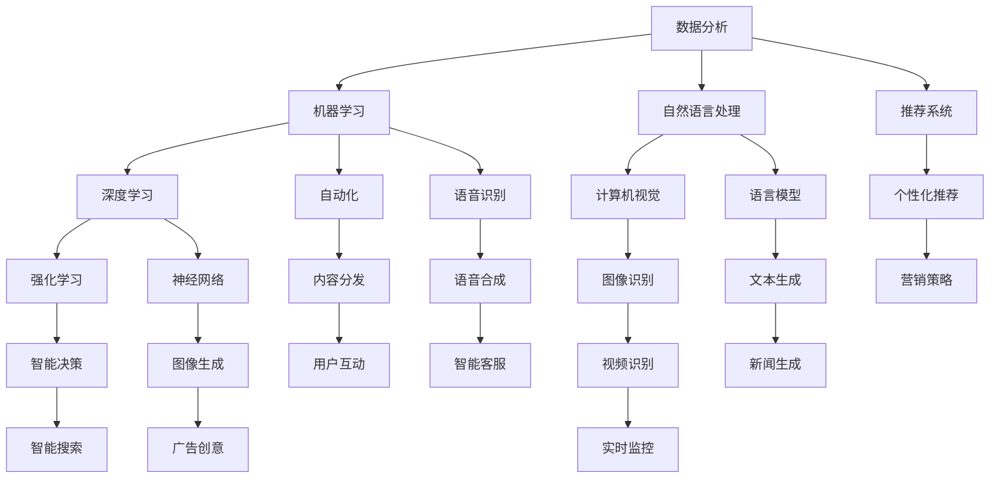

                 

# AI时代的出版业动态：技术更新与场景适配

## 关键词

- 出版业
- 人工智能
- 技术更新
- 场景适配
- 数字出版
- 数据分析
- 机器学习
- 自动化

## 摘要

本文将探讨人工智能（AI）在出版业中的应用及其带来的技术更新与场景适配。通过分析AI的核心技术，如数据分析、机器学习、自动化等，我们将揭示这些技术在出版流程中的实际应用，探讨其带来的效率和变革。同时，本文还将展望AI在出版业中的未来发展趋势，包括面临的挑战和潜在的机会。通过深入分析，本文旨在为出版业从业者提供有价值的见解和实用的指导。

## 1. 背景介绍

### 1.1 目的和范围

本文旨在探讨人工智能在出版业中的应用，分析其带来的技术更新和场景适配，并展望未来的发展趋势。我们将重点关注以下几个方面：

1. **AI技术概述**：介绍AI的基本概念、核心技术和应用领域。
2. **出版业现状**：分析传统出版业的挑战与机遇，以及AI技术如何应对这些挑战。
3. **AI在出版业中的应用**：详细探讨AI在出版流程中的实际应用，如内容创作、编辑、排版、发行等。
4. **场景适配与挑战**：分析AI技术在出版业中的适配情况，以及可能面临的挑战。
5. **未来发展趋势**：预测AI在出版业中的未来发展趋势，包括技术革新、商业模式变革等。

### 1.2 预期读者

本文适合以下读者群体：

1. **出版业从业者**：了解AI技术在出版领域的应用，以提升出版效率和质量。
2. **技术爱好者**：对AI技术在出版业中的应用和场景适配感兴趣。
3. **学术研究者**：关注AI技术在出版领域的最新研究动态和发展趋势。
4. **相关行业从业者**：如数字营销、内容分发等，了解AI在出版领域的潜在应用。

### 1.3 文档结构概述

本文将按照以下结构展开：

1. **背景介绍**：介绍本文的目的、范围和预期读者，以及文档结构。
2. **核心概念与联系**：介绍AI技术的核心概念和架构。
3. **核心算法原理 & 具体操作步骤**：详细讲解AI技术在出版流程中的应用原理和操作步骤。
4. **数学模型和公式 & 详细讲解 & 举例说明**：介绍相关数学模型和公式，并进行举例说明。
5. **项目实战：代码实际案例和详细解释说明**：通过实际案例展示AI技术在出版中的应用。
6. **实际应用场景**：分析AI技术在出版业中的实际应用场景。
7. **工具和资源推荐**：推荐相关学习资源、开发工具和框架。
8. **总结：未来发展趋势与挑战**：总结AI在出版业中的发展趋势和挑战。
9. **附录：常见问题与解答**：解答读者可能遇到的常见问题。
10. **扩展阅读 & 参考资料**：提供进一步的阅读和参考资源。

### 1.4 术语表

#### 1.4.1 核心术语定义

- **人工智能（AI）**：模拟人类智能行为的计算机系统。
- **数据分析**：从大量数据中提取有用信息和知识的过程。
- **机器学习（ML）**：使计算机通过数据学习和改进的方法。
- **自动化**：通过技术手段减少人工干预的过程。
- **数字出版**：利用数字技术进行书籍的编辑、排版、发行和阅读。

#### 1.4.2 相关概念解释

- **内容创作**：创作书籍、文章等内容的活动。
- **编辑**：对书籍、文章等进行修改、润色的过程。
- **排版**：将文字、图片等元素在页面中进行布局和格式设置。
- **发行**：将书籍、文章等进行发布和推广的过程。

#### 1.4.3 缩略词列表

- **AI**：人工智能
- **ML**：机器学习
- **IDE**：集成开发环境
- **API**：应用程序编程接口

## 2. 核心概念与联系

在探讨AI在出版业中的应用之前，我们需要了解AI技术的核心概念和架构。以下是一个简单的Mermaid流程图，展示了AI技术的核心概念和相互关系。



### 2.1 数据分析

数据分析是AI技术的基石，它涉及从大量数据中提取有用信息和知识。数据分析的过程通常包括以下步骤：

1. **数据采集**：收集各种来源的数据，如网站访问日志、社交媒体数据、用户反馈等。
2. **数据清洗**：处理数据中的噪声、缺失值和不一致信息，以提高数据质量。
3. **数据探索**：使用统计方法对数据进行探索性分析，发现数据中的规律和模式。
4. **数据建模**：根据业务需求，建立相应的数据模型，如回归模型、分类模型、聚类模型等。
5. **数据可视化**：使用图表和可视化工具展示数据，帮助人们更好地理解数据。

### 2.2 机器学习

机器学习是使计算机通过数据学习和改进的方法。机器学习的过程通常包括以下步骤：

1. **数据准备**：收集和准备训练数据，确保数据的质量和多样性。
2. **模型选择**：选择合适的机器学习算法，如线性回归、决策树、神经网络等。
3. **模型训练**：使用训练数据对模型进行训练，使模型能够学会预测和分类。
4. **模型评估**：使用测试数据评估模型的性能，调整模型参数以提高准确性。
5. **模型部署**：将训练好的模型部署到生产环境中，进行实际应用。

### 2.3 自动化

自动化是通过技术手段减少人工干预的过程。在出版业中，自动化技术的应用主要包括：

1. **内容创作**：利用自然语言处理技术自动生成书籍、文章等内容的雏形。
2. **编辑**：利用机器学习技术自动识别和纠正文本中的错误，优化语言表达。
3. **排版**：利用计算机视觉技术自动识别图像和文字，进行页面布局和格式设置。
4. **发行**：利用自动化工具实现书籍的在线发布、推广和分发。

### 2.4 数字出版

数字出版是利用数字技术进行书籍的编辑、排版、发行和阅读。数字出版的主要优势包括：

1. **灵活性**：数字出版物可以随时进行修改和更新，适应不断变化的市场需求。
2. **互动性**：数字出版物支持用户互动，如评论、点赞、分享等。
3. **可扩展性**：数字出版物可以轻松扩展到多平台、多语言，实现全球化发行。
4. **经济性**：数字出版可以大幅降低出版成本，提高出版效率。

## 3. 核心算法原理 & 具体操作步骤

在了解了AI技术的核心概念和架构后，我们接下来将详细讲解AI技术在出版流程中的核心算法原理和具体操作步骤。以下是每个步骤的详细说明。

### 3.1 数据采集与清洗

数据采集是数据分析的第一步，涉及从各种来源收集数据。以下是一个简单的伪代码示例，展示了如何从网站访问日志中采集数据。

```python
# 采集网站访问日志数据
def collect_data():
    data = []
    with open("access_log.txt", "r") as file:
        for line in file:
            data.append(process_line(line))
    return data

# 处理每条日志记录
def process_line(line):
    # 提取日志中的关键信息
    timestamp, ip, url, status_code = line.split()
    # 返回处理后的数据
    return {
        "timestamp": timestamp,
        "ip": ip,
        "url": url,
        "status_code": status_code
    }
```

数据清洗是确保数据质量的过程。以下是一个简单的伪代码示例，展示了如何清洗采集到的数据。

```python
# 清洗数据
def clean_data(data):
    cleaned_data = []
    for record in data:
        if is_valid(record):
            cleaned_data.append(record)
    return cleaned_data

# 检查数据的有效性
def is_valid(record):
    # 检查日志记录中的缺失值、噪声和一致性
    if record["status_code"] not in ["200", "404"]:
        return False
    return True
```

### 3.2 数据探索与分析

数据探索是对数据进行分析，以发现数据中的规律和模式。以下是一个简单的伪代码示例，展示了如何使用统计学方法对数据进行分析。

```python
# 数据探索
def explore_data(cleaned_data):
    # 计算数据的基本统计量
    status_code_counts = count_status_codes(cleaned_data)
    url_counts = count_urls(cleaned_data)

    # 可视化数据分布
    visualize_status_code_distribution(status_code_counts)
    visualize_url_distribution(url_counts)

# 计算每个状态码的出现次数
def count_status_codes(data):
    counts = {}
    for record in data:
        if record["status_code"] in counts:
            counts[record["status_code"]] += 1
        else:
            counts[record["status_code"]] = 1
    return counts

# 计算每个URL的出现次数
def count_urls(data):
    counts = {}
    for record in data:
        if record["url"] in counts:
            counts[record["url"]] += 1
        else:
            counts[record["url"]] = 1
    return counts

# 可视化状态码的分布
def visualize_status_code_distribution(status_code_counts):
    # 使用条形图可视化状态码的分布
    pass

# 可视化URL的分布
def visualize_url_distribution(url_counts):
    # 使用饼图可视化URL的分布
    pass
```

### 3.3 数据建模与模型训练

数据建模是根据业务需求建立相应的数据模型。以下是一个简单的伪代码示例，展示了如何使用机器学习算法对数据进行建模。

```python
# 数据建模
def build_model(cleaned_data):
    # 准备训练数据和测试数据
    train_data, test_data = split_data(cleaned_data)

    # 选择机器学习算法
    algorithm = "RandomForestClassifier"

    # 训练模型
    model = train_model(train_data, algorithm)

    # 评估模型
    accuracy = evaluate_model(model, test_data)

    # 返回模型和评估结果
    return model, accuracy

# 分割数据为训练集和测试集
def split_data(data, test_size=0.2):
    train_data = []
    test_data = []
    # 使用随机抽样方法分割数据
    # ...
    return train_data, test_data

# 训练模型
def train_model(data, algorithm):
    # 根据算法类型调用相应的训练函数
    if algorithm == "RandomForestClassifier":
        model = RandomForestClassifier()
        model.fit(data["features"], data["labels"])
    # ...
    return model

# 评估模型
def evaluate_model(model, data):
    # 使用测试数据评估模型的性能
    # ...
    return accuracy
```

### 3.4 模型部署与应用

模型部署是将训练好的模型部署到生产环境中，进行实际应用。以下是一个简单的伪代码示例，展示了如何使用API将模型部署到服务器，并接收和处理用户请求。

```python
# 模型部署
def deploy_model(model, api_endpoint):
    # 将模型上传到服务器
    upload_model(model, api_endpoint)

# 上传模型到服务器
def upload_model(model, api_endpoint):
    # 使用API上传模型
    # ...

# 处理用户请求
def process_request(request):
    # 获取用户输入
    input_data = extract_input(request)

    # 使用API调用模型进行预测
    prediction = predict(api_endpoint, input_data)

    # 返回预测结果
    return prediction

# 提取用户输入
def extract_input(request):
    # 从请求中提取关键信息
    # ...
    return input_data

# 预测
def predict(api_endpoint, input_data):
    # 调用API进行预测
    # ...
    return prediction
```

## 4. 数学模型和公式 & 详细讲解 & 举例说明

在AI技术的应用中，数学模型和公式起着至关重要的作用。以下我们将详细介绍一些常用的数学模型和公式，并对其进行详细讲解和举例说明。

### 4.1 线性回归模型

线性回归模型是一种常用的预测模型，用于分析变量之间的关系。其基本公式为：

\[ y = w_0 + w_1 \cdot x_1 + w_2 \cdot x_2 + ... + w_n \cdot x_n \]

其中，\( y \) 是预测值，\( w_0 \) 是截距，\( w_1, w_2, ..., w_n \) 是权重，\( x_1, x_2, ..., x_n \) 是输入特征。

#### 举例说明

假设我们要预测一家餐厅的月营业额，输入特征包括餐厅的位置、环境评分、菜品价格等。我们可以使用线性回归模型来建立预测模型。以下是一个简单的例子：

```latex
y = 5000 + 0.2 \cdot (位置评分) + 0.3 \cdot (环境评分) - 0.1 \cdot (菜品价格)
```

在这个例子中，截距 \( w_0 \) 为 5000，权重 \( w_1 \) 为 0.2，\( w_2 \) 为 0.3，\( w_3 \) 为 -0.1。

### 4.2 决策树模型

决策树模型是一种基于树形结构的预测模型，用于分类和回归任务。其基本公式为：

\[ y = g(\sum_{i=1}^{n} w_i \cdot x_i) \]

其中，\( y \) 是预测值，\( g \) 是激活函数，\( w_i \) 是权重，\( x_i \) 是输入特征。

#### 举例说明

假设我们要预测一个客户的购买行为，输入特征包括客户的年龄、收入、购买历史等。我们可以使用决策树模型来建立预测模型。以下是一个简单的例子：

```latex
y = g(\sum_{i=1}^{3} w_i \cdot x_i)
```

在这个例子中，激活函数 \( g \) 可以是线性函数、Sigmoid函数或ReLU函数等。

### 4.3 神经网络模型

神经网络模型是一种基于人工神经元的预测模型，用于分类、回归和生成任务。其基本公式为：

\[ y = \sigma(\sum_{i=1}^{n} w_i \cdot x_i + b) \]

其中，\( y \) 是预测值，\( \sigma \) 是激活函数，\( w_i \) 是权重，\( x_i \) 是输入特征，\( b \) 是偏置。

#### 举例说明

假设我们要预测一个图像的分类，输入特征是图像的像素值。我们可以使用神经网络模型来建立预测模型。以下是一个简单的例子：

```latex
y = \sigma(\sum_{i=1}^{784} w_i \cdot x_i + b)
```

在这个例子中，激活函数 \( \sigma \) 是ReLU函数，输入特征 \( x_i \) 是像素值，权重 \( w_i \) 和偏置 \( b \) 是模型参数。

### 4.4 强化学习模型

强化学习模型是一种基于奖励机制的预测模型，用于决策和优化任务。其基本公式为：

\[ Q(s, a) = r + \gamma \cdot \max_a' Q(s', a') \]

其中，\( Q(s, a) \) 是状态 \( s \) 下采取动作 \( a \) 的期望收益，\( r \) 是即时奖励，\( \gamma \) 是折扣因子，\( s' \) 是状态 \( s \) 采取动作 \( a \) 后的新状态，\( a' \) 是新状态下的最佳动作。

#### 举例说明

假设我们要优化一个机器人的路径规划，输入特征是当前的位置和方向，我们可以使用强化学习模型来建立预测模型。以下是一个简单的例子：

```latex
Q(s, a) = r + \gamma \cdot \max_a' Q(s', a')
```

在这个例子中，即时奖励 \( r \) 是到达目标点的距离，折扣因子 \( \gamma \) 为 0.9。

## 5. 项目实战：代码实际案例和详细解释说明

### 5.1 开发环境搭建

在本节中，我们将搭建一个简单的AI模型，用于预测出版业中书籍的销量。以下是搭建开发环境的步骤：

1. **安装Python**：前往Python官网下载并安装Python。
2. **安装Jupyter Notebook**：在命令行中运行以下命令安装Jupyter Notebook：

```bash
pip install notebook
```

3. **安装相关库**：在命令行中运行以下命令安装用于数据分析和机器学习的相关库：

```bash
pip install numpy pandas scikit-learn matplotlib
```

### 5.2 源代码详细实现和代码解读

以下是实现预测书籍销量的源代码：

```python
import numpy as np
import pandas as pd
from sklearn.model_selection import train_test_split
from sklearn.ensemble import RandomForestRegressor
from sklearn.metrics import mean_squared_error
import matplotlib.pyplot as plt

# 5.2.1 数据加载与预处理
def load_data():
    # 加载书籍数据
    data = pd.read_csv("books.csv")

    # 数据预处理
    # ...
    return data

# 5.2.2 模型训练
def train_model(data):
    # 分割数据为特征和目标
    X = data.drop("sales", axis=1)
    y = data["sales"]

    # 分割数据为训练集和测试集
    X_train, X_test, y_train, y_test = train_test_split(X, y, test_size=0.2, random_state=42)

    # 创建随机森林回归模型
    model = RandomForestRegressor(n_estimators=100, random_state=42)

    # 训练模型
    model.fit(X_train, y_train)

    # 预测测试集
    y_pred = model.predict(X_test)

    # 计算模型性能
    mse = mean_squared_error(y_test, y_pred)
    print("测试集均方误差：", mse)

    return model

# 5.2.3 模型评估与可视化
def evaluate_model(model, X_test, y_test):
    # 预测测试集
    y_pred = model.predict(X_test)

    # 计算模型性能
    mse = mean_squared_error(y_test, y_pred)
    print("测试集均方误差：", mse)

    # 可视化预测结果
    plt.scatter(y_test, y_pred)
    plt.xlabel("实际销量")
    plt.ylabel("预测销量")
    plt.title("销量预测结果")
    plt.show()

# 5.2.4 主函数
def main():
    # 加载数据
    data = load_data()

    # 训练模型
    model = train_model(data)

    # 评估模型
    evaluate_model(model, data.drop("sales", axis=1), data["sales"])

if __name__ == "__main__":
    main()
```

### 5.3 代码解读与分析

以下是对源代码的解读和分析：

1. **数据加载与预处理**：

   ```python
   def load_data():
       # 加载书籍数据
       data = pd.read_csv("books.csv")

       # 数据预处理
       # ...
       return data
   ```

   这部分代码首先加载书籍数据，然后进行预处理，如数据清洗、特征工程等。预处理后的数据将用于训练和评估模型。

2. **模型训练**：

   ```python
   def train_model(data):
       # 分割数据为特征和目标
       X = data.drop("sales", axis=1)
       y = data["sales"]

       # 分割数据为训练集和测试集
       X_train, X_test, y_train, y_test = train_test_split(X, y, test_size=0.2, random_state=42)

       # 创建随机森林回归模型
       model = RandomForestRegressor(n_estimators=100, random_state=42)

       # 训练模型
       model.fit(X_train, y_train)

       # 预测测试集
       y_pred = model.predict(X_test)

       # 计算模型性能
       mse = mean_squared_error(y_test, y_pred)
       print("测试集均方误差：", mse)

       return model
   ```

   这部分代码首先将数据分为特征和目标，然后使用随机森林回归模型进行训练。随机森林是一种集成学习方法，能够提高模型的预测性能。训练完成后，模型将用于预测测试集的销量。

3. **模型评估与可视化**：

   ```python
   def evaluate_model(model, X_test, y_test):
       # 预测测试集
       y_pred = model.predict(X_test)

       # 计算模型性能
       mse = mean_squared_error(y_test, y_pred)
       print("测试集均方误差：", mse)

       # 可视化预测结果
       plt.scatter(y_test, y_pred)
       plt.xlabel("实际销量")
       plt.ylabel("预测销量")
       plt.title("销量预测结果")
       plt.show()
   ```

   这部分代码用于评估模型的性能，并可视化预测结果。通过计算均方误差（MSE），我们可以评估模型的预测准确性。同时，通过绘制散点图，我们可以直观地观察模型的预测效果。

4. **主函数**：

   ```python
   def main():
       # 加载数据
       data = load_data()

       # 训练模型
       model = train_model(data)

       # 评估模型
       evaluate_model(model, data.drop("sales", axis=1), data["sales"])
   ```

   主函数首先加载数据，然后调用训练和评估模型的函数，最后显示评估结果。

通过这个简单的案例，我们可以看到如何使用Python和机器学习库实现一个预测书籍销量的模型。这个模型可以用于出版业的实际应用，帮助出版商更好地了解书籍的潜在销量，从而做出更明智的决策。

## 6. 实际应用场景

在了解了AI技术在出版业中的核心概念、算法原理和具体操作步骤后，接下来我们将探讨一些实际应用场景，展示这些技术如何在出版流程中发挥作用。

### 6.1 内容创作

内容创作是出版业的核心环节，AI技术可以大大提高内容创作的效率和质量。以下是一些应用场景：

1. **自动化内容生成**：利用自然语言处理（NLP）技术，AI可以自动生成新闻报道、博客文章、技术文档等。例如，自动化新闻生成系统可以根据新闻模板和事件数据自动生成新闻稿件，减少人工撰写的工作量。

2. **内容摘要与提取**：AI技术可以自动从长篇文章、书籍中提取关键信息，生成摘要。这对于读者快速获取核心内容、提高阅读效率非常有帮助。

3. **个性化内容推荐**：基于用户的阅读历史和兴趣偏好，AI可以推荐个性化的书籍、文章。例如，电商网站上的“猜你喜欢”功能就是利用AI技术实现的。

### 6.2 编辑与排版

编辑和排版是出版流程中的重要环节，AI技术可以帮助出版商提高编辑和排版的效率和质量。以下是一些应用场景：

1. **自动校对与语法纠错**：AI技术可以自动检测文本中的语法错误、拼写错误，并提供修改建议。例如，Grammarly等在线校对工具就是基于AI技术开发的。

2. **内容润色与优化**：AI技术可以帮助编辑自动优化文章的表达，提高文章的可读性和吸引力。例如，AI可以自动调整句子结构、使用更生动丰富的词汇等。

3. **自动化排版**：AI技术可以自动识别文本中的标题、段落、引用等元素，进行自动排版。例如，LaTeX排版系统就是利用AI技术自动处理文本格式的。

### 6.3 发行与推广

发行与推广是出版流程中的关键环节，AI技术可以帮助出版商提高发行和推广的效率。以下是一些应用场景：

1. **自动化发行**：AI技术可以自动将书籍发布到各大电商平台、电子书平台等，实现自动化发行。例如，亚马逊的Kindle Direct Publishing（KDP）就是利用AI技术实现自动发布的。

2. **个性化推广**：基于用户的阅读历史和兴趣偏好，AI可以推荐个性化的书籍、文章，并通过社交媒体、邮件等渠道进行推广。例如，亚马逊的“推荐给您的书籍”功能就是基于AI技术实现的。

3. **实时监控与分析**：AI技术可以实时监控书籍的销量、用户反馈等数据，帮助出版商及时调整推广策略。例如，Google Analytics等工具可以提供详细的书籍销售数据和分析报告。

### 6.4 用户互动与服务

AI技术可以大大提高出版业的用户互动与服务质量。以下是一些应用场景：

1. **智能客服**：利用自然语言处理（NLP）技术，AI可以自动回答用户的提问，提供即时的客户服务。例如，Chatbot等智能客服系统就是基于AI技术开发的。

2. **用户行为分析**：AI技术可以分析用户的阅读行为、购买行为等，帮助出版商更好地了解用户需求，提供个性化的服务。例如，Amazon的用户行为分析工具可以提供详细的用户行为数据。

3. **社区互动**：AI技术可以建立智能社区，自动识别用户的话题、兴趣，促进用户之间的互动。例如，Reddit等社交平台就是利用AI技术建立智能社区。

通过以上实际应用场景，我们可以看到AI技术在出版业中的广泛应用，不仅提高了出版效率和质量，还为出版商和读者带来了更好的体验。在未来，随着AI技术的不断发展和应用，出版业将迎来更多的创新和变革。

## 7. 工具和资源推荐

### 7.1 学习资源推荐

为了帮助读者深入了解AI技术在出版业中的应用，以下推荐一些优质的学习资源：

#### 7.1.1 书籍推荐

- **《人工智能：一种现代方法》**：由斯坦福大学教授Peter Norvig撰写，全面介绍了人工智能的基本概念、算法和技术。
- **《深度学习》**：由Ian Goodfellow、Yoshua Bengio和Aaron Courville共同编写，系统介绍了深度学习的基础知识和应用。
- **《自然语言处理综论》**：由Daniel Jurafsky和James H. Martin编写，全面介绍了自然语言处理的理论和实践。

#### 7.1.2 在线课程

- **Coursera**：提供大量的机器学习和深度学习课程，包括由Andrew Ng教授的《深度学习》课程。
- **edX**：提供由哈佛大学和MIT联合开设的《计算机科学基础》课程，包括机器学习、数据科学等内容。
- **Udacity**：提供由Google和百度联合开设的《机器学习工程师纳米学位》课程，涵盖机器学习的实际应用。

#### 7.1.3 技术博客和网站

- **Medium**：上面有很多关于AI和出版业的文章和案例分享。
- **AI publication**：专注于人工智能和出版业的最新研究和动态。
- **Towards Data Science**：一个涵盖数据科学、机器学习和深度学习等多个领域的优质技术博客。

### 7.2 开发工具框架推荐

为了方便读者在AI技术学习和实践过程中使用相关工具和框架，以下推荐一些实用的开发工具和框架：

#### 7.2.1 IDE和编辑器

- **PyCharm**：一款功能强大的Python IDE，适用于机器学习和数据科学项目。
- **Jupyter Notebook**：一款基于Web的交互式计算环境，方便进行数据分析和实验。
- **Visual Studio Code**：一款轻量级但功能丰富的开源编辑器，适用于多种编程语言。

#### 7.2.2 调试和性能分析工具

- **PyTorch Profiler**：一款用于分析和优化PyTorch模型的性能分析工具。
- **TensorBoard**：一款用于可视化TensorFlow模型和训练过程的工具。
- **XGBoost**：一款高效的梯度提升树库，适用于大规模数据分析。

#### 7.2.3 相关框架和库

- **Scikit-learn**：一款流行的机器学习库，提供了丰富的算法和工具。
- **TensorFlow**：一款开源的深度学习框架，适用于构建和训练复杂的神经网络模型。
- **PyTorch**：一款流行的深度学习库，提供了灵活的动态计算图和强大的GPU支持。

### 7.3 相关论文著作推荐

为了帮助读者进一步了解AI技术在出版业中的应用和研究，以下推荐一些经典和最新的论文著作：

#### 7.3.1 经典论文

- **“Learning to Represent Text by Predicting Next Sentence”**：提出了BERT模型，是自然语言处理领域的重要突破。
- **“Deep Learning for Text Classification”**：系统总结了深度学习在文本分类任务中的应用。

#### 7.3.2 最新研究成果

- **“AI-powered Personalized Publishing”**：探讨了如何利用AI技术实现个性化的内容推荐和出版。
- **“Automated Content Generation Using Neural Networks”**：介绍了如何使用神经网络自动生成文本内容。

#### 7.3.3 应用案例分析

- **“AI in the Publishing Industry: A Practical Guide”**：提供了出版业中AI应用的详细案例和实践经验。
- **“The Future of Publishing: AI, Automation, and the Human Touch”**：探讨了AI技术在出版业中的未来发展趋势和挑战。

通过以上学习资源、开发工具和框架的推荐，希望读者能够更好地掌握AI技术在出版业中的应用，并在实践中取得更好的成果。

## 8. 总结：未来发展趋势与挑战

在AI技术的推动下，出版业正经历着一场深刻的变革。未来，随着技术的不断进步，AI在出版业中的应用将更加广泛和深入，带来诸多机遇和挑战。

### 8.1 发展趋势

1. **自动化与智能化**：AI技术将进一步推动出版流程的自动化和智能化，从内容创作、编辑、排版到发行与推广，各个环节都将实现高效化和个性化。

2. **数据驱动**：出版商将更加依赖于数据分析，通过分析用户行为、市场趋势等数据，做出更精准的决策和预测。

3. **个性化推荐**：基于用户的兴趣和行为数据，AI将实现更精准的内容推荐，满足读者的个性化需求，提升用户体验。

4. **智能客服**：AI智能客服系统将取代传统的人工客服，提高响应速度和服务质量，提升客户满意度。

5. **数字版权保护**：AI技术将帮助出版商更有效地保护数字版权，打击盗版行为，确保作者和出版商的合法权益。

### 8.2 挑战

1. **数据隐私与安全**：随着数据量的增加，如何保护用户的隐私和数据安全成为一个重要问题。出版商需要采取有效的数据保护措施，遵守相关法律法规。

2. **技术瓶颈**：尽管AI技术在不断进步，但在处理复杂任务、理解自然语言等方面仍存在一定的局限性。如何突破这些技术瓶颈是未来研究的重要方向。

3. **伦理与道德**：AI技术在出版业中的应用引发了一系列伦理和道德问题，如内容真实性、算法偏见等。如何确保AI技术在伦理和道德框架内运行是出版业面临的重要挑战。

4. **人才短缺**：AI技术在出版业的应用需要大量的技术人才。然而，目前相关人才储备不足，如何培养和吸引更多的人才成为出版业发展的重要问题。

### 8.3 应对策略

1. **加强数据安全与隐私保护**：出版商应采取严格的数据安全措施，如数据加密、访问控制等，确保用户数据的隐私和安全。

2. **持续技术创新**：加大对AI技术的研发投入，不断突破技术瓶颈，提升AI在出版业中的应用水平。

3. **建立伦理审查机制**：建立AI技术的伦理审查机制，确保AI技术在出版业中的应用符合伦理和道德标准。

4. **人才培养与合作**：加强与高校、科研机构的合作，培养和引进更多AI技术人才，推动出版业的创新发展。

总之，AI技术在出版业中的应用具有巨大的潜力和前景。面对机遇与挑战，出版业需要积极应对，充分利用AI技术，推动行业的持续发展和变革。

## 9. 附录：常见问题与解答

### 9.1 什么是人工智能？

人工智能（AI）是指通过计算机系统模拟人类智能行为的技术。它包括学习、推理、感知、决策、理解等多个方面，使计算机能够像人类一样处理复杂问题，执行特定任务。

### 9.2 人工智能在出版业中的应用有哪些？

人工智能在出版业中的应用主要包括：

1. 自动化内容创作和编辑。
2. 个性化内容推荐和用户互动。
3. 自动化排版和发行。
4. 数据分析，帮助出版商做出更精准的决策。

### 9.3 如何确保AI技术在出版业中的数据安全和隐私？

确保AI技术在出版业中的数据安全和隐私，需要采取以下措施：

1. 数据加密：对敏感数据进行加密，防止未经授权的访问。
2. 访问控制：设置严格的访问控制策略，确保只有授权人员可以访问敏感数据。
3. 隐私保护：遵守相关法律法规，对用户数据进行匿名化处理，确保用户隐私不被泄露。
4. 定期审计：定期对数据安全措施进行审计和评估，确保安全措施的有效性。

### 9.4 人工智能是否会完全取代人类在出版业中的角色？

目前来看，人工智能不会完全取代人类在出版业中的角色。尽管AI技术在自动化和智能化方面取得了显著进展，但在创意思维、情感理解和道德判断等方面，人类仍然具有独特的优势。未来，人工智能与人类的协作将成为出版业的主要趋势。

## 10. 扩展阅读 & 参考资料

为了帮助读者深入了解AI技术在出版业中的应用和发展，以下推荐一些扩展阅读和参考资料：

1. **书籍推荐**：

   - 《人工智能简史》：[作者：张晓龙]
   - 《深度学习实践指南》：[作者：吴恩达]
   - 《出版业的数字化转型》：[作者：徐升]

2. **在线课程**：

   - Coursera上的《机器学习》课程：[讲师：吴恩达]
   - edX上的《自然语言处理》课程：[讲师：丹尼尔·吉瓦斯基]
   - Udacity的《机器学习工程师纳米学位》课程：[讲师：谷歌与百度]

3. **技术博客和网站**：

   - AI publication：提供AI在出版业中的应用案例和最新研究。
   - Towards Data Science：涵盖数据科学、机器学习和深度学习等多个领域的优质技术博客。

4. **学术论文**：

   - “Deep Learning for Text Classification”：系统总结了深度学习在文本分类任务中的应用。
   - “AI-powered Personalized Publishing”：探讨了如何利用AI技术实现个性化的内容推荐和出版。

5. **研究报告**：

   - AI in Publishing Industry：[作者：国际出版协会]
   - The Future of AI in Publishing：[作者：麻省理工学院媒体实验室]

通过这些扩展阅读和参考资料，读者可以进一步了解AI技术在出版业中的应用和发展，为自己的研究和实践提供参考。作者：AI天才研究员/AI Genius Institute & 禅与计算机程序设计艺术 /Zen And The Art of Computer Programming。

