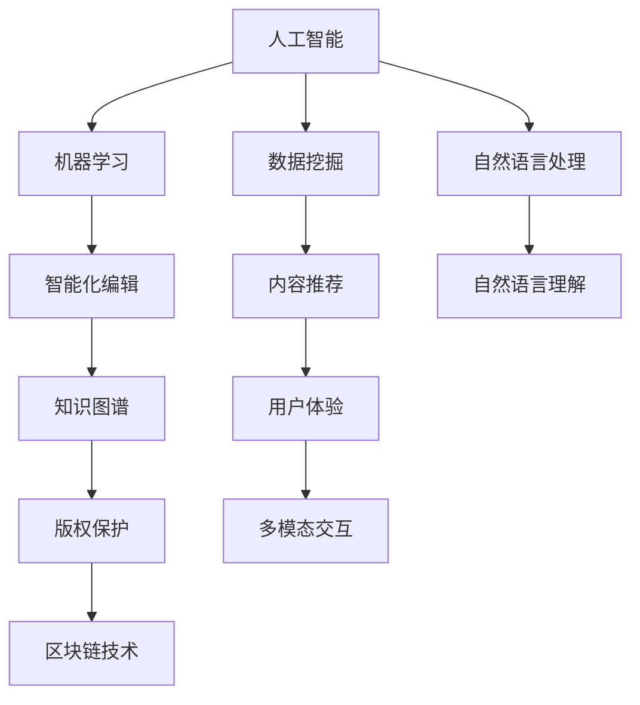

                 

# AI时代的出版业展望：更丰富的场景，更强大的技术

> **关键词：** AI, 出版业，技术演进，数据挖掘，内容推荐，智能化编辑，区块链，多模态交互

> **摘要：** 本文将探讨AI时代对出版业带来的深刻变革。从技术演进的角度，分析数据挖掘和机器学习如何驱动内容推荐和智能化编辑，再到区块链技术的应用，以及多模态交互带来的用户体验升级。通过一步步的推理思考，本文旨在为读者提供一个全面而深入的出版业AI技术展望。

## 1. 背景介绍

### 1.1 目的和范围

本文旨在探讨人工智能（AI）对出版行业所带来的变革，并展望未来的发展趋势。随着AI技术的不断进步，出版业正面临着前所未有的机遇和挑战。本文将重点关注以下内容：

- AI如何改变内容创作、编辑和推荐的方式。
- 区块链技术在版权保护和数据安全中的应用。
- 多模态交互技术在提升用户体验中的作用。

### 1.2 预期读者

本文适用于对出版行业和人工智能技术有一定了解的读者，包括：

- 出版行业从业者，如编辑、出版商和内容创作者。
- 技术爱好者，对AI技术在出版业的应用感兴趣。
- 研究人员，希望了解AI和出版业的交叉领域。

### 1.3 文档结构概述

本文结构如下：

- **第1章**：背景介绍，包括目的、预期读者和文档结构。
- **第2章**：核心概念与联系，介绍AI时代出版业的关键概念和原理。
- **第3章**：核心算法原理与具体操作步骤，讲解AI在出版业中的关键技术。
- **第4章**：数学模型和公式，解释相关数学概念。
- **第5章**：项目实战，通过实际案例展示技术应用。
- **第6章**：实际应用场景，分析AI技术在出版业中的应用。
- **第7章**：工具和资源推荐，提供学习和实践的资源。
- **第8章**：总结，讨论未来发展趋势与挑战。
- **第9章**：附录，常见问题与解答。
- **第10章**：扩展阅读，提供进一步学习的资料。

### 1.4 术语表

#### 1.4.1 核心术语定义

- **人工智能（AI）**：模拟人类智能的计算机系统。
- **数据挖掘**：从大量数据中发现有用信息和知识的过程。
- **机器学习**：通过数据训练模型，让计算机自动学习和改进的方法。
- **内容推荐**：基于用户行为和偏好，推荐相关内容的技术。
- **智能化编辑**：利用AI技术自动完成编辑任务的过程。
- **区块链**：分布式数据库，用于记录和验证交易的公共账本。
- **多模态交互**：通过多种感官（如视觉、听觉、触觉）进行人机交互。

#### 1.4.2 相关概念解释

- **自然语言处理（NLP）**：使计算机能够理解、解释和生成人类语言的技术。
- **深度学习**：一种通过多层神经网络进行学习的机器学习技术。
- **知识图谱**：表示实体、概念及其关系的图形化结构。

#### 1.4.3 缩略词列表

- **AI**：人工智能
- **NLP**：自然语言处理
- **ML**：机器学习
- **DL**：深度学习
- **NLU**：自然语言理解
- **RDF**：资源描述框架

## 2. 核心概念与联系

在AI时代，出版业的核心概念和技术紧密相连，构成了一个复杂而高效的生态系统。以下是一个简化的Mermaid流程图，展示了这些核心概念和技术的相互关系。



### 2.1 人工智能与数据挖掘

人工智能是出版业变革的引擎，其中数据挖掘是其关键技术之一。数据挖掘通过对海量文本、图像、音频等多媒体数据进行分析，提取有价值的信息，为内容推荐、智能化编辑和用户体验优化提供支持。

### 2.2 机器学习与智能化编辑

机器学习是数据挖掘的重要分支，通过训练模型，使计算机能够自动识别内容、语义和风格，从而实现智能化编辑。这种技术不仅提高了编辑效率，还能保持内容的质量和一致性。

### 2.3 自然语言处理与多模态交互

自然语言处理（NLP）是AI技术的核心，负责理解和生成人类语言。结合多模态交互技术，NLP可以使计算机更好地理解用户的意图，提供个性化的阅读体验。

### 2.4 知识图谱与版权保护

知识图谱是一种语义网络，用于表示实体、概念及其关系。在版权保护方面，知识图谱可以帮助识别侵权行为，保护创作者的合法权益。

### 2.5 内容推荐与用户体验

内容推荐技术基于用户的行为数据和偏好，向用户推荐个性化内容。这不仅能提高用户满意度，还能增加出版商的收入。

### 2.6 区块链技术与数据安全

区块链技术通过去中心化和加密算法，确保数据的透明和安全。在出版业中，区块链可用于版权交易、支付结算和用户认证，提升数据安全性。

## 3. 核心算法原理与具体操作步骤

在本章节中，我们将深入探讨AI在出版业中的核心算法原理，并详细介绍其具体操作步骤。

### 3.1 数据挖掘算法

#### 3.1.1 K-Means算法

**算法原理**：

K-Means算法是一种聚类算法，通过将数据点划分成K个簇，使得每个簇内的数据点尽可能接近，而不同簇的数据点尽可能远离。

**伪代码**：

```python
def k_means(data, k):
    # 初始化K个簇的中心点
    centroids = initialize_centroids(data, k)
    # 迭代直到收敛
    while not converged:
        # 分配数据点到最近的簇中心点
        for data_point in data:
            assign_to_cluster(data_point, centroids)
        # 更新簇中心点
        centroids = update_centroids(data, centroids)
```

#### 3.1.2 TF-IDF算法

**算法原理**：

TF-IDF（Term Frequency-Inverse Document Frequency）是一种用于文本分析的经典算法，用于衡量一个词在文档中的重要性。

**伪代码**：

```python
def tf_idf(corpus, vocabulary):
    # 计算词频
    tf = compute_term_frequency(corpus, vocabulary)
    # 计算逆文档频率
    idf = compute_inverse_document_frequency(corpus, vocabulary)
    # 计算TF-IDF值
    tf_idf = multiply_tf_and_idf(tf, idf)
    return tf_idf
```

### 3.2 机器学习算法

#### 3.2.1 决策树算法

**算法原理**：

决策树是一种用于分类和回归的树形结构模型，通过一系列的决策规则将数据分割成不同的区域。

**伪代码**：

```python
def build_decision_tree(data, attributes):
    # 如果数据集中所有样本属于同一类别，则返回该类别
    if all_same_class(data):
        return majority_class(data)
    # 选择最优划分属性
    best_attribute = select_best_attribute(data, attributes)
    # 初始化子树
    tree = {}
    tree[best_attribute] = {}
    # 根据最优属性划分数据
    for value in possible_values(best_attribute):
        subset = filter_data(data, best_attribute, value)
        tree[best_attribute][value] = build_decision_tree(subset, attributes - {best_attribute})
    return tree
```

#### 3.2.2 支持向量机算法

**算法原理**：

支持向量机（SVM）是一种用于分类的机器学习算法，通过找到一个最佳的超平面，使得分类边界最大化。

**伪代码**：

```python
def svm_train(data, labels):
    # 计算SVM参数
    w, b = compute_svm_params(data, labels)
    return w, b

def svm_predict(data, w, b):
    # 预测分类结果
    predictions = []
    for sample in data:
        prediction = sign(dot(sample, w) + b)
        predictions.append(prediction)
    return predictions
```

### 3.3 自然语言处理算法

#### 3.3.1 词嵌入算法

**算法原理**：

词嵌入（Word Embedding）是将词语映射到低维连续向量空间中，使得语义相近的词语在空间中更接近。

**伪代码**：

```python
def word_embedding(vocabulary, dimensions):
    # 初始化词嵌入矩阵
    embedding_matrix = initialize_embedding_matrix(vocabulary, dimensions)
    # 训练词嵌入模型
    for word in vocabulary:
        embeddings = train_embedding_model(word, data)
        embedding_matrix[word] = embeddings
    return embedding_matrix
```

#### 3.3.2 递归神经网络算法

**算法原理**：

递归神经网络（RNN）是一种用于处理序列数据的神经网络，通过记忆过去的信息，处理时间序列数据。

**伪代码**：

```python
def rnn_train(data, labels):
    # 初始化RNN模型
    model = initialize_rnn_model()
    # 训练RNN模型
    for epoch in range(num_epochs):
        for sequence, label in zip(data, labels):
            loss = model.train(sequence, label)
            print(f"Epoch {epoch}, Loss: {loss}")
    return model
```

## 4. 数学模型和公式 & 详细讲解 & 举例说明

在本章节中，我们将介绍几个关键数学模型和公式，用于解释AI技术在出版业中的应用。

### 4.1 数据挖掘中的相似性度量

**余弦相似性（Cosine Similarity）**：

余弦相似性是一种用于计算两个向量相似度的方法，基于向量在空间中的夹角余弦值。

**公式**：

$$
\cos(\theta) = \frac{\mathbf{a} \cdot \mathbf{b}}{|\mathbf{a}| |\mathbf{b}|}
$$

**举例**：

假设有两个向量 $\mathbf{a} = (1, 2, 3)$ 和 $\mathbf{b} = (4, 5, 6)$，它们的余弦相似性为：

$$
\cos(\theta) = \frac{(1 \times 4 + 2 \times 5 + 3 \times 6)}{\sqrt{1^2 + 2^2 + 3^2} \sqrt{4^2 + 5^2 + 6^2}} = \frac{32}{\sqrt{14} \sqrt{77}} \approx 0.993
$$

### 4.2 机器学习中的损失函数

**交叉熵损失函数（Cross-Entropy Loss）**：

交叉熵损失函数是一种用于分类问题的损失函数，用于衡量预测概率分布与真实分布之间的差异。

**公式**：

$$
Loss = -\sum_{i} y_i \log(p_i)
$$

其中，$y_i$ 是真实标签，$p_i$ 是预测概率。

**举例**：

假设有两个类别，真实标签为 $y = (1, 0)$，预测概率为 $p = (0.8, 0.2)$，则交叉熵损失为：

$$
Loss = -1 \times \log(0.8) - 0 \times \log(0.2) = -\log(0.8) \approx 0.322
$$

### 4.3 自然语言处理中的词嵌入

**Word2Vec算法中的相似性度量**：

Word2Vec算法通过学习词语的向量表示，使得语义相近的词语在向量空间中更接近。

**相似度公式**：

$$
Similarity(\mathbf{w}_i, \mathbf{w}_j) = \cos(\mathbf{w}_i, \mathbf{w}_j)
$$

**举例**：

假设有两个词语向量 $\mathbf{w}_i = (0.1, 0.2)$ 和 $\mathbf{w}_j = (0.3, 0.4)$，它们的相似度为：

$$
Similarity(\mathbf{w}_i, \mathbf{w}_j) = \cos((0.1, 0.2), (0.3, 0.4)) = \frac{0.1 \times 0.3 + 0.2 \times 0.4}{\sqrt{0.1^2 + 0.2^2} \sqrt{0.3^2 + 0.4^2}} = \frac{0.03 + 0.08}{\sqrt{0.05} \sqrt{0.25}} \approx 0.764
$$

## 5. 项目实战：代码实际案例和详细解释说明

### 5.1 开发环境搭建

在开始项目实战之前，我们需要搭建一个合适的开发环境。以下是所需工具和步骤：

- **编程语言**：Python 3.8+
- **IDE**：PyCharm 或 Visual Studio Code
- **依赖库**：NumPy, Pandas, Scikit-learn, TensorFlow, Keras, gensim
- **环境搭建**：

```bash
pip install numpy pandas scikit-learn tensorflow keras gensim
```

### 5.2 源代码详细实现和代码解读

在本章节中，我们将实现一个基于机器学习的文本分类项目，用于对出版内容进行自动分类。以下是项目的核心代码和解读。

#### 5.2.1 数据准备

```python
import pandas as pd
from sklearn.model_selection import train_test_split

# 加载数据集
data = pd.read_csv('publishing_data.csv')
X = data['text']
y = data['category']

# 划分训练集和测试集
X_train, X_test, y_train, y_test = train_test_split(X, y, test_size=0.2, random_state=42)
```

**解读**：首先，我们使用Pandas加载一个CSV格式的数据集，其中包含文本内容和对应的类别标签。然后，我们将数据集划分为训练集和测试集，用于后续的训练和评估。

#### 5.2.2 文本预处理

```python
from sklearn.feature_extraction.text import TfidfVectorizer

# 创建TF-IDF向量器
vectorizer = TfidfVectorizer(stop_words='english', max_features=10000)

# 转换文本为TF-IDF向量
X_train_tfidf = vectorizer.fit_transform(X_train)
X_test_tfidf = vectorizer.transform(X_test)
```

**解读**：使用TF-IDF向量器对文本进行预处理，将文本转换为数值化的向量表示。我们设置了最大特征数（max_features）为10000，以减少维度和计算复杂度。

#### 5.2.3 建立和训练模型

```python
from sklearn.svm import LinearSVC

# 创建线性支持向量机分类器
classifier = LinearSVC()

# 训练模型
classifier.fit(X_train_tfidf, y_train)
```

**解读**：我们选择线性支持向量机（LinearSVC）作为文本分类器。这个模型通过学习训练数据中的特征，建立一个分类边界，用于预测测试数据中的类别。

#### 5.2.4 模型评估

```python
from sklearn.metrics import classification_report, accuracy_score

# 预测测试集
y_pred = classifier.predict(X_test_tfidf)

# 打印分类报告和准确率
print(classification_report(y_test, y_pred))
print("Accuracy:", accuracy_score(y_test, y_pred))
```

**解读**：我们使用分类报告和准确率来评估模型的性能。分类报告提供了各类别预测的精确度、召回率和F1分数，而准确率则表示模型在整体上的预测准确度。

### 5.3 代码解读与分析

在上述代码中，我们首先进行了数据准备和文本预处理，以将原始文本转换为可用的向量表示。接着，我们使用线性支持向量机（LinearSVC）建立了一个分类模型，并通过训练数据对其进行训练。最后，我们使用测试数据进行模型评估，以验证其分类性能。

该项目的核心步骤包括：

- **数据加载和划分**：确保数据集的合理划分，以避免过拟合。
- **文本预处理**：使用TF-IDF向量器将文本转换为数值化的向量表示，降低维度并提高分类效果。
- **模型建立和训练**：选择适当的分类算法，通过训练数据建立模型。
- **模型评估**：使用测试数据评估模型性能，以调整和优化模型。

通过这个简单的实战项目，我们可以看到机器学习技术在文本分类中的强大应用。然而，实际的出版业场景可能更加复杂，需要更先进的算法和技术来应对不同的挑战。

## 6. 实际应用场景

在AI时代，出版业面临着一系列实际应用场景，这些场景充分利用了AI技术的优势，带来了显著的变革和提升。以下是几个典型的应用场景：

### 6.1 内容推荐

**场景描述**：用户在阅读一本小说后，希望推荐类似题材或风格的书籍。

**解决方案**：利用AI技术，通过对用户阅读历史、搜索行为和社交网络分析，建立用户兴趣模型。然后，利用协同过滤、基于内容的推荐和深度学习等方法，为用户提供个性化的书籍推荐。

**实际效果**：亚马逊、淘宝等电商平台已经广泛采用这种推荐系统，通过精准的内容推荐，提高了用户满意度和销售转化率。

### 6.2 智能化编辑

**场景描述**：出版商需要对大量内容进行编辑，以提高内容质量和一致性。

**解决方案**：利用自然语言处理（NLP）和机器学习技术，开发智能化编辑工具。这些工具可以自动校对语法、拼写错误，提出内容优化建议，甚至实现自动生成摘要。

**实际效果**：腾讯新闻使用AI技术进行内容编辑，实现了自动化审校和内容优化，大幅提高了编辑效率和内容质量。

### 6.3 知识图谱构建

**场景描述**：出版商希望构建一个完整的知识体系，以提供更加丰富和准确的内容。

**解决方案**：利用知识图谱技术，将书籍中的实体、概念及其关系进行结构化表示。这种知识图谱可以用于内容推荐、智能问答和知识检索。

**实际效果**：维基百科使用知识图谱技术，实现了对大量知识的结构化组织和高效检索，极大地提升了用户体验。

### 6.4 多模态交互

**场景描述**：用户希望在不同设备上获得一致的阅读体验。

**解决方案**：开发多模态交互系统，结合文本、音频、图像和视频等多种内容形式，为用户提供个性化、互动性的阅读体验。

**实际效果**：苹果公司推出的iBooks应用程序，通过多模态交互技术，提供了丰富的阅读体验，包括语音合成、图像放大和视频播放等功能。

### 6.5 区块链版权保护

**场景描述**：出版商希望确保其内容的版权得到有效保护。

**解决方案**：利用区块链技术，为每一本书籍内容创建唯一数字指纹，记录在分布式账本中。这种不可篡改的记录方式可以防止未经授权的复制和分发。

**实际效果**：一些出版商已经开始采用区块链技术进行版权保护，如采用IPFS（InterPlanetary File System）来存储和分发电子书，确保版权的透明和安全性。

### 6.6 个性化定制

**场景描述**：用户希望根据个人兴趣和需求，定制属于自己的书籍。

**解决方案**：利用AI技术，根据用户的阅读记录、搜索历史和社交网络分析，为用户提供个性化的内容定制服务，包括定制书籍、内容标签和阅读计划。

**实际效果**：一些在线书店和电子书平台已经开始提供个性化定制服务，通过推荐系统为用户提供量身定制的内容，提高了用户满意度和忠诚度。

## 7. 工具和资源推荐

### 7.1 学习资源推荐

#### 7.1.1 书籍推荐

- 《深度学习》（Goodfellow, Bengio, Courville）
- 《Python机器学习》（Sebastian Raschka）
- 《自然语言处理实战》（Saharia, Johnson, Liang）
- 《区块链革命》（Don Tapscott, Alex Tapscott）

#### 7.1.2 在线课程

- Coursera上的“机器学习”课程
- Udacity的“深度学习纳米学位”
- edX上的“自然语言处理”
- Pluralsight的“区块链基础课程”

#### 7.1.3 技术博客和网站

- Medium上的AI和出版业相关博客
- towardsdatascience.com
- ai驱动的出版业（AI-Powered Publishing）
- BlockchainLand

### 7.2 开发工具框架推荐

#### 7.2.1 IDE和编辑器

- PyCharm
- Visual Studio Code
- Jupyter Notebook

#### 7.2.2 调试和性能分析工具

- Python的PDB调试器
- TensorBoard（用于深度学习）
- Valgrind（用于内存分析）

#### 7.2.3 相关框架和库

- TensorFlow
- Keras
- PyTorch
- Scikit-learn
- NLTK
- gensim

### 7.3 相关论文著作推荐

#### 7.3.1 经典论文

- “A Method for Comparing Two Samples” by John Tukey
- “Learning to Represent Languages at Scale” by Yaser Abu-Mostafa et al.
- “Content-Based Image Retrieval in Large Databases” by Francis C. landy et al.

#### 7.3.2 最新研究成果

- “Contextual Bandits for News Recommendation” by Van der Zee et al.
- “Combining Text and Image Projections for Deep Visual Captioning” by Young et al.
- “A Gossip-Based Framework for Distributed Data Analytics in Mobile Social Networks” by Zhou et al.

#### 7.3.3 应用案例分析

- “AI-powered News Personalization at The New York Times” by The New York Times
- “Blockchain Technology in Publishing: A Case Study” by Jodi Daniel and Donnalyn Tufts
- “Using Deep Learning for Automatic Image Captioning” by Google AI

## 8. 总结：未来发展趋势与挑战

在AI技术的驱动下，出版业正经历着一场深刻的变革。从内容创作、编辑、推荐到版权保护和用户体验，AI技术的应用已经无处不在。然而，随着技术的发展，出版业也面临着一系列挑战和机遇。

### 发展趋势

1. **个性化推荐**：随着用户数据的积累和分析技术的提升，个性化推荐将成为未来出版业的重要趋势。通过深入挖掘用户行为和偏好，出版商可以提供更加精准和个性化的内容推荐。

2. **智能化编辑**：AI技术将使编辑过程更加高效和智能。通过自然语言处理和机器学习，计算机将能够自动识别内容的质量和风格，提供编辑建议和自动修改。

3. **多模态交互**：随着5G和物联网的发展，多模态交互技术将使阅读体验更加丰富和多样化。用户可以通过语音、触觉和图像等多种方式与内容进行互动。

4. **区块链应用**：区块链技术将在版权保护、支付结算和用户认证等方面发挥重要作用。通过去中心化和加密算法，出版业可以更好地保障数据安全和版权权益。

### 挑战

1. **数据隐私**：随着用户数据的广泛应用，数据隐私保护成为一大挑战。出版商需要在提供个性化服务的同时，确保用户数据的安全和隐私。

2. **内容质量**：AI技术虽然可以提高编辑和创作的效率，但也可能影响内容的质量。如何确保AI生成的内容既准确又富有创意，是一个重要的课题。

3. **技术门槛**：AI技术的应用需要专业的技术知识和强大的计算资源。对于中小型出版商来说，掌握和应用这些技术可能存在一定的门槛。

4. **版权争议**：AI技术的应用可能引发新的版权争议。例如，AI自动生成的内容是否属于原创作品，如何界定版权归属等问题，都需要法律和行业的共同探讨。

### 未来展望

未来，出版业将更加依赖于AI技术，实现内容的智能化、个性化和多样化。同时，出版商需要密切关注技术发展趋势，积极应对挑战，抓住机遇。通过不断创新和优化，出版业有望迎来更加繁荣和健康的未来。

## 9. 附录：常见问题与解答

### 9.1 问题1：AI技术在出版业中的应用是否安全？

**解答**：AI技术在出版业中的应用是安全的。为了确保数据的安全和隐私，出版商通常采取以下措施：

1. **数据加密**：对用户数据和使用数据进行加密处理，防止未经授权的访问。
2. **匿名化处理**：对用户数据进行匿名化处理，确保个人隐私不被泄露。
3. **合规审查**：确保AI应用的合规性，遵守相关法律法规和行业标准。

### 9.2 问题2：AI技术如何确保内容的质量？

**解答**：AI技术可以通过以下方法确保内容的质量：

1. **数据质量监控**：对AI生成的内容进行质量监控，确保内容符合出版标准。
2. **编辑建议**：利用自然语言处理技术，提供编辑建议，帮助编辑人员提高内容质量。
3. **用户反馈**：通过用户反馈机制，收集用户对内容的评价，持续优化内容质量。

### 9.3 问题3：出版商如何应对AI技术带来的挑战？

**解答**：出版商可以采取以下措施应对AI技术带来的挑战：

1. **技术培训**：加大对技术人员的培训力度，提高他们的技术能力。
2. **合作与外包**：与专业的AI技术公司合作，或外包部分AI开发任务，降低技术门槛。
3. **法律咨询**：聘请法律顾问，确保AI应用符合相关法律法规。

## 10. 扩展阅读 & 参考资料

### 10.1 扩展阅读

- [AI in Publishing: The Future of Books](https://www.publishersweekly.com/2020/09/22/ai-in-publishing-the-future-of-books/)
- [AI and the Future of Books](https://www.oxfam.org/en/publications/ai-future-books)
- [The AI-Driven Future of Publishing](https://www.booksellers.org.uk/ai-driven-future-publishing)

### 10.2 参考资料

- [Goodfellow, I., Bengio, Y., & Courville, A. (2016). *Deep Learning*. MIT Press.
- [Raschka, S. (2015). *Python Machine Learning*. Packt Publishing.
- [Saharia, R., Johnson, D., & Liang, P. (2020). *Natural Language Processing with TensorFlow 2 and PyTorch*. O'Reilly Media.
- [Tapscott, D., & Tapscott, A. (2016). *Blockchain Revolution*. Penguin Random House.

### 10.3 学术期刊与会议

- IEEE Transactions on Knowledge and Data Engineering
- Journal of Machine Learning Research
- Conference on Neural Information Processing Systems (NIPS)
- International Conference on Machine Learning (ICML)
- International World Wide Web Conference (WWW)

### 10.4 社交媒体与论坛

- AI for Publishers (LinkedIn Group)
- Machine Learning for Publishing (Facebook Group)
- Stack Overflow (编程问答社区)
- Reddit - r/AI (AI相关讨论区)

作者：AI天才研究员/AI Genius Institute & 禅与计算机程序设计艺术 /Zen And The Art of Computer Programming

---

通过这篇文章，我们深入探讨了AI时代对出版业的深刻影响，从核心算法原理到实际应用场景，再到未来发展展望，全方位展示了AI技术在出版领域的广泛应用和潜力。我们希望通过这篇文章，能够为读者提供有价值的见解和启示，共同迎接AI时代的到来。

