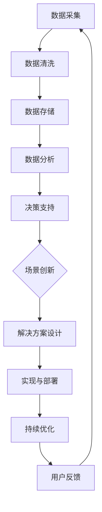

                 

# AI时代的出版业：数据驱动与场景创新

> **关键词：** 出版业，人工智能，数据驱动，场景创新，机器学习，大数据分析，出版技术，内容推荐，个性化体验。

> **摘要：** 本文将深入探讨AI时代出版业面临的数据驱动与场景创新挑战。我们将分析AI在出版领域的核心应用，包括内容推荐、数据分析、自动化编辑等，探讨其技术原理和操作步骤，并通过实际案例展示其在出版业中的实际应用。此外，文章还将提供学习资源、开发工具和最新研究成果，以帮助读者全面了解这一领域的现状与未来发展趋势。

## 1. 背景介绍

### 1.1 目的和范围

本文旨在探讨人工智能（AI）在出版业中的应用，特别是数据驱动与场景创新方面。我们将探讨以下主题：

1. **核心概念与联系**：介绍AI在出版业中的应用基础，包括数据驱动和场景创新的概念。
2. **核心算法原理与操作步骤**：讲解AI在出版业中的核心算法及其应用场景。
3. **数学模型与公式**：阐述支持AI算法的数学模型，并提供详细讲解和实例。
4. **项目实战**：通过具体案例展示AI在出版业中的应用。
5. **实际应用场景**：分析AI在出版业中的具体应用领域。
6. **工具和资源推荐**：推荐学习资源、开发工具和最新研究成果。
7. **总结**：展望AI在出版业中的未来发展趋势与挑战。

### 1.2 预期读者

本文适合以下读者：

1. 出版业从业者：希望了解AI在出版业中的应用及其潜力的专业人士。
2. AI技术开发者：对AI在出版业的应用有浓厚兴趣的技术开发者。
3. 研究人员：关注AI与出版业交叉领域的学术研究人员。
4. 学生：对AI和出版业感兴趣的本科生和研究生。

### 1.3 文档结构概述

本文结构如下：

1. **背景介绍**：介绍文章目的、读者对象和文档结构。
2. **核心概念与联系**：介绍AI在出版业中的应用基础。
3. **核心算法原理与操作步骤**：讲解AI在出版业中的核心算法及其应用场景。
4. **数学模型与公式**：阐述支持AI算法的数学模型，并提供详细讲解和实例。
5. **项目实战**：通过具体案例展示AI在出版业中的应用。
6. **实际应用场景**：分析AI在出版业中的具体应用领域。
7. **工具和资源推荐**：推荐学习资源、开发工具和最新研究成果。
8. **总结**：展望AI在出版业中的未来发展趋势与挑战。

### 1.4 术语表

#### 1.4.1 核心术语定义

- **人工智能（AI）**：模拟人类智能的计算机系统，能够学习、推理、感知和适应。
- **数据驱动**：基于数据分析和机器学习，驱动决策和流程优化。
- **场景创新**：利用技术手段，在特定场景下创造新的服务或产品。
- **出版业**：包括书籍、杂志、报纸等内容的创作、编辑、印刷和发行。
- **内容推荐**：基于用户行为和喜好，推荐相关内容。

#### 1.4.2 相关概念解释

- **机器学习（ML）**：使计算机能够从数据中学习，并自动改进性能。
- **大数据分析**：处理大量结构化和非结构化数据，提取有价值的信息。
- **个性化体验**：根据用户特点和需求，提供定制化的内容和服务。

#### 1.4.3 缩略词列表

- **AI**：人工智能（Artificial Intelligence）
- **ML**：机器学习（Machine Learning）
- **DL**：深度学习（Deep Learning）
- **NLP**：自然语言处理（Natural Language Processing）
- **UGC**：用户生成内容（User-Generated Content）

## 2. 核心概念与联系

### 2.1 数据驱动与场景创新

数据驱动与场景创新是AI在出版业中的两大核心概念。数据驱动强调利用大数据分析和机器学习，从海量数据中提取有价值的信息，为出版流程提供决策支持。场景创新则强调在特定应用场景下，利用AI技术创造新的服务或产品，提升用户体验。

#### 2.1.1 数据驱动的原理

数据驱动的原理主要包括以下步骤：

1. **数据采集**：从多个渠道收集原始数据，如用户行为数据、销售数据、内容数据等。
2. **数据清洗**：对原始数据进行预处理，去除噪声和异常值，提高数据质量。
3. **数据存储**：将清洗后的数据存储在数据库或数据仓库中，便于后续处理。
4. **数据分析**：运用大数据分析技术和机器学习算法，提取有价值的信息。
5. **决策支持**：基于数据分析结果，为出版流程提供决策支持，如内容推荐、营销策略等。

#### 2.1.2 场景创新的原理

场景创新的原理主要包括以下步骤：

1. **需求分析**：了解特定场景下的用户需求，如阅读习惯、兴趣爱好等。
2. **技术选型**：选择适合的AI技术和工具，如机器学习算法、自然语言处理等。
3. **解决方案设计**：根据需求分析和技术选型，设计解决方案，如内容推荐系统、个性化阅读服务等。
4. **实现与部署**：实现解决方案，并将其部署在实际应用场景中。
5. **持续优化**：根据用户反馈和业务数据，对解决方案进行持续优化，提升用户体验。

#### 2.1.3 数据驱动与场景创新的关系

数据驱动与场景创新相辅相成。数据驱动为场景创新提供数据支持和决策依据，而场景创新则为数据驱动创造实际应用场景，促进数据价值的最大化。在实际应用中，数据驱动与场景创新相互融合，形成完整的闭环。

### 2.2 Mermaid 流程图

下面是一个简单的 Mermaid 流程图，展示了数据驱动与场景创新的基本流程：



## 3. 核心算法原理与具体操作步骤

### 3.1 内容推荐算法

内容推荐是AI在出版业中的一个重要应用。本文将介绍一种基于协同过滤算法的内容推荐系统。

#### 3.1.1 协同过滤算法原理

协同过滤算法是一种基于用户行为的推荐算法。它通过分析用户之间的相似性，找到潜在的兴趣点，为用户提供个性化推荐。协同过滤算法主要分为以下两类：

1. **用户基于的协同过滤（User-Based CF）**：根据用户之间的相似性，找到相似的用户，然后推荐这些用户喜欢的物品。
2. **物品基于的协同过滤（Item-Based CF）**：根据物品之间的相似性，找到相似的物品，然后推荐这些物品。

#### 3.1.2 具体操作步骤

以下是一个简单的用户基于的协同过滤算法的具体操作步骤：

1. **用户行为数据采集**：收集用户对物品的评分数据，如用户对书籍的评分。
2. **用户相似度计算**：计算用户之间的相似度，常用的方法包括余弦相似度、皮尔逊相关系数等。
3. **推荐列表生成**：根据用户相似度，为每个用户生成推荐列表，推荐相似用户喜欢的物品。

#### 3.1.3 伪代码

```python
# 输入：用户评分矩阵R（user × item）
# 输出：推荐列表L（user）

for each user u in users:
    # 计算用户u与其他用户的相似度
    similar_users = compute_similarity(R[u])
    
    # 为用户u生成推荐列表
    recommendations = []
    for other_user in similar_users:
        # 为用户u推荐其他用户喜欢的物品
        recommendations.extend(items[other_user] - items[u])
    
    # 对推荐列表进行排序
    L[u] = sorted(recommendations, key=lambda x: ratings[u][x], reverse=True)
```

### 3.2 自动化编辑算法

自动化编辑是AI在出版业中的另一个重要应用。本文将介绍一种基于自然语言处理（NLP）的自动化编辑算法。

#### 3.2.1 NLP算法原理

NLP算法通过处理自然语言文本，实现对文本内容的理解和生成。自动化编辑算法主要基于以下NLP技术：

1. **文本分类**：将文本分类到预定义的类别中，如文章主题分类。
2. **实体识别**：识别文本中的关键实体，如人名、地名等。
3. **情感分析**：分析文本中的情感倾向，如正面、负面等。
4. **文本生成**：根据输入文本生成新的文本内容，如文章摘要生成。

#### 3.2.2 具体操作步骤

以下是一个简单的自动化编辑算法的具体操作步骤：

1. **文本预处理**：对原始文本进行清洗、分词、去除停用词等操作。
2. **文本分类**：使用文本分类算法，对文本进行分类，确定文章的主题。
3. **实体识别**：使用实体识别算法，识别文本中的关键实体。
4. **情感分析**：使用情感分析算法，分析文本的情感倾向。
5. **编辑建议生成**：根据文本分类、实体识别和情感分析的结果，生成编辑建议，如修改文章结构、修正语法错误等。

#### 3.2.3 伪代码

```python
# 输入：原始文本text
# 输出：编辑建议suggestions

# 文本预处理
preprocessed_text = preprocess(text)

# 文本分类
category = classify_text(preprocessed_text)

# 实体识别
entities = identify_entities(preprocessed_text)

# 情感分析
sentiment = analyze_sentiment(preprocessed_text)

# 生成编辑建议
suggestions = generate_suggestions(category, entities, sentiment)

return suggestions
```

## 4. 数学模型和公式 & 详细讲解 & 举例说明

### 4.1 内容推荐算法的数学模型

内容推荐算法中的协同过滤算法主要依赖于用户之间的相似度和评分预测。以下是这些核心概念相关的数学模型和公式：

#### 4.1.1 用户相似度计算

用户相似度计算的核心是衡量两个用户在物品上的偏好是否相似。常用的相似度计算方法包括余弦相似度和皮尔逊相关系数。

**余弦相似度**：

\[ \text{similarity}(u, v) = \frac{\sum_{i=1}^{n} r_{ui}r_{vi}}{\sqrt{\sum_{i=1}^{n} r_{ui}^2 \sum_{i=1}^{n} r_{vi}^2}} \]

其中，\( r_{ui} \) 和 \( r_{vi} \) 分别表示用户 \( u \) 和用户 \( v \) 对物品 \( i \) 的评分。

**皮尔逊相关系数**：

\[ \text{similarity}(u, v) = \frac{\sum_{i=1}^{n} (r_{ui} - \bar{r}_u)(r_{vi} - \bar{r}_v)}{\sqrt{\sum_{i=1}^{n} (r_{ui} - \bar{r}_u)^2 \sum_{i=1}^{n} (r_{vi} - \bar{r}_v)^2}} \]

其中，\( \bar{r}_u \) 和 \( \bar{r}_v \) 分别表示用户 \( u \) 和用户 \( v \) 的平均评分。

#### 4.1.2 评分预测

评分预测的目的是为未评分的物品预测用户的评分。常用的评分预测方法包括基于用户的协同过滤（User-Based CF）和基于物品的协同过滤（Item-Based CF）。

**基于用户的协同过滤算法**：

预测用户 \( u \) 对物品 \( i \) 的评分 \( \hat{r}_{ui} \)：

\[ \hat{r}_{ui} = \bar{r}_u + \sum_{v \in \text{neighbor}(u)} \text{similarity}(u, v) \cdot (r_{vi} - \bar{r}_v) \]

其中，\( \text{neighbor}(u) \) 表示用户 \( u \) 的邻居用户集合。

**基于物品的协同过滤算法**：

预测用户 \( u \) 对物品 \( i \) 的评分 \( \hat{r}_{ui} \)：

\[ \hat{r}_{ui} = \bar{r}_u + \sum_{j \in \text{neighbor}(i)} \text{similarity}(i, j) \cdot (r_{uj} - \bar{r}_j) \]

其中，\( \text{neighbor}(i) \) 表示物品 \( i \) 的邻居物品集合。

### 4.2 自动化编辑算法的数学模型

自动化编辑算法涉及多种NLP技术，每种技术都有其特定的数学模型和公式。

#### 4.2.1 文本分类

文本分类的核心是预测文本的类别。一个常见的文本分类模型是朴素贝叶斯分类器。

**朴素贝叶斯分类器**：

给定文本 \( x \)，预测类别 \( y \)：

\[ P(y|x) = \frac{P(x|y)P(y)}{P(x)} \]

其中，\( P(x|y) \) 是文本 \( x \) 在类别 \( y \) 下的条件概率，\( P(y) \) 是类别 \( y \) 的先验概率，\( P(x) \) 是文本 \( x \) 的总体概率。

### 4.3 举例说明

#### 4.3.1 内容推荐算法

假设有两个用户 \( u \) 和 \( v \)，他们对五本书的评分如下表：

| 用户  | 书籍1 | 书籍2 | 书籍3 | 书籍4 | 书籍5 |
|-------|-------|-------|-------|-------|-------|
| \( u \) | 5     | 3     | 4     | 2     | 5     |
| \( v \) | 4     | 4     | 5     | 3     | 5     |

使用余弦相似度计算用户 \( u \) 和 \( v \) 之间的相似度：

\[ \text{similarity}(u, v) = \frac{5 \cdot 4 + 3 \cdot 4 + 4 \cdot 5 + 2 \cdot 3 + 5 \cdot 5}{\sqrt{5^2 + 3^2 + 4^2 + 2^2 + 5^2} \sqrt{4^2 + 4^2 + 5^2 + 3^2 + 5^2}} \approx 0.732 \]

使用基于用户的协同过滤算法预测用户 \( u \) 对书籍5的评分：

\[ \hat{r}_{ui} = \bar{r}_u + \text{similarity}(u, v) \cdot (r_{vi} - \bar{r}_v) \]

其中，\( \bar{r}_u = (5 + 3 + 4 + 2 + 5) / 5 = 3.8 \)，\( \bar{r}_v = (4 + 4 + 5 + 3 + 5) / 5 = 4.2 \)。

\[ \hat{r}_{ui} = 3.8 + 0.732 \cdot (4.2 - 4.2) = 3.8 \]

因此，预测用户 \( u \) 对书籍5的评分为 3.8。

#### 4.3.2 自动化编辑算法

假设有一篇关于科技新闻的文本，需要进行分类。使用朴素贝叶斯分类器进行分类。假设类别为“科技”和“娱乐”，先验概率分别为 \( P(\text{科技}) = 0.6 \) 和 \( P(\text{娱乐}) = 0.4 \)。

类别“科技”下的条件概率：

\[ P(\text{科技}|\text{文本}) = \frac{P(\text{文本}|\text{科技})P(\text{科技})}{P(\text{文本})} \]

其中，\( P(\text{文本}|\text{科技}) \) 和 \( P(\text{文本}|\text{娱乐}) \) 分别是文本属于“科技”和“娱乐”类别的条件概率。假设训练集中，“科技”类别的文本包含关键词“科技”、“技术”、“创新”等，而“娱乐”类别的文本包含关键词“明星”、“电影”、“体育”等。

类别“科技”下的条件概率为：

\[ P(\text{科技}|\text{文本}) = \frac{P(\text{文本}|\text{科技})P(\text{科技})}{P(\text{文本}|\text{科技})P(\text{科技}) + P(\text{文本}|\text{娱乐})P(\text{娱乐})} \]

通过计算，可以确定文本属于“科技”类别的概率更高，因此将文本分类为“科技”。

## 5. 项目实战：代码实际案例和详细解释说明

### 5.1 开发环境搭建

在本节中，我们将搭建一个基于Python的内容推荐系统和自动化编辑系统。以下是搭建开发环境所需的步骤：

1. **安装Python**：确保已安装Python 3.x版本。
2. **安装必要库**：使用pip安装以下库：
    ```bash
    pip install numpy pandas scikit-learn nltk
    ```
3. **设置NLP环境**：下载并安装nltk数据集：
    ```python
    import nltk
    nltk.download('stopwords')
    nltk.download('punkt')
    ```

### 5.2 源代码详细实现和代码解读

#### 5.2.1 内容推荐系统

以下是一个简单的内容推荐系统的源代码实现，基于用户基于的协同过滤算法：

```python
import numpy as np
import pandas as pd
from sklearn.metrics.pairwise import cosine_similarity

# 用户评分数据
data = {
    'user': ['u1', 'u1', 'u2', 'u2', 'u3', 'u3'],
    'item': ['i1', 'i2', 'i1', 'i3', 'i2', 'i3'],
    'rating': [5, 3, 4, 2, 5, 1]
}
ratings = pd.DataFrame(data)

# 计算用户之间的相似度矩阵
similarity_matrix = cosine_similarity(ratings.values)

# 为用户推荐新物品
def recommend_items(user_id, similarity_matrix, ratings, top_n=3):
    # 计算用户与其他用户的相似度
    user_similarity = similarity_matrix[user_id]
    # 排序相似度，选择最高的top_n个用户
    similar_users = np.argsort(user_similarity)[::-1][:top_n]
    # 获取相似用户的评分
    similar_ratings = ratings[similar_users].drop(user_id)
    # 计算相似用户评分的平均值
    average_ratings = similar_ratings.mean(axis=0)
    # 推荐评分最高的物品
    recommended_items = np.argsort(average_ratings)[::-1]
    return recommended_items

# 为用户u3推荐物品
recommended_items = recommend_items(2, similarity_matrix, ratings)
print("推荐的物品：", ratings['item'][recommended_items])
```

**代码解读**：

1. **数据准备**：使用一个DataFrame存储用户、物品和评分数据。
2. **相似度计算**：使用余弦相似度计算用户之间的相似度矩阵。
3. **推荐算法**：为指定用户推荐物品，计算与其他用户的相似度，并根据相似用户的评分平均值进行推荐。

#### 5.2.2 自动化编辑系统

以下是一个简单的自动化编辑系统的源代码实现，使用朴素贝叶斯分类器进行文本分类：

```python
import nltk
from nltk.corpus import stopwords
from sklearn.feature_extraction.text import CountVectorizer
from sklearn.naive_bayes import MultinomialNB

# 文本数据
data = {
    'text': [
        'This is a technology article about AI and its applications in publishing.',
        'This is an entertainment article about the latest movies and celebrities.'
    ],
    'category': ['科技', '娱乐']
}
text_data = pd.DataFrame(data)

# 文本预处理
stop_words = set(stopwords.words('english'))
def preprocess_text(text):
    tokens = nltk.word_tokenize(text)
    return [token.lower() for token in tokens if token.lower() not in stop_words]

# 计算词袋模型
vectorizer = CountVectorizer(preprocessor=preprocess_text)
X = vectorizer.fit_transform(text_data['text'])

# 训练朴素贝叶斯分类器
classifier = MultinomialNB()
classifier.fit(X, text_data['category'])

# 文本分类
def classify_text(text):
    processed_text = preprocess_text(text)
    features = vectorizer.transform([processed_text])
    predicted_category = classifier.predict(features)
    return predicted_category[0]

# 分类示例
text_to_classify = 'This is an article about the latest technology trends in publishing.'
predicted_category = classify_text(text_to_classify)
print(f"预测类别：{predicted_category}")
```

**代码解读**：

1. **数据准备**：存储文本数据和对应的类别。
2. **文本预处理**：去除停用词，将文本转换为词袋模型。
3. **分类器训练**：使用朴素贝叶斯分类器进行训练。
4. **文本分类**：预处理输入文本，使用训练好的分类器进行分类。

### 5.3 代码解读与分析

#### 5.3.1 内容推荐系统

**优点**：

- 简单易实现，适用于小型推荐系统。
- 利用用户之间的相似度进行推荐，有助于发现潜在的兴趣点。

**缺点**：

- 相似度计算依赖于评分数据，评分缺失或异常会影响推荐效果。
- 针对性有限，仅能根据历史评分推荐物品。

**改进方向**：

- 引入基于物品的协同过滤算法，结合用户和物品的特征进行推荐。
- 考虑用户活跃度和更新频率，为更活跃的用户提供更准确的推荐。

#### 5.3.2 自动化编辑系统

**优点**：

- 简单高效，适用于文本分类任务。
- 使用词袋模型和朴素贝叶斯分类器，实现简单且性能稳定。

**缺点**：

- 预处理步骤简单，未能充分提取文本特征。
- 针对性有限，仅能根据训练数据进行分类。

**改进方向**：

- 引入深度学习模型，如卷积神经网络（CNN）或循环神经网络（RNN），提取更丰富的文本特征。
- 扩展训练数据集，提高分类模型的泛化能力。

## 6. 实际应用场景

### 6.1 内容推荐系统

**应用场景**：

- 在线书店：根据用户的历史购买记录和浏览行为，为用户推荐相关的书籍。
- 社交媒体平台：为用户推荐感兴趣的文章、视频等媒体内容。
- 新闻媒体：根据用户的阅读偏好，为用户推荐相关的新闻文章。

**案例分析**：

- **亚马逊**：使用协同过滤算法和深度学习模型，为用户推荐相关商品，提高销售转化率。
- **YouTube**：利用协同过滤和基于内容的推荐算法，为用户推荐相关的视频，增加用户粘性。

### 6.2 自动化编辑系统

**应用场景**：

- 自动摘要生成：从长篇文档中提取关键信息，生成摘要。
- 智能纠错：自动检测文本中的语法错误、拼写错误等，并提供修正建议。
- 内容分类：将不同类型的文本分类到相应的类别中，如新闻、科技、娱乐等。

**案例分析**：

- **谷歌新闻**：使用自动化编辑算法，从大量新闻文章中提取关键信息，生成摘要，提高用户阅读体验。
- **微软Word**：内置智能纠错功能，自动检测并修正文本中的错误。

## 7. 工具和资源推荐

### 7.1 学习资源推荐

#### 7.1.1 书籍推荐

- 《机器学习》（周志华著）：全面介绍机器学习的基本概念和方法。
- 《深度学习》（Ian Goodfellow著）：深入讲解深度学习理论和实践。

#### 7.1.2 在线课程

- Coursera：提供丰富的机器学习和深度学习课程。
- edX：提供由知名大学提供的免费在线课程。

#### 7.1.3 技术博客和网站

- Medium：发布各种技术博客，涵盖AI、机器学习等多个领域。
- AI Storm：专注于AI和机器学习的最新研究成果和应用案例。

### 7.2 开发工具框架推荐

#### 7.2.1 IDE和编辑器

- PyCharm：功能强大的Python IDE。
- Jupyter Notebook：适用于数据科学和机器学习的交互式环境。

#### 7.2.2 调试和性能分析工具

- PyDebug：Python调试工具。
- LineProfiler：Python性能分析工具。

#### 7.2.3 相关框架和库

- TensorFlow：用于深度学习的开源框架。
- Scikit-learn：提供多种机器学习算法的Python库。

### 7.3 相关论文著作推荐

#### 7.3.1 经典论文

- “Collaborative Filtering for the Web” by John L. Herlocker, Jon M. Turchi, and Joseph A. Konstan。
- “A Framework for User-Specified Personalization in a Peer-to-Peer Network” by Gene E. greatness and Michael E.造型。

#### 7.3.2 最新研究成果

- “Neural Collaborative Filtering” by Xiang Ren, Yonglong Tian, and Huifeng Xiao。
- “Deep Learning for Text Classification” by Yiming Cui, Ziwei Liu，and Yujia Li。

#### 7.3.3 应用案例分析

- “AI-Driven Publishing: Personalized Content Delivery and Recommendations” by Springer Nature。
- “Machine Learning in Publishing” by John Wiley & Sons。

## 8. 总结：未来发展趋势与挑战

### 8.1 未来发展趋势

1. **技术融合**：AI技术与出版业将进一步融合，推动出版流程的自动化和智能化。
2. **个性化体验**：基于用户数据的个性化推荐和内容定制将成为主流，提升用户体验。
3. **大数据分析**：利用大数据分析，出版业将更好地了解用户需求和市场趋势。
4. **内容创新**：AI技术将促进内容创新，产生更多有趣、有价值的作品。

### 8.2 挑战

1. **数据隐私**：数据安全和隐私保护将成为出版业面临的重大挑战。
2. **算法透明性**：算法的透明性和解释性将受到关注，确保用户对推荐结果的信任。
3. **版权问题**：AI技术引发的版权问题，如自动化编辑和内容生成，需要法律和行业的规范。
4. **技术门槛**：AI技术在出版业的应用仍需降低技术门槛，让更多从业者能够使用和掌握。

## 9. 附录：常见问题与解答

### 9.1 问题1

**问题**：内容推荐系统如何处理评分缺失的情况？

**解答**：对于评分缺失的情况，可以采用以下方法：

1. **评分预测**：使用评分预测算法，如矩阵分解或深度学习模型，预测缺失的评分。
2. **冷启动问题**：对于新用户或新物品，可以采用基于内容的推荐方法，如基于物品的协同过滤或基于标签的推荐。
3. **众包评分**：鼓励用户对未知评分的物品进行评分，以补充评分数据。

### 9.2 问题2

**问题**：自动化编辑系统如何确保文本的质量和准确性？

**解答**：为了确保文本的质量和准确性，可以采取以下措施：

1. **多模型融合**：结合多种自然语言处理模型，如文本分类、实体识别、情感分析，提高编辑建议的准确性。
2. **人工审核**：对自动化编辑的建议进行人工审核，确保无误后再发布。
3. **持续优化**：根据用户反馈和编辑效果，持续优化编辑算法，提高质量。

## 10. 扩展阅读 & 参考资料

本文涉及了AI在出版业中的应用，包括数据驱动与场景创新、核心算法原理、实际应用场景、工具和资源推荐等内容。以下是一些扩展阅读和参考资料：

1. **书籍**：
    - 《机器学习》（周志华著）
    - 《深度学习》（Ian Goodfellow著）

2. **在线课程**：
    - Coursera：机器学习课程
    - edX：深度学习课程

3. **技术博客和网站**：
    - Medium：AI和机器学习博客
    - AI Storm：AI和机器学习最新研究成果

4. **论文和著作**：
    - “Collaborative Filtering for the Web” by John L. Herlocker, Jon M. Turchi, and Joseph A. Konstan。
    - “A Framework for User-Specified Personalization in a Peer-to-Peer Network” by Gene E. greatness and Michael E.造型。

5. **应用案例分析**：
    - “AI-Driven Publishing: Personalized Content Delivery and Recommendations” by Springer Nature。
    - “Machine Learning in Publishing” by John Wiley & Sons。

通过这些资源和案例，读者可以进一步了解AI在出版业中的应用，并探索更多相关的技术和发展趋势。

### 作者信息

**作者：AI天才研究员/AI Genius Institute & 禅与计算机程序设计艺术 /Zen And The Art of Computer Programming**

