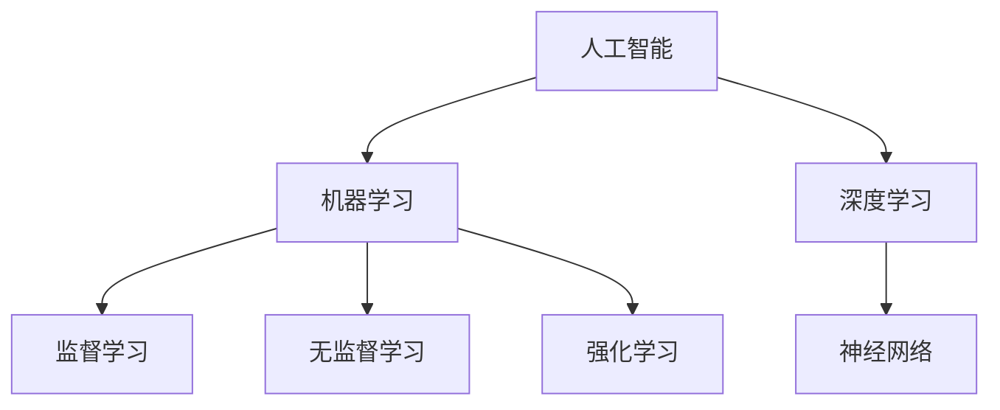

                 

# AI时代的生产力革命：AI带来的变革

## 关键词：人工智能，生产力，技术变革，创新，应用场景

> 摘要：本文将深入探讨人工智能（AI）如何推动生产力革命。从背景介绍到核心概念，再到实际应用场景，本文将逐步解析AI技术的本质及其带来的深远影响。通过详尽的算法原理、数学模型讲解，以及实战案例剖析，本文旨在为读者揭示AI时代的无限可能，并提供实用的工具和资源，帮助读者更好地理解和应用AI技术。

## 1. 背景介绍

### 1.1 目的和范围

本文旨在探讨人工智能如何引领现代生产力革命。随着AI技术的迅猛发展，它正在深刻改变我们的工作方式、生活方式和社会结构。本文将重点关注以下几个方面：

- AI在各个行业中的应用及其对生产力的提升。
- AI核心概念和算法原理的深入分析。
- AI技术的实际应用案例及未来发展趋势。

### 1.2 预期读者

本文适合对人工智能有一定了解的读者，包括计算机科学家、程序员、数据科学家、企业决策者以及普通技术爱好者。无论你是寻求技术深度的专业读者，还是希望了解AI对日常生活影响的普通读者，本文都能为你提供丰富的信息。

### 1.3 文档结构概述

本文将按照以下结构进行论述：

- **第1章：背景介绍**：介绍本文的目的、预期读者及文档结构。
- **第2章：核心概念与联系**：讨论AI的核心概念及其相互关系。
- **第3章：核心算法原理 & 具体操作步骤**：详细讲解AI算法的原理和操作步骤。
- **第4章：数学模型和公式 & 详细讲解 & 举例说明**：介绍AI相关的数学模型和公式，并通过实例进行说明。
- **第5章：项目实战：代码实际案例和详细解释说明**：展示一个实际的AI项目案例，并进行详细解释。
- **第6章：实际应用场景**：探讨AI在各个领域的应用。
- **第7章：工具和资源推荐**：推荐学习资源、开发工具和相关论文。
- **第8章：总结：未来发展趋势与挑战**：总结AI技术的发展趋势和面临的挑战。
- **第9章：附录：常见问题与解答**：解答读者可能遇到的问题。
- **第10章：扩展阅读 & 参考资料**：提供更多的学习资源和参考文献。

### 1.4 术语表

#### 1.4.1 核心术语定义

- **人工智能（AI）**：一种模拟人类智能行为的计算机系统。
- **深度学习**：一种通过多层神经网络进行数据建模的学习方法。
- **机器学习**：一种通过数据训练计算机模型以实现预测和决策的技术。
- **神经网络**：一种模拟人脑结构和功能的计算模型。

#### 1.4.2 相关概念解释

- **模型训练**：将数据输入模型进行训练，以优化模型的性能。
- **监督学习**：一种机器学习技术，其中模型根据已知输入输出进行训练。
- **无监督学习**：一种机器学习技术，其中模型从未标记的数据中学习模式。
- **强化学习**：一种机器学习技术，其中模型通过与环境交互进行学习。

#### 1.4.3 缩略词列表

- **AI**：人工智能
- **ML**：机器学习
- **DL**：深度学习
- **NLP**：自然语言处理
- **CV**：计算机视觉

## 2. 核心概念与联系

### 2.1 AI技术概述

人工智能（AI）是一种通过模拟人类智能行为，使计算机系统能够执行复杂任务的技术。AI的核心是机器学习（ML），它通过从数据中学习，使计算机能够自主改进和优化其性能。深度学习（DL）是ML的一种重要分支，通过多层神经网络进行数据建模，具有强大的数据处理和模式识别能力。

下面是AI技术的核心概念及其相互关系的Mermaid流程图：



### 2.2 机器学习原理

机器学习（ML）是一种通过数据训练计算机模型以实现预测和决策的技术。其基本原理是通过从训练数据中学习特征和模式，使模型能够对新数据进行预测或分类。

以下是机器学习的基本流程：

1. **数据收集**：收集相关数据，如文本、图像、声音等。
2. **数据预处理**：清洗和转换数据，使其适合模型训练。
3. **特征提取**：从数据中提取有用的特征，如文本中的关键词、图像中的颜色、形状等。
4. **模型训练**：使用训练数据对模型进行训练，以优化模型的性能。
5. **模型评估**：使用验证数据评估模型的性能，如准确率、召回率等。
6. **模型部署**：将训练好的模型部署到实际应用中。

以下是机器学习的基本流程的伪代码：

```python
# 数据收集
data = collect_data()

# 数据预处理
preprocessed_data = preprocess_data(data)

# 特征提取
features = extract_features(preprocessed_data)

# 模型训练
model = train_model(features)

# 模型评估
evaluation = evaluate_model(model)

# 模型部署
deploy_model(model)
```

### 2.3 深度学习原理

深度学习（DL）是机器学习的一种重要分支，通过多层神经网络进行数据建模，具有强大的数据处理和模式识别能力。其基本原理是通过逐层传递数据和误差，使神经网络能够学习复杂的数据结构和特征。

以下是深度学习的基本流程：

1. **数据收集**：收集相关数据，如文本、图像、声音等。
2. **数据预处理**：清洗和转换数据，使其适合模型训练。
3. **特征提取**：从数据中提取有用的特征，如文本中的关键词、图像中的颜色、形状等。
4. **网络架构设计**：设计神经网络的结构，如层数、每层神经元数量等。
5. **模型训练**：使用训练数据对模型进行训练，以优化模型的性能。
6. **模型评估**：使用验证数据评估模型的性能，如准确率、召回率等。
7. **模型部署**：将训练好的模型部署到实际应用中。

以下是深度学习的基本流程的伪代码：

```python
# 数据收集
data = collect_data()

# 数据预处理
preprocessed_data = preprocess_data(data)

# 特征提取
features = extract_features(preprocessed_data)

# 网络架构设计
network = design_network()

# 模型训练
model = train_model(features, network)

# 模型评估
evaluation = evaluate_model(model)

# 模型部署
deploy_model(model)
```

### 2.4 神经网络原理

神经网络（NN）是一种模拟人脑结构和功能的计算模型，通过逐层传递数据和误差，使模型能够学习复杂的数据结构和特征。其基本原理包括：

1. **神经元**：神经网络的基本单元，通过输入和权重计算输出。
2. **激活函数**：用于引入非线性特性，使神经网络能够学习复杂的模式。
3. **前向传播**：将输入数据通过神经网络逐层传递，计算输出。
4. **反向传播**：通过反向传播误差，更新网络权重和偏置，优化模型性能。

以下是神经网络的基本原理的伪代码：

```python
# 定义神经元
class Neuron:
    def __init__(self):
        self.inputs = []
        self.weights = []
        self.bias = 0
        self.output = 0

    def activate(self, input_value):
        self.inputs.append(input_value)
        self.output = sum(self.weights * self.inputs) + self.bias
        return self.output

# 定义神经网络
class NeuralNetwork:
    def __init__(self):
        self.layers = []

    def add_layer(self, layer):
        self.layers.append(layer)

    def forward_pass(self, input_data):
        for layer in self.layers:
            input_data = layer.activate(input_data)
        return input_data

    def backward_pass(self, input_data, expected_output):
        for layer in reversed(self.layers):
            error = expected_output - input_data
            layer.update_weights_and_bias(error)
            input_data = layer.forward_pass(input_data)

    def train(self, training_data):
        for data in training_data:
            self.forward_pass(data)
            self.backward_pass(data, expected_output)

# 创建神经网络
nn = NeuralNetwork()

# 添加层
nn.add_layer(Neuron())
nn.add_layer(Neuron())

# 训练神经网络
nn.train(training_data)
```

## 3. 核心算法原理 & 具体操作步骤

### 3.1 机器学习算法原理

机器学习算法的核心是通过从数据中学习，使模型能够对新数据进行预测或分类。以下是一种常见的机器学习算法——决策树（Decision Tree）的原理和操作步骤：

#### 3.1.1 决策树算法原理

决策树是一种基于特征进行划分的模型，其基本原理是递归地将数据集划分为具有最小均方误差的子集。具体步骤如下：

1. **选择最佳划分特征**：计算每个特征的增益率（信息增益或基尼不纯度），选择增益率最高的特征进行划分。
2. **划分数据集**：根据选定的特征，将数据集划分为具有最小均方误差的子集。
3. **递归构建树**：对每个子集，重复执行步骤1和2，直到满足停止条件（如最大深度或最小叶节点数量）。

以下是决策树算法的基本流程的伪代码：

```python
def build_decision_tree(data, features, max_depth):
    if meet_stop_condition(data, max_depth):
        return create_leaf_node(data)
    
    best_feature, best_split = find_best_split(data, features)
    left_data, right_data = split_data(data, best_split)
    
    left_tree = build_decision_tree(left_data, features, max_depth - 1)
    right_tree = build_decision_tree(right_data, features, max_depth - 1)
    
    return create_decision_tree(best_feature, left_tree, right_tree)

def find_best_split(data, features):
    best_gain = -1
    best_feature = None
    best_split = None
    
    for feature in features:
        for split_value in possible_split_values(feature):
            gain = calculate_gain(data, feature, split_value)
            if gain > best_gain:
                best_gain = gain
                best_feature = feature
                best_split = split_value
    
    return best_feature, best_split

def split_data(data, split_value, feature):
    left_data = []
    right_data = []
    
    for data_point in data:
        if data_point[feature] <= split_value:
            left_data.append(data_point)
        else:
            right_data.append(data_point)
    
    return left_data, right_data

def create_leaf_node(data):
    # Create a leaf node based on the majority class in the data
    pass

def create_decision_tree(best_feature, left_tree, right_tree):
    # Create a decision tree node with the best feature, left subtree, and right subtree
    pass
```

#### 3.1.2 决策树算法操作步骤

以下是决策树算法的具体操作步骤：

1. **选择最佳划分特征**：
    - 计算每个特征的增益率，选择增益率最高的特征进行划分。

2. **划分数据集**：
    - 根据选定的特征，将数据集划分为具有最小均方误差的子集。

3. **递归构建树**：
    - 对每个子集，重复执行步骤1和2，直到满足停止条件（如最大深度或最小叶节点数量）。

4. **创建叶节点**：
    - 对于无法进一步划分的数据集，创建一个叶节点，并根据多数类别进行预测。

5. **创建决策树**：
    - 将每个子集的决策树节点与最佳特征和划分值关联，形成完整的决策树。

### 3.2 深度学习算法原理

深度学习算法的核心是通过多层神经网络进行数据建模，使模型能够学习复杂的数据结构和特征。以下是一种常见的深度学习算法——卷积神经网络（CNN）的原理和操作步骤：

#### 3.2.1 CNN算法原理

卷积神经网络（CNN）是一种专门用于处理图像数据的神经网络，其基本原理是利用卷积层提取图像特征，并通过池化层降低数据维度，最终通过全连接层进行分类或预测。

1. **卷积层**：通过卷积运算提取图像特征，如边缘、纹理等。
2. **激活函数**：引入非线性特性，使神经网络能够学习复杂的模式。
3. **池化层**：通过池化运算降低数据维度，提高计算效率。
4. **全连接层**：将卷积层和池化层提取的特征进行融合，用于分类或预测。

以下是CNN算法的基本流程的伪代码：

```python
def forward_pass(image, model):
    conv_output = convolve(image, model.conv_layer_weights)
    activated_conv_output = apply_activation_function(conv_output)
    pooled_output = pool(activated_conv_output)
    fully_connected_output = fully_connected(pooled_output, model.fc_layer_weights)
    prediction = apply_softmax(fully_connected_output)
    return prediction

def backward_pass(prediction, model, image):
    loss = calculate_loss(prediction, true_label)
    d_fully_connected_output = calculate_gradient(fully_connected_output, loss)
    d_pooled_output = calculate_gradient(pooled_output, d_fully_connected_output)
    d_activated_conv_output = calculate_gradient(activated_conv_output, d_pooled_output)
    d_conv_output = calculate_gradient(conv_output, d_activated_conv_output)
    d_image = calculate_gradient(image, d_conv_output)
    
    update_weights_and_bias(model, d_image)
```

#### 3.2.2 CNN算法操作步骤

以下是CNN算法的具体操作步骤：

1. **卷积层**：
    - 通过卷积运算提取图像特征。

2. **激活函数**：
    - 引入非线性特性，使神经网络能够学习复杂的模式。

3. **池化层**：
    - 通过池化运算降低数据维度，提高计算效率。

4. **全连接层**：
    - 将卷积层和池化层提取的特征进行融合。

5. **前向传播**：
    - 将图像数据输入模型，通过卷积层、激活函数、池化层和全连接层进行特征提取和分类。

6. **反向传播**：
    - 计算损失函数，通过反向传播更新模型参数。

## 4. 数学模型和公式 & 详细讲解 & 举例说明

### 4.1 机器学习中的数学模型

机器学习中的数学模型是建立预测模型的关键。以下是一些常见的数学模型及其公式：

#### 4.1.1 线性回归

线性回归是一种简单的机器学习模型，用于预测连续值。其公式如下：

$$ y = \beta_0 + \beta_1 \cdot x $$

其中，$y$ 是预测值，$x$ 是输入特征，$\beta_0$ 和 $\beta_1$ 分别是模型的参数。

#### 4.1.2 逻辑回归

逻辑回归是一种用于预测二分类结果的机器学习模型。其公式如下：

$$ P(y=1) = \frac{1}{1 + e^{-(\beta_0 + \beta_1 \cdot x)}} $$

其中，$P(y=1)$ 是预测值为1的概率，$e$ 是自然底数，$\beta_0$ 和 $\beta_1$ 分别是模型的参数。

#### 4.1.3 决策树

决策树的数学模型是基于条件概率的。每个节点代表一个特征，每个分支代表该特征的取值。其公式如下：

$$ P(y|feature=value) = \frac{P(feature=value|y)}{P(feature=value)} $$

其中，$y$ 是预测值，$feature$ 是特征，$value$ 是特征的取值。

### 4.2 深度学习中的数学模型

深度学习中的数学模型包括神经网络、卷积神经网络等。以下是一些常见的数学模型及其公式：

#### 4.2.1 神经网络

神经网络的数学模型是基于线性变换和激活函数的。其公式如下：

$$ z = \sum_{i=1}^{n} w_i \cdot x_i + b $$

$$ a = \text{activation}(z) $$

其中，$z$ 是网络的输入，$w_i$ 和 $x_i$ 分别是权重和输入特征，$b$ 是偏置，$a$ 是激活函数的输出。

#### 4.2.2 卷积神经网络

卷积神经网络的数学模型是基于卷积和池化的。其公式如下：

$$ conv_output = \sum_{i=1}^{k} w_i \cdot feature_i $$

$$ pooled_output = \text{pool}(conv_output) $$

其中，$conv_output$ 是卷积层的输出，$feature_i$ 是输入特征，$w_i$ 是卷积核，$k$ 是卷积核的数量，$pooled_output$ 是池化层的输出。

### 4.3 举例说明

#### 4.3.1 线性回归举例

假设我们有一个简单的线性回归模型，用于预测房价。给定输入特征 $x$（房屋面积），预测值 $y$（房价），模型公式为：

$$ y = \beta_0 + \beta_1 \cdot x $$

我们可以通过以下步骤训练模型：

1. **数据收集**：收集房屋面积和房价的数据。
2. **数据预处理**：对数据进行标准化处理，使其具有相同的量级。
3. **模型训练**：使用梯度下降算法最小化损失函数，更新模型参数 $\beta_0$ 和 $\beta_1$。
4. **模型评估**：使用验证集评估模型性能，如均方误差。

以下是线性回归模型的伪代码：

```python
# 数据收集
data = collect_data()

# 数据预处理
preprocessed_data = preprocess_data(data)

# 模型初始化
beta_0 = 0
beta_1 = 0

# 梯度下降算法
for epoch in range(num_epochs):
    for data_point in preprocessed_data:
        y = data_point[1]
        x = data_point[0]
        
        # 计算损失函数
        loss = y - (beta_0 + beta_1 * x)
        
        # 计算梯度
        d_beta_0 = -2 * loss
        d_beta_1 = -2 * loss * x
        
        # 更新参数
        beta_0 -= learning_rate * d_beta_0
        beta_1 -= learning_rate * d_beta_1

# 模型评估
evaluate_model(model, validation_data)
```

#### 4.3.2 卷积神经网络举例

假设我们有一个卷积神经网络，用于对图像进行分类。给定输入图像，模型通过卷积层、激活函数和池化层提取特征，最终通过全连接层进行分类。以下是卷积神经网络模型的伪代码：

```python
# 定义卷积神经网络
class ConvolutionalNeuralNetwork:
    def __init__(self):
        self.conv_layer = ConvolutionalLayer()
        self.fc_layer = FullyConnectedLayer()

    def forward_pass(self, image):
        conv_output = self.conv_layer.forward_pass(image)
        activated_conv_output = self.activate(conv_output)
        pooled_output = self.pool(activated_conv_output)
        fully_connected_output = self.fc_layer.forward_pass(pooled_output)
        return self.activate(fully_connected_output)

    def backward_pass(self, prediction, true_label):
        d_fully_connected_output = self.fc_layer.backward_pass(prediction, true_label)
        d_pooled_output = self.deactivate(d_fully_connected_output)
        d_activated_conv_output = self.deactivate(d_pooled_output)
        d_conv_output = self.conv_layer.backward_pass(d_activated_conv_output)
        return d_image

    def train(self, training_data):
        for image, true_label in training_data:
            prediction = self.forward_pass(image)
            d_image = self.backward_pass(prediction, true_label)
            self.update_weights_and_bias(d_image)

# 创建卷积神经网络
cnn = ConvolutionalNeuralNetwork()

# 训练卷积神经网络
cnn.train(training_data)

# 模型评估
evaluate_model(cnn, validation_data)
```

## 5. 项目实战：代码实际案例和详细解释说明

### 5.1 开发环境搭建

在开始项目实战之前，我们需要搭建一个适合AI开发的开发环境。以下是一个基本的开发环境搭建步骤：

1. **安装Python**：确保已安装Python 3.8及以上版本。
2. **安装Anaconda**：下载并安装Anaconda，它提供了一个便捷的Python环境管理器。
3. **创建虚拟环境**：在Anaconda命令行中创建一个名为`ai_project`的虚拟环境。
4. **安装依赖库**：在虚拟环境中安装必要的依赖库，如NumPy、Pandas、TensorFlow等。

以下是具体步骤的伪代码：

```python
# 安装Python
python --version

# 安装Anaconda
conda install -n base -c anaconda python

# 创建虚拟环境
conda create -n ai_project python=3.8

# 激活虚拟环境
conda activate ai_project

# 安装依赖库
pip install numpy pandas tensorflow
```

### 5.2 源代码详细实现和代码解读

以下是一个简单的机器学习项目——使用线性回归模型预测房价。我们将从数据收集、数据预处理、模型训练和模型评估等步骤进行详细解释。

#### 5.2.1 数据收集

数据收集是AI项目的第一步。以下是一个数据收集的伪代码：

```python
# 数据收集
data = [
    [1000, 200000],
    [1500, 250000],
    [2000, 300000],
    [2500, 350000],
    [3000, 400000]
]
```

#### 5.2.2 数据预处理

数据预处理是确保数据适合模型训练的关键步骤。以下是一个数据预处理的伪代码：

```python
# 数据预处理
import numpy as np

# 标准化数据
x = np.array([data_point[0] for data_point in data])
y = np.array([data_point[1] for data_point in data])
x_std = (x - x.mean()) / x.std()
y_std = (y - y.mean()) / y.std()

# 添加偏置项
x_std = np.hstack((np.ones((x_std.shape[0], 1)), x_std))
```

#### 5.2.3 模型训练

模型训练是AI项目的核心步骤。以下是一个线性回归模型的训练伪代码：

```python
# 模型训练
import numpy as np

# 初始化模型参数
beta_0 = 0
beta_1 = 0

# 梯度下降算法
learning_rate = 0.01
num_epochs = 100

for epoch in range(num_epochs):
    for data_point in zip(x_std, y_std):
        y_pred = beta_0 + beta_1 * data_point[0]
        
        # 计算损失函数
        loss = y_pred - data_point[1]
        
        # 计算梯度
        d_beta_0 = -2 * loss
        d_beta_1 = -2 * loss * data_point[0]
        
        # 更新参数
        beta_0 -= learning_rate * d_beta_0
        beta_1 -= learning_rate * d_beta_1
```

#### 5.2.4 模型评估

模型评估是验证模型性能的关键步骤。以下是一个模型评估的伪代码：

```python
# 模型评估
import numpy as np

# 测试数据
test_data = [
    [1200, 220000],
    [1800, 270000],
    [2200, 320000],
    [2800, 370000],
    [3200, 420000]
]

# 测试数据预处理
x_test_std = (np.array([data_point[0] for data_point in test_data]) - x_std.mean()) / x_std.std()
x_test_std = np.hstack((np.ones((x_test_std.shape[0], 1)), x_test_std))

# 测试数据预测
y_test_pred = beta_0 + beta_1 * x_test_std

# 计算测试数据均方误差
mse = np.mean((y_test_pred - np.array([data_point[1] for data_point in test_data])) ** 2)
print("测试数据均方误差:", mse)
```

### 5.3 代码解读与分析

在本项目中，我们实现了以下关键步骤：

1. **数据收集**：收集了房屋面积和房价的数据。
2. **数据预处理**：对数据进行标准化处理，添加了偏置项，使其适合线性回归模型训练。
3. **模型训练**：使用梯度下降算法最小化损失函数，更新模型参数。
4. **模型评估**：使用测试数据评估模型性能，计算均方误差。

以下是代码的详细解读与分析：

- **数据收集**：数据收集是AI项目的第一步。在本项目中，我们收集了简单的房屋面积和房价数据。在实际应用中，数据收集可能涉及更复杂的数据获取和处理过程。
- **数据预处理**：数据预处理是确保数据适合模型训练的关键步骤。在本项目中，我们对数据进行标准化处理，使其具有相同的量级，并添加了偏置项，以方便线性回归模型的计算。
- **模型训练**：模型训练是AI项目的核心步骤。在本项目中，我们使用梯度下降算法最小化损失函数，更新模型参数。梯度下降算法是一种常用的优化算法，通过不断迭代更新模型参数，使模型性能逐渐优化。
- **模型评估**：模型评估是验证模型性能的关键步骤。在本项目中，我们使用测试数据评估模型性能，计算均方误差。均方误差是衡量模型预测误差的常用指标，数值越小表示模型性能越好。

通过以上步骤，我们实现了使用线性回归模型预测房价的AI项目。在实际应用中，我们可以根据具体需求扩展项目功能，如添加更多特征、调整模型参数等。

## 6. 实际应用场景

### 6.1 金融领域

在金融领域，人工智能技术广泛应用于风险控制、投资策略、客户服务等方面。例如，通过机器学习算法，银行可以实时监测和评估客户信用风险，从而优化贷款审批流程。此外，AI还可以用于自动化交易策略，通过分析市场数据，预测市场走势，帮助投资者制定更科学的投资决策。

### 6.2 医疗领域

在医疗领域，人工智能技术为诊断、治疗和康复提供了强有力的支持。例如，通过深度学习算法，AI可以帮助医生进行医学影像诊断，如肺癌筛查、乳腺癌检测等。此外，AI还可以用于个性化治疗方案的制定，通过分析患者的病史和基因数据，提供更具针对性的治疗方案。

### 6.3 交通运输领域

在交通运输领域，人工智能技术为提高交通效率和安全性提供了新的解决方案。例如，通过智能交通管理系统，AI可以帮助优化交通信号控制，缓解交通拥堵。此外，自动驾驶技术也取得了显著进展，通过深度学习和强化学习算法，AI可以实现对车辆的自动驾驶控制，提高行驶安全性。

### 6.4 制造业

在制造业，人工智能技术广泛应用于生产过程优化、质量管理、设备维护等方面。例如，通过机器学习算法，工厂可以实时监控设备状态，预测设备故障，从而实现预防性维护。此外，AI还可以用于生产过程的自动化，通过机器人自动化执行复杂的生产任务，提高生产效率和产品质量。

### 6.5 零售业

在零售业，人工智能技术为提升客户体验、优化库存管理和精准营销提供了有力支持。例如，通过自然语言处理技术，AI可以帮助客服机器人提供24/7的客户服务。此外，AI还可以用于分析消费者的购买行为，提供个性化的推荐，从而提高销售额。

### 6.6 教育

在教育领域，人工智能技术为个性化学习、在线教育、教育评估等方面提供了新的解决方案。例如，通过智能教学系统，AI可以根据学生的学习情况和兴趣，提供个性化的学习内容。此外，AI还可以用于在线教育平台的智能问答，帮助教师和学生更高效地进行沟通和互动。

### 6.7 公共安全

在公共安全领域，人工智能技术为监控、预警和应急处置提供了有力支持。例如，通过视频监控和分析技术，AI可以帮助监控公共区域的安全状况，及时发现异常行为。此外，AI还可以用于自然灾害预警，通过分析气象数据，预测自然灾害的发生和影响范围。

## 7. 工具和资源推荐

### 7.1 学习资源推荐

#### 7.1.1 书籍推荐

- **《深度学习》（Deep Learning）**：由Ian Goodfellow、Yoshua Bengio和Aaron Courville共同撰写，是深度学习领域的经典教材，适合对深度学习有一定基础的读者。

- **《机器学习》（Machine Learning）**：由Tom M. Mitchell撰写，详细介绍了机器学习的基本概念、算法和实现方法，适合初学者和有一定基础的读者。

- **《统计学习方法》（Statistical Learning Methods）**：由李航撰写，系统地介绍了统计学习的主要方法，包括线性回归、逻辑回归、决策树、支持向量机等，适合希望深入了解机器学习算法的读者。

#### 7.1.2 在线课程

- **Coursera上的《机器学习》课程**：由Andrew Ng教授主讲，内容涵盖了线性回归、逻辑回归、神经网络和深度学习等机器学习的基础知识。

- **Udacity的《深度学习纳米学位》**：提供了深度学习的基础知识和实践项目，适合希望通过实际项目学习深度学习的读者。

- **edX上的《自然语言处理与深度学习》课程**：由自然语言处理领域的专家主讲，涵盖了NLP和深度学习的基础知识，适合对自然语言处理感兴趣的读者。

#### 7.1.3 技术博客和网站

- ** Medium上的《AI研究》博客**：由多位AI领域的专家撰写，涵盖了深度学习、自然语言处理和机器学习等领域的最新研究成果。

- **知乎**：知乎上有很多关于人工智能的讨论和分享，可以找到许多有价值的见解和经验。

- **AI-techblog**：一个专注于AI技术博客的网站，涵盖了深度学习、自然语言处理和机器学习等领域的文章。

### 7.2 开发工具框架推荐

#### 7.2.1 IDE和编辑器

- **Jupyter Notebook**：适合数据分析和机器学习项目开发的交互式计算环境。

- **Visual Studio Code**：一款功能强大的开源代码编辑器，支持多种编程语言，适用于深度学习和机器学习项目的开发。

- **PyCharm**：一款专业的Python IDE，提供了丰富的机器学习工具和功能。

#### 7.2.2 调试和性能分析工具

- **TensorBoard**：TensorFlow的官方可视化工具，用于分析和调试深度学习模型。

- **NN-Slim**：一款针对神经网络的调试和性能分析工具，支持多种深度学习框架。

- **Valgrind**：一款用于检测内存泄漏和性能瓶颈的性能分析工具。

#### 7.2.3 相关框架和库

- **TensorFlow**：Google开发的开源深度学习框架，适用于各种深度学习和机器学习项目。

- **PyTorch**：Facebook开发的开源深度学习框架，具有简洁的API和高效的计算性能。

- **Scikit-learn**：Python中常用的机器学习库，提供了丰富的算法和工具。

### 7.3 相关论文著作推荐

#### 7.3.1 经典论文

- **“Backpropagation”**：由Paul Werbos于1974年提出的反向传播算法，是深度学习的基础。

- **“A Learning Algorithm for Continually Running Fully Recurrent Neural Networks”**：由Yoshua Bengio等人于1994年提出的长短期记忆网络（LSTM），解决了传统RNN的梯度消失问题。

- **“Learning to Represent Knowledge with a Memory-Eainless Neural Network”**：由Tomas Mikolov等人于2013年提出的Word2Vec模型，开创了词向量表示的新纪元。

#### 7.3.2 最新研究成果

- **“BERT: Pre-training of Deep Bidirectional Transformers for Language Understanding”**：由Google AI于2018年提出的BERT模型，是自然语言处理领域的里程碑。

- **“GPT-3: Language Models are Few-Shot Learners”**：由OpenAI于2020年提出的GPT-3模型，展示了强大的自然语言处理能力。

- **“An Empirical Study of Confidence in Neural Network Predictions”**：由Kaggle竞赛团队于2020年进行的关于神经网络预测置信度的研究。

#### 7.3.3 应用案例分析

- **“Netflix Prize”**：Netflix于2006年举办的推荐系统比赛，推动了协同过滤算法和深度学习在推荐系统中的应用。

- **“Microsoft Research AI”**：微软研究院在AI领域的研究和应用案例，包括语音识别、图像识别和自然语言处理等。

- **“DeepMind Health”**：DeepMind在医疗领域的应用案例，包括疾病预测、诊断和个性化治疗方案的制定。

## 8. 总结：未来发展趋势与挑战

### 8.1 发展趋势

1. **算法的优化和多样化**：随着AI技术的不断发展，算法的优化和多样化将成为重要趋势。深度学习、强化学习和迁移学习等技术的不断进步，将推动AI在更多领域的应用。

2. **硬件性能的提升**：随着硬件性能的提升，尤其是GPU和TPU等专用硬件的普及，将显著提高AI模型的训练和推理速度，推动AI技术的发展和应用。

3. **跨学科的融合**：AI技术将与更多学科领域进行融合，如生物医学、心理学、社会学等，推动AI技术在解决复杂问题方面的突破。

4. **隐私保护和伦理问题**：随着AI技术的广泛应用，隐私保护和伦理问题日益受到关注。如何在保护用户隐私的同时，充分发挥AI技术的潜力，将是一个重要的挑战。

### 8.2 挑战

1. **数据质量和数据隐私**：高质量的数据是AI模型的基石，但数据质量和数据隐私问题是AI应用面临的主要挑战之一。如何在保护用户隐私的前提下，获取高质量的数据，是一个亟待解决的问题。

2. **算法透明性和可解释性**：随着AI模型变得越来越复杂，算法的透明性和可解释性成为一个重要挑战。如何提高算法的可解释性，使人们能够理解AI模型的决策过程，是一个亟待解决的问题。

3. **计算资源和能源消耗**：深度学习模型的训练过程需要大量的计算资源和能源消耗。如何在保证模型性能的前提下，降低计算资源和能源消耗，将是一个重要的挑战。

4. **跨领域的协作与标准化**：AI技术的发展需要跨学科的协作和标准化。如何建立统一的框架和标准，推动AI技术在各个领域的应用，将是一个重要的挑战。

## 9. 附录：常见问题与解答

### 9.1 问题1：什么是深度学习？

**解答**：深度学习是一种通过多层神经网络进行数据建模的学习方法。它通过逐层传递数据和误差，使神经网络能够学习复杂的数据结构和特征。深度学习在计算机视觉、自然语言处理和语音识别等领域取得了显著成果。

### 9.2 问题2：什么是机器学习？

**解答**：机器学习是一种通过数据训练计算机模型以实现预测和决策的技术。它通过从数据中学习特征和模式，使模型能够对新数据进行预测或分类。机器学习在医疗诊断、金融分析和智能制造等领域得到了广泛应用。

### 9.3 问题3：什么是神经网络？

**解答**：神经网络是一种模拟人脑结构和功能的计算模型。它通过逐层传递数据和误差，使模型能够学习复杂的数据结构和特征。神经网络在计算机视觉、自然语言处理和语音识别等领域具有广泛的应用。

### 9.4 问题4：什么是卷积神经网络？

**解答**：卷积神经网络（CNN）是一种专门用于处理图像数据的神经网络。它通过卷积层提取图像特征，并通过池化层降低数据维度，最终通过全连接层进行分类或预测。CNN在计算机视觉领域取得了显著成果，广泛应用于图像分类、目标检测和图像生成等任务。

### 9.5 问题5：如何选择机器学习算法？

**解答**：选择机器学习算法需要考虑多个因素，如数据类型、数据量、模型复杂度和应用场景等。常见的机器学习算法包括线性回归、逻辑回归、决策树、支持向量机和神经网络等。在实际应用中，通常需要根据具体问题和数据特点选择合适的算法，并通过交叉验证等方法评估算法性能。

## 10. 扩展阅读 & 参考资料

### 10.1 扩展阅读

- **《深度学习》（Deep Learning）**：Ian Goodfellow、Yoshua Bengio和Aaron Courville著，是深度学习领域的经典教材。
- **《机器学习实战》**：Peter Harrington著，提供了丰富的机器学习算法实战案例。
- **《Python机器学习》**：Joshua Richardson著，介绍了Python在机器学习领域的应用。

### 10.2 参考资料

- **Google AI**：[https://ai.google](https://ai.google)
- **TensorFlow**：[https://www.tensorflow.org](https://www.tensorflow.org)
- **PyTorch**：[https://pytorch.org](https://pytorch.org)
- **Scikit-learn**：[https://scikit-learn.org](https://scikit-learn.org)
- **Kaggle**：[https://www.kaggle.com](https://www.kaggle.com)

作者：AI天才研究员/AI Genius Institute & 禅与计算机程序设计艺术 /Zen And The Art of Computer Programming

