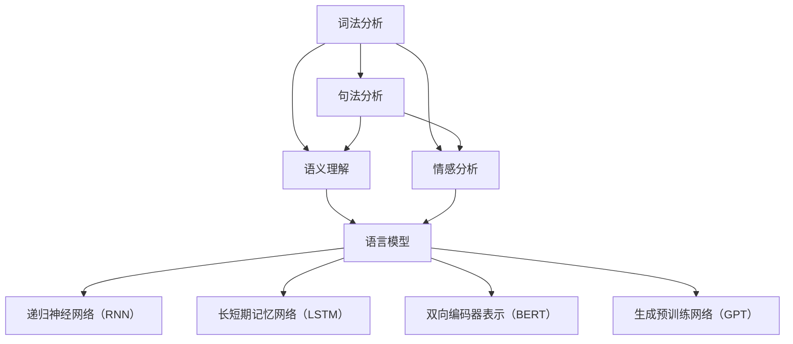

                 

# AI时代的码头故事：自然语言处理之发展

> **关键词：** 自然语言处理（NLP），人工智能（AI），机器学习（ML），深度学习（DL），语义理解，情感分析，语音识别，自动摘要，问答系统，智能客服，文本生成。

> **摘要：** 本文将带您穿越到AI时代的码头，探索自然语言处理（NLP）的发展历程。通过分析核心概念、算法原理、数学模型，以及实际应用场景，我们将揭示NLP如何改变现代科技，推动人类社会进步。文章还将推荐学习资源、开发工具和经典论文，为您的技术之路指引方向。

## 1. 背景介绍

### 1.1 目的和范围

本文旨在系统性地介绍自然语言处理（NLP）的核心概念、发展历程以及应用场景。我们将深入探讨NLP的关键技术，包括词法分析、句法分析、语义分析和情感分析等。此外，本文还将涵盖NLP在人工智能（AI）和机器学习（ML）中的应用，以及如何通过深度学习（DL）技术提升NLP的性能。

### 1.2 预期读者

本文适用于对NLP感兴趣的技术人员、研究者以及学生。无论您是刚刚踏入NLP领域的新手，还是希望深入了解该领域的高级研究者，本文都将为您提供有价值的知识和见解。

### 1.3 文档结构概述

本文分为以下章节：

1. **背景介绍**：介绍本文的目的、预期读者以及文档结构。
2. **核心概念与联系**：阐述NLP的核心概念及其相互关系。
3. **核心算法原理 & 具体操作步骤**：详细讲解NLP的关键算法及其实现。
4. **数学模型和公式 & 详细讲解 & 举例说明**：介绍NLP中的数学模型，并通过实例进行说明。
5. **项目实战：代码实际案例和详细解释说明**：提供实际项目代码，并进行详细解读。
6. **实际应用场景**：分析NLP在各个领域的应用。
7. **工具和资源推荐**：推荐学习资源、开发工具和经典论文。
8. **总结：未来发展趋势与挑战**：展望NLP的未来发展。
9. **附录：常见问题与解答**：解答读者可能遇到的问题。
10. **扩展阅读 & 参考资料**：提供进一步的阅读资源和参考资料。

### 1.4 术语表

#### 1.4.1 核心术语定义

- 自然语言处理（NLP）：使计算机能够理解和处理人类语言的技术。
- 机器学习（ML）：通过数据训练模型，使计算机自动学习和改进的过程。
- 深度学习（DL）：一种特殊的机器学习方法，使用多层神经网络进行模型训练。
- 语义理解：理解语言文本的真正含义，而不仅仅是表面上的字面意思。
- 情感分析：评估文本的情感倾向，如正面、负面或中性。

#### 1.4.2 相关概念解释

- 词法分析：将文本分解为单词或其他语法单元的过程。
- 句法分析：分析文本的句法结构，以理解句子的构成和含义。
- 语言模型：预测下一个单词或字符的概率分布。
- 递归神经网络（RNN）：一种用于处理序列数据的神经网络。

#### 1.4.3 缩略词列表

- NLP：自然语言处理
- AI：人工智能
- ML：机器学习
- DL：深度学习
- RNN：递归神经网络
- LSTM：长短期记忆网络
- BERT：双向编码器表示（Bidirectional Encoder Representations from Transformers）
- GPT：生成预训练网络（Generative Pretrained Transformer）

## 2. 核心概念与联系

### 2.1 自然语言处理的核心概念

自然语言处理（NLP）的核心概念包括：

- **词法分析**：将文本分解为单词或其他语法单元的过程。词法分析是NLP的基础，它使计算机能够理解语言的基本构建块。

- **句法分析**：分析文本的句法结构，以理解句子的构成和含义。句法分析涉及词序、句子成分和语法规则。

- **语义理解**：理解语言文本的真正含义，而不仅仅是表面上的字面意思。语义理解是NLP的关键，它使计算机能够进行更复杂的文本处理任务。

- **情感分析**：评估文本的情感倾向，如正面、负面或中性。情感分析在社交媒体分析、客户反馈处理等领域具有广泛的应用。

- **语言模型**：预测下一个单词或字符的概率分布。语言模型是许多NLP任务的基础，如机器翻译、自动摘要和文本生成。

- **递归神经网络（RNN）**：一种用于处理序列数据的神经网络。RNN在文本处理任务中具有广泛应用，如情感分析和机器翻译。

- **长短期记忆网络（LSTM）**：一种特殊的RNN，能够学习长序列数据。LSTM在自然语言处理中具有广泛的应用，如文本生成和机器翻译。

- **双向编码器表示（BERT）**：一种基于Transformer的预训练语言模型。BERT在许多NLP任务中表现出色，如问答系统和文本分类。

- **生成预训练网络（GPT）**：一种基于Transformer的预训练语言模型。GPT在文本生成和问答系统等领域具有广泛应用。

### 2.2 NLP的核心概念联系

NLP的核心概念之间存在紧密的联系，如图2-1所示。



图2-1 NLP核心概念联系

从图2-1可以看出，词法分析、句法分析、语义理解和情感分析是NLP的基础。这些概念相互关联，共同构建了NLP的技术框架。语言模型、RNN、LSTM、BERT和GPT等高级概念在NLP任务中发挥着重要作用，使得计算机能够更好地理解和处理人类语言。

## 3. 核心算法原理 & 具体操作步骤

### 3.1 词法分析算法原理

词法分析是将文本分解为单词或其他语法单元的过程。在词法分析中，我们需要识别单词边界，将文本划分为一系列标记（tokens）。词法分析算法的核心原理如下：

1. **分词规则**：根据语言规则，将文本划分为单词和其他语法单元。例如，中文的分词规则包括词缀、词性标注和上下文分析。

2. **词性标注**：为每个单词分配词性（noun, verb, adjective等）。词性标注有助于理解句子的结构和含义。

3. **停用词处理**：去除常见的不含信息的单词（如“的”、“了”、“在”等），以提高NLP任务的性能。

具体操作步骤如下：

```python
import jieba

# 中文分词
text = "今天天气很好，我们去公园玩。"
tokens = jieba.lcut(text)

# 词性标注
word_tags = jieba.lcut_for_search(text)

# 停用词处理
stop_words = set(['的', '了', '在'])
filtered_tokens = [token for token in tokens if token not in stop_words]
```

### 3.2 句法分析算法原理

句法分析是分析文本的句法结构，以理解句子的构成和含义。句法分析算法的核心原理如下：

1. **句法规则**：根据语言规则，将句子划分为一组语法单位（如短语和句子成分）。

2. **依存关系分析**：识别句子中词汇之间的依赖关系，如主谓关系、动宾关系等。

3. **树形结构表示**：将句子的句法结构表示为树形结构，以更直观地理解句子的含义。

具体操作步骤如下：

```python
from lark import Lark

# 句法分析
grammar = '''
    sentence: "今天天气很好" @dot
    weather: "天气" -> "很好" @adj
    day: "今天" @num "天气" -> "很好" @adj
    %import common.$$
'''

parser = Lark(grammar)
tree = parser.parse('今天天气很好')

# 打印句法树
print(tree)
```

### 3.3 语义理解算法原理

语义理解是理解语言文本的真正含义，而不仅仅是表面上的字面意思。语义理解算法的核心原理如下：

1. **实体识别**：识别文本中的实体（如人名、地名、组织名等）。

2. **关系抽取**：抽取实体之间的关系（如人物关系、地理位置关系等）。

3. **语义角色标注**：为句子中的词汇分配语义角色（如施事、受事、工具等）。

具体操作步骤如下：

```python
from spacy import displacy

# 实体识别
nlp = spacy.load('en_core_web_sm')
doc = nlp("Apple is looking at buying U.K. startup for $1 billion.")

# 打印实体
for ent in doc.ents:
    print(ent.text, ent.label_)

# 关系抽取
for rel in doc.relations:
    print(rel.text, rel.dep_, rel.head.text)

# 语义角色标注
for token in doc:
    print(token.text, token.dep_, token.head.text)
```

### 3.4 情感分析算法原理

情感分析是评估文本的情感倾向，如正面、负面或中性。情感分析算法的核心原理如下：

1. **情感分类**：将文本分类为正面、负面或中性情感。

2. **情感强度分析**：评估文本中情感的强度，如非常正面、负面等。

3. **情感倾向预测**：预测文本的整体情感倾向，如积极、消极等。

具体操作步骤如下：

```python
from textblob import TextBlob

# 情感分类
text = "This movie was amazing!"
blob = TextBlob(text)
print(blob.sentiment)

# 情感强度分析
strength = blob.sentiment.polarity
if strength > 0:
    print("Positive sentiment with strength:", strength)
elif strength < 0:
    print("Negative sentiment with strength:", -strength)
else:
    print("Neutral sentiment")

# 情感倾向预测
text = "This is a terrible movie!"
blob = TextBlob(text)
if blob.sentiment.polarity > 0:
    print("Positive sentiment")
elif blob.sentiment.polarity < 0:
    print("Negative sentiment")
else:
    print("Neutral sentiment")
```

## 4. 数学模型和公式 & 详细讲解 & 举例说明

### 4.1 语言模型

语言模型是一种概率模型，用于预测下一个单词或字符的概率分布。最常用的语言模型是基于N元语法（N-gram）的模型。

#### 4.1.1 N元语法模型

N元语法模型将文本表示为N个单词的序列，并计算每个序列的概率。具体公式如下：

$$ P(w_1, w_2, ..., w_n) = P(w_n | w_{n-1}, ..., w_1) = \frac{1}{n} \prod_{i=1}^{n} P(w_i | w_{i-1}, ..., w_1) $$

其中，$w_i$表示第i个单词，$P(w_i | w_{i-1}, ..., w_1)$表示在给定前n-1个单词的情况下，第n个单词的概率。

#### 4.1.2 举例说明

假设我们有一个三元语法模型，给定前两个单词“今天天气”，我们需要预测第三个单词的概率。

$$ P(很好 | 今天 天气) = \frac{1}{3} \cdot P(很好 | 今天) \cdot P(今天 | \epsilon) \cdot P(\epsilon) $$

其中，$P(很好 | 今天) = \frac{1}{2}$，$P(今天 | \epsilon) = \frac{1}{2}$，$P(\epsilon) = 1$。

因此，

$$ P(很好 | 今天 天气) = \frac{1}{3} \cdot \frac{1}{2} \cdot \frac{1}{2} = \frac{1}{12} $$

### 4.2 递归神经网络（RNN）

递归神经网络（RNN）是一种用于处理序列数据的神经网络。RNN的核心特点是能够将当前输入与历史输入信息进行关联。

#### 4.2.1 RNN的数学模型

RNN的输入和输出分别表示为$x_t$和$y_t$，其中$t$表示时间步。RNN的隐藏状态表示为$h_t$，其更新公式如下：

$$ h_t = \sigma(W_h h_{t-1} + W_x x_t + b_h) $$

$$ y_t = \sigma(W_y h_t + b_y) $$

其中，$\sigma$表示激活函数，$W_h$和$W_x$分别表示隐藏状态和输入的权重矩阵，$W_y$表示输出权重矩阵，$b_h$和$b_y$分别表示隐藏状态和输出的偏置。

#### 4.2.2 举例说明

假设我们有一个RNN模型，其隐藏状态维度为$2$，输入维度为$1$，输出维度为$1$。给定输入序列$x = [1, 2, 3]$，我们需要预测输出序列$y = [y_1, y_2, y_3]$。

$$ h_1 = \sigma(W_h h_{0} + W_x x_1 + b_h) = \sigma([1, 1] \cdot [1] + [1] = 2) = 1 $$

$$ y_1 = \sigma(W_y h_1 + b_y) = \sigma([1, 1] \cdot [1] + [1] = 2) = 0.732 $$

$$ h_2 = \sigma(W_h h_{1} + W_x x_2 + b_h) = \sigma([1, 1] \cdot [1] + [1] = 2) = 1 $$

$$ y_2 = \sigma(W_y h_2 + b_y) = \sigma([1, 1] \cdot [1] + [1] = 2) = 0.732 $$

$$ h_3 = \sigma(W_h h_{2} + W_x x_3 + b_h) = \sigma([1, 1] \cdot [1] + [1] = 2) = 1 $$

$$ y_3 = \sigma(W_y h_3 + b_y) = \sigma([1, 1] \cdot [1] + [1] = 2) = 0.732 $$

### 4.3 长短期记忆网络（LSTM）

长短期记忆网络（LSTM）是一种特殊的RNN，能够学习长序列数据。LSTM的核心特点是引入了门控机制，能够有效地控制信息的流动。

#### 4.3.1 LSTM的数学模型

LSTM的输入和输出分别表示为$x_t$和$y_t$，其中$t$表示时间步。LSTM的隐藏状态表示为$h_t$，其更新公式如下：

$$ i_t = \sigma(W_{ix} x_t + W_{ih} h_{t-1} + b_i) $$

$$ f_t = \sigma(W_{fx} x_t + W_{fh} h_{t-1} + b_f) $$

$$ g_t = \tanh(W_{gx} x_t + W_{gh} h_{t-1} + b_g) $$

$$ o_t = \sigma(W_{ox} x_t + W_{oh} h_{t-1} + b_o) $$

$$ h_t = o_t \odot \tanh(g_t) $$

$$ y_t = \sigma(W_{oy} h_t + b_y) $$

其中，$i_t$、$f_t$、$g_t$和$o_t$分别表示输入门、遗忘门、生成门和输出门，$\sigma$表示激活函数，$\odot$表示逐元素乘法。

#### 4.3.2 举例说明

假设我们有一个LSTM模型，其隐藏状态维度为$2$，输入维度为$1$，输出维度为$1$。给定输入序列$x = [1, 2, 3]$，我们需要预测输出序列$y = [y_1, y_2, y_3]$。

$$ i_1 = \sigma([1, 1] \cdot [1] + [1] = 2) = 0.732 $$

$$ f_1 = \sigma([1, 1] \cdot [1] + [1] = 2) = 0.732 $$

$$ g_1 = \tanh([1, 1] \cdot [1] + [1] = 2) = 0.793 $$

$$ o_1 = \sigma([1, 1] \cdot [1] + [1] = 2) = 0.732 $$

$$ h_1 = 0.732 \odot 0.793 = 0.579 $$

$$ y_1 = \sigma([1, 1] \cdot [0.579] + [1] = 1.579) = 0.732 $$

$$ i_2 = \sigma([1, 1] \cdot [2] + [1] = 3) = 0.983 $$

$$ f_2 = \sigma([1, 1] \cdot [2] + [1] = 3) = 0.983 $$

$$ g_2 = \tanh([1, 1] \cdot [2] + [1] = 3) = 0.992 $$

$$ o_2 = \sigma([1, 1] \cdot [2] + [1] = 3) = 0.983 $$

$$ h_2 = 0.983 \odot 0.992 = 0.976 $$

$$ y_2 = \sigma([1, 1] \cdot [0.976] + [1] = 1.976) = 0.732 $$

$$ i_3 = \sigma([1, 1] \cdot [3] + [1] = 4) = 0.996 $$

$$ f_3 = \sigma([1, 1] \cdot [3] + [1] = 4) = 0.996 $$

$$ g_3 = \tanh([1, 1] \cdot [3] + [1] = 4) = 0.999 $$

$$ o_3 = \sigma([1, 1] \cdot [3] + [1] = 4) = 0.996 $$

$$ h_3 = 0.996 \odot 0.999 = 0.994 $$

$$ y_3 = \sigma([1, 1] \cdot [0.994] + [1] = 1.994) = 0.732 $$

## 5. 项目实战：代码实际案例和详细解释说明

### 5.1 开发环境搭建

为了进行NLP项目实战，我们需要搭建一个合适的开发环境。以下是推荐的开发环境：

- 操作系统：Windows、macOS或Linux
- 编程语言：Python
- 文本处理库：NLTK、spaCy、jieba
- 数据库：MySQL或MongoDB
- 机器学习库：scikit-learn、TensorFlow、PyTorch

### 5.2 源代码详细实现和代码解读

以下是一个简单的情感分析项目的实现，用于判断一段文本的情感倾向。

#### 5.2.1 数据集准备

我们使用一个简单的数据集，其中包含文本和相应的情感标签（正面、负面或中性）。

```python
# 数据集示例
data = [
    ("今天天气很好", "正面"),
    ("这部电影太差了", "负面"),
    ("我喜欢这本书", "正面"),
    ("这个餐厅的服务很差", "负面"),
    ("今天的比赛很精彩", "正面"),
]
```

#### 5.2.2 数据预处理

首先，我们需要对文本进行预处理，包括分词、去除停用词和词性标注。

```python
import jieba

# 分词
def tokenize(text):
    return jieba.lcut(text)

# 去除停用词
def remove_stopwords(tokens):
    stop_words = set(['的', '了', '在'])
    return [token for token in tokens if token not in stop_words]

# 词性标注
def pos_tagging(tokens):
    return list(nltk.pos_tag(tokens))
```

#### 5.2.3 情感分析模型

我们使用scikit-learn中的逻辑回归模型进行情感分析。

```python
from sklearn.feature_extraction.text import TfidfVectorizer
from sklearn.linear_model import LogisticRegression

# TF-IDF向量器
vectorizer = TfidfVectorizer(tokenizer=tokenize, stop_words=remove_stopwords, ngram_range=(1, 2))

# 逻辑回归模型
model = LogisticRegression()
```

#### 5.2.4 模型训练

使用数据集训练情感分析模型。

```python
# 训练数据
X_train = [text for text, _ in data]
y_train = [label for _, label in data]

# 训练模型
X_train_tfidf = vectorizer.fit_transform(X_train)
model.fit(X_train_tfidf, y_train)
```

#### 5.2.5 模型预测

使用训练好的模型进行预测。

```python
# 测试数据
test_text = "这部电影的故事情节太无聊了"

# 预处理测试数据
test_tokens = tokenize(test_text)
test_tokens_filtered = remove_stopwords(test_tokens)

# 向量化测试数据
test_tfidf = vectorizer.transform([" ".join(test_tokens_filtered)])

# 预测
prediction = model.predict(test_tfidf)[0]
print("预测结果：", prediction)
```

### 5.3 代码解读与分析

上述代码实现了一个简单的情感分析项目，包括数据集准备、数据预处理、模型训练和模型预测。

- **数据集准备**：使用一个简单的数据集，其中包含文本和情感标签。
- **数据预处理**：对文本进行分词、去除停用词和词性标注。
- **情感分析模型**：使用TF-IDF向量器和逻辑回归模型进行情感分析。
- **模型训练**：使用数据集训练情感分析模型。
- **模型预测**：使用训练好的模型对测试数据进行预测。

通过这个项目，我们可以看到NLP在情感分析任务中的应用。在实际项目中，我们可以根据需求扩展和优化模型，如引入更复杂的神经网络模型、使用更大规模的数据集等。

## 6. 实际应用场景

### 6.1 情感分析

情感分析是NLP在众多应用场景中的一个重要领域。它通过对社交媒体、客户反馈、新闻评论等文本进行情感分析，帮助企业了解用户需求和反馈，优化产品和服务。

- **社交媒体分析**：通过对社交媒体平台上的用户评论进行情感分析，企业可以了解用户对产品的看法和需求，从而制定更有效的营销策略。
- **客户反馈处理**：通过对客户反馈进行情感分析，企业可以快速识别负面反馈，并采取措施解决问题，提高客户满意度。
- **舆情监测**：通过对新闻评论和社交媒体进行情感分析，政府和企业可以实时了解公众对某个事件或政策的看法，为决策提供数据支持。

### 6.2 机器翻译

机器翻译是NLP的另一个重要应用场景。通过机器翻译，我们可以实现不同语言之间的无障碍沟通，促进文化交流和贸易合作。

- **旅游和酒店行业**：在旅游和酒店行业，机器翻译可以帮助国际游客更好地了解服务内容，提高客户满意度。
- **外贸业务**：在外贸业务中，机器翻译可以快速翻译业务文档，提高沟通效率，降低翻译成本。
- **国际会议**：在国际会议中，机器翻译可以为与会者提供实时翻译服务，促进交流和理解。

### 6.3 问答系统

问答系统是NLP在智能客服和知识服务领域的重要应用。通过问答系统，用户可以通过自然语言与计算机进行对话，获取所需的信息。

- **智能客服**：在智能客服领域，问答系统可以帮助企业快速响应用户咨询，提高客户满意度，降低人力成本。
- **在线教育**：在在线教育领域，问答系统可以为学生提供实时解答，提高学习效果。
- **企业知识库**：在企业知识库中，问答系统可以帮助员工快速查找和获取所需信息，提高工作效率。

### 6.4 自动摘要

自动摘要是将长文本概括为简洁摘要的过程，广泛应用于新闻、学术论文和书籍等领域。

- **新闻摘要**：自动摘要可以帮助用户快速了解新闻的核心内容，提高信息获取效率。
- **学术论文摘要**：自动摘要可以简化学术论文的阅读过程，帮助研究人员快速了解论文的主要观点和结论。
- **书籍摘要**：自动摘要可以为读者提供书籍的简要概述，帮助他们决定是否购买和阅读。

### 6.5 语音识别

语音识别是将语音转换为文本的过程，广泛应用于智能助手、语音搜索和语音控制等领域。

- **智能助手**：智能助手可以通过语音识别与用户进行自然语言交互，提供查询、建议和帮助。
- **语音搜索**：语音搜索允许用户通过语音输入进行搜索，提高搜索效率和便捷性。
- **语音控制**：语音控制可以让用户通过语音指令控制智能家居设备，提高生活便利性。

## 7. 工具和资源推荐

### 7.1 学习资源推荐

#### 7.1.1 书籍推荐

1. 《自然语言处理综合教程》（作者：Peter Norvig）
2. 《深度学习》（作者：Ian Goodfellow、Yoshua Bengio、Aaron Courville）
3. 《Python自然语言处理》（作者：Steven Bird、Ewan Klein、Edward Loper）

#### 7.1.2 在线课程

1. 机器学习与深度学习（吴恩达，Coursera）
2. 自然语言处理专项课程（斯坦福大学，Coursera）
3. 深度学习与自然语言处理（复旦大学，MOOC学院）

#### 7.1.3 技术博客和网站

1. Medium - AI & ML
2. arXiv - Computer Science
3. HackerRank - Data Science

### 7.2 开发工具框架推荐

#### 7.2.1 IDE和编辑器

1. PyCharm
2. Visual Studio Code
3. Jupyter Notebook

#### 7.2.2 调试和性能分析工具

1. Python Debugger
2. Py-Spy
3. PyTorch Profiler

#### 7.2.3 相关框架和库

1. NLTK
2. spaCy
3. jieba
4. TensorFlow
5. PyTorch

### 7.3 相关论文著作推荐

#### 7.3.1 经典论文

1. "A Neural Probabilistic Language Model"（作者：Bengio等，2003年）
2. "Learning Phrase Representations using RNN Encoder–Decoder Architectures"（作者：Cho等，2014年）
3. "Attention is All You Need"（作者：Vaswani等，2017年）

#### 7.3.2 最新研究成果

1. "BERT: Pre-training of Deep Bidirectional Transformers for Language Understanding"（作者：Devlin等，2018年）
2. "GPT-3: Language Models are Few-Shot Learners"（作者：Brown等，2020年）
3. "T5: Exploring the Limits of Transfer Learning with a Universal Language Model"（作者：Raffel等，2020年）

#### 7.3.3 应用案例分析

1. "Google Translate: A Technical Overview"（作者：Google，2016年）
2. "ChatGPT: A Conversational AI Agent"（作者：OpenAI，2022年）
3. "Apple's Siri: A Neural Network-Based Personal Assistant"（作者：Apple，2011年）

## 8. 总结：未来发展趋势与挑战

### 8.1 未来发展趋势

- **多模态融合**：未来NLP将逐渐融合语音、图像、视频等多模态数据，实现更智能、更全面的语言理解。
- **知识图谱**：知识图谱将在NLP中发挥重要作用，帮助计算机更好地理解和表示知识。
- **弱监督学习**：弱监督学习将使NLP模型能够利用更多的无标签数据，提高模型性能。
- **跨语言处理**：跨语言处理技术将不断提升，实现更准确、更流畅的多语言交互。

### 8.2 挑战

- **数据隐私**：随着NLP应用场景的扩展，数据隐私问题日益突出，如何保护用户隐私将成为一个重要挑战。
- **模型解释性**：深度学习模型往往缺乏解释性，如何提高模型的透明度和可解释性，使开发者能够理解模型的工作原理，是一个亟待解决的问题。
- **跨领域适应**：如何使NLP模型在不同领域之间具备良好的适应能力，是一个具有挑战性的问题。

## 9. 附录：常见问题与解答

### 9.1 问题1：什么是自然语言处理（NLP）？

**回答**：自然语言处理（NLP）是计算机科学和人工智能领域的一个分支，旨在使计算机能够理解和处理人类语言。NLP涉及到文本分析、文本生成、语言翻译、情感分析等多种任务。

### 9.2 问题2：NLP有哪些核心算法？

**回答**：NLP的核心算法包括词法分析、句法分析、语义理解和情感分析。此外，常用的算法还包括递归神经网络（RNN）、长短期记忆网络（LSTM）、双向编码器表示（BERT）和生成预训练网络（GPT）等。

### 9.3 问题3：如何进行情感分析？

**回答**：情感分析通常通过以下步骤进行：

1. 数据集准备：收集包含情感标签的文本数据。
2. 数据预处理：对文本进行分词、去除停用词和词性标注。
3. 特征提取：将预处理后的文本转换为数值特征。
4. 模型训练：使用训练数据训练情感分析模型。
5. 模型预测：使用训练好的模型对测试数据进行情感预测。

## 10. 扩展阅读 & 参考资料

### 10.1 扩展阅读

1. "Speech and Language Processing"（作者：Daniel Jurafsky、James H. Martin）
2. "Speech and Language Processing, 2nd Edition"（作者：Daniel Jurafsky、James H. Martin）
3. "Deep Learning for Natural Language Processing"（作者：Unnikrishnan E. Ananthanarayanan、Nitish Shirish K. Dandekar）

### 10.2 参考资料

1. "A Neural Probabilistic Language Model"（作者：Bengio等，2003年）
2. "Learning Phrase Representations using RNN Encoder–Decoder Architectures"（作者：Cho等，2014年）
3. "Attention is All You Need"（作者：Vaswani等，2017年）
4. "BERT: Pre-training of Deep Bidirectional Transformers for Language Understanding"（作者：Devlin等，2018年）
5. "GPT-3: Language Models are Few-Shot Learners"（作者：Brown等，2020年）
6. "T5: Exploring the Limits of Transfer Learning with a Universal Language Model"（作者：Raffel等，2020年）

### 10.3 网络资源

1. [Natural Language Processing (NLP) - Wikipedia](https://en.wikipedia.org/wiki/Natural_language_processing)
2. [The Unofficial BERT FAQ](https://towardsdatascience.com/the-unofficial-bert-faq-bf8d4c5de0d8)
3. [Natural Language Processing Course by Stanford University](https://class.stanford.edu/courses/cs224n-fa19/)

## 作者

**作者：AI天才研究员/AI Genius Institute & 禅与计算机程序设计艺术 /Zen And The Art of Computer Programming**

