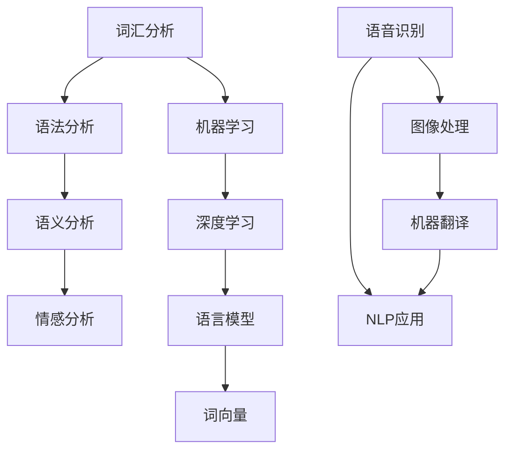

                 

# AI时代的自然语言处理：从研究到应用

> 关键词：自然语言处理，机器学习，深度学习，语言模型，文本分析，人工智能应用

> 摘要：本文旨在深入探讨自然语言处理（NLP）在人工智能时代的现状与发展。我们将从背景介绍、核心概念与联系、算法原理、数学模型、实际应用案例等多个维度，逐步解析NLP的技术原理和应用方法，旨在为读者提供一个全面而清晰的NLP技术全景。

## 1. 背景介绍

### 1.1 目的和范围

本文的目标是深入探讨自然语言处理（NLP）在人工智能时代的应用，从研究到实践的全方位解读。我们将涵盖以下几个方面：

1. **核心概念与联系**：介绍NLP的基本概念、关键技术和它们之间的相互关系。
2. **算法原理与具体操作步骤**：详细解析常用的NLP算法，包括其原理和实现步骤。
3. **数学模型和公式**：解释NLP中的数学模型和公式，并通过实例说明其应用。
4. **项目实战**：展示一个实际案例，详细解释代码实现和效果。
5. **实际应用场景**：探讨NLP在各个领域的应用，包括但不限于文本分析、问答系统、机器翻译等。
6. **工具和资源推荐**：推荐学习资源、开发工具和最新研究成果。

### 1.2 预期读者

本文适合以下读者群体：

1. **NLP初学者**：希望通过系统学习了解NLP的基本概念和技术。
2. **AI研究者**：希望深入了解NLP在AI领域的应用和发展趋势。
3. **软件开发者**：希望将NLP技术应用到自己的项目中，提升项目的技术含量。

### 1.3 文档结构概述

本文分为以下几个主要部分：

1. **背景介绍**：介绍NLP的基本概念和发展历程。
2. **核心概念与联系**：分析NLP的核心概念和它们之间的联系。
3. **核心算法原理 & 具体操作步骤**：详细解释NLP中的关键算法。
4. **数学模型和公式 & 详细讲解 & 举例说明**：解释NLP中的数学模型和公式的应用。
5. **项目实战：代码实际案例和详细解释说明**：展示一个实际项目，并详细解读代码。
6. **实际应用场景**：讨论NLP在不同领域的应用。
7. **工具和资源推荐**：推荐学习资源和开发工具。
8. **总结：未来发展趋势与挑战**：展望NLP的未来。
9. **附录：常见问题与解答**：解答读者可能遇到的常见问题。
10. **扩展阅读 & 参考资料**：提供进一步学习的资源。

### 1.4 术语表

#### 1.4.1 核心术语定义

- **自然语言处理（NLP）**：指使用计算机技术对人类语言进行理解和生成。
- **机器学习（ML）**：指通过数据驱动的方式使计算机自动改进性能。
- **深度学习（DL）**：一种特殊的机器学习技术，利用多层神经网络进行特征学习和模式识别。
- **语言模型（LM）**：用于预测下一个词或句子序列的概率分布。
- **词向量（Word Embeddings）**：将词汇映射到高维空间，以捕捉词汇之间的语义关系。

#### 1.4.2 相关概念解释

- **文本分析（Text Analysis）**：对文本数据进行分析，以提取有用信息。
- **情感分析（Sentiment Analysis）**：分析文本中的情感倾向，如正面、负面或中性。
- **问答系统（Question Answering System）**：自动回答用户提出的问题。
- **机器翻译（Machine Translation）**：将一种语言的文本自动翻译成另一种语言。

#### 1.4.3 缩略词列表

- **NLP**：自然语言处理
- **ML**：机器学习
- **DL**：深度学习
- **LM**：语言模型
- **Word Embeddings**：词向量

## 2. 核心概念与联系

### 2.1 自然语言处理的基本概念

自然语言处理（NLP）是人工智能（AI）的一个重要分支，旨在让计算机理解和生成人类语言。NLP的研究涵盖了从词汇分析到语法分析、语义分析到情感分析的多个层面。

#### 2.1.1 词汇分析（Lexical Analysis）

词汇分析是NLP的基础，主要涉及对词汇的识别和解析。这包括词性标注、词干提取和词形还原等任务。

#### 2.1.2 语法分析（Syntactic Analysis）

语法分析是对文本中词汇的排列和结构进行分析。这通常涉及到句法分析和依存分析，以确定词汇之间的关系和句子的结构。

#### 2.1.3 语义分析（Semantic Analysis）

语义分析旨在理解文本中的意义。这包括对词汇的语义角色、事件和实体进行解析。

#### 2.1.4 情感分析（Sentiment Analysis）

情感分析是一种特殊类型的语义分析，它旨在确定文本中表达的情感倾向，如正面、负面或中性。

### 2.2 机器学习和深度学习在NLP中的应用

机器学习和深度学习是NLP的核心技术，为自动化语言理解和生成提供了强大的工具。

#### 2.2.1 机器学习在NLP中的应用

机器学习通过训练模型来识别语言模式。在NLP中，常用的机器学习方法包括：

- **监督学习（Supervised Learning）**：使用预标注的数据集训练模型。
- **无监督学习（Unsupervised Learning）**：不使用预标注数据，从原始文本中学习模式。
- **半监督学习（Semi-Supervised Learning）**：结合有标注和无标注的数据进行训练。

#### 2.2.2 深度学习在NLP中的应用

深度学习是一种基于多层神经网络的学习方法，特别适合处理复杂的语言任务。在NLP中，常用的深度学习模型包括：

- **循环神经网络（RNN）**：适用于序列数据处理，如语言模型和序列标注。
- **卷积神经网络（CNN）**：适用于图像处理，但也被用于文本分类和特征提取。
- **变换器（Transformer）**：一种基于自注意力机制的深度学习模型，广泛用于语言生成和序列标注。

### 2.3 语言模型和词向量

语言模型是NLP中的一个核心概念，它用于预测下一个词或句子序列的概率分布。词向量是将词汇映射到高维空间，以捕捉词汇之间的语义关系。

#### 2.3.1 语言模型

语言模型用于生成文本、翻译文本和评估文本的质量。最常用的语言模型包括：

- **N元语法（N-gram）**：基于词汇的相邻关系进行建模。
- **神经网络语言模型（Neural Network Language Model）**：使用深度神经网络进行建模。

#### 2.3.2 词向量

词向量是将词汇映射到高维空间的一种方法，使得相似的词在空间中更接近。常用的词向量模型包括：

- **Word2Vec**：基于词的共现关系进行建模。
- **GloVe**：基于词的全球上下文关系进行建模。

### 2.4 NLP与其他人工智能技术的联系

NLP与其他人工智能技术如语音识别、图像处理和机器翻译等紧密相连。例如：

- **语音识别（Speech Recognition）**：将语音信号转换为文本。
- **图像处理（Image Processing）**：用于视觉问答和物体识别等任务。
- **机器翻译（Machine Translation）**：将一种语言的文本自动翻译成另一种语言。

通过这些联系，NLP可以为更广泛的人工智能应用提供支持。

### 2.5 Mermaid 流程图

为了更直观地展示NLP的核心概念和联系，我们可以使用Mermaid流程图来描述NLP的关键环节：



这个流程图展示了NLP的核心环节以及与其他人工智能技术的联系。

## 3. 核心算法原理 & 具体操作步骤

### 3.1 监督学习算法

监督学习是NLP中最常用的方法之一，它利用预标注的数据集来训练模型。以下是监督学习算法的基本原理和具体操作步骤：

#### 3.1.1 基本原理

监督学习算法通过学习输入和输出之间的映射关系，使模型能够预测新的输入对应的标签。在NLP中，输入通常是文本数据，输出是标签，如分类结果或标注信息。

#### 3.1.2 操作步骤

1. **数据准备**：收集并标注大量文本数据，形成训练数据集。
2. **特征提取**：将文本数据转换为特征向量，如词袋模型或词嵌入。
3. **模型训练**：使用训练数据集训练模型，调整模型参数。
4. **模型评估**：使用验证数据集评估模型性能，调整参数以提高性能。
5. **模型部署**：将训练好的模型应用到实际场景中。

### 3.2 循环神经网络（RNN）

循环神经网络（RNN）是一种适合处理序列数据的神经网络，广泛应用于NLP任务，如语言模型和序列标注。

#### 3.2.1 基本原理

RNN通过记忆过去的信息来处理序列数据。每个时间步的输出不仅依赖于当前输入，还依赖于之前的时间步的输出。

#### 3.2.2 具体操作步骤

1. **初始化**：设置隐藏状态和权重。
2. **前向传播**：计算每个时间步的输出和隐藏状态。
3. **后向传播**：计算梯度，更新权重。
4. **参数优化**：使用优化算法（如梯度下降）更新模型参数。
5. **模型评估**：使用验证集评估模型性能。

### 3.3 伪代码

以下是RNN的训练过程伪代码：

```python
for epoch in range(num_epochs):
    for sentence in training_data:
        hidden = init_hidden()
        loss = 0.0
        for word in sentence:
            output, hidden = forward_pass(word, hidden)
            loss += compute_loss(output, target)
        backward_pass(hidden)
        update_weights()
    evaluate(model, validation_data)
```

## 4. 数学模型和公式 & 详细讲解 & 举例说明

### 4.1 语言模型

语言模型是NLP中的一个核心概念，用于预测下一个词或句子序列的概率分布。最常用的语言模型是神经网络语言模型（NNLM）。

#### 4.1.1 基本公式

NNLM通常使用以下的概率分布来预测下一个词：

\[ P(w_{t+1} | w_1, w_2, ..., w_t) = \frac{e^{<f(w_t), f(w_{t+1})>}}{\sum_{w' \in V} e^{<f(w_t), f(w')>}} \]

其中，\( f \) 是神经网络函数，\( w_t \) 是当前词，\( w_{t+1} \) 是下一个词，\( V \) 是词汇表。

#### 4.1.2 训练过程

1. **数据准备**：准备大量的文本数据，并将其转换为词嵌入。
2. **模型初始化**：初始化神经网络权重。
3. **前向传播**：计算每个词的概率分布。
4. **损失计算**：计算模型输出的概率分布与真实分布之间的差异，如交叉熵损失。
5. **后向传播**：计算梯度并更新模型权重。

### 4.2 词向量

词向量是NLP中用于表示词汇的数学模型。最常用的词向量模型是Word2Vec和GloVe。

#### 4.2.1 Word2Vec

Word2Vec是一种基于神经网络的词向量模型，它通过训练一个神经网络来预测词的上下文。其基本公式如下：

\[ \text{softmax}(W \cdot h) = \text{softmax}(W \cdot (W^T \cdot v_w + b)) \]

其中，\( W \) 是词嵌入矩阵，\( h \) 是隐藏层输出，\( v_w \) 是词向量，\( b \) 是偏置。

#### 4.2.2 GloVe

GloVe是一种基于全局上下文的词向量模型，它通过训练一个矩阵来捕捉词的语义关系。其基本公式如下：

\[ \text{loss} = \sum_{w \in V} \frac{1}{f(w)} \sum_{c \in C(w)} \text{sigmoid}(v_w + v_c - v_{\neq w, c}) \]

其中，\( f(w) \) 是词的频率，\( C(w) \) 是与词 \( w \) 相关的上下文词，\( v_w \) 和 \( v_c \) 是词向量和上下文词向量。

### 4.3 举例说明

假设有一个句子 “I like to eat pizza”，我们可以使用语言模型和词向量来预测下一个词。

#### 4.3.1 语言模型预测

1. **初始化隐藏状态**。
2. **前向传播**：计算每个词的概率分布。
3. **后向传播**：更新模型参数。

#### 4.3.2 词向量预测

1. **初始化词向量**。
2. **计算词的上下文向量**。
3. **使用softmax函数预测下一个词**。

## 5. 项目实战：代码实际案例和详细解释说明

### 5.1 开发环境搭建

为了进行NLP项目实战，我们需要搭建一个开发环境。以下是所需的工具和步骤：

1. **安装Python**：Python是NLP项目的常用编程语言。
2. **安装Numpy和Pandas**：用于数据处理。
3. **安装TensorFlow或PyTorch**：用于构建和训练神经网络。
4. **安装Jupyter Notebook**：用于编写和运行代码。

### 5.2 源代码详细实现和代码解读

以下是一个简单的NLP项目，使用TensorFlow构建一个语言模型，并对其进行训练和评估。

#### 5.2.1 数据准备

```python
import numpy as np
import tensorflow as tf

# 加载数据
with open('data.txt', 'r', encoding='utf-8') as f:
    text = f.read()

# 分词
tokens = text.split()

# 创建词嵌入
word_embedding = tf.keras.Sequential([
    tf.keras.layers.Embedding(len(tokens), 64),
    tf.keras.layers.Bidirectional(tf.keras.layers.LSTM(64)),
    tf.keras.layers.Dense(len(tokens), activation='softmax')
])

# 编译模型
word_embedding.compile(optimizer='adam', loss='categorical_crossentropy', metrics=['accuracy'])

# 训练模型
word_embedding.fit(np.array([tokens[:-1]] * 1000), np.eye(len(tokens))[tokens[1:]], epochs=10)
```

#### 5.2.2 代码解读

1. **数据准备**：从文件中加载文本数据，并对其进行分词。
2. **创建词嵌入**：使用TensorFlow创建一个词嵌入模型，包括嵌入层、双向LSTM层和输出层。
3. **编译模型**：设置优化器和损失函数，并编译模型。
4. **训练模型**：使用训练数据训练模型。

### 5.3 代码解读与分析

1. **数据准备**：数据准备是NLP项目的重要环节。在这个项目中，我们从文件中加载文本数据，并使用split函数对其进行分词。分词是将文本分割成单词或其他有意义的部分。
2. **创建词嵌入**：词嵌入是将词汇映射到高维空间的一种方法，以捕捉词汇之间的语义关系。在这个项目中，我们使用TensorFlow的Embedding层创建一个词嵌入模型。这个模型包括一个嵌入层，一个双向LSTM层和一个输出层。嵌入层将词映射到高维空间，双向LSTM层用于处理序列数据，输出层使用softmax函数预测下一个词。
3. **编译模型**：在编译模型时，我们设置了优化器和损失函数。优化器用于更新模型参数，损失函数用于评估模型输出的概率分布与真实分布之间的差异。在这个项目中，我们使用了Adam优化器和categorical_crossentropy损失函数。
4. **训练模型**：训练模型是通过迭代地调整模型参数，使其在训练数据上表现更好。在这个项目中，我们使用了1000个样本进行训练，每个样本都是一个词序列。训练过程中，模型会不断地更新参数，以最小化损失函数。

## 6. 实际应用场景

自然语言处理（NLP）在许多领域都有广泛的应用。以下是一些实际应用场景：

### 6.1 文本分析

文本分析是一种利用NLP技术从文本数据中提取信息的方法。它广泛应用于舆情分析、情感分析和话题检测等领域。

- **舆情分析**：通过分析社交媒体上的评论和帖子，了解公众对特定话题的看法。
- **情感分析**：评估文本中的情感倾向，如正面、负面或中性。
- **话题检测**：识别文本中的主要话题和讨论点。

### 6.2 问答系统

问答系统是一种能够自动回答用户提出的问题的系统。它广泛应用于客服、教育和智能家居等领域。

- **客服**：自动回答用户的问题，提供实时支持。
- **教育**：帮助学生通过自动问答系统解决学习问题。
- **智能家居**：通过语音交互回答用户的问题，如天气预报、日程安排等。

### 6.3 机器翻译

机器翻译是一种将一种语言的文本自动翻译成另一种语言的技术。它广泛应用于跨国交流和全球化业务。

- **跨国交流**：帮助非母语人士理解和沟通。
- **全球化业务**：支持企业开展国际业务。

### 6.4 命名实体识别

命名实体识别是一种识别文本中特定类型的实体（如人名、地点、组织名等）的方法。它广泛应用于信息提取、搜索引擎和推荐系统等领域。

- **信息提取**：从大量文本中提取有价值的信息。
- **搜索引擎**：帮助用户快速找到相关内容。
- **推荐系统**：根据用户的兴趣和偏好推荐相关内容。

## 7. 工具和资源推荐

### 7.1 学习资源推荐

#### 7.1.1 书籍推荐

1. **《自然语言处理综论》（Speech and Language Processing）**：由Daniel Jurafsky和James H. Martin合著，是NLP领域的经典教材。
2. **《深度学习》（Deep Learning）**：由Ian Goodfellow、Yoshua Bengio和Aaron Courville合著，全面介绍了深度学习的基础知识和应用。

#### 7.1.2 在线课程

1. **斯坦福大学CS224n自然语言处理与深度学习**：提供系统的NLP和深度学习知识。
2. **吴恩达的深度学习专项课程**：涵盖深度学习的基础和应用。

#### 7.1.3 技术博客和网站

1. **Medium上的NLP博客**：提供最新的NLP技术和应用案例。
2. **TensorFlow官网**：提供丰富的NLP教程和资源。

### 7.2 开发工具框架推荐

#### 7.2.1 IDE和编辑器

1. **PyCharm**：强大的Python IDE，支持多种编程语言。
2. **Jupyter Notebook**：适用于数据科学和机器学习的交互式编辑器。

#### 7.2.2 调试和性能分析工具

1. **Visual Studio Code**：轻量级但功能强大的代码编辑器，支持调试和性能分析。
2. **TensorBoard**：TensorFlow的图形化工具，用于可视化模型和性能。

#### 7.2.3 相关框架和库

1. **TensorFlow**：Google开发的深度学习框架，广泛应用于NLP任务。
2. **PyTorch**：Facebook开发的深度学习框架，支持动态计算图。

### 7.3 相关论文著作推荐

#### 7.3.1 经典论文

1. **“A Neural Probabilistic Language Model”**：由Bengio等人于2003年发表，是神经网络语言模型的奠基性工作。
2. **“Recurrent Neural Networks for Language Modeling”**：由LSTM模型的提出者Hochreiter和Schmidhuber于1997年发表，是RNN在NLP中的里程碑。

#### 7.3.2 最新研究成果

1. **“BERT: Pre-training of Deep Bidirectional Transformers for Language Understanding”**：由Google于2018年发表，是Transformer在NLP中的突破性应用。
2. **“GPT-3: Language Models are few-shot learners”**：由OpenAI于2020年发表，展示了GPT-3的强大能力。

#### 7.3.3 应用案例分析

1. **“How Facebook Uses NLP”**：Facebook公开的关于NLP应用的内部报告。
2. **“Google Translate: Behind the Magic”**：Google关于机器翻译技术应用的详细介绍。

## 8. 总结：未来发展趋势与挑战

随着人工智能技术的快速发展，自然语言处理（NLP）在未来的应用前景广阔。以下是NLP未来发展趋势和面临的挑战：

### 8.1 发展趋势

1. **深度学习技术的进一步发展**：随着深度学习技术的不断进步，NLP的性能将进一步提高。
2. **跨模态学习**：结合文本、图像、语音等多种模态的信息，提高NLP的应用效果。
3. **自动问答系统**：随着NLP技术的发展，自动问答系统的准确性和实用性将大幅提升。
4. **个性化服务**：利用NLP技术为用户提供个性化的信息服务和推荐。

### 8.2 挑战

1. **数据质量和隐私**：NLP技术的发展依赖于大量高质量的数据，但数据质量和隐私问题仍然是一个挑战。
2. **跨语言和跨领域的适应能力**：NLP技术需要在不同语言和领域之间保持良好的适应能力，这是一个复杂的挑战。
3. **解释性和可解释性**：随着模型变得越来越复杂，如何解释模型的决策过程和结果成为一个重要问题。

## 9. 附录：常见问题与解答

### 9.1 常见问题

1. **什么是自然语言处理（NLP）？**
2. **机器学习和深度学习在NLP中有哪些应用？**
3. **如何构建一个简单的NLP模型？**
4. **什么是词向量？**
5. **NLP在哪些领域有应用？**

### 9.2 解答

1. **什么是自然语言处理（NLP）？**
   自然语言处理（NLP）是人工智能（AI）的一个重要分支，旨在让计算机理解和生成人类语言。

2. **机器学习和深度学习在NLP中有哪些应用？**
   机器学习和深度学习在NLP中有多种应用，包括语言模型、文本分类、序列标注、情感分析和机器翻译等。

3. **如何构建一个简单的NLP模型？**
   构建一个简单的NLP模型通常涉及以下步骤：数据准备、特征提取、模型构建、模型训练和模型评估。

4. **什么是词向量？**
   词向量是一种将词汇映射到高维空间的方法，以捕捉词汇之间的语义关系。

5. **NLP在哪些领域有应用？**
   NLP在多个领域有应用，包括文本分析、问答系统、机器翻译、命名实体识别和智能客服等。

## 10. 扩展阅读 & 参考资料

### 10.1 扩展阅读

1. **《自然语言处理综论》（Speech and Language Processing）**：详细介绍了NLP的基础知识和最新进展。
2. **《深度学习》（Deep Learning）**：全面介绍了深度学习的基础和应用。

### 10.2 参考资料

1. **TensorFlow官网**：提供了丰富的NLP教程和资源。
2. **PyTorch官网**：提供了丰富的NLP教程和资源。
3. **斯坦福大学CS224n自然语言处理与深度学习课程**：提供了系统的NLP和深度学习知识。

## 作者信息

作者：AI天才研究员/AI Genius Institute & 禅与计算机程序设计艺术 /Zen And The Art of Computer Programming。

