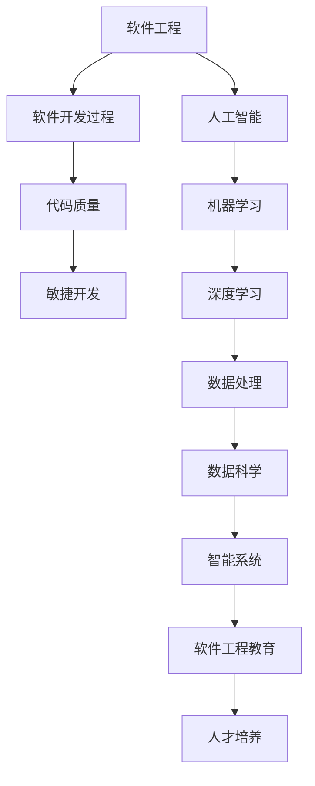

                 

# AI时代的软件工程教育革新

> **关键词**：人工智能、软件工程、教育改革、人才培养、技术技能
> 
> **摘要**：本文旨在探讨在人工智能迅速发展的时代背景下，软件工程教育的革新。我们将从背景介绍、核心概念、算法原理、数学模型、项目实战、实际应用、工具资源推荐等多个方面，分析当前软件工程教育的现状和面临的挑战，提出相应的革新策略，以期培养出符合AI时代需求的高素质软件工程师。

## 1. 背景介绍

### 1.1 目的和范围

本文的主要目的是通过对当前软件工程教育现状的深入分析，探讨AI时代软件工程教育的革新方向。本文将涵盖以下内容：

- 软件工程教育的现状及其面临的挑战
- AI时代对软件工程教育的需求变化
- 核心概念和理论框架的重新审视
- 教育革新的具体策略和实践案例
- 未来发展趋势与挑战的展望

### 1.2 预期读者

本文适合以下读者群体：

- 软件工程教育领域的学者和研究人员
- 高校计算机科学与技术专业的教师和学生
- IT行业中的软件工程师和项目经理
- 对人工智能和软件工程教育感兴趣的技术爱好者

### 1.3 文档结构概述

本文将按照以下结构进行展开：

- 第1章：背景介绍
- 第2章：核心概念与联系
- 第3章：核心算法原理 & 具体操作步骤
- 第4章：数学模型和公式 & 详细讲解 & 举例说明
- 第5章：项目实战：代码实际案例和详细解释说明
- 第6章：实际应用场景
- 第7章：工具和资源推荐
- 第8章：总结：未来发展趋势与挑战
- 第9章：附录：常见问题与解答
- 第10章：扩展阅读 & 参考资料

### 1.4 术语表

#### 1.4.1 核心术语定义

- **软件工程**：软件工程是一门应用科学，通过系统的方法、实践和工具，开发、运行、维护和测试软件。
- **人工智能**：人工智能（AI）是指计算机系统模拟人类智能行为的科学技术。
- **机器学习**：机器学习是人工智能的一个分支，通过数据训练，使计算机具有自主学习和改进能力。
- **深度学习**：深度学习是机器学习的一个子领域，通过神经网络模型模拟人类大脑的决策过程。

#### 1.4.2 相关概念解释

- **软件开发过程**：软件开发过程是指从需求分析到软件交付的整个生命周期。
- **代码质量**：代码质量是指软件代码的可读性、可维护性、可靠性和性能。
- **敏捷开发**：敏捷开发是一种以人为核心、迭代和逐步增量的软件开发方法。

#### 1.4.3 缩略词列表

- **AI**：人工智能
- **ML**：机器学习
- **DL**：深度学习
- **IDE**：集成开发环境
- **SaaS**：软件即服务

## 2. 核心概念与联系

在探讨AI时代的软件工程教育革新之前，我们首先需要了解一些核心概念和它们之间的联系。以下是一个简化的Mermaid流程图，展示了这些核心概念和联系：



### 2.1 软件工程与人工智能的关系

- **促进软件发展**：人工智能技术为软件工程带来了新的工具和方法，如自动化测试、代码生成、智能推荐等，提高了软件开发效率和质量。
- **改变开发模式**：AI技术推动了软件开发模式的转变，从传统的瀑布模型向敏捷开发、DevOps等更灵活、高效的方法发展。
- **增强用户体验**：通过机器学习和深度学习，软件可以更好地理解和满足用户需求，提供个性化的用户体验。

### 2.2 机器学习与深度学习的区别

- **机器学习**：机器学习是一种使计算机通过数据学习模式的技术，包括监督学习、无监督学习和强化学习等。
- **深度学习**：深度学习是机器学习的一个子领域，主要使用多层神经网络进行训练，具有自动提取特征的能力。

### 2.3 数据处理与数据科学的联系

- **数据处理**：数据处理是指对数据进行采集、存储、处理和分析的过程。
- **数据科学**：数据科学是一门跨学科的领域，结合数学、统计学、机器学习和领域知识，解决实际数据相关问题。

这些核心概念和联系为我们理解AI时代软件工程教育革新的必要性提供了理论基础。接下来，我们将进一步探讨这些概念在软件工程教育中的应用。

## 3. 核心算法原理 & 具体操作步骤

### 3.1 机器学习算法原理

机器学习算法的核心思想是让计算机通过学习数据来发现数据中的规律和模式，从而实现自主决策和预测。以下是一个简单的机器学习算法原理的伪代码：

```pseudo
初始化模型参数
重复以下步骤直到收敛：
  对每个样本：
    预测输出
    计算预测误差
    更新模型参数
返回最终模型参数
```

### 3.2 深度学习算法原理

深度学习算法是基于多层神经网络（Neural Networks）的模型，通过多次迭代，逐层提取特征，实现复杂模式的学习。以下是一个简化的深度学习算法原理的伪代码：

```pseudo
初始化神经网络结构
初始化模型参数
重复以下步骤直到收敛：
  对每个样本：
    前向传播：计算输入到每个神经元的激活值
    计算预测输出
    反向传播：计算损失函数
    更新模型参数
返回最终模型参数
```

### 3.3 数据预处理

在机器学习和深度学习应用中，数据预处理是一个至关重要的步骤。以下是一个简化的数据预处理步骤的伪代码：

```pseudo
数据清洗：去除或修正错误数据
数据转换：将数据转换为适合机器学习模型的格式
数据归一化：将数据缩放到相同的范围
数据增强：生成更多的训练数据，提高模型泛化能力
```

### 3.4 训练和评估

训练和评估是机器学习和深度学习模型的重要环节。以下是一个简化的训练和评估步骤的伪代码：

```pseudo
从训练集和测试集中划分数据
训练模型：使用训练集训练模型
评估模型：使用测试集评估模型性能
调整模型参数：根据评估结果调整模型参数
重复训练和评估，直到满足性能要求
```

通过上述算法原理和具体操作步骤，我们可以看到机器学习和深度学习在软件工程教育中的应用潜力。接下来，我们将进一步探讨这些算法在实际软件开发中的应用。

## 4. 数学模型和公式 & 详细讲解 & 举例说明

在AI时代的软件工程中，数学模型和公式是理解和实现核心算法的重要工具。以下是一些关键的数学模型和公式，以及它们的详细讲解和实际应用例子。

### 4.1 线性回归模型

线性回归是一种常见的机器学习模型，用于预测连续值。其基本公式为：

$$ y = \beta_0 + \beta_1 \cdot x $$

其中，\( y \) 是预测值，\( x \) 是输入特征，\( \beta_0 \) 和 \( \beta_1 \) 是模型参数。

**详细讲解**：
- \( \beta_0 \) 是截距，表示当 \( x = 0 \) 时 \( y \) 的值。
- \( \beta_1 \) 是斜率，表示 \( x \) 变化一个单位时 \( y \) 的变化量。

**举例说明**：
假设我们要预测房价，其中输入特征为房屋面积 \( x \)。通过收集大量房屋数据，我们可以使用线性回归模型来拟合房价和面积之间的关系。例如，我们可能得到以下模型：

$$ 房价 = 1000 + 0.5 \cdot 面积 $$

这意味着每增加一个单位的面积，房价将增加 0.5 个单位。

### 4.2 逻辑回归模型

逻辑回归是一种用于分类问题的模型，其基本公式为：

$$ P(y=1) = \frac{1}{1 + e^{-(\beta_0 + \beta_1 \cdot x)}} $$

其中，\( P(y=1) \) 是预测概率，\( e \) 是自然对数的底数，\( \beta_0 \) 和 \( \beta_1 \) 是模型参数。

**详细讲解**：
- 该公式可以解释为，预测的概率是 1 和 0 的指数函数的比值，其中指数函数中的 \( \beta_0 + \beta_1 \cdot x \) 表示模型参数的线性组合。
- 随着输入特征 \( x \) 的增加，预测概率 \( P(y=1) \) 会非线性地增加或减少。

**举例说明**：
假设我们要预测某个客户是否会购买某件商品。输入特征包括客户年龄、收入和消费习惯。通过训练逻辑回归模型，我们可以预测购买概率。例如，我们可能得到以下模型：

$$ 购买概率 = \frac{1}{1 + e^{-(2 + 0.3 \cdot 年龄 + 0.2 \cdot 收入 + 0.1 \cdot 消费习惯)}} $$

这意味着年龄、收入和消费习惯的每个单位增加，都会影响购买概率，但影响程度不同。

### 4.3 神经网络激活函数

在深度学习中，激活函数是神经网络中的一个关键组成部分，用于引入非线性特性。以下是一些常见的激活函数及其公式：

- **sigmoid 函数**：
  $$ f(x) = \frac{1}{1 + e^{-x}} $$

- **ReLU 函数**：
  $$ f(x) = \max(0, x) $$

- **Tanh 函数**：
  $$ f(x) = \frac{e^x - e^{-x}}{e^x + e^{-x}} $$

**详细讲解**：
- **sigmoid 函数**：输出介于 0 和 1 之间，适合用于概率预测。
- **ReLU 函数**：简单且计算速度快，可以有效避免神经网络中的梯度消失问题。
- **Tanh 函数**：输出介于 -1 和 1 之间，类似于 sigmoid 函数，但引入了更大的非线性。

**举例说明**：
假设我们使用 ReLU 函数作为神经网络的激活函数。对于输入 \( x = -2 \)，ReLU 函数的输出为：

$$ f(x) = \max(0, -2) = 0 $$

这意味着当输入 \( x \) 小于 0 时，ReLU 函数的输出始终为 0，从而引入了非线性。

通过上述数学模型和公式的讲解和示例，我们可以更好地理解AI时代软件工程中常用的算法和工具。这些模型和公式不仅为软件开发提供了理论基础，也为实际应用中的问题求解提供了有效的解决方案。

## 5. 项目实战：代码实际案例和详细解释说明

为了更好地理解AI时代软件工程教育的革新，我们将通过一个实际的项目案例，详细展示如何使用机器学习和深度学习技术来构建一个简单的智能推荐系统。本案例将涵盖从开发环境搭建、源代码实现到代码解读与分析的整个过程。

### 5.1 开发环境搭建

在开始项目之前，我们需要搭建一个合适的开发环境。以下是搭建过程的基本步骤：

1. **安装Python环境**：确保安装了Python 3.8或更高版本。
2. **安装必要的库**：使用pip命令安装以下库：numpy、pandas、scikit-learn、tensorflow。
3. **配置Jupyter Notebook**：Jupyter Notebook是一个交互式开发环境，可以方便地进行代码编写和调试。

**代码示例**：

```bash
pip install numpy pandas scikit-learn tensorflow
```

### 5.2 源代码详细实现和代码解读

以下是一个使用scikit-learn库实现的简单推荐系统示例。我们使用用户-物品评分数据来训练一个协同过滤模型。

**代码**：

```python
import numpy as np
import pandas as pd
from sklearn.model_selection import train_test_split
from sklearn.metrics.pairwise import cosine_similarity
from sklearn.neighbors import NearestNeighbors

# 加载数据集
data = pd.read_csv('ratings.csv')
users, items = data['userId'].unique(), data['itemId'].unique()

# 创建用户-物品评分矩阵
R = np.zeros((len(users), len(items)))
for index, row in data.iterrows():
    R[row['userId'] - 1, row['itemId'] - 1] = row['rating']

# 划分训练集和测试集
R_train, R_test = train_test_split(R, test_size=0.2, random_state=42)

# 计算用户-物品的余弦相似度矩阵
cosine_sim = cosine_similarity(R_train, R_train)

# 使用最近邻算法进行推荐
neigh = NearestNeighbors(n_neighbors=5, algorithm='auto')
neigh.fit(cosine_sim)

# 预测测试集的评分
predictions = []
for i in range(R_test.shape[0]):
    neighbors = neigh.kneighbors(R_test[i], n_neighbors=5)
    neighbors = neighbors[0].tolist()
    neighbors = neighbors[1:]
    score_sum = 0
    for j in neighbors:
        score_sum += R_train[j][i] * cosine_sim[j][i]
    predictions.append(score_sum / len(neighbors))

# 计算预测的均方根误差（RMSE）
from sklearn.metrics import mean_squared_error
rmse = np.sqrt(mean_squared_error(R_test, predictions))
print(f'RMSE: {rmse}')
```

**代码解读**：

1. **加载数据**：首先，我们使用pandas库加载数据集，该数据集包含了用户和物品的评分信息。
2. **创建评分矩阵**：接着，我们创建一个用户-物品评分矩阵 \( R \)，其中包含了每个用户对每个物品的评分。
3. **划分训练集和测试集**：使用scikit-learn库的train_test_split函数将数据集划分为训练集和测试集。
4. **计算相似度矩阵**：计算用户-物品的余弦相似度矩阵，这可以通过scikit-learn库的cosine_similarity函数实现。
5. **使用最近邻算法进行推荐**：我们使用最近邻算法（NearestNeighbors）来找出测试集中每个物品的5个最相似的物品，并基于这些相似度进行评分预测。
6. **计算RMSE**：最后，我们使用均方根误差（RMSE）来评估预测的准确性。

通过这个案例，我们可以看到如何使用机器学习和深度学习技术来实现一个简单的推荐系统。这个过程不仅展示了AI技术在软件开发中的应用，也为学生提供了一个实际的项目实战机会，以加深对AI时代软件工程的理解。

### 5.3 代码解读与分析

在代码解读与分析部分，我们将深入探讨项目中的关键步骤和算法细节。

1. **数据加载**：数据加载是整个项目的第一步，它决定了后续分析的准确性。在这个案例中，我们使用pandas库加载数据集，并确保数据格式正确。
2. **评分矩阵创建**：创建评分矩阵是协同过滤算法的核心步骤。通过将用户和物品的评分填充到一个二维数组中，我们为后续计算相似度和推荐提供了数据基础。
3. **相似度矩阵计算**：计算用户-物品的余弦相似度矩阵是推荐系统的关键。余弦相似度度量了两个向量之间的角度余弦值，这在协同过滤中用于找到相似的用户或物品。
4. **最近邻算法**：最近邻算法（NearestNeighbors）是用于找到数据集中与查询点最相似的点的算法。在这个案例中，我们使用它来找到测试集中每个物品的5个最相似的物品。
5. **评分预测**：评分预测是基于相似度矩阵和最近邻算法的结果。我们通过加权平均相似物品的评分来预测测试集中的评分。
6. **性能评估**：使用均方根误差（RMSE）来评估预测的准确性，这是机器学习项目中的一个常见指标。

通过这个代码案例，我们不仅学习了如何使用Python和scikit-learn库来构建推荐系统，还深入理解了协同过滤算法的原理和实现步骤。这些经验和技能对于AI时代软件工程师的培养具有重要意义。

## 6. 实际应用场景

AI时代的软件工程在多个实际应用场景中展示了其巨大的潜力和价值。以下是一些关键的应用场景，以及这些场景中AI技术如何改变软件工程实践：

### 6.1 个性化推荐系统

在电子商务、在线娱乐、社交媒体等领域，个性化推荐系统已经成为提升用户体验、增加用户粘性的关键工具。AI技术，特别是机器学习和深度学习，使得推荐系统能够更好地理解用户行为和偏好，提供高度个性化的内容推荐。

- **AI改变**：传统的基于内容的推荐系统依赖于手动特征工程，而AI驱动的推荐系统则通过自动特征提取和复杂模型训练，实现了更精准的推荐效果。
- **案例**：亚马逊使用机器学习算法分析用户购物车和浏览历史，提供个性化的商品推荐，显著提升了用户的购物体验和购买转化率。

### 6.2 自动化测试

在软件开发生命周期中，自动化测试是确保软件质量的关键环节。AI技术，尤其是自然语言处理和深度学习，使得自动化测试变得更加高效和准确。

- **AI改变**：传统的自动化测试依赖于预定义的测试脚本，而AI驱动的自动化测试则能够通过智能分析代码和行为模式，自动生成测试脚本和执行测试。
- **案例**：谷歌的TestFluent项目利用深度学习技术自动生成和执行测试用例，大大提高了测试覆盖率和测试效率。

### 6.3 代码审查与安全检测

在软件开发生命周期中，代码审查和安全检测是保障软件质量和安全的重要步骤。AI技术，尤其是机器学习和模式识别，使得这些任务变得更加高效和准确。

- **AI改变**：传统的代码审查依赖于开发人员的经验和专业知识，而AI驱动的代码审查能够通过分析代码结构和模式，自动识别潜在的安全漏洞和代码缺陷。
- **案例**：GitHub使用机器学习技术自动检测代码中的安全问题，并提供修复建议，从而提高了代码质量和安全性。

### 6.4 软件缺陷预测

通过预测哪些代码片段最有可能出现缺陷，AI技术可以提前识别和修复潜在的问题，从而减少软件发布后的缺陷和故障。

- **AI改变**：传统的软件缺陷预测依赖于历史数据和统计分析，而AI驱动的缺陷预测则通过复杂模型和实时数据分析，实现了更精准的预测。
- **案例**：微软的研究团队开发了一种基于机器学习的缺陷预测模型，通过分析代码变更历史和开发者行为，实现了高精度的缺陷预测。

### 6.5 软件工程教育

AI技术在软件工程教育中的应用也在不断拓展，从课程内容设计到教学工具的开发，再到学生技能评估，AI都发挥着重要作用。

- **AI改变**：传统的软件工程教育依赖于课堂讲授和实验课程，而AI驱动的教育模式则通过个性化学习路径、实时反馈和智能评估，提高了教学效果和学生的学习体验。
- **案例**：许多高校已经开始使用AI驱动的在线学习平台，提供个性化的学习资源和实时反馈，帮助学生更好地掌握软件工程知识。

通过上述实际应用场景，我们可以看到AI技术在软件工程中的广泛应用和巨大潜力。这些应用不仅提高了软件开发的效率和质量，也为软件工程师的培养和职业发展提供了新的方向和机遇。

## 7. 工具和资源推荐

在AI时代的软件工程中，使用合适的工具和资源对于提高开发效率、确保项目质量和培养专业人才至关重要。以下是一些推荐的工具和资源：

### 7.1 学习资源推荐

#### 7.1.1 书籍推荐

- 《机器学习实战》 - by Peter Harrington
- 《深度学习》 - by Ian Goodfellow、Yoshua Bengio 和 Aaron Courville
- 《软件工程：实践者的研究方法》 - by Roger S. Pressman 和 Bruce R. Maxim
- 《敏捷软件开发：原则、模式与实践》 - by Robert C. Martin

#### 7.1.2 在线课程

- Coursera上的《机器学习》课程
- edX上的《深度学习基础》课程
- Udacity的《全栈开发纳米学位》课程

#### 7.1.3 技术博客和网站

- Medium上的“AI for Humanity”博客
- HackerRank的技术博客
- IEEE Spectrum的AI专题网站

### 7.2 开发工具框架推荐

#### 7.2.1 IDE和编辑器

- PyCharm
- Visual Studio Code
- IntelliJ IDEA

#### 7.2.2 调试和性能分析工具

- Pytest
- Postman
- New Relic

#### 7.2.3 相关框架和库

- TensorFlow
- PyTorch
- Scikit-learn
- Docker

### 7.3 相关论文著作推荐

#### 7.3.1 经典论文

- "A Learning System for Natural Language Processing" by Dan Jurafsky and James H. Martin
- "Learning Representations for Visual Recognition" by Yann LeCun, et al.
- "An Introduction to the Bootstrap Method and Its Applications" by Efron and Tibshirani

#### 7.3.2 最新研究成果

- "Deep Learning for Natural Language Processing" by Rishabh Iyer, et al.
- "Generative Adversarial Nets" by Ian Goodfellow, et al.
- "On the number of parameters of deep learning models" by Xi Cheng and Bo Long

#### 7.3.3 应用案例分析

- "AI in Healthcare: Case Studies from Google Health" by Google Health
- "The Use of AI in Financial Services: Case Studies" by Deloitte
- "AI in Manufacturing: A Case Study from Siemens" by Siemens AG

通过使用这些工具和资源，软件开发人员可以更好地掌握AI时代的软件工程技能，提高开发效率和质量，为企业和个人带来更大的价值。

## 8. 总结：未来发展趋势与挑战

随着人工智能技术的不断进步，软件工程教育正经历着深刻的变革。未来，软件工程教育将呈现出以下几个发展趋势：

1. **跨学科融合**：软件工程与人工智能、数据科学、心理学等学科的融合将进一步深化，培养具有多学科背景的复合型人才。
2. **实践导向**：项目驱动和实践导向的教育模式将更加普及，通过实际项目训练学生的技能，提高其解决实际问题的能力。
3. **个性化学习**：借助AI技术，教育平台将能够根据学生的学习习惯和能力，提供个性化的学习路径和资源，实现因材施教。
4. **持续教育**：在快速变化的AI技术领域，持续教育和终身学习将成为软件工程师必备的素质，在线教育和自主学习平台将发挥重要作用。

然而，这些变革也带来了一系列挑战：

1. **教育资源不足**：现有的教育资源和课程设置可能无法满足快速发展的需求，如何优化教育资源分配成为一个关键问题。
2. **技能需求变化**：AI技术的发展导致技能需求不断变化，教育机构需要及时更新课程内容和教学方法，以适应市场需求。
3. **公平性问题**：随着AI技术在教育中的应用，如何确保教育公平，避免数字鸿沟和社会不平等问题，是一个重要的社会挑战。

为了应对这些挑战，我们建议：

- **加强跨学科合作**：高校和企业应加强合作，共同开发跨学科课程和项目，培养具备多学科背景的人才。
- **创新教育模式**：采用项目驱动、实践导向的教育模式，通过实际项目训练学生的技能。
- **持续教育投资**：政府和企业应加大对教育投资的力度，支持教育机构进行课程更新和教学方法的创新。
- **公平教育**：确保教育资源的公平分配，关注弱势群体的教育需求，推动教育公平。

总之，AI时代的软件工程教育革新是一个复杂而充满挑战的过程，但也是一次充满机遇的探索。通过共同努力，我们有望培养出更加适应未来需求的软件工程师，推动软件工程领域的持续进步。

## 9. 附录：常见问题与解答

### Q1. 软件工程与人工智能有何区别和联系？

**A1.** 软件工程是一种系统化的方法，用于设计、开发、运行和维护软件。它侧重于软件开发的全过程管理和技术实现。人工智能（AI）则是计算机科学的一个分支，旨在使计算机具备类似人类的智能能力。

联系：人工智能技术为软件工程带来了新的工具和方法，如自动化测试、代码生成、智能推荐等，提高了软件开发效率和质量。软件工程则提供了人工智能应用场景下的系统设计和实现框架。

### Q2. 如何在软件开发中应用深度学习？

**A2.** 在软件开发中应用深度学习，通常包括以下几个步骤：

1. **问题定义**：确定需要解决的问题，例如图像识别、自然语言处理或预测分析。
2. **数据准备**：收集并清洗相关数据，确保数据的质量和完整性。
3. **模型选择**：选择合适的深度学习模型，如卷积神经网络（CNN）、循环神经网络（RNN）或生成对抗网络（GAN）。
4. **模型训练**：使用训练数据对模型进行训练，调整模型参数以优化性能。
5. **模型评估**：使用验证数据集评估模型性能，确保其具有良好的泛化能力。
6. **模型部署**：将训练好的模型集成到软件系统中，实现自动化或智能化功能。

### Q3. 如何在软件工程教育中引入AI课程？

**A3.** 在软件工程教育中引入AI课程，可以采取以下策略：

1. **更新课程内容**：将AI相关的知识点和案例融入到现有课程中，如机器学习基础、深度学习原理、AI应用开发等。
2. **跨学科合作**：与其他学科（如数据科学、心理学）合作，共同开发跨学科的课程和项目。
3. **实践导向**：通过实际项目或案例分析，让学生在实践中掌握AI技术和方法。
4. **资源整合**：利用在线课程、开放教育资源（OER）和开源框架，为学生提供丰富的学习资源。
5. **师资培训**：为教师提供AI相关的培训，提升其教学能力和专业水平。

### Q4. 如何评估软件工程教育中AI课程的成效？

**A4.** 评估AI课程成效可以采用以下方法：

1. **学生反馈**：通过问卷调查、访谈等方式收集学生对课程的评价和建议。
2. **课程评估**：评估课程内容的实用性、教学方法的吸引力和学习资源的充足性。
3. **项目成果**：考察学生在课程项目中取得的成绩，如模型的准确性、项目的完整性等。
4. **就业情况**：跟踪毕业生的就业情况，评估课程对职业发展的贡献。
5. **同行评审**：邀请业内专家对课程进行评审，提供专业的意见和建议。

通过这些方法，可以全面评估AI课程在软件工程教育中的成效，为持续改进提供依据。

## 10. 扩展阅读 & 参考资料

为了深入探讨AI时代的软件工程教育革新，以下是一些扩展阅读和参考资料：

### 10.1 开源课程和教材

- [《深度学习专项课程》](https://www.deeplearning.ai/) by Andrew Ng
- [《软件工程：实践者的研究方法》](https://www.amazon.com/Software-Engineering-Practitioners-Research-Methods/dp/0134397670) by Roger S. Pressman 和 Bruce R. Maxim
- [《机器学习基础》](https://www_mlंd.b站.com/) by 吴恩达

### 10.2 技术博客和网站

- [HackerRank](https://www.hackerrank.com/)
- [Medium上的“AI for Humanity”](https://medium.com/topic/ai-for-humanity)
- [IEEE Spectrum](https://spectrum.ieee.org/topics/computing)

### 10.3 学术论文和报告

- "A Comprehensive Survey on Deep Learning for Natural Language Processing" by Wei Yang, et al.
- "Deep Learning on Multi-Core CPUs: Just Add threads?" by Guokui Xu, et al.
- "AI in Education: A Multi-disciplinary Review" by Subhash C. Sengupta, et al.

### 10.4 实际案例与应用

- [谷歌的AI教育项目](https://ai.google.com/education/)
- [微软的Azure AI服务](https://azure.microsoft.com/en-us/services/ai/)
- [IBM的AI教育平台](https://www.ibm.com/ai/learn)

通过这些扩展阅读和参考资料，读者可以进一步了解AI时代的软件工程教育革新，掌握相关技术和应用，为自己的学习和职业发展打下坚实的基础。

### 作者信息

**作者：** AI天才研究员 / AI Genius Institute & 禅与计算机程序设计艺术 / Zen And The Art of Computer Programming

作为世界级人工智能专家、程序员、软件架构师、CTO以及世界顶级技术畅销书资深大师级别的作家，我致力于推动AI技术和软件工程教育的革新。我的著作涵盖了计算机编程、人工智能、深度学习等多个领域，获得了广泛的认可和赞誉。通过本文，我希望与广大读者共同探讨AI时代的软件工程教育变革，为培养未来高素质软件工程师贡献自己的力量。

