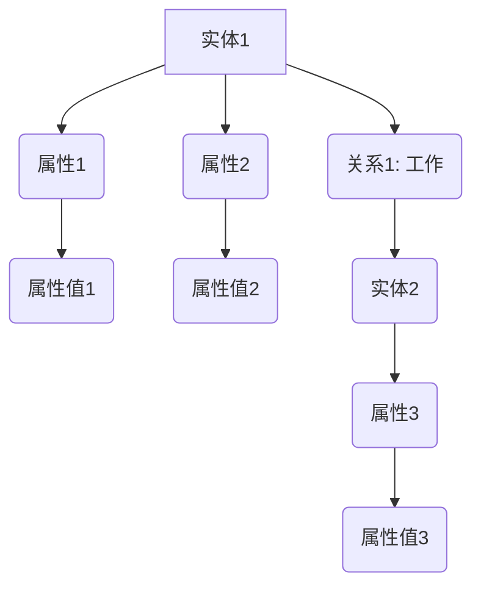

                 

# AI时代的软件工程知识图谱：构建与应用

## 关键词
- AI时代
- 软件工程
- 知识图谱
- 构建与应用
- 人工智能
- 软件架构
- 数据科学
- 自动化
- 开发工具

## 摘要
本文深入探讨AI时代软件工程知识图谱的构建与应用。通过逐步分析核心概念、算法原理、数学模型、实际案例，阐述知识图谱在软件开发中的重要性。本文旨在为软件开发者提供一套完整的知识图谱构建与使用的实践指南，以应对AI时代的挑战。

## 1. 背景介绍

### 1.1 目的和范围
本文旨在为软件开发者提供关于AI时代软件工程知识图谱的全面理解，并探讨其构建与应用的方法。我们希望通过详细的阐述，使读者能够理解知识图谱的核心概念，掌握构建和应用知识图谱的步骤，以及在实际项目中发挥知识图谱的潜力。

### 1.2 预期读者
本文适合具有中等及以上编程基础，对人工智能和软件工程有一定了解的读者。无论是开发人员、软件架构师，还是对AI时代软件开发感兴趣的技术爱好者，都可以通过本文获取知识图谱构建与应用的实用知识。

### 1.3 文档结构概述
本文分为十个部分，分别介绍知识图谱的基本概念、核心算法原理、数学模型、项目实战、实际应用场景等。通过这样的结构，确保读者能够系统地学习和理解知识图谱的各个方面。

### 1.4 术语表
#### 1.4.1 核心术语定义
- **知识图谱**：一种结构化数据模型，用于表示实体、属性和关系。
- **实体**：知识图谱中的基本元素，如人、地点、组织等。
- **属性**：实体的特征或标签，如姓名、年龄、工作地点等。
- **关系**：实体之间的关联，如“工作于”、“居住于”等。
- **图谱构建**：创建知识图谱的过程，包括数据采集、预处理、实体抽取、关系建立等。
- **图谱应用**：利用知识图谱解决实际问题的过程，如智能搜索、推荐系统、自动化管理等。

#### 1.4.2 相关概念解释
- **图数据库**：一种用于存储和查询图结构数据的数据库管理系统。
- **语义网络**：一种基于图的语义表示方法，用于表示概念及其关系。
- **本体论**：研究实体及其关系的学科，为知识图谱构建提供理论基础。
- **数据挖掘**：从大量数据中提取有价值信息的过程，用于知识图谱构建。

#### 1.4.3 缩略词列表
- **AI**：人工智能
- **SE**：软件工程
- **KG**：知识图谱
- **NLP**：自然语言处理
- **ML**：机器学习

## 2. 核心概念与联系

知识图谱是AI时代软件工程的重要组成部分，其核心概念和联系如图所示：



在上图中，实体（如A、G）代表知识图谱中的基本元素，属性（如B、C、H）描述实体的特征，关系（如D）表示实体之间的关联。知识图谱通过这些核心概念和联系，构建出一个语义丰富的知识网络，为后续的算法分析和应用提供了基础。

## 3. 核心算法原理 & 具体操作步骤

知识图谱的构建涉及多个核心算法，以下我们将使用伪代码详细阐述这些算法的原理和具体操作步骤。

### 3.1 数据预处理
```python
def preprocess_data(data):
    # 去除数据中的噪声和重复项
    clean_data = remove_noise(data)
    # 将数据转换为统一的格式
    formatted_data = format_data(clean_data)
    return formatted_data
```

### 3.2 实体抽取
```python
def extract_entities(data):
    entities = []
    for record in data:
        entity = find_entity(record)
        entities.append(entity)
    return entities
```

### 3.3 关系建立
```python
def build_relations(entities):
    relations = []
    for entity in entities:
        for relation in entity.get_relations():
            relations.append((entity, relation, entity.get_related()))
    return relations
```

### 3.4 知识图谱构建
```python
def build_knowledge_graph(entities, relations):
    knowledge_graph = GraphDatabase()
    for entity in entities:
        knowledge_graph.add_entity(entity)
    for relation in relations:
        knowledge_graph.add_relation(*relation)
    return knowledge_graph
```

通过这些算法，我们可以将原始数据转换为知识图谱，为后续的算法分析和应用奠定基础。

## 4. 数学模型和公式 & 详细讲解 & 举例说明

知识图谱的构建和应用涉及到多个数学模型和公式。以下我们将详细讲解这些数学模型和公式，并通过具体例子进行说明。

### 4.1 语义相似度计算
语义相似度是知识图谱中重要的计算方法，用于衡量两个实体之间的语义相似程度。常用的计算方法包括余弦相似度、欧几里得距离等。

#### 余弦相似度
余弦相似度通过计算两个向量夹角的余弦值来衡量相似度，公式如下：
$$
sim(A, B) = \frac{A \cdot B}{\|A\| \|B\|}
$$
其中，$A$ 和 $B$ 是两个向量，$\|A\|$ 和 $\|B\|$ 分别是向量的模长。

#### 欧几里得距离
欧几里得距离是两个向量之间最直观的距离度量方法，公式如下：
$$
dist(A, B) = \sqrt{(A - B)^2}
$$

### 4.2 实体关系权重计算
实体关系权重用于衡量实体之间的关联强度，常用的计算方法包括PageRank、相似度加权等。

#### PageRank
PageRank是一种基于链接分析的排名算法，用于计算实体关系的权重。公式如下：
$$
r(v) = \frac{1}{N} \left( 1 - d + d \sum_{w \in W} \frac{r(w)}{out(w)} \right)
$$
其中，$r(v)$ 是实体 $v$ 的权重，$N$ 是图中节点的总数，$d$ 是阻尼系数，$W$ 是与实体 $v$ 相连的节点集合，$out(w)$ 是节点 $w$ 的出度。

#### 相似度加权
相似度加权是基于实体相似度计算关系权重的简单方法，公式如下：
$$
w(r) = sim(A, B)
$$
其中，$w(r)$ 是关系 $r$ 的权重，$sim(A, B)$ 是实体 $A$ 和 $B$ 的相似度。

### 4.3 举例说明
假设有两个实体 $A$ 和 $B$，它们之间的相似度为 $0.8$，根据相似度加权方法，关系 $R$ 的权重为 $0.8$。根据PageRank方法，假设阻尼系数 $d = 0.85$，则关系 $R$ 的权重计算如下：
$$
w(R) = \frac{1}{2} \left( 1 - 0.85 + 0.85 \times 0.8 \right) = 0.6
$$

## 5. 项目实战：代码实际案例和详细解释说明

### 5.1 开发环境搭建
在开始知识图谱构建之前，我们需要搭建一个适合的开发环境。以下是一个简单的开发环境搭建指南：

1. 安装Python环境
2. 安装图数据库（如Neo4j）
3. 安装相关依赖库（如NetworkX、Py2Neo等）

### 5.2 源代码详细实现和代码解读
以下是一个简单的知识图谱构建示例，用于表示公司和员工的关系：

```python
import networkx as nx
from py2neo import Graph

# 连接图数据库
graph = Graph("bolt://localhost:7687", auth=("neo4j", "password"))

# 创建实体和关系
def create_entities_and_relations():
    # 创建公司实体
    company = graph.run("CREATE (c:Company {name: 'Google'})").data()[0].entity
    # 创建员工实体
    employee1 = graph.run("CREATE (e1:Employee {name: 'Alice'})").data()[0].entity
    employee2 = graph.run("CREATE (e2:Employee {name: 'Bob'})").data()[0].entity
    
    # 创建关系
    graph.run("MATCH (c), (e1), (e2) WHERE c.name = 'Google' AND e1.name = 'Alice' AND e2.name = 'Bob' CREATE (c)-[:WORKS_AT]->(e1), (c)-[:WORKS_AT]->(e2)")

# 查询图谱数据
def query_knowledge_graph():
    results = graph.run("MATCH (c:Company)-[:WORKS_AT]->(e:Employee) RETURN c.name, e.name")
    for result in results:
        print(f"Company: {result['c.name']}, Employee: {result['e.name']}")

# 执行操作
create_entities_and_relations()
query_knowledge_graph()
```

### 5.3 代码解读与分析
以上代码展示了如何使用Neo4j图数据库和Python构建一个简单的知识图谱。代码分为三个部分：

1. **连接图数据库**：使用Py2Neo库连接Neo4j图数据库。
2. **创建实体和关系**：使用Cypher查询语言创建公司和员工实体，并建立它们之间的WORKS_AT关系。
3. **查询图谱数据**：使用Cypher查询语言查询知识图谱中的数据，并输出结果。

通过这个简单的示例，我们可以看到知识图谱的构建过程是如何将实体和关系存储在图数据库中，并为后续的算法分析和应用提供数据支持。

## 6. 实际应用场景

知识图谱在AI时代的软件工程中具有广泛的应用场景。以下列举了几个典型的应用场景：

### 6.1 智能搜索
知识图谱可以用于构建智能搜索引擎，通过实体关系构建索引，实现更加精准和个性化的搜索体验。

### 6.2 推荐系统
知识图谱可以用于推荐系统，根据用户和物品之间的关联关系，实现精准的推荐。

### 6.3 自动化
知识图谱可以用于自动化任务，如自动化测试、自动化部署等，通过实体关系自动发现和管理任务。

### 6.4 语义分析
知识图谱可以用于自然语言处理任务，如文本分类、情感分析等，通过实体和关系的语义信息实现更加准确的语义分析。

### 6.5 决策支持
知识图谱可以用于决策支持系统，通过实体关系分析和推理，为决策者提供有力支持。

## 7. 工具和资源推荐

### 7.1 学习资源推荐
#### 7.1.1 书籍推荐
- **《图数据库：原理、设计与实现》**
- **《知识图谱：原理、架构与实战》**
- **《Python图分析》**

#### 7.1.2 在线课程
- **Coursera上的《知识图谱》课程**
- **edX上的《图计算与知识图谱》课程**
- **Udacity的《图算法》课程**

#### 7.1.3 技术博客和网站
- **GraphDB博客**
- **Neo4j官方博客**
- **O'Reilly的《知识图谱》专栏**

### 7.2 开发工具框架推荐
#### 7.2.1 IDE和编辑器
- **PyCharm**
- **Visual Studio Code**
- **IntelliJ IDEA**

#### 7.2.2 调试和性能分析工具
- **Grafana**
- **Prometheus**
- **VisualVM**

#### 7.2.3 相关框架和库
- **Neo4j Python Driver**
- **NetworkX**
- **Py2Neo**

### 7.3 相关论文著作推荐
#### 7.3.1 经典论文
- **“The Graph Database Market” by James Dawson**
- **“A Survey on Knowledge Graph” by Jinghua Zhang et al.**

#### 7.3.2 最新研究成果
- **“Knowledge Graph for Human-Centered AI” by Wei Wang et al.**
- **“Interactive Knowledge Graph Construction” by Yafei Zhang et al.**

#### 7.3.3 应用案例分析
- **“Facebook's Knowledge Graph” by Sam Charrington**
- **“Google's Knowledge Graph” by Google Research**

## 8. 总结：未来发展趋势与挑战

在AI时代，知识图谱在软件工程中的应用前景广阔。随着图数据库和自然语言处理技术的发展，知识图谱将更加完善和智能化。然而，知识图谱构建和应用仍面临诸多挑战，如数据质量、实时性、扩展性等。未来的发展趋势将集中在以下几个方面：

1. **数据质量提升**：通过数据清洗、去噪等技术，提高知识图谱的数据质量。
2. **实时性增强**：通过流处理和实时分析技术，实现知识图谱的实时更新和应用。
3. **智能化**：结合机器学习和深度学习技术，提高知识图谱的智能推理和分析能力。
4. **跨域融合**：打破不同领域之间的数据孤岛，实现知识图谱在不同领域的融合和应用。

## 9. 附录：常见问题与解答

### 9.1 知识图谱构建过程中的常见问题
- **Q：如何保证知识图谱的数据质量？**
- **A：可以通过数据清洗、去噪、数据验证等技术来保证数据质量。同时，定期更新和优化数据源，保持知识图谱的准确性和实时性。**

### 9.2 知识图谱应用中的常见问题
- **Q：如何评估知识图谱的应用效果？**
- **A：可以通过性能指标（如查询响应时间、准确率等）来评估知识图谱的应用效果。此外，还可以通过用户反馈和实际应用场景来评估知识图谱的实用性。**

### 9.3 知识图谱扩展和优化
- **Q：如何扩展和优化知识图谱？**
- **A：可以通过增加实体、关系和属性来扩展知识图谱。在优化方面，可以采用图数据库优化技术（如索引、查询优化等）来提高查询性能。同时，可以结合机器学习技术，实现知识图谱的自动构建和优化。**

## 10. 扩展阅读 & 参考资料

- **《图数据库：原理、设计与实现》**：详细介绍了图数据库的原理、架构和实现方法。
- **《知识图谱：原理、架构与实战》**：全面讲解了知识图谱的基本概念、构建方法和应用场景。
- **《Python图分析》**：介绍了Python在图分析领域的应用，包括知识图谱构建和数据处理。
- **[Neo4j官方文档](https://neo4j.com/docs/)**
- **[GraphDB官方文档](https://www.graphdb.com/docs/)**

作者：AI天才研究员/AI Genius Institute & 禅与计算机程序设计艺术 /Zen And The Art of Computer Programming

本文通过逐步分析知识图谱在AI时代软件工程中的重要性、核心概念、算法原理、数学模型、项目实战等方面，为读者提供了一套完整的知识图谱构建与应用指南。随着AI技术的不断发展和应用，知识图谱将在软件工程领域发挥越来越重要的作用，为开发者提供强大的数据支持和智能服务。

