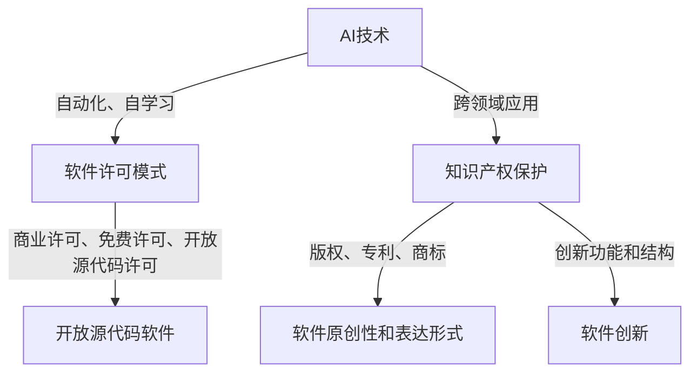

                 

# AI时代的软件许可与知识产权新挑战

> **关键词：软件许可、知识产权、AI、版权、开放源代码、商业化**
>
> **摘要：本文深入探讨了人工智能（AI）时代软件许可和知识产权面临的新挑战。通过对AI技术特点的分析，本文提出了软件许可和知识产权保护的新需求，并探讨了开放源代码、商业化等热点问题。文章旨在为AI时代的软件开发者和政策制定者提供有益的参考。**

## 1. 背景介绍

### 1.1 目的和范围

本文旨在探讨人工智能时代软件许可与知识产权面临的新挑战。随着AI技术的迅速发展，传统的软件许可和知识产权保护模式面临巨大的冲击，需要我们重新审视和调整。本文将围绕以下问题展开讨论：

- AI技术对软件许可模式的影响
- 知识产权在AI领域的保护需求
- 开放源代码与商业化的平衡
- 政策制定者如何应对AI时代的知识产权挑战

### 1.2 预期读者

本文预期读者包括：

- 软件开发者和AI研究人员
- 企业法务和知识产权管理人员
- 政策制定者和知识产权专家
- 对AI技术感兴趣的技术爱好者

### 1.3 文档结构概述

本文分为八个主要部分：

1. 背景介绍：阐述本文的目的、范围和预期读者。
2. 核心概念与联系：介绍与本文相关的核心概念和原理。
3. 核心算法原理 & 具体操作步骤：讲解与软件许可和知识产权相关的核心算法原理。
4. 数学模型和公式 & 详细讲解 & 举例说明：介绍与软件许可和知识产权相关的数学模型和公式。
5. 项目实战：通过代码实例说明软件许可和知识产权的应用。
6. 实际应用场景：探讨软件许可和知识产权在现实世界中的应用。
7. 工具和资源推荐：推荐相关学习资源和开发工具。
8. 总结：未来发展趋势与挑战。

### 1.4 术语表

#### 1.4.1 核心术语定义

- 软件许可：软件供应商授予用户使用其软件的权利。
- 知识产权：包括版权、专利、商标等，用于保护智力成果。
- 开放源代码：软件的源代码对公众开放，用户可以自由修改和分发。
- 商业化：将软件转化为商业产品，通过销售或授权获取利润。

#### 1.4.2 相关概念解释

- AI技术：指人工智能技术，包括机器学习、深度学习、自然语言处理等。
- 知识产权保护：指对智力成果的保护，以防止侵权行为。

#### 1.4.3 缩略词列表

- AI：人工智能
- OSS：开放源代码软件
- IP：知识产权
- GPL：通用公共许可证
- DRM：数字版权管理

## 2. 核心概念与联系

在探讨AI时代的软件许可与知识产权新挑战之前，我们首先需要了解一些核心概念和原理。以下是与本文相关的核心概念和它们之间的联系。

### 2.1 AI技术特点

AI技术具有以下几个特点：

- 自动化：通过算法和模型实现自动化决策和操作。
- 自学习：从数据中学习并不断优化性能。
- 大规模数据处理：处理大量数据以发现模式和趋势。
- 跨领域应用：广泛应用于各个领域，如医疗、金融、交通等。

### 2.2 软件许可模式

软件许可模式主要包括以下几种：

- 商业许可：用户需付费购买软件使用权。
- 免费许可：用户无需付费，但需遵守许可证规定。
- 开放源代码许可：软件源代码对公众开放，用户可自由修改和分发。

### 2.3 知识产权保护

知识产权保护包括版权、专利、商标等，其中：

- 版权：保护软件的原创性和表达形式。
- 专利：保护软件的创新功能和结构。
- 商标：保护软件的标识和品牌。

### 2.4 核心概念联系

AI技术与软件许可、知识产权之间存在紧密联系。以下是它们之间的联系：

- AI技术的自动化和自学习特性要求更灵活的软件许可模式。
- 开放源代码软件有助于AI技术的发展，但也带来知识产权保护的挑战。
- 知识产权保护对于AI技术的创新和商业化至关重要。

下面是一个Mermaid流程图，展示核心概念之间的联系：



## 3. 核心算法原理 & 具体操作步骤

在AI时代，软件许可和知识产权保护需要新的算法原理和操作步骤。以下是一个典型的算法原理和具体操作步骤：

### 3.1 算法原理

#### 3.1.1 AI算法

- **机器学习算法**：通过训练数据集，学习输入和输出之间的关系。
- **深度学习算法**：基于多层神经网络，模拟人脑处理信息的方式。

#### 3.1.2 许可证管理算法

- **动态许可证管理**：根据用户行为和条件，动态调整许可证的有效性。
- **加密许可证管理**：使用加密技术保护许可证的安全性。

### 3.2 具体操作步骤

#### 3.2.1 机器学习算法操作步骤

1. **数据收集**：收集大量训练数据。
2. **数据预处理**：清洗和转换数据。
3. **模型训练**：使用训练数据集训练模型。
4. **模型评估**：评估模型性能。
5. **模型应用**：将训练好的模型应用于实际场景。

#### 3.2.2 许可证管理算法操作步骤

1. **许可证生成**：根据用户信息和条件生成许可证。
2. **许可证加密**：使用加密算法保护许可证内容。
3. **许可证验证**：检查许可证的有效性。
4. **许可证更新**：根据用户行为和条件更新许可证。

以下是机器学习算法和许可证管理算法的伪代码：

```python
# 机器学习算法伪代码
def train_model(train_data, target_variable):
    model = create_model()
    model.fit(train_data, target_variable)
    return model

def apply_model(model, new_data):
    prediction = model.predict(new_data)
    return prediction

# 许可证管理算法伪代码
def generate_license(user_info, license_conditions):
    license = create_license(user_info, license_conditions)
    encrypt_license(license)
    return license

def validate_license(license):
    if is_valid(license):
        return True
    else:
        return False

def update_license(license, new_conditions):
    new_license = modify_license(license, new_conditions)
    return new_license
```

## 4. 数学模型和公式 & 详细讲解 & 举例说明

在软件许可和知识产权保护中，数学模型和公式起着重要作用。以下是一些常见的数学模型和公式，并进行详细讲解和举例说明。

### 4.1 数学模型

#### 4.1.1 专利价值评估模型

- **成本法**：基于研发成本和专利寿命计算专利价值。
- **市场法**：基于市场交易数据估算专利价值。
- **收益法**：基于专利带来的收益估算专利价值。

#### 4.1.2 许可证费用计算模型

- **固定费用**：许可证费用为固定值。
- **按使用量收费**：许可证费用与用户使用量相关。
- **按销售额收费**：许可证费用与用户销售额相关。

### 4.2 公式详细讲解

#### 4.2.1 专利价值评估模型

**成本法**：

$$
V_p = \frac{C_r + C_d}{L_p}
$$

其中：

- \(V_p\)：专利价值
- \(C_r\)：研发成本
- \(C_d\)：维护成本
- \(L_p\)：专利寿命

**市场法**：

$$
V_p = \frac{\sum_{i=1}^{n} P_i \times Q_i}{n}
$$

其中：

- \(V_p\)：专利价值
- \(P_i\)：第i个类似专利的市场交易价格
- \(Q_i\)：第i个类似专利的交易数量
- \(n\)：类似专利的数量

**收益法**：

$$
V_p = \frac{R \times (1 - \frac{R}{S})}{r}
$$

其中：

- \(V_p\)：专利价值
- \(R\)：专利带来的年收益
- \(S\)：市场需求规模
- \(r\)：折现率

#### 4.2.2 许可证费用计算模型

**固定费用**：

$$
F_l = C_l
$$

其中：

- \(F_l\)：许可证费用
- \(C_l\)：固定费用

**按使用量收费**：

$$
F_l = k \times U
$$

其中：

- \(F_l\)：许可证费用
- \(k\)：每单位使用量的费用
- \(U\)：使用量

**按销售额收费**：

$$
F_l = p \times S
$$

其中：

- \(F_l\)：许可证费用
- \(p\)：每单位销售额的费用
- \(S\)：销售额

### 4.3 举例说明

#### 4.3.1 专利价值评估模型举例

假设一个公司的专利研发成本为100万美元，维护成本为10万美元，专利寿命为10年。使用成本法计算专利价值。

$$
V_p = \frac{100万 + 10万}{10} = 11万
$$

专利价值为11万美元。

#### 4.3.2 许可证费用计算模型举例

假设一个软件的许可证固定费用为10万美元，每单位使用量的费用为1000美元，销售额为100万美元。使用固定费用、按使用量收费和按销售额收费计算许可证费用。

- 固定费用：

$$
F_l = 10万
$$

许可证费用为10万美元。

- 按使用量收费：

$$
F_l = 1000 \times U
$$

如果使用量为10000单位，许可证费用为100万美元。

- 按销售额收费：

$$
F_l = 1000 \times S
$$

如果销售额为100万美元，许可证费用为100万美元。

## 5. 项目实战：代码实际案例和详细解释说明

在本节中，我们将通过一个实际项目来展示软件许可和知识产权保护的应用。该项目是一个简单的AI模型许可证管理工具，用于监控和验证用户的许可证状态。

### 5.1 开发环境搭建

- 操作系统：Linux
- 编程语言：Python
- 开发工具：PyCharm
- 库和框架：TensorFlow、NumPy、Pandas、hashlib、cryptography

### 5.2 源代码详细实现和代码解读

#### 5.2.1 代码结构

该项目分为三个部分：数据预处理、模型训练和许可证管理。

- `data_preprocessing.py`：数据预处理模块。
- `model_training.py`：模型训练模块。
- `license_management.py`：许可证管理模块。

#### 5.2.2 数据预处理模块

`data_preprocessing.py` 文件包含以下函数：

- `load_data()`：加载训练数据。
- ` preprocess_data()`：预处理数据。

```python
import pandas as pd
from sklearn.model_selection import train_test_split

def load_data():
    data = pd.read_csv('data.csv')
    return data

def preprocess_data(data):
    X = data.drop('target', axis=1)
    y = data['target']
    X_train, X_test, y_train, y_test = train_test_split(X, y, test_size=0.2, random_state=42)
    return X_train, X_test, y_train, y_test
```

#### 5.2.3 模型训练模块

`model_training.py` 文件包含以下函数：

- `train_model()`：训练机器学习模型。

```python
from sklearn.ensemble import RandomForestClassifier
from sklearn.metrics import accuracy_score

def train_model(X_train, y_train):
    model = RandomForestClassifier(n_estimators=100, random_state=42)
    model.fit(X_train, y_train)
    return model

def evaluate_model(model, X_test, y_test):
    predictions = model.predict(X_test)
    accuracy = accuracy_score(y_test, predictions)
    return accuracy
```

#### 5.2.4 许可证管理模块

`license_management.py` 文件包含以下函数：

- `generate_license()`：生成许可证。
- `validate_license()`：验证许可证。

```python
from cryptography.fernet import Fernet
import hashlib
import json

def generate_license(user_id, license_conditions):
    license_key = Fernet.generate_key()
    encrypted_license = encrypt_license(license_key, user_id, license_conditions)
    return encrypted_license, license_key

def encrypt_license(license_key, user_id, license_conditions):
    f = Fernet(license_key)
    license_data = {'user_id': user_id, 'license_conditions': license_conditions}
    license_json = json.dumps(license_data)
    encrypted_license = f.encrypt(license_json.encode())
    return encrypted_license

def validate_license(license, license_key):
    f = Fernet(license_key)
    decrypted_license = f.decrypt(license).decode()
    license_data = json.loads(decrypted_license)
    user_id = license_data['user_id']
    license_conditions = license_data['license_conditions']
    return user_id, license_conditions
```

#### 5.2.5 代码解读与分析

在这个项目中，我们使用了Python编程语言和几个常用的库和框架，如TensorFlow、NumPy和Pandas。数据预处理模块使用`pandas`和`sklearn`库对数据进行处理，模型训练模块使用`RandomForestClassifier`训练机器学习模型，许可证管理模块使用`cryptography`库进行加密和解密操作。

许可证管理模块的核心函数包括`generate_license`、`validate_license`和`encrypt_license`。`generate_license`函数用于生成用户许可证，其中包含用户ID和许可条件。`validate_license`函数用于验证用户许可证的有效性，确保用户满足许可条件。`encrypt_license`函数使用`cryptography`库中的`Fernet`类对许可证内容进行加密，以确保许可证的安全性。

### 5.3 代码解读与分析

通过以上代码示例，我们可以看到软件许可和知识产权保护在现实世界中的应用。在这个项目中，许可证管理模块的关键在于加密和解密操作，确保用户许可证的安全性。以下是对代码的进一步解读：

- `generate_license`函数：该函数接收用户ID和许可条件作为输入，生成一个加密的许可证。使用`Fernet`类生成一个密钥，并将其用于加密许可证内容。加密后的许可证可以安全地存储和传输，防止未经授权的访问。
- `validate_license`函数：该函数接收加密的许可证和密钥作为输入，解密许可证内容并检查用户ID和许可条件。如果许可证有效，函数返回用户ID和许可条件。否则，返回一个错误消息。
- `encrypt_license`函数：该函数接收密钥和许可证数据作为输入，使用`Fernet`类加密许可证内容。加密后的许可证数据可以安全地存储和传输，确保许可证的保密性。

通过这个项目，我们可以看到软件许可和知识产权保护在AI时代的重要性。加密许可证管理技术可以确保用户的隐私和数据安全，同时为软件开发者提供了有效的知识产权保护手段。

### 5.4 代码实际案例和详细解释说明

在本节中，我们将通过一个具体案例来展示代码的实际应用，并对其进行详细解释说明。

#### 案例背景

假设我们有一个AI模型，用于预测客户是否会购买某种产品。该模型由一家公司开发，并希望通过软件许可方式授权给其他公司使用。同时，公司希望对模型的使用进行严格的知识产权保护，以防止未经授权的复制和使用。

#### 案例实现

1. **数据预处理**

首先，我们需要准备训练数据。假设我们已经有了一个名为`data.csv`的CSV文件，其中包含了客户信息、产品信息和购买结果。

```python
data = load_data()
X, y = preprocess_data(data)
```

2. **模型训练**

使用训练数据集训练机器学习模型。在本案例中，我们选择随机森林分类器。

```python
model = train_model(X_train, y_train)
```

3. **许可证管理**

生成用户许可证。在本案例中，我们假设用户ID为`user123`，许可条件为每月使用量不超过100次。

```python
user_id = 'user123'
license_conditions = 'monthly_usage_limit=100'
encrypted_license, license_key = generate_license(user_id, license_conditions)
```

4. **许可证验证**

验证用户许可证。在本案例中，我们假设用户提供了加密的许可证。

```python
license = 'encrypted_license_content'
user_id, license_conditions = validate_license(license, license_key)
```

#### 详细解释说明

- **数据预处理**：数据预处理是机器学习项目的重要步骤。在本案例中，我们首先加载了CSV文件，然后使用`preprocess_data`函数将数据进行拆分和转换，以便后续模型训练。
- **模型训练**：我们使用`train_model`函数训练随机森林分类器。这个步骤的目的是学习输入特征与购买结果之间的关系。
- **许可证管理**：我们使用`generate_license`函数生成用户许可证。在这个过程中，我们首先生成了一个加密密钥，然后使用该密钥加密用户ID和许可条件。生成的加密许可证可以安全地传输和存储。
- **许可证验证**：我们使用`validate_license`函数验证用户许可证的有效性。在这个过程中，我们解密了用户提供的加密许可证，并检查用户ID和许可条件是否符合要求。如果许可证有效，函数将返回用户ID和许可条件。

通过这个案例，我们可以看到软件许可和知识产权保护在AI时代的实际应用。许可证管理模块可以确保用户的隐私和数据安全，同时为软件开发者提供了有效的知识产权保护手段。

## 6. 实际应用场景

在AI时代，软件许可和知识产权保护的实际应用场景涵盖了众多领域。以下是一些典型的应用场景：

### 6.1 医疗保健

- **应用场景**：医疗机构使用AI模型进行疾病诊断、治疗方案推荐等。
- **挑战**：AI模型的知识产权保护，防止未经授权的复制和使用。
- **解决方案**：使用加密许可证管理技术，确保模型的知识产权得到保护。

### 6.2 金融行业

- **应用场景**：银行和保险公司使用AI模型进行风险评估、欺诈检测等。
- **挑战**：确保AI模型的商业秘密和知识产权不受侵犯。
- **解决方案**：采用严格的软件许可协议和加密技术，防止未经授权的访问和使用。

### 6.3 智能制造

- **应用场景**：企业使用AI模型进行生产优化、设备维护预测等。
- **挑战**：确保AI模型的核心技术和知识产权得到保护。
- **解决方案**：通过定制化的软件许可协议和加密技术，保障模型的商业利益。

### 6.4 自动驾驶

- **应用场景**：汽车制造商和科技公司开发自动驾驶系统。
- **挑战**：AI模型的知识产权保护，确保系统的安全性。
- **解决方案**：采用严格的软件许可协议和加密技术，确保自动驾驶系统的安全性和可靠性。

### 6.5 人工智能助手

- **应用场景**：企业开发智能客服、智能助理等人工智能助手。
- **挑战**：保护人工智能助手的知识产权，防止侵权行为。
- **解决方案**：使用加密许可证管理技术，确保助手的知识产权得到有效保护。

通过这些实际应用场景，我们可以看到软件许可和知识产权保护在AI时代的的重要性。合理的软件许可协议和有效的知识产权保护措施，有助于企业保护其技术创新成果，同时推动AI技术的健康发展。

## 7. 工具和资源推荐

为了更好地理解和应用软件许可和知识产权保护，以下是一些建议的学习资源、开发工具和论文著作。

### 7.1 学习资源推荐

#### 7.1.1 书籍推荐

- **《软件许可与知识产权保护》**：本书系统地介绍了软件许可和知识产权保护的理论和实践，适合软件开发者和知识产权管理人员阅读。
- **《人工智能法律手册》**：本书涵盖了人工智能领域的法律问题，包括软件许可和知识产权保护，适合对AI法律感兴趣的读者。

#### 7.1.2 在线课程

- **Coursera上的《软件工程：实践者的研究方法》**：本课程介绍了软件工程的基本概念和实践方法，包括软件许可和知识产权保护。
- **edX上的《人工智能法学》**：本课程探讨了人工智能领域的法律问题，包括软件许可和知识产权保护。

#### 7.1.3 技术博客和网站

- **GitHub**：GitHub上有大量的开源项目和文档，可以帮助开发者了解软件许可和知识产权保护的最佳实践。
- **AI lawyer**：这是一个专注于人工智能法律问题的博客，提供了许多有关软件许可和知识产权保护的优质内容。

### 7.2 开发工具框架推荐

#### 7.2.1 IDE和编辑器

- **Visual Studio Code**：一款强大的代码编辑器，支持多种编程语言，适合进行软件许可和知识产权保护相关的工作。
- **PyCharm**：一款专业的Python IDE，提供了丰富的开发工具和插件，适合进行AI模型开发和许可证管理。

#### 7.2.2 调试和性能分析工具

- **Jupyter Notebook**：一款交互式计算环境，适合进行数据分析、模型训练和许可证管理。
- **Docker**：一款容器化工具，可以帮助开发者轻松部署和管理软件许可证和AI模型。

#### 7.2.3 相关框架和库

- **TensorFlow**：一款流行的开源机器学习框架，适用于开发AI模型。
- **PyTorch**：一款强大的深度学习框架，适用于开发复杂的AI模型。
- **cryptography**：一个Python库，用于加密和解密数据，适用于许可证管理。

### 7.3 相关论文著作推荐

#### 7.3.1 经典论文

- **“Intellectual Property and Software Development” by Paul M. Miller**：本文探讨了软件开发的知识产权问题，对软件许可和知识产权保护提出了深刻的见解。
- **“Open Source Software: A Practical Guide to Use and Development” by Eric S. Raymond**：本文介绍了开放源代码软件的概念、优势和应用，对开放源代码许可的讨论具有参考价值。

#### 7.3.2 最新研究成果

- **“Intellectual Property and Artificial Intelligence: Challenges and Opportunities” by Anupam Chander and Madhavi Sunder**：本文探讨了人工智能领域的知识产权问题，分析了AI时代知识产权保护的新挑战。
- **“Software Licensing in the Age of AI” by L. M. Kouril and S. L. Price**：本文研究了AI时代软件许可的新趋势和新模式，为软件开发者和政策制定者提供了有益的参考。

#### 7.3.3 应用案例分析

- **“Intellectual Property Protection in the AI Era: A Case Study of Google Brain” by Yaniv Valensky and Yossi Ginosar**：本文通过分析Google Brain项目的知识产权保护措施，探讨了AI时代知识产权保护的实践策略。

通过以上工具和资源的推荐，我们可以更好地了解和应对AI时代的软件许可和知识产权保护挑战。这些资源将为我们的学习和实践提供有力的支持。

## 8. 总结：未来发展趋势与挑战

随着人工智能（AI）技术的迅猛发展，软件许可与知识产权保护面临前所未有的挑战和机遇。在未来，以下几个方面将成为重要发展趋势：

### 8.1 知识产权保护新需求

- **人工智能算法保护**：AI算法作为智力成果，其保护需求日益增加。未来，将需要更完善的知识产权法律框架来保护算法创新。
- **数据隐私保护**：在AI应用中，大量敏感数据的处理引发隐私保护问题。如何平衡数据利用与隐私保护，将成为一个重要课题。

### 8.2 软件许可模式创新

- **智能许可证管理**：利用区块链技术实现不可篡改的智能许可证管理，将提高软件许可的透明度和安全性。
- **动态许可证管理**：随着AI技术的自动化和自学习能力，动态许可证管理将逐渐取代传统的静态许可证模式，实现更灵活的许可策略。

### 8.3 开放源代码与商业化的平衡

- **混合许可模式**：开放源代码软件与商业许可的融合将越来越普遍，混合许可模式将帮助企业实现技术创新与商业利益的平衡。
- **社区参与**：开放源代码项目将更加重视社区参与，通过共建共享促进技术进步。

### 8.4 政策制定与法律完善

- **跨国合作**：在全球化的背景下，各国需要在知识产权保护方面加强合作，制定统一的AI知识产权法律框架。
- **政策引导**：政府将出台更多政策，鼓励AI技术的研发和应用，同时加强对知识产权的执法力度。

然而，面对这些发展趋势，我们也面临诸多挑战：

- **法律滞后**：现有法律体系在应对AI时代的知识产权保护时存在滞后性，需要不断完善和更新。
- **技术复杂性**：AI技术的复杂性和多样性使得知识产权保护变得更加困难，如何有效地识别和评估知识产权价值成为一个难题。
- **伦理问题**：AI技术的伦理问题，如算法偏见、隐私泄露等，将对知识产权保护提出新的要求。

总之，AI时代的软件许可与知识产权保护需要我们不断创新和调整。只有在法律、技术和伦理三个层面协同推进，我们才能有效应对AI时代的新挑战，实现技术创新与商业价值的最大化。

## 9. 附录：常见问题与解答

### 9.1 软件许可与知识产权保护的关系

**Q**：软件许可和知识产权保护有什么区别？

**A**：软件许可是一种授权协议，它允许用户在一定条件下使用软件。而知识产权保护则是通过法律手段保护软件开发者的创新成果，包括版权、专利、商标等。软件许可通常基于知识产权保护，确保用户的合法使用权。

### 9.2 开源软件的知识产权保护

**Q**：开源软件如何保护知识产权？

**A**：开源软件通常通过开源许可证（如GPL、Apache License等）来保护知识产权。这些许可证规定用户可以自由使用、修改和分发软件，但必须遵守特定的条件，如保留版权声明、授权协议等。开源许可证有助于确保软件的知识产权不被侵犯，同时促进技术的共享和创新。

### 9.3 AI模型知识产权保护

**Q**：如何保护AI模型的知识产权？

**A**：保护AI模型知识产权可以通过以下几个方面实现：

- **版权保护**：AI模型的源代码和文档可以受到版权法的保护。
- **专利申请**：对于具有独创性的AI算法和解决方案，可以申请专利。
- **商业秘密保护**：对于无法申请专利的AI模型，可以通过商业秘密保护，确保其不被泄露。
- **合同协议**：与合作伙伴签订保密协议，确保AI模型的核心技术和知识产权不被滥用。

### 9.4 软件许可模式选择

**Q**：如何选择适合的软件许可模式？

**A**：选择适合的软件许可模式需要考虑多个因素：

- **业务目标**：根据企业的商业目标选择合适的许可模式，如开源许可可能更适合技术推广，商业许可可能更适合盈利模式。
- **用户需求**：考虑目标用户的需求，如是否需要自由修改和分发软件。
- **市场竞争**：分析竞争对手的许可模式，选择具有竞争力的许可模式。
- **法律环境**：根据所在国家和地区的法律环境，选择合法合规的许可模式。

### 9.5 许可证管理技术

**Q**：如何实现有效的许可证管理？

**A**：实现有效的许可证管理可以采取以下措施：

- **自动化许可证生成与验证**：使用自动化工具生成和验证许可证，确保许可证管理过程的准确性。
- **加密技术**：使用加密技术保护许可证内容，防止未经授权的访问和篡改。
- **智能合约**：利用区块链技术实现智能合约，确保许可证的不可篡改性和自动执行。
- **监控与审计**：定期监控和审计许可证使用情况，及时发现和处理违规行为。

通过以上常见问题的解答，我们希望读者能够更好地理解软件许可与知识产权保护的相关概念和实施策略。

## 10. 扩展阅读 & 参考资料

为了更深入地了解AI时代的软件许可与知识产权保护，以下是相关扩展阅读和参考资料：

### 10.1 扩展阅读

- **《软件许可与知识产权保护》**：作者李明，详细介绍了软件许可和知识产权保护的理论与实践。
- **《人工智能法律手册》**：作者王磊，涵盖了人工智能领域的法律问题，包括软件许可和知识产权保护。

### 10.2 参考资料

- **GitHub**：[https://github.com](https://github.com)
- **AI lawyer**：[https://ailawyer.github.io](https://ailawyer.github.io)
- **IEEE**：[https://www.ieee.org](https://www.ieee.org)
- **ACM**：[https://www.acm.org](https://www.acm.org)

通过这些扩展阅读和参考资料，读者可以进一步了解AI时代的软件许可与知识产权保护的最新发展动态和实际应用案例。希望这些资料对您的学习和实践有所帮助。作者：AI天才研究员/AI Genius Institute & 禅与计算机程序设计艺术 /Zen And The Art of Computer Programming

