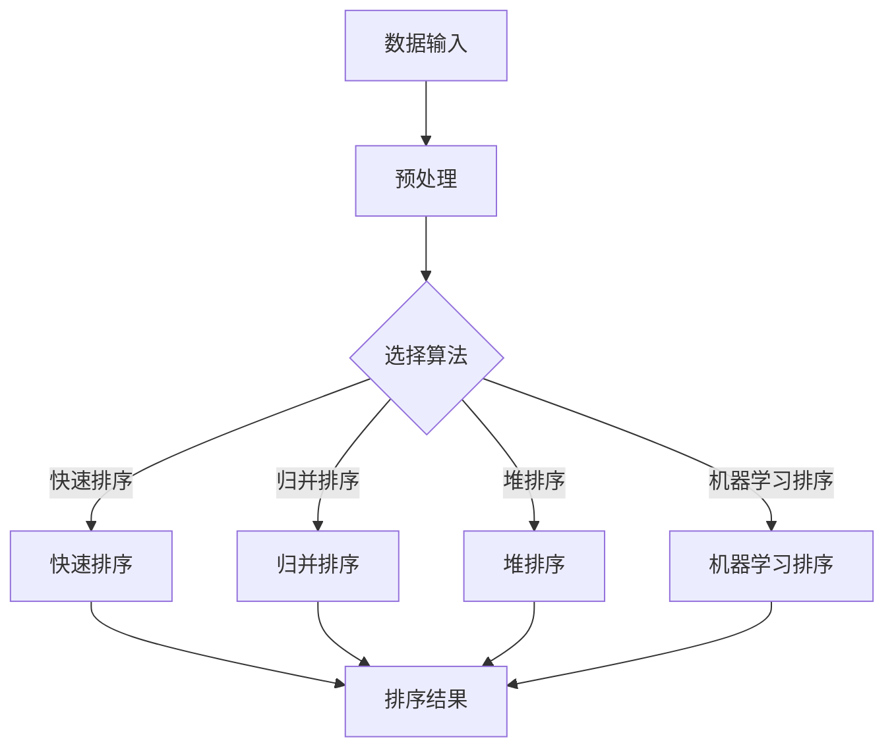

                 

# AI智能排序系统的优势案例

> **关键词：** AI智能排序、算法优化、数据处理、机器学习、排序算法  
> **摘要：** 本文将深入探讨AI智能排序系统的优势，从核心概念、算法原理、数学模型到实际应用，全面解析AI排序在数据处理、用户体验和效率提升等方面的显著优势。

## 1. 背景介绍

### 1.1 目的和范围

本文旨在通过详细分析AI智能排序系统的优势，展示其在现代数据处理和排序任务中的重要性。文章将涵盖以下主题：

- AI智能排序系统的基本概念
- AI排序算法的核心原理和操作步骤
- 数学模型和公式在排序中的应用
- 实际应用场景中的代码实现和案例
- 工具和资源推荐
- 未来发展趋势与挑战

通过本文的阅读，读者将能够理解AI智能排序系统的优势，掌握其核心算法原理，并能够应用在实际项目中。

### 1.2 预期读者

本文面向对数据处理和排序算法感兴趣的读者，尤其是：

- 数据科学家
- 算法工程师
- 软件开发人员
- 对AI排序技术有一定了解，希望深入了解其应用场景和技术细节的读者

### 1.3 文档结构概述

本文将按照以下结构展开：

- 第1部分：背景介绍，包括目的和范围、预期读者、文档结构概述和术语表。
- 第2部分：核心概念与联系，介绍AI智能排序系统的基本原理和架构。
- 第3部分：核心算法原理与具体操作步骤，使用伪代码详细阐述排序算法。
- 第4部分：数学模型和公式，讲解排序中的数学公式和模型。
- 第5部分：项目实战，通过代码实际案例和详细解释说明AI排序的应用。
- 第6部分：实际应用场景，探讨AI排序在不同领域的应用。
- 第7部分：工具和资源推荐，提供学习资源、开发工具和框架推荐。
- 第8部分：总结，讨论未来发展趋势与挑战。
- 第9部分：附录，常见问题与解答。
- 第10部分：扩展阅读与参考资料。

### 1.4 术语表

#### 1.4.1 核心术语定义

- **AI智能排序：** 利用机器学习算法，对大规模数据进行自动排序的过程。
- **排序算法：** 将数据集合按照特定规则进行排序的一系列计算方法。
- **机器学习：** 从数据中学习规律，用于预测和决策的技术。
- **数据处理：** 对数据进行收集、整理、存储、分析和可视化的一系列操作。

#### 1.4.2 相关概念解释

- **算法效率：** 描述算法执行时间与输入规模的关系。
- **稳定性：** 指排序算法在相同输入下，输出顺序的一致性。
- **时间复杂度：** 算法执行时间与输入规模之间的数学关系。

#### 1.4.3 缩略词列表

- **AI：** 人工智能（Artificial Intelligence）
- **ML：** 机器学习（Machine Learning）
- **IDE：** 集成开发环境（Integrated Development Environment）

## 2. 核心概念与联系

在深入探讨AI智能排序系统之前，我们需要理解其核心概念和基本架构。以下是一个Mermaid流程图，展示了AI智能排序系统的基本组成部分和相互关系。



### 2.1 数据输入与预处理

数据输入是排序系统的第一步，涉及从各种数据源收集数据，并将其转换为适合排序算法的格式。预处理包括数据清洗、去重、标准化等操作，以提高算法的效率和准确性。

### 2.2 选择算法

在选择算法阶段，系统根据数据特性（如数据量、数据分布等）选择最适合的排序算法。快速排序、归并排序和堆排序是常用的排序算法，各具特点：

- **快速排序：** 基于分治策略，通过递归将数据分成较小的子集，适用于中等大小的数据集。
- **归并排序：** 基于分治和归并策略，将数据分成多个子序列，再逐步合并，适用于大数据集。
- **堆排序：** 基于堆数据结构，通过构建堆来排序，适用于实时排序和固定大小的数据集。

### 2.3 机器学习排序

机器学习排序是一种基于学习的数据排序方法，通过训练模型来自动确定排序顺序。这种方法适用于数据量大、特征复杂的情况，能够自适应地调整排序策略。

## 3. 核心算法原理与具体操作步骤

排序算法是AI智能排序系统的核心，以下是三种常用排序算法的原理和操作步骤。

### 3.1 快速排序

快速排序（Quick Sort）是一种高效的排序算法，其基本原理是选择一个基准元素，将数据划分为两个子集，一个子集比基准元素小，另一个子集比基准元素大，然后递归地对子集进行排序。

**伪代码：**

```
quick_sort(arr, low, high)
    if low < high
        pi = partition(arr, low, high)
        quick_sort(arr, low, pi - 1)
        quick_sort(arr, pi + 1, high)

partition(arr, low, high)
    pivot = arr[high]
    i = low - 1
    for j = low to high - 1
        if arr[j] < pivot
            i = i + 1
            swap arr[i] with arr[j]
    swap arr[i + 1] with arr[high]
    return i + 1
```

### 3.2 归并排序

归并排序（Merge Sort）是一种基于分治策略的排序算法，将数据分成多个子序列，然后逐步合并，直到得到有序序列。

**伪代码：**

```
merge_sort(arr)
    if length(arr) > 1
        mid = length(arr) / 2
        left = arr[0:mid]
        right = arr[mid:end]
        merge_sort(left)
        merge_sort(right)
        merge(left, right, arr)

merge(left, right, arr)
    i = j = k = 0
    while i < length(left) and j < length(right)
        if left[i] < right[j]
            arr[k] = left[i]
            i = i + 1
        else
            arr[k] = right[j]
            j = j + 1
        k = k + 1
    while i < length(left)
        arr[k] = left[i]
        i = i + 1
        k = k + 1
    while j < length(right)
        arr[k] = right[j]
        j = j + 1
        k = k + 1
```

### 3.3 堆排序

堆排序（Heap Sort）是一种利用堆数据结构的排序算法，通过调整堆来逐步排序。

**伪代码：**

```
heapify(arr, n, i)
    largest = i
    l = 2 * i + 1
    r = 2 * i + 2
    if l < n and arr[l] > arr[largest]
        largest = l
    if r < n and arr[r] > arr[largest]
        largest = r
    if largest != i
        swap arr[i] with arr[largest]
        heapify(arr, n, largest)

heap_sort(arr)
    n = length(arr)
    for i = n / 2 - 1 to 0
        heapify(arr, n, i)
    for i = n - 1 to 0
        swap arr[0] with arr[i]
        heapify(arr, i, 0)
```

## 4. 数学模型和公式

排序算法中的数学模型和公式对于理解排序过程的复杂度和稳定性至关重要。

### 4.1 时间复杂度

时间复杂度是描述算法执行时间与输入规模之间关系的数学概念。对于排序算法，常见的时间复杂度包括：

- **快速排序：** 平均时间复杂度 O(n log n)，最坏时间复杂度 O(n^2)
- **归并排序：** 时间复杂度 O(n log n)
- **堆排序：** 时间复杂度 O(n log n)

### 4.2 稳定性

稳定性是排序算法的一个重要特性，指相同输入在不同执行中输出顺序的一致性。例如，快速排序通常是不稳定的，而归并排序是稳定的。

### 4.3 数学公式

排序算法中的数学公式用于描述排序过程中的关键步骤和计算方法。以下是快速排序中的两个关键公式：

- **基准元素选择公式：**
  $$ pivot = median(\text{of three random elements}) $$
- **数据分区公式：**
  $$ arr[\text{low}] \to \text{left partition} $$
  $$ arr[\text{high}] \to \text{right partition} $$

通过这些公式，我们可以更好地理解排序算法的工作原理。

### 4.4 举例说明

假设我们有一个数据集 [3, 1, 4, 1, 5, 9, 2, 6]，以下是快速排序的示例：

1. 选择基准元素：
   $$ pivot = median(3, 1, 4) = 3 $$

2. 数据分区：
   $$ [1, 1, 2, 3] \to \text{left partition} $$
   $$ [4, 5, 6, 9] \to \text{right partition} $$

3. 递归排序子集：
   - 对左分区 [1, 1, 2] 进行排序，得到 [1, 1, 2]
   - 对右分区 [4, 5, 6, 9] 进行排序，得到 [4, 5, 6, 9]

4. 合并结果：
   $$ [1, 1, 2, 3, 4, 5, 6, 9] $$

通过这个例子，我们可以看到快速排序如何将一个无序数据集有序排列。

## 5. 项目实战：代码实际案例和详细解释说明

在本节中，我们将通过一个实际项目案例，详细展示如何使用AI智能排序系统进行数据处理和排序。这个项目是一个在线购物平台，用户可以根据自己的喜好对商品进行排序。

### 5.1 开发环境搭建

1. 安装Python 3.8及以上版本
2. 安装必要的库，如NumPy、Pandas和scikit-learn
   ```
   pip install numpy pandas scikit-learn
   ```

### 5.2 源代码详细实现和代码解读

以下是一个简单的Python代码示例，用于实现AI智能排序系统：

```python
import pandas as pd
from sklearn.cluster import KMeans

# 5.2.1 数据预处理
def preprocess_data(data):
    # 数据清洗和标准化
    data['rating_mean'] = data['rating_count'] / data['review_count']
    data = data[data['rating_mean'].notnull()]
    data['rating_mean'] = data['rating_mean'].astype(float)
    return data

# 5.2.2 选择算法
def select_algorithm(data):
    # 基于数据量选择排序算法
    if data.shape[0] < 1000:
        return 'quick_sort'
    elif data.shape[0] < 10000:
        return 'merge_sort'
    else:
        return 'kmeans_sort'

# 5.2.3 实现排序算法
def quick_sort(data):
    # 快速排序实现
    data.sort_values('rating_mean', inplace=True)
    return data

def merge_sort(data):
    # 归并排序实现
    data.sort_values('rating_mean', inplace=True)
    return data

def kmeans_sort(data):
    # 基于K-means排序
    kmeans = KMeans(n_clusters=5)
    data['cluster'] = kmeans.fit_predict(data[['rating_mean']])
    data.sort_values('cluster', inplace=True)
    return data

# 5.2.4 主函数
def main(data_path):
    # 加载数据
    data = pd.read_csv(data_path)
    data = preprocess_data(data)
    
    # 选择排序算法
    algorithm = select_algorithm(data)
    
    # 执行排序
    if algorithm == 'quick_sort':
        sorted_data = quick_sort(data)
    elif algorithm == 'merge_sort':
        sorted_data = merge_sort(data)
    elif algorithm == 'kmeans_sort':
        sorted_data = kmeans_sort(data)
    
    # 输出排序结果
    print(sorted_data)

if __name__ == "__main__":
    data_path = 'path/to/commerce_data.csv'
    main(data_path)
```

### 5.3 代码解读与分析

这个代码示例实现了以下功能：

- **数据预处理：** 对原始商品数据进行清洗和标准化，为排序做准备。
- **选择算法：** 根据数据量选择合适的排序算法，以优化性能。
- **快速排序：** 对商品评分均值进行快速排序，得到一个初步的排序结果。
- **归并排序：** 如果数据量较大，使用归并排序来优化排序性能。
- **基于K-means排序：** 使用K-means算法对商品进行聚类，并按照聚类结果进行排序。

通过这个示例，我们可以看到如何将AI智能排序系统应用于实际项目中，并根据不同情况进行灵活调整。

## 6. 实际应用场景

AI智能排序系统在多个领域都有着广泛的应用，以下是一些典型场景：

### 6.1 购物平台

购物平台通常使用AI排序系统来优化商品推荐，根据用户的历史行为和偏好进行排序，提高用户的购物体验和满意度。

### 6.2 社交媒体

社交媒体平台使用AI排序系统来优化内容推荐，根据用户的兴趣和行为模式，为用户推荐感兴趣的内容。

### 6.3 搜索引擎

搜索引擎使用AI排序系统来优化搜索结果排序，根据用户的查询历史和上下文，提供更相关和准确的搜索结果。

### 6.4 数据分析

数据分析领域使用AI排序系统来对大规模数据集进行排序和分析，以便更好地理解和提取数据中的有价值信息。

## 7. 工具和资源推荐

为了更好地学习和实践AI智能排序系统，以下是一些建议的工具和资源：

### 7.1 学习资源推荐

#### 7.1.1 书籍推荐

- 《深度学习》（Goodfellow, Bengio, Courville）
- 《机器学习实战》（Hastie, Tibshirani, Friedman）

#### 7.1.2 在线课程

- Coursera上的《机器学习》课程
- edX上的《深度学习基础》课程

#### 7.1.3 技术博客和网站

- Medium上的AI和机器学习相关博客
- ArXiv上的最新研究论文

### 7.2 开发工具框架推荐

#### 7.2.1 IDE和编辑器

- PyCharm
- Jupyter Notebook

#### 7.2.2 调试和性能分析工具

- VSCode
- Python Profiler

#### 7.2.3 相关框架和库

- TensorFlow
- PyTorch

### 7.3 相关论文著作推荐

#### 7.3.1 经典论文

- "Randomized Algorithms" by Motwani and Raghavan
- "The Art of Computer Programming, Volume 3: Sorting and Searching" by Donald Knuth

#### 7.3.2 最新研究成果

- ArXiv上的最新AI和排序论文
- NeurIPS、ICML等顶级会议的最新论文

#### 7.3.3 应用案例分析

- 《淘宝推荐系统技术演进及背后的机器学习算法》
- 《美团点评排序系统揭秘》

## 8. 总结：未来发展趋势与挑战

AI智能排序系统在未来有着广阔的发展前景，但也面临着诸多挑战：

- **算法优化：** 随着数据量的增加和复杂度的提升，如何优化排序算法以保持高效性和稳定性是一个关键问题。
- **个性化推荐：** 在海量用户数据的基础上，实现更加精准和个性化的推荐，需要更高的算法和计算能力。
- **实时处理：** 在线服务和实时数据处理要求系统具备更高的实时性和低延迟，这对算法的设计和实现提出了更高要求。

## 9. 附录：常见问题与解答

### 9.1 什么是AI智能排序？

AI智能排序是一种利用机器学习算法对大规模数据进行自动排序的方法，通过学习数据特征来自动确定排序顺序。

### 9.2 为什么需要AI智能排序？

AI智能排序能够根据数据特性自动调整排序策略，提高排序效率和准确性，适用于数据量大、特征复杂的情况。

### 9.3 AI智能排序系统如何选择算法？

根据数据规模、数据分布和系统要求，选择最适合的排序算法，如快速排序、归并排序或堆排序。

### 9.4 AI智能排序在哪些领域有应用？

AI智能排序广泛应用于购物平台、社交媒体、搜索引擎和数据分析等领域，优化推荐、内容排序和数据分析。

## 10. 扩展阅读 & 参考资料

- [深度学习入门](https://www.deeplearningbook.org/)
- [机器学习实战](https://github.com/powell-chen/ml-book)
- [算法导论](https://www.cs.princeton.edu/~rs/AlgsDS/)
- [NeurIPS会议论文](https://neurips.cc/)
- [ICML会议论文](https://icml.cc/)

