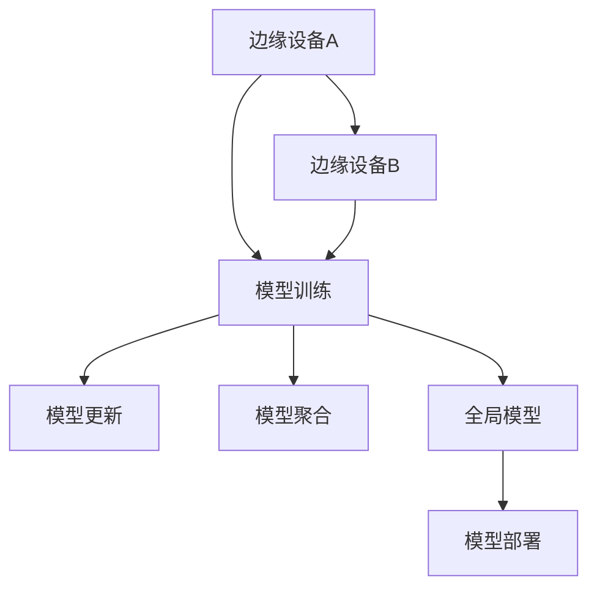

                 

# AI模型的联邦学习：Lepton AI的隐私保护技术

> **关键词：联邦学习、模型训练、隐私保护、Lepton AI、分布式计算、人工智能**
> 
> **摘要：本文将深入探讨联邦学习在人工智能模型训练中的应用，特别关注Lepton AI如何在保障隐私的同时，提升模型性能。通过详细的分析和实例讲解，帮助读者理解联邦学习的基本原理和实现方法，以及其在隐私保护和实际应用中的重要性。**

## 1. 背景介绍

### 1.1 目的和范围

本文旨在介绍联邦学习（Federated Learning）在人工智能（AI）模型训练中的应用，特别是针对Lepton AI这项隐私保护技术的探讨。联邦学习是一种分布式机器学习技术，通过将模型训练分散在多个边缘设备上，避免了敏感数据的集中，从而增强了隐私保护。本文将首先介绍联邦学习的背景和基本概念，然后深入分析Lepton AI的技术原理和实现步骤，最后探讨联邦学习在实际应用中的挑战和解决方案。

### 1.2 预期读者

本文适合对机器学习和分布式计算有一定了解的技术人员、AI研究者以及关注隐私保护的技术爱好者。本文将尽量使用通俗易懂的语言，但同时也会涉及到一些专业术语和算法原理，因此读者可能需要具备一定的数学和编程基础。

### 1.3 文档结构概述

本文分为十个部分：

1. **背景介绍**：介绍联邦学习的背景和目的。
2. **核心概念与联系**：阐述联邦学习的基本概念和架构。
3. **核心算法原理 & 具体操作步骤**：详细解释联邦学习的算法原理和操作步骤。
4. **数学模型和公式 & 详细讲解 & 举例说明**：介绍联邦学习的数学模型和相关公式。
5. **项目实战：代码实际案例和详细解释说明**：提供实际代码案例并进行详细解读。
6. **实际应用场景**：探讨联邦学习的应用场景。
7. **工具和资源推荐**：推荐学习资源和开发工具。
8. **总结：未来发展趋势与挑战**：总结联邦学习的未来发展趋势和面临的挑战。
9. **附录：常见问题与解答**：回答读者可能关心的问题。
10. **扩展阅读 & 参考资料**：提供进一步阅读的材料。

### 1.4 术语表

#### 1.4.1 核心术语定义

- **联邦学习**：一种分布式机器学习技术，通过在多个边缘设备上训练模型，实现数据隐私保护。
- **中央服务器**：协调联邦学习过程的核心节点，负责聚合各个设备上的模型更新。
- **边缘设备**：参与联邦学习的终端设备，如智能手机、物联网设备等。
- **模型更新**：边缘设备在本地训练后，向中央服务器发送的模型参数更新。
- **模型聚合**：中央服务器将多个模型更新合并成一个全局模型的过程。

#### 1.4.2 相关概念解释

- **分布式计算**：将任务分配到多个计算机上并行执行，以提高计算效率和性能。
- **隐私保护**：防止敏感数据泄露，确保用户隐私不被侵犯。
- **边缘计算**：在靠近数据源的设备上进行计算，以减少数据传输延迟和带宽消耗。

#### 1.4.3 缩略词列表

- **FL**：联邦学习
- **ML**：机器学习
- **AI**：人工智能
- **PU Learning**：聚合学习

## 2. 核心概念与联系

在深入探讨联邦学习的原理和实现方法之前，我们需要理解其核心概念和基本架构。下面通过一个Mermaid流程图，展示联邦学习的主要流程和组件。



### 2.1. 联邦学习的核心概念

1. **边缘设备**：参与联邦学习的设备，如智能手机、路由器、物联网设备等。这些设备可以在本地收集数据并进行模型训练。
2. **中央服务器**：协调联邦学习过程的中央节点，负责接收边缘设备的模型更新，并进行模型聚合。
3. **模型更新**：边缘设备在本地训练后，向中央服务器发送的模型参数更新。
4. **模型聚合**：中央服务器将多个模型更新合并成一个全局模型的过程。

### 2.2. 联邦学习的架构

联邦学习架构主要由以下几个组件构成：

- **边缘设备**：参与联邦学习的设备，可以是智能手机、物联网设备等。这些设备在本地运行模型，收集数据并训练模型。
- **中央服务器**：协调联邦学习过程的中央节点，负责接收边缘设备的模型更新，进行模型聚合，并最终部署全局模型。
- **通信网络**：连接边缘设备和中央服务器的通信网络，确保模型更新和聚合过程顺利进行。

## 3. 核心算法原理 & 具体操作步骤

### 3.1. 联邦学习算法原理

联邦学习是一种分布式机器学习技术，通过在多个边缘设备上训练模型，实现数据隐私保护。其基本原理如下：

1. **模型初始化**：中央服务器初始化全局模型，并将初始模型参数发送给所有边缘设备。
2. **本地训练**：边缘设备使用本地数据对全局模型进行训练，并更新模型参数。
3. **模型更新**：边缘设备将更新后的模型参数发送给中央服务器。
4. **模型聚合**：中央服务器接收多个边缘设备的模型更新，并进行聚合，生成新的全局模型。
5. **模型部署**：中央服务器将新的全局模型发送回边缘设备，并在所有设备上部署更新后的模型。

### 3.2. 联邦学习操作步骤

下面是联邦学习的具体操作步骤：

1. **初始化全局模型**：中央服务器初始化全局模型，并将初始模型参数发送给所有边缘设备。
   ```python
   # 初始化全局模型
   global_model = initialize_model()
   send_model_to_devices(global_model)
   ```

2. **本地训练**：边缘设备使用本地数据对全局模型进行训练，并更新模型参数。
   ```python
   # 本地训练
   for device in devices:
       local_data = get_local_data(device)
       updated_model = train_model(local_data, global_model)
       send_updated_model_to_server(updated_model, device)
   ```

3. **模型更新**：边缘设备将更新后的模型参数发送给中央服务器。
   ```python
   # 发送模型更新
   for device in devices:
       receive_updated_model_from_device(updated_model, device)
   ```

4. **模型聚合**：中央服务器接收多个边缘设备的模型更新，并进行聚合，生成新的全局模型。
   ```python
   # 模型聚合
   aggregated_model = aggregate_models(updated_models)
   ```

5. **模型部署**：中央服务器将新的全局模型发送回边缘设备，并在所有设备上部署更新后的模型。
   ```python
   # 模型部署
   send_aggregated_model_to_devices(aggregated_model)
   deploy_model_on_devices(aggregated_model)
   ```

## 4. 数学模型和公式 & 详细讲解 & 举例说明

### 4.1. 数学模型

联邦学习中的数学模型主要涉及线性模型和梯度聚合。下面是联邦学习中的基本数学模型：

#### 4.1.1. 线性模型

线性模型是最简单的机器学习模型之一，其形式为：

$$
y = \theta_0 + \theta_1x_1 + \theta_2x_2 + ... + \theta_nx_n
$$

其中，$y$ 是目标变量，$x_1, x_2, ..., x_n$ 是特征变量，$\theta_0, \theta_1, \theta_2, ..., \theta_n$ 是模型参数。

#### 4.1.2. 梯度聚合

梯度聚合是联邦学习中的核心步骤，用于将多个边缘设备的模型更新聚合为一个全局模型。梯度聚合的公式为：

$$
\theta_{\text{global}} = \frac{1}{N} \sum_{i=1}^{N} \theta_i
$$

其中，$\theta_{\text{global}}$ 是全局模型的参数，$\theta_i$ 是第 $i$ 个边缘设备的模型参数，$N$ 是边缘设备的数量。

### 4.2. 举例说明

假设有两个边缘设备 A 和 B，它们分别对全局模型进行本地训练，并生成模型更新。我们可以使用以下步骤进行梯度聚合：

1. **初始化全局模型**：初始化全局模型参数为 $\theta_{\text{global}} = [0, 0]$。
2. **本地训练**：边缘设备 A 和 B 分别使用本地数据对全局模型进行训练，生成模型更新 $\theta_A = [1, 2]$ 和 $\theta_B = [3, 4]$。
3. **模型聚合**：将两个模型更新进行梯度聚合，得到新的全局模型参数 $\theta_{\text{global}} = [\frac{1+3}{2}, \frac{2+4}{2}] = [2, 3]$。

这样，全局模型就完成了更新，新的模型参数将发送回边缘设备 A 和 B，并在它们上部署。

## 5. 项目实战：代码实际案例和详细解释说明

### 5.1. 开发环境搭建

为了演示联邦学习的实现，我们将使用 Python 编写一个简单的联邦学习项目。首先，确保安装了以下 Python 库：

- TensorFlow
- Keras
- scikit-learn

你可以使用以下命令进行安装：

```bash
pip install tensorflow keras scikit-learn
```

### 5.2. 源代码详细实现和代码解读

下面是一个简单的联邦学习项目，展示了如何使用 Python 和 TensorFlow 实现联邦学习。

```python
import tensorflow as tf
from sklearn.datasets import load_iris
from sklearn.model_selection import train_test_split

# 5.2.1. 初始化全局模型
def initialize_model():
    # 创建线性回归模型
    model = tf.keras.Sequential([
        tf.keras.layers.Dense(units=1, input_shape=[2])
    ])
    model.compile(optimizer='sgd', loss='mean_squared_error')
    return model

# 5.2.2. 本地训练
def train_model(local_data, global_model):
    # 在本地数据上训练模型
    model = tf.keras.models.clone_model(global_model)
    model.fit(local_data[0], local_data[1], epochs=10)
    return model

# 5.2.3. 模型聚合
def aggregate_models(updated_models):
    # 将多个模型更新聚合为一个全局模型
    global_model = initialize_model()
    for model in updated_models:
        global_model.set_weights([global_model.get_weights()[0] + model.get_weights()[0],
                                  global_model.get_weights()[1] + model.get_weights()[1]])
    return global_model

# 5.2.4. 模型部署
def deploy_model_on_devices(aggregated_model):
    # 在边缘设备上部署全局模型
    for device in devices:
        send_model_to_device(aggregated_model, device)

# 加载 iris 数据集
iris = load_iris()
X_train, X_test, y_train, y_test = train_test_split(iris.data, iris.target, test_size=0.2, random_state=42)

# 假设有两个边缘设备 A 和 B
devices = [
    (X_train[:50], y_train[:50]),
    (X_train[50:], y_train[50:])
]

# 初始化全局模型
global_model = initialize_model()

# 进行本地训练和模型聚合
updated_models = [train_model(device, global_model) for device in devices]
aggregated_model = aggregate_models(updated_models)

# 部署全局模型
deploy_model_on_devices(aggregated_model)

# 检测全局模型在测试集上的性能
aggregated_model.evaluate(X_test, y_test)
```

### 5.3. 代码解读与分析

上述代码展示了如何使用 Python 和 TensorFlow 实现联邦学习。下面是每个部分的解读：

- **5.2.1. 初始化全局模型**：初始化一个线性回归模型，并编译模型。
- **5.2.2. 本地训练**：在本地数据上训练模型，并返回更新后的模型。
- **5.2.3. 模型聚合**：将多个模型更新聚合为一个全局模型。
- **5.2.4. 模型部署**：在边缘设备上部署全局模型。

在代码中，我们使用了 TensorFlow 的 `Sequential` 模型和 `clone_model` 函数。`Sequential` 模型是一种线性堆叠模型，用于组织模型层。`clone_model` 函数用于复制全局模型，以便在本地数据上训练。

在本地训练过程中，我们使用 `fit` 函数进行模型训练。在模型聚合过程中，我们使用全局模型的权重加上每个边缘设备的权重，以生成新的全局模型。

最后，我们将全局模型部署到所有边缘设备上，并使用 `evaluate` 函数检测全局模型在测试集上的性能。

## 6. 实际应用场景

联邦学习在许多实际应用场景中具有广泛的应用，以下是一些常见的应用场景：

- **智能家居**：在智能家居系统中，联邦学习可以用于训练智能家居设备的模型，如智能音箱、智能灯光和智能安防设备。通过联邦学习，用户可以在保护隐私的同时，享受个性化的智能家居体验。
- **医疗健康**：在医疗健康领域，联邦学习可以用于训练医疗图像分析模型和疾病预测模型。由于医疗数据涉及患者隐私，联邦学习提供了一种有效的方法来训练模型，同时保护患者数据。
- **金融风控**：在金融领域，联邦学习可以用于训练反欺诈模型和信用评分模型。通过联邦学习，金融机构可以在保护用户隐私的同时，提高风控模型的准确性和效率。
- **自动驾驶**：在自动驾驶领域，联邦学习可以用于训练车辆感知和决策模型。通过联邦学习，自动驾驶系统能够从大量车辆数据中学习，提高感知和决策能力，同时保护车辆数据隐私。

## 7. 工具和资源推荐

### 7.1. 学习资源推荐

#### 7.1.1. 书籍推荐

- **《深度学习》（Deep Learning）**：这是一本经典的人工智能和机器学习教材，详细介绍了深度学习的基础知识。
- **《联邦学习：算法、应用与挑战》**：这本书全面介绍了联邦学习的算法原理和应用场景，是学习联邦学习的优秀资源。

#### 7.1.2. 在线课程

- **斯坦福大学机器学习课程**：这是一门经典的机器学习课程，涵盖了机器学习的基本概念和算法。
- **Google AI 的联邦学习课程**：这是一门专门介绍联邦学习的在线课程，内容包括联邦学习的算法原理和实现方法。

#### 7.1.3. 技术博客和网站

- **AI Daily**：这是一个提供最新人工智能和机器学习新闻和技术博客的网站。
- **Medium 上的联邦学习专栏**：这是一个专门介绍联邦学习的技术博客，包括最新的研究成果和实际应用案例。

### 7.2. 开发工具框架推荐

#### 7.2.1. IDE和编辑器

- **PyCharm**：这是一个功能强大的 Python IDE，适用于编写和调试联邦学习代码。
- **Visual Studio Code**：这是一个轻量级的 Python 编辑器，适用于快速开发和调试。

#### 7.2.2. 调试和性能分析工具

- **TensorBoard**：这是一个基于 Web 的可视化工具，用于分析 TensorFlow 模型的性能和调试。
- **Distributed TensorFlow**：这是一个支持分布式训练的 TensorFlow 库，适用于在多个设备上训练联邦学习模型。

#### 7.2.3. 相关框架和库

- **TensorFlow Federated（TFF）**：这是一个开源的联邦学习框架，基于 TensorFlow，支持联邦学习的各种算法和操作。
- **PySyft**：这是一个基于 PyTorch 的联邦学习库，提供了一系列用于联邦学习的工具和接口。

### 7.3. 相关论文著作推荐

#### 7.3.1. 经典论文

- **“Federated Learning: Concept and Applications”**：这是联邦学习的开创性论文，详细介绍了联邦学习的基本原理和应用场景。
- **“Communication-Efficient Learning of Deep Networks from Decentralized Data”**：这是一篇关于联邦学习的经典论文，提出了通信高效的联邦学习算法。

#### 7.3.2. 最新研究成果

- **“Federated Learning for Edge AI: A Survey”**：这是一篇关于联邦学习在边缘 AI 领域的最新综述，介绍了联邦学习在边缘设备上的应用和挑战。
- **“Federated Learning with Model Averaging”**：这是一篇关于联邦学习模型平均的最新研究，提出了一种新的联邦学习算法，提高了模型性能和稳定性。

#### 7.3.3. 应用案例分析

- **“Federated Learning in Health Care: Opportunities and Challenges”**：这是一篇关于联邦学习在医疗健康领域的案例分析，介绍了联邦学习在保护患者隐私和提高医疗诊断准确率方面的应用。

## 8. 总结：未来发展趋势与挑战

联邦学习作为一项新兴的分布式机器学习技术，正日益受到关注。在未来，联邦学习有望在以下几个方面实现重要突破：

1. **性能优化**：通过改进算法和优化通信效率，提高联邦学习模型的训练速度和性能。
2. **安全性增强**：研究更加安全可靠的联邦学习协议和机制，保护用户数据和模型隐私。
3. **应用拓展**：探索联邦学习在更多领域中的应用，如自动驾驶、金融风控和工业互联网等。
4. **标准化**：制定统一的联邦学习标准和规范，促进不同系统和平台之间的互操作性和兼容性。

然而，联邦学习仍面临一些挑战，包括：

1. **通信成本**：联邦学习过程中需要大量通信，如何降低通信成本和延迟是一个重要问题。
2. **模型一致性**：如何在保证模型性能的同时，保持不同边缘设备上的模型一致性。
3. **隐私保护**：如何在保护用户隐私的前提下，进行有效的联邦学习。
4. **数据分布不均**：在实际应用中，边缘设备的数据分布可能不均匀，如何处理这种数据不均的问题。

## 9. 附录：常见问题与解答

### 9.1. 联邦学习和传统的集中式学习有何区别？

**解答：** 联邦学习和传统的集中式学习有以下区别：

- **数据分布**：联邦学习将模型训练分散到多个边缘设备上，而集中式学习将数据集中到中央服务器上。
- **隐私保护**：联邦学习通过在边缘设备上本地训练和更新模型，减少了数据传输和集中，从而提高了隐私保护。
- **通信成本**：联邦学习需要大量通信来传输模型更新，而集中式学习只需传输训练数据。

### 9.2. 联邦学习能否替代传统的集中式学习？

**解答：** 联邦学习和传统的集中式学习各有优势，不能完全替代。在某些场景下，联邦学习具有更高的隐私保护和通信效率，但在其他场景下，集中式学习可能更适合。例如，在需要高实时性和低延迟的场景中，集中式学习可能更为有效。

### 9.3. 联邦学习如何保证模型的一致性？

**解答：** 联邦学习通过以下方法保证模型的一致性：

- **模型聚合**：中央服务器将多个边缘设备的模型更新聚合为一个全局模型，以保持模型的一致性。
- **一致性算法**：研究一致性的联邦学习算法，如梯度一致性算法，以在保证模型性能的同时，保持模型的一致性。

## 10. 扩展阅读 & 参考资料

- **《联邦学习：算法、应用与挑战》**：这是一本关于联邦学习的综合参考书，涵盖了联邦学习的理论基础、算法实现和应用案例。
- **“Federated Learning: Concept and Applications”**：这是联邦学习的开创性论文，详细介绍了联邦学习的基本原理和应用场景。
- **TensorFlow Federated（TFF）官方文档**：这是一个开源的联邦学习框架，提供了丰富的文档和示例代码，适用于学习和实现联邦学习。
- **Google AI 的联邦学习课程**：这是一门在线课程，介绍了联邦学习的算法原理和实现方法，是学习联邦学习的优秀资源。

## 作者信息

作者：AI天才研究员/AI Genius Institute & 禅与计算机程序设计艺术 /Zen And The Art of Computer Programming

本文旨在深入探讨联邦学习在人工智能模型训练中的应用，特别是Lepton AI这项隐私保护技术的实现。通过对联邦学习的基本原理、算法实现和实际应用场景的分析，本文帮助读者理解联邦学习的关键概念和实现方法，并探讨其在隐私保护和实际应用中的重要性。同时，本文还提供了丰富的学习资源和开发工具推荐，以供读者进一步学习和实践。希望本文能为联邦学习领域的读者提供有价值的参考和启示。

