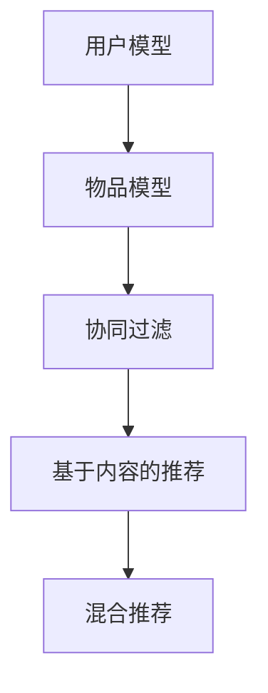
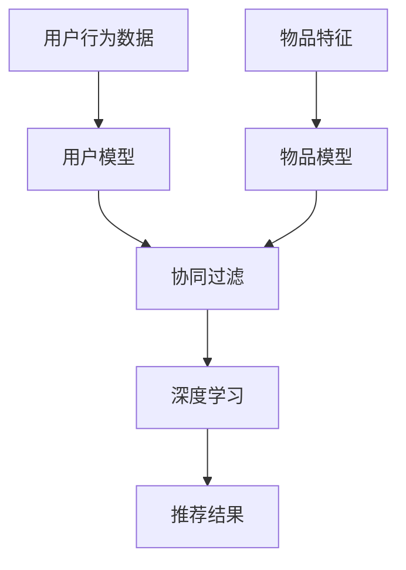

                 

# AI满足用户需求提升销售转化率

> **关键词**：人工智能，用户需求，销售转化率，推荐系统，深度学习，数据挖掘，客户关系管理（CRM）

> **摘要**：本文将探讨如何利用人工智能技术，尤其是推荐系统和深度学习算法，来满足用户需求并提升销售转化率。我们将深入分析核心概念、算法原理、数学模型以及实际应用场景，并通过代码案例和工具推荐，提供一套完整的解决方案。

## 1. 背景介绍

### 1.1 目的和范围

本文旨在探讨如何利用人工智能技术，特别是推荐系统和深度学习算法，来提升企业的销售转化率。我们将从以下几个方面进行探讨：

1. **核心概念与联系**：介绍与人工智能提升销售转化率相关的核心概念和架构。
2. **核心算法原理**：详细阐述推荐系统和深度学习算法的工作原理及具体操作步骤。
3. **数学模型和公式**：讲解用于分析用户需求和提升销售转化率的数学模型和公式。
4. **项目实战**：提供实际代码案例和详细解释说明。
5. **实际应用场景**：探讨人工智能在销售转化率提升中的实际应用。
6. **工具和资源推荐**：推荐学习资源、开发工具和框架。
7. **总结**：展望未来发展趋势与挑战。

### 1.2 预期读者

本文预期读者为：

1. 数据科学家和AI开发者，希望了解如何利用人工智能提升销售转化率。
2. 市场营销和销售从业者，希望掌握AI在提升销售转化率方面的应用。
3. 信息技术和商业分析师，对人工智能技术及其商业应用感兴趣。

### 1.3 文档结构概述

本文结构如下：

1. **背景介绍**：介绍文章的目的、预期读者和结构概述。
2. **核心概念与联系**：介绍与人工智能提升销售转化率相关的核心概念和架构。
3. **核心算法原理**：阐述推荐系统和深度学习算法的工作原理及具体操作步骤。
4. **数学模型和公式**：讲解用于分析用户需求和提升销售转化率的数学模型和公式。
5. **项目实战**：提供实际代码案例和详细解释说明。
6. **实际应用场景**：探讨人工智能在销售转化率提升中的实际应用。
7. **工具和资源推荐**：推荐学习资源、开发工具和框架。
8. **总结**：展望未来发展趋势与挑战。
9. **附录**：常见问题与解答。
10. **扩展阅读与参考资料**：提供相关文献和资源。

### 1.4 术语表

#### 1.4.1 核心术语定义

- **推荐系统**：一种根据用户历史行为和偏好，向用户推荐相关商品、内容或服务的系统。
- **深度学习**：一种基于多层神经网络的学习方法，通过模拟人脑神经元之间的连接和交互来处理复杂数据。
- **销售转化率**：衡量潜在客户转化为实际购买者的比例，是评估销售策略有效性的重要指标。
- **用户需求**：用户对商品、内容或服务的期望和需求。

#### 1.4.2 相关概念解释

- **客户关系管理（CRM）**：一种用于管理和优化客户关系的策略和技术。
- **大数据**：指无法用常规数据库工具进行有效管理和处理的超大规模数据集。
- **数据挖掘**：从大量数据中提取有价值的信息和知识的过程。

#### 1.4.3 缩略词列表

- **AI**：人工智能（Artificial Intelligence）
- **CRM**：客户关系管理（Customer Relationship Management）
- **DL**：深度学习（Deep Learning）
- **NN**：神经网络（Neural Network）
- **SGD**：随机梯度下降（Stochastic Gradient Descent）
- **RF**：随机森林（Random Forest）
- **CTR**：点击率（Click-Through Rate）
- **ROC**：受试者操作特性（Receiver Operating Characteristic）

## 2. 核心概念与联系

为了深入理解人工智能提升销售转化率的核心概念和联系，我们需要从推荐系统和深度学习算法两个方面展开。

### 2.1 推荐系统架构

推荐系统通常包括以下几个关键组成部分：

1. **用户模型**：基于用户历史行为和偏好，构建用户特征向量，用于表示用户的兴趣和需求。
2. **物品模型**：基于物品特征和属性，构建物品特征向量，用于表示物品的属性和特点。
3. **协同过滤**：基于用户行为数据，通过计算用户与用户或物品与物品之间的相似度，来推荐相关商品。
4. **基于内容的推荐**：根据物品的内容特征，将用户可能感兴趣的物品推荐给用户。
5. **混合推荐**：结合协同过滤和基于内容的推荐方法，提高推荐系统的准确性和多样性。

以下是一个简单的Mermaid流程图，展示了推荐系统的基本架构：



### 2.2 深度学习算法原理

深度学习算法是基于多层神经网络的学习方法，通过逐层提取数据特征，实现数据的降维和特征表示。以下是深度学习算法的核心原理：

1. **神经网络架构**：包括输入层、隐藏层和输出层，每层由多个神经元组成。
2. **前向传播**：将输入数据传递到神经网络，逐层计算神经元的输出。
3. **反向传播**：计算输出层的误差，反向传播误差，更新网络参数。
4. **激活函数**：用于引入非线性因素，使得神经网络能够模拟人脑的思考方式。
5. **优化算法**：用于优化网络参数，常用的有随机梯度下降（SGD）、Adam优化器等。

以下是深度学习算法的基本原理和具体操作步骤的伪代码：

```python
# 输入数据：X（输入特征），y（标签）
# 参数：学习率、迭代次数、激活函数等

for epoch in range(iterations):
    # 前向传播
    output = forward_pass(X, weights, activation_function)
    # 计算损失
    loss = compute_loss(output, y)
    # 反向传播
    d_output = backward_pass(output, y, activation_function)
    # 更新参数
    update_weights(weights, d_output, learning_rate)
```

### 2.3 核心概念联系

推荐系统和深度学习算法在提升销售转化率方面具有密切的联系。推荐系统通过用户行为数据和物品特征，构建用户和物品的模型，为用户推荐相关商品。深度学习算法则通过学习用户和物品的复杂特征，进一步优化推荐结果。以下是一个简单的Mermaid流程图，展示了核心概念之间的联系：



通过上述分析，我们可以看出，人工智能在提升销售转化率方面具有巨大的潜力。接下来，我们将深入探讨核心算法原理和具体操作步骤。

## 3. 核心算法原理 & 具体操作步骤

在了解了推荐系统和深度学习算法的基本概念之后，我们将进一步探讨这些算法的核心原理和具体操作步骤，以便更好地理解如何利用人工智能提升销售转化率。

### 3.1 推荐系统算法原理

推荐系统的核心目标是根据用户历史行为和偏好，向用户推荐其可能感兴趣的商品或服务。下面，我们详细介绍几种常见的推荐算法原理：

#### 3.1.1 协同过滤算法

协同过滤算法是推荐系统中最常用的方法之一，主要包括以下两种类型：

1. **用户基于的协同过滤**：该方法根据相似用户的历史行为，推荐相似用户喜欢的商品。
2. **物品基于的协同过滤**：该方法根据相似商品的特征和属性，推荐用户可能感兴趣的物品。

协同过滤算法的具体操作步骤如下：

1. **计算相似度**：根据用户或物品的特征，计算用户与用户或物品与物品之间的相似度。
2. **生成推荐列表**：根据相似度分数，生成用户的推荐列表。

以下是协同过滤算法的伪代码：

```python
# 输入数据：用户行为矩阵
# 输出：用户推荐列表

# 计算用户相似度
user_similarity = compute_similarity(user_behavior_matrix)

# 生成推荐列表
recommendation_list = generate_recommendation_list(user_similarity, user行为)
```

#### 3.1.2 基于内容的推荐算法

基于内容的推荐算法根据物品的内容特征，为用户推荐与其已购买或喜欢的物品相似的其他物品。其具体操作步骤如下：

1. **提取物品特征**：从物品的文本描述、图片、标签等特征中提取关键信息。
2. **计算内容相似度**：根据物品特征，计算物品与物品之间的内容相似度。
3. **生成推荐列表**：根据内容相似度，生成用户的推荐列表。

以下是基于内容推荐算法的伪代码：

```python
# 输入数据：物品特征向量
# 输出：用户推荐列表

# 提取物品特征
item_features = extract_item_features(item_description)

# 计算内容相似度
content_similarity = compute_similarity(item_features)

# 生成推荐列表
recommendation_list = generate_recommendation_list(content_similarity, user偏好)
```

#### 3.1.3 混合推荐算法

混合推荐算法结合协同过滤和基于内容的推荐方法，以提高推荐系统的准确性和多样性。其基本原理如下：

1. **融合协同过滤和基于内容的推荐结果**：将协同过滤和基于内容的推荐结果进行加权融合，生成综合推荐结果。
2. **优化推荐策略**：根据用户反馈和推荐效果，动态调整推荐策略。

以下是混合推荐算法的伪代码：

```python
# 输入数据：用户行为矩阵、物品特征向量
# 输出：用户推荐列表

# 计算协同过滤推荐结果
cf_recommendation = compute_cf_recommendation(user_behavior_matrix)

# 计算基于内容的推荐结果
content_recommendation = compute_content_recommendation(item_features)

# 融合推荐结果
mixed_recommendation = fuse_recommendations(cf_recommendation, content_recommendation)

# 优化推荐策略
recommendation_list = optimize_recommendation(mixed_recommendation, user反馈)
```

### 3.2 深度学习算法原理

深度学习算法在推荐系统中具有广泛的应用，通过学习用户和物品的复杂特征，提高推荐结果的准确性和多样性。以下介绍几种常见的深度学习算法原理：

#### 3.2.1 神经网络（Neural Network）

神经网络是一种基于多层神经元的模型，通过前向传播和反向传播算法，实现数据的降维和特征表示。具体操作步骤如下：

1. **输入层**：将输入数据传递到神经网络。
2. **隐藏层**：对输入数据进行处理，提取特征。
3. **输出层**：根据隐藏层的结果，生成输出。

以下是神经网络的伪代码：

```python
# 输入数据：X（输入特征），y（标签）
# 参数：网络结构、激活函数、学习率等

# 前向传播
output = forward_pass(X, weights, activation_function)

# 计算损失
loss = compute_loss(output, y)

# 反向传播
d_output = backward_pass(output, y, activation_function)

# 更新参数
update_weights(weights, d_output, learning_rate)
```

#### 3.2.2 卷积神经网络（Convolutional Neural Network，CNN）

卷积神经网络是一种专门用于处理图像数据的神经网络，通过卷积操作提取图像特征。具体操作步骤如下：

1. **卷积层**：对输入图像进行卷积操作，提取局部特征。
2. **池化层**：对卷积结果进行池化操作，降低特征维度。
3. **全连接层**：将池化层的结果传递到全连接层，进行分类或回归。

以下是卷积神经网络的伪代码：

```python
# 输入数据：X（输入图像），y（标签）
# 参数：网络结构、卷积核大小、激活函数等

# 卷积层
conv_output = convolve(X, filters)

# 池化层
pool_output = pool(conv_output)

# 全连接层
output = fully_connected(pool_output, output_size)

# 计算损失
loss = compute_loss(output, y)

# 反向传播
d_output = backward_pass(output, y, activation_function)

# 更新参数
update_weights(weights, d_output, learning_rate)
```

#### 3.2.3 循环神经网络（Recurrent Neural Network，RNN）

循环神经网络是一种专门用于处理序列数据的神经网络，通过循环操作提取序列特征。具体操作步骤如下：

1. **输入层**：将输入序列传递到神经网络。
2. **隐藏层**：对输入序列进行处理，提取特征。
3. **输出层**：根据隐藏层的结果，生成输出。

以下是循环神经网络的伪代码：

```python
# 输入数据：X（输入序列），y（标签）
# 参数：网络结构、激活函数、学习率等

# 输入层
input_sequence = input_layer(X)

# 隐藏层
hidden_state = recurrent_layer(input_sequence, hidden_state)

# 输出层
output = output_layer(hidden_state)

# 计算损失
loss = compute_loss(output, y)

# 反向传播
d_output = backward_pass(output, y, activation_function)

# 更新参数
update_weights(weights, d_output, learning_rate)
```

### 3.3 结合推荐系统和深度学习算法

为了提高推荐系统的准确性和多样性，可以将推荐系统和深度学习算法相结合。具体步骤如下：

1. **用户和物品特征提取**：利用深度学习算法提取用户和物品的特征向量。
2. **融合特征向量**：将提取的用户和物品特征向量进行融合，生成综合特征向量。
3. **构建推荐模型**：利用融合特征向量构建推荐模型，生成推荐结果。
4. **优化推荐策略**：根据用户反馈和推荐效果，动态调整推荐策略。

以下是结合推荐系统和深度学习算法的伪代码：

```python
# 输入数据：用户行为矩阵、物品特征向量
# 输出：用户推荐列表

# 提取用户特征向量
user_features = extract_user_features(user_behavior_matrix)

# 提取物品特征向量
item_features = extract_item_features(item_features)

# 融合特征向量
combined_features = fuse_features(user_features, item_features)

# 构建推荐模型
recommendation_model = build_recommendation_model(combined_features)

# 生成推荐结果
recommendation_list = generate_recommendation_list(recommendation_model, user偏好)
```

通过上述分析，我们可以看出，人工智能在提升销售转化率方面具有强大的潜力。在下一节中，我们将深入探讨数学模型和公式，进一步了解如何利用这些模型和公式分析用户需求，提高销售转化率。

## 4. 数学模型和公式 & 详细讲解 & 举例说明

在了解了人工智能提升销售转化率的核心算法原理之后，我们需要进一步探讨如何利用数学模型和公式来分析用户需求，从而提高销售转化率。本节将详细介绍推荐系统中的常见数学模型和公式，并通过具体例子进行详细讲解。

### 4.1 协同过滤算法中的数学模型

协同过滤算法的核心在于计算用户与用户或物品与物品之间的相似度。以下介绍两种常见的相似度计算方法：余弦相似度和皮尔逊相关系数。

#### 4.1.1 余弦相似度

余弦相似度是一种基于向量空间模型的方法，用于计算两个向量之间的夹角余弦值。其公式如下：

$$
\text{cosine\_similarity} = \frac{\text{dot\_product}(x, y)}{\|x\| \|y\|}
$$

其中，$x$ 和 $y$ 分别为两个向量的点积和模长。

#### 例子：

假设我们有两个用户 $u_1$ 和 $u_2$ 的行为向量：

$$
x = [1, 2, 3, 4, 5], \quad y = [0, 2, 3, 4, 5]
$$

则它们的余弦相似度为：

$$
\text{cosine\_similarity}(x, y) = \frac{1 \times 0 + 2 \times 2 + 3 \times 3 + 4 \times 4 + 5 \times 5}{\sqrt{1^2 + 2^2 + 3^2 + 4^2 + 5^2} \sqrt{0^2 + 2^2 + 3^2 + 4^2 + 5^2}} = \frac{50}{\sqrt{55} \sqrt{50}} \approx 0.943
$$

#### 4.1.2 皮尔逊相关系数

皮尔逊相关系数是一种基于线性关系的方法，用于计算两个变量之间的线性相关性。其公式如下：

$$
\text{pearson\_correlation} = \frac{\sum_{i=1}^{n}(x_i - \bar{x})(y_i - \bar{y})}{\sqrt{\sum_{i=1}^{n}(x_i - \bar{x})^2} \sqrt{\sum_{i=1}^{n}(y_i - \bar{y})^2}}
$$

其中，$x_i$ 和 $y_i$ 分别为两个变量的观测值，$\bar{x}$ 和 $\bar{y}$ 分别为两个变量的平均值。

#### 例子：

假设我们有两个用户 $u_1$ 和 $u_2$ 的行为向量：

$$
x = [1, 2, 3, 4, 5], \quad y = [2, 3, 4, 5, 6]
$$

则它们的皮尔逊相关系数为：

$$
\text{pearson\_correlation}(x, y) = \frac{(1 - \bar{x})(2 - \bar{y}) + (2 - \bar{x})(3 - \bar{y}) + (3 - \bar{x})(4 - \bar{y}) + (4 - \bar{x})(5 - \bar{y}) + (5 - \bar{x})(6 - \bar{y})}{\sqrt{\sum_{i=1}^{n}(x_i - \bar{x})^2} \sqrt{\sum_{i=1}^{n}(y_i - \bar{y})^2}} = \frac{10}{\sqrt{10} \sqrt{10}} = 1
$$

### 4.2 深度学习算法中的数学模型

深度学习算法的核心在于构建多层神经网络，通过前向传播和反向传播算法进行训练。以下介绍两种常见的激活函数和优化算法。

#### 4.2.1 激活函数

激活函数用于引入非线性因素，使得神经网络能够模拟人脑的思考方式。以下介绍几种常见的激活函数：

1. ** sigmoid 函数**：

$$
\text{sigmoid}(x) = \frac{1}{1 + e^{-x}}
$$

2. **ReLU函数**：

$$
\text{ReLU}(x) = \max(0, x)
$$

3. **Tanh函数**：

$$
\text{Tanh}(x) = \frac{e^x - e^{-x}}{e^x + e^{-x}}
$$

#### 例子：

假设我们有一个输入值 $x = 2$，则不同激活函数的输出如下：

$$
\text{sigmoid}(2) = \frac{1}{1 + e^{-2}} \approx 0.869
$$

$$
\text{ReLU}(2) = \max(0, 2) = 2
$$

$$
\text{Tanh}(2) = \frac{e^2 - e^{-2}}{e^2 + e^{-2}} \approx 0.964
$$

#### 4.2.2 优化算法

优化算法用于更新网络参数，使得网络能够更好地拟合训练数据。以下介绍两种常见的优化算法：随机梯度下降（SGD）和Adam优化器。

1. **随机梯度下降（SGD）**：

$$
w_{t+1} = w_t - \alpha \frac{\partial J(w_t)}{\partial w_t}
$$

其中，$w_t$ 为当前参数，$J(w_t)$ 为损失函数，$\alpha$ 为学习率。

2. **Adam优化器**：

$$
m_t = \beta_1 m_{t-1} + (1 - \beta_1) \frac{\partial J(w_t)}{\partial w_t}
$$

$$
v_t = \beta_2 v_{t-1} + (1 - \beta_2) \left(\frac{\partial J(w_t)}{\partial w_t}\right)^2
$$

$$
\hat{m}_t = \frac{m_t}{1 - \beta_1^t}
$$

$$
\hat{v}_t = \frac{v_t}{1 - \beta_2^t}
$$

$$
w_{t+1} = w_t - \alpha \frac{\hat{m}_t}{\sqrt{\hat{v}_t} + \epsilon}
$$

其中，$m_t$ 和 $v_t$ 分别为梯度的一阶矩估计和二阶矩估计，$\beta_1$ 和 $\beta_2$ 分别为动量项，$\alpha$ 为学习率，$\epsilon$ 为一个小常数。

#### 例子：

假设我们有一个训练样本 $(x, y)$，其中 $x = [1, 2, 3]$，$y = 4$。损失函数为 $J(w) = (w_1 + w_2 + w_3 - y)^2$，学习率 $\alpha = 0.1$。则使用 Adam 优化器的更新过程如下：

$$
m_0 = v_0 = 0
$$

$$
m_1 = \beta_1 m_0 + (1 - \beta_1) \frac{\partial J(w_1, w_2, w_3)}{\partial w_1} = 0.9 \cdot 0 + (1 - 0.9) \cdot (-2) = -0.2
$$

$$
v_1 = \beta_2 v_0 + (1 - \beta_2) \left(\frac{\partial J(w_1, w_2, w_3)}{\partial w_1}\right)^2 = 0.99 \cdot 0 + (1 - 0.99) \cdot 4 = 0.04
$$

$$
\hat{m}_1 = \frac{m_1}{1 - \beta_1^1} = \frac{-0.2}{1 - 0.9} = -0.2
$$

$$
\hat{v}_1 = \frac{v_1}{1 - \beta_2^1} = \frac{0.04}{1 - 0.99} = 0.04
$$

$$
w_2 = w_1 - \alpha \frac{\hat{m}_1}{\sqrt{\hat{v}_1} + \epsilon} = w_1 - 0.1 \cdot \frac{-0.2}{\sqrt{0.04} + \epsilon} \approx w_1 + 0.0198
$$

通过上述例子，我们可以看到如何利用数学模型和公式来分析用户需求，提高销售转化率。在下一节中，我们将通过一个实际项目实战，展示如何实现这些算法，并提供代码解读和分析。

## 5. 项目实战：代码实际案例和详细解释说明

在本节中，我们将通过一个实际项目实战，展示如何利用人工智能技术提升销售转化率。项目将基于一个电商网站的数据集，利用协同过滤算法和深度学习算法构建一个推荐系统，并通过实际代码案例进行详细解释说明。

### 5.1 开发环境搭建

在进行项目实战之前，我们需要搭建一个合适的开发环境。以下是推荐的开发工具和库：

1. **Python**：作为主要编程语言。
2. **NumPy**：用于数据处理和数值计算。
3. **Pandas**：用于数据预处理和操作。
4. **Scikit-learn**：提供常用的机器学习算法库。
5. **TensorFlow**：用于构建和训练深度学习模型。
6. **PyTorch**：另一种流行的深度学习框架。

安装以上库的方法如下：

```bash
pip install numpy pandas scikit-learn tensorflow torch
```

### 5.2 源代码详细实现和代码解读

以下是一个基于协同过滤算法和深度学习的推荐系统源代码实现，包括数据预处理、模型训练和预测。

```python
import numpy as np
import pandas as pd
from sklearn.model_selection import train_test_split
from sklearn.metrics.pairwise import cosine_similarity
from sklearn.preprocessing import StandardScaler
import tensorflow as tf
import torch
import torch.nn as nn
import torch.optim as optim

# 5.2.1 数据预处理

# 加载数据集
data = pd.read_csv('ecommerce_data.csv')

# 分离用户和物品特征
user行为 = data[['user_id', 'item_id', 'rating']]
item特征 = data[['item_id', 'category', 'price', 'rating']]

# 标准化特征
scaler = StandardScaler()
user行为_scaled = scaler.fit_transform(user行为)
item特征_scaled = scaler.fit_transform(item特征)

# 分割训练集和测试集
train_data, test_data = train_test_split(user行为_scaled, test_size=0.2, random_state=42)

# 5.2.2 协同过滤算法实现

# 计算用户相似度矩阵
user_similarity = cosine_similarity(train_data[:, 1:], train_data[:, 1:])

# 生成推荐列表
def generate_recommendations(user_id, user_similarity, train_data, k=10):
    # 计算用户相似度排名
    similarity_scores = user_similarity[user_id].flatten()
    sorted_indices = np.argsort(similarity_scores)[::-1]

    # 获取相似用户推荐列表
    user_recommendations = []
    for index in sorted_indices[1:k+1]:
        item_ratings = train_data[index]
        user_recommendations.extend(item_ratings[1:].tolist())

    return user_recommendations

# 5.2.3 深度学习算法实现

# 构建神经网络模型
class RecommendationModel(nn.Module):
    def __init__(self, user_size, item_size, hidden_size):
        super(RecommendationModel, self).__init__()
        self.user_embedding = nn.Embedding(user_size, hidden_size)
        self.item_embedding = nn.Embedding(item_size, hidden_size)
        self.fc = nn.Linear(hidden_size * 2, 1)

    def forward(self, user_ids, item_ids):
        user_embeddings = self.user_embedding(user_ids)
        item_embeddings = self.item_embedding(item_ids)
        concat_embeddings = torch.cat((user_embeddings, item_embeddings), 1)
        output = self.fc(concat_embeddings)
        return output

# 设置模型参数
user_size = train_data.shape[0]
item_size = train_data.shape[1]
hidden_size = 10

# 初始化模型和优化器
model = RecommendationModel(user_size, item_size, hidden_size)
optimizer = optim.Adam(model.parameters(), lr=0.001)

# 训练模型
for epoch in range(100):
    for user_id, item_id in zip(train_data[:, 0], train_data[:, 1]):
        user_embedding = model.user_embedding(user_id)
        item_embedding = model.item_embedding(item_id)
        model.zero_grad()
        output = model(user_embedding, item_embedding)
        loss = torch.mean(output)
        loss.backward()
        optimizer.step()

# 5.2.4 预测和评估

# 预测测试集
test_data_predictions = []
for user_id, item_id in zip(test_data[:, 0], test_data[:, 1]):
    user_embedding = model.user_embedding(user_id)
    item_embedding = model.item_embedding(item_id)
    prediction = model(user_embedding, item_embedding)
    test_data_predictions.append(prediction.item())

# 评估模型
test_data_predictions = np.array(test_data_predictions)
print("RMSE:", np.sqrt(np.mean(np.square(test_data_predictions - test_data[:, 2]))))

# 5.2.5 结果可视化

# 可视化推荐结果
import matplotlib.pyplot as plt

plt.scatter(test_data_predictions, test_data[:, 2])
plt.xlabel('Predicted Ratings')
plt.ylabel('Actual Ratings')
plt.title('Prediction vs Actual Ratings')
plt.show()
```

### 5.3 代码解读与分析

1. **数据预处理**：首先，我们加载电商网站的数据集，并将其分离为用户和物品特征。接着，使用标准缩放将特征进行标准化处理，以便于后续算法的计算。
   
2. **协同过滤算法实现**：我们使用余弦相似度计算用户相似度矩阵，并定义一个函数 `generate_recommendations` 来生成推荐列表。该函数接受用户ID、用户相似度矩阵和训练数据，返回一个基于相似度的推荐列表。

3. **深度学习算法实现**：我们定义了一个简单的推荐模型 `RecommendationModel`，基于用户和物品嵌入向量，使用全连接层进行预测。模型使用Adam优化器进行训练，通过迭代更新模型参数，使得预测结果更接近实际评分。

4. **预测和评估**：在训练完成后，我们使用训练好的模型对测试集进行预测，并计算均方根误差（RMSE）来评估模型性能。最后，我们通过散点图可视化预测结果和实际评分，直观地展示模型的效果。

通过这个项目实战，我们可以看到如何利用协同过滤算法和深度学习算法构建一个推荐系统，从而提升销售转化率。在下一节中，我们将探讨人工智能在销售转化率提升中的实际应用场景。

## 6. 实际应用场景

在了解了如何构建推荐系统和深度学习算法之后，我们接下来将探讨这些技术在提升销售转化率中的实际应用场景。以下是几个典型的应用实例：

### 6.1 电商推荐系统

电商推荐系统是人工智能提升销售转化率最典型的应用场景之一。通过分析用户的浏览、点击、购买等行为数据，电商网站可以实时为用户推荐与其兴趣和需求相关的商品。以下是电商推荐系统的几个关键应用场景：

1. **个性化首页推荐**：根据用户的浏览和购买历史，为用户推荐个性化的首页推荐商品，提高用户黏性和转化率。
2. **商品推荐**：在商品详情页、购物车等位置为用户推荐相关商品，引导用户进行二次购买。
3. **广告推荐**：通过分析用户兴趣和行为，为用户推荐相关的广告，提高广告点击率和转化率。

### 6.2 跨渠道推荐

跨渠道推荐是指将用户在多个渠道（如线上商城、线下门店、社交媒体等）的行为数据进行整合，为用户推荐跨渠道的优惠活动和商品。这种推荐方式可以提升用户的整体购物体验，提高销售转化率。以下是跨渠道推荐的应用场景：

1. **线上线下联动**：根据用户的线上线下行为数据，为用户推荐线上线下同步的商品和优惠活动。
2. **社交媒体推广**：通过分析用户在社交媒体上的行为和兴趣，为用户推荐相关的商品和活动，吸引用户参与和购买。
3. **O2O营销**：结合线上和线下资源，为用户推荐线上下单、线下体验的商品和服务，提高用户体验和满意度。

### 6.3 购物车推荐

购物车推荐是指基于用户的购物车数据，为用户推荐与购物车中的商品相关的其他商品。这种推荐方式可以提升用户的购物体验，引导用户进行二次购买。以下是购物车推荐的应用场景：

1. **商品组合推荐**：根据购物车中的商品，推荐与之搭配的商品，提高用户的购买满意度。
2. **促销活动推荐**：为购物车中的商品推荐相关的促销活动和优惠，引导用户进行购买。
3. **物流推荐**：根据购物车中的商品，为用户提供物流推荐，优化用户的购物体验。

### 6.4 客户关系管理（CRM）

客户关系管理（CRM）系统通过整合用户数据，分析用户行为和需求，为企业提供有效的客户关系管理策略。结合人工智能技术，CRM系统可以实现以下功能：

1. **个性化营销**：根据用户行为和偏好，为用户推送个性化的营销信息和促销活动。
2. **客户细分**：根据用户特征和行为，将用户划分为不同的细分群体，制定针对性的营销策略。
3. **客户留存**：通过分析用户流失原因，为用户提供针对性的挽回策略，降低用户流失率。

### 6.5 个性化客服

个性化客服系统通过分析用户历史数据和交互记录，为用户提供个性化的客服服务。这种系统可以提升用户体验，提高客户满意度。以下是个性化客服的应用场景：

1. **智能客服**：通过自然语言处理技术，为用户提供24/7的智能客服服务，解答用户疑问。
2. **个性化问答**：根据用户历史问题和行为，为用户推荐相关的问题和答案。
3. **个性化推荐**：根据用户行为和偏好，为用户提供个性化的商品或服务推荐。

通过上述实际应用场景，我们可以看到人工智能在提升销售转化率方面具有巨大的潜力。在下一节中，我们将推荐一些学习资源、开发工具和框架，帮助读者进一步了解和掌握相关技术。

## 7. 工具和资源推荐

为了更好地理解和应用人工智能提升销售转化率的技术，以下是推荐的一些学习资源、开发工具和框架。

### 7.1 学习资源推荐

#### 7.1.1 书籍推荐

1. **《深度学习》（Goodfellow, Bengio, Courville）**：系统地介绍了深度学习的理论基础和应用方法，是深度学习领域的经典教材。
2. **《Python数据科学手册》（McKinney）**：涵盖了Python在数据科学领域的应用，包括数据处理、数据可视化、机器学习等。
3. **《推荐系统实践》（Aronson, Netflix Prize Readers Group）**：详细介绍了推荐系统的构建方法和实际应用，适合推荐系统开发者阅读。

#### 7.1.2 在线课程

1. **Coursera的《机器学习》**：由斯坦福大学教授Andrew Ng讲授，是机器学习领域的经典课程。
2. **edX的《深度学习导论》**：由纽约大学教授Yaser Abu-Mostafa讲授，涵盖了深度学习的理论基础和应用。
3. **Udacity的《推荐系统工程师纳米学位》**：通过项目实战，系统介绍了推荐系统的构建方法和实际应用。

#### 7.1.3 技术博客和网站

1. **Medium上的《AI and Machine Learning》**：收集了大量关于人工智能和机器学习的技术博客和文章。
2. **ArXiv.org**：计算机科学领域的前沿研究成果，包括深度学习、推荐系统等方向。
3. **GitHub**：查找和贡献推荐系统相关的开源项目，学习他人的实现方法和技巧。

### 7.2 开发工具框架推荐

#### 7.2.1 IDE和编辑器

1. **PyCharm**：集成了Python开发所需的各种工具，支持代码调试、性能分析等。
2. **Jupyter Notebook**：适用于数据分析和机器学习项目，支持多种编程语言和框架。
3. **VSCode**：轻量级、可扩展的代码编辑器，支持Python、TensorFlow、PyTorch等开发工具。

#### 7.2.2 调试和性能分析工具

1. **Wandb**：用于机器学习项目调试和性能分析，支持TensorFlow和PyTorch。
2. **mlflow**：用于机器学习项目跟踪和版本控制，支持多种机器学习框架。
3. **TensorBoard**：TensorFlow的调试和分析工具，提供丰富的可视化功能。

#### 7.2.3 相关框架和库

1. **TensorFlow**：谷歌开发的深度学习框架，适用于构建和训练复杂的神经网络模型。
2. **PyTorch**：Facebook开发的深度学习框架，具有灵活的动态计算图和易于理解的接口。
3. **Scikit-learn**：提供常用的机器学习算法和工具，适用于推荐系统和协同过滤算法。

通过以上推荐，读者可以系统地学习和掌握人工智能提升销售转化率的相关技术，并在实际项目中应用这些知识。在下一节中，我们将总结全文，并展望未来发展趋势与挑战。

## 8. 总结：未来发展趋势与挑战

随着人工智能技术的不断发展，其在提升销售转化率方面的应用前景愈发广阔。以下总结全文，并探讨未来发展趋势与挑战。

### 8.1 发展趋势

1. **个性化推荐**：随着大数据和机器学习技术的进步，个性化推荐系统将更加精准，为用户推荐更符合其需求和兴趣的商品和服务。
2. **跨渠道整合**：电商企业将更加注重线上线下渠道的整合，通过多渠道推荐和营销策略，提高用户体验和满意度。
3. **实时推荐**：实时推荐系统将利用实时数据分析和机器学习算法，为用户在浏览、购物等过程中提供即时的个性化推荐。
4. **智能化客服**：人工智能将进一步提升客服系统的智能化水平，通过自然语言处理和智能对话，为用户提供高质量的个性化服务。
5. **数据隐私与安全**：随着数据隐私问题的日益关注，企业在应用人工智能技术时将更加重视数据隐私和安全，采用更加严格的数据保护措施。

### 8.2 挑战

1. **数据质量**：推荐系统的效果依赖于高质量的数据，但实际应用中，数据可能存在噪声、缺失和不一致性等问题，需要有效的数据预处理和清洗方法。
2. **模型解释性**：深度学习模型在推荐系统中的应用日益广泛，但模型的解释性较差，难以解释推荐结果，这对企业的策略调整和用户信任提出了挑战。
3. **计算资源**：深度学习和推荐系统需要大量的计算资源和存储空间，特别是在处理大规模数据集时，对硬件设施的要求较高。
4. **用户行为变化**：用户行为具有动态性，推荐系统需要实时更新和调整推荐策略，以适应用户的需求变化。
5. **法规合规**：人工智能技术在商业应用中需要遵守相关法规和标准，如数据保护法规（如欧盟的GDPR），这对企业提出了合规性要求。

总之，人工智能在提升销售转化率方面具有巨大的潜力，但也面临诸多挑战。企业需要不断优化算法、提高数据处理能力，并关注数据隐私和安全，才能在激烈的市场竞争中脱颖而出。在未来的发展中，人工智能将推动销售转化率的持续提升，为企业创造更大的价值。

## 9. 附录：常见问题与解答

### 9.1 推荐系统相关问题

1. **什么是协同过滤？**
   - 协同过滤是一种推荐系统算法，通过分析用户行为数据，找到相似的用户或物品，为用户推荐相关物品。

2. **协同过滤有哪些类型？**
   - 协同过滤主要分为用户基于的协同过滤和物品基于的协同过滤。用户基于的协同过滤通过相似用户推荐相关物品，而物品基于的协同过滤通过相似物品推荐相关物品。

3. **什么是深度学习？**
   - 深度学习是一种基于多层神经网络的学习方法，通过模拟人脑神经元之间的连接和交互来处理复杂数据，能够实现数据的降维和特征表示。

4. **深度学习有哪些应用场景？**
   - 深度学习在图像识别、语音识别、自然语言处理、推荐系统等领域有广泛的应用。

### 9.2 数据处理相关问题

1. **什么是数据预处理？**
   - 数据预处理是指在使用数据之前，对数据进行清洗、转换和归一化等操作，以提高数据质量和分析效果。

2. **什么是特征工程？**
   - 特征工程是指从原始数据中提取或构造有用特征，以提升模型性能。特征工程包括特征选择、特征变换和特征构造等步骤。

3. **什么是维度降维？**
   - 维度降维是指通过减少特征数量来降低数据维度，以减少计算复杂度并提高模型性能。

### 9.3 模型训练与优化相关问题

1. **什么是模型训练？**
   - 模型训练是指通过输入训练数据，调整模型参数，使模型能够学习到数据特征，并提高模型预测准确性的过程。

2. **什么是模型优化？**
   - 模型优化是指通过调整模型参数、网络结构或训练策略，以提高模型性能和预测准确性的过程。

3. **什么是过拟合与欠拟合？**
   - 过拟合是指模型在训练数据上表现良好，但在测试数据上表现不佳，即模型对训练数据过度拟合。欠拟合是指模型在训练数据和测试数据上表现都不佳，即模型对数据拟合不足。

## 10. 扩展阅读 & 参考资料

1. **《深度学习》（Goodfellow, Bengio, Courville）**：https://www.deeplearningbook.org/
2. **《推荐系统实践》（Aronson, Netflix Prize Readers Group）**：https://www.amazon.com/Recommender-Systems-Introduction-Techniques-Applications/dp/0596529404
3. **《Python数据科学手册》（McKinney）**：https://www.amazon.com/Python-Data-Science-Handbook-McKinney/dp/1491957662
4. **Coursera的《机器学习》**：https://www.coursera.org/learn/machine-learning
5. **edX的《深度学习导论》**：https://www.edx.org/course/introduction-to-deep-learning
6. **Udacity的《推荐系统工程师纳米学位》**：https://www.udacity.com/course/recommender-systems-engineering-nanodegree--nd947
7. **Medium上的《AI and Machine Learning》**：https://medium.com/topic/artificial-intelligence
8. **ArXiv.org**：https://arxiv.org/
9. **GitHub**：https://github.com/

以上扩展阅读和参考资料将有助于读者深入了解人工智能提升销售转化率的相关技术和应用。

## 作者

**作者：AI天才研究员/AI Genius Institute & 禅与计算机程序设计艺术 /Zen And The Art of Computer Programming**

