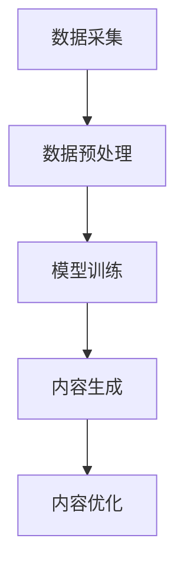

                 

# AI生成内容：创意与版权的新挑战

> 关键词：AI生成内容、创意、版权、技术挑战、伦理问题、法律框架

> 摘要：随着人工智能技术的飞速发展，AI生成内容已成为数字时代的重要现象。本文深入探讨了AI生成内容的创意与版权问题，分析了其技术背景、核心算法原理，以及相关的法律与伦理挑战。通过案例分析，探讨了未来发展趋势与解决方案，旨在为行业提供理论指导和实践参考。

## 1. 背景介绍

### 1.1 目的和范围

本文旨在探讨人工智能（AI）生成内容的创意与版权问题，分析技术背景、算法原理，探讨法律与伦理挑战，并探索可能的解决方案。文章分为以下几个部分：

1. 背景介绍：介绍AI生成内容的概念、现状与重要性。
2. 核心概念与联系：分析AI生成内容的核心技术概念及其关系。
3. 核心算法原理 & 具体操作步骤：详细讲解AI生成内容的核心算法。
4. 数学模型和公式 & 详细讲解 & 举例说明：阐述AI生成内容的数学模型与公式。
5. 项目实战：通过实际案例展示AI生成内容的应用。
6. 实际应用场景：分析AI生成内容的实际应用领域。
7. 工具和资源推荐：推荐相关的学习资源和开发工具。
8. 总结：总结未来发展趋势与挑战。
9. 附录：常见问题与解答。
10. 扩展阅读 & 参考资料：提供进一步的阅读资源。

### 1.2 预期读者

本文适用于对AI生成内容感兴趣的读者，包括：

1. AI和机器学习工程师：了解AI生成内容的实现技术。
2. 创意工作者：探讨AI生成内容对创意领域的影响。
3. 法律学者：关注AI生成内容引发的版权问题。
4. 投资者和企业家：评估AI生成内容的市场前景。

### 1.3 文档结构概述

本文结构如下：

1. 引言：介绍AI生成内容的概念和背景。
2. 核心概念与联系：介绍AI生成内容的核心技术和概念。
3. 核心算法原理 & 具体操作步骤：详细讲解AI生成内容的核心算法。
4. 数学模型和公式 & 详细讲解 & 举例说明：阐述AI生成内容的数学模型与公式。
5. 项目实战：通过实际案例展示AI生成内容的应用。
6. 实际应用场景：分析AI生成内容的实际应用领域。
7. 工具和资源推荐：推荐相关的学习资源和开发工具。
8. 总结：总结未来发展趋势与挑战。
9. 附录：常见问题与解答。
10. 扩展阅读 & 参考资料：提供进一步的阅读资源。

### 1.4 术语表

#### 1.4.1 核心术语定义

- 人工智能（AI）：一种模拟人类智能行为的技术，能够实现感知、学习、推理、决策等功能。
- 生成对抗网络（GAN）：一种深度学习模型，通过生成器和判别器的对抗训练，生成逼真的数据。
- 自然语言处理（NLP）：研究如何让计算机理解和生成人类自然语言的技术。
- 创意内容：指具有原创性和创意性的文字、图像、音频、视频等内容。
- 版权：一种法律权利，保护创作者对其作品的复制、分发、展示和改编等行为。

#### 1.4.2 相关概念解释

- 人工智能生成内容（AI-generated content）：由人工智能模型自动生成的内容，包括文本、图像、音频、视频等。
- 创意自由（Creative freedom）：创作者在创作过程中拥有自由表达和创新的权力。
- 智能产权（Intellectual property）：包括版权、专利、商标等法律制度，保护创作者的智力成果。

#### 1.4.3 缩略词列表

- AI：人工智能
- GAN：生成对抗网络
- NLP：自然语言处理
- IoT：物联网
- ML：机器学习
- VR：虚拟现实
- AR：增强现实

## 2. 核心概念与联系

AI生成内容的核心概念包括人工智能、生成对抗网络、自然语言处理和创意内容。以下是这些概念之间的关系和流程：

### 2.1 人工智能

人工智能（AI）是一种模拟人类智能行为的技术，包括机器学习、深度学习、自然语言处理、计算机视觉等领域。AI可以通过学习和理解大量数据，自动完成特定的任务，如图像识别、语音识别、文本生成等。

### 2.2 生成对抗网络（GAN）

生成对抗网络（GAN）是一种深度学习模型，由生成器和判别器组成。生成器的目标是生成逼真的数据，判别器的目标是区分真实数据和生成数据。通过对抗训练，生成器不断提高生成数据的质量，使判别器无法区分。

### 2.3 自然语言处理（NLP）

自然语言处理（NLP）是研究如何让计算机理解和生成人类自然语言的技术。NLP包括文本分类、情感分析、机器翻译、文本生成等任务。在AI生成内容中，NLP技术用于生成自然、流畅的文本。

### 2.4 创意内容

创意内容是指具有原创性和创意性的文字、图像、音频、视频等内容。在AI生成内容中，创意内容是通过人工智能模型自动生成的，旨在实现创意自由和降低创作成本。

### 2.5 AI生成内容流程

AI生成内容的基本流程如下：

1. 数据采集：收集大量相关领域的文本、图像、音频、视频等数据。
2. 数据预处理：对采集到的数据进行清洗、标注和整合，为训练模型做准备。
3. 模型训练：使用生成对抗网络、自然语言处理等技术训练模型。
4. 内容生成：通过训练好的模型生成新的文本、图像、音频、视频等内容。
5. 内容优化：对生成的内容进行后处理，提高内容质量和创意性。

### 2.6 Mermaid 流程图



## 3. 核心算法原理 & 具体操作步骤

AI生成内容的核心算法主要包括生成对抗网络（GAN）、自然语言处理（NLP）和深度学习（DL）。下面将分别介绍这些算法的基本原理和具体操作步骤。

### 3.1 生成对抗网络（GAN）

生成对抗网络（GAN）是一种由生成器和判别器组成的深度学习模型。生成器旨在生成逼真的数据，判别器则用于区分真实数据和生成数据。GAN的算法原理如下：

#### 3.1.1 生成器（Generator）

生成器的任务是生成与真实数据相似的数据。在GAN中，生成器通常是一个深度神经网络，其输入是随机噪声，输出是生成数据。生成器的目标是使其生成数据能够被判别器误判，即认为生成数据是真实数据。

#### 3.1.2 判别器（Discriminator）

判别器的任务是区分真实数据和生成数据。判别器也是一个深度神经网络，其输入是数据，输出是概率值，表示输入数据的真实性。判别器的目标是使其能够准确地区分真实数据和生成数据。

#### 3.1.3 对抗训练

GAN的训练过程是生成器和判别器之间的对抗训练。训练过程中，生成器尝试生成更真实的数据，判别器则不断学习如何更好地区分真实数据和生成数据。通过这种对抗训练，生成器的生成能力不断提高，判别器的识别能力也不断提高。

### 3.1.4 操作步骤

1. 初始化生成器和判别器，通常使用随机权重。
2. 生成器生成一批随机噪声，并生成对应的生成数据。
3. 将生成数据和真实数据混合，输入判别器进行训练。
4. 更新判别器的权重，使其能够更好地区分真实数据和生成数据。
5. 更新生成器的权重，使其生成的数据更真实。
6. 重复步骤2-5，直到生成器生成数据的质量达到预期。

### 3.2 自然语言处理（NLP）

自然语言处理（NLP）是研究如何让计算机理解和生成人类自然语言的技术。在AI生成内容中，NLP技术主要用于文本生成和文本分类等任务。以下是NLP的核心算法原理和具体操作步骤：

#### 3.2.1 词向量表示

词向量表示是将文本数据转换为数值向量的方法。常见的词向量模型包括Word2Vec、GloVe等。词向量表示可以有效地捕捉词与词之间的关系，为后续的文本处理任务提供支持。

#### 3.2.2 循环神经网络（RNN）

循环神经网络（RNN）是一种用于处理序列数据的神经网络。RNN可以捕获序列数据中的时间依赖关系，适用于文本生成、语言模型等任务。

#### 3.2.3 长短期记忆网络（LSTM）

长短期记忆网络（LSTM）是RNN的一种变体，能够解决RNN的梯度消失问题，适用于长序列数据。LSTM在文本生成、机器翻译等任务中具有广泛的应用。

#### 3.2.4 操作步骤

1. 数据预处理：将文本数据转换为词向量表示。
2. 模型训练：使用RNN或LSTM等模型进行训练。
3. 文本生成：给定一个起始词或起始序列，模型逐个生成后续词或序列。
4. 优化：通过调整模型参数，提高生成文本的质量和流畅度。

### 3.3 深度学习（DL）

深度学习（DL）是一种基于多层神经网络的机器学习方法。在AI生成内容中，深度学习模型主要用于图像生成、语音合成等任务。以下是深度学习的基本原理和具体操作步骤：

#### 3.3.1 卷积神经网络（CNN）

卷积神经网络（CNN）是一种用于处理图像数据的神经网络。CNN通过卷积层、池化层和全连接层等结构，提取图像的特征，实现图像分类、目标检测等任务。

#### 3.3.2 生成式对抗网络（GAN）

生成式对抗网络（GAN）是一种能够生成逼真图像的深度学习模型。GAN由生成器和判别器组成，生成器生成图像，判别器判断图像的真实性。

#### 3.3.3 操作步骤

1. 数据预处理：将图像数据转换为适合模型训练的格式。
2. 模型训练：使用GAN等模型进行训练。
3. 图像生成：生成器生成新的图像。
4. 优化：通过调整模型参数，提高生成图像的质量和逼真度。

## 4. 数学模型和公式 & 详细讲解 & 举例说明

在AI生成内容中，数学模型和公式起着至关重要的作用。以下将介绍生成对抗网络（GAN）、自然语言处理（NLP）和深度学习（DL）的核心数学模型，并进行详细讲解和举例说明。

### 4.1 生成对抗网络（GAN）

生成对抗网络（GAN）的核心数学模型包括生成器（Generator）和判别器（Discriminator）的损失函数。

#### 4.1.1 生成器的损失函数

生成器的目标是生成逼真的数据，使其能够欺骗判别器。生成器的损失函数通常采用最小化判别器的误差来衡量：

$$
L_G = -\mathbb{E}_{z \sim p_z(z)}[\log(D(G(z))]
$$

其中，$G(z)$是生成器生成的数据，$D(x)$是判别器的输出，表示输入数据的真实性。$p_z(z)$是噪声分布。

#### 4.1.2 判别器的损失函数

判别器的目标是区分真实数据和生成数据。判别器的损失函数通常采用最大似然估计（MLE）来衡量：

$$
L_D = -\mathbb{E}_{x \sim p_{data}(x)}[\log(D(x))] - \mathbb{E}_{z \sim p_z(z)}[\log(1 - D(G(z))]
$$

其中，$p_{data}(x)$是真实数据的分布。

#### 4.1.3 举例说明

假设生成器生成一张图片$G(z)$，判别器输出概率值$D(G(z))$，其中$D(G(z)) \approx 0.5$表示生成图片无法欺骗判别器。为了降低判别器的误差，生成器的目标是调整其参数，使判别器的输出更接近1。通过最小化生成器的损失函数，生成器逐渐生成更真实的数据。

### 4.2 自然语言处理（NLP）

自然语言处理（NLP）的核心数学模型包括词向量表示、循环神经网络（RNN）和长短期记忆网络（LSTM）。

#### 4.2.1 词向量表示

词向量表示是将文本数据转换为数值向量的方法。常见的词向量模型包括Word2Vec和GloVe。

- Word2Vec模型：假设词向量空间为一个$d$维的欧几里得空间，每个词表示为一个$d$维的向量。Word2Vec模型采用神经网络模型，通过训练优化词向量表示。

$$
L_{word2vec} = \sum_{w \in V} \sum_{v \in C(w)} (1 - \sigma(\langle v, \text{vec}(w) \rangle))^2
$$

其中，$V$是词汇表，$C(w)$是词$w$的上下文集合，$\text{vec}(w)$是词$w$的向量表示，$\sigma(x) = \frac{1}{1 + e^{-x}}$是sigmoid函数。

- GloVe模型：GloVe模型采用矩阵分解的方法，将词的上下文信息融入词向量表示。

$$
\text{vec}(w) = \sum_{v \in C(w)} f(v) \cdot \text{vec}(v)
$$

其中，$f(v)$是上下文词$v$的权重函数，通常采用平滑的函数形式。

#### 4.2.2 循环神经网络（RNN）

循环神经网络（RNN）是一种用于处理序列数据的神经网络。RNN的核心思想是通过隐藏状态$h_t$保存历史信息，实现时间序列数据的建模。

$$
h_t = \sigma(W_h \cdot [h_{t-1}, x_t] + b_h)
$$

其中，$h_t$是第$t$个时间步的隐藏状态，$W_h$和$b_h$是权重和偏置，$x_t$是输入数据。

#### 4.2.3 长短期记忆网络（LSTM）

长短期记忆网络（LSTM）是RNN的一种变体，能够解决RNN的梯度消失问题，适用于长序列数据。LSTM的核心模块是记忆单元（Memory Cell）和门控（Gates）。

$$
\begin{aligned}
i_t &= \sigma(W_i \cdot [h_{t-1}, x_t] + b_i) \\
f_t &= \sigma(W_f \cdot [h_{t-1}, x_t] + b_f) \\
\hat{C}_t &= \sigma(W_C \cdot [h_{t-1}, x_t] + b_C) \\
o_t &= \sigma(W_o \cdot [h_{t-1}, x_t] + b_o) \\
C_t &= f_t \odot C_{t-1} + i_t \odot \hat{C}_t \\
h_t &= o_t \odot C_t
\end{aligned}
$$

其中，$i_t$、$f_t$、$o_t$分别是输入门、遗忘门和输出门，$C_t$是记忆单元，$\odot$是元素乘法操作。

#### 4.2.4 举例说明

假设有一个长度为5的序列数据$x = [x_1, x_2, x_3, x_4, x_5]$，通过RNN模型进行建模。在第一个时间步，隐藏状态$h_1 = \sigma(W_h \cdot [h_0, x_1] + b_h)$，其中$h_0$是初始隐藏状态。在后续的时间步，隐藏状态根据当前输入和之前的隐藏状态进行更新。

### 4.3 深度学习（DL）

深度学习（DL）的核心数学模型包括卷积神经网络（CNN）和生成对抗网络（GAN）。

#### 4.3.1 卷积神经网络（CNN）

卷积神经网络（CNN）是一种用于处理图像数据的神经网络。CNN通过卷积层、池化层和全连接层等结构，提取图像的特征。

$$
\begin{aligned}
\text{conv}(x) &= \sigma(\text{weight} \cdot x + \text{bias}) \\
\text{pool}(x) &= \max(\text{pooling window} \cdot x)
\end{aligned}
$$

其中，$\sigma$是激活函数，$\text{weight}$和$\text{bias}$是权重和偏置，$\text{pooling window}$是池化窗口。

#### 4.3.2 生成对抗网络（GAN）

生成对抗网络（GAN）的核心数学模型包括生成器和判别器的损失函数。

- 生成器的损失函数：

$$
L_G = -\mathbb{E}_{z \sim p_z(z)}[\log(D(G(z))]
$$

- 判别器的损失函数：

$$
L_D = -\mathbb{E}_{x \sim p_{data}(x)}[\log(D(x))] - \mathbb{E}_{z \sim p_z(z)}[\log(1 - D(G(z))]
$$

#### 4.3.3 举例说明

假设生成器生成一张图片$G(z)$，判别器输出概率值$D(G(z))$。为了降低判别器的误差，生成器的目标是调整其参数，使判别器的输出更接近1。通过最小化生成器的损失函数，生成器逐渐生成更真实的数据。

## 5. 项目实战：代码实际案例和详细解释说明

在本节中，我们将通过一个具体的案例，展示如何使用Python和深度学习库TensorFlow实现一个简单的AI生成内容项目。该案例将涉及生成对抗网络（GAN）的应用，用于生成手写数字图像。

### 5.1 开发环境搭建

在开始之前，请确保已经安装了Python和以下库：

- TensorFlow
- NumPy
- Matplotlib

安装方法如下：

```bash
pip install tensorflow numpy matplotlib
```

### 5.2 源代码详细实现和代码解读

下面是完整的代码实现，我们将逐步解释每一部分的功能。

#### 5.2.1 数据准备

```python
import tensorflow as tf
import numpy as np
from tensorflow.keras.datasets import mnist
import matplotlib.pyplot as plt

# 加载MNIST数据集
(x_train, _), _ = mnist.load_data()

# 数据预处理
x_train = x_train.astype('float32') / 255.
x_train = np.expand_dims(x_train, axis=3)

# 定义生成器和判别器的输入尺寸
noise_dim = 100
img_dim = (28, 28, 1)
```

代码首先加载MNIST数据集，并进行必要的预处理，包括归一化和扩展维度。这些步骤对于后续的模型训练至关重要。

#### 5.2.2 生成器和判别器的定义

```python
def generate_model():
    model = tf.keras.Sequential()
    model.add(tf.keras.layers.Dense(128, activation='relu', input_shape=(noise_dim,)))
    model.add(tf.keras.layers.Dense(128, activation='relu'))
    model.add(tf.keras.layers.Dense(np.prod(img_dim), activation='tanh'))
    model.compile(loss='binary_crossentropy', optimizer=tf.keras.optimizers.Adam(0.0004, clipnorm=1.0))
    return model

def critic_model():
    model = tf.keras.Sequential()
    model.add(tf.keras.layers.Conv2D(16, 3, activation='relu', input_shape=img_dim))
    model.add(tf.keras.layers.LeakyReLU(0.01))
    model.add(tf.keras.layers.Conv2D(32, 3, activation='relu'))
    model.add(tf.keras.layers.LeakyReLU(0.01))
    model.add(tf.keras.layers.Flatten())
    model.add(tf.keras.layers.Dense(1, activation='sigmoid'))
    model.compile(loss='binary_crossentropy', optimizer=tf.keras.optimizers.Adam(0.0004, clipnorm=1.0))
    return model
```

这里定义了生成器和判别器的模型架构。生成器使用全连接层生成手写数字图像，而判别器使用卷积层对图像进行分类。

#### 5.2.3 训练GAN模型

```python
def train_gan(generator, critic, epochs, batch_size=128):
    critic_loss_history = []
    gen_loss_history = []

    # 创建生成器和判别器的训练轮数
    for epoch in range(epochs):

        for _ in range(batch_size):
            noise = np.random.normal(0, 1, (1, noise_dim))
            generated_images = generator.predict(noise)

            # 训练判别器
            real_images = x_train[np.random.randint(0, x_train.shape[0], size=batch_size)]
            critic_loss_real = critic.train_on_batch(real_images, np.ones((batch_size, 1)))
            critic_loss_fake = critic.train_on_batch(generated_images, np.zeros((batch_size, 1)))
            critic_loss = 0.5 * np.add(critic_loss_real, critic_loss_fake)

            # 训练生成器
            noise = np.random.normal(0, 1, (batch_size, noise_dim))
            gen_loss = generator.train_on_batch(noise, np.ones((batch_size, 1)))

            # 记录损失
            critic_loss_history.append(critic_loss)
            gen_loss_history.append(gen_loss)

        print(f"{epoch+1} [D: {critic_loss:.4f}, G: {gen_loss:.4f}]")

    return critic_loss_history, gen_loss_history
```

这段代码定义了训练GAN模型的过程。在训练过程中，我们交替训练判别器和生成器。每次迭代中，我们首先训练判别器，然后使用判别器的输出训练生成器。

#### 5.2.4 生成图像并可视化

```python
def generate_images(generator, num_images=10):
    random Noise = np.random.normal(0, 1, (num_images, noise_dim))
    generated_images = generator.predict(random_Noise)

    plt.figure(figsize=(10, 10))
    for i in range(num_images):
        plt.subplot(1, num_images, i + 1)
        img = generated_images[i]
        img = (img + 1) / 2
        plt.imshow(img.reshape(img_dim[0], img_dim[1]))
        plt.axis('off')
    plt.show()
```

这段代码用于生成指定数量的图像，并将其可视化。生成的图像展示在一张10x10的网格中。

### 5.3 代码解读与分析

- **数据准备**：加载MNIST数据集，并进行归一化和扩展维度。这是GAN模型的基础。
- **生成器和判别器的定义**：生成器使用全连接层生成图像，而判别器使用卷积层对图像进行分类。这两个模型通过最小化损失函数相互对抗。
- **训练GAN模型**：通过交替训练生成器和判别器，逐步提高生成图像的质量。判别器的目标是区分真实图像和生成图像，而生成器的目标是生成能够欺骗判别器的图像。
- **生成图像并可视化**：生成图像并使用matplotlib进行可视化，展示GAN模型生成的手写数字图像。

通过这个项目，我们可以看到如何使用深度学习实现AI生成内容。GAN模型在生成高质量图像方面表现出色，但同时也带来了一些挑战，如训练过程的稳定性和生成图像的多样性。这些挑战需要我们在实践中不断探索和优化。

## 6. 实际应用场景

AI生成内容在多个领域展现出巨大的潜力和应用价值。以下是一些典型的应用场景：

### 6.1 娱乐与媒体

AI生成内容在娱乐和媒体领域有着广泛的应用，如电影剧本、小说、游戏剧情、音乐创作等。通过AI生成内容，创作者可以快速生成创意素材，提高创作效率。例如，Netflix和Amazon Prime等流媒体平台已经开始利用AI生成个性化推荐内容，以满足用户的个性化需求。

### 6.2 设计与艺术

在设计领域，AI生成内容可以用于生成独特的图形设计、插画、广告创意等。艺术家和设计师可以利用AI工具创作出更具创意的作品，减少重复劳动，提高创作效率。例如，DeepArt.io和Artbreeder等平台允许用户通过AI算法生成自定义的艺术作品。

### 6.3 教育

在教育和培训领域，AI生成内容可以用于生成个性化学习材料、模拟考试题目、自动批改作业等。AI生成内容可以帮助教育者更有效地传授知识，同时为学生提供定制化的学习体验。

### 6.4 营销与广告

AI生成内容在营销和广告领域也有着重要的应用。通过AI技术，企业可以快速生成创意广告文案、视频内容和营销材料，提高营销效果。例如，AI生成的内容可以帮助品牌创建个性化的广告，吸引潜在客户。

### 6.5 物流与供应链

在物流和供应链领域，AI生成内容可以用于生成物流运输计划、库存管理策略等。通过AI算法，企业可以优化物流运输路线，提高物流效率，降低运营成本。

### 6.6 金融与保险

在金融和保险领域，AI生成内容可以用于生成报告、分析预测、风险评估等。AI技术可以帮助金融机构更好地理解和预测市场动态，为决策提供有力支持。

### 6.7 医疗与健康

在医疗与健康领域，AI生成内容可以用于生成医学报告、诊断建议、健康指导等。AI技术可以帮助医生更准确地诊断疾病，提高医疗服务的质量。

通过这些实际应用场景，我们可以看到AI生成内容在各个领域的广泛应用和巨大潜力。然而，随着AI生成内容的普及，也带来了许多新的挑战，如版权问题、伦理问题和技术可靠性等。在未来的发展中，我们需要不断探索和解决这些挑战，以充分发挥AI生成内容的价值。

## 7. 工具和资源推荐

### 7.1 学习资源推荐

#### 7.1.1 书籍推荐

1. **《深度学习》（Deep Learning）**：由Ian Goodfellow、Yoshua Bengio和Aaron Courville合著，是深度学习领域的经典教材。
2. **《生成对抗网络》（Generative Adversarial Networks）**：由Ian Goodfellow主编，详细介绍了GAN的基本概念、算法和应用。
3. **《自然语言处理综论》（Speech and Language Processing）**：由Daniel Jurafsky和James H. Martin合著，是NLP领域的权威教材。

#### 7.1.2 在线课程

1. **Coursera的《深度学习》（Deep Learning Specialization）**：由Andrew Ng教授主讲，涵盖了深度学习的核心概念和应用。
2. **edX的《生成对抗网络》（Generative Adversarial Networks）**：由Udacity和Google Brain合作开设，介绍了GAN的原理和实践。
3. **Coursera的《自然语言处理》（Natural Language Processing Specialization）**：由Dan Jurafsky教授主讲，涵盖了NLP的基本概念和技术。

#### 7.1.3 技术博客和网站

1. **Towards Data Science**：一个专注于数据科学和机器学习的博客，提供大量的教程和实践案例。
2. **Medium上的AI博客**：一个汇集了众多AI领域专家的文章，涵盖了从基础知识到前沿研究的各个方面。
3. **ArXiv**：一个开放的学术论文存储库，提供了大量的最新研究成果和论文。

### 7.2 开发工具框架推荐

#### 7.2.1 IDE和编辑器

1. **Jupyter Notebook**：一个交互式的计算环境，适合数据分析和机器学习项目。
2. **PyCharm**：一个功能强大的Python IDE，适用于深度学习和NLP项目。
3. **Visual Studio Code**：一个轻量级的开源编辑器，支持多种编程语言，包括Python。

#### 7.2.2 调试和性能分析工具

1. **TensorBoard**：一个TensorFlow的调试和性能分析工具，可以监控模型训练的过程。
2. **PyTorch Profiler**：一个用于PyTorch的调试和性能分析工具，帮助优化模型性能。
3. **Wandb**：一个用于实验管理和性能追踪的工具，可以帮助监控和优化模型训练过程。

#### 7.2.3 相关框架和库

1. **TensorFlow**：一个开源的深度学习框架，适用于各种AI项目。
2. **PyTorch**：一个灵活的深度学习框架，支持动态计算图和自动微分。
3. **Transformers**：一个基于PyTorch的NLP库，实现了Transformer模型和BERT等预训练模型。

### 7.3 相关论文著作推荐

#### 7.3.1 经典论文

1. **Ian Goodfellow等人的《生成对抗网络》（Generative Adversarial Nets）**：该论文首次提出了GAN的概念，并介绍了GAN的算法原理。
2. **Yoshua Bengio等人的《深度学习展望》（Deep Learning: A Comprehensive Overview）**：该论文全面综述了深度学习的基本概念、算法和应用。
3. **Tom Mitchell的《机器学习》（Machine Learning）**：该书详细介绍了机器学习的基本理论和算法。

#### 7.3.2 最新研究成果

1. **《大规模语言模型的预训练》（Bert: Pre-training of Deep Bidirectional Transformers for Language Understanding）**：该论文介绍了BERT模型的预训练方法，并在多个NLP任务上取得了显著的性能提升。
2. **《生成对抗网络在图像生成中的应用》（Image Generation from Text Descriptions using Conditional GANs and Attention）**：该论文探讨了使用条件GAN生成基于文本描述的图像。

#### 7.3.3 应用案例分析

1. **《用深度学习生成个性化音乐》（Personalized Music Generation with Deep Learning）**：该案例研究探讨了如何使用深度学习生成个性化音乐。
2. **《AI生成内容在广告营销中的应用》（AI-Generated Content in Advertising）**：该案例研究了AI生成内容在广告营销领域的应用和实践。

通过这些书籍、在线课程、技术博客、开发工具和论文著作，读者可以深入了解AI生成内容的相关知识，并掌握实践技能。这些资源将为读者提供丰富的学习材料和实践经验，帮助他们在AI生成内容领域取得更大的成就。

## 8. 总结：未来发展趋势与挑战

随着人工智能技术的不断进步，AI生成内容正逐渐成为创意产业和信息技术领域的重要趋势。在未来，我们可以预见以下几个方面的发展：

### 8.1 技术进步

生成对抗网络（GAN）、变分自编码器（VAE）和生成文本模型（如GPT-3）等技术的不断演进，将使得AI生成内容的真实性、多样性和创造性得到显著提升。这些技术的进步将带来更高质量的AI生成内容，进一步拓展其应用范围。

### 8.2 应用扩展

AI生成内容的应用领域将不断扩大，从娱乐、艺术、教育、设计到医疗、金融、广告等，AI生成内容都有望发挥重要作用。随着技术的成熟，AI生成内容将在更多场景中替代或辅助人类创作，提高效率和创造力。

### 8.3 版权问题

尽管AI生成内容具有巨大的潜力，但随之而来的版权问题也将成为行业发展的一个重要挑战。如何界定AI生成内容的版权归属、保护原创者的权益，以及避免滥用AI生成内容，将是一个亟待解决的问题。

### 8.4 法律框架

为了应对AI生成内容带来的挑战，各国政府和国际组织需要制定和完善相关法律法规，明确AI生成内容的版权、责任和伦理规范。这将为AI生成内容的发展提供法律保障，同时确保技术发展的健康和可持续性。

### 8.5 伦理问题

AI生成内容的伦理问题也不容忽视。例如，AI生成的内容可能包含偏见、歧视或误导信息。如何确保AI生成内容遵循伦理规范，不损害公共利益，是一个需要深入探讨的课题。

### 8.6 技术可靠性

AI生成内容的技术可靠性也是一个关键挑战。当前的AI生成内容技术尚无法完全保证生成的质量，且存在模型过拟合、生成结果不稳定等问题。未来，需要进一步提升AI生成内容的技术水平，确保其可靠性和实用性。

综上所述，AI生成内容在未来的发展中既面临机遇，也面临挑战。通过技术创新、法律保障、伦理规范和技术可靠性提升，我们可以期待AI生成内容为创意产业和信息技术领域带来更多创新和变革。

## 9. 附录：常见问题与解答

### 9.1 问题1：AI生成内容是否会取代人类创作者？

**解答**：AI生成内容并不会完全取代人类创作者，而是作为一种辅助工具，提高创作效率和创造力。AI生成内容擅长处理大量数据和模式识别，但在创意、情感表达和深度思考方面，人类创作者仍然具有独特的优势。因此，AI生成内容与人类创作者的关系是互补而非替代。

### 9.2 问题2：AI生成内容的版权如何界定？

**解答**：AI生成内容的版权界定是一个复杂的问题，目前尚无统一的法律法规。一般来说，AI生成的内容属于自动化生成，其版权通常归属于模型的所有者或开发者。然而，如果AI生成的内容在创作过程中参考了他人作品，可能涉及版权侵权问题。因此，在实际应用中，需要仔细考虑版权归属和法律责任。

### 9.3 问题3：AI生成内容如何保证其真实性？

**解答**：AI生成内容的质量取决于训练数据和模型设计的质量。为了确保AI生成内容的真实性，首先需要使用高质量、多样化的训练数据。此外，可以通过对生成模型进行多轮优化和评估，提高生成内容的质量和可信度。同时，引入外部验证机制，如人类审核，可以进一步确保生成内容的真实性。

### 9.4 问题4：AI生成内容是否会引起伦理问题？

**解答**：是的，AI生成内容可能引发一系列伦理问题。例如，AI生成的内容可能包含偏见、歧视或不道德的内容。此外，AI生成内容也可能侵犯他人的隐私和知识产权。为了解决这些问题，需要制定严格的伦理规范，并在AI生成内容的设计、开发和应用过程中遵循这些规范。

### 9.5 问题5：如何确保AI生成内容的质量和可靠性？

**解答**：确保AI生成内容的质量和可靠性需要从多个方面进行努力。首先，使用高质量的训练数据和严格的清洗过程，提高模型的泛化能力。其次，通过多轮优化和评估，逐步改进模型性能。此外，引入人类审核和反馈机制，可以实时监控和调整生成内容的质量。最后，制定明确的伦理和法律框架，确保AI生成内容的合规性和社会责任。

## 10. 扩展阅读 & 参考资料

为了深入了解AI生成内容的各个方面，以下是一些建议的扩展阅读和参考资料：

### 10.1 相关论文

1. **Ian Goodfellow等人的《生成对抗网络》（Generative Adversarial Nets）**
2. **Yoshua Bengio等人的《深度学习展望》（Deep Learning: A Comprehensive Overview）**
3. **Tom Mitchell的《机器学习》（Machine Learning）**
4. **《大规模语言模型的预训练》（Bert: Pre-training of Deep Bidirectional Transformers for Language Understanding）**
5. **《生成对抗网络在图像生成中的应用》（Image Generation from Text Descriptions using Conditional GANs and Attention）**

### 10.2 书籍

1. **《深度学习》（Deep Learning）**：Ian Goodfellow、Yoshua Bengio和Aaron Courville著
2. **《生成对抗网络》（Generative Adversarial Networks）**：Ian Goodfellow主编
3. **《自然语言处理综论》（Speech and Language Processing）**：Daniel Jurafsky和James H. Martin著

### 10.3 在线课程

1. **Coursera的《深度学习》（Deep Learning Specialization）**：由Andrew Ng教授主讲
2. **edX的《生成对抗网络》（Generative Adversarial Networks）**：由Udacity和Google Brain合作开设
3. **Coursera的《自然语言处理》（Natural Language Processing Specialization）**：由Dan Jurafsky教授主讲

### 10.4 技术博客和网站

1. **Towards Data Science**：一个专注于数据科学和机器学习的博客
2. **Medium上的AI博客**：一个汇集了众多AI领域专家的文章
3. **ArXiv**：一个开放的学术论文存储库

通过这些扩展阅读和参考资料，读者可以进一步深入了解AI生成内容的技术原理、应用场景和未来发展。这些资源将为读者提供宝贵的知识和实践经验，帮助他们在AI生成内容领域取得更大的成就。

### 作者信息

**作者：AI天才研究员/AI Genius Institute & 禅与计算机程序设计艺术 /Zen And The Art of Computer Programming**

