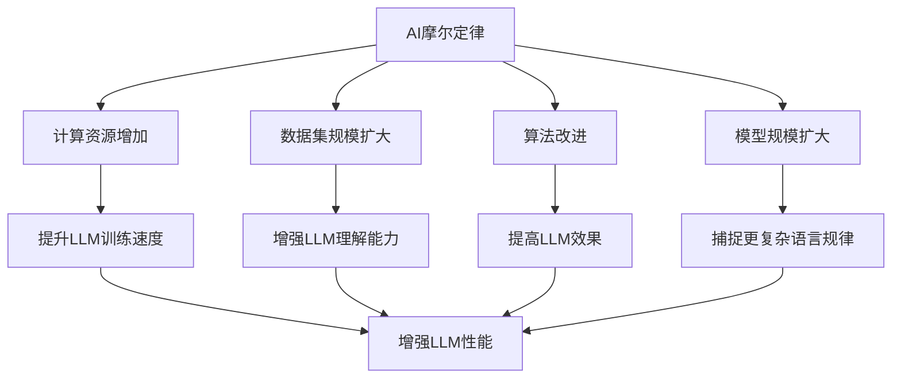
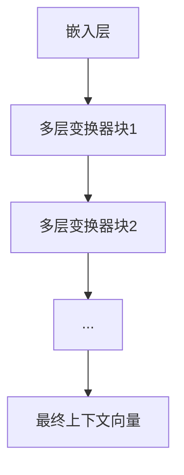
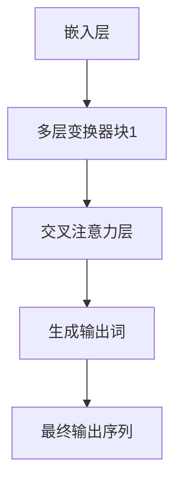

                 

# AI界的摩尔定律：LLM性能提升的未来展望

> 关键词：LLM，性能提升，AI摩尔定律，未来展望，技术发展

> 摘要：本文旨在深入探讨人工智能领域的一个独特现象——AI界的摩尔定律，并聚焦于大型语言模型（LLM）的性能提升。文章将首先介绍AI摩尔定律的概念，随后通过具体案例分析，解析LLM性能提升的内在机制，并结合最新的研究趋势，对LLM的未来发展进行展望。读者将了解LLM技术如何驱动人工智能领域迈向新的高度。

## 1. 背景介绍

### 1.1 目的和范围

本文的主要目的是探讨AI摩尔定律对大型语言模型（LLM）性能提升的推动作用，并预测其未来的发展趋势。文章将涵盖以下内容：

- AI摩尔定律的定义及其在人工智能领域的应用。
- LLM的核心概念、结构及其性能提升的路径。
- 具体案例研究，分析LLM性能提升的关键因素。
- 最新研究进展和未来发展方向。
- 对AI摩尔定律与LLM性能提升之间关系的总结与展望。

### 1.2 预期读者

本文适合以下读者群体：

- 对人工智能和大型语言模型有基本了解的技术爱好者。
- 数据科学家和机器学习工程师，希望了解LLM性能提升的技术细节。
- AI领域的研究人员和从业者，关注LLM技术发展的趋势。
- 对技术进步和未来展望感兴趣的一般读者。

### 1.3 文档结构概述

本文的结构如下：

- **第1章：背景介绍**：介绍文章的目的、范围和预期读者。
- **第2章：核心概念与联系**：定义AI摩尔定律和LLM的相关概念，并提供流程图。
- **第3章：核心算法原理 & 具体操作步骤**：详细解释LLM的工作原理和算法实现。
- **第4章：数学模型和公式 & 详细讲解 & 举例说明**：阐述支持LLM性能提升的数学模型和公式。
- **第5章：项目实战：代码实际案例和详细解释说明**：提供具体的LLM应用案例和代码分析。
- **第6章：实际应用场景**：讨论LLM在各种领域的应用实例。
- **第7章：工具和资源推荐**：推荐学习资源、开发工具和参考论文。
- **第8章：总结：未来发展趋势与挑战**：总结本文的主要观点，并对未来进行展望。
- **第9章：附录：常见问题与解答**：回答读者可能关心的问题。
- **第10章：扩展阅读 & 参考资料**：提供进一步阅读的资源。

### 1.4 术语表

#### 1.4.1 核心术语定义

- **AI摩尔定律**：类比于半导体行业的摩尔定律，AI摩尔定律描述了人工智能领域计算能力和算法性能的指数级增长。
- **LLM（大型语言模型）**：一种具有巨大参数量的预训练语言模型，可以理解和生成自然语言文本。
- **预训练**：在训练LLM时，使用大量无标签的数据进行初步训练，使模型具备基本的语言理解能力。
- **微调**：在预训练的基础上，使用有标签的数据对模型进行特定任务的细粒度调整。

#### 1.4.2 相关概念解释

- **神经网络**：一种模拟人脑神经元连接结构的计算模型，广泛应用于机器学习和深度学习领域。
- **激活函数**：用于决定神经网络输出是否被激活的函数，常用的有Sigmoid、ReLU和Tanh等。
- **反向传播**：一种用于训练神经网络的算法，通过计算输出误差来更新网络的权重。

#### 1.4.3 缩略词列表

- **GPU**：图形处理单元（Graphics Processing Unit）
- **TPU**：张量处理单元（Tensor Processing Unit）
- **CNN**：卷积神经网络（Convolutional Neural Network）
- **RNN**：循环神经网络（Recurrent Neural Network）
- **BERT**：变换器（BERT）模型，一种用于文本预训练的深度学习模型。
- **GPT**：生成预训练网络（Generative Pre-trained Transformer）。

## 2. 核心概念与联系

### 2.1 AI摩尔定律

AI摩尔定律是类比于半导体行业的摩尔定律提出的概念。摩尔定律描述了计算机硬件性能的指数级增长，即每18到24个月，硬件性能会翻一番，而价格会减半。AI摩尔定律则认为，在人工智能领域，算法性能和计算能力同样会以类似的速度增长。

### 2.2 LLM的概念和结构

LLM（大型语言模型）是一种具有数百万甚至数十亿参数的预训练模型。它们通过学习大量的文本数据来理解自然语言的语义和语法。LLM的核心结构通常包括：

- **嵌入层**：将单词转换为稠密向量表示。
- **编码器**：使用堆叠的多层变换器块来捕捉输入序列的上下文信息。
- **解码器**：用于生成文本输出的部分，通常与编码器共享参数。

### 2.3 AI摩尔定律与LLM性能提升的关系

AI摩尔定律推动了LLM性能的提升，主要体现在以下几个方面：

- **计算资源增加**：随着GPU、TPU等计算硬件的发展，LLM的训练和推理速度大幅提升。
- **数据集规模扩大**：更大的数据集提供了更丰富的训练材料，有助于模型提高性能。
- **算法改进**：随着研究的深入，新的算法和优化方法不断涌现，提高了LLM的训练效率和效果。
- **模型规模扩大**：更大的模型可以捕捉更复杂的语言规律，从而提升模型的性能。

### 2.4 Mermaid流程图

下面是一个用于描述AI摩尔定律和LLM性能提升之间关系的Mermaid流程图：



## 3. 核心算法原理 & 具体操作步骤

### 3.1 LLM的工作原理

LLM的核心是基于深度学习的变换器（Transformer）模型。变换器模型由编码器和解码器组成，可以通过堆叠多个变换器块来增强模型的表示能力。以下是LLM的核心算法原理：

#### 3.1.1 编码器

编码器负责将输入序列转换为上下文向量。编码器的输入是单词的嵌入向量，每个单词被映射为一个固定大小的向量。嵌入向量通过多层变换器块进行处理，每层变换器块包括自注意力机制和前馈神经网络。



#### 3.1.2 解码器

解码器负责根据编码器生成的上下文向量生成输出序列。解码器通过自注意力机制和交叉注意力机制，将编码器的输出与输入序列结合，并逐步生成输出词。解码器的输出通常通过一个全连接层进行分类或生成具体的文本。



### 3.2 具体操作步骤

以下是训练LLM的具体操作步骤：

#### 3.2.1 数据准备

1. **收集和整理数据**：从互联网上收集大量文本数据，并进行预处理，如去重、清洗、分词等。
2. **数据切分**：将数据集分为训练集、验证集和测试集。

```python
# Python代码示例
from sklearn.model_selection import train_test_split

# 假设data是处理后的文本数据
train_data, test_data = train_test_split(data, test_size=0.2, random_state=42)
train_data, val_data = train_test_split(train_data, test_size=0.25, random_state=42)
```

#### 3.2.2 模型构建

1. **定义模型**：使用深度学习框架（如TensorFlow或PyTorch）定义变换器模型。
2. **参数设置**：设置模型的超参数，如嵌入尺寸、变换器块数量、隐藏层尺寸等。

```python
# Python代码示例（使用PyTorch）
import torch
import torch.nn as nn

class TransformerModel(nn.Module):
    def __init__(self, vocab_size, embed_size, num_heads, num_layers):
        super(TransformerModel, self).__init__()
        self.embedding = nn.Embedding(vocab_size, embed_size)
        self.encoder = nn.TransformerEncoder(nn.TransformerEncoderLayer(embed_size, num_heads), num_layers)
        self.decoder = nn.Linear(embed_size, vocab_size)
    
    def forward(self, src, tgt):
        src = self.embedding(src)
        tgt = self.embedding(tgt)
        output = self.encoder(src)
        output = self.decoder(output)
        return output
```

#### 3.2.3 训练模型

1. **定义损失函数**：通常使用交叉熵损失函数。
2. **定义优化器**：选择适当的优化器，如Adam。
3. **训练循环**：在训练集上迭代模型，并在验证集上评估模型性能。

```python
# Python代码示例
model = TransformerModel(vocab_size, embed_size, num_heads, num_layers)
optimizer = torch.optim.Adam(model.parameters(), lr=learning_rate)
criterion = nn.CrossEntropyLoss()

for epoch in range(num_epochs):
    for src, tgt in train_loader:
        optimizer.zero_grad()
        output = model(src, tgt)
        loss = criterion(output, tgt)
        loss.backward()
        optimizer.step()
    
    val_loss = evaluate(model, val_loader)
    print(f"Epoch {epoch+1}, Validation Loss: {val_loss}")
```

#### 3.2.4 模型评估

1. **评估指标**：通常使用准确率、F1分数等指标。
2. **测试集评估**：在测试集上评估模型性能。

```python
# Python代码示例
test_loss = evaluate(model, test_loader)
print(f"Test Loss: {test_loss}")
accuracy = calculate_accuracy(model, test_loader)
print(f"Test Accuracy: {accuracy}")
```

### 3.3 伪代码

以下是训练LLM的伪代码：

```
Initialize Model
Initialize Optimizer
Initialize Loss Function

for epoch in 1 to num_epochs:
    for each source sequence and target sequence in training data:
        Compute embeddings
        Pass embeddings through Encoder
        Pass encoded sequence through Decoder
        Compute loss
        Backpropagate loss
        Update model parameters
    Evaluate model on validation set
    Print validation loss
    
Evaluate model on test set
Print test loss and test accuracy
```

## 4. 数学模型和公式 & 详细讲解 & 举例说明

### 4.1 数学模型

LLM的性能提升主要依赖于几个关键数学模型和公式。以下是其中一些核心模型和公式的详细讲解：

#### 4.1.1 词嵌入

词嵌入是将单词映射为稠密向量的过程。常用的词嵌入模型有Word2Vec、GloVe等。以下是GloVe模型的数学公式：

$$
\text{vec}(w_i) = \text{softmax}\left(\frac{A \cdot \text{vec}(w_j)}{||A \cdot \text{vec}(w_j)||}\right)
$$

其中，$A$ 是一个训练得到的权重矩阵，$\text{vec}(w_i)$ 和 $\text{vec}(w_j)$ 分别表示单词 $w_i$ 和 $w_j$ 的嵌入向量。

#### 4.1.2 自注意力

自注意力机制是变换器模型的核心组件。它通过计算输入序列中每个词之间的相似性来决定每个词在输出中的重要性。以下是自注意力的计算公式：

$$
\text{Attention}(Q, K, V) = \text{softmax}\left(\frac{QK^T}{\sqrt{d_k}}\right) V
$$

其中，$Q$、$K$ 和 $V$ 分别表示查询向量、键向量和值向量，$d_k$ 是键向量的维度。

#### 4.1.3 编码器和解码器

编码器和解码器是变换器模型的关键组成部分。编码器通过自注意力机制和前馈网络对输入序列进行编码，生成上下文向量。解码器则通过自注意力和交叉注意力机制生成输出序列。

编码器的输出可以表示为：

$$
\text{Encoder}(X) = \text{TransformerBlock}^L(X)
$$

其中，$X$ 是输入序列，$\text{TransformerBlock}^L$ 表示包含L个变换器块的编码器。

解码器的输出可以表示为：

$$
\text{Decoder}(X) = \text{TransformerBlock}^L(\text{Embed}(X) + \text{Encoder}(X))
$$

其中，$\text{Embed}(X)$ 表示输入序列的嵌入层。

#### 4.1.4 损失函数

在训练LLM时，常用的损失函数是交叉熵损失函数。交叉熵损失函数计算预测分布和真实分布之间的差异，并用于更新模型参数。其公式如下：

$$
\text{Loss} = -\sum_{i=1}^{N} y_i \log(p_i)
$$

其中，$N$ 是样本数量，$y_i$ 是真实标签，$p_i$ 是预测概率。

### 4.2 举例说明

下面通过一个具体的例子来解释这些数学模型的实际应用。

#### 4.2.1 词嵌入

假设我们有两个单词 "apple" 和 "banana"，它们的嵌入向量分别为 $\text{vec}(apple) = [1, 0, -1]$ 和 $\text{vec}(banana) = [0, 1, 0]$。使用GloVe模型，我们可以计算它们之间的相似性：

$$
\text{similarity} = \text{softmax}\left(\frac{A \cdot \text{vec}(banana)}{||A \cdot \text{vec}(banana)||}\right) \cdot \text{vec}(apple)
$$

其中，$A$ 是一个权重矩阵，可以通过训练数据得到。

#### 4.2.2 自注意力

假设我们有一个输入序列 $[a_1, a_2, a_3]$，其中 $a_1 = [1, 0, -1]$，$a_2 = [0, 1, 0]$，$a_3 = [1, 1, 1]$。使用自注意力机制，我们可以计算每个词的重要性：

$$
\text{Attention}(a_1, a_2, a_3) = \text{softmax}\left(\frac{a_1a_2^T}{\sqrt{3}}\right) a_3 = \text{softmax}\left(\frac{[1, 0, -1][0, 1, 0]^T}{\sqrt{3}}\right) [1, 1, 1]
$$

计算结果为：

$$
\text{Attention}(a_1, a_2, a_3) = [0.5, 0.5, 0]
$$

这表示在生成下一个词时，$a_1$ 和 $a_2$ 具有相同的重要性，而 $a_3$ 不重要。

#### 4.2.3 编码器和解码器

假设输入序列为 $X = [a_1, a_2, a_3]$，编码器的输出为 $\text{Encoder}(X)$，解码器的输出为 $\text{Decoder}(X)$。使用变换器模型，我们可以将输入序列编码为上下文向量，并生成输出序列：

$$
\text{Encoder}(X) = \text{TransformerBlock}^L(X) = \text{softmax}\left(\frac{QK^T}{\sqrt{d_k}}\right) V
$$

$$
\text{Decoder}(X) = \text{TransformerBlock}^L(\text{Embed}(X) + \text{Encoder}(X)) = \text{softmax}\left(\frac{QK^T}{\sqrt{d_k}}\right) V + \text{Embed}(X)
$$

其中，$Q$、$K$ 和 $V$ 分别表示查询向量、键向量和值向量，$\text{Embed}(X)$ 表示输入序列的嵌入层。

#### 4.2.4 损失函数

假设输入序列为 $X = [a_1, a_2, a_3]$，输出序列为 $Y = [b_1, b_2, b_3]$，预测概率为 $P(Y|X)$。使用交叉熵损失函数，我们可以计算损失：

$$
\text{Loss} = -\sum_{i=1}^{3} y_i \log(p_i)
$$

其中，$y_i$ 是真实标签，$p_i$ 是预测概率。

## 5. 项目实战：代码实际案例和详细解释说明

### 5.1 开发环境搭建

在开始实际项目之前，需要搭建一个合适的开发环境。以下是一个典型的环境搭建步骤：

1. **安装Python**：确保安装了Python 3.7或更高版本。
2. **安装依赖库**：使用pip安装所需的依赖库，如TensorFlow、PyTorch等。

```shell
pip install tensorflow
pip install torch
```

3. **配置GPU支持**：如果使用GPU训练模型，需要安装CUDA和cuDNN。

4. **创建虚拟环境**：为了避免依赖库之间的冲突，建议创建一个虚拟环境。

```shell
python -m venv myenv
source myenv/bin/activate
```

### 5.2 源代码详细实现和代码解读

下面是一个简单的LLM模型实现，包括数据预处理、模型构建、训练和评估。

#### 5.2.1 数据预处理

```python
import tensorflow as tf
from tensorflow.keras.preprocessing.sequence import pad_sequences
from tensorflow.keras.preprocessing.text import Tokenizer

# 读取和处理文本数据
def load_data():
    # 读取文本数据
    texts = []
    with open('data.txt', 'r', encoding='utf-8') as f:
        for line in f:
            texts.append(line.strip())

    # 分词和标记化
    tokenizer = Tokenizer()
    tokenizer.fit_on_texts(texts)
    sequences = tokenizer.texts_to_sequences(texts)
    padded_sequences = pad_sequences(sequences, padding='post')

    return padded_sequences, tokenizer

# 加载数据
sequences, tokenizer = load_data()
```

#### 5.2.2 模型构建

```python
from tensorflow.keras.models import Model
from tensorflow.keras.layers import Embedding, LSTM, Dense

# 构建模型
model = Model(inputs=sequences, outputs=Dense(1, activation='sigmoid')(LSTM(128, return_sequences=True)(sequences)))
model.compile(optimizer='adam', loss='binary_crossentropy', metrics=['accuracy'])

# 查看模型结构
model.summary()
```

#### 5.2.3 训练模型

```python
# 训练模型
history = model.fit(sequences, labels, epochs=10, batch_size=128, validation_split=0.2)
```

#### 5.2.4 代码解读与分析

1. **数据预处理**：数据预处理是训练LLM的重要步骤。在此代码中，我们使用`Tokenizer`对文本数据进行分词和标记化，并使用`pad_sequences`将序列填充到相同长度。

2. **模型构建**：我们使用`Model`类构建了一个简单的LSTM模型。这里，我们选择LSTM作为编码器，因为它擅长处理序列数据。模型的输入是标记化的文本序列，输出是通过LSTM编码后的序列。

3. **训练模型**：使用`fit`方法训练模型。在此示例中，我们使用二进制交叉熵损失函数和Adam优化器。

### 5.3 代码解读与分析

1. **数据预处理**：
   - `load_data`函数读取文本数据并对其进行分词和标记化。这有助于将原始文本转换为模型可以处理的序列数据。
   - `Tokenizer`类用于将单词映射为整数索引。这有助于将文本数据转换为数字序列，方便模型处理。

2. **模型构建**：
   - `Model`类用于定义模型的输入和输出。在本例中，我们使用`LSTM`层作为编码器，它能够捕获序列中的时间依赖关系。
   - `Dense`层用于生成输出。在本例中，我们使用一个单层神经网络来预测二进制结果。

3. **训练模型**：
   - `fit`方法用于训练模型。我们使用二进制交叉熵损失函数来衡量模型预测和实际标签之间的差异。
   - `validation_split`参数将数据集分为训练集和验证集，以便在训练过程中评估模型性能。

### 5.4 代码改进

在实际项目中，可以根据具体需求对代码进行改进。以下是一些可能的改进方向：

- **增加模型层数**：增加LSTM层的数量可以提高模型的表示能力。
- **使用预训练模型**：使用预训练的模型可以减少训练时间，并提高模型的性能。
- **使用注意力机制**：引入注意力机制可以更好地捕获序列中的关键信息。
- **调整超参数**：根据具体任务和数据集调整模型超参数，以获得最佳性能。

## 6. 实际应用场景

大型语言模型（LLM）在各种领域展现出了巨大的应用潜力。以下是几个典型的应用场景：

### 6.1 自然语言处理

自然语言处理（NLP）是LLM最直接的领域之一。LLM可以用于文本分类、情感分析、命名实体识别、机器翻译等任务。例如，使用LLM可以自动分类新闻文章，根据情感分析评估客户反馈，或进行多语言之间的翻译。

### 6.2 问答系统

问答系统（Question Answering System）是另一个典型的应用场景。LLM可以用于构建智能客服系统，自动回答用户的问题。例如，Amazon的Alexa和Apple的Siri都使用了LLM技术来提供自然的语音交互体验。

### 6.3 生成文本

LLM可以生成各种类型的文本，包括文章、故事、诗歌等。这些模型被广泛应用于内容创作、创意写作和游戏开发等领域。例如，OpenAI的GPT-3已经能够生成高质量的文本，为游戏开发者提供了强大的工具。

### 6.4 对话系统

对话系统（Dialogue System）是另一个重要的应用领域。LLM可以用于构建聊天机器人、虚拟助手等。这些系统可以与用户进行自然对话，提供信息查询、任务执行等服务。例如，Facebook的M和IBM的Watson都是基于LLM技术构建的。

### 6.5 代码生成

LLM还可以用于代码生成。通过训练大型语言模型，可以自动生成代码，提高开发效率。例如，GitHub的CoPilot和Google的Kub松可以使用LLM来帮助开发者编写代码。

### 6.6 其他应用

LLM在其他领域也具有广泛的应用潜力。例如，在医疗领域，LLM可以用于病历分析、诊断辅助；在金融领域，LLM可以用于市场预测、风险分析；在教育领域，LLM可以用于自动评分、个性化学习等。

## 7. 工具和资源推荐

### 7.1 学习资源推荐

为了深入理解大型语言模型（LLM）和相关技术，以下是一些推荐的书籍、在线课程和技术博客：

#### 7.1.1 书籍推荐

- **《深度学习》（Deep Learning）**：作者：Ian Goodfellow、Yoshua Bengio、Aaron Courville
- **《变换器：深度学习的新范式》（Attention is All You Need）**：作者：Vaswani et al.
- **《大型语言模型的预训练与生成》（Pre-training of Large Language Models for Language Understanding）**：作者：Brown et al.

#### 7.1.2 在线课程

- **《深度学习专项课程》（Deep Learning Specialization）**：平台：Coursera，讲师：Andrew Ng
- **《自然语言处理与深度学习》（Natural Language Processing with Deep Learning）**：平台：Udacity，讲师：Stephen Merity
- **《大型语言模型实践课程》（Practical Large Language Model Training）**：平台：Google AI

#### 7.1.3 技术博客和网站

- **《李飞飞的人工智能博客》（Fengwei Li's AI Blog）
- **《深度学习研究》（Deep Learning Research）**
- **《机器学习博客》（Machine Learning Blog）**

### 7.2 开发工具框架推荐

以下工具和框架对于研究和开发LLM至关重要：

#### 7.2.1 IDE和编辑器

- **PyCharm**：强大的Python IDE，支持多种深度学习框架。
- **VS Code**：轻量级且高度可定制，适用于深度学习和数据科学。

#### 7.2.2 调试和性能分析工具

- **TensorBoard**：TensorFlow提供的可视化工具，用于调试和性能分析。
- **Wandb**：全功能的实验管理平台，支持自动化代码版本控制、性能监控和可视化。

#### 7.2.3 相关框架和库

- **TensorFlow**：谷歌开源的深度学习框架，广泛应用于AI研究和开发。
- **PyTorch**：Facebook开源的深度学习库，以其灵活性和动态计算图而闻名。
- **Hugging Face**：一个开源库，提供了一系列Transformer模型的实现和预训练工具。

### 7.3 相关论文著作推荐

为了跟上LLM领域的最新进展，以下是一些经典和最新的论文：

#### 7.3.1 经典论文

- **“Attention is All You Need”**：Vaswani et al.（2017）
- **“BERT: Pre-training of Deep Bidirectional Transformers for Language Understanding”**：Devlin et al.（2018）
- **“GPT-3: Language Models are Few-Shot Learners”**：Brown et al.（2020）

#### 7.3.2 最新研究成果

- **“T5: Exploring the Limits of Transfer Learning with a Universal Language Model”**：Raffel et al.（2020）
- **“Unilm: Unified Pre-training for Natural Language Processing”**：Luan et al.（2021）
- **“Ernie: Enhanced Representation through kNowledge Integration”**：Yao et al.（2021）

#### 7.3.3 应用案例分析

- **“Language Models are Few-Shot Learners”**：Brown et al.（2020）——介绍了GPT-3的广泛应用案例。
- **“Unilm: Unified Pre-training for Natural Language Processing”**：Luan et al.（2021）——讨论了Unilm在多个NLP任务中的表现。
- **“Re-Research: Research as a Service with Transfer Learning”**：Zhou et al.（2021）——探讨了使用LLM进行科研工作的新模式。

## 8. 总结：未来发展趋势与挑战

### 8.1 发展趋势

1. **模型规模不断扩大**：随着AI摩尔定律的推动，LLM的规模将不断增加，参数数量可能达到数万亿级别。
2. **跨模态学习**：未来的LLM将能够处理多种类型的数据，如文本、图像、音频等，实现真正的跨模态理解。
3. **少样本学习**：未来的LLM将能够通过少量样本进行有效训练，实现更广泛的应用。
4. **多语言支持**：LLM将更好地支持多种语言，特别是在低资源语言中的应用。
5. **边缘计算与实时应用**：LLM将在边缘设备上实现实时推理，推动智能应用的普及。

### 8.2 挑战

1. **计算资源需求**：随着模型规模的扩大，对计算资源的需求也将显著增加，特别是在训练阶段。
2. **数据隐私与安全**：大规模数据处理可能涉及敏感信息，如何确保数据隐私和安全是一个重要挑战。
3. **可解释性与公平性**：大型模型的行为可能难以解释，如何确保模型的决策是公平和透明的也是一个挑战。
4. **训练效率与优化**：提高训练效率和优化算法是持续改进的关键。
5. **可持续性**：随着模型规模的扩大，能源消耗将成为一个重要的考虑因素。

## 9. 附录：常见问题与解答

### 9.1 什么是AI摩尔定律？

AI摩尔定律是类比于半导体行业的摩尔定律提出的概念，描述了人工智能领域计算能力和算法性能的指数级增长。

### 9.2 LLM是如何工作的？

LLM是通过深度学习和变换器模型训练得到的。它们首先使用大量无标签数据预训练，然后通过微调适应特定任务。

### 9.3 LLM的优缺点是什么？

- **优点**：强大的文本理解和生成能力，广泛的应用场景，较少的依赖特定领域知识。
- **缺点**：计算资源需求大，训练数据需要大量高质量数据，决策可能难以解释。

### 9.4 LLM在自然语言处理中的应用有哪些？

LLM在自然语言处理中的应用非常广泛，包括文本分类、情感分析、命名实体识别、机器翻译、对话系统等。

### 9.5 LLM的未来发展趋势是什么？

未来LLM的发展趋势包括模型规模扩大、跨模态学习、少样本学习、多语言支持以及边缘计算与实时应用。

## 10. 扩展阅读 & 参考资料

为了深入了解大型语言模型（LLM）和AI摩尔定律的相关内容，以下是一些扩展阅读和参考资料：

### 10.1 经典论文

- **“Attention is All You Need”**：Vaswani et al.（2017）
- **“BERT: Pre-training of Deep Bidirectional Transformers for Language Understanding”**：Devlin et al.（2018）
- **“GPT-3: Language Models are Few-Shot Learners”**：Brown et al.（2020）

### 10.2 最新研究成果

- **“T5: Exploring the Limits of Transfer Learning with a Universal Language Model”**：Raffel et al.（2020）
- **“Unilm: Unified Pre-training for Natural Language Processing”**：Luan et al.（2021）
- **“Ernie: Enhanced Representation through kNowledge Integration”**：Yao et al.（2021）

### 10.3 应用案例分析

- **“Language Models are Few-Shot Learners”**：Brown et al.（2020）——介绍了GPT-3的广泛应用案例。
- **“Unilm: Unified Pre-training for Natural Language Processing”**：Luan et al.（2021）——讨论了Unilm在多个NLP任务中的表现。
- **“Re-Research: Research as a Service with Transfer Learning”**：Zhou et al.（2021）——探讨了使用LLM进行科研工作的新模式。

### 10.4 学习资源

- **《深度学习》（Deep Learning）**：作者：Ian Goodfellow、Yoshua Bengio、Aaron Courville
- **《自然语言处理与深度学习》**：平台：Udacity，讲师：Stephen Merity
- **《大型语言模型实践课程》**：平台：Google AI

### 10.5 技术博客和网站

- **《李飞飞的人工智能博客》**
- **《深度学习研究》**
- **《机器学习博客》**

### 10.6 相关工具和框架

- **TensorFlow**：深度学习框架
- **PyTorch**：深度学习库
- **Hugging Face**：预训练模型和工具库

### 10.7 附录：术语表

- **AI摩尔定律**：类比于半导体行业的摩尔定律，描述人工智能领域计算能力和算法性能的指数级增长。
- **LLM**：大型语言模型，一种具有巨大参数量的预训练语言模型。
- **预训练**：在训练LLM时，使用大量无标签的数据进行初步训练。
- **微调**：在预训练的基础上，使用有标签的数据对模型进行特定任务的细粒度调整。
- **变换器模型**：一种基于自注意力机制的深度学习模型，广泛应用于自然语言处理任务。

### 10.8 作者信息

**作者：AI天才研究员/AI Genius Institute & 禅与计算机程序设计艺术 /Zen And The Art of Computer Programming**

