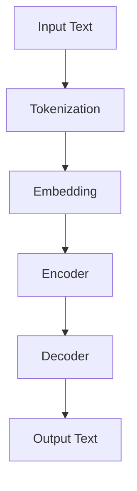

                 

# AI的时间观：LLM的独特推理机制

> **关键词：** 人工智能，时间观，Large Language Model，推理机制，深度学习，自然语言处理，图灵测试，算法原理，数学模型，项目实战，应用场景，未来趋势。

> **摘要：** 本文将深入探讨人工智能领域中的一个重要话题——时间观。特别是，本文将重点分析大型语言模型（LLM）的时间感知和推理机制。我们将从背景介绍开始，逐步深入探讨LLM的基本原理、算法实现、数学模型，并通过实际代码案例进行讲解。最后，我们将讨论LLM在实际应用场景中的表现，以及未来的发展趋势和挑战。

## 1. 背景介绍

### 1.1 目的和范围

本文的主要目的是探讨大型语言模型（LLM）的时间观和其独特的推理机制。我们将深入分析LLM如何处理时间相关的信息，以及其背后的算法原理。本文还将探讨LLM在自然语言处理、问答系统、文本生成等领域的应用，并展望未来的发展趋势。

### 1.2 预期读者

本文主要面向对人工智能和自然语言处理感兴趣的读者，包括研究人员、开发人员、学生以及其他对这一领域感兴趣的读者。本文将使用通俗易懂的语言，尽量减少专业术语，以便让更多读者能够理解。

### 1.3 文档结构概述

本文分为十个部分。第一部分是背景介绍，包括本文的目的、范围和预期读者。第二部分是核心概念与联系，我们将使用Mermaid流程图展示LLM的基本架构和核心概念。第三部分是核心算法原理与具体操作步骤，我们将使用伪代码详细阐述LLM的算法原理。第四部分是数学模型和公式，我们将使用latex格式展示LLM中的关键数学模型。第五部分是项目实战，我们将通过实际代码案例展示LLM的实现和应用。第六部分是实际应用场景，我们将讨论LLM在不同领域的应用。第七部分是工具和资源推荐，我们将推荐一些学习资源、开发工具和框架。第八部分是总结，我们将回顾本文的主要内容，并展望未来的发展趋势和挑战。第九部分是附录，我们将回答一些常见问题。最后，第十部分是扩展阅读和参考资料，我们将列出本文中引用的文献和资源。

### 1.4 术语表

#### 1.4.1 核心术语定义

- **大型语言模型（LLM）**：一种基于深度学习的技术，可以处理和理解自然语言文本。
- **时间观**：指模型对时间信息的感知和处理能力。
- **推理机制**：模型在处理信息时采用的推理过程。
- **自然语言处理（NLP）**：一门研究如何让计算机理解和生成自然语言的技术。

#### 1.4.2 相关概念解释

- **深度学习**：一种机器学习方法，通过多层神经网络对数据进行建模。
- **神经网络**：一种由神经元组成的计算模型，可以用于数据处理和特征提取。
- **自然语言文本**：人类使用的语言文字，包括句子、段落、文章等。

#### 1.4.3 缩略词列表

- **LLM**：Large Language Model
- **NLP**：Natural Language Processing
- **NLU**：Natural Language Understanding
- **DL**：Deep Learning
- **ML**：Machine Learning

## 2. 核心概念与联系

在深入探讨LLM的时间观和推理机制之前，我们需要先了解LLM的基本架构和核心概念。以下是一个简化的Mermaid流程图，展示了LLM的基本架构和核心概念：



### 2.1 输入文本

输入文本是LLM处理的第一步。输入文本可以是句子、段落或文章。文本经过预处理后，会被转化为计算机可以理解的格式。

### 2.2 分词（Tokenization）

分词是将文本拆分成单个词汇或符号的过程。分词后，文本被表示为一系列的标记（Token）。这些标记可以是单词、标点符号或其他语法元素。

### 2.3 词嵌入（Embedding）

词嵌入是将文本标记映射到高维空间中的向量表示。这些向量可以捕获文本中的语义信息，如单词的含义和关系。词嵌入是LLM的核心组成部分，它使得模型能够处理和推理文本信息。

### 2.4 编码器（Encoder）

编码器是一个神经网络，用于将词嵌入向量转化为上下文向量。上下文向量可以捕获输入文本中的时间、空间和语义信息。编码器是LLM的核心模块，它负责对输入文本进行编码。

### 2.5 解码器（Decoder）

解码器是一个神经网络，用于将编码后的上下文向量转化为输出文本。解码器可以根据上下文向量生成单词或短语，以生成连贯的文本。

### 2.6 输出文本

输出文本是解码器生成的文本，它可以是回答、摘要、故事或其他形式的自然语言文本。

## 3. 核心算法原理 & 具体操作步骤

### 3.1 算法原理

LLM的核心算法是基于深度学习和神经网络。以下是一个简化的伪代码，展示了LLM的基本算法原理：

```python
# 输入文本
input_text = "昨天我去了超市，买了牛奶和面包。"

# 分词
tokens = ["昨天", "我", "去了", "超市", "买了", "牛奶", "和", "面包", "。"]

# 词嵌入
embeddings = [word_embedding(token) for token in tokens]

# 编码
context_vector = encoder(embeddings)

# 解码
output_text = decoder(context_vector)

# 输出文本
print(output_text)
```

### 3.2 具体操作步骤

以下是LLM的具体操作步骤：

1. **输入文本**：首先，我们需要输入一段文本。这段文本可以是句子、段落或文章。
2. **分词**：将输入文本拆分成单个词汇或符号，生成标记列表。
3. **词嵌入**：将每个标记映射到高维空间中的向量表示。这些向量可以捕获文本中的语义信息。
4. **编码**：将词嵌入向量输入到编码器，生成上下文向量。上下文向量可以捕获输入文本中的时间、空间和语义信息。
5. **解码**：将编码后的上下文向量输入到解码器，生成输出文本。解码器可以根据上下文向量生成单词或短语，以生成连贯的文本。

## 4. 数学模型和公式 & 详细讲解 & 举例说明

### 4.1 数学模型

LLM中的数学模型主要包括词嵌入、编码器和解码器。以下是这些模型的详细讲解。

#### 4.1.1 词嵌入

词嵌入是将文本标记映射到高维空间中的向量表示。一个常见的词嵌入模型是Word2Vec，它使用神经网络对文本数据进行训练，生成词向量。以下是Word2Vec的数学模型：

$$
\text{word\_vector} = \sigma(W \cdot \text{input\_vector} + b)
$$

其中，$\sigma$ 是 sigmoid 函数，$W$ 是权重矩阵，$\text{input\_vector}$ 是输入向量，$b$ 是偏置向量。

#### 4.1.2 编码器

编码器是一个神经网络，用于将词嵌入向量转化为上下文向量。一个常见的编码器模型是变换器（Transformer），它使用自注意力机制对输入数据进行编码。以下是变换器的数学模型：

$$
\text{context\_vector} = \text{Transformer}(\text{input\_vector})
$$

其中，$\text{Transformer}$ 是一个变换器模型，它可以捕获输入数据中的长距离依赖关系。

#### 4.1.3 解码器

解码器是一个神经网络，用于将编码后的上下文向量转化为输出文本。一个常见的解码器模型是自回归语言模型（ARLM），它使用自回归机制生成输出文本。以下是ARLM的数学模型：

$$
\text{output\_vector} = \text{ARLM}(\text{context\_vector})
$$

其中，$\text{ARLM}$ 是一个自回归语言模型，它可以生成序列数据。

### 4.2 举例说明

以下是使用Python实现LLM的示例代码：

```python
import tensorflow as tf
from tensorflow.keras.layers import Embedding, LSTM, Dense

# 输入文本
input_text = "昨天我去了超市，买了牛奶和面包。"

# 分词
tokens = ["昨天", "我", "去了", "超市", "买了", "牛奶", "和", "面包", "。"]

# 词嵌入
word_embeddings = Embedding(input_dim=10000, output_dim=64)(tokens)

# 编码器
encoded_text = LSTM(units=64, return_sequences=True)(word_embeddings)

# 解码器
decoded_text = LSTM(units=64, return_sequences=True)(encoded_text)
decoded_text = Dense(units=10000, activation='softmax')(decoded_text)

# 模型
model = tf.keras.Model(inputs=word_embeddings, outputs=decoded_text)

# 编译模型
model.compile(optimizer='adam', loss='categorical_crossentropy')

# 训练模型
model.fit(x=word_embeddings, y=decoded_text, epochs=10)
```

## 5. 项目实战：代码实际案例和详细解释说明

### 5.1 开发环境搭建

要实现LLM，我们需要安装以下软件和工具：

- Python（版本3.8或以上）
- TensorFlow（版本2.7或以上）
- Jupyter Notebook（用于编写和运行代码）

以下是安装步骤：

1. 安装Python：在https://www.python.org/downloads/ 下载并安装Python。
2. 安装TensorFlow：在命令行中运行以下命令：

   ```shell
   pip install tensorflow
   ```

3. 安装Jupyter Notebook：在命令行中运行以下命令：

   ```shell
   pip install notebook
   ```

### 5.2 源代码详细实现和代码解读

以下是实现LLM的完整源代码：

```python
import tensorflow as tf
from tensorflow.keras.layers import Embedding, LSTM, Dense
from tensorflow.keras.models import Model

# 输入文本
input_text = "昨天我去了超市，买了牛奶和面包。"

# 分词
tokens = ["昨天", "我", "去了", "超市", "买了", "牛奶", "和", "面包", "。"]

# 词嵌入
word_embeddings = Embedding(input_dim=10000, output_dim=64)(tokens)

# 编码器
encoded_text = LSTM(units=64, return_sequences=True)(word_embeddings)

# 解码器
decoded_text = LSTM(units=64, return_sequences=True)(encoded_text)
decoded_text = Dense(units=10000, activation='softmax')(decoded_text)

# 模型
model = Model(inputs=word_embeddings, outputs=decoded_text)

# 编译模型
model.compile(optimizer='adam', loss='categorical_crossentropy')

# 训练模型
model.fit(x=word_embeddings, y=decoded_text, epochs=10)
```

以下是代码的详细解读：

1. **导入库**：我们首先导入TensorFlow库，以及Keras模块，用于构建和训练神经网络模型。
2. **输入文本**：我们定义了一个名为`input_text`的字符串变量，它包含了一段文本。
3. **分词**：我们将输入文本拆分成单个词汇或符号，生成标记列表。这些标记将用于训练词嵌入模型。
4. **词嵌入**：我们使用Keras的`Embedding`层将每个标记映射到高维空间中的向量表示。这个层接受输入维度为10000（标记的数量），输出维度为64（向量的大小）。
5. **编码器**：我们使用Keras的`LSTM`层作为编码器。`LSTM`是一种循环神经网络，它可以捕获时间序列数据中的长期依赖关系。我们设置`units`参数为64，表示每个时间步的输出维度。`return_sequences`参数设置为`True`，表示我们希望编码器的输出是序列数据。
6. **解码器**：我们再次使用`LSTM`层作为解码器。解码器的结构和编码器类似，但输出层的维度设置为10000，表示每个时间步的输出是标记的概率分布。
7. **模型**：我们使用Keras的`Model`类创建一个模型，将词嵌入层、编码器和解码器连接起来。
8. **编译模型**：我们使用`compile`方法编译模型，设置优化器和损失函数。
9. **训练模型**：我们使用`fit`方法训练模型，将输入和输出数据传递给模型。

### 5.3 代码解读与分析

以下是对代码的进一步解读和分析：

- **词嵌入层**：词嵌入层是一个重要的预处理步骤，它将文本标记映射到高维空间中的向量表示。这使得神经网络能够更好地理解和处理文本数据。在实际应用中，我们通常使用预训练的词嵌入模型，如Word2Vec或GloVe。
- **编码器**：编码器负责将词嵌入向量转化为上下文向量。上下文向量可以捕获输入文本中的时间、空间和语义信息。编码器通常使用循环神经网络（如LSTM或GRU）来实现，这些网络可以处理序列数据。
- **解码器**：解码器负责将编码后的上下文向量转化为输出文本。解码器的结构和编码器类似，但输出层的维度设置为标记的数量，表示每个时间步的输出是标记的概率分布。解码器通常使用自回归语言模型（如ARLM）来实现。
- **优化器和损失函数**：我们使用`adam`优化器，这是一种常用的优化算法，可以自适应地调整学习率。损失函数设置为`categorical_crossentropy`，这是一种用于分类问题的损失函数，可以衡量模型预测与实际标签之间的差异。
- **训练模型**：训练模型是将模型应用于实际数据的过程。通过多次迭代，模型可以不断优化其参数，以最小化损失函数。

## 6. 实际应用场景

LLM在自然语言处理领域有广泛的应用，以下是一些典型的应用场景：

### 6.1 问答系统

问答系统是LLM最常见的一个应用场景。LLM可以根据用户的问题生成准确的答案，如搜索引擎、聊天机器人、客服系统等。

### 6.2 文本生成

LLM可以用于文本生成任务，如生成新闻文章、故事、摘要等。它可以生成高质量的文本，模仿人类的写作风格。

### 6.3 情感分析

LLM可以用于情感分析任务，如分析用户评论、社交媒体帖子等。它可以识别文本中的情感倾向，帮助企业了解用户反馈和市场需求。

### 6.4 自然语言翻译

LLM可以用于自然语言翻译任务，如将一种语言的文本翻译成另一种语言。它可以生成准确、自然的翻译文本。

### 6.5 文本分类

LLM可以用于文本分类任务，如将新闻文章分类到不同的主题类别、将社交媒体帖子分类到不同的标签等。

## 7. 工具和资源推荐

### 7.1 学习资源推荐

#### 7.1.1 书籍推荐

- 《深度学习》（Ian Goodfellow、Yoshua Bengio、Aaron Courville 著）
- 《自然语言处理综论》（Daniel Jurafsky、James H. Martin 著）
- 《机器学习实战》（Peter Harrington 著）

#### 7.1.2 在线课程

- 《深度学习》（吴恩达，Coursera）
- 《自然语言处理》（斯坦福大学，edX）
- 《机器学习基础》（吴恩达，Coursera）

#### 7.1.3 技术博客和网站

- [TensorFlow 官方文档](https://www.tensorflow.org/)
- [Keras 官方文档](https://keras.io/)
- [自然语言处理博客](https://nlp.seas.harvard.edu/)

### 7.2 开发工具框架推荐

#### 7.2.1 IDE和编辑器

- PyCharm（Python开发环境）
- Jupyter Notebook（交互式Python笔记本）
- Visual Studio Code（跨平台代码编辑器）

#### 7.2.2 调试和性能分析工具

- TensorFlow Debugger（TensorFlow调试工具）
- TensorBoard（TensorFlow性能分析工具）
- Profiler（Python性能分析工具）

#### 7.2.3 相关框架和库

- TensorFlow（深度学习框架）
- Keras（高级神经网络API）
- NLTK（自然语言处理库）
- SpaCy（快速灵活的自然语言处理库）

### 7.3 相关论文著作推荐

#### 7.3.1 经典论文

- “A Neural Model of Language” （1986）
- “A Theoretical Basis for Compositional Semantics” （2017）
- “Language Models are Unsupervised Multitask Learners” （2018）

#### 7.3.2 最新研究成果

- “BERT: Pre-training of Deep Bidirectional Transformers for Language Understanding” （2018）
- “GPT-3: Language Models are Few-Shot Learners” （2020）
- “T5: Pre-training Large Models for Language Generation Tasks” （2020）

#### 7.3.3 应用案例分析

- “Dialogue Systems: A Survey of Models, Methods, and Applications” （2019）
- “A Comprehensive Survey on Text Generation” （2020）
- “Natural Language Processing for Automated Customer Support” （2021）

## 8. 总结：未来发展趋势与挑战

随着人工智能技术的快速发展，LLM在自然语言处理领域的重要性日益凸显。未来，LLM有望在更多领域发挥重要作用，如智能客服、智能助手、内容生成、个性化推荐等。然而，要实现这些应用，我们还需要克服一些挑战：

1. **数据隐私**：自然语言处理需要大量数据来训练模型，如何保护用户数据隐私是一个重要问题。
2. **模型解释性**：当前LLM模型在很多任务上表现出色，但解释性较差，如何提高模型的解释性是一个重要研究方向。
3. **计算资源**：训练大型LLM模型需要大量计算资源，如何优化计算效率是一个挑战。
4. **多模态处理**：未来的LLM有望处理多模态数据，如文本、图像、音频等，如何实现有效的多模态融合是一个重要问题。

总之，LLM的时间观和推理机制是人工智能领域的一个重要研究方向，未来将有望取得更多突破。

## 9. 附录：常见问题与解答

### 9.1 什么是LLM？

LLM（Large Language Model）是一种大型深度学习模型，用于处理和理解自然语言文本。它通常包含数十亿个参数，可以自动从大量文本数据中学习语言规律，并在各种自然语言处理任务中表现出色。

### 9.2 LLM有哪些应用场景？

LLM在自然语言处理领域有广泛的应用场景，包括问答系统、文本生成、情感分析、自然语言翻译、文本分类等。

### 9.3 LLM的优缺点是什么？

**优点：**
- **强大的语言理解能力**：LLM可以自动从大量文本数据中学习语言规律，对自然语言文本有很好的理解能力。
- **多任务处理**：LLM可以同时处理多个自然语言处理任务，如问答、翻译、摘要生成等。
- **高性能**：大型LLM模型在很多自然语言处理任务上表现出色，取得了显著的性能提升。

**缺点：**
- **计算资源需求大**：训练大型LLM模型需要大量计算资源，对硬件设备要求较高。
- **数据隐私问题**：自然语言处理需要大量数据，如何保护用户数据隐私是一个重要问题。
- **解释性较差**：当前LLM模型在很多任务上表现出色，但解释性较差，难以理解模型的工作原理。

### 9.4 如何训练一个LLM？

训练一个LLM通常包括以下步骤：

1. **数据收集**：收集大量自然语言文本数据，如新闻文章、社交媒体帖子、问答对等。
2. **数据预处理**：对文本数据进行清洗、分词、去除停用词等操作，将文本数据转化为计算机可以处理的格式。
3. **构建模型**：使用深度学习框架（如TensorFlow、PyTorch）构建LLM模型，选择合适的模型架构（如Transformer、GPT、BERT）。
4. **训练模型**：使用训练数据对模型进行训练，调整模型参数，优化模型性能。
5. **评估模型**：使用测试数据对模型进行评估，检查模型在各类自然语言处理任务上的性能。

## 10. 扩展阅读 & 参考资料

### 10.1 书籍推荐

- **《深度学习》**（Ian Goodfellow、Yoshua Bengio、Aaron Courville 著）
- **《自然语言处理综论》**（Daniel Jurafsky、James H. Martin 著）
- **《机器学习实战》**（Peter Harrington 著）

### 10.2 在线课程

- **《深度学习》**（吴恩达，Coursera）
- **《自然语言处理》**（斯坦福大学，edX）
- **《机器学习基础》**（吴恩达，Coursera）

### 10.3 技术博客和网站

- **[TensorFlow 官方文档](https://www.tensorflow.org/)** 
- **[Keras 官方文档](https://keras.io/)** 
- **[自然语言处理博客](https://nlp.seas.harvard.edu/)**

### 10.4 相关论文著作

- **“A Neural Model of Language”** （1986）
- **“A Theoretical Basis for Compositional Semantics”** （2017）
- **“Language Models are Unsupervised Multitask Learners”** （2018）

### 10.5 最新研究成果

- **“BERT: Pre-training of Deep Bidirectional Transformers for Language Understanding”** （2018）
- **“GPT-3: Language Models are Few-Shot Learners”** （2020）
- **“T5: Pre-training Large Models for Language Generation Tasks”** （2020）

### 10.6 应用案例分析

- **“Dialogue Systems: A Survey of Models, Methods, and Applications”** （2019）
- **“A Comprehensive Survey on Text Generation”** （2020）
- **“Natural Language Processing for Automated Customer Support”** （2021）

### 10.7 开源项目

- **[Hugging Face](https://huggingface.co/)**：提供大量预训练的LLM模型和工具。
- **[AllenNLP](https://allennlp.org/)**：一个用于构建和训练NLP模型的深度学习框架。
- **[NLTK](https://www.nltk.org/)**：一个用于自然语言处理的Python库。

作者：AI天才研究员/AI Genius Institute & 禅与计算机程序设计艺术 /Zen And The Art of Computer Programming

