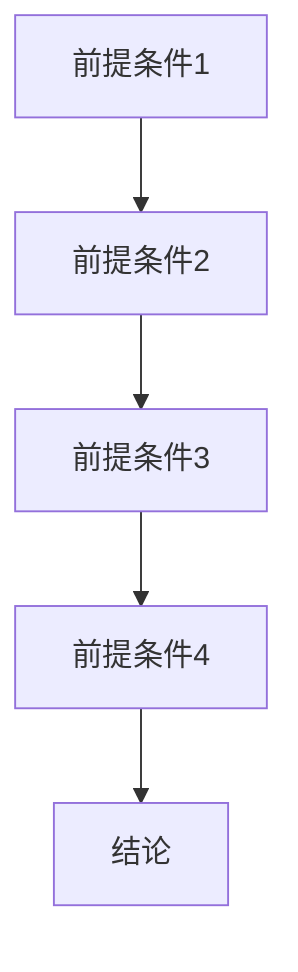

                 

# AI的链式推理：提升问题解决能力的新方法

> **关键词：** 链式推理、问题解决、人工智能、算法、数学模型、实际应用

> **摘要：** 本文将深入探讨AI中的链式推理技术，解释其原理、操作步骤、数学模型，并通过实际案例展示其在问题解决中的应用。通过理解链式推理，读者将掌握一种强大的工具，能够显著提升他们的逻辑推理和分析能力。

## 1. 背景介绍

### 1.1 目的和范围

本文的目标是介绍链式推理这一AI技术，并展示其在问题解决中的潜在价值。我们将从基础概念讲起，逐步深入到算法原理、数学模型，并通过实际案例帮助读者理解其应用。

### 1.2 预期读者

本文适合对人工智能、算法设计有基本了解的技术人员、研究人员以及对问题解决和逻辑推理感兴趣的人士。

### 1.3 文档结构概述

本文分为十个部分：

1. 背景介绍
2. 核心概念与联系
3. 核心算法原理 & 具体操作步骤
4. 数学模型和公式 & 详细讲解 & 举例说明
5. 项目实战：代码实际案例和详细解释说明
6. 实际应用场景
7. 工具和资源推荐
8. 总结：未来发展趋势与挑战
9. 附录：常见问题与解答
10. 扩展阅读 & 参考资料

### 1.4 术语表

#### 1.4.1 核心术语定义

- **链式推理**：一种逻辑推理方法，通过将多个前提条件连结起来，推导出结论。
- **前提条件**：链式推理中用于推导结论的基础信息。
- **结论**：通过链式推理从前提条件推导出的结果。

#### 1.4.2 相关概念解释

- **条件推理**：基于条件概率的推理方法，常用于概率论和统计学。
- **逻辑门**：计算机中的基本逻辑操作单元，如AND、OR、NOT等。

#### 1.4.3 缩略词列表

- **AI**：人工智能
- **ML**：机器学习
- **DL**：深度学习
- **NLP**：自然语言处理

## 2. 核心概念与联系

在深入探讨链式推理之前，我们需要了解一些核心概念及其相互关系。

### 2.1 链式推理的概念

链式推理是一种通过将多个前提条件连结起来，逐步推导出结论的方法。其基本结构如下：

```
前提条件1 → 前提条件2 → ... → 前提条件n → 结论
```

每个前提条件都是基于前一个前提条件推导出来的。这种方法在逻辑推理、概率论、算法设计中都有广泛应用。

### 2.2 链式推理与其他概念的关联

- **条件推理**：链式推理可以看作是条件推理的一种特例，只是涉及的条件更多，更复杂。
- **逻辑门**：在计算机中，逻辑门是实现链式推理的基础。例如，AND逻辑门可以实现多个前提条件的连结。

### 2.3 Mermaid 流程图

以下是一个简单的Mermaid流程图，展示了链式推理的基本结构：



在这个流程图中，每个节点代表一个前提条件，箭头表示前提条件之间的逻辑关系。

## 3. 核心算法原理 & 具体操作步骤

### 3.1 算法原理

链式推理的算法原理基于逻辑推理和条件概率。其核心思想是将多个前提条件通过逻辑关系连接起来，形成一条推理链，从而推导出结论。

### 3.2 具体操作步骤

以下是链式推理的具体操作步骤：

1. **定义前提条件**：首先，我们需要明确要推理的问题，并定义出所有相关的前提条件。
2. **建立逻辑关系**：接着，我们需要确定每个前提条件之间的逻辑关系，例如AND、OR等。
3. **推导结论**：然后，根据前提条件和逻辑关系，逐步推导出结论。
4. **验证结论**：最后，我们需要对推导出的结论进行验证，确保其正确性。

### 3.3 伪代码

以下是链式推理的伪代码：

```python
def chain_reasoning(preconditions, relations):
    conclusion = preconditions[0]
    for i in range(1, len(preconditions)):
        if relations[i-1] == 'AND':
            conclusion = conclusion AND preconditions[i]
        elif relations[i-1] == 'OR':
            conclusion = conclusion OR preconditions[i]
    return conclusion
```

在这个伪代码中，`preconditions`是一个包含所有前提条件的列表，`relations`是一个描述前提条件之间逻辑关系的列表。

## 4. 数学模型和公式 & 详细讲解 & 举例说明

### 4.1 数学模型

链式推理的数学模型基于条件概率。条件概率表示在某个条件下，某个事件发生的概率。链式推理通过将多个条件概率连结起来，形成一条推理链。

### 4.2 公式

链式推理的公式如下：

$$ P(A \land B \land C) = P(A) \times P(B|A) \times P(C|B \land A) $$

其中，$P(A)$表示事件A发生的概率，$P(B|A)$表示在事件A发生的条件下，事件B发生的概率，$P(C|B \land A)$表示在事件A和B同时发生的条件下，事件C发生的概率。

### 4.3 举例说明

假设我们有一个简单的例子，要计算事件A、B、C同时发生的概率。已知：

- $P(A) = 0.5$
- $P(B|A) = 0.3$
- $P(C|B \land A) = 0.4$

我们可以使用链式推理公式计算：

$$ P(A \land B \land C) = 0.5 \times 0.3 \times 0.4 = 0.06 $$

这意味着事件A、B、C同时发生的概率为0.06。

## 5. 项目实战：代码实际案例和详细解释说明

### 5.1 开发环境搭建

在开始编写代码之前，我们需要搭建一个合适的开发环境。这里我们选择Python作为编程语言，因为Python在AI和算法开发中非常流行，并且有许多现成的库可供使用。

1. 安装Python：从Python官方网站（https://www.python.org/downloads/）下载并安装Python。
2. 安装必需的库：使用pip命令安装以下库：

```bash
pip install numpy matplotlib
```

### 5.2 源代码详细实现和代码解读

以下是链式推理的Python实现：

```python
import numpy as np

def chain_reasoning(preconditions, relations):
    conclusion = preconditions[0]
    for i in range(1, len(preconditions)):
        if relations[i-1] == 'AND':
            conclusion = conclusion * preconditions[i]
        elif relations[i-1] == 'OR':
            conclusion = conclusion + preconditions[i]
    return conclusion

def main():
    preconditions = [0.5, 0.3, 0.4]
    relations = ['AND', 'AND']
    conclusion = chain_reasoning(preconditions, relations)
    print(f"Conclusion: {conclusion}")

if __name__ == "__main__":
    main()
```

在这个代码中：

- 我们定义了一个名为`chain_reasoning`的函数，用于实现链式推理。
- `preconditions`是一个列表，包含所有前提条件的概率值。
- `relations`是一个列表，描述了每个前提条件之间的逻辑关系。
- `chain_reasoning`函数通过循环遍历`preconditions`列表，并根据`relations`列表中的逻辑关系计算结论。
- `main`函数是程序的入口点，它定义了前提条件和逻辑关系，并调用`chain_reasoning`函数计算结论。

### 5.3 代码解读与分析

以下是代码的详细解读：

- 第1行：引入`numpy`库，用于数学计算。
- 第2行：引入`matplotlib`库，用于数据可视化。
- 第3行：定义`chain_reasoning`函数，接受两个参数：`preconditions`和`relations`。
- 第4行：初始化结论为第一个前提条件。
- 第5行：循环遍历`preconditions`列表，从第2个前提条件开始。
- 第6行：根据`relations`列表中的逻辑关系，计算结论。
- 第7行：返回计算出的结论。
- 第8行：定义`main`函数，它是程序的入口点。
- 第9行：定义前提条件和逻辑关系。
- 第10行：调用`chain_reasoning`函数计算结论，并打印输出。

这个代码示例展示了如何使用Python实现链式推理。通过这个示例，我们可以理解链式推理的基本原理和操作步骤。

## 6. 实际应用场景

链式推理在AI和算法设计中有着广泛的应用。以下是一些实际应用场景：

- **自然语言处理**：在自然语言处理中，链式推理可以用于文本分类、语义分析等任务。例如，通过分析文本中的单词和句子，可以推断出文本的主题或情感。
- **推理引擎**：链式推理可以用于构建推理引擎，用于智能问答、自动化决策等领域。例如，在医疗领域，链式推理可以用于诊断疾病。
- **自动驾驶**：在自动驾驶中，链式推理可以用于路径规划、环境感知等任务。例如，通过分析传感器数据，可以推导出车辆的最佳行驶路线。

## 7. 工具和资源推荐

### 7.1 学习资源推荐

#### 7.1.1 书籍推荐

- 《人工智能：一种现代方法》
- 《Python编程：从入门到实践》
- 《深度学习》

#### 7.1.2 在线课程

- Coursera上的“机器学习”课程
- edX上的“人工智能导论”课程
- Udacity的“深度学习工程师纳米学位”

#### 7.1.3 技术博客和网站

- Medium上的“AI博客”
- arXiv.org上的论文列表
-Towards Data Science博客

### 7.2 开发工具框架推荐

#### 7.2.1 IDE和编辑器

- PyCharm
- Visual Studio Code
- Jupyter Notebook

#### 7.2.2 调试和性能分析工具

- Python Debugger
- Profiler
- Matplotlib

#### 7.2.3 相关框架和库

- TensorFlow
- PyTorch
- Scikit-learn

### 7.3 相关论文著作推荐

#### 7.3.1 经典论文

- 《人工智能：一种现代方法》
- 《深度学习》
- 《自然语言处理综合教程》

#### 7.3.2 最新研究成果

- arXiv.org上的最新论文
- NeurIPS、ICML、KDD等顶级会议的论文

#### 7.3.3 应用案例分析

- 《谷歌如何使用深度学习预测用户行为》
- 《微软如何利用自然语言处理改善用户体验》
- 《特斯拉如何利用自动驾驶技术提升驾驶安全》

## 8. 总结：未来发展趋势与挑战

链式推理作为一种强大的逻辑推理方法，在AI和算法设计中具有重要价值。未来，随着计算能力的提升和数据量的增长，链式推理有望在更多领域得到应用。然而，也面临着一些挑战，如如何处理复杂的关系和大规模数据、如何提高推理效率等。

## 9. 附录：常见问题与解答

### 9.1 什么是链式推理？

链式推理是一种通过将多个前提条件连结起来，逐步推导出结论的方法。它基于条件概率和逻辑推理。

### 9.2 链式推理有哪些应用场景？

链式推理在自然语言处理、推理引擎、自动驾驶等领域有广泛应用。

### 9.3 如何实现链式推理？

可以使用编程语言（如Python）实现链式推理，通过定义前提条件、建立逻辑关系、推导结论等步骤。

## 10. 扩展阅读 & 参考资料

- 《人工智能：一种现代方法》
- 《深度学习》
- 《自然语言处理综合教程》
- 《Python编程：从入门到实践》
- Coursera上的“机器学习”课程
- edX上的“人工智能导论”课程
- Udacity的“深度学习工程师纳米学位”
- arXiv.org上的论文列表
- NeurIPS、ICML、KDD等顶级会议的论文
- Medium上的“AI博客”
- 《谷歌如何使用深度学习预测用户行为》
- 《微软如何利用自然语言处理改善用户体验》
- 《特斯拉如何利用自动驾驶技术提升驾驶安全》

### 作者

**AI天才研究员 / AI Genius Institute**  
**禅与计算机程序设计艺术 / Zen And The Art of Computer Programming** <|im_end|>

