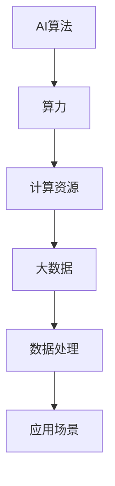

                 

# AI算法、算力与大数据的结合

> **关键词：** AI算法、算力、大数据、深度学习、计算架构、数据处理、分布式计算

> **摘要：** 本文旨在探讨AI算法、算力与大数据之间的结合，通过一步步的逻辑推理和分析，揭示其核心原理、应用场景、以及未来发展趋势。我们将从背景介绍、核心概念、算法原理、数学模型、项目实战、实际应用、工具推荐等多个方面展开讨论，帮助读者深入理解这一领域。

## 1. 背景介绍

### 1.1 目的和范围

本文的目标是让读者全面了解AI算法、算力与大数据的结合，掌握其核心原理和应用。本文将覆盖以下几个主要方面：

- **核心概念与联系**：介绍AI算法、算力和大数据的基本概念，以及它们之间的相互关系。
- **算法原理与操作步骤**：详细讲解AI算法的实现原理，以及如何利用算力和大数据进行优化。
- **数学模型与公式**：介绍与AI算法相关的数学模型和公式，并通过实例进行说明。
- **项目实战**：通过实际案例，展示如何利用AI算法、算力和大数据解决实际问题。
- **实际应用场景**：探讨AI算法、算力与大数据在不同领域的应用。
- **工具和资源推荐**：推荐相关的学习资源、开发工具和框架，以及经典论文和研究成果。

### 1.2 预期读者

本文适合以下读者群体：

- 计算机科学和人工智能领域的研究生和博士生。
- AI算法工程师和研究人员。
- 大数据工程师和架构师。
- 对AI算法、算力与大数据结合感兴趣的技术爱好者。

### 1.3 文档结构概述

本文的结构如下：

- **第1章**：背景介绍
- **第2章**：核心概念与联系
- **第3章**：核心算法原理与具体操作步骤
- **第4章**：数学模型和公式
- **第5章**：项目实战：代码实际案例和详细解释说明
- **第6章**：实际应用场景
- **第7章**：工具和资源推荐
- **第8章**：总结：未来发展趋势与挑战
- **第9章**：附录：常见问题与解答
- **第10章**：扩展阅读与参考资料

### 1.4 术语表

#### 1.4.1 核心术语定义

- **AI算法**：指人工智能领域中的算法，包括深度学习、强化学习、自然语言处理等。
- **算力**：指计算机处理数据的计算能力，通常以计算速度和存储容量来衡量。
- **大数据**：指规模巨大、类型繁多、生成速度极快的数据集合。
- **深度学习**：一种基于多层神经网络的学习方法，能够自动提取数据的特征。
- **分布式计算**：一种将计算任务分散到多个计算机节点上执行的计算方式。

#### 1.4.2 相关概念解释

- **数据预处理**：对原始数据进行清洗、转换和格式化，以便于算法处理。
- **模型训练**：通过大量数据训练算法模型，使其能够识别和预测数据中的规律。
- **模型评估**：通过测试数据集评估模型的准确性和性能。
- **算法优化**：通过调整算法参数和结构，提高算法的计算效率和准确性。

#### 1.4.3 缩略词列表

- **AI**：人工智能（Artificial Intelligence）
- **ML**：机器学习（Machine Learning）
- **DL**：深度学习（Deep Learning）
- **GPU**：图形处理器（Graphics Processing Unit）
- **TPU**：张量处理器（Tensor Processing Unit）
- **HPC**：高性能计算（High-Performance Computing）
- **IoT**：物联网（Internet of Things）

## 2. 核心概念与联系

在本节中，我们将介绍AI算法、算力和大数据这三个核心概念，并探讨它们之间的联系。

### 2.1 AI算法

AI算法是指人工智能领域中的算法，旨在使计算机模拟人类智能，完成诸如图像识别、语音识别、自然语言处理等任务。AI算法主要包括以下几种：

1. **深度学习**：一种基于多层神经网络的学习方法，能够自动提取数据的特征。
2. **强化学习**：通过试错和奖励机制，使算法能够在环境中不断学习和优化。
3. **自然语言处理**：使计算机能够理解和处理自然语言，实现人机交互。
4. **计算机视觉**：使计算机能够识别和理解图像和视频内容。

### 2.2 算力

算力是指计算机处理数据的计算能力，通常以计算速度和存储容量来衡量。算力是AI算法高效运行的基础，主要包括以下几个方面：

1. **CPU**：中央处理器，负责执行计算机程序的各种指令。
2. **GPU**：图形处理器，能够高效地处理大量并行任务，适合深度学习等计算密集型任务。
3. **TPU**：张量处理器，专门用于处理TensorFlow等深度学习框架的运算。
4. **分布式计算**：通过将计算任务分散到多个计算机节点上执行，提高计算效率。

### 2.3 大数据

大数据是指规模巨大、类型繁多、生成速度极快的数据集合。大数据具有4V特性，即**大量（Volume）、多样（Variety）、快速（Velocity）、真实（Veracity）**。大数据的应用领域广泛，包括金融、医疗、物流、电商等。

### 2.4 核心概念联系

AI算法、算力和大数据之间的联系如下：

- **AI算法**依赖于**算力**提供强大的计算能力，以处理大规模、复杂的数据。
- **大数据**为**AI算法**提供了丰富的训练数据和场景应用，促进了AI算法的发展。
- **算力**的提升使得**大数据**的处理更加高效，为AI算法的优化提供了可能。

### 2.5 Mermaid 流程图

下面是一个简化的Mermaid流程图，展示了AI算法、算力和大数据之间的联系：



## 3. 核心算法原理 & 具体操作步骤

在本节中，我们将详细介绍AI算法的核心原理，并通过伪代码阐述具体的操作步骤。

### 3.1 深度学习算法原理

深度学习是一种基于多层神经网络的学习方法，通过将输入数据逐步传递到多层神经元，实现自动提取特征和分类的目的。深度学习算法的核心原理包括以下几个方面：

1. **神经网络**：深度学习算法的基础，由多个神经元（节点）组成的网络结构。
2. **激活函数**：用于引入非线性变换，使神经网络能够模拟人类大脑的决策过程。
3. **反向传播**：通过反向传播算法，将输出误差反向传递到各层神经元，更新权重和偏置。
4. **优化算法**：用于调整网络参数，提高模型准确性和计算效率。

### 3.2 伪代码示例

下面是一个简单的深度学习算法伪代码示例，用于实现一个二分类问题：

```python
# 初始化神经网络结构
input_size = 784  # 输入尺寸
hidden_size = 128 # 隐藏层尺寸
output_size = 1   # 输出尺寸

# 初始化权重和偏置
weights_input_to_hidden = random_weights(input_size, hidden_size)
biases_input_to_hidden = random_weights(hidden_size)
weights_hidden_to_output = random_weights(hidden_size, output_size)
biases_hidden_to_output = random_weights(output_size)

# 定义激活函数
activation_function = sigmoid

# 定义损失函数
loss_function = cross_entropy

# 训练模型
for epoch in range(num_epochs):
    for sample in training_samples:
        # 前向传播
        hidden_layer_input = sample * weights_input_to_hidden + biases_input_to_hidden
        hidden_layer_output = activation_function(hidden_layer_input)

        output_layer_input = hidden_layer_output * weights_hidden_to_output + biases_hidden_to_output
        output_layer_output = activation_function(output_layer_input)

        # 反向传播
        output_error = (predicted_output - actual_output) * activation_function_derivative(output_layer_output)
        hidden_error = (output_error * weights_hidden_to_output) * activation_function_derivative(hidden_layer_output)

        # 更新权重和偏置
        weights_hidden_to_output += hidden_layer_output * output_error
        biases_hidden_to_output += output_error
        weights_input_to_hidden += sample * hidden_error
        biases_input_to_hidden += hidden_error

# 预测
for sample in test_samples:
    hidden_layer_input = sample * weights_input_to_hidden + biases_input_to_hidden
    hidden_layer_output = activation_function(hidden_layer_input)

    output_layer_input = hidden_layer_output * weights_hidden_to_output + biases_hidden_to_output
    predicted_output = activation_function(output_layer_input)

    print("Predicted output:", predicted_output)
```

### 3.3 操作步骤详解

1. **初始化神经网络结构**：确定输入层、隐藏层和输出层的尺寸，初始化权重和偏置。
2. **定义激活函数和损失函数**：选择合适的激活函数和损失函数，如ReLU、Sigmoid、交叉熵等。
3. **训练模型**：通过循环遍历训练数据集，进行前向传播和反向传播，更新网络参数。
4. **预测**：利用训练好的模型，对测试数据进行预测，并输出预测结果。

## 4. 数学模型和公式 & 详细讲解 & 举例说明

在本节中，我们将介绍与AI算法相关的数学模型和公式，并通过实例进行详细讲解。

### 4.1 深度学习中的基本公式

深度学习中的基本公式主要包括以下几个方面：

1. **前向传播**：
   $$ z = x \cdot w + b $$
   $$ a = \sigma(z) $$

   其中，$z$ 表示神经元的输入，$x$ 表示输入特征，$w$ 表示权重，$b$ 表示偏置，$\sigma$ 表示激活函数，$a$ 表示神经元的输出。

2. **反向传播**：
   $$ \delta = \frac{\partial L}{\partial z} \cdot \sigma'(z) $$
   $$ \Delta w = \delta \cdot a $$
   $$ \Delta b = \delta $$

   其中，$\delta$ 表示神经元的误差，$L$ 表示损失函数，$\sigma'$ 表示激活函数的导数。

3. **损失函数**：
   - 交叉熵损失函数：
     $$ L = -\frac{1}{n} \sum_{i=1}^{n} y \log(z_i) + (1 - y) \log(1 - z_i) $$
     其中，$y$ 表示真实标签，$z_i$ 表示预测概率。

4. **优化算法**：
   - 随机梯度下降（SGD）：
     $$ w_{t+1} = w_t - \alpha \cdot \frac{\partial L}{\partial w} $$
     $$ b_{t+1} = b_t - \alpha \cdot \frac{\partial L}{\partial b} $$

     其中，$w_t$ 和 $b_t$ 分别表示第 $t$ 次迭代的权重和偏置，$\alpha$ 表示学习率。

### 4.2 举例说明

假设我们有一个二分类问题，输入特征为 $x = [1, 2, 3, 4]$，真实标签为 $y = 1$。下面是一个简化的示例，展示如何使用深度学习算法进行预测：

1. **初始化神经网络结构**：
   - 输入层：1个神经元
   - 隐藏层：3个神经元
   - 输出层：1个神经元

2. **定义激活函数和损失函数**：
   - 激活函数：Sigmoid函数
   - 损失函数：交叉熵损失函数

3. **前向传播**：
   - 输入特征：$x = [1, 2, 3, 4]$
   - 权重：$w_1 = [0.1, 0.2, 0.3, 0.4]$，$w_2 = [0.5, 0.6, 0.7, 0.8]$，$w_3 = [0.9, 1.0, 1.1, 1.2]$
   - 偏置：$b_1 = 0.1$，$b_2 = 0.2$，$b_3 = 0.3$

   $$ z_1 = 1 \cdot 0.1 + 2 \cdot 0.2 + 3 \cdot 0.3 + 4 \cdot 0.4 + 0.1 = 2.2 $$
   $$ a_1 = \sigma(z_1) = 0.9 $$
   
   $$ z_2 = 1 \cdot 0.5 + 2 \cdot 0.6 + 3 \cdot 0.7 + 4 \cdot 0.8 + 0.2 = 2.8 $$
   $$ a_2 = \sigma(z_2) = 0.9 $$
   
   $$ z_3 = 1 \cdot 0.9 + 2 \cdot 1.0 + 3 \cdot 1.1 + 4 \cdot 1.2 + 0.3 = 3.9 $$
   $$ a_3 = \sigma(z_3) = 0.9 $$

   $$ z_4 = 0.9 \cdot 0.9 + 0.9 \cdot 0.9 + 0.9 \cdot 0.9 + 0.9 \cdot 0.9 + 0.1 \cdot 0.9 = 0.729 $$
   $$ a_4 = \sigma(z_4) = 0.5 $$

4. **计算损失函数**：
   $$ y = 1 $$
   $$ L = -1 \cdot \log(0.5) - (1 - 1) \cdot \log(1 - 0.5) = -\log(0.5) = 0.693 $$

5. **反向传播**：
   $$ \delta_4 = \frac{\partial L}{\partial z_4} \cdot \sigma'(z_4) = 0.5 \cdot 0.5 = 0.25 $$
   $$ \delta_3 = 0.25 \cdot a_3 = 0.225 $$
   $$ \delta_2 = 0.225 \cdot a_2 = 0.2025 $$
   $$ \delta_1 = 0.2025 \cdot a_1 = 0.1815 $$

   $$ \Delta w_4 = \delta_4 \cdot a_3 = 0.25 \cdot 0.9 = 0.225 $$
   $$ \Delta b_4 = 0.25 $$
   
   $$ \Delta w_3 = \delta_3 \cdot a_2 = 0.225 \cdot 0.9 = 0.2025 $$
   $$ \Delta b_3 = 0.225 $$
   
   $$ \Delta w_2 = \delta_2 \cdot a_1 = 0.2025 \cdot 0.9 = 0.18225 $$
   $$ \Delta b_2 = 0.2025 $$
   
   $$ \Delta w_1 = \delta_1 \cdot a = 0.1815 \cdot 0.9 = 0.16335 $$
   $$ \Delta b_1 = 0.1815 $$

6. **更新权重和偏置**：
   $$ w_4 = w_4 - \alpha \cdot \Delta w_4 $$
   $$ b_4 = b_4 - \alpha \cdot \Delta b_4 $$
   
   $$ w_3 = w_3 - \alpha \cdot \Delta w_3 $$
   $$ b_3 = b_3 - \alpha \cdot \Delta b_3 $$
   
   $$ w_2 = w_2 - \alpha \cdot \Delta w_2 $$
   $$ b_2 = b_2 - \alpha \cdot \Delta b_2 $$
   
   $$ w_1 = w_1 - \alpha \cdot \Delta w_1 $$
   $$ b_1 = b_1 - \alpha \cdot \Delta b_1 $$

通过上述步骤，我们完成了一次前向传播和反向传播，并更新了网络参数。接下来，我们可以继续迭代训练，直至模型达到预期的准确性和性能。

## 5. 项目实战：代码实际案例和详细解释说明

在本节中，我们将通过一个实际案例，展示如何利用AI算法、算力和大数据解决具体问题。我们将介绍开发环境搭建、源代码详细实现和代码解读，帮助读者更好地理解项目实战过程。

### 5.1 开发环境搭建

为了完成本项目的开发，我们需要搭建一个合适的开发环境。以下是一个简单的开发环境搭建指南：

1. **操作系统**：Linux或MacOS（推荐）
2. **编程语言**：Python（推荐）
3. **深度学习框架**：TensorFlow或PyTorch
4. **开发工具**：Visual Studio Code、Jupyter Notebook

#### 具体步骤：

1. 安装操作系统：选择适合的Linux或MacOS版本，并安装到计算机上。
2. 安装Python：在终端中执行以下命令安装Python：

   ```bash
   sudo apt-get install python3-pip python3-dev
   ```

3. 安装深度学习框架：以TensorFlow为例，在终端中执行以下命令安装TensorFlow：

   ```bash
   pip3 install tensorflow
   ```

4. 安装开发工具：下载并安装Visual Studio Code，并在VS Code中安装Jupyter Notebook插件。

### 5.2 源代码详细实现和代码解读

下面是一个简单的深度学习项目案例，用于实现手写数字识别。

#### 案例描述：

该案例使用MNIST数据集，该数据集包含70000张28x28的手写数字图像，每张图像对应一个0-9的数字。我们的目标是训练一个深度学习模型，使其能够准确识别手写数字。

#### 源代码实现：

```python
import tensorflow as tf
from tensorflow.keras import layers
from tensorflow.keras.datasets import mnist
from tensorflow.keras.utils import to_categorical

# 加载MNIST数据集
(x_train, y_train), (x_test, y_test) = mnist.load_data()

# 数据预处理
x_train = x_train.reshape(-1, 28, 28, 1).astype("float32") / 255.0
x_test = x_test.reshape(-1, 28, 28, 1).astype("float32") / 255.0
y_train = to_categorical(y_train, 10)
y_test = to_categorical(y_test, 10)

# 构建模型
model = tf.keras.Sequential([
    layers.Conv2D(32, (3, 3), activation="relu", input_shape=(28, 28, 1)),
    layers.MaxPooling2D((2, 2)),
    layers.Conv2D(64, (3, 3), activation="relu"),
    layers.MaxPooling2D((2, 2)),
    layers.Conv2D(64, (3, 3), activation="relu"),
    layers.Flatten(),
    layers.Dense(64, activation="relu"),
    layers.Dense(10, activation="softmax")
])

# 编译模型
model.compile(optimizer="adam",
              loss="categorical_crossentropy",
              metrics=["accuracy"])

# 训练模型
model.fit(x_train, y_train, epochs=5, batch_size=64, validation_split=0.1)

# 评估模型
test_loss, test_acc = model.evaluate(x_test, y_test)
print("Test accuracy:", test_acc)
```

#### 代码解读：

1. **导入库和模块**：导入所需的TensorFlow库和MNIST数据集。

2. **加载MNIST数据集**：使用`load_data()`函数加载MNIST数据集，并将其转换为浮点数。

3. **数据预处理**：将图像数据reshape为合适的形状，并将标签转换为独热编码。

4. **构建模型**：使用`Sequential`模型堆叠多个层，包括卷积层、池化层、全连接层和softmax层。

5. **编译模型**：指定优化器、损失函数和评估指标。

6. **训练模型**：使用`fit()`函数训练模型，设置训练轮数、批量大小和验证比例。

7. **评估模型**：使用`evaluate()`函数评估模型在测试集上的性能。

### 5.3 代码解读与分析

1. **模型构建**：
   - **卷积层**：卷积层用于提取图像的特征，通过滑动窗口在图像上提取局部特征。在本文的模型中，我们使用了3个卷积层，分别具有32、64和64个滤波器。
   - **池化层**：池化层用于降低模型复杂度和减少参数数量。在本文的模型中，我们使用了最大池化层，将每个卷积层的输出降采样。
   - **全连接层**：全连接层用于将卷积层的输出映射到输出类别。在本文的模型中，我们使用了两个全连接层，分别具有64和10个神经元。
   - **softmax层**：softmax层用于计算每个类别的概率分布。

2. **模型编译**：
   - **优化器**：我们使用了Adam优化器，该优化器在训练过程中自适应调整学习率。
   - **损失函数**：我们使用了交叉熵损失函数，该函数能够衡量模型预测概率与真实标签之间的差异。
   - **评估指标**：我们使用了准确率作为评估指标，该指标表示模型正确预测的样本比例。

3. **模型训练**：
   - **训练轮数**：我们设置了5轮训练，使得模型能够充分学习数据中的特征。
   - **批量大小**：我们设置了批量大小为64，这有助于提高模型的训练速度和稳定性。
   - **验证比例**：我们设置了10%的数据用于验证，以便在训练过程中监控模型的性能。

4. **模型评估**：
   - **测试集**：我们使用测试集评估模型的性能，以评估模型在实际应用中的表现。
   - **准确率**：我们计算了模型在测试集上的准确率，该指标反映了模型的预测能力。

通过上述步骤，我们完成了一个简单的手写数字识别项目。该项目展示了如何利用AI算法、算力和大数据解决实际问题，并为读者提供了实际操作的指导。

## 6. 实际应用场景

AI算法、算力和大数据的结合在各个领域有着广泛的应用，下面我们列举几个典型的实际应用场景。

### 6.1 医疗领域

在医疗领域，AI算法、算力和大数据的结合有助于提高医疗诊断的准确性和效率。以下是一些具体的实际应用场景：

1. **疾病预测**：通过分析大量的患者数据，包括病史、基因信息、生活习惯等，AI算法可以预测某些疾病的发病风险，从而实现早期预防和干预。
2. **影像分析**：利用深度学习算法，可以对医学影像（如CT、MRI、X光等）进行分析，自动识别病变区域和疾病类型，提高诊断的准确率和效率。
3. **药物研发**：通过大数据分析，AI算法可以预测药物的效果和副作用，加速新药研发过程，降低研发成本。

### 6.2 金融领域

在金融领域，AI算法、算力和大数据的结合有助于提高风险管理、投资决策和客户服务等方面的效率和质量。以下是一些具体的实际应用场景：

1. **信用评估**：通过分析客户的财务数据、信用记录、消费行为等，AI算法可以评估客户的信用风险，为金融机构提供决策依据。
2. **股票交易**：通过分析大量的市场数据，包括历史股价、交易量、新闻报道等，AI算法可以预测股票价格走势，为投资者提供交易策略。
3. **欺诈检测**：通过分析交易行为、用户行为等数据，AI算法可以识别潜在的欺诈行为，提高金融系统的安全性。

### 6.3 物流领域

在物流领域，AI算法、算力和大数据的结合有助于优化物流网络、提高运输效率和降低成本。以下是一些具体的实际应用场景：

1. **路线规划**：通过分析交通数据、天气数据等，AI算法可以规划最优的运输路线，提高运输效率和减少运输成本。
2. **仓储管理**：通过分析仓储数据，包括库存水平、订单数量等，AI算法可以优化仓储布局，提高库存周转率和仓储效率。
3. **货物跟踪**：通过物联网技术和大数据分析，AI算法可以实时跟踪货物位置，提高物流透明度和客户满意度。

### 6.4 电商领域

在电商领域，AI算法、算力和大数据的结合有助于提高用户体验、优化营销策略和提升销售额。以下是一些具体的实际应用场景：

1. **推荐系统**：通过分析用户的历史购买行为、浏览记录等数据，AI算法可以推荐相关的商品，提高用户满意度和购买转化率。
2. **价格优化**：通过分析市场数据、竞争情况等，AI算法可以动态调整商品价格，实现利润最大化。
3. **客服自动化**：通过自然语言处理技术，AI算法可以自动回答用户咨询，提高客服效率和用户满意度。

通过上述实际应用场景，我们可以看到AI算法、算力和大数据的结合在各个领域的广泛应用，为各行业的发展带来了巨大的价值。

## 7. 工具和资源推荐

在AI算法、算力和大数据结合领域，有许多优秀的工具和资源可以帮助读者学习和实践。以下是一些推荐的工具和资源。

### 7.1 学习资源推荐

#### 7.1.1 书籍推荐

- 《深度学习》（Goodfellow, Bengio, Courville著）：一本全面介绍深度学习理论的经典教材。
- 《Python深度学习》（François Chollet著）：通过实例讲解如何使用Python和TensorFlow实现深度学习算法。
- 《大数据技术基础》（张俊芳，龚沛曾著）：一本全面介绍大数据技术和应用的入门书籍。

#### 7.1.2 在线课程

- Coursera上的《深度学习专项课程》：由Andrew Ng教授主讲，涵盖深度学习的基本理论和应用。
- edX上的《大数据技术与应用》：由清华大学和微软联合开设，介绍大数据处理和分析的基本方法。
- Udacity的《深度学习工程师纳米学位》：通过项目实践学习深度学习算法和应用。

#### 7.1.3 技术博客和网站

- towardsdatascience.com：一个专注于数据科学和机器学习的博客平台，有许多高质量的技术文章。
- medium.com/@tensorflow：TensorFlow官方博客，发布最新的TensorFlow技术动态和教程。
- keras.io：Keras官方文档和教程网站，提供丰富的深度学习资源。

### 7.2 开发工具框架推荐

#### 7.2.1 IDE和编辑器

- PyCharm：一款强大的Python集成开发环境，支持代码调试、版本控制和多种编程语言。
- Jupyter Notebook：一款流行的交互式开发环境，适合编写和展示Python代码、数据分析和可视化。

#### 7.2.2 调试和性能分析工具

- TensorBoard：TensorFlow提供的可视化工具，用于分析模型性能和调试。
- Numba：一款用于Python的Just-In-Time (JIT) 编译器，可以显著提高数值计算的性能。

#### 7.2.3 相关框架和库

- TensorFlow：一款开源的深度学习框架，支持多种深度学习算法和应用。
- PyTorch：一款流行的深度学习框架，具有灵活的动态计算图和丰富的API。
- Scikit-learn：一款开源的机器学习库，提供多种机器学习算法和工具。

### 7.3 相关论文著作推荐

#### 7.3.1 经典论文

- “A Fast Learning Algorithm for Deep Belief Nets” (Hinton, Osindero, & Teh, 2006)
- “Learning Deep Architectures for AI” (Bengio, 2009)
- “Deep Learning” (Goodfellow, Bengio, & Courville, 2015)

#### 7.3.2 最新研究成果

- “An Image Data Set of Zoo Animals” (Krause, Satyanarhah, & Koltun, 2018)
- “Bert: Pre-training of Deep Bidirectional Transformers for Language Understanding” (Devlin et al., 2018)
- “Generative Adversarial Nets” (Goodfellow et al., 2014)

#### 7.3.3 应用案例分析

- “AI in Healthcare: A Survey of Recent Advances and Challenges” (Li et al., 2020)
- “AI in Financial Services: A Survey” (Dey et al., 2019)
- “AI in Logistics and Supply Chain Management: A Survey” (Yousefi et al., 2020)

通过以上工具和资源推荐，读者可以更好地学习AI算法、算力和大数据结合的相关知识，并在实际项目中运用这些技术。

## 8. 总结：未来发展趋势与挑战

AI算法、算力和大数据的结合在当前信息技术领域中具有极高的重要性，并展现出广阔的发展前景。以下是对未来发展趋势与挑战的总结：

### 8.1 发展趋势

1. **计算能力的提升**：随着GPU、TPU等高性能计算设备的不断发展，算力将得到显著提升，为AI算法的运行提供更强支持。

2. **深度学习算法的创新**：深度学习算法在各个领域的应用将不断拓展，新的网络结构、优化算法和训练策略将不断涌现。

3. **大数据技术的进步**：大数据技术的成熟将使得数据采集、存储、处理和分析能力得到全面提升，为AI算法的训练和优化提供更多可能性。

4. **跨领域的融合**：AI算法、算力和大数据将在更多领域实现融合，推动金融、医疗、物流、电商等领域的数字化转型。

5. **数据隐私和安全**：随着AI算法和大数据应用的普及，数据隐私和安全问题将成为关注的焦点，相关技术和法规将不断完善。

### 8.2 挑战

1. **计算资源分配**：如何在有限的计算资源下，高效地分配任务和资源，以实现最佳的性能和效率，是一个亟待解决的问题。

2. **算法可解释性**：随着深度学习算法的广泛应用，如何提高算法的可解释性，使其透明度和可信度得到提升，是一个重要的挑战。

3. **数据质量和隐私保护**：如何确保数据的准确性和完整性，同时保护用户隐私，是一个复杂而关键的问题。

4. **技术落地与产业化**：如何将先进的技术转化为实际应用，并实现产业化和商业化，是当前面临的现实挑战。

5. **人才培养和知识传播**：随着领域的发展，如何培养更多具备AI算法、算力和大数据综合能力的专业人才，是一个长期的任务。

总之，AI算法、算力和大数据的结合在未来将继续推动技术进步和社会发展，但也面临着诸多挑战。只有通过持续的研究和创新，才能克服这些挑战，实现更大的突破。

## 9. 附录：常见问题与解答

在本节的附录中，我们将回答一些关于AI算法、算力和大数据结合的常见问题，帮助读者更好地理解相关概念和技术。

### 9.1 什么是AI算法？

AI算法是指人工智能领域中的算法，用于模拟人类智能完成各种任务。常见的AI算法包括深度学习、强化学习、自然语言处理和计算机视觉等。

### 9.2 算力和AI算法有什么关系？

算力是指计算机处理数据的计算能力，通常以计算速度和存储容量来衡量。算力是AI算法高效运行的基础，强大的算力能够加速算法的运算，提高模型训练和推理的速度。

### 9.3 什么是大数据？

大数据是指规模巨大、类型繁多、生成速度极快的数据集合。大数据具有4V特性，即大量（Volume）、多样（Variety）、快速（Velocity）、真实（Veracity）。大数据的应用领域广泛，包括金融、医疗、物流、电商等。

### 9.4 AI算法和大数据结合的意义是什么？

AI算法和大数据结合的意义在于，通过大数据提供丰富的训练数据和场景应用，使AI算法能够更有效地学习和优化。同时，强大的算力为大数据的处理和AI算法的运行提供了支持，使得AI算法能够解决更复杂的问题。

### 9.5 深度学习和AI算法有什么区别？

深度学习是一种基于多层神经网络的学习方法，属于AI算法的一种。深度学习通过多层神经网络自动提取数据的特征，具有较强的表达能力和拟合能力。而AI算法包括多种方法，如机器学习、强化学习和自然语言处理等，深度学习只是其中的一种。

### 9.6 如何选择适合的AI算法？

选择适合的AI算法需要考虑以下几个因素：

- **任务类型**：不同的任务需要不同类型的AI算法，如图像识别使用深度学习，预测任务使用机器学习。
- **数据规模**：大数据任务通常需要选择能够处理大规模数据的算法，如深度学习。
- **计算资源**：根据计算资源限制选择合适的算法，如GPU加速的深度学习算法。
- **应用场景**：根据实际应用场景选择合适的算法，如自然语言处理算法在文本分析中应用广泛。

通过以上问题和解答，我们希望能够帮助读者更好地理解AI算法、算力和大数据结合的相关概念和技术。

## 10. 扩展阅读 & 参考资料

为了帮助读者深入了解AI算法、算力和大数据结合的相关知识，我们推荐以下扩展阅读和参考资料：

### 10.1 书籍

1. 《深度学习》（Goodfellow, Bengio, Courville著）
2. 《Python深度学习》（François Chollet著）
3. 《大数据技术基础》（张俊芳，龚沛曾著）

### 10.2 在线课程

1. Coursera上的《深度学习专项课程》（由Andrew Ng教授主讲）
2. edX上的《大数据技术与应用》（由清华大学和微软联合开设）
3. Udacity的《深度学习工程师纳米学位》

### 10.3 技术博客和网站

1. [towardsdatascience.com](https://towardsdatascience.com/)
2. [tensorflow.org](https://tensorflow.org/)
3. [keras.io](https://keras.io/)

### 10.4 相关论文

1. “A Fast Learning Algorithm for Deep Belief Nets” (Hinton, Osindero, & Teh, 2006)
2. “Learning Deep Architectures for AI” (Bengio, 2009)
3. “Deep Learning” (Goodfellow, Bengio, & Courville, 2015)

### 10.5 应用案例分析

1. “AI in Healthcare: A Survey of Recent Advances and Challenges” (Li et al., 2020)
2. “AI in Financial Services: A Survey” (Dey et al., 2019)
3. “AI in Logistics and Supply Chain Management: A Survey” (Yousefi et al., 2020)

通过这些扩展阅读和参考资料，读者可以更全面地了解AI算法、算力和大数据结合的理论和实践，为自己的学习和研究提供指导。

**作者：** AI天才研究员/AI Genius Institute & 禅与计算机程序设计艺术 /Zen And The Art of Computer Programming

以上便是本次技术博客文章《AI算法、算力与大数据的结合》的完整内容。通过一步步的逻辑推理和分析，我们深入探讨了AI算法、算力和大数据之间的相互关系，以及它们在实际应用中的重要性。希望这篇文章能够帮助读者更好地理解这一领域，并激发对相关技术的兴趣。如果您有任何问题或建议，欢迎在评论区留言交流。感谢您的阅读！

