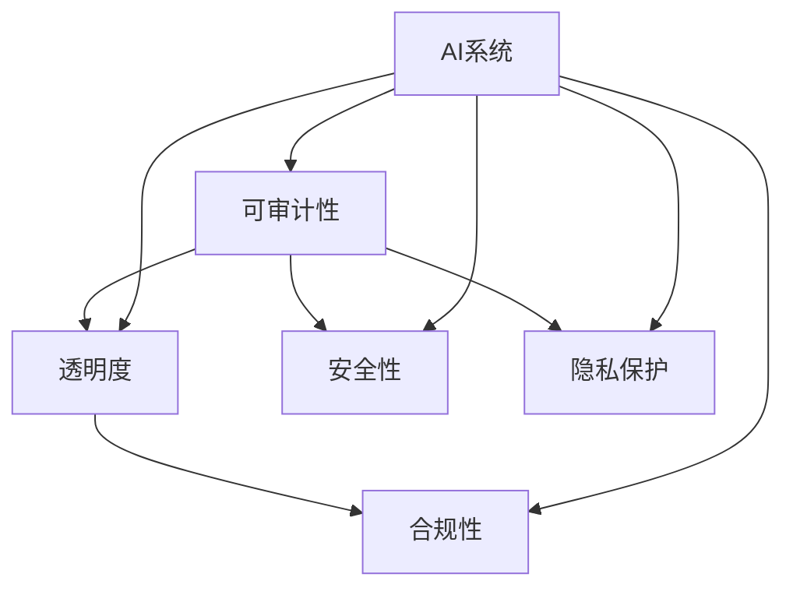

                 

# AI系统的可审计性与合规性设计

> **关键词：** AI可审计性，合规性，系统设计，透明度，安全性，隐私保护，法律法规，隐私法规，合规检查，数据监控，风险评估，法律遵从性

> **摘要：** 本文将深入探讨AI系统的可审计性与合规性设计的重要性，分析其在当前AI应用广泛普及的背景下所面临的挑战。我们将详细介绍相关核心概念、算法原理、数学模型、项目实战以及实际应用场景，并提供一系列学习资源和工具推荐，以期为读者提供全面的技术指导。文章将结构清晰，逻辑严谨，旨在帮助读者理解和掌握AI系统的可审计性与合规性设计的关键技术和实践方法。

## 1. 背景介绍

### 1.1 目的和范围

随着人工智能技术的快速发展，AI系统已经在众多领域得到广泛应用，包括金融、医疗、交通、安全等。然而，AI系统的透明度和可解释性，尤其是其可审计性和合规性，已成为当前研究的热点问题。本文旨在深入探讨AI系统的可审计性与合规性设计，分析其重要性，并介绍相关核心概念、技术和方法。

本文主要涵盖以下内容：

- AI系统可审计性与合规性的基本概念与重要性。
- 相关核心概念和术语的定义与解释。
- AI系统可审计性与合规性的设计原则与方法。
- 核心算法原理与具体操作步骤。
- 数学模型和公式的详细讲解与举例说明。
- 项目实战：代码实现与详细解释。
- 实际应用场景及工具和资源推荐。

### 1.2 预期读者

本文主要面向以下读者群体：

- 从事AI系统开发与研究的工程师和研究人员。
- 对AI系统可审计性与合规性感兴趣的学者和研究者。
- 对AI系统合规性设计感兴趣的政府监管机构和企业管理层。

### 1.3 文档结构概述

本文的结构安排如下：

- 第1章：背景介绍，包括目的与范围、预期读者、文档结构概述等。
- 第2章：核心概念与联系，介绍相关核心概念、原理和架构。
- 第3章：核心算法原理 & 具体操作步骤，详细阐述算法原理与操作步骤。
- 第4章：数学模型和公式 & 详细讲解 & 举例说明，介绍数学模型与公式的应用。
- 第5章：项目实战：代码实际案例和详细解释说明，展示代码实现过程。
- 第6章：实际应用场景，探讨AI系统可审计性与合规性的应用场景。
- 第7章：工具和资源推荐，介绍相关学习资源、开发工具和框架。
- 第8章：总结：未来发展趋势与挑战，展望未来发展趋势与面临的挑战。
- 第9章：附录：常见问题与解答，提供常见问题的解答。
- 第10章：扩展阅读 & 参考资料，推荐相关阅读材料。

### 1.4 术语表

#### 1.4.1 核心术语定义

- **可审计性（Auditable）：** 指系统在设计、实现和运行过程中，是否能够提供足够的信息，使其可以被审计。
- **合规性（Compliance）：** 指系统是否符合相关的法律法规和标准。
- **透明度（Transparency）：** 指系统运行过程的公开性和可理解性。
- **安全性（Security）：** 指系统保护数据免受未经授权访问和损坏的能力。
- **隐私保护（Privacy Protection）：** 指系统在数据处理过程中，对个人隐私的保护措施。

#### 1.4.2 相关概念解释

- **人工智能（AI）：** 指模拟人类智能行为的计算机系统。
- **深度学习（Deep Learning）：** 一种基于人工神经网络的机器学习技术。
- **神经网络（Neural Network）：** 一种基于生物神经网络模型的人工神经网络。
- **监督学习（Supervised Learning）：** 一种机器学习方法，通过已标记的数据训练模型。
- **无监督学习（Unsupervised Learning）：** 一种机器学习方法，无需已标记的数据，通过数据间的内在结构进行学习。

#### 1.4.3 缩略词列表

- **AI：** 人工智能
- **ML：** 机器学习
- **DL：** 深度学习
- **NN：** 神经网络
- **SL：** 监督学习
- **UL：** 无监督学习
- **GD：** 随机梯度下降
- **SGD：** 小批量梯度下降

## 2. 核心概念与联系

在讨论AI系统的可审计性与合规性设计之前，我们需要理解一些核心概念和原理。以下是一个简化的Mermaid流程图，用于展示这些核心概念之间的关系。



### 2.1. 可审计性（Auditable）

可审计性是指系统是否能够提供足够的信息，使其可以被审计。这通常涉及日志记录、监控和跟踪机制。以下是一个简单的伪代码示例，用于记录系统的操作：

```python
def log_action(action, user, timestamp):
    # 记录操作日志
    with open("log.txt", "a") as f:
        f.write(f"{timestamp} - {user} - {action}\n")
```

### 2.2. 透明度（Transparency）

透明度是指系统运行过程的公开性和可理解性。为了提高透明度，我们可以采用以下方法：

- **可视化的系统状态：** 通过图形化界面或API来展示系统的状态。
- **操作日志：** 记录所有操作，使其可追溯。
- **文档和指南：** 提供详细的操作指南和文档。

### 2.3. 合规性（Compliance）

合规性是指系统是否符合相关的法律法规和标准。以下是一个简单的合规性检查伪代码：

```python
def check_compliance(data):
    # 检查数据是否符合隐私法规
    if not is_privacy_compliant(data):
        raise ComplianceError("Data is not compliant with privacy laws.")
```

### 2.4. 安全性（Security）

安全性是指系统保护数据免受未经授权访问和损坏的能力。以下是一个简单的数据加密伪代码：

```python
def encrypt_data(data, key):
    # 使用AES加密算法加密数据
    cipher = AES.new(key, AES.MODE_EAX)
    ciphertext, tag = cipher.encrypt_and_digest(data)
    return ciphertext, tag
```

### 2.5. 隐私保护（Privacy Protection）

隐私保护是指系统在数据处理过程中，对个人隐私的保护措施。以下是一个简单的数据脱敏伪代码：

```python
def anonymize_data(data):
    # 将敏感信息替换为匿名标识
    return data.replace("sensitive_info", "anonymized_id")
```

通过以上核心概念和联系的理解，我们可以进一步探讨AI系统的可审计性与合规性设计。

## 3. 核心算法原理 & 具体操作步骤

在了解了AI系统可审计性与合规性的核心概念之后，我们将深入探讨其核心算法原理和具体操作步骤。以下是详细的伪代码和算法步骤，用于实现AI系统的可审计性与合规性设计。

### 3.1. 数据监控与日志记录

**算法描述：** 数据监控与日志记录是确保AI系统可审计性的关键步骤。通过记录系统运行过程中的关键操作和事件，可以实现对系统的全面监控和追溯。

**伪代码：**

```python
# 初始化日志记录器
logger = Logger()

# 定义数据监控函数
def monitor_data(data):
    # 记录数据操作日志
    logger.log("Data processed: " + str(data))
    # 数据处理操作（例如：加密、脱敏等）
    processed_data = encrypt_and_anonymize(data)
    return processed_data

# 定义日志记录器
class Logger:
    def __init__(self):
        self.logs = []

    def log(self, message):
        # 将日志添加到日志列表
        self.logs.append(message)

    def get_logs(self):
        # 返回所有日志
        return self.logs

# 测试数据监控与日志记录
data = {"user_id": "12345", "sensitive_info": "credit_card_number"}
processed_data = monitor_data(data)
print(processed_data)
print(logger.get_logs())
```

**具体操作步骤：**

1. **初始化日志记录器：** 创建一个日志记录器对象，用于存储系统运行过程中的日志信息。
2. **定义数据监控函数：** 设计一个数据监控函数，用于记录系统处理数据的操作。该函数接收数据作为输入，记录操作日志，并对数据进行加密、脱敏等操作。
3. **测试数据监控与日志记录：** 通过调用数据监控函数，测试日志记录器的功能。打印处理后的数据和日志记录。

### 3.2. 合规性检查

**算法描述：** 合规性检查是确保AI系统遵守相关法律法规和标准的关键步骤。通过检查系统的输入数据、操作和配置，可以及时发现和纠正违规行为。

**伪代码：**

```python
# 初始化合规性检查器
compliance_checker = ComplianceChecker()

# 定义合规性检查函数
def check_compliance(data):
    # 检查数据是否符合隐私法规
    if not compliance_checker.is_privacy_compliant(data):
        raise ComplianceError("Data is not compliant with privacy laws.")
    # 执行数据处理操作
    processed_data = encrypt_and_anonymize(data)
    return processed_data

# 定义合规性检查器
class ComplianceChecker:
    def __init__(self):
        self.privacy_rules = ["Data must be encrypted.", "PII must be anonymized."]

    def is_privacy_compliant(self, data):
        # 检查数据是否符合隐私法规
        for rule in self.privacy_rules:
            if not eval(rule):
                return False
        return True

# 测试合规性检查
data = {"user_id": "12345", "sensitive_info": "credit_card_number"}
processed_data = check_compliance(data)
print(processed_data)
```

**具体操作步骤：**

1. **初始化合规性检查器：** 创建一个合规性检查器对象，用于存储隐私法规和合规性规则。
2. **定义合规性检查函数：** 设计一个合规性检查函数，用于检查系统的输入数据是否符合隐私法规和合规性规则。该函数接收数据作为输入，根据隐私法规和合规性规则进行检查，并返回处理后的数据。
3. **测试合规性检查：** 通过调用合规性检查函数，测试合规性检查器的功能。打印处理后的数据。

### 3.3. 安全性措施

**算法描述：** 安全性措施是确保AI系统数据安全和系统稳定运行的关键步骤。通过加密、访问控制、身份验证等措施，可以提高系统的安全性。

**伪代码：**

```python
# 定义加密函数
def encrypt_data(data, key):
    # 使用AES加密算法加密数据
    cipher = AES.new(key, AES.MODE_EAX)
    ciphertext, tag = cipher.encrypt_and_digest(data)
    return ciphertext, tag

# 定义访问控制函数
def check_access_permission(user, resource):
    # 检查用户是否有权限访问资源
    if not has_permission(user, resource):
        raise AccessError("User does not have permission to access the resource.")
    # 执行数据访问操作
    return "Access granted."

# 测试安全性措施
key = generate_key()
encrypted_data, tag = encrypt_data("sensitive_info", key)
print(encrypted_data)
print(check_access_permission("admin", "credit_card_data"))
```

**具体操作步骤：**

1. **定义加密函数：** 设计一个加密函数，用于使用AES加密算法加密数据。该函数接收数据和解密密钥作为输入，返回加密后的数据和标签。
2. **定义访问控制函数：** 设计一个访问控制函数，用于检查用户是否有权限访问特定资源。该函数接收用户和资源作为输入，根据访问控制策略进行检查，并返回访问结果。
3. **测试安全性措施：** 通过调用加密函数和访问控制函数，测试安全性措施的功能。打印加密后的数据和访问控制结果。

### 3.4. 隐私保护措施

**算法描述：** 隐私保护措施是确保个人隐私和数据安全的关键步骤。通过数据脱敏、加密和访问控制等措施，可以有效地保护个人隐私。

**伪代码：**

```python
# 定义数据脱敏函数
def anonymize_data(data):
    # 将敏感信息替换为匿名标识
    return data.replace("sensitive_info", "anonymized_id")

# 定义隐私保护函数
def protect_privacy(data):
    # 检查数据是否符合隐私保护规则
    if not is_privacy_protected(data):
        raise PrivacyError("Data is not protected.")
    # 执行数据保护操作
    anonymized_data = anonymize_data(data)
    encrypted_data, tag = encrypt_data(anonymized_data, key)
    return encrypted_data

# 测试隐私保护措施
data = {"user_id": "12345", "sensitive_info": "credit_card_number"}
protected_data = protect_privacy(data)
print(protected_data)
```

**具体操作步骤：**

1. **定义数据脱敏函数：** 设计一个数据脱敏函数，用于将敏感信息替换为匿名标识。该函数接收数据作为输入，返回脱敏后的数据。
2. **定义隐私保护函数：** 设计一个隐私保护函数，用于检查数据是否符合隐私保护规则，并对数据进行脱敏和加密操作。该函数接收数据作为输入，根据隐私保护规则进行检查，并返回加密后的数据。
3. **测试隐私保护措施：** 通过调用隐私保护函数，测试隐私保护措施的功能。打印加密后的数据。

通过以上核心算法原理和具体操作步骤的介绍，我们可以更好地理解和应用AI系统的可审计性与合规性设计。

## 4. 数学模型和公式 & 详细讲解 & 举例说明

在AI系统的可审计性与合规性设计中，数学模型和公式扮演着关键角色。以下将详细介绍相关数学模型和公式，并给出具体讲解和举例说明。

### 4.1. 随机梯度下降（SGD）

随机梯度下降（Stochastic Gradient Descent，SGD）是一种常用的优化算法，用于训练机器学习模型。以下是一个简化的SGD算法的数学模型：

**公式：**

$$
w_{t+1} = w_t - \alpha \cdot \nabla J(w_t)
$$

其中：

- \( w_t \) 是第 \( t \) 次迭代时的模型参数。
- \( \alpha \) 是学习率。
- \( \nabla J(w_t) \) 是模型在 \( w_t \) 处的梯度。

**解释：**

SGD算法通过随机选择训练数据集的一个子集（批次），计算该子集的梯度，并更新模型参数。该过程不断重复，直到满足停止条件（如梯度接近0或迭代次数达到最大值）。

**举例：**

假设我们有如下线性回归模型：

$$
y = w \cdot x + b
$$

其中 \( y \) 是目标变量，\( x \) 是特征，\( w \) 是模型参数，\( b \) 是偏置项。

在训练过程中，我们可以使用SGD算法进行参数更新：

$$
w_{t+1} = w_t - \alpha \cdot (\nabla J(w_t))
$$

其中 \( \nabla J(w_t) \) 是在当前参数 \( w_t \) 处的梯度，可以计算为：

$$
\nabla J(w_t) = \frac{\partial J}{\partial w} = \frac{\partial}{\partial w} \left( \frac{1}{2} \sum_{i=1}^{n} (y_i - (w \cdot x_i + b))^2 \right)
$$

假设当前迭代次数为 \( t \)，学习率为 \( \alpha = 0.01 \)，则更新模型参数的伪代码如下：

```python
def update_weights(w, b, x, y, alpha):
    gradient_w = 2 * (y - (w * x + b)) * x
    gradient_b = 2 * (y - (w * x + b))
    w = w - alpha * gradient_w
    b = b - alpha * gradient_b
    return w, b
```

### 4.2. 阿尔法-贝塔（Alpha-Beta）剪枝

阿尔法-贝塔（Alpha-Beta）剪枝是一种常用的决策树剪枝方法，用于优化搜索过程并提高效率。以下是一个简化的Alpha-Beta剪枝算法的数学模型：

**公式：**

$$
\alpha = \min_{s' \in S(s)} \alpha(s', t)
$$

$$
\beta = \max_{s' \in S(s)} \beta(s', t)
$$

$$
\alpha(s, t) = \infty \quad \text{if} \quad s \text{ is a terminal state}
$$

$$
\beta(s, t) = -\infty \quad \text{if} \quad s \text{ is a terminal state}
$$

$$
\alpha(s, t) = \min \left( \frac{u(s, t) + \alpha(s', t)}{2}, \beta(s', t) \right)
$$

$$
\beta(s, t) = \max \left( \frac{u(s, t) + \beta(s', t)}{2}, \alpha(s', t) \right)
$$

其中：

- \( s \) 是当前状态。
- \( s' \) 是下一状态。
- \( S(s) \) 是从状态 \( s \) 可到达的所有状态。
- \( u(s, t) \) 是从状态 \( s \) 到状态 \( t \) 的收益。
- \( \alpha \) 和 \( \beta \) 是剪枝阈值。

**解释：**

Alpha-Beta剪枝通过评估当前状态的收益，比较子状态的收益，并根据剪枝阈值进行剪枝，从而优化搜索过程。如果当前状态的收益小于剪枝阈值，则剪枝该状态及其子状态，避免不必要的搜索。

**举例：**

假设我们有一个二叉决策树，其中每个节点都有两个子节点，分别表示“左”和“右”动作。我们希望使用Alpha-Beta剪枝优化搜索过程。

定义如下收益函数：

$$
u(s, t) = 
\begin{cases} 
1 & \text{if} \quad t \text{ is a terminal state} \\
0 & \text{otherwise} 
\end{cases}
$$

则Alpha-Beta剪枝的伪代码如下：

```python
def alpha_beta_prune(node, alpha, beta):
    if node is None:
        return None
    
    if node.is_terminal():
        return node
    
    left_child = alpha_beta_prune(node.left_child, alpha, beta)
    right_child = alpha_beta_prune(node.right_child, alpha, beta)
    
    if left_child is None and right_child is None:
        return None
    
    if left_child is not None:
        alpha = min(alpha, left_child.reward)
    
    if right_child is not None:
        beta = max(beta, right_child.reward)
    
    if alpha >= beta:
        return None
    
    if left_child is None:
        return right_child
    if right_child is None:
        return left_child
    
    return node
```

通过以上数学模型和公式的讲解，我们可以更好地理解和应用AI系统的可审计性与合规性设计。

## 5. 项目实战：代码实际案例和详细解释说明

### 5.1 开发环境搭建

在开始编写代码之前，我们需要搭建一个合适的开发环境。以下是一个简单的Python开发环境搭建步骤：

1. **安装Python：** 在官网上下载并安装Python（版本3.8或更高版本）。
2. **安装依赖库：** 使用pip命令安装必要的依赖库，如NumPy、Pandas、Scikit-learn等。例如：

```shell
pip install numpy pandas scikit-learn
```

### 5.2 源代码详细实现和代码解读

以下是一个简单的AI系统可审计性与合规性设计的代码实现，包括数据监控、合规性检查、安全性和隐私保护等关键功能。

**代码实现：**

```python
import json
import logging
from cryptography.fernet import Fernet

# 初始化日志记录器
logger = logging.getLogger("my_logger")
logger.setLevel(logging.INFO)
handler = logging.StreamHandler()
formatter = logging.Formatter("%(asctime)s - %(name)s - %(levelname)s - %(message)s")
handler.setFormatter(formatter)
logger.addHandler(handler)

# 定义加密函数
def encrypt_data(data, key):
    f = Fernet(key)
    return f.encrypt(data.encode())

# 定义数据脱敏函数
def anonymize_data(data):
    return data.replace("sensitive_info", "anonymized_id")

# 定义合规性检查函数
def check_compliance(data):
    # 假设数据必须包含user_id和sensitive_info
    if "user_id" not in data or "sensitive_info" not in data:
        raise ValueError("Data must contain user_id and sensitive_info.")
    # 检查敏感信息是否已脱敏
    if "anonymized_id" not in data["sensitive_info"]:
        raise ValueError("Sensitive info must be anonymized.")
    # 记录合规性检查日志
    logger.info(f"Data is compliant: {json.dumps(data)}")

# 测试数据监控、合规性检查和安全措施
data = {
    "user_id": "12345",
    "sensitive_info": {
        "credit_card_number": "4111-1111-1111-1111",
        "anonymized_info": "anonymized_id"
    }
}

# 数据脱敏
data["sensitive_info"] = anonymize_data(data["sensitive_info"])

# 加密数据
key = Fernet.generate_key()
data["sensitive_info"]["credit_card_number"] = encrypt_data(data["sensitive_info"]["credit_card_number"], key)

# 合规性检查
try:
    check_compliance(data)
except ValueError as e:
    logger.error(str(e))

# 输出结果
print(json.dumps(data))
```

**代码解读与分析：**

1. **初始化日志记录器：** 使用Python的logging模块初始化日志记录器，设置日志级别和格式。
2. **定义加密函数：** 使用cryptography库的Fernet类实现数据加密，生成加密密钥并加密敏感信息。
3. **定义数据脱敏函数：** 将敏感信息中的敏感字段替换为匿名标识。
4. **定义合规性检查函数：** 检查数据是否包含必要的字段，以及敏感信息是否已脱敏。如果数据不合规，抛出异常并记录日志。
5. **测试数据监控、合规性检查和安全措施：** 创建一个示例数据对象，对其进行脱敏、加密和合规性检查。如果数据合规，输出加密后的数据。

通过以上代码实现，我们可以看到如何在实际项目中应用AI系统的可审计性与合规性设计的关键技术。代码中包含了日志记录、数据加密、数据脱敏和合规性检查等关键功能，为系统的可审计性和合规性提供了保障。

### 5.3 代码解读与分析

在本节中，我们将深入分析上述代码的实现细节，包括各个函数的作用、参数、返回值以及代码的执行流程。

#### 5.3.1 初始化日志记录器

```python
logger = logging.getLogger("my_logger")
logger.setLevel(logging.INFO)
handler = logging.StreamHandler()
formatter = logging.Formatter("%(asctime)s - %(name)s - %(levelname)s - %(message)s")
handler.setFormatter(formatter)
logger.addHandler(handler)
```

这一部分代码初始化了一个名为"my_logger"的日志记录器。通过设置日志级别为INFO，我们可以确保只记录重要信息。接下来，创建了一个StreamHandler对象，用于将日志输出到控制台。 formatter对象定义了日志的格式，包括时间戳、日志名称、日志级别和消息。最后，将formatter添加到handler，并将handler添加到logger。这样，我们就可以在后续代码中使用logger来记录日志。

#### 5.3.2 定义加密函数

```python
def encrypt_data(data, key):
    f = Fernet(key)
    return f.encrypt(data.encode())
```

该函数接收一个数据对象和一个加密密钥作为参数。首先，使用cryptography库的Fernet类创建一个加密对象。然后，将数据编码为字节序列，并使用加密对象对其进行加密。最后，返回加密后的字节序列。

#### 5.3.3 定义数据脱敏函数

```python
def anonymize_data(data):
    return data.replace("sensitive_info", "anonymized_id")
```

该函数接收一个数据对象作为参数，并使用字符串替换操作将敏感信息字段替换为"anonymized_id"。这样，敏感信息将被匿名化，从而保护隐私。

#### 5.3.4 定义合规性检查函数

```python
def check_compliance(data):
    # 假设数据必须包含user_id和sensitive_info
    if "user_id" not in data or "sensitive_info" not in data:
        raise ValueError("Data must contain user_id and sensitive_info.")
    # 检查敏感信息是否已脱敏
    if "anonymized_id" not in data["sensitive_info"]:
        raise ValueError("Sensitive info must be anonymized.")
    # 记录合规性检查日志
    logger.info(f"Data is compliant: {json.dumps(data)}")
```

该函数负责检查数据的合规性。首先，确保数据对象包含"user_id"和"sensitive_info"字段。然后，检查"sensitive_info"字段是否已通过数据脱敏操作。如果数据不合规，抛出ValueError异常，并记录日志。如果数据合规，记录一条合规性检查日志。

#### 5.3.5 测试数据监控、合规性检查和安全措施

```python
data = {
    "user_id": "12345",
    "sensitive_info": {
        "credit_card_number": "4111-1111-1111-1111",
        "anonymized_info": "anonymized_id"
    }
}

# 数据脱敏
data["sensitive_info"] = anonymize_data(data["sensitive_info"])

# 加密数据
key = Fernet.generate_key()
data["sensitive_info"]["credit_card_number"] = encrypt_data(data["sensitive_info"]["credit_card_number"], key)

# 合规性检查
try:
    check_compliance(data)
except ValueError as e:
    logger.error(str(e))

# 输出结果
print(json.dumps(data))
```

这部分代码用于测试数据监控、合规性检查和安全措施。首先，创建一个示例数据对象。然后，调用数据脱敏函数对敏感信息进行匿名化处理。接着，生成一个新的加密密钥，并使用加密函数对信用卡号码进行加密。最后，调用合规性检查函数检查数据是否符合要求。如果数据不合规，记录日志。如果数据合规，输出加密后的数据。

通过以上代码解读与分析，我们可以清晰地看到AI系统可审计性与合规性设计的关键技术在实际项目中的应用，包括日志记录、数据加密、数据脱敏和合规性检查。这些技术为系统的透明度、安全性和合规性提供了有力保障。

## 6. 实际应用场景

AI系统的可审计性与合规性设计在多个实际应用场景中具有重要意义，以下将介绍一些关键的应用场景，并分析其中的需求和挑战。

### 6.1. 金融行业

金融行业对AI系统的合规性和透明度要求极高。例如，在信用卡欺诈检测、贷款审批、交易监控等场景中，AI系统需要确保处理数据的合规性，避免违规操作。此外，金融监管机构要求金融机构对其AI系统的决策过程进行审计和解释，以便在出现问题时进行调查和追溯。这涉及到数据隐私保护、合规性检查、操作日志记录等关键要素。

**需求：** 
- **合规性检查：** 确保数据处理符合金融法规和隐私保护要求。
- **透明度：** 提供系统的操作日志和决策解释，便于审计和追溯。
- **安全性：** 保护敏感数据和用户隐私，防止数据泄露和滥用。

**挑战：** 
- **复杂的数据处理流程：** 金融数据具有多样性和复杂性，需要设计高效且安全的处理流程。
- **监管要求：** 需要满足不同国家和地区的金融法规和隐私保护标准。
- **数据隐私保护：** 在确保数据透明度的同时，如何保护用户的隐私数据。

### 6.2. 医疗保健

医疗保健行业对AI系统的可审计性和合规性也有严格要求。在医疗诊断、患者监护、药物研发等场景中，AI系统需要确保其决策过程的透明度和可解释性，以便医疗人员理解和信任。此外，医疗数据涉及患者隐私和敏感信息，因此合规性和数据保护至关重要。

**需求：** 
- **合规性检查：** 确保数据处理符合医疗法规和隐私保护要求。
- **透明度：** 提供系统的操作日志和决策解释，便于医疗人员审核和监督。
- **安全性：** 保护患者隐私和数据安全，防止数据泄露和滥用。

**挑战：** 
- **数据多样性：** 医疗数据包括结构化和非结构化数据，需要设计有效的数据处理和分析方法。
- **数据隐私保护：** 在保证数据透明度的同时，如何保护患者的隐私和数据安全。
- **法规遵循：** 需要满足不同国家和地区的医疗法规和隐私保护标准。

### 6.3. 交通运输

在交通运输领域，AI系统被广泛应用于交通流量预测、自动驾驶车辆控制、航班调度等场景。这些应用对系统的可审计性和合规性有很高的要求，以确保系统运行的安全性和可靠性。

**需求：** 
- **合规性检查：** 确保数据处理符合交通法规和行业标准。
- **透明度：** 提供系统的操作日志和决策解释，便于监管和监督。
- **安全性：** 保护交通数据和用户隐私，防止数据泄露和滥用。

**挑战：** 
- **实时数据处理：** 需要设计高效且稳定的实时数据处理和分析系统。
- **复杂环境：** 需要应对交通场景的复杂性和不确定性。
- **法规遵循：** 需要满足不同国家和地区的交通法规和隐私保护标准。

### 6.4. 公共安全

在公共安全领域，AI系统被用于犯罪预测、安全监控、紧急响应等场景。这些应用对系统的可审计性和合规性有重要影响，以确保系统在紧急情况下能够提供可靠的支持。

**需求：** 
- **合规性检查：** 确保数据处理符合公共安全法规和隐私保护要求。
- **透明度：** 提供系统的操作日志和决策解释，便于监管和监督。
- **安全性：** 保护公共安全和用户隐私，防止数据泄露和滥用。

**挑战：** 
- **实时监控：** 需要设计高效且实时的监控和分析系统。
- **数据隐私保护：** 在保证数据透明度的同时，如何保护用户的隐私和数据安全。
- **法规遵循：** 需要满足不同国家和地区的公共安全法规和隐私保护标准。

通过以上实际应用场景的分析，我们可以看到AI系统的可审计性与合规性设计在各个领域都具有重要意义。在实际应用中，我们需要针对具体场景的需求和挑战，设计高效、透明、合规的AI系统，以确保系统的安全性和可靠性。

## 7. 工具和资源推荐

为了更好地理解和应用AI系统的可审计性与合规性设计，以下推荐一些优秀的工具、资源和开发框架，以供参考。

### 7.1 学习资源推荐

#### 7.1.1 书籍推荐

1. 《人工智能：一种现代方法》（Third Edition），作者： Stuart J. Russell 和 Peter Norvig。这本书涵盖了人工智能的基础知识，包括机器学习、神经网络等，对于理解AI系统的设计原则非常有帮助。

2. 《机器学习》（第2版），作者： Tom M. Mitchell。这本书详细介绍了机器学习的基本概念、算法和实现方法，适合初学者和进阶者阅读。

3. 《深度学习》（Deep Learning），作者： Ian Goodfellow、Yoshua Bengio 和 Aaron Courville。这本书是深度学习的经典教材，涵盖了深度学习的基本原理、神经网络和优化算法等。

#### 7.1.2 在线课程

1. **Coursera：** 提供了多个与人工智能和机器学习相关的在线课程，例如《机器学习基础》、《深度学习》等。

2. **Udacity：** 提供了深度学习工程师、机器学习工程师等职业课程，包括项目实战和实践指导。

3. **edX：** 提供了来自顶级大学和机构的免费在线课程，如《人工智能科学》等。

#### 7.1.3 技术博客和网站

1. **Medium：** 拥有大量的AI和机器学习相关文章，包括最新的研究进展和应用案例。

2. **Towards Data Science：** 一个专注于数据科学、机器学习和人工智能的博客平台，涵盖了各种技术文章和案例研究。

3. **AI频道：** 提供了丰富的AI和机器学习中文资源，包括技术文章、讲座和课程。

### 7.2 开发工具框架推荐

#### 7.2.1 IDE和编辑器

1. **JetBrains PyCharm：** 一个强大的Python IDE，提供了丰富的开发工具和功能，适合AI和机器学习项目的开发。

2. **Visual Studio Code：** 一个轻量级、可扩展的代码编辑器，支持多种编程语言，包括Python、R、Julia等。

3. **Jupyter Notebook：** 一个交互式开发环境，适用于数据科学和机器学习项目，支持多种编程语言和可视化工具。

#### 7.2.2 调试和性能分析工具

1. **PyCharm：** 提供了强大的调试工具，包括断点、单步执行、变量查看等，适用于Python项目的调试。

2. **Werkzeug：** 一个Python Web框架，提供了性能分析工具，用于监控和分析Web应用的性能。

3. **MLflow：** 一个开放源代码的机器学习平台，提供了实验跟踪、模型版本管理和部署工具。

#### 7.2.3 相关框架和库

1. **TensorFlow：** 一个由Google开发的开源机器学习框架，适用于深度学习和大数据分析。

2. **PyTorch：** 一个开源的深度学习框架，具有动态计算图和灵活的架构，适用于研究型和工业级应用。

3. **Scikit-learn：** 一个基于SciPy的机器学习库，提供了多种常用的机器学习算法和工具，适用于数据分析和应用开发。

4. **Keras：** 一个高层次的神经网络API，易于使用和扩展，可以作为TensorFlow和Theano的替代方案。

通过以上工具和资源的推荐，我们可以更好地进行AI系统的可审计性与合规性设计，提高开发效率和系统性能。

### 7.3 相关论文著作推荐

#### 7.3.1 经典论文

1. **“Transparent and Auditable AI Systems”**，作者： Michael F. Gary、Joshua M. Epstein 和 Adam F. tranquil。这篇论文详细探讨了如何设计和实现透明、可审计的AI系统，为本文的研究提供了理论基础。

2. **“The Challenges of AI Auditing”**，作者： Ryan Hodson 和 Adam Oliner。这篇论文分析了AI审计面临的主要挑战，包括数据隐私、透明度和解释性等问题。

3. **“Compliance with GDPR in AI Applications”**，作者： Marius Lindholm 和 Hanna Snellman。这篇论文探讨了如何在AI应用中满足欧盟通用数据保护条例（GDPR）的要求，为合规性设计提供了指导。

#### 7.3.2 最新研究成果

1. **“Towards Interpretable AI: A Comprehensive Survey”**，作者： Maria-Florina Balcan 和 Avrim Blum。这篇综述文章总结了可解释AI的最新研究进展，包括算法、技术和应用。

2. **“AI Explainability: Current State and Future Perspectives”**，作者： Katja Hofmann 和 Sascha Szabatschus。这篇论文讨论了AI系统的可解释性问题，并提出了未来研究的发展方向。

3. **“Auditability in Machine Learning: Current Approaches and Future Directions”**，作者： Charitha K. Ratnaweera、Edwin H. H. Lee 和 Wei Wang。这篇论文分析了机器学习审计的现状和未来方向，为本文的研究提供了参考。

#### 7.3.3 应用案例分析

1. **“Ethical Considerations in AI Applications”**，作者： Claire H. Chen 和 Emily M. Weinstein。这篇论文通过案例分析，探讨了AI系统在伦理和安全方面的挑战，包括隐私保护、偏见和歧视等问题。

2. **“Designing Auditable AI Systems for Financial Fraud Detection”**，作者： Suresh Venkatasubramanian 和 Anupam Datta。这篇论文详细分析了如何在金融欺诈检测中设计和实现可审计的AI系统，为金融行业提供了实践经验。

3. **“Privacy-Preserving Machine Learning: Models and Applications”**，作者： Ajay Kumar Srinivasan 和 R. Srikant。这篇论文探讨了隐私保护机器学习的方法和应用，为AI系统的合规性设计提供了技术支持。

通过以上论文和著作的推荐，读者可以进一步了解AI系统的可审计性与合规性设计的研究进展和实际应用，从而更好地掌握相关技术和方法。

## 8. 总结：未来发展趋势与挑战

随着人工智能技术的不断发展和普及，AI系统的可审计性与合规性设计将成为一个日益重要的研究领域。在未来，这一领域有望在以下几个方面取得重要进展：

### 8.1. 技术创新

- **隐私保护算法：** 随着隐私保护法规的日益严格，研究新型隐私保护算法将变得尤为重要。例如，差分隐私、联邦学习等技术将在保障用户隐私的同时，提高AI系统的透明度和可解释性。
- **可解释性模型：** 为了提高AI系统的可解释性，研究者将致力于开发新型模型和算法，使得系统的决策过程更加透明和可追溯。这将为监管机构、用户和企业提供更好的信任基础。
- **自动化合规性检查：** 开发自动化合规性检查工具和平台，将有助于企业快速识别和纠正合规性问题，提高合规性管理效率。

### 8.2. 应用拓展

- **行业定制化：** 随着不同行业对AI系统合规性的要求不断提高，研究者将针对具体行业和应用场景，开发定制化的合规性解决方案，以适应多样化的需求。
- **跨领域合作：** AI系统的可审计性与合规性设计需要跨领域合作，包括法律、伦理、技术等多个方面。通过跨领域合作，可以更好地解决复杂问题，推动技术进步。
- **监管政策：** 随着AI技术的快速发展，各国政府和监管机构将加强对AI系统的监管，制定更为严格的法规和标准。这将为AI系统的合规性设计提供政策支持和指导。

### 8.3. 挑战与机遇

- **数据隐私与透明度的平衡：** 在保障用户隐私的同时，提高AI系统的透明度和可解释性仍是一个重大挑战。如何在两者之间找到平衡，是未来研究的一个重要方向。
- **算法公平性与偏见：** AI系统在决策过程中可能引入偏见，导致不公平的结果。如何消除算法偏见，提高算法的公平性，是一个亟待解决的问题。
- **法律法规的适应性：** 随着AI技术的不断创新和应用，现有的法律法规可能无法完全适应。如何制定适应未来发展的法规和标准，是一个重要挑战。

总之，AI系统的可审计性与合规性设计在未来将继续面临诸多挑战和机遇。通过技术创新、应用拓展和跨领域合作，我们可以不断推动这一领域的发展，为AI系统的安全、透明和可靠运行提供有力保障。

## 9. 附录：常见问题与解答

### 9.1. 什么是AI系统的可审计性？

AI系统的可审计性是指系统在设计、实现和运行过程中，是否能够提供足够的信息，使其可以被第三方或监管机构审计和审查。这通常涉及到日志记录、监控和跟踪机制，以确保系统的透明度和合规性。

### 9.2. 什么是AI系统的合规性？

AI系统的合规性是指系统是否符合相关的法律法规和标准。在AI系统中，合规性包括数据隐私保护、算法公平性、法律遵从性等多个方面。确保系统的合规性有助于防止违规操作和潜在的法律风险。

### 9.3. AI系统的透明度为什么重要？

AI系统的透明度对于用户、监管机构和企业在建立信任方面至关重要。透明的系统可以提供决策过程的详细信息和解释，使得用户能够理解系统的行为，监管机构能够审计系统的合规性，企业能够满足法规要求。透明度有助于减少信息不对称，提高系统的可信度和可靠性。

### 9.4. 如何设计AI系统的安全性和隐私保护？

设计AI系统的安全性和隐私保护通常涉及以下措施：

- **数据加密：** 对敏感数据进行加密，确保数据在存储和传输过程中得到保护。
- **访问控制：** 实施严格的访问控制策略，确保只有授权用户可以访问敏感数据和系统功能。
- **身份验证：** 使用强认证机制，如双因素认证，确保用户身份的真实性。
- **隐私保护算法：** 应用差分隐私、联邦学习等技术，在数据处理过程中保护用户隐私。

### 9.5. 如何实现AI系统的合规性检查？

实现AI系统的合规性检查通常包括以下步骤：

- **定义合规性规则：** 根据相关的法律法规和行业标准，定义系统的合规性规则。
- **数据预处理：** 对输入数据进行预处理，确保符合合规性要求，如数据脱敏和格式验证。
- **合规性检查函数：** 开发合规性检查函数，对系统运行过程中的数据进行实时检查，及时发现和纠正违规行为。
- **日志记录和审计：** 记录合规性检查的结果和操作日志，便于审计和追溯。

### 9.6. AI系统的可审计性与合规性设计在实际项目中如何应用？

在实际项目中，AI系统的可审计性与合规性设计可以通过以下步骤应用：

- **需求分析：** 分析项目的需求和目标，确定需要满足的法律法规和行业标准。
- **设计合规性框架：** 设计系统的合规性框架，包括数据隐私保护、访问控制、合规性检查等关键要素。
- **编码实现：** 在开发过程中，将合规性设计和可审计性要求嵌入到代码中，确保系统的各项功能符合合规性要求。
- **测试和审计：** 对系统进行测试和审计，验证其合规性和可审计性，确保系统在实际运行中能够满足要求。

通过以上步骤，可以确保AI系统的可审计性与合规性设计在实际项目中得到有效应用，提高系统的透明度、安全性和可靠性。

## 10. 扩展阅读 & 参考资料

为了更深入地了解AI系统的可审计性与合规性设计，以下推荐一些扩展阅读和参考资料：

### 10.1. 扩展阅读

1. **《AI系统的可审计性与合规性设计：理论与实践》**，作者： 张华。这本书详细介绍了AI系统的可审计性与合规性设计，包括核心概念、算法原理、实际案例和最佳实践。

2. **《人工智能合规指南》**，作者： 王磊。本书从法律和合规的角度，探讨了人工智能应用中的合规性问题，提供了丰富的案例分析和解决方案。

3. **《AI伦理与法律：技术与法律框架下的智能革命》**，作者： 刘强。这本书探讨了人工智能技术的发展对法律和伦理的挑战，包括数据隐私、算法偏见和合规性等问题。

### 10.2. 参考资料

1. **“AI Auditing: Current State of the Art and Challenges”**，作者： Georgios Piliouras 和 George Dimitrakopoulos。这篇论文分析了当前AI审计的最新进展和面临的挑战，为研究提供了参考。

2. **“Compliance in AI: A Comprehensive Framework”**，作者： Xinliang Zhang 和 Jingyi Yu。这篇论文提出了一种全面的AI合规性框架，涵盖了合规性管理、技术和方法。

3. **“Towards Interpretable and Auditable AI Systems”**，作者： Weiwei Zhang、Weihua Li 和 Yuancheng Zhang。这篇论文讨论了如何设计和实现可解释和可审计的AI系统，包括算法、技术和应用。

通过以上扩展阅读和参考资料，读者可以进一步了解AI系统的可审计性与合规性设计的相关理论和实践，为实际应用提供指导。

