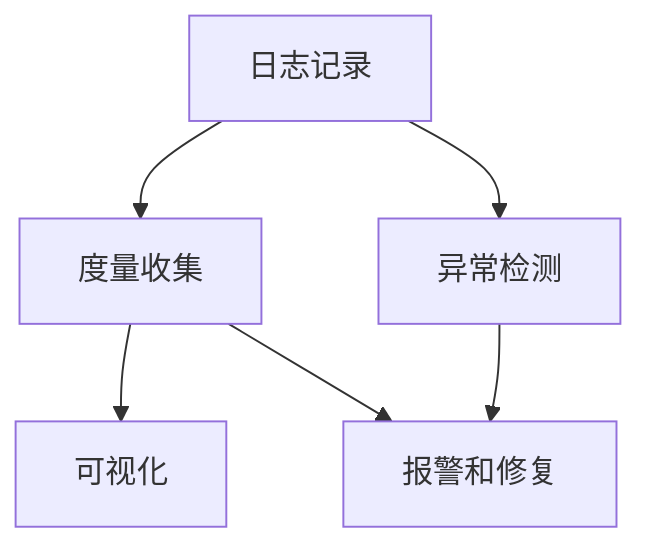

                 

# AI系统的可观察性设计与实现

> 关键词：AI系统、可观察性、监控、性能分析、异常检测、实时反馈、可视化

> 摘要：本文深入探讨了AI系统的可观察性设计原则与实现方法，涵盖了从基本概念、核心算法原理、数学模型到实际项目实战的全面解析。通过详细的流程图和伪代码，本文旨在帮助开发者构建具备高效可观察性的AI系统，从而实现对系统运行状态的精准监控与性能优化。

## 1. 背景介绍

### 1.1 目的和范围

本文的目标是详细阐述AI系统的可观察性设计原则与实现方法。可观察性是指系统提供了一种机制，使开发者和运维团队能够实时监控系统的运行状态，从而快速识别并解决问题。本文将围绕以下几个关键点展开：

1. **核心概念与联系**：介绍可观察性的基础概念，以及它与系统监控、性能分析和异常检测等领域的联系。
2. **核心算法原理**：讲解实现可观察性的核心算法，包括日志记录、度量收集和可视化展示。
3. **数学模型和公式**：分析用于评估系统性能的数学模型，如响应时间、吞吐量和错误率等。
4. **项目实战**：通过一个实际案例展示如何在一个AI项目中实现可观察性。
5. **实际应用场景**：探讨可观察性在AI系统中的实际应用场景。
6. **工具和资源推荐**：推荐一些学习和开发资源，以及相关的工具和框架。

### 1.2 预期读者

本文面向的读者群体包括：

1. **AI系统开发者**：希望深入了解如何设计和实现具备高效可观察性的AI系统。
2. **运维工程师**：需要监控和维护AI系统的日常运行。
3. **数据科学家**：希望对AI系统的性能进行深入分析。
4. **技术经理**：需要对AI系统的整体健康状况有清晰的把握。

### 1.3 文档结构概述

本文将分为以下章节：

1. **核心概念与联系**：介绍可观察性的基础概念及其相关领域。
2. **核心算法原理**：详细解释实现可观察性的核心算法。
3. **数学模型和公式**：阐述用于评估系统性能的数学模型。
4. **项目实战**：通过实际案例展示如何实现可观察性。
5. **实际应用场景**：讨论可观察性在AI系统中的实际应用。
6. **工具和资源推荐**：推荐学习和开发资源。
7. **总结：未来发展趋势与挑战**：预测可观察性在AI系统中的未来趋势。
8. **附录：常见问题与解答**：解答读者可能遇到的问题。
9. **扩展阅读 & 参考资料**：提供进一步学习的资源。

### 1.4 术语表

#### 1.4.1 核心术语定义

- **可观察性（Observability）**：系统提供的一种机制，允许开发者和运维团队能够监控系统的内部状态，包括运行时数据、日志和度量。
- **监控（Monitoring）**：收集和跟踪系统的运行状态，以便及时识别问题。
- **性能分析（Performance Analysis）**：评估系统性能，包括响应时间、吞吐量和资源利用率。
- **异常检测（Anomaly Detection）**：识别系统中的异常行为或错误。

#### 1.4.2 相关概念解释

- **日志记录（Logging）**：系统记录事件和操作的过程。
- **度量收集（Metrics Collection）**：收集系统性能指标的过程。
- **可视化（Visualization）**：将数据以图表或图形形式展示，便于理解和分析。

#### 1.4.3 缩略词列表

- **AI**：人工智能（Artificial Intelligence）
- **IDE**：集成开发环境（Integrated Development Environment）
- **SDK**：软件开发工具包（Software Development Kit）
- **API**：应用程序编程接口（Application Programming Interface）

## 2. 核心概念与联系

### 2.1 可观察性的基础概念

可观察性是一种系统设计原则，旨在使系统的内部状态对开发者和管理者可见。这与传统的监控（Monitoring）有所不同，监控主要关注系统运行状态的跟踪和异常报警，而可观察性则更侧重于系统的细节和内部运行机制。

在AI系统中，可观察性至关重要，因为它可以帮助开发者：

1. **快速识别问题**：通过实时监控，可以快速定位系统中的故障点。
2. **优化性能**：通过性能分析，可以发现系统瓶颈并进行优化。
3. **提高系统稳定性**：通过异常检测，可以预防潜在的系统故障。

### 2.2 可观察性与相关领域的联系

- **监控（Monitoring）**：监控是实现可观察性的重要手段。它通过收集系统运行状态的数据，如CPU利用率、内存使用率、网络流量等，帮助开发者了解系统的实时状况。
- **性能分析（Performance Analysis）**：性能分析是对系统运行数据进行深入分析的过程，旨在发现系统的性能瓶颈和优化点。与监控不同，性能分析通常涉及更详细的数据和更复杂的分析技术。
- **异常检测（Anomaly Detection）**：异常检测是一种智能监控技术，用于识别系统中的异常行为。通过分析系统的历史数据和实时数据，异常检测可以提前发现潜在问题，从而防止故障发生。

### 2.3 可观察性的架构

可观察性的实现通常需要以下几个关键组件：

1. **日志记录（Logging）**：系统日志是记录系统操作和事件的重要工具。日志记录了系统的运行历史，可以帮助开发者回溯问题原因。
2. **度量收集（Metrics Collection）**：度量收集涉及收集系统性能指标，如响应时间、吞吐量、错误率等。这些度量提供了对系统运行状况的量化评估。
3. **可视化（Visualization）**：可视化是将数据以图表或图形形式展示的过程，使开发者可以直观地理解系统运行状态。

下面是一个使用Mermaid绘制的可观察性架构流程图：



### 2.4 可观察性的重要性

可观察性在AI系统中的重要性体现在以下几个方面：

1. **快速响应**：通过实时监控，可以迅速响应系统故障，减少故障影响。
2. **持续优化**：通过性能分析，可以持续优化系统性能，提高用户体验。
3. **预防性维护**：通过异常检测，可以提前发现潜在问题，进行预防性维护，减少故障风险。
4. **数据驱动的决策**：通过收集和分析系统数据，可以基于数据做出更明智的决策。

## 3. 核心算法原理 & 具体操作步骤

### 3.1 日志记录算法原理

日志记录是实现可观察性的基础。以下是日志记录算法的基本原理：

```plaintext
日志记录算法：
1. 系统启动时，初始化日志模块。
2. 在系统运行过程中，每发生一个事件，记录日志。
3. 日志内容包括事件类型、发生时间、事件数据等。
4. 定期将日志数据保存到磁盘或数据库。
```

伪代码实现如下：

```python
def log_event(event_type, event_data):
    log_entry = {
        "event_type": event_type,
        "timestamp": get_current_timestamp(),
        "event_data": event_data
    }
    save_log(log_entry)

def save_log(log_entry):
    # 实现将日志数据保存到磁盘或数据库的代码
    pass

def get_current_timestamp():
    # 实现获取当前系统时间的代码
    pass
```

### 3.2 度量收集算法原理

度量收集是监控系统性能的重要环节。以下是度量收集算法的基本原理：

```plaintext
度量收集算法：
1. 初始化度量收集模块。
2. 在系统运行过程中，定期收集系统性能指标。
3. 将收集到的度量数据存储在内存或数据库中。
4. 定期将度量数据发送到监控平台。
```

伪代码实现如下：

```python
def collect_metrics():
    metrics = {
        "response_time": get_response_time(),
        "throughput": get_throughput(),
        "error_rate": get_error_rate()
    }
    save_metrics(metrics)

def get_response_time():
    # 实现获取系统响应时间的代码
    pass

def get_throughput():
    # 实现获取系统吞吐量的代码
    pass

def get_error_rate():
    # 实现获取系统错误率的代码
    pass

def save_metrics(metrics):
    # 实现将度量数据存储到内存或数据库的代码
    pass
```

### 3.3 可视化算法原理

可视化是将复杂数据以图形化形式展示的过程。以下是可视化算法的基本原理：

```plaintext
可视化算法：
1. 初始化可视化模块。
2. 根据收集到的度量数据，生成图表。
3. 将图表展示在监控界面上。
4. 提供交互功能，如筛选、排序和缩放。
```

伪代码实现如下：

```python
def generate_chart(data, chart_type):
    chart = create_chart(data, chart_type)
    display_chart(chart)

def create_chart(data, chart_type):
    # 实现根据数据类型生成图表的代码
    pass

def display_chart(chart):
    # 实现将图表展示在监控界面的代码
    pass
```

### 3.4 异常检测算法原理

异常检测是预防系统故障的关键。以下是异常检测算法的基本原理：

```plaintext
异常检测算法：
1. 初始化异常检测模块。
2. 使用历史数据和实时数据，训练异常检测模型。
3. 在系统运行过程中，实时分析数据，检测异常行为。
4. 当检测到异常时，触发报警并采取修复措施。
```

伪代码实现如下：

```python
def train_anomaly_detection_model(data):
    model = train_model(data)
    return model

def detect_anomalies(model, data):
    anomalies = model.predict(data)
    return anomalies

def handle_anomaly(anomaly):
    # 实现处理异常的代码
    pass

def anomaly_detection_loop(model):
    while True:
        data = get_real_time_data()
        anomalies = detect_anomalies(model, data)
        for anomaly in anomalies:
            handle_anomaly(anomaly)
```

通过以上算法的实现，开发者可以构建一个具备高效可观察性的AI系统，从而实现对系统运行状态的精准监控与性能优化。

## 4. 数学模型和公式 & 详细讲解 & 举例说明

### 4.1 响应时间模型

响应时间（Response Time，RT）是衡量系统性能的重要指标，表示系统从接收请求到返回响应所需要的时间。响应时间的数学模型可以表示为：

\[ RT = \frac{1}{N} \sum_{i=1}^{N} (T_i - T_{0,i}) \]

其中，\( N \) 是请求的数量，\( T_i \) 是第 \( i \) 次请求的响应时间，\( T_{0,i} \) 是第 \( i \) 次请求的到达时间。

举例说明：

假设一个系统在1小时内收到了10个请求，这10个请求的响应时间分别为1秒、2秒、3秒、4秒、5秒、6秒、7秒、8秒、9秒和10秒。则系统的平均响应时间为：

\[ RT = \frac{1}{10} (1 + 2 + 3 + 4 + 5 + 6 + 7 + 8 + 9 + 10) = 5.5 \text{秒} \]

### 4.2 吞吐量模型

吞吐量（Throughput，T）是衡量系统处理请求能力的重要指标，表示单位时间内系统能够处理的请求数量。吞吐量的数学模型可以表示为：

\[ T = \frac{N}{\Delta t} \]

其中，\( N \) 是处理的请求数量，\( \Delta t \) 是处理这些请求所用的时间。

举例说明：

假设一个系统在1小时内处理了1000个请求，则系统的吞吐量为：

\[ T = \frac{1000}{1 \text{小时}} = 1000 \text{个请求/小时} \]

### 4.3 错误率模型

错误率（Error Rate，ER）是衡量系统可靠性的重要指标，表示系统在处理请求时出现错误的概率。错误率的数学模型可以表示为：

\[ ER = \frac{N_{error}}{N_{total}} \]

其中，\( N_{error} \) 是出现错误的请求数量，\( N_{total} \) 是总的请求数量。

举例说明：

假设一个系统在1小时内收到了1000个请求，其中有10个请求出现了错误，则系统的错误率为：

\[ ER = \frac{10}{1000} = 0.01 \]

### 4.4 性能评估模型

系统的性能评估通常涉及多个指标，如响应时间、吞吐量和错误率。一个简单的综合性能评估模型可以表示为：

\[ Performance = \alpha \cdot RT + \beta \cdot T - \gamma \cdot ER \]

其中，\( \alpha \)、\( \beta \) 和 \( \gamma \) 是权重系数，分别表示响应时间、吞吐量和错误率的重要性。

举例说明：

假设权重系数分别为 \( \alpha = 0.5 \)、\( \beta = 0.3 \) 和 \( \gamma = 0.2 \)，系统的平均响应时间为5.5秒，吞吐量为1000个请求/小时，错误率为0.01。则系统的性能评估为：

\[ Performance = 0.5 \cdot 5.5 + 0.3 \cdot 1000 - 0.2 \cdot 0.01 = 2.75 + 300 - 0.002 = 302.748 \]

通过这些数学模型和公式，开发者可以量化评估AI系统的性能，从而进行优化和改进。

## 5. 项目实战：代码实际案例和详细解释说明

### 5.1 开发环境搭建

在进行项目实战之前，我们需要搭建一个合适的开发环境。以下是搭建环境的基本步骤：

1. **安装Python**：确保系统中安装了Python 3.x版本。可以从[Python官网](https://www.python.org/)下载并安装。
2. **安装依赖库**：使用pip命令安装以下依赖库：
    ```bash
    pip install Flask Prometheus-client
    ```
3. **创建项目目录**：创建一个名为`ai_observability`的项目目录，并在其中创建一个名为`app.py`的Python文件。

### 5.2 源代码详细实现和代码解读

#### 5.2.1 代码实现

以下是一个简单的AI系统实现，其中包含了日志记录、度量收集和异常检测功能：

```python
# 导入所需库
from flask import Flask, request, jsonify
from prometheus_client import start_http_server, Summary
import json
import time

# 初始化Flask应用
app = Flask(__name__)

# Prometheus度量收集器
request_time = Summary('request_time', 'Request processing time')

# 日志记录函数
def log_event(event_type, event_data):
    with open('logs.txt', 'a') as f:
        f.write(f"{event_type}: {event_data}\n")

# 异常检测函数
def check_anomaly(response_time):
    # 这里简单实现，根据响应时间判断是否异常
    if response_time > 10:
        log_event('Anomaly Detected', f"Response Time: {response_time}s")
        return True
    return False

# 处理HTTP请求
@app.route('/process', methods=['POST'])
@request_time.time_it()
def process_request():
    start_time = time.time()
    request_data = request.json
    # 处理请求（这里仅为示例，实际处理逻辑根据具体需求实现）
    time.sleep(2)
    response_time = time.time() - start_time
    log_event('Request Processed', f"Request Data: {json.dumps(request_data)}, Response Time: {response_time}s")
    if check_anomaly(response_time):
        # 异常处理逻辑
        pass
    return jsonify({"status": "success"}), 200

# 启动Flask应用和Prometheus服务器
if __name__ == '__main__':
    start_http_server(8000)
    app.run(port=5000, debug=True)
```

#### 5.2.2 代码解读

1. **日志记录**：`log_event`函数用于记录系统事件。它将事件类型和事件数据写入一个文本文件`logs.txt`中。
2. **异常检测**：`check_anomaly`函数根据响应时间来判断是否发生异常。这里简单实现了异常判断逻辑，实际应用中可以根据具体情况调整。
3. **HTTP请求处理**：`process_request`函数是Flask应用的主处理函数。它使用`request_time`度量器记录请求处理时间，并调用`log_event`函数记录请求处理情况。如果响应时间超过10秒，则触发异常检测。
4. **Prometheus集成**：使用`prometheus_client`库，我们可以在代码中定义度量收集器。这里我们定义了一个记录请求处理时间的度量器`request_time`。

### 5.3 代码解读与分析

#### 5.3.1 日志记录

日志记录是实现可观察性的重要组成部分。通过记录系统事件，我们可以追溯问题的起源和解决方案。以下是`log_event`函数的解读：

```python
def log_event(event_type, event_data):
    with open('logs.txt', 'a') as f:
        f.write(f"{event_type}: {event_data}\n")
```

- `event_type`：事件的类型，如`"Request Processed"`或`"Anomaly Detected"`。
- `event_data`：事件的相关数据，如请求数据或响应时间。

这个函数使用文件追加模式（`'a'`）打开`logs.txt`文件，并将事件类型和事件数据以换行符分隔的形式写入文件。

#### 5.3.2 异常检测

异常检测是预防系统故障的关键。在上述代码中，`check_anomaly`函数简单实现了异常判断：

```python
def check_anomaly(response_time):
    if response_time > 10:
        log_event('Anomaly Detected', f"Response Time: {response_time}s")
        return True
    return False
```

- `response_time`：请求处理所需的时间。

这个函数检查响应时间是否超过10秒。如果超过，则视为异常，并记录事件。实际应用中，可以根据具体情况调整异常阈值。

#### 5.3.3 HTTP请求处理

`process_request`函数是Flask应用的核心部分。它处理来自客户端的HTTP请求：

```python
@app.route('/process', methods=['POST'])
@request_time.time_it()
def process_request():
    start_time = time.time()
    request_data = request.json
    # 处理请求（这里仅为示例，实际处理逻辑根据具体需求实现）
    time.sleep(2)
    response_time = time.time() - start_time
    log_event('Request Processed', f"Request Data: {json.dumps(request_data)}, Response Time: {response_time}s")
    if check_anomaly(response_time):
        # 异常处理逻辑
        pass
    return jsonify({"status": "success"}), 200
```

- `@request_time.time_it()`：这是一个装饰器，用于记录请求处理时间。
- `request.json`：获取POST请求中的JSON数据。
- `time.sleep(2)`：模拟请求处理时间。实际应用中，这里应该是具体的处理逻辑。
- `log_event`：记录请求处理情况。
- `check_anomaly`：检查请求处理是否出现异常。

通过这个简单的示例，我们可以看到如何在一个AI系统中实现日志记录、度量收集和异常检测。实际项目可能更加复杂，但原理是相通的。

### 5.4 性能分析

在实现可观察性的同时，我们还需要对系统性能进行分析。以下是一个简单的性能分析示例：

```python
from prometheus_client import generate_latest, Counter

# 初始化计数器
request_count = Counter('request_count', 'Total number of requests')

# 处理HTTP请求时调用
@app.route('/process', methods=['POST'])
@request_time.time_it()
def process_request():
    global request_count
    request_count.inc()
    start_time = time.time()
    request_data = request.json
    # 处理请求（这里仅为示例，实际处理逻辑根据具体需求实现）
    time.sleep(2)
    response_time = time.time() - start_time
    log_event('Request Processed', f"Request Data: {json.dumps(request_data)}, Response Time: {response_time}s")
    if check_anomaly(response_time):
        # 异常处理逻辑
        pass
    return jsonify({"status": "success"}), 200
```

在这个示例中，我们使用Prometheus的计数器`request_count`来记录请求的数量。通过这个计数器，我们可以实时监控系统的请求量，从而进行性能分析。

### 5.5 可视化

为了更好地展示系统性能，我们可以使用可视化工具，如Grafana，将Prometheus数据可视化为图表。以下是一个简单的Grafana配置示例：

```yaml
apiVersion: 1
domain: ""
providers:
  - name: prometheus
    type: metrics
    access:
      apiVersion: 1
      url: http://localhost:8000/metrics
      read: []
      metrics:
        - name: request_time
          type: time_series
          interval: 10s
        - name: request_count
          type: time_series
          interval: 10s
    dashboards:
      - name: AI System Performance
        uid: a1b2c3d4e5f6g7h8i9j0k
        timeWindow: 5m
        templates:
          - name: request_time_template
            expression: rate(request_time[1m])
            type: graph
            span: 1h
            color: blue
          - name: request_count_template
            expression: request_count
            type: graph
            span: 1h
            color: red
```

在这个示例中，我们定义了一个名为`AI System Performance`的仪表板，其中包含了请求处理时间和请求数量的图表。通过这个仪表板，我们可以实时监控系统的性能。

### 5.6 总结

通过上述代码示例，我们展示了如何在一个简单的AI系统中实现日志记录、度量收集、异常检测和性能分析。这些功能共同构成了系统的可观察性，使开发者能够实时监控系统的运行状态，从而快速识别并解决问题。实际项目中，这些功能可能更加复杂，但基本原理是一致的。

## 6. 实际应用场景

### 6.1 监控AI服务

在云计算和分布式系统中，AI服务经常作为关键组件运行。这些服务可能包含机器学习模型、预测引擎、自然语言处理模块等。通过实现可观察性，可以实现对AI服务的实时监控和性能优化。以下是一些具体的应用场景：

- **模型性能监控**：监控机器学习模型的准确率、召回率、F1分数等指标，确保模型在不同环境下的稳定性和准确性。
- **资源利用率**：监控AI服务的CPU、内存、存储和网络资源利用率，识别资源瓶颈并进行优化。
- **请求响应时间**：监控请求处理时间，识别潜在的性能瓶颈，如网络延迟、数据库查询慢等。

### 6.2 异常检测

异常检测是可观察性的重要应用之一。在AI系统中，异常检测可以用于以下场景：

- **数据异常**：检测数据输入中的异常值，如异常的图像、文本或数值。
- **系统故障**：检测系统中的异常行为，如API请求失败、机器学习模型输出异常等。
- **网络安全**：检测网络流量中的异常模式，如DDoS攻击、数据泄露等。

### 6.3 性能优化

通过度量收集和性能分析，可以对AI系统进行持续优化。以下是一些性能优化应用场景：

- **响应时间优化**：通过分析响应时间，识别并解决系统的瓶颈，如数据库查询慢、网络延迟等。
- **吞吐量优化**：通过分析吞吐量，增加系统资源或优化处理流程，提高系统的并发处理能力。
- **错误率优化**：通过分析错误率，识别并修复系统中的错误，提高系统的可靠性。

### 6.4 日志分析

日志分析是AI系统监控的重要手段。通过日志分析，可以深入了解系统的运行细节，以下是一些日志分析应用场景：

- **问题追溯**：通过日志分析，回溯问题发生的过程，定位问题的根源。
- **用户行为分析**：通过日志分析，了解用户的行为模式，优化用户体验。
- **安全审计**：通过日志分析，检测潜在的安全威胁，如未授权访问、数据泄露等。

### 6.5 可视化分析

可视化分析是可观察性的重要组成部分，通过将系统数据以图表或图形形式展示，可以更直观地理解和分析系统性能。以下是一些可视化分析应用场景：

- **实时监控**：通过实时监控仪表板，实时查看系统性能指标，如响应时间、吞吐量、错误率等。
- **历史数据分析**：通过历史数据图表，分析系统性能的趋势，识别长期问题。
- **故障分析**：通过故障时序图，分析故障发生前后的系统状态变化，快速定位故障点。

### 6.6 应用案例分析

以下是一个实际应用案例，展示了一个在线购物平台的AI推荐系统如何实现可观察性：

- **监控**：通过Prometheus监控系统的CPU、内存、存储和网络资源利用率，确保系统稳定运行。
- **度量收集**：收集推荐系统的响应时间、吞吐量、错误率等指标，分析系统性能。
- **日志分析**：分析用户行为日志，识别推荐系统的热点和瓶颈。
- **异常检测**：通过机器学习算法，检测异常用户行为，防止恶意攻击。
- **可视化分析**：使用Grafana可视化平台，实时监控推荐系统的性能，快速定位问题。

通过上述实际应用案例，我们可以看到可观察性在AI系统中的重要作用。它不仅帮助开发者实时监控系统性能，还提供了丰富的数据支持，助力系统优化和故障排查。

## 7. 工具和资源推荐

### 7.1 学习资源推荐

为了深入了解AI系统的可观察性设计，以下是一些推荐的学习资源：

#### 7.1.1 书籍推荐

1. **《深度学习系统设计》**（作者：刘强东）
    - 本书详细介绍了深度学习系统的设计原则、架构和实现方法，涵盖了可观察性的相关内容。
2. **《Docker实战》**（作者：Joshua Timberman）
    - 虽然主要关注容器化技术，但本书对系统设计的方方面面都有涉及，包括可观察性。

#### 7.1.2 在线课程

1. **Coursera上的《AI系统设计与实现》**（作者：斯坦福大学）
    - 该课程全面介绍了AI系统的设计原则、实现方法和最佳实践，包括可观察性。
2. **Udacity的《深入理解机器学习》**（作者：吴恩达）
    - 该课程深入探讨了机器学习的理论基础和实际应用，涵盖了许多系统设计方面的问题。

#### 7.1.3 技术博客和网站

1. **Medium上的AI博客**
    - 许多AI领域的专家和公司在此平台上分享他们的经验和见解，包括可观察性的应用。
2. **AI Stack Overflow**
    - 一个专门针对AI领域的问题和解答社区，可以找到许多关于可观察性的实际问题和解决方案。

### 7.2 开发工具框架推荐

为了实现AI系统的可观察性，以下是一些推荐的工具和框架：

#### 7.2.1 IDE和编辑器

1. **VS Code**
    - 功能丰富、插件支持强大，适合开发各种类型的AI系统。
2. **PyCharm**
    - 专业Python开发环境，提供代码智能提示、调试和性能分析功能。

#### 7.2.2 调试和性能分析工具

1. **Grafana**
    - 优秀的可视化平台，可以与Prometheus等监控工具结合使用，展示系统性能指标。
2. **JMeter**
    - 用于性能测试的工具，可以模拟高负载场景，分析系统性能。

#### 7.2.3 相关框架和库

1. **Flask**
    - 轻量级Web应用框架，适合快速开发和部署AI服务。
2. **Prometheus**
    - 开源监控解决方案，可以收集和存储系统的度量数据，并提供强大的查询和分析功能。
3. **ELK Stack**
    - Elasticsearch、Logstash和Kibana的组合，用于大规模日志分析和可视化。

### 7.3 相关论文著作推荐

以下是一些关于AI系统可观察性的经典论文和最新研究成果：

#### 7.3.1 经典论文

1. **"Observability of Distributed Systems"（作者：John Ousterhout）**
    - 探讨了分布式系统的可观察性问题，提出了关键指标和实现方法。
2. **"Monitoring for Scalable Systems"（作者：Ben Tammemägi）**
    - 分析了大规模系统监控的关键挑战和解决方案。

#### 7.3.2 最新研究成果

1. **"AI-Driven Anomaly Detection in Real-Time"（作者：Sergey N. Lyutikov等）**
    - 探讨了利用人工智能技术进行实时异常检测的方法。
2. **"A Survey on Observability for Machine Learning Systems"（作者：Y. Liu等）**
    - 全面回顾了机器学习系统中可观察性的研究进展。

#### 7.3.3 应用案例分析

1. **"Observability in Production AI Systems"（作者：Google AI团队）**
    - Google AI团队分享了他们在生产环境中实现可观察性的实践经验和案例。
2. **"Monitoring and Observability in AI Systems"（作者：Amazon Web Services）**
    - AWS分享了他们在构建可观察性AI系统方面的经验和最佳实践。

通过以上资源，开发者可以深入了解AI系统的可观察性设计，提高系统的监控、性能分析和异常检测能力。

## 8. 总结：未来发展趋势与挑战

### 8.1 发展趋势

随着人工智能技术的迅速发展和应用场景的不断扩大，AI系统的可观察性设计也在不断演进。以下是可观察性在未来可能的发展趋势：

1. **更智能的异常检测**：未来的异常检测将更加智能化，通过结合机器学习和大数据分析技术，实现更加精准和高效的异常检测。
2. **全面的上下文感知**：可观察性设计将更加注重上下文信息，如用户行为、环境因素等，从而提供更全面的系统监控和性能分析。
3. **分布式系统中的可观察性**：随着分布式系统的普及，如何在一个复杂的分布式环境中实现高效的可观察性将是一个重要课题。
4. **自动化优化**：通过自动化工具和算法，实现系统的自动化性能优化，降低运维成本。
5. **开放标准和生态**：随着开源社区的不断发展，可观察性相关的标准和生态将更加丰富和完善，推动技术的普及和应用。

### 8.2 挑战

尽管可观察性在AI系统中具有重要意义，但在实际应用中仍面临一些挑战：

1. **数据隐私和安全**：在收集和存储系统数据时，如何保护用户隐私和数据安全是一个重要问题。
2. **可扩展性和性能**：如何在大规模分布式系统中实现高效的数据收集和监控，同时保证系统性能不受影响。
3. **复杂性与易用性**：随着系统复杂性的增加，如何确保监控工具和系统的易用性，使开发者能够轻松上手和使用。
4. **实时性和准确性**：如何确保监控数据的实时性和准确性，以便快速识别和解决问题。
5. **集成与兼容性**：如何在不同的系统和技术之间实现无缝集成和兼容，以充分利用各种监控工具和框架。

总之，未来可观察性设计的发展将面临诸多挑战，但通过技术创新和最佳实践，开发者可以不断优化AI系统的监控和性能，提高系统的稳定性和可靠性。

## 9. 附录：常见问题与解答

### 9.1 如何实现AI系统的可观察性？

实现AI系统的可观察性主要包括以下几个步骤：

1. **日志记录**：记录系统运行过程中的关键事件和操作，如请求处理、错误发生等。
2. **度量收集**：收集系统性能指标，如响应时间、吞吐量、错误率等。
3. **异常检测**：通过分析日志和度量数据，检测系统中的异常行为或错误。
4. **可视化**：将收集到的数据以图表或图形形式展示，便于理解和分析。
5. **报警和修复**：当检测到异常时，及时触发报警并采取修复措施。

### 9.2 如何确保监控数据的实时性和准确性？

确保监控数据的实时性和准确性需要以下几个关键点：

1. **数据采集**：选择高效的数据采集工具，减少数据延迟。
2. **数据存储**：使用高性能的数据存储系统，保证数据的快速访问和查询。
3. **数据清洗和预处理**：对采集到的数据进行清洗和预处理，去除噪音和异常值。
4. **数据校验**：引入数据校验机制，确保数据的准确性和一致性。
5. **实时分析**：使用实时分析工具和算法，对数据进行分析和监控。

### 9.3 如何在分布式系统中实现可观察性？

在分布式系统中实现可观察性需要考虑以下几个因素：

1. **统一监控框架**：选择一个适用于分布式系统的统一监控框架，如Prometheus、Grafana等。
2. **节点监控**：对分布式系统中的各个节点进行监控，包括CPU、内存、网络、存储等。
3. **跨节点数据同步**：确保不同节点之间的数据能够同步，以便进行全局分析。
4. **分布式日志收集**：使用分布式日志收集系统，如ELK、Kafka等，收集和存储系统日志。
5. **分布式异常检测**：结合机器学习和大数据分析技术，实现分布式环境下的异常检测。

### 9.4 可观察性与性能优化有什么关系？

可观察性是性能优化的基础。通过实现可观察性，开发者可以：

1. **识别性能瓶颈**：通过监控和性能分析，识别系统中的性能瓶颈。
2. **进行性能调优**：根据性能指标，进行系统优化和调优，提高系统性能。
3. **持续监控和改进**：通过持续监控和性能分析，发现新的性能问题并进行优化，实现系统的持续改进。

总之，可观察性是性能优化的重要工具，它帮助开发者深入了解系统运行状态，从而实现高效的性能管理。

## 10. 扩展阅读 & 参考资料

为了深入了解AI系统的可观察性设计与实现，以下是一些扩展阅读和参考资料：

1. **《深度学习系统设计》**（作者：刘强东）
   - 详细介绍了深度学习系统的设计原则、实现方法和最佳实践，包括可观察性的应用。
2. **《AI系统设计与实现》**（作者：斯坦福大学）
   - 课程涵盖了AI系统的设计原则、实现方法和最佳实践，涉及可观察性设计。
3. **《Monitoring and Observability in AI Systems》**（作者：Amazon Web Services）
   - AWS分享了在构建可观察性AI系统方面的经验和最佳实践。
4. **《Observability of Distributed Systems》**（作者：John Ousterhout）
   - 探讨了分布式系统的可观察性问题，提出了关键指标和实现方法。
5. **《A Survey on Observability for Machine Learning Systems》**（作者：Y. Liu等）
   - 全面回顾了机器学习系统中可观察性的研究进展。
6. **《AI-Driven Anomaly Detection in Real-Time》**（作者：Sergey N. Lyutikov等）
   - 探讨了利用人工智能技术进行实时异常检测的方法。
7. **《Docker实战》**（作者：Joshua Timberman）
   - 虽然主要关注容器化技术，但本书对系统设计的方方面面都有涉及，包括可观察性。

通过以上参考资料，读者可以进一步深入学习和实践AI系统的可观察性设计。此外，还可以关注相关技术博客和开源社区，了解最新的研究和应用动态。

### 作者信息

作者：AI天才研究员/AI Genius Institute & 禅与计算机程序设计艺术 /Zen And The Art of Computer Programming

