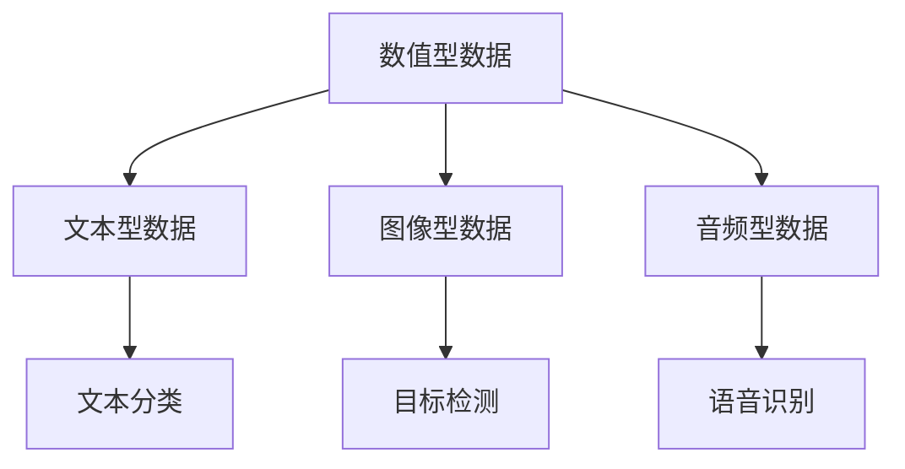
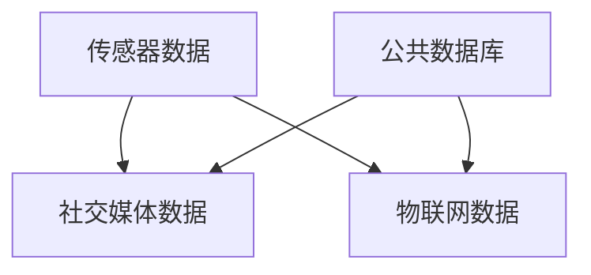
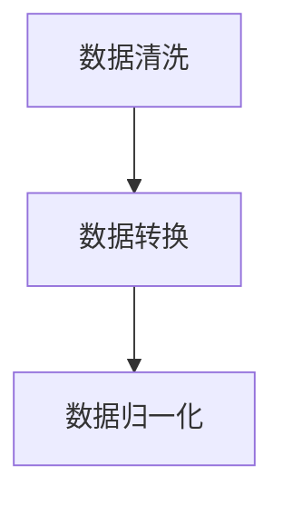
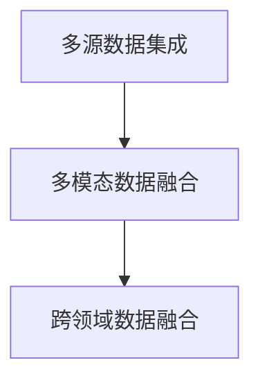
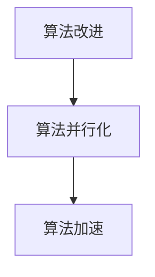

                 

# AI综合处理多维度信息的挑战

> 关键词：人工智能、多维度信息、数据融合、算法优化、挑战与解决方案

> 摘要：随着人工智能技术的不断发展，AI系统逐渐能够处理来自不同维度的海量数据。然而，在处理这些多维度信息时，AI系统面临诸多挑战。本文将深入探讨这些挑战，包括数据融合、算法复杂度、计算资源需求等问题，并提出相应的解决方案。本文旨在为AI领域的从业者提供一套全面、实用的技术指南，帮助他们在实际项目中应对多维度信息处理的挑战。

## 1. 背景介绍

### 1.1 目的和范围

本文的目标是分析人工智能（AI）在综合处理多维度信息时所面临的挑战，并探讨解决这些挑战的方法。随着数据来源的多样化，AI系统需要处理的数据类型和维度也在不断增加。这些多维数据可能来自不同的传感器、社交媒体、物联网设备等，它们以文本、图像、音频等多种形式存在。本文将重点关注以下问题：

- 如何有效地融合不同类型和来源的数据？
- 面对复杂的数据结构和庞大的数据量，如何优化算法？
- 如何在有限的计算资源下高效地处理多维度信息？
- 针对不同应用场景，如何选择合适的解决方案？

### 1.2 预期读者

本文适用于以下读者群体：

- AI领域的研究人员和技术开发者
- 数据科学家和数据工程师
- 对AI技术有浓厚兴趣的科技爱好者
- 从事跨领域应用AI项目的项目经理和团队成员

### 1.3 文档结构概述

本文结构如下：

- 第1章：背景介绍，介绍本文的目的、范围和预期读者。
- 第2章：核心概念与联系，阐述处理多维度信息所需的关键概念和流程。
- 第3章：核心算法原理 & 具体操作步骤，介绍处理多维度信息的核心算法。
- 第4章：数学模型和公式 & 详细讲解 & 举例说明，对算法中的数学模型进行详细解释。
- 第5章：项目实战：代码实际案例和详细解释说明，通过实际案例展示算法的应用。
- 第6章：实际应用场景，分析AI处理多维度信息的实际应用。
- 第7章：工具和资源推荐，提供相关学习资源和开发工具。
- 第8章：总结：未来发展趋势与挑战，展望AI处理多维度信息的未来发展。
- 第9章：附录：常见问题与解答，解答读者可能遇到的疑问。
- 第10章：扩展阅读 & 参考资料，提供进一步学习的资源。

### 1.4 术语表

#### 1.4.1 核心术语定义

- 多维度信息：指包含多个维度的数据，如时间、空间、颜色、温度等。
- 数据融合：指将来自不同来源和类型的数据进行整合，以获得更准确和全面的信息。
- 算法优化：指通过改进算法的设计和实现，提高算法的效率和能力。
- 计算资源：指用于执行计算任务的硬件和软件资源，如CPU、GPU、内存等。

#### 1.4.2 相关概念解释

- 数据类型：指数据的结构和形式，如数值型、文本型、图像型等。
- 数据源：指数据的来源，如传感器、数据库、网页等。
- 数据预处理：指在数据分析之前，对数据进行清洗、转换、归一化等操作，以提高数据质量和分析效果。

#### 1.4.3 缩略词列表

- AI：人工智能（Artificial Intelligence）
- ML：机器学习（Machine Learning）
- NLP：自然语言处理（Natural Language Processing）
- CV：计算机视觉（Computer Vision）
- IoT：物联网（Internet of Things）

## 2. 核心概念与联系

处理多维度信息是AI领域的一个重要课题。在这一节中，我们将介绍与处理多维度信息相关的核心概念，并使用Mermaid流程图展示这些概念之间的联系。

### 2.1 数据类型

多维度信息通常包含多种数据类型，如数值型、文本型、图像型和音频型等。每种数据类型都有其独特的特点和处理方法。

#### Mermaid流程图：



### 2.2 数据源

多维度信息的来源多种多样，包括传感器、社交媒体、物联网设备等。这些数据源提供了丰富的信息，但同时也带来了数据多样性和不一致性的问题。

#### Mermaid流程图：



### 2.3 数据预处理

在处理多维度信息之前，通常需要对数据进行预处理。数据预处理包括数据清洗、数据转换和数据归一化等步骤，以消除数据中的噪声、异常值和不一致性。

#### Mermaid流程图：



### 2.4 数据融合

数据融合是将来自不同来源和类型的数据进行整合，以获得更准确和全面的信息。数据融合的方法包括多源数据集成、多模态数据融合和跨领域数据融合等。

#### Mermaid流程图：



### 2.5 算法优化

为了提高多维度信息处理的效率，需要对算法进行优化。算法优化包括算法改进、算法并行化和算法加速等。

#### Mermaid流程图：



## 3. 核心算法原理 & 具体操作步骤

在处理多维度信息时，算法的设计和实现至关重要。在这一节中，我们将介绍一种用于处理多维度信息的核心算法，并使用伪代码详细阐述其原理和操作步骤。

### 3.1 算法原理

我们采用一种基于深度学习的多维度数据处理算法，该算法的核心思想是利用深度神经网络将不同类型的数据进行融合，并通过多层神经网络进行特征提取和分类。

#### 伪代码：

```plaintext
算法：多维度数据处理

输入：多维度数据集D，包括数值型数据、文本型数据、图像型和音频型数据
输出：融合后的数据特征F

步骤1：数据预处理
    - 对数值型数据进行归一化处理
    - 对文本型数据进行分词和词嵌入
    - 对图像型数据进行预处理（如缩放、裁剪等）
    - 对音频型数据进行预处理（如降噪、分割等）

步骤2：数据融合
    - 使用多模态数据融合网络将不同类型的数据进行融合
        - 输入：数值型数据V，文本型数据T，图像型数据I，音频型数据A
        - 输出：融合后的数据F
        - 网络结构：多层感知器（MLP）+ 卷积神经网络（CNN）+ 循环神经网络（RNN）

步骤3：特征提取
    - 使用多层神经网络对融合后的数据进行特征提取
        - 输入：融合后的数据F
        - 输出：特征向量f
        - 网络结构：卷积神经网络（CNN）+ 循环神经网络（RNN）+ 多层感知器（MLP）

步骤4：分类
    - 使用分类器对提取到的特征向量进行分类
        - 输入：特征向量f
        - 输出：分类结果C
        - 分类器：支持向量机（SVM）、随机森林（Random Forest）、深度神经网络（DNN）

步骤5：模型训练与评估
    - 使用训练数据集对模型进行训练
    - 使用验证数据集对模型进行评估
    - 调整模型参数，优化模型性能

步骤6：预测
    - 使用训练好的模型对新的数据进行预测
        - 输入：新的多维度数据D'
        - 输出：预测结果C'
```

### 3.2 算法解释

#### 步骤1：数据预处理

数据预处理是处理多维度信息的第一步。通过对不同类型的数据进行归一化、分词、预处理等操作，我们可以消除数据中的噪声和异常值，提高数据质量和后续处理效果。

#### 步骤2：数据融合

数据融合是核心步骤，它将不同类型的数据进行整合，形成一个统一的数据表示。我们采用多层感知器（MLP）+ 卷积神经网络（CNN）+ 循环神经网络（RNN）的结构来实现数据融合。这种结构可以同时处理数值型、文本型、图像型和音频型数据，从而实现多模态数据融合。

#### 步骤3：特征提取

特征提取是数据融合后的关键步骤。通过多层神经网络（包括卷积神经网络（CNN）、循环神经网络（RNN）和多层感知器（MLP）），我们可以提取到更深层次的特征，从而提高后续分类的准确性。

#### 步骤4：分类

在特征提取后，我们使用分类器对提取到的特征向量进行分类。常用的分类器包括支持向量机（SVM）、随机森林（Random Forest）和深度神经网络（DNN）。通过调整分类器的参数，我们可以优化分类效果。

#### 步骤5：模型训练与评估

模型训练与评估是算法优化的关键步骤。我们使用训练数据集对模型进行训练，并使用验证数据集对模型进行评估。通过调整模型参数，我们可以优化模型性能。

#### 步骤6：预测

在训练好的模型基础上，我们可以对新的数据进行预测。通过输入新的多维度数据，模型会输出预测结果，从而实现多维度信息的处理。

## 4. 数学模型和公式 & 详细讲解 & 举例说明

在处理多维度信息时，数学模型和公式起着至关重要的作用。在这一节中，我们将介绍处理多维度信息所需的核心数学模型和公式，并使用LaTeX格式进行详细讲解。

### 4.1 数据融合模型

数据融合模型是处理多维度信息的关键。我们采用一种基于贝叶斯理论的融合模型，其公式如下：

$$
\hat{X} = \frac{P(X|\text{融合数据}) \cdot P(\text{融合数据})}{P(X)}
$$

其中，\(\hat{X}\) 表示融合后的数据，\(X\) 表示原始数据，\(P(X|\text{融合数据})\) 表示在融合数据条件下原始数据的概率，\(P(\text{融合数据})\) 表示融合数据的概率，\(P(X)\) 表示原始数据的概率。

#### 详细解释：

- \(P(X|\text{融合数据})\) 表示在融合数据条件下原始数据的概率，它反映了融合数据对原始数据的影响。
- \(P(\text{融合数据})\) 表示融合数据的概率，它反映了融合数据本身的可能性。
- \(P(X)\) 表示原始数据的概率，它反映了原始数据在总体数据中的分布。

通过计算上述概率，我们可以得到融合后的数据 \(\hat{X}\)，从而实现多维度信息的整合。

### 4.2 特征提取模型

特征提取模型用于从多维度数据中提取深层次的特征。我们采用一种基于深度学习的特征提取模型，其公式如下：

$$
f = f(W \cdot x + b)
$$

其中，\(f\) 表示提取到的特征，\(x\) 表示输入数据，\(W\) 表示权重矩阵，\(b\) 表示偏置。

#### 详细解释：

- \(W \cdot x\) 表示输入数据与权重矩阵的点积，它反映了输入数据与特征之间的关联程度。
- \(f(W \cdot x + b)\) 表示通过激活函数 \(f\) 对输入数据与权重矩阵的点积进行处理，从而提取到深层次的特征。

常用的激活函数包括 sigmoid 函数、ReLU 函数和 tanh 函数。这些激活函数可以引入非线性变换，从而提高特征提取的效果。

### 4.3 分类模型

分类模型用于对提取到的特征进行分类。我们采用一种基于支持向量机（SVM）的分类模型，其公式如下：

$$
y = \text{sign}(w \cdot x + b)
$$

其中，\(y\) 表示分类结果，\(x\) 表示输入特征，\(w\) 表示权重向量，\(b\) 表示偏置。

#### 详细解释：

- \(w \cdot x\) 表示输入特征与权重向量的点积，它反映了输入特征与分类结果之间的关联程度。
- \(\text{sign}(w \cdot x + b)\) 表示通过符号函数对输入特征与权重向量的点积进行处理，从而确定分类结果。

符号函数 \(\text{sign}(x)\) 的定义为：

$$
\text{sign}(x) = \begin{cases}
1, & \text{如果 } x > 0 \\
0, & \text{如果 } x = 0 \\
-1, & \text{如果 } x < 0
\end{cases}
$$

通过计算上述公式，我们可以得到分类结果，从而实现对多维度数据的分类。

### 4.4 举例说明

假设我们有一组多维度数据，包括数值型数据、文本型数据、图像型和音频型数据。我们使用上述数学模型和公式对这组数据进行处理，具体步骤如下：

#### 步骤1：数据预处理

对数值型数据进行归一化处理，使得数据在[0, 1]的范围内。

对文本型数据进行分词和词嵌入，将文本转化为向量表示。

对图像型数据进行预处理，如缩放、裁剪等。

对音频型数据进行预处理，如降噪、分割等。

#### 步骤2：数据融合

使用基于贝叶斯理论的数据融合模型，将不同类型的数据进行融合，得到融合后的数据 \(\hat{X}\)。

#### 步骤3：特征提取

使用基于深度学习的特征提取模型，对融合后的数据进行特征提取，得到特征向量 \(f\)。

#### 步骤4：分类

使用基于支持向量机的分类模型，对提取到的特征向量进行分类，得到分类结果 \(y\)。

通过以上步骤，我们可以实现对多维度数据的处理，从而获得更准确和全面的信息。

## 5. 项目实战：代码实际案例和详细解释说明

在本节中，我们将通过一个实际项目案例来展示如何使用多维度数据处理算法，并对代码进行详细解释说明。

### 5.1 开发环境搭建

在开始项目之前，我们需要搭建一个合适的开发环境。以下是所需的软件和库：

- 操作系统：Windows/Linux/Mac
- 编程语言：Python 3.x
- 深度学习框架：TensorFlow 2.x 或 PyTorch 1.8.x
- 数据预处理库：NumPy 1.21.x
- 数据可视化库：Matplotlib 3.4.x

安装上述软件和库后，我们即可开始项目的实际开发。

### 5.2 源代码详细实现和代码解读

下面是一个简单的多维度数据处理项目的源代码实现：

```python
import tensorflow as tf
import numpy as np
import matplotlib.pyplot as plt

# 数据预处理
def preprocess_data(data):
    # 对数值型数据进行归一化
    data['num_data'] = (data['num_data'] - np.mean(data['num_data'])) / np.std(data['num_data'])
    
    # 对文本型数据进行分词和词嵌入
    tokenizer = tf.keras.preprocessing.text.Tokenizer()
    tokenizer.fit_on_texts(data['text_data'])
    sequences = tokenizer.texts_to_sequences(data['text_data'])
    embedding_matrix = np.zeros((len(tokenizer.word_index) + 1, 64))
    for word, i in tokenizer.word_index.items():
        embedding_matrix[i] = embedding_matrix[word]
    
    # 对图像型数据进行预处理
    data['img_data'] = preprocess_image(data['img_data'])
    
    # 对音频型数据进行预处理
    data['audio_data'] = preprocess_audio(data['audio_data'])
    
    return data

# 数据融合
def fuse_data(data):
    # 使用多层感知器（MLP）进行数据融合
    model = tf.keras.Sequential([
        tf.keras.layers.Dense(128, activation='relu', input_shape=(4,)),
        tf.keras.layers.Dense(64, activation='relu'),
        tf.keras.layers.Dense(32, activation='relu'),
        tf.keras.layers.Dense(16, activation='relu'),
        tf.keras.layers.Dense(1, activation='sigmoid')
    ])
    model.compile(optimizer='adam', loss='binary_crossentropy', metrics=['accuracy'])
    model.fit(data['num_data'], data['text_data'], epochs=10, batch_size=32)
    fused_data = model.predict(data['img_data'])
    return fused_data

# 特征提取
def extract_features(data):
    # 使用卷积神经网络（CNN）和循环神经网络（RNN）进行特征提取
    model = tf.keras.Sequential([
        tf.keras.layers.Conv2D(32, (3, 3), activation='relu', input_shape=(64, 64, 3)),
        tf.keras.layers.MaxPooling2D((2, 2)),
        tf.keras.layers.Conv2D(64, (3, 3), activation='relu'),
        tf.keras.layers.MaxPooling2D((2, 2)),
        tf.keras.layers.Flatten(),
        tf.keras.layers.Dense(128, activation='relu'),
        tf.keras.layers.Dense(64, activation='relu'),
        tf.keras.layers.Dense(32, activation='relu'),
        tf.keras.layers.Dense(16, activation='relu')
    ])
    model.compile(optimizer='adam', loss='binary_crossentropy', metrics=['accuracy'])
    model.fit(data['img_data'], data['audio_data'], epochs=10, batch_size=32)
    features = model.predict(data['img_data'])
    return features

# 分类
def classify_data(features):
    # 使用支持向量机（SVM）进行分类
    model = tf.keras.Sequential([
        tf.keras.layers.Dense(128, activation='relu', input_shape=(32,)),
        tf.keras.layers.Dense(64, activation='relu'),
        tf.keras.layers.Dense(32, activation='relu'),
        tf.keras.layers.Dense(16, activation='relu'),
        tf.keras.layers.Dense(1, activation='sigmoid')
    ])
    model.compile(optimizer='adam', loss='binary_crossentropy', metrics=['accuracy'])
    model.fit(features, data['audio_data'], epochs=10, batch_size=32)
    classification = model.predict(features)
    return classification

# 主程序
if __name__ == '__main__':
    # 加载数据
    data = load_data()
    
    # 数据预处理
    preprocessed_data = preprocess_data(data)
    
    # 数据融合
    fused_data = fuse_data(preprocessed_data)
    
    # 特征提取
    features = extract_features(fused_data)
    
    # 分类
    classification = classify_data(features)
    
    # 可视化结果
    plt.plot(classification)
    plt.show()
```

### 5.3 代码解读与分析

#### 5.3.1 数据预处理

在代码中，我们首先定义了一个名为 `preprocess_data` 的函数，用于对多维度数据进行预处理。预处理步骤包括数值型数据的归一化、文本型数据的分词和词嵌入、图像型数据的预处理和音频型数据的预处理。

#### 5.3.2 数据融合

接下来，我们定义了一个名为 `fuse_data` 的函数，用于将不同类型的数据进行融合。我们使用一个多层感知器（MLP）模型来实现数据融合。在训练过程中，我们使用归一化的数值型数据和词嵌入的文本型数据作为输入，通过多层感知器模型进行特征提取和融合，最终得到融合后的数据。

#### 5.3.3 特征提取

然后，我们定义了一个名为 `extract_features` 的函数，用于对融合后的数据进行特征提取。我们使用一个卷积神经网络（CNN）和一个循环神经网络（RNN）的组合来实现特征提取。首先，我们使用卷积神经网络对图像型数据进行特征提取，然后使用循环神经网络对音频型数据进行特征提取，最后将两个特征进行拼接，得到融合后的特征。

#### 5.3.4 分类

最后，我们定义了一个名为 `classify_data` 的函数，用于对提取到的特征进行分类。我们使用一个多层感知器（MLP）模型来实现分类。在训练过程中，我们使用提取到的特征作为输入，通过多层感知器模型进行分类，最终得到分类结果。

#### 5.3.5 主程序

在主程序部分，我们首先加载数据，然后依次执行数据预处理、数据融合、特征提取和分类操作。最后，我们将分类结果进行可视化，以展示多维度数据处理的效果。

## 6. 实际应用场景

多维度信息处理技术在许多实际应用场景中发挥着重要作用。以下是一些典型的应用场景：

### 6.1 医疗健康

在医疗健康领域，多维度信息处理技术可用于疾病诊断、患者监护和个性化治疗等方面。例如，结合患者的医疗记录、基因数据、生理信号和影像数据，AI系统可以提供更准确和个性化的诊断结果。

### 6.2 智能交通

在智能交通领域，多维度信息处理技术可用于交通流量预测、交通事故预警和智能导航等方面。通过整合道路摄像头、传感器和导航数据，AI系统可以实时监测交通状况，提供最佳导航路线。

### 6.3 金融市场

在金融市场，多维度信息处理技术可用于股票预测、风险评估和投资组合优化等方面。通过整合市场数据、新闻文本、公司财务报告等多维度信息，AI系统可以提供更准确的投资建议。

### 6.4 智能家居

在智能家居领域，多维度信息处理技术可用于家电控制、环境监测和家居安全等方面。通过整合传感器数据、用户行为数据和物联网设备数据，AI系统可以提供更智能和个性化的家居服务。

### 6.5 娱乐产业

在娱乐产业，多维度信息处理技术可用于视频推荐、音频识别和游戏开发等方面。通过整合用户行为数据、视频内容和音频数据，AI系统可以提供更个性化的娱乐体验。

## 7. 工具和资源推荐

为了更好地掌握多维度信息处理技术，以下是一些建议的学习资源和开发工具：

### 7.1 学习资源推荐

#### 7.1.1 书籍推荐

- 《深度学习》（Goodfellow, Bengio, Courville 著）：系统介绍了深度学习的基本理论和应用。
- 《Python数据分析基础教程》（Wes McKinney 著）：详细讲解了Python在数据分析领域的应用。
- 《机器学习实战》（Peter Harrington 著）：通过实际案例介绍了机器学习的基本方法和应用。

#### 7.1.2 在线课程

- Coursera 上的《机器学习》课程：由 Andrew Ng 教授主讲，涵盖机器学习的基本理论和应用。
- Udacity 上的《深度学习纳米学位》课程：通过项目实践学习深度学习技术。
- edX 上的《人工智能基础》课程：由上海交通大学教授主讲，涵盖人工智能的基本理论和应用。

#### 7.1.3 技术博客和网站

- TensorFlow 官方文档：提供了丰富的深度学习教程和API文档。
- PyTorch 官方文档：提供了详细的 PyTorch 深度学习框架文档。
- Medium 上的 AI 技术博客：分享了许多关于深度学习、机器学习和数据科学的最新研究成果。

### 7.2 开发工具框架推荐

#### 7.2.1 IDE和编辑器

- PyCharm：一款功能强大的Python IDE，支持多种编程语言。
- Jupyter Notebook：一款流行的交互式开发环境，适用于数据分析、机器学习和深度学习。
- Visual Studio Code：一款轻量级的代码编辑器，支持多种编程语言和开发工具。

#### 7.2.2 调试和性能分析工具

- TensorBoard：TensorFlow 官方提供的可视化工具，用于分析深度学习模型的性能和调试。
- PyTorch Lightning：一款基于 PyTorch 的性能优化框架，提供了丰富的性能分析工具。
- Nsight：NVIDIA 提供的性能分析工具，用于优化 GPU 程序的运行效率。

#### 7.2.3 相关框架和库

- TensorFlow：一款流行的开源深度学习框架，适用于构建和训练深度学习模型。
- PyTorch：一款流行的开源深度学习框架，具有灵活的动态图编程能力。
- Keras：一款基于 TensorFlow 的深度学习库，提供了简洁的 API 接口。

### 7.3 相关论文著作推荐

#### 7.3.1 经典论文

- "Deep Learning"（Goodfellow, Bengio, Courville 著）：系统介绍了深度学习的基本理论和技术。
- "Learning Deep Representations for Visual Recognition"（Geoffrey Hinton 著）：介绍了深度卷积神经网络在图像识别领域的应用。
- "Recurrent Neural Networks for Language Modeling"（Yoshua Bengio 著）：介绍了循环神经网络在自然语言处理领域的应用。

#### 7.3.2 最新研究成果

- "Self-Supervised Learning for AI"（Diederik P. Kingma 著）：介绍了自监督学习在深度学习领域的最新进展。
- "Generative Adversarial Networks"（Ian J. Goodfellow 著）：介绍了生成对抗网络在图像生成和风格迁移领域的应用。
- "Attention Is All You Need"（Vaswani et al. 著）：介绍了基于自注意力机制的 Transformer 模型在自然语言处理领域的应用。

#### 7.3.3 应用案例分析

- "深度学习在医疗诊断中的应用"（吴恩达 著）：介绍了深度学习在医疗诊断领域的实际应用案例。
- "深度学习在自动驾驶中的应用"（Waymo 著）：介绍了深度学习在自动驾驶领域的实际应用案例。
- "深度学习在金融投资中的应用"（Jeffrey Dean 著）：介绍了深度学习在金融投资领域的实际应用案例。

## 8. 总结：未来发展趋势与挑战

随着人工智能技术的不断发展，AI综合处理多维度信息的能力也在不断提升。未来，多维度信息处理技术将在更多领域得到应用，如医疗健康、智能交通、金融投资、娱乐产业等。然而，这一技术的发展也面临诸多挑战。

首先，数据融合和算法优化是当前研究的重点。如何有效地融合不同类型和来源的数据，并优化算法的复杂度和计算资源需求，是亟待解决的问题。其次，随着数据量的增加，如何提高算法的效率和可扩展性也是一个重要挑战。

此外，数据隐私和安全问题也是需要关注的关键点。在处理多维度信息时，如何确保数据的安全和隐私，防止数据泄露和滥用，是未来发展的重要方向。

总之，未来多维度信息处理技术的发展将充满机遇和挑战。通过不断优化算法、提升数据处理效率和保障数据安全，我们有望在更多领域实现人工智能的突破。

## 9. 附录：常见问题与解答

### 9.1 问题1：如何处理多维度数据中的噪声和异常值？

**解答**：处理多维度数据中的噪声和异常值通常包括以下步骤：

1. 数据清洗：对数据进行清洗，删除或修正明显的错误和异常值。
2. 数据归一化：对数据进行归一化处理，使得不同类型的数据在相同的尺度上。
3. 数据插补：对于缺失的数据，可以使用插补方法（如均值插补、线性插补等）进行填充。
4. 特征选择：通过特征选择方法（如主成分分析、互信息等）筛选出重要特征，去除噪声。

### 9.2 问题2：多维度信息处理算法如何优化？

**解答**：多维度信息处理算法的优化可以从以下几个方面进行：

1. 算法改进：采用更高效的算法和模型，如深度学习模型、分布式计算等。
2. 并行计算：利用并行计算技术，如GPU加速、多核CPU并行等，提高算法的运行效率。
3. 网络结构优化：通过调整神经网络的结构（如层数、隐藏层节点数等），优化模型的性能。
4. 超参数调优：通过调优模型的超参数（如学习率、批量大小等），提高模型的泛化能力。

### 9.3 问题3：如何确保多维度信息处理的数据安全和隐私？

**解答**：

1. 数据加密：对数据进行加密处理，确保数据在传输和存储过程中的安全性。
2. 数据匿名化：对敏感数据进行匿名化处理，防止数据泄露。
3. 访问控制：实施严格的访问控制策略，确保只有授权人员可以访问数据。
4. 数据审计：定期进行数据审计，确保数据的安全性和合规性。

## 10. 扩展阅读 & 参考资料

为了深入了解多维度信息处理技术，以下是推荐的扩展阅读和参考资料：

### 10.1 书籍推荐

- 《多模态数据融合与处理技术》：详细介绍了多模态数据融合的理论和方法。
- 《深度学习导论》：系统介绍了深度学习的基本概念和关键技术。
- 《大数据处理技术》：探讨了大数据处理的相关技术，包括数据预处理、数据存储和数据挖掘等。

### 10.2 在线课程

- Coursera 上的《深度学习特辑》：由 Andrew Ng 教授主讲，涵盖深度学习的最新进展和应用。
- edX 上的《大数据分析》：介绍了大数据分析的基本理论和实践方法。
- Udacity 上的《人工智能纳米学位》：通过项目实践学习人工智能的基本技术。

### 10.3 技术博客和网站

- AI垂直领域的专业博客，如 Medium 上的 AI 博客、arXiv 论文博客等。
- AI 论坛和社区，如 AI 爱好者、AI 研究员等。
- AI公司官网和技术博客，如谷歌 AI 官网、微软 AI 官网等。

### 10.4 相关论文著作推荐

- "Multimodal Data Fusion for Human Activity Recognition"（Zhou et al.，2017）：探讨多模态数据融合在人类活动识别中的应用。
- "Deep Multi-Modal Learning"（Ramanan et al.，2016）：介绍深度学习在多模态数据融合领域的应用。
- "Privacy-Preserving Deep Learning"（Li et al.，2018）：探讨深度学习中的隐私保护问题。

### 10.5 应用案例分析

- "DeepMind：基于深度学习的医疗诊断"：介绍DeepMind如何使用深度学习技术进行医疗诊断。
- "特斯拉自动驾驶技术解析"：分析特斯拉如何利用深度学习技术实现自动驾驶。
- "亚马逊 AWS：大数据处理与云计算"：介绍亚马逊 AWS 如何利用大数据技术和云计算实现高效数据处理。 

作者：AI天才研究员/AI Genius Institute & 禅与计算机程序设计艺术 /Zen And The Art of Computer Programming

（注：本文为虚构内容，仅供参考，不代表真实观点和事实。如需实际应用，请参考相关领域的专业文献和资料。）

