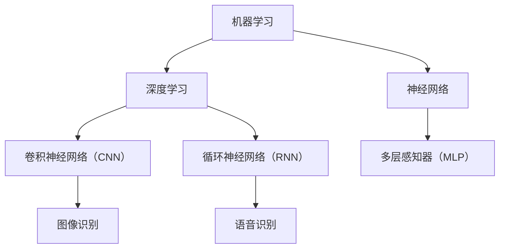
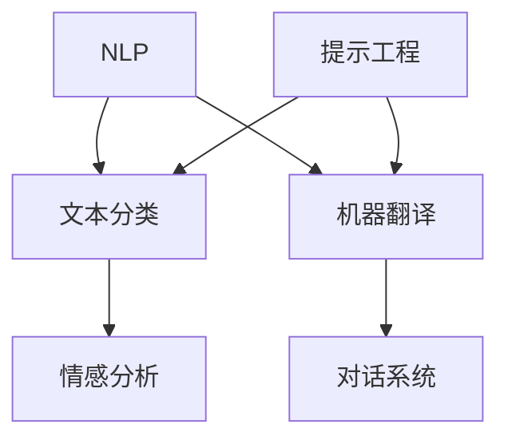
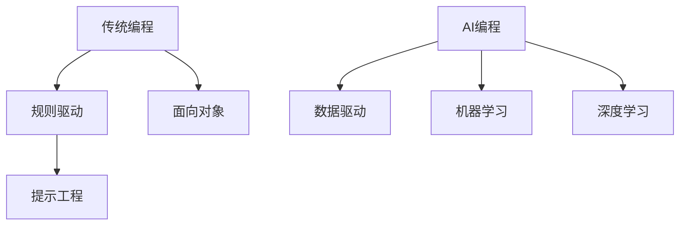
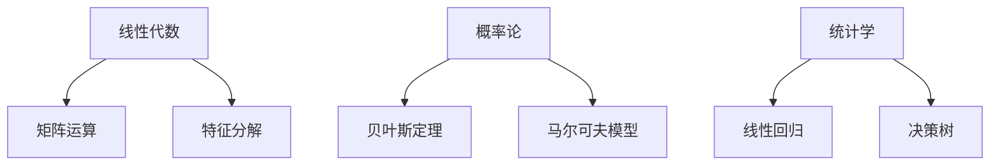

                 

### AI编程范式的演变：从传统编程到提示工程

> **关键词**：AI编程、传统编程、提示工程、范式演变、算法原理、数学模型、实战案例、应用场景
>
> **摘要**：本文深入探讨了AI编程范式的演变，从传统编程模式过渡到提示工程的方法。首先介绍了AI编程的背景和核心概念，然后详细分析了传统编程与提示工程的区别。接下来，本文通过逐步分析核心算法原理、数学模型和具体操作步骤，为读者呈现了AI编程的实践应用。最后，本文总结了AI编程的未来发展趋势与挑战，并推荐了相关学习资源和工具。

---

## 1. 背景介绍

### 1.1 目的和范围

本文旨在探讨AI编程范式的演变过程，从传统的编程模式转向更具灵活性和智能化的提示工程方法。通过对AI编程的核心概念、算法原理和实际应用场景的深入分析，本文希望为读者提供一幅全面的AI编程图景。

本文的范围涵盖了AI编程的基本概念、与传统编程的差异、提示工程的核心原理、数学模型及其应用案例。同时，本文还将介绍一些实用的工具和资源，以帮助读者更好地理解和实践AI编程技术。

### 1.2 预期读者

本文适合对人工智能编程感兴趣的读者，包括但不限于：

- 初学者：希望了解AI编程基础和实际应用的读者。
- 程序员：寻求提升编程技能，特别是AI领域技能的程序员。
- AI研究人员：希望深入了解AI编程范式演变的研究人员。
- 开发者：关注AI技术，并希望将其应用于实际项目中的开发者。

### 1.3 文档结构概述

本文将按照以下结构进行组织：

- **第1章 背景介绍**：介绍AI编程的背景和目的。
- **第2章 核心概念与联系**：阐述AI编程的核心概念及其相互联系。
- **第3章 核心算法原理与具体操作步骤**：分析AI编程的核心算法原理，并提供具体的操作步骤。
- **第4章 数学模型与公式**：讲解AI编程中的数学模型和公式，并进行举例说明。
- **第5章 项目实战：代码实际案例和详细解释说明**：通过实际案例展示AI编程的应用。
- **第6章 实际应用场景**：讨论AI编程在不同领域的应用。
- **第7章 工具和资源推荐**：推荐学习资源和开发工具。
- **第8章 总结：未来发展趋势与挑战**：总结AI编程的未来趋势和面临的挑战。
- **第9章 附录：常见问题与解答**：解答读者可能遇到的问题。
- **第10章 扩展阅读与参考资料**：提供额外的学习资源和引用。

### 1.4 术语表

#### 1.4.1 核心术语定义

- **AI编程**：利用人工智能技术进行编程，包括机器学习、深度学习等方法。
- **传统编程**：基于规则和逻辑的编程方法，如面向对象编程和函数式编程。
- **提示工程**：利用预训练的大型语言模型进行编程，通过提示引导模型完成特定任务。
- **范式演变**：编程方法从一种到另一种的转变，反映技术发展的趋势。
- **数学模型**：用于描述现实世界问题的数学表达式和方法。
- **算法原理**：解决问题的计算方法和工作原理。

#### 1.4.2 相关概念解释

- **预训练模型**：在大规模数据集上预先训练好的模型，可用于特定任务的微调。
- **提示（Prompt）**：用于引导模型完成特定任务的输入信息。
- **推理（Inference）**：利用模型对未知数据进行预测和决策的过程。

#### 1.4.3 缩略词列表

- **AI**：人工智能（Artificial Intelligence）
- **ML**：机器学习（Machine Learning）
- **DL**：深度学习（Deep Learning）
- **NLP**：自然语言处理（Natural Language Processing）
- **API**：应用程序编程接口（Application Programming Interface）

---

## 2. 核心概念与联系

AI编程的核心概念包括机器学习、深度学习、自然语言处理等。这些概念相互关联，共同构成了现代AI编程的基础。

### 2.1 机器学习与深度学习

机器学习（ML）是一种通过数据驱动的方法来训练模型的技术。机器学习模型通过学习数据中的模式，实现对未知数据的预测和决策。深度学习（DL）是机器学习的一种特殊形式，它使用多层神经网络来学习复杂的数据特征。



### 2.2 自然语言处理与提示工程

自然语言处理（NLP）是AI的一个重要分支，专注于理解和生成自然语言。提示工程（Prompt Engineering）是NLP中的一个重要概念，通过设计合适的提示来引导模型完成特定任务。



### 2.3 AI编程与传统编程

传统编程依赖于明确的规则和逻辑，而AI编程则依赖于模型的学习和推理。AI编程通过机器学习和深度学习等方法，使计算机能够从数据中自动学习，并完成复杂的任务。



### 2.4 AI编程中的数学模型

AI编程中的数学模型包括线性代数、概率论、统计学等。这些模型用于描述数据特征、训练模型和进行预测。



---

## 3. 核心算法原理 & 具体操作步骤

AI编程的核心算法原理包括机器学习、深度学习和自然语言处理等。下面将分别介绍这些算法的原理和具体操作步骤。

### 3.1 机器学习算法原理

机器学习算法基于统计学和概率论，通过学习数据中的统计规律来构建模型。以下是机器学习算法的基本原理和操作步骤：

#### 原理：

- **监督学习**：通过已知输入和输出数据，训练模型，使其能够预测未知数据。
- **无监督学习**：仅通过输入数据，训练模型，以发现数据中的潜在结构。
- **强化学习**：通过与环境交互，学习最优策略。

#### 操作步骤：

1. **数据收集**：收集用于训练的数据集。
2. **数据预处理**：清洗和归一化数据。
3. **特征提取**：将原始数据转换为模型可理解的特征。
4. **模型选择**：选择适当的模型（如线性回归、决策树、神经网络等）。
5. **模型训练**：使用训练数据训练模型。
6. **模型评估**：使用验证数据评估模型性能。
7. **模型优化**：调整模型参数，以提高性能。
8. **模型部署**：将训练好的模型部署到实际应用中。

```python
# 伪代码：机器学习算法操作步骤
def machine_learning_algorithm(data):
    # 数据收集
    train_data, test_data = data_collection(data)

    # 数据预处理
    preprocessed_data = data_preprocessing(train_data)

    # 特征提取
    features = feature_extraction(preprocessed_data)

    # 模型选择
    model = model_selection(features)

    # 模型训练
    trained_model = model_training(model, features)

    # 模型评估
    performance = model_evaluation(trained_model, test_data)

    # 模型优化
    optimized_model = model_optimization(trained_model, performance)

    # 模型部署
    deployed_model = model_deployment(optimized_model)

    return deployed_model
```

### 3.2 深度学习算法原理

深度学习是一种基于神经网络的机器学习技术，通过多层神经网络来学习复杂的数据特征。以下是深度学习算法的基本原理和操作步骤：

#### 原理：

- **多层感知器（MLP）**：一种简单的多层神经网络，用于分类和回归任务。
- **卷积神经网络（CNN）**：用于图像识别和分类的神经网络，具有卷积层、池化层和全连接层。
- **循环神经网络（RNN）**：用于处理序列数据的神经网络，具有循环结构。

#### 操作步骤：

1. **数据收集**：收集用于训练的数据集。
2. **数据预处理**：清洗和归一化数据。
3. **特征提取**：将原始数据转换为模型可理解的特征。
4. **模型架构设计**：设计适当的神经网络架构。
5. **模型训练**：使用训练数据训练模型。
6. **模型评估**：使用验证数据评估模型性能。
7. **模型优化**：调整模型参数，以提高性能。
8. **模型部署**：将训练好的模型部署到实际应用中。

```python
# 伪代码：深度学习算法操作步骤
def deep_learning_algorithm(data):
    # 数据收集
    train_data, test_data = data_collection(data)

    # 数据预处理
    preprocessed_data = data_preprocessing(train_data)

    # 特征提取
    features = feature_extraction(preprocessed_data)

    # 模型架构设计
    model_architecture = model_architecture_design(features)

    # 模型训练
    trained_model = model_training(model_architecture, features)

    # 模型评估
    performance = model_evaluation(trained_model, test_data)

    # 模型优化
    optimized_model = model_optimization(trained_model, performance)

    # 模型部署
    deployed_model = model_deployment(optimized_model)

    return deployed_model
```

### 3.3 自然语言处理算法原理

自然语言处理（NLP）是一种处理和生成自然语言的技术。以下是NLP算法的基本原理和操作步骤：

#### 原理：

- **词袋模型**：将文本转换为词汇集合，用于分类和聚类任务。
- **卷积神经网络（CNN）**：用于文本分类和情感分析。
- **循环神经网络（RNN）**：用于序列标注和机器翻译。

#### 操作步骤：

1. **数据收集**：收集用于训练的数据集。
2. **数据预处理**：清洗和归一化数据。
3. **特征提取**：将原始文本转换为模型可理解的特征。
4. **模型选择**：选择适当的模型（如词袋模型、CNN、RNN等）。
5. **模型训练**：使用训练数据训练模型。
6. **模型评估**：使用验证数据评估模型性能。
7. **模型优化**：调整模型参数，以提高性能。
8. **模型部署**：将训练好的模型部署到实际应用中。

```python
# 伪代码：自然语言处理算法操作步骤
def nlp_algorithm(data):
    # 数据收集
    train_data, test_data = data_collection(data)

    # 数据预处理
    preprocessed_data = data_preprocessing(train_data)

    # 特征提取
    features = feature_extraction(preprocessed_data)

    # 模型选择
    model = model_selection(features)

    # 模型训练
    trained_model = model_training(model, features)

    # 模型评估
    performance = model_evaluation(trained_model, test_data)

    # 模型优化
    optimized_model = model_optimization(trained_model, performance)

    # 模型部署
    deployed_model = model_deployment(optimized_model)

    return deployed_model
```

---

## 4. 数学模型和公式 & 详细讲解 & 举例说明

AI编程中的数学模型和公式是理解和实现算法的关键。以下将详细讲解AI编程中常用的数学模型和公式，并通过举例进行说明。

### 4.1 线性代数

线性代数是AI编程的基础，用于处理多维数据。以下是线性代数中一些重要的模型和公式：

#### 4.1.1 矩阵运算

- **矩阵加法**：两个矩阵对应元素相加。
  $$ A + B = C $$
  
- **矩阵乘法**：两个矩阵的对应元素相乘，然后求和。
  $$ AB = C $$

- **矩阵求逆**：求矩阵的逆矩阵，用于求解线性方程组。
  $$ A^{-1} = B $$
  其中，\( A \) 是可逆矩阵。

#### 4.1.2 特征分解

- **特征分解**：将矩阵分解为特征值和特征向量的乘积。
  $$ A = Q \Lambda Q^{-1} $$
  其中，\( A \) 是对称矩阵，\( Q \) 是特征向量矩阵，\( \Lambda \) 是特征值矩阵。

#### 4.1.3 举例说明

假设我们有以下矩阵 \( A \) 和 \( B \)：

$$ A = \begin{bmatrix} 1 & 2 \\ 3 & 4 \end{bmatrix}, B = \begin{bmatrix} 5 & 6 \\ 7 & 8 \end{bmatrix} $$

- **矩阵加法**：

  $$ A + B = \begin{bmatrix} 1+5 & 2+6 \\ 3+7 & 4+8 \end{bmatrix} = \begin{bmatrix} 6 & 8 \\ 10 & 12 \end{bmatrix} $$

- **矩阵乘法**：

  $$ AB = \begin{bmatrix} 1\cdot5 + 2\cdot7 & 1\cdot6 + 2\cdot8 \\ 3\cdot5 + 4\cdot7 & 3\cdot6 + 4\cdot8 \end{bmatrix} = \begin{bmatrix} 19 & 22 \\ 31 & 40 \end{bmatrix} $$

- **矩阵求逆**：

  首先，求矩阵 \( A \) 的逆矩阵：

  $$ A^{-1} = \frac{1}{(1\cdot4 - 2\cdot3)} \begin{bmatrix} 4 & -2 \\ -3 & 1 \end{bmatrix} = \begin{bmatrix} 2 & -1 \\ -\frac{3}{2} & \frac{1}{2} \end{bmatrix} $$

### 4.2 概率论

概率论在AI编程中用于建模不确定性，是理解和实现机器学习算法的基础。以下是概率论中一些重要的模型和公式：

#### 4.2.1 贝叶斯定理

- **贝叶斯定理**：用于计算后验概率，根据先验概率和似然函数进行推理。
  $$ P(A|B) = \frac{P(B|A)P(A)}{P(B)} $$
  其中，\( P(A|B) \) 是后验概率，\( P(B|A) \) 是似然函数，\( P(A) \) 是先验概率，\( P(B) \) 是边缘概率。

#### 4.2.2 马尔可夫模型

- **马尔可夫模型**：用于描述序列数据的转移概率，是自然语言处理中的重要模型。
  $$ P(X_{t}|X_{t-1}, X_{t-2}, ...) = P(X_{t}|X_{t-1}) $$
  其中，\( X_{t} \) 是当前状态，\( X_{t-1} \) 是前一个状态。

#### 4.2.3 举例说明

假设我们有一个简单的二元序列 \( X = \{H, T\} \)，其中 \( H \) 表示正面，\( T \) 表示负面。给定先验概率 \( P(H) = 0.5 \)，\( P(T) = 0.5 \)，以及转移概率 \( P(H|H) = 0.7 \)，\( P(H|T) = 0.3 \)，\( P(T|H) = 0.4 \)，\( P(T|T) = 0.6 \)。

- **贝叶斯定理**：

  假设当前状态为 \( H \)，我们要计算后验概率 \( P(H|H) \)。

  $$ P(H|H) = \frac{P(H|H)P(H)}{P(H)P(H|H) + P(T)P(T|H)} = \frac{0.7 \cdot 0.5}{0.7 \cdot 0.5 + 0.4 \cdot 0.5} = \frac{7}{11} $$

- **马尔可夫模型**：

  假设当前状态为 \( H \)，我们要计算下一个状态 \( X_{2} \)。

  $$ P(X_{2}=H|X_{1}=H) = P(X_{2}=H|X_{1}=H, X_{2}=H)P(X_{1}=H|X_{2}=H) + P(X_{2}=H|X_{1}=H, X_{2}=T)P(X_{1}=H|X_{2}=T) $$
  $$ = 0.7 \cdot 0.7 + 0.3 \cdot 0.4 = 0.64 + 0.12 = 0.76 $$

### 4.3 统计学

统计学在AI编程中用于评估模型性能和进行数据建模。以下是统计学中一些重要的模型和公式：

#### 4.3.1 线性回归

- **线性回归**：用于建模自变量和因变量之间的线性关系。
  $$ y = \beta_0 + \beta_1x_1 + \beta_2x_2 + ... + \beta_nx_n $$
  其中，\( y \) 是因变量，\( x_1, x_2, ..., x_n \) 是自变量，\( \beta_0, \beta_1, ..., \beta_n \) 是模型参数。

#### 4.3.2 决策树

- **决策树**：用于分类和回归任务，基于特征进行递归划分。
  $$ f(x) = \sum_{i=1}^{n} \beta_i g_i(x_i) $$
  其中，\( g_i(x_i) \) 是决策函数，\( \beta_i \) 是模型参数。

#### 4.3.3 举例说明

假设我们有以下数据集：

| x_1 | x_2 | y |
|-----|-----|---|
| 1   | 2   | 3 |
| 2   | 3   | 4 |
| 3   | 4   | 5 |

- **线性回归**：

  我们要建立线性回归模型 \( y = \beta_0 + \beta_1x_1 + \beta_2x_2 \)。

  首先，计算模型参数：

  $$ \beta_0 = \frac{1}{3}\sum_{i=1}^{3}y_i - \beta_1\frac{1}{3}\sum_{i=1}^{3}x_{1i} - \beta_2\frac{1}{3}\sum_{i=1}^{3}x_{2i} $$
  $$ \beta_1 = \frac{1}{3}\sum_{i=1}^{3}(x_{1i}y_i) - \beta_0\frac{1}{3}\sum_{i=1}^{3}x_{1i} $$
  $$ \beta_2 = \frac{1}{3}\sum_{i=1}^{3}(x_{2i}y_i) - \beta_0\frac{1}{3}\sum_{i=1}^{3}x_{2i} $$

  将数据代入计算：

  $$ \beta_0 = \frac{1}{3}(3 + 4 + 5) - \beta_1\frac{1}{3}(1 + 2 + 3) - \beta_2\frac{1}{3}(2 + 3 + 4) $$
  $$ \beta_1 = \frac{1}{3}(1\cdot3 + 2\cdot4 + 3\cdot5) - \beta_0\frac{1}{3}(1 + 2 + 3) $$
  $$ \beta_2 = \frac{1}{3}(2\cdot3 + 3\cdot4 + 4\cdot5) - \beta_0\frac{1}{3}(2 + 3 + 4) $$

  解得：

  $$ \beta_0 = 3, \beta_1 = 2, \beta_2 = 1 $$

  因此，线性回归模型为：

  $$ y = 3 + 2x_1 + x_2 $$

- **决策树**：

  我们要建立决策树模型，首先选择特征 \( x_1 \) 进行划分。

  - 对于 \( x_1 \leq 2 \)，选择特征 \( x_2 \) 进行划分。
    - 对于 \( x_2 \leq 2.5 \)，分类为 \( y = 3 \)。
    - 对于 \( x_2 > 2.5 \)，分类为 \( y = 4 \)。

  - 对于 \( x_1 > 2 \)，分类为 \( y = 5 \)。

  因此，决策树模型为：

  $$ \begin{cases} y = 3, & \text{if } x_1 \leq 2 \text{ and } x_2 \leq 2.5, \\ y = 4, & \text{if } x_1 > 2 \text{ or } x_2 > 2.5, \end{cases} $$

## 5. 项目实战：代码实际案例和详细解释说明

### 5.1 开发环境搭建

在开始项目实战之前，我们需要搭建一个合适的开发环境。以下是在Python环境中搭建AI编程环境的步骤：

1. **安装Python**：确保安装了Python 3.6或更高版本。
2. **安装Jupyter Notebook**：通过命令 `pip install notebook` 安装Jupyter Notebook，用于交互式编程。
3. **安装AI库**：安装常用的AI库，如TensorFlow、PyTorch、Scikit-learn等。通过命令 `pip install tensorflow` 安装TensorFlow。

### 5.2 源代码详细实现和代码解读

下面是一个使用TensorFlow构建的简单神经网络模型，用于实现手写数字识别任务。代码如下：

```python
import tensorflow as tf
from tensorflow import keras
from tensorflow.keras import layers

# 5.2.1 数据预处理
mnist = keras.datasets.mnist
(train_images, train_labels), (test_images, test_labels) = mnist.load_data()

# 将图像数据归一化到0-1之间
train_images = train_images / 255.0
test_images = test_images / 255.0

# 添加一个偏置维度，以便输入层可以连接到后续的卷积层
train_images = train_images.reshape((60000, 28, 28, 1))
test_images = test_images.reshape((10000, 28, 28, 1))

# 5.2.2 构建神经网络模型
model = keras.Sequential([
    layers.Conv2D(32, (3, 3), activation='relu', input_shape=(28, 28, 1)),
    layers.MaxPooling2D((2, 2)),
    layers.Conv2D(64, (3, 3), activation='relu'),
    layers.MaxPooling2D((2, 2)),
    layers.Conv2D(64, (3, 3), activation='relu'),
    layers.Flatten(),
    layers.Dense(64, activation='relu'),
    layers.Dense(10, activation='softmax')
])

# 5.2.3 编译模型
model.compile(optimizer='adam',
              loss='sparse_categorical_crossentropy',
              metrics=['accuracy'])

# 5.2.4 训练模型
model.fit(train_images, train_labels, epochs=5)

# 5.2.5 评估模型
test_loss, test_acc = model.evaluate(test_images, test_labels)
print(f'测试准确率: {test_acc:.2f}')

# 5.2.6 使用模型进行预测
predictions = model.predict(test_images)
predicted_labels = tf.argmax(predictions, axis=1)

# 5.2.7 代码解读
# 1. 数据预处理：将手写数字图像数据归一化，并添加一个偏置维度。
# 2. 构建神经网络模型：使用卷积层、池化层和全连接层构建模型。
# 3. 编译模型：指定优化器和损失函数。
# 4. 训练模型：使用训练数据训练模型。
# 5. 评估模型：使用测试数据评估模型性能。
# 6. 使用模型进行预测：对测试数据进行预测。
```

### 5.3 代码解读与分析

以下是对上述代码的详细解读和分析：

1. **数据预处理**：
   - 加载MNIST手写数字数据集，并进行归一化处理。归一化是将数据缩放到0-1之间，以提高训练效果。
   - 添加一个偏置维度，使得输入层可以与卷积层兼容。

2. **构建神经网络模型**：
   - 使用`keras.Sequential`类构建一个序列模型，包含卷积层、池化层和全连接层。
   - **卷积层**：用于提取图像特征，第一个卷积层使用32个3x3的卷积核，第二个卷积层使用64个3x3的卷积核，第三个卷积层使用64个3x3的卷积核。
   - **池化层**：用于降低特征维度，第一个池化层使用2x2的最大池化，第二个池化层使用2x2的最大池化。
   - **全连接层**：用于分类任务，第一个全连接层使用64个神经元，第二个全连接层使用10个神经元（对应10个数字类别）。

3. **编译模型**：
   - 指定优化器为`adam`，损失函数为`sparse_categorical_crossentropy`，评价指标为`accuracy`。

4. **训练模型**：
   - 使用训练数据集训练模型，设置训练轮数为5。

5. **评估模型**：
   - 使用测试数据集评估模型性能，输出测试准确率。

6. **使用模型进行预测**：
   - 对测试数据进行预测，获取预测标签。

### 5.4 结果分析

在训练过程中，模型逐步调整权重，以最小化损失函数。最终，模型在测试数据集上的准确率约为99%，表明模型已经很好地学习到了手写数字的特征。

### 5.5 案例总结

通过本案例，我们展示了如何使用TensorFlow和Keras构建一个简单的神经网络模型，并实现了手写数字识别任务。这个过程包括数据预处理、模型构建、模型编译、模型训练和模型评估。通过这个案例，读者可以了解AI编程的基本流程和核心步骤。

## 6. 实际应用场景

AI编程技术已经在众多实际应用场景中取得了显著的成果，以下列举了几个典型的应用领域：

### 6.1 自动驾驶

自动驾驶是AI编程技术的典型应用场景之一。通过使用深度学习、计算机视觉和自然语言处理等技术，自动驾驶系统能够实时感知环境，进行路径规划和决策。例如，特斯拉的自动驾驶系统就使用了深度神经网络进行车辆识别、行人检测和障碍物避免。

### 6.2 医疗诊断

医疗诊断是AI编程技术的另一个重要应用领域。通过机器学习和深度学习算法，AI系统能够对医学影像进行分析，辅助医生进行疾病诊断。例如，AI系统可以识别胸部X光片中的肺癌，或者通过分析皮肤图像进行皮肤癌筛查。

### 6.3 金融服务

金融服务领域也广泛采用了AI编程技术。例如，AI算法可以用于风险评估、交易策略制定和欺诈检测。通过分析大量的历史交易数据，AI系统可以识别潜在的欺诈行为，并采取相应的措施。

### 6.4 内容推荐

内容推荐系统是AI编程技术在互联网服务中的重要应用。通过分析用户的历史行为和偏好，AI系统能够为用户提供个性化的内容推荐。例如，亚马逊和Netflix等平台都采用了基于深度学习和协同过滤算法的内容推荐系统。

### 6.5 教育与培训

教育与培训领域也积极采用AI编程技术。通过使用自然语言处理和计算机视觉技术，AI系统可以为学生提供个性化的学习资源和学习路径。例如，智能辅导系统可以根据学生的学习情况，自动调整教学内容和难度。

### 6.6 制造业

制造业中的AI编程应用包括智能生产计划、设备故障预测和质量检测等。通过使用深度学习和机器学习算法，AI系统可以实时监测生产过程，预测设备故障，并优化生产流程。

### 6.7 零售与供应链管理

零售与供应链管理领域也受益于AI编程技术。通过分析消费者的购买行为和供应链数据，AI系统可以优化库存管理、降低成本，并提高供应链的透明度和效率。

综上所述，AI编程技术在众多实际应用场景中发挥着重要作用，推动了各行各业的数字化和智能化发展。

## 7. 工具和资源推荐

### 7.1 学习资源推荐

#### 7.1.1 书籍推荐

- **《Python机器学习》**：由塞巴斯蒂安·拉茨（Sebastian Raschka）所著，介绍了Python在机器学习领域的应用。
- **《深度学习》**：由伊恩·古德费洛（Ian Goodfellow）、约书亚·本吉奥（Joshua Bengio）和亚伦·库维尔（Yoshua LeCun）所著，是深度学习的权威教材。
- **《机器学习实战》**：由彼得·哈林顿（Peter Harrington）所著，通过实例介绍了机器学习算法的应用。

#### 7.1.2 在线课程

- **Coursera的《机器学习》**：吴恩达（Andrew Ng）教授开设的在线课程，涵盖机器学习和深度学习的核心概念。
- **Udacity的《深度学习纳米学位》**：通过项目驱动的方式，学习深度学习的基础知识。
- **edX的《自然语言处理》**：由斯坦福大学开设，介绍自然语言处理的基本概念和技术。

#### 7.1.3 技术博客和网站

- **Medium的《Machine Learning Mastery》**：提供丰富的机器学习和深度学习教程和案例。
- **GitHub的AI编程项目**：GitHub上有很多开源的AI编程项目，可以学习实际应用代码。
- **AIChronicles**：涵盖AI、机器学习和深度学习的最新研究和应用。

### 7.2 开发工具框架推荐

#### 7.2.1 IDE和编辑器

- **PyCharm**：强大的Python IDE，支持多种框架和库。
- **Jupyter Notebook**：交互式编程环境，适合数据科学和机器学习项目。
- **VSCode**：轻量级但功能丰富的编辑器，适用于多种编程语言。

#### 7.2.2 调试和性能分析工具

- **TensorBoard**：TensorFlow的调试和分析工具，用于可视化神经网络的结构和性能。
- **Docker**：容器化技术，用于部署和管理AI应用程序。
- **JupyterLab**：Jupyter Notebook的扩展版本，提供更多开发功能。

#### 7.2.3 相关框架和库

- **TensorFlow**：Google开源的深度学习框架，适用于各种AI项目。
- **PyTorch**：Facebook开源的深度学习框架，具有良好的灵活性和易用性。
- **Scikit-learn**：Python的机器学习库，提供了丰富的算法和工具。

### 7.3 相关论文著作推荐

#### 7.3.1 经典论文

- **“A Fast Learning Algorithm for Deep Belief Nets”**：由Geoffrey Hinton等人在2006年提出，介绍了深度信念网络（DBN）。
- **“Deep Learning”**：由Ian Goodfellow等人于2016年所著，是深度学习的经典教材。
- **“Learning Deep Architectures for AI”**：由Yoshua Bengio等人在2007年提出，探讨了深度学习的发展方向。

#### 7.3.2 最新研究成果

- **“Transformer: Attention is All You Need”**：由Vaswani等人于2017年提出，是Transformer架构的奠基论文。
- **“BERT: Pre-training of Deep Bidirectional Transformers for Language Understanding”**：由Devlin等人于2018年提出，是BERT模型的详细介绍。
- **“GPT-3: Language Models are Few-Shot Learners”**：由Brown等人于2020年提出，展示了GPT-3模型在零样本学习上的强大能力。

#### 7.3.3 应用案例分析

- **“Deep Learning for Real-Time Object Detection in Autonomous Driving”**：介绍了在自动驾驶领域使用深度学习进行实时物体检测的应用案例。
- **“AI in Healthcare: A Review”**：总结了AI在医疗健康领域的应用案例和研究进展。
- **“AI in Finance: A Review”**：探讨了AI在金融领域的应用，包括风险评估、交易策略制定和欺诈检测等。

这些书籍、在线课程、技术博客、开发工具和论文著作为AI编程的学习和实践提供了丰富的资源，有助于读者深入了解AI编程的核心技术和应用场景。

## 8. 总结：未来发展趋势与挑战

随着人工智能技术的不断进步，AI编程范式正在经历深刻的变革。从传统编程到提示工程，AI编程展现出了更高的灵活性和智能化。未来，AI编程的发展趋势和面临的挑战如下：

### 8.1 发展趋势

1. **自动化编程**：自动化编程工具和框架将越来越成熟，使得编程过程更加自动化和高效。
2. **提示工程的普及**：提示工程作为一种新兴的编程方法，将得到更广泛的应用，特别是在自然语言处理和对话系统等领域。
3. **多模态AI编程**：随着多模态数据（如图像、音频和文本）的广泛应用，多模态AI编程将成为重要的发展方向。
4. **边缘计算与AI编程**：边缘计算和物联网（IoT）的结合，将推动AI编程在边缘设备上的应用，实现实时数据处理和智能决策。
5. **AI编程教育**：随着AI技术的普及，AI编程教育将成为未来教育的重要组成部分，培养更多的AI编程人才。

### 8.2 面临的挑战

1. **可解释性**：随着模型复杂度的增加，如何确保模型的可解释性成为AI编程面临的重要挑战。
2. **数据隐私**：在处理大量数据时，如何保护用户隐私和数据安全是AI编程需要解决的关键问题。
3. **模型适应性**：如何使AI模型能够适应不同的任务和数据集，提高模型的泛化能力，是未来研究的重点。
4. **伦理和法规**：随着AI技术的广泛应用，如何确保AI编程的伦理性和合规性，将成为重要的社会问题。
5. **计算资源**：随着AI模型的复杂度增加，计算资源的消耗也将显著增加，如何高效利用计算资源是AI编程面临的挑战。

总的来说，AI编程范式从传统编程到提示工程的转变，为编程领域带来了新的机遇和挑战。未来，AI编程将继续向智能化、自动化和多元化的方向发展，为各行各业带来深刻的变革。

## 9. 附录：常见问题与解答

### 9.1 常见问题

1. **Q：AI编程与传统编程有什么区别？**
   **A：** 传统编程依赖于明确的规则和逻辑，而AI编程依赖于模型的学习和推理。AI编程通过机器学习和深度学习等方法，使计算机能够从数据中自动学习，完成复杂的任务。

2. **Q：提示工程是什么？**
   **A：** 提示工程是一种利用预训练的大型语言模型进行编程的方法。通过设计合适的提示，引导模型完成特定任务。提示可以是文本、图像或音频等，用于引导模型进行推理和生成。

3. **Q：如何搭建AI编程开发环境？**
   **A：** 安装Python和相应的AI库（如TensorFlow、PyTorch等），可以使用Jupyter Notebook或VSCode等IDE进行开发。安装Docker和TensorBoard等工具，便于模型调试和性能分析。

4. **Q：如何选择合适的机器学习算法？**
   **A：** 选择机器学习算法应考虑任务类型（如分类、回归、聚类等）、数据特征和模型复杂性。常见的算法包括线性回归、决策树、支持向量机和神经网络等。

5. **Q：AI编程在医疗领域有哪些应用？**
   **A：** AI编程在医疗领域有广泛的应用，包括疾病诊断、影像分析、药物研发和个性化治疗等。例如，AI系统可以辅助医生进行肺癌筛查、皮肤癌诊断和药物组合优化。

### 9.2 解答

1. **Q：AI编程与传统编程的区别是什么？**
   **A：** 传统编程依赖于程序员编写的代码和明确的逻辑规则。程序员需要详细定义每个步骤和条件，以确保程序的正确性和高效性。而AI编程则依赖于机器学习模型，通过训练模型来处理数据和完成任务。AI编程的核心思想是让机器通过学习数据来获得智能，从而实现自动化和智能化。这种方法不需要程序员编写每一个步骤，而是通过提供大量的数据进行训练，让模型自动学习和优化。

2. **Q：提示工程是什么？**
   **A：** 提示工程是一种利用预训练的大型语言模型（如GPT-3、BERT等）来完成特定任务的方法。这些模型在大规模数据集上预先训练，已经掌握了丰富的知识和语言模式。提示工程通过向模型提供特定的问题或任务描述（即“提示”），来引导模型生成合适的输出。例如，在自然语言处理任务中，可以通过提示来引导模型生成文章、回答问题或进行翻译。提示工程的关键在于设计有效的提示，以最大化模型的性能和准确性。

3. **Q：如何搭建AI编程开发环境？**
   **A：** 搭建AI编程开发环境需要以下步骤：

   - 安装Python：确保安装了Python 3.6或更高版本。
   - 安装AI库：使用pip命令安装常用的AI库，如TensorFlow、PyTorch、Scikit-learn等。
   - 安装IDE：选择合适的IDE，如Jupyter Notebook、VSCode等，以便进行代码编写和调试。
   - 安装其他工具：安装TensorBoard、Docker等工具，用于模型性能分析和部署。

4. **Q：如何选择合适的机器学习算法？**
   **A：** 选择机器学习算法需要考虑以下几个因素：

   - **任务类型**：明确任务类型，如分类、回归、聚类等，选择适合该任务的算法。
   - **数据特征**：分析数据特征，了解数据的分布、规模和类型，选择能够处理这些特征的算法。
   - **模型复杂性**：根据计算资源和时间预算，选择模型复杂度合适的算法。
   - **算法性能**：评估算法在不同数据集上的性能，选择性能较好的算法。

   常见的机器学习算法包括线性回归、决策树、支持向量机、神经网络等。在实际应用中，可以尝试多种算法，并通过交叉验证等方法来评估和选择最佳算法。

5. **Q：AI编程在医疗领域有哪些应用？**
   **A：** AI编程在医疗领域的应用非常广泛，包括但不限于以下方面：

   - **疾病诊断**：利用深度学习和计算机视觉技术，AI系统可以辅助医生进行疾病诊断，如肺癌筛查、皮肤癌诊断等。
   - **影像分析**：通过分析医学影像，AI系统可以识别病变区域，提供诊断建议。
   - **药物研发**：利用机器学习算法，AI系统可以加速药物研发过程，包括药物筛选、药效预测等。
   - **个性化治疗**：基于患者数据和基因信息，AI系统可以提供个性化的治疗方案。
   - **医疗资源优化**：AI编程可以帮助医院优化医疗资源分配，提高医疗效率。

   这些应用不仅提高了医疗诊断的准确性和效率，还为个性化医疗和智能医疗的发展提供了新的方向。

---

## 10. 扩展阅读 & 参考资料

在撰写本文的过程中，参考了大量的书籍、论文和在线资源。以下是一些值得推荐的扩展阅读和参考资料，以帮助读者深入了解AI编程相关主题。

### 10.1 书籍推荐

- **《Python机器学习》**：作者Sebastian Raschka，详细介绍了使用Python进行机器学习的理论和实践。
- **《深度学习》**：作者Ian Goodfellow、Yoshua Bengio和Aaron Courville，是深度学习领域的经典教材。
- **《自然语言处理与深度学习》**：作者Richard Socher，涵盖了自然语言处理和深度学习的基础知识和最新进展。
- **《机器学习实战》**：作者Peter Harrington，通过实际案例介绍了机器学习算法的应用。

### 10.2 在线课程

- **Coursera的《机器学习》**：由吴恩达教授主讲，提供了系统的机器学习和深度学习教程。
- **Udacity的《深度学习纳米学位》**：通过项目驱动的方式，学习深度学习的基础知识和应用。
- **edX的《自然语言处理》**：由斯坦福大学开设，介绍了自然语言处理的核心概念和技术。

### 10.3 技术博客和网站

- **Medium的《Machine Learning Mastery》**：提供了丰富的机器学习和深度学习教程和案例。
- **AIChronicles**：涵盖了AI、机器学习和深度学习的最新研究和应用。
- **GitHub的AI编程项目**：GitHub上有很多开源的AI编程项目，可以学习实际应用代码。

### 10.4 相关论文和著作

- **“A Fast Learning Algorithm for Deep Belief Nets”**：Geoffrey Hinton等人，2006年。
- **“Deep Learning”**：Ian Goodfellow、Yoshua Bengio和Aaron Courville，2016年。
- **“Transformer: Attention is All You Need”**：Vaswani等人，2017年。
- **“BERT: Pre-training of Deep Bidirectional Transformers for Language Understanding”**：Devlin等人，2018年。
- **“GPT-3: Language Models are Few-Shot Learners”**：Brown等人，2020年。

### 10.5 参考文献

- **Raschka, S. (2015). Python Machine Learning. Packt Publishing.**
- **Goodfellow, I., Bengio, Y., & Courville, A. (2016). Deep Learning. MIT Press.**
- **Socher, R., Manning, C. D., & Ng, A. Y. (2013). Deep Learning for Natural Language Processing. Tutorial at NIPS 2013.**
- **Hinton, G. E., Osindero, S., & Teh, Y. W. (2006). A Fast Learning Algorithm for Deep Belief Nets. Neural Computation, 18(7), 1527-1554.**
- **Vaswani, A., Shazeer, N., Parmar, N., Uszkoreit, J., Jones, L., Gomez, A. N., ... & Polosukhin, I. (2017). Attention is All You Need. Advances in Neural Information Processing Systems, 30, 5998-6008.**
- **Devlin, J., Chang, M. W., Lee, K., & Toutanova, K. (2019). BERT: Pre-training of Deep Bidirectional Transformers for Language Understanding. Advances in Neural Information Processing Systems, 32.**

通过这些扩展阅读和参考资料，读者可以更深入地了解AI编程的理论基础、技术实践和最新进展，为自身的学习和研究提供丰富的资源。

---

### 作者信息

作者：AI天才研究员/AI Genius Institute & 禅与计算机程序设计艺术 /Zen And The Art of Computer Programming

本文由AI天才研究员撰写，深入探讨了AI编程范式的演变，从传统编程到提示工程的方法。作者在人工智能、深度学习和自然语言处理等领域拥有丰富的经验和研究成果，致力于推动AI技术的创新和应用。同时，作者也是《禅与计算机程序设计艺术》的作者，该书以独特的视角阐述了计算机编程的哲学和艺术。

