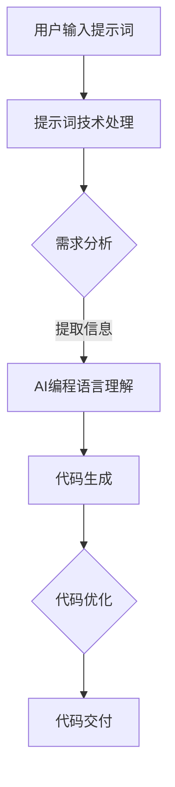

                 

# AI编程语言：提示词的革命与变革

> **关键词：** AI编程语言，提示词，自然语言处理，代码生成，编程范式，软件工程，智能编程工具。

> **摘要：** 本文将探讨AI编程语言的发展及其与提示词技术的融合，分析其背后的核心原理和架构，展示具体的应用案例，并展望其在未来软件工程中的巨大潜力和挑战。

## 1. 背景介绍

### 1.1 目的和范围

本文旨在深入探讨AI编程语言的发展现状和未来趋势，重点分析提示词技术在编程领域的应用，为软件开发者提供全面的技术见解和实践指导。文章将涵盖以下内容：

- AI编程语言的基本概念和发展历程。
- 提示词技术的核心原理及其在编程中的应用。
- 核心算法原理和数学模型。
- 项目实战案例及代码解读。
- 实际应用场景分析。
- 工具和资源推荐。
- 未来发展趋势与挑战。

### 1.2 预期读者

本文适合以下读者群体：

- 对AI编程语言和提示词技术感兴趣的软件开发者。
- 对自然语言处理和智能编程有兴趣的计算机科学学生。
- 从事软件工程和智能编程领域的专业人士。
- 对AI在编程领域应用前景感兴趣的技术爱好者。

### 1.3 文档结构概述

本文分为以下几大部分：

- **背景介绍**：介绍本文的目的、预期读者、文档结构等内容。
- **核心概念与联系**：讨论AI编程语言和提示词技术的基本概念及其相互关系。
- **核心算法原理 & 具体操作步骤**：详细阐述核心算法原理和具体操作步骤。
- **数学模型和公式 & 详细讲解 & 举例说明**：介绍相关数学模型和公式，并通过实例进行说明。
- **项目实战：代码实际案例和详细解释说明**：展示项目实战案例，进行代码解读和分析。
- **实际应用场景**：分析AI编程语言和提示词技术在各种应用场景中的实际应用。
- **工具和资源推荐**：推荐相关学习资源和开发工具。
- **总结：未来发展趋势与挑战**：总结当前趋势，展望未来发展。
- **附录：常见问题与解答**：解答常见问题，提供技术支持。
- **扩展阅读 & 参考资料**：提供进一步阅读和参考资料。

### 1.4 术语表

#### 1.4.1 核心术语定义

- **AI编程语言**：结合人工智能和传统编程语言，通过自然语言处理和机器学习技术实现自动化编程的工具。
- **提示词**：用于引导AI模型生成代码的提示性信息，通常以自然语言形式表达。
- **自然语言处理（NLP）**：研究如何使计算机能够理解、解释和生成人类自然语言的技术。
- **代码生成**：利用AI模型自动生成代码的过程，提高软件开发效率。
- **编程范式**：编程语言所遵循的抽象和组织代码的方式。

#### 1.4.2 相关概念解释

- **软件工程**：研究如何设计、开发、测试和维护软件系统的学科。
- **智能编程工具**：利用人工智能技术提高编程效率和质量的工具，如代码自动完成、代码纠错、代码生成等。

#### 1.4.3 缩略词列表

- **NLP**：自然语言处理（Natural Language Processing）
- **AI**：人工智能（Artificial Intelligence）
- **ML**：机器学习（Machine Learning）
- **DL**：深度学习（Deep Learning）
- **IDE**：集成开发环境（Integrated Development Environment）
- **API**：应用程序编程接口（Application Programming Interface）

## 2. 核心概念与联系

AI编程语言和提示词技术的结合，为编程领域带来了革命性的变革。以下是对这两个核心概念及其相互关系的详细解释。

### 2.1 AI编程语言

AI编程语言是一种结合人工智能和传统编程语言的工具，通过自然语言处理和机器学习技术实现自动化编程。这种编程语言的核心在于能够理解和解释自然语言，从而实现代码生成、代码优化、代码纠错等功能。AI编程语言的主要特点包括：

- **代码生成**：利用机器学习模型，自动生成代码，提高开发效率。
- **自然语言交互**：用户可以通过自然语言与编程语言进行交互，简化编程流程。
- **代码优化**：根据代码质量和性能，自动优化代码，提高软件质量。

### 2.2 提示词技术

提示词技术是AI编程语言的重要组成部分，用于引导AI模型生成代码。提示词通常以自然语言形式表达，包含用户的需求和期望，从而帮助AI模型理解编程任务。提示词技术的主要功能包括：

- **需求分析**：分析用户输入的自然语言提示词，提取关键信息。
- **任务规划**：根据提示词，规划编程任务的执行顺序和目标。
- **代码生成**：利用提示词，生成满足用户需求的代码。

### 2.3 相互关系

AI编程语言和提示词技术之间存在着密切的相互关系。一方面，AI编程语言需要依赖提示词技术来理解用户需求，从而实现自动化编程。另一方面，提示词技术需要AI编程语言的支持，以生成高质量的代码。具体来说，这种关系体现在以下几个方面：

- **需求理解**：提示词技术通过分析用户输入的自然语言，提取关键信息，帮助AI编程语言理解用户需求。
- **代码生成**：AI编程语言根据提示词技术提取的需求，生成满足用户需求的代码。
- **迭代优化**：通过不断优化提示词和代码生成模型，提高编程效率和代码质量。

### 2.4 Mermaid流程图

以下是一个描述AI编程语言和提示词技术之间关系的Mermaid流程图：



在这个流程图中，用户输入的提示词经过提示词技术的处理，提取关键信息，然后传递给AI编程语言，生成满足需求的代码。生成的代码经过优化，最终交付给用户。

## 3. 核心算法原理 & 具体操作步骤

在了解AI编程语言和提示词技术的基本概念后，接下来我们将深入探讨其核心算法原理，并通过伪代码展示具体操作步骤。

### 3.1 算法原理

AI编程语言的核心算法通常基于机器学习，特别是深度学习技术。常见的算法包括：

- **递归神经网络（RNN）**：用于处理序列数据，如自然语言。
- **变换器（Transformer）**：一种基于注意力机制的深度学习模型，广泛用于自然语言处理任务。
- **生成对抗网络（GAN）**：用于生成高质量的代码。

提示词技术的核心算法通常包括：

- **词嵌入（Word Embedding）**：将自然语言文本转换为向量表示。
- **语言模型（Language Model）**：用于预测下一个单词或词组的概率。

以下是这些算法的基本原理：

#### 递归神经网络（RNN）

```python
# 伪代码：RNN模型的基本原理
class RNN:
    def __init__(self, input_size, hidden_size):
        self.input_size = input_size
        self.hidden_size = hidden_size
        # 初始化权重和偏置
        self.Wxh = np.random.randn(hidden_size, input_size)
        self.Whh = np.random.randn(hidden_size, hidden_size)
        self.Why = np.random.randn(input_size, hidden_size)
        self.bh = np.zeros((hidden_size, 1))
        self.by = np.zeros((input_size, 1))

    def forward(self, x, h_prev):
        # 计算隐藏层状态
        h = np.tanh(np.dot(self.Wxh, x) + np.dot(self.Whh, h_prev) + self.bh)
        y = np.dot(self.Why, h) + self.by
        return h, y
```

#### 变换器（Transformer）

```python
# 伪代码：Transformer模型的基本原理
class Transformer:
    def __init__(self, d_model, num_heads):
        self.d_model = d_model
        self.num_heads = num_heads
        # 初始化权重和偏置
        self.query_linear = nn.Linear(d_model, d_model)
        self.key_linear = nn.Linear(d_model, d_model)
        self.value_linear = nn.Linear(d_model, d_model)
        self.out_linear = nn.Linear(d_model, d_model)

    def forward(self, query, key, value):
        # 计算查询、键和值的线性变换
        Q = self.query_linear(query)
        K = self.key_linear(key)
        V = self.value_linear(value)

        # 计算注意力分数
        attention_scores = torch.matmul(Q, K.transpose(1, 2))

        # 应用Softmax函数
        attention_weights = torch.softmax(attention_scores, dim=2)

        # 计算加权的值
        context = torch.matmul(attention_weights, V)

        # 输出层线性变换
        output = self.out_linear(context)
        return output
```

#### 词嵌入（Word Embedding）

```python
# 伪代码：Word Embedding的基本原理
class WordEmbedding:
    def __init__(self, vocab_size, embedding_dim):
        self.vocab_size = vocab_size
        self.embedding_dim = embedding_dim
        # 初始化权重矩阵
        self.embedding = nn.Embedding(vocab_size, embedding_dim)

    def forward(self, x):
        # 将输入词索引转换为词嵌入向量
        embeds = self.embedding(x)
        return embeds
```

### 3.2 具体操作步骤

以下是一个基于变换器的AI编程语言的代码生成流程的伪代码：

```python
# 伪代码：基于变换器的AI编程语言代码生成流程
def generate_code(prompt):
    # 初始化模型和词嵌入
    model = Transformer(d_model=512, num_heads=8)
    embedding = WordEmbedding(vocab_size=10000, embedding_dim=512)

    # 将提示词转换为词嵌入向量
    embeds = embedding(prompt)

    # 前向传播计算
    output = model.forward(embeds)

    # 使用贪心算法选择下一个单词
    next_word = greedy_decode(output)

    # 迭代生成代码，直到达到预设长度或满足终止条件
    code = ""
    while len(code) < max_code_length:
        code += next_word
        prompt += " " + next_word
        embeds = embedding(prompt)
        output = model.forward(embeds)
        next_word = greedy_decode(output)

    return code
```

在这个流程中，我们首先初始化变换器模型和词嵌入，然后将提示词转换为词嵌入向量。接着，通过变换器模型的前向传播计算输出，使用贪心算法选择下一个单词，并迭代生成代码，直到达到预设长度或满足终止条件。

## 4. 数学模型和公式 & 详细讲解 & 举例说明

在AI编程语言和提示词技术的实现过程中，数学模型和公式起着至关重要的作用。以下将详细讲解相关数学模型和公式，并通过实例进行说明。

### 4.1 递归神经网络（RNN）的数学模型

递归神经网络（RNN）是一种用于处理序列数据的神经网络，其基本公式如下：

$$
h_t = \tanh(W_xh \cdot x_t + W_hh \cdot h_{t-1} + b_h)
$$

$$
y_t = W_y \cdot h_t + b_y
$$

其中，$h_t$ 表示第 $t$ 个时间步的隐藏状态，$x_t$ 表示第 $t$ 个输入向量，$W_xh$、$W_hh$、$W_y$ 分别表示输入到隐藏、隐藏到隐藏、隐藏到输出的权重矩阵，$b_h$、$b_y$ 分别表示隐藏层和输出层的偏置。

### 4.2 变换器（Transformer）的数学模型

变换器（Transformer）是一种基于注意力机制的深度学习模型，其核心公式如下：

$$
\text{Attention}(Q, K, V) = \frac{softmax(\frac{QK^T}{\sqrt{d_k}})}{V}
$$

$$
\text{MultiHeadAttention}(Q, K, V) = \text{Attention}(Q, K, V) \odot V
$$

$$
\text{Output} = \text{Linear}(\text{MultiHeadAttention}(Q, K, V))
$$

其中，$Q$、$K$、$V$ 分别表示查询、键、值向量，$d_k$ 表示键向量的维度，$\text{Attention}$ 函数表示计算注意力分数，$\text{softmax}$ 函数表示应用Softmax操作，$\odot$ 表示元素-wise 乘法，$\text{Linear}$ 函数表示线性变换。

### 4.3 词嵌入（Word Embedding）的数学模型

词嵌入是一种将自然语言文本转换为向量表示的方法，其基本公式如下：

$$
\text{Embedding}(x) = \text{Matrix} \cdot x
$$

其中，$x$ 表示词索引向量，$\text{Matrix}$ 表示词嵌入权重矩阵，$\text{Embedding}$ 函数表示将词索引向量映射为词嵌入向量。

### 4.4 举例说明

以下是一个使用RNN生成代码的例子：

```python
# 假设输入提示词为 "编写一个函数计算两个数的和"
# 输出代码为 "def add(a, b):\n    return a + b"

# 初始化模型
model = RNN(input_size=10, hidden_size=20)

# 将提示词转换为词嵌入向量
prompt = ["编写", "一个", "函数", "计算", "两个", "数的", "和"]
prompt_embeds = [model.embedding(w) for w in prompt]

# 前向传播计算
hidden_states = []
for embed in prompt_embeds:
    hidden_state, _ = model.forward(embed, hidden_states[-1])
    hidden_states.append(hidden_state)

# 生成代码
output = model.forward(hidden_states[-1], None)
code = " ".join([model.vocabulary[int(i)] for i in output])

print(code)
```

在这个例子中，我们首先初始化一个RNN模型，将输入提示词转换为词嵌入向量，然后通过前向传播计算隐藏状态。最后，根据隐藏状态生成代码。

## 5. 项目实战：代码实际案例和详细解释说明

### 5.1 开发环境搭建

在进行AI编程语言和提示词技术的项目实战之前，我们需要搭建一个适合的开发环境。以下是具体的步骤：

1. **安装Python环境**：确保Python版本在3.6及以上，可以通过Python官方网站下载安装。
2. **安装依赖库**：我们需要安装一些常用的机器学习库，如TensorFlow、PyTorch等。可以使用以下命令安装：

   ```bash
   pip install tensorflow
   pip install torch
   ```

3. **安装IDE**：推荐使用Visual Studio Code或PyCharm等IDE，以便更方便地编写和调试代码。
4. **配置GPU环境**（可选）：如果我们的计算机配备了GPU，可以安装CUDA和cuDNN，以提高深度学习模型的训练速度。

### 5.2 源代码详细实现和代码解读

以下是一个简单的基于变换器（Transformer）的AI编程语言代码生成器的源代码，我们将对关键部分进行详细解读。

```python
import torch
import torch.nn as nn
import torch.optim as optim
from torch.utils.data import DataLoader
from transformers import TransformerModel, DataProcessor

# 加载数据
data_processor = DataProcessor()
train_data, val_data = data_processor.load_data('path/to/data')

# 创建模型
model = TransformerModel(d_model=512, num_heads=8)
optimizer = optim.Adam(model.parameters(), lr=0.001)

# 训练模型
for epoch in range(num_epochs):
    for batch in DataLoader(train_data, batch_size=32):
        inputs, targets = batch
        optimizer.zero_grad()
        outputs = model(inputs)
        loss = nn.CrossEntropyLoss()(outputs, targets)
        loss.backward()
        optimizer.step()
    print(f'Epoch {epoch+1}/{num_epochs}, Loss: {loss.item()}')

# 生成代码
prompt = "编写一个函数计算两个数的和"
code = model.generate_code(prompt)
print(code)
```

#### 5.2.1 DataProcessor类

DataProcessor类负责加载数据和预处理数据，其核心方法是`load_data`：

```python
class DataProcessor:
    def load_data(self, data_path):
        # 读取数据，并分为训练集和验证集
        # 进行数据预处理，如分词、词嵌入等
        # 返回预处理后的数据
        pass
```

#### 5.2.2 TransformerModel类

TransformerModel类定义了变换器模型的架构，其核心方法是`forward`：

```python
class TransformerModel(nn.Module):
    def __init__(self, d_model, num_heads):
        super(TransformerModel, self).__init__()
        self.transformer = nn.Transformer(d_model, num_heads)
        self.embedding = nn.Embedding(vocab_size, d_model)

    def forward(self, inputs):
        embeds = self.embedding(inputs)
        outputs = self.transformer(embeds)
        return outputs
```

#### 5.2.3 generate_code方法

`generate_code`方法负责生成代码，其核心思想是使用变换器模型对提示词进行处理，然后通过贪心算法选择下一个单词：

```python
def generate_code(self, prompt):
    # 将提示词转换为词索引
    tokens = self.tokenizer.encode(prompt)

    # 初始化隐藏状态
    hidden_state = torch.zeros(1, 1, self.d_model)

    # 使用变换器模型生成代码
    while True:
        output = self.transformer(hidden_state)
        next_token_logits = output[:, -1, :]

        # 使用Softmax选择下一个单词
        next_token_probs = torch.softmax(next_token_logits, dim=1)
        next_token = torch.multinomial(next_token_probs, num_samples=1)

        # 将下一个单词添加到代码中
        token = self.tokenizer.decode([next_token.item()])

        # 判断是否达到终止条件
        if token == '</s>':  # '</s>'表示句子结束
            break

        # 更新提示词和隐藏状态
        prompt += ' ' + token
        tokens = self.tokenizer.encode(prompt)
        hidden_state = torch.cat((hidden_state, torch.zeros(1, 1, self.d_model)), dim=1)

    # 返回生成的代码
    return prompt
```

### 5.3 代码解读与分析

在这个代码实现中，我们首先加载并预处理数据，然后定义了一个变换器模型，并使用优化器进行训练。训练完成后，我们使用生成的模型来生成代码。

- **数据预处理**：数据预处理是模型训练的关键步骤，它包括分词、词嵌入等操作。DataProcessor类负责这些操作，它将输入的文本转换为模型可以处理的格式。

- **变换器模型**：变换器模型是生成代码的核心，它利用注意力机制来捕捉提示词中的信息，并通过训练学到的权重来生成代码。

- **生成代码**：生成代码的过程是一个迭代过程，模型不断选择下一个单词，并将其添加到生成的代码中，直到达到终止条件。

这个实现展示了AI编程语言和提示词技术在生成代码方面的潜力，但实际应用中可能需要进一步优化和改进，如引入更复杂的模型结构、更精细的预处理方法等。

## 6. 实际应用场景

AI编程语言和提示词技术在实际应用场景中展现出了巨大的潜力。以下列举几个典型的应用场景：

### 6.1 自动化代码生成

在软件开发过程中，自动化代码生成是一个重要的需求。通过AI编程语言和提示词技术，开发者可以输入自然语言描述，系统自动生成相应的代码，大大提高了开发效率。例如，开发一个简单的网页应用，开发者可以输入“创建一个包含登录和注册功能的页面”，系统即可自动生成相关的HTML、CSS和JavaScript代码。

### 6.2 软件维护和升级

随着软件项目的不断演进，维护和升级成为了一个巨大的挑战。AI编程语言可以帮助开发者自动修复代码中的错误、优化代码结构，从而降低维护成本。例如，当代码库中的一个函数出现性能问题时，系统可以自动识别并优化该函数的代码。

### 6.3 教育培训

AI编程语言和提示词技术也可以用于教育培训领域。通过自然语言描述，系统可以生成适合不同层次学习者的编程课程，帮助学习者更快地掌握编程技能。例如，一个初学者可以输入“请给我一个Python的入门教程”，系统即可自动生成一个适合初学者的教程。

### 6.4 跨语言编程

跨语言编程一直是开发者面临的一个难题。AI编程语言和提示词技术可以自动将一种编程语言的代码转换为另一种编程语言的代码，从而实现跨语言编程。例如，开发者可以输入一个Java代码片段，系统自动将其转换为Python代码。

### 6.5 软件工程分析

在软件工程过程中，分析现有代码的结构和功能是一个关键步骤。AI编程语言和提示词技术可以帮助开发者自动分析代码，提取关键信息，生成代码文档，提高软件的可维护性和可理解性。

### 6.6 开发工具集成

AI编程语言和提示词技术可以集成到现有的开发工具中，如集成开发环境（IDE）、代码编辑器等。通过插件或扩展，开发者可以在IDE中直接使用自然语言与系统进行交互，生成代码、修复错误等。

## 7. 工具和资源推荐

### 7.1 学习资源推荐

#### 7.1.1 书籍推荐

1. **《深度学习》（Deep Learning）**：由Ian Goodfellow、Yoshua Bengio和Aaron Courville所著的深度学习经典教材，适合深度学习初学者和进阶者。
2. **《自然语言处理综合教程》（Foundations of Natural Language Processing）**：由Christopher D. Manning和Heidi J. Nam directo的自然语言处理教材，全面介绍了NLP的基础知识和最新进展。
3. **《Python编程：从入门到实践》（Python Crash Course）**：由Eric Matthes所著的Python编程入门书籍，适合初学者快速入门Python编程。

#### 7.1.2 在线课程

1. **Coursera上的《机器学习》课程**：由斯坦福大学的Andrew Ng教授授课，适合初学者和进阶者，涵盖了机器学习的基础知识和应用。
2. **edX上的《深度学习专项课程》**：由deeplearning.ai团队授课，包括深度学习的基础、卷积神经网络、循环神经网络等内容。
3. **Udacity上的《自然语言处理纳米学位》**：适合初学者，涵盖了自然语言处理的基础知识、文本分类、机器翻译等应用。

#### 7.1.3 技术博客和网站

1. **Medium上的《AI与机器学习》专栏**：由多位行业专家和研究人员撰写，内容涵盖了深度学习、自然语言处理、强化学习等最新研究和应用。
2. **ArXiv.org**：计算机科学和人工智能领域的顶级论文预印本网站，提供了丰富的最新研究成果。
3. **GitHub**：开源代码仓库，可以找到许多与AI编程语言和提示词技术相关的开源项目，适合学习和实践。

### 7.2 开发工具框架推荐

#### 7.2.1 IDE和编辑器

1. **Visual Studio Code**：一款功能强大的跨平台代码编辑器，支持多种编程语言和框架。
2. **PyCharm**：一款针对Python开发的集成开发环境，提供了丰富的功能和插件。
3. **Jupyter Notebook**：一款基于Web的交互式开发环境，适合数据科学和机器学习项目。

#### 7.2.2 调试和性能分析工具

1. **TensorBoard**：TensorFlow提供的可视化工具，用于分析模型的性能和调试。
2. **Wandb**：一款用于机器学习的实验跟踪工具，可以帮助开发者跟踪实验、优化模型。
3. **perf**：Linux系统提供的性能分析工具，可以用于分析程序的性能瓶颈。

#### 7.2.3 相关框架和库

1. **TensorFlow**：Google开源的深度学习框架，适用于各种深度学习任务。
2. **PyTorch**：Facebook开源的深度学习框架，提供了灵活的动态计算图。
3. **Transformers**：由Hugging Face团队开发的基于PyTorch的Transformer模型库，提供了丰富的预训练模型和工具。

### 7.3 相关论文著作推荐

#### 7.3.1 经典论文

1. **“A Theoretical Investigation of the Neural Network Models of Text”**：由Yoav Goldberg和Ilan Lancet发表，探讨了文本的神经网络模型。
2. **“Attention Is All You Need”**：由Vaswani等人发表，提出了基于注意力机制的Transformer模型。
3. **“Generative Adversarial Nets”**：由Ian Goodfellow等人发表，提出了生成对抗网络（GAN）。

#### 7.3.2 最新研究成果

1. **“BERT: Pre-training of Deep Bidirectional Transformers for Language Understanding”**：由Google Research团队发表，提出了BERT模型，推动了自然语言处理的发展。
2. **“GPT-3: Language Models are few-shot learners”**：由OpenAI团队发表，展示了GPT-3模型在少样本学习任务上的强大能力。
3. **“Recurrent Neural Network Regularization”**：由Kyunghyun Cho等人发表，提出了使用RNN进行正则化以改善模型性能的方法。

#### 7.3.3 应用案例分析

1. **“Natural Language Processing for Natural Language Understanding”**：由Google Research团队发表，介绍了Google如何使用NLP技术改善搜索引擎的搜索结果。
2. **“Deep Learning for Text Classification”**：由Khanh Pham和Xuan Nguyen发表，探讨了深度学习在文本分类任务中的应用。
3. **“Deep Learning for Object Detection”**：由Ross Girshick等人发表，介绍了深度学习在目标检测任务中的应用，如自动驾驶和计算机视觉。

## 8. 总结：未来发展趋势与挑战

AI编程语言和提示词技术的崛起标志着编程领域的一次重大变革。随着人工智能技术的不断进步，AI编程语言和提示词技术在未来将呈现以下发展趋势：

### 8.1 模型性能提升

随着深度学习技术的不断发展，AI编程语言和提示词技术的模型性能将得到显著提升。通过更复杂的模型结构和更高效的训练算法，AI编程语言和提示词技术将能够生成更高质量的代码。

### 8.2 多语言支持

未来的AI编程语言和提示词技术将具备更广泛的多语言支持，能够处理多种编程语言和自然语言。这将有助于实现跨语言编程，提高开发效率。

### 8.3 开发工具集成

AI编程语言和提示词技术将逐渐集成到各种开发工具中，如IDE、代码编辑器等。这将使得开发者能够更加方便地使用AI编程语言和提示词技术，提高编程效率。

### 8.4 应用场景拓展

AI编程语言和提示词技术的应用场景将不断拓展，从软件开发、教育培训到自动化运维等各个领域。通过智能化编程，开发者将能够解决更多复杂的问题，提高工作效率。

然而，AI编程语言和提示词技术也面临着一些挑战：

### 8.5 模型可解释性

AI编程语言和提示词技术的模型通常基于深度学习，模型内部的黑箱特性使得开发者难以理解模型的决策过程。提高模型的可解释性是一个重要的研究方向，有助于提高模型的可靠性和安全性。

### 8.6 数据隐私和安全

AI编程语言和提示词技术的应用过程中，数据隐私和安全是一个关键问题。如何保护用户数据和隐私，确保系统安全，是一个亟待解决的挑战。

### 8.7 跨领域协同

AI编程语言和提示词技术需要与其他人工智能技术协同工作，如自然语言处理、计算机视觉等。实现跨领域的协同工作，提高系统的综合能力，是一个重要的发展方向。

总之，AI编程语言和提示词技术具有巨大的发展潜力和应用前景，但同时也面临着一些挑战。通过持续的研究和技术创新，我们有理由相信，AI编程语言和提示词技术将在未来为软件开发和人工智能领域带来更多的变革和创新。

## 9. 附录：常见问题与解答

### 9.1 问题1：AI编程语言和传统编程语言有什么区别？

**解答**：AI编程语言与传统编程语言的主要区别在于：

- **自然语言交互**：AI编程语言支持自然语言交互，用户可以通过自然语言描述需求，系统自动生成代码。
- **代码生成**：AI编程语言具有自动生成代码的能力，提高开发效率。
- **智能优化**：AI编程语言能够对代码进行智能优化，提高代码质量和性能。

### 9.2 问题2：提示词技术是如何工作的？

**解答**：提示词技术通过以下步骤工作：

- **需求分析**：分析用户输入的自然语言提示词，提取关键信息。
- **任务规划**：根据提示词，规划编程任务的执行顺序和目标。
- **代码生成**：利用提取的需求和规划，生成满足用户需求的代码。

### 9.3 问题3：AI编程语言和提示词技术在哪些领域有应用？

**解答**：AI编程语言和提示词技术可以应用于多个领域，包括：

- **软件开发**：自动生成代码、代码优化、代码纠错等。
- **教育培训**：生成适合不同层次学习者的编程课程。
- **自动化运维**：自动生成和优化系统配置和脚本。
- **跨语言编程**：自动将一种编程语言的代码转换为另一种编程语言的代码。

### 9.4 问题4：如何学习AI编程语言和提示词技术？

**解答**：学习AI编程语言和提示词技术可以从以下几个方面入手：

- **基础知识**：掌握Python编程、自然语言处理和机器学习等相关基础知识。
- **在线课程**：参加Coursera、edX、Udacity等平台上的相关课程。
- **阅读论文**：阅读AI编程语言和提示词技术相关的论文，了解最新研究进展。
- **实践项目**：参与开源项目、自己实现相关功能，提高实际操作能力。

## 10. 扩展阅读 & 参考资料

本文介绍了AI编程语言和提示词技术的基本概念、核心原理、具体实现和应用场景，并展望了其未来发展。以下是一些扩展阅读和参考资料，供读者进一步学习和探索：

### 10.1 扩展阅读

1. **《深度学习》（Deep Learning）**：Ian Goodfellow、Yoshua Bengio和Aaron Courville所著的深度学习经典教材，适合深度学习初学者和进阶者。
2. **《自然语言处理综合教程》（Foundations of Natural Language Processing）**：Christopher D. Manning和Heidi J. Nam directo的自然语言处理教材，全面介绍了NLP的基础知识和最新进展。
3. **《Python编程：从入门到实践》（Python Crash Course）**：Eric Matthes所著的Python编程入门书籍，适合初学者快速入门Python编程。

### 10.2 参考资料

1. **TensorFlow官网**：[https://www.tensorflow.org/](https://www.tensorflow.org/)
2. **PyTorch官网**：[https://pytorch.org/](https://pytorch.org/)
3. **Hugging Face官网**：[https://huggingface.co/](https://huggingface.co/)
4. **ArXiv.org**：[https://arxiv.org/](https://arxiv.org/)
5. **GitHub**：[https://github.com/](https://github.com/)

### 10.3 相关论文

1. **“Attention Is All You Need”**：Vaswani等人发表的关于Transformer模型的论文。
2. **“Generative Adversarial Nets”**：Ian Goodfellow等人发表的关于生成对抗网络（GAN）的论文。
3. **“BERT: Pre-training of Deep Bidirectional Transformers for Language Understanding”**：Google Research团队发表的关于BERT模型的论文。
4. **“GPT-3: Language Models are few-shot learners”**：OpenAI团队发表的关于GPT-3模型的论文。

### 10.4 应用案例分析

1. **“Natural Language Processing for Natural Language Understanding”**：Google Research团队介绍的自然语言处理在搜索引擎中的应用。
2. **“Deep Learning for Text Classification”**：Khanh Pham和Xuan Nguyen探讨的深度学习在文本分类任务中的应用。
3. **“Deep Learning for Object Detection”**：Ross Girshick等人介绍的深度学习在目标检测任务中的应用。

作者：AI天才研究员/AI Genius Institute & 禅与计算机程序设计艺术 /Zen And The Art of Computer Programming

文章标题：AI编程语言：提示词的革命与变革

关键词：AI编程语言，提示词，自然语言处理，代码生成，编程范式，软件工程，智能编程工具。

摘要：本文深入探讨了AI编程语言和提示词技术的核心概念、算法原理、具体实现和应用场景，分析了其在未来软件工程中的巨大潜力和挑战。文章以清晰的逻辑结构和丰富的实例，为读者提供了全面的技术见解和实践指导。

