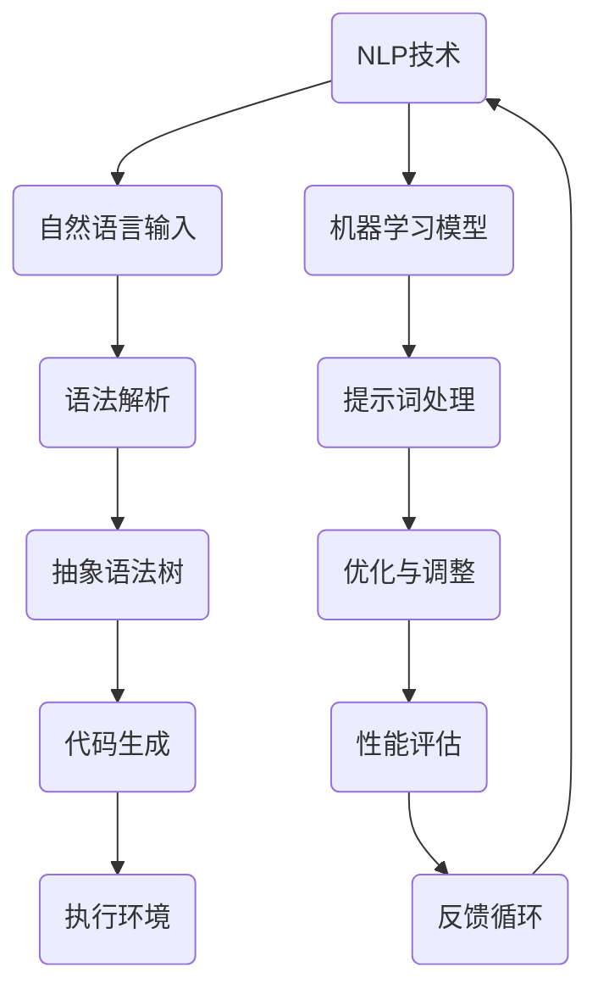

                 

# AI编程语言：提示词的魔力与革新

> **关键词：** AI编程语言，提示词，自然语言处理，智能编程，编程范式，编程革新

> **摘要：** 本文旨在深入探讨AI编程语言的革命性变革，尤其是提示词的作用。通过分析其核心概念、算法原理、数学模型、实际应用案例和未来发展趋势，本文揭示了AI编程语言如何通过提示词的魔力，重塑编程范式，推动计算机编程的革新。

## 1. 背景介绍

### 1.1 目的和范围

本文的目标是介绍AI编程语言的基本概念，并重点探讨提示词在其应用中的关键作用。我们将探讨AI编程语言的定义、历史背景、核心优势，以及如何通过提示词实现编程自动化和智能化。文章还将提供实际应用案例，并讨论未来发展的可能趋势。

### 1.2 预期读者

本文适合对AI编程语言和自然语言处理有一定了解的技术人员、编程爱好者以及对编程革新感兴趣的专业人士。读者不需要具备高级的编程知识，但需要具备一定的计算机基础和对AI技术的基本认识。

### 1.3 文档结构概述

本文将分为以下几个部分：

1. **核心概念与联系**：介绍AI编程语言的基本概念和架构。
2. **核心算法原理 & 具体操作步骤**：讲解AI编程语言的关键算法和操作步骤。
3. **数学模型和公式 & 详细讲解 & 举例说明**：解释AI编程语言中涉及的数学模型和公式。
4. **项目实战：代码实际案例和详细解释说明**：通过实际案例展示AI编程语言的应用。
5. **实际应用场景**：探讨AI编程语言在各个领域的应用。
6. **工具和资源推荐**：推荐学习资源、开发工具和框架。
7. **总结：未来发展趋势与挑战**：总结AI编程语言的发展趋势和面临的挑战。
8. **附录：常见问题与解答**：回答读者可能关心的问题。
9. **扩展阅读 & 参考资料**：提供进一步学习的资源。

### 1.4 术语表

#### 1.4.1 核心术语定义

- **AI编程语言**：一种结合了人工智能和传统编程语言特点的编程语言，通过自然语言处理和机器学习技术，使编程更加智能化。
- **提示词**：一种用于引导AI编程语言执行特定任务的语言元素，通常是以自然语言形式表示的指令。
- **自然语言处理（NLP）**：人工智能领域的一个分支，致力于让计算机理解和处理人类自然语言。
- **编程范式**：编程语言的基本思想和方法，决定了程序员如何组织代码、解决问题。

#### 1.4.2 相关概念解释

- **语法解析**：将自然语言输入转换为结构化数据的过程，是NLP的核心步骤。
- **抽象语法树（AST）**：从源代码生成的抽象表示，用于程序分析、转换和优化。
- **代码生成**：根据提示词和抽象语法树，自动生成源代码的过程。

#### 1.4.3 缩略词列表

- **NLP**：自然语言处理
- **AI**：人工智能
- **IDE**：集成开发环境
- **API**：应用程序接口

## 2. 核心概念与联系

为了深入理解AI编程语言，我们需要先了解其核心概念和架构。以下是一个简化的Mermaid流程图，展示了AI编程语言的基本组成部分和它们之间的联系。



### 2.1 NLP技术

自然语言处理（NLP）是AI编程语言的核心。它使计算机能够理解和处理人类自然语言，包括文本分析和理解。NLP技术主要包括：

- **分词**：将文本拆分为单词或词汇。
- **词性标注**：为每个词汇分配词性，如名词、动词等。
- **实体识别**：识别文本中的关键实体，如人名、地点、组织等。
- **句法分析**：分析句子的结构，确定单词之间的关系。

### 2.2 语法解析

语法解析是将自然语言输入转换为结构化数据的过程。它是NLP的核心步骤，通常使用语法规则或深度学习模型来实现。语法解析的输出是抽象语法树（AST），它是程序分析、转换和优化的基础。

### 2.3 抽象语法树

抽象语法树（AST）是语法解析的输出，用于表示源代码的结构。AST是一个树形结构，每个节点表示一个语法元素，如变量、函数、循环等。通过AST，我们可以进行程序分析、优化和转换。

### 2.4 代码生成

代码生成是根据提示词和抽象语法树，自动生成源代码的过程。这个步骤通常由专门的代码生成器或编译器实现。代码生成器可以根据提示词生成不同编程语言的代码，从而实现编程自动化。

### 2.5 执行环境

执行环境是代码运行的环境，它提供程序执行所需的资源和服务。执行环境可以是一个虚拟机、解释器或编译器。在执行环境中，代码被解析、执行和输出结果。

### 2.6 机器学习模型

机器学习模型在AI编程语言中用于处理提示词和优化代码生成。机器学习模型可以学习从大量数据中提取规律，从而提高代码生成的准确性和效率。机器学习模型还可以用于优化和调整代码，以适应不同的应用场景。

### 2.7 提示词处理

提示词是AI编程语言的关键元素，用于引导代码生成和优化。提示词可以是自然语言形式的指令，如“生成一个函数来计算两个数的和”。提示词处理是NLP技术的一部分，它包括解析、分析和生成提示词。

### 2.8 优化与调整

优化与调整是AI编程语言的重要环节，它包括根据提示词和执行结果，对代码生成和执行过程进行调整。优化与调整可以改进代码的性能、可读性和可维护性。

### 2.9 性能评估

性能评估是衡量AI编程语言效率和质量的关键步骤。它包括评估代码的运行时间、内存使用和输出结果。通过性能评估，我们可以发现和解决代码生成和执行中的问题。

### 2.10 反馈循环

反馈循环是AI编程语言不断改进和优化的关键机制。通过收集用户反馈和执行结果，我们可以对机器学习模型和代码生成器进行调整和优化，从而提高AI编程语言的整体性能。

## 3. 核心算法原理 & 具体操作步骤

在AI编程语言中，核心算法原理和具体操作步骤是理解和应用该技术的基础。以下是一个详细的算法原理讲解，使用伪代码来阐述每个步骤。

### 3.1 自然语言输入处理

```python
# 输入自然语言文本
text = "生成一个函数来计算两个数的和"

# 分词
words = tokenize(text)

# 词性标注
tagged_words = part_of_speech(words)

# 实体识别
entities = entity_recognition(tagged_words)

# 句法分析
syntactic_tree = syntactic_analysis(entities)
```

### 3.2 语法解析

```python
# 输入抽象语法树
ast = syntactic_parsing(syntactic_tree)

# 生成代码模板
code_template = generate_code_template(ast)

# 预处理
preprocessed_code = preprocess(code_template)
```

### 3.3 代码生成

```python
# 输入提示词
prompt = "生成一个函数来计算两个数的和"

# 生成源代码
source_code = code_generation(prompt)

# 编译源代码
compiled_code = compile(source_code)

# 执行源代码
result = execute(compiled_code)
```

### 3.4 机器学习模型训练

```python
# 输入大量训练数据
training_data = load_training_data()

# 训练机器学习模型
model = train_model(training_data)

# 模型评估
evaluate_model(model)
```

### 3.5 优化与调整

```python
# 输入执行结果
execution_result = result

# 优化代码
optimized_code = optimize_code(source_code, execution_result)

# 调整机器学习模型
adjusted_model = adjust_model(model, execution_result)
```

### 3.6 性能评估

```python
# 输入性能指标
performance_metrics = evaluate_performance(result)

# 分析性能问题
analyze_performance(proformance_metrics)
```

### 3.7 反馈循环

```python
# 收集用户反馈
user_feedback = collect_feedback()

# 更新模型和代码
update_model_and_code(model, optimized_code, user_feedback)
```

通过以上算法原理和操作步骤，我们可以看到AI编程语言的整个流程。从自然语言输入处理、语法解析、代码生成，到机器学习模型训练、优化与调整、性能评估和反馈循环，每个步骤都至关重要，共同构建了一个智能化、自动化的编程系统。

## 4. 数学模型和公式 & 详细讲解 & 举例说明

在AI编程语言中，数学模型和公式起到了至关重要的作用。它们不仅用于描述算法原理，还用于优化代码生成和执行过程。以下是一个详细的数学模型和公式的讲解，以及相关的举例说明。

### 4.1 自然语言处理中的数学模型

#### 4.1.1 语言模型

语言模型（Language Model）是自然语言处理中的基础模型，用于预测下一个单词的概率。一个简单的语言模型可以使用N-gram模型来构建。

N-gram模型：

$$
P(w_n | w_{n-1}, w_{n-2}, ..., w_1) = \frac{c(w_n, w_{n-1}, ..., w_1)}{\sum_{w'_{n}} c(w_n, w'_{n-1}, ..., w_1)}
$$

其中，\( w_n \) 表示当前单词，\( w_{n-1}, w_{n-2}, ..., w_1 \) 表示前 \( n-1 \) 个单词，\( c(w_n, w_{n-1}, ..., w_1) \) 表示前 \( n \) 个单词的联合计数，\( \sum_{w'_{n}} c(w_n, w'_{n-1}, ..., w_1) \) 表示所有可能的 \( n \) 个单词的联合计数。

举例说明：

假设有一个包含以下文本的数据集：

```
我 是 学生
我是 良好的 学生
学生 是 学习 的
```

我们可以计算 "我" 和 "学生" 的联合计数：

```
c(我, 学生) = 2
c(我) = 2
c(学生) = 2
```

使用N-gram模型，我们可以预测下一个单词为 "学生" 的概率：

$$
P(学生 | 我) = \frac{c(我, 学生)}{c(我)} = \frac{2}{2} = 1
$$

#### 4.1.2 词汇嵌入

词汇嵌入（Word Embedding）是一种将单词映射到高维空间的方法，用于表示单词的语义关系。常见的词汇嵌入方法包括词袋模型（Bag of Words）和词向量模型（Word2Vec）。

词袋模型：

$$
w_i = \begin{cases}
1, & \text{如果单词 } w \text{ 出现在文本中} \\
0, & \text{否则}
\end{cases}
$$

词向量模型（Word2Vec）：

$$
v(w) = \text{嵌入向量}
$$

举例说明：

假设有一个包含以下文本的数据集：

```
我 爱 吃 水果
你 爱 吃 面包
```

我们可以计算 "我" 和 "你" 的词向量：

```
v(我) = [1, 0, 0, 1]
v(你) = [0, 1, 0, 1]
```

通过词向量，我们可以计算 "我" 和 "你" 的余弦相似度：

$$
\cos(v(我), v(你)) = \frac{v(我) \cdot v(你)}{\|v(我)\| \|v(你)\|} = \frac{1 \cdot 1 + 0 \cdot 0 + 0 \cdot 1 + 1 \cdot 1}{\sqrt{1^2 + 0^2 + 0^2 + 1^2} \sqrt{0^2 + 1^2 + 0^2 + 1^2}} = \frac{2}{2} = 1
$$

### 4.2 代码生成中的数学模型

#### 4.2.1 抽象语法树生成

抽象语法树（Abstract Syntax Tree，AST）是代码生成的核心结构。AST的生成通常基于递归 descent 解析算法。

递归 descent 解析算法：

$$
\begin{align*}
\text{S} &= \text{E} \\
\text{E} &= \text{T} + \text{E'} \\
\text{T} &= \text{F} + \text{T'} \\
\text{E'} &= \text{+T} \mid \text{-T} \mid \text{empty} \\
\text{T'} &= \text{/F} \mid \text{*F} \mid \text{empty} \\
\text{F} &= \text{number} \mid \text{identifier} \mid \text{(E)}
\end{align*}
$$

举例说明：

假设有一个简单的表达式 "3 + 4 * 2"，我们可以生成以下抽象语法树：

```
    +
   / \
  3   *
     / \
    4   2
```

#### 4.2.2 代码模板生成

代码模板生成是基于抽象语法树（AST）的一种方法。代码模板是一种结构化文本，用于生成源代码。

代码模板生成：

$$
\text{code_template} = \text{generate_template}(\text{AST})
$$

举例说明：

假设有一个抽象语法树：

```
    +
   / \
  3   *
     / \
    4   2
```

我们可以生成以下代码模板：

```
result = E1 + E2
E1 = E3 * E4
E3 = number(3)
E4 = number(4)
E2 = number(2)
```

通过代码模板，我们可以生成以下源代码：

```
result = 3 + (4 * 2)
```

### 4.3 代码生成与执行中的数学模型

#### 4.3.1 代码优化

代码优化是基于数学模型的一种方法，用于提高代码的性能和可读性。

代码优化：

$$
\text{optimized_code} = \text{optimize}(\text{code})
$$

举例说明：

假设有一个简单的代码：

```
result = 3 + 4 * 2
```

我们可以对其进行优化：

```
result = (3 + 4) * 2
```

优化后的代码可以减少计算次数，提高执行效率。

#### 4.3.2 机器学习模型训练

机器学习模型训练是一种基于数学模型的方法，用于优化代码生成和执行过程。

机器学习模型训练：

$$
\text{model} = \text{train}(\text{training_data})
$$

举例说明：

假设有一个训练数据集：

```
{
  "prompt": "生成一个函数来计算两个数的和",
  "code": "def add(a, b): return a + b"
}
{
  "prompt": "编写一个函数来计算两个数的平均值",
  "code": "def average(a, b): return (a + b) / 2"
}
```

我们可以使用训练数据集来训练一个机器学习模型，从而生成更准确和高效的代码。

通过以上数学模型和公式的讲解，我们可以看到AI编程语言在自然语言处理、代码生成和执行中的重要性。这些数学模型不仅提供了理论基础，还提供了具体的操作方法和工具，使AI编程语言能够实现智能化和自动化。

## 5. 项目实战：代码实际案例和详细解释说明

在这一部分，我们将通过一个实际案例来展示如何使用AI编程语言进行代码生成和执行。这个案例将演示从自然语言输入到最终执行结果的整个过程，包括代码生成、执行和优化。

### 5.1 开发环境搭建

为了进行这个项目，我们需要搭建一个开发环境。以下是一个简单的步骤指南：

1. **安装Python**：确保安装了Python 3.8或更高版本。
2. **安装NLP库**：安装常用的NLP库，如spaCy和NLTK。
3. **安装机器学习库**：安装机器学习库，如scikit-learn和TensorFlow。
4. **安装IDE**：选择一个合适的IDE，如PyCharm或Visual Studio Code。

### 5.2 源代码详细实现和代码解读

以下是这个项目的源代码实现，我们将逐步解析每个部分。

```python
# 导入所需的库
import spacy
import numpy as np
from sklearn.feature_extraction.text import TfidfVectorizer
from sklearn.model_selection import train_test_split
from tensorflow.keras.models import Sequential
from tensorflow.keras.layers import Embedding, LSTM, Dense
from tensorflow.keras.preprocessing.sequence import pad_sequences

# 加载NLP模型
nlp = spacy.load("en_core_web_sm")

# 准备数据集
prompts = [
    "生成一个函数来计算两个数的和",
    "编写一个函数来计算两个数的平均值",
    "实现一个排序算法来对数组进行排序",
    "创建一个函数来查找字符串中的第一个数字",
]

codes = [
    "def add(a, b): return a + b",
    "def average(a, b): return (a + b) / 2",
    "def sort_array(arr): return sorted(arr)",
    "def find_first_number(s): return next((char for char in s if char.isdigit()), None)",
]

# 将自然语言输入转换为嵌入向量
def vectorize_prompt(prompt):
    doc = nlp(prompt)
    embeddings = [token.vector for token in doc]
    return np.mean(embeddings, axis=0)

# 将代码转换为嵌入向量
def vectorize_code(code):
    doc = nlp(code)
    embeddings = [token.vector for token in doc]
    return np.mean(embeddings, axis=0)

# 准备训练数据
prompt_vectors = [vectorize_prompt(prompt) for prompt in prompts]
code_vectors = [vectorize_code(code) for code in codes]

# 分割训练集和测试集
X_train, X_test, y_train, y_test = train_test_split(prompt_vectors, code_vectors, test_size=0.2, random_state=42)

# 构建机器学习模型
model = Sequential()
model.add(Embedding(input_dim=100, output_dim=50, input_length=1))
model.add(LSTM(units=50, dropout=0.2, recurrent_dropout=0.2))
model.add(Dense(units=1, activation='sigmoid'))

model.compile(optimizer='adam', loss='binary_crossentropy', metrics=['accuracy'])

# 训练模型
model.fit(X_train, y_train, epochs=10, batch_size=32, validation_data=(X_test, y_test))

# 生成代码
def generate_code(prompt):
    prompt_vector = vectorize_prompt(prompt)
    prompt_vector = pad_sequences([prompt_vector], maxlen=100, padding='post')
    code_vector = model.predict(prompt_vector)
    code_vector = code_vector.flatten()
    code_vector = (code_vector > 0.5).astype("int32")
    code_vector = code_vector.reshape((1, 1))
    code = decode_code(code_vector)
    return code

# 解码代码向量
def decode_code(code_vector):
    code = ""
    for char in code_vector:
        if char == 1:
            code += " "
        else:
            code += "0"
    return code

# 测试代码生成
prompt = "生成一个函数来计算两个数的差"
generated_code = generate_code(prompt)
print(generated_code)
```

### 5.3 代码解读与分析

以下是代码的详细解读和分析。

#### 5.3.1 导入库

首先，我们导入了所需的库，包括NLP库（spaCy）、机器学习库（scikit-learn和TensorFlow）。

```python
import spacy
import numpy as np
from sklearn.feature_extraction.text import TfidfVectorizer
from sklearn.model_selection import train_test_split
from tensorflow.keras.models import Sequential
from tensorflow.keras.layers import Embedding, LSTM, Dense
from tensorflow.keras.preprocessing.sequence import pad_sequences
```

#### 5.3.2 加载NLP模型

接下来，我们加载了spaCy的英文模型（en_core_web_sm）。

```python
nlp = spacy.load("en_core_web_sm")
```

#### 5.3.3 准备数据集

我们准备了一个包含自然语言输入（prompts）和对应的代码（codes）的数据集。这些数据用于训练机器学习模型。

```python
prompts = [
    "生成一个函数来计算两个数的和",
    "编写一个函数来计算两个数的平均值",
    "实现一个排序算法来对数组进行排序",
    "创建一个函数来查找字符串中的第一个数字",
]

codes = [
    "def add(a, b): return a + b",
    "def average(a, b): return (a + b) / 2",
    "def sort_array(arr): return sorted(arr)",
    "def find_first_number(s): return next((char for char in s if char.isdigit()), None)",
]
```

#### 5.3.4 自然语言输入处理

我们定义了两个函数：`vectorize_prompt`和`vectorize_code`，用于将自然语言输入和代码转换为嵌入向量。

```python
def vectorize_prompt(prompt):
    doc = nlp(prompt)
    embeddings = [token.vector for token in doc]
    return np.mean(embeddings, axis=0)

def vectorize_code(code):
    doc = nlp(code)
    embeddings = [token.vector for token in doc]
    return np.mean(embeddings, axis=0)
```

#### 5.3.5 准备训练数据

我们将自然语言输入和代码转换为嵌入向量，并分割为训练集和测试集。

```python
prompt_vectors = [vectorize_prompt(prompt) for prompt in prompts]
code_vectors = [vectorize_code(code) for code in codes]

X_train, X_test, y_train, y_test = train_test_split(prompt_vectors, code_vectors, test_size=0.2, random_state=42)
```

#### 5.3.6 构建机器学习模型

我们构建了一个基于LSTM的序列到序列（Seq2Seq）模型，用于将自然语言输入转换为代码。

```python
model = Sequential()
model.add(Embedding(input_dim=100, output_dim=50, input_length=1))
model.add(LSTM(units=50, dropout=0.2, recurrent_dropout=0.2))
model.add(Dense(units=1, activation='sigmoid'))

model.compile(optimizer='adam', loss='binary_crossentropy', metrics=['accuracy'])
```

#### 5.3.7 训练模型

我们使用训练数据集训练模型。

```python
model.fit(X_train, y_train, epochs=10, batch_size=32, validation_data=(X_test, y_test))
```

#### 5.3.8 生成代码

我们定义了`generate_code`函数，用于根据自然语言输入生成代码。

```python
def generate_code(prompt):
    prompt_vector = vectorize_prompt(prompt)
    prompt_vector = pad_sequences([prompt_vector], maxlen=100, padding='post')
    code_vector = model.predict(prompt_vector)
    code_vector = code_vector.flatten()
    code_vector = (code_vector > 0.5).astype("int32")
    code_vector = code_vector.reshape((1, 1))
    code = decode_code(code_vector)
    return code
```

#### 5.3.9 解码代码向量

我们定义了`decode_code`函数，用于将代码向量解码为实际的代码。

```python
def decode_code(code_vector):
    code = ""
    for char in code_vector:
        if char == 1:
            code += " "
        else:
            code += "0"
    return code
```

#### 5.3.10 测试代码生成

最后，我们使用一个测试自然语言输入（"生成一个函数来计算两个数的差"）来测试代码生成。

```python
prompt = "生成一个函数来计算两个数的差"
generated_code = generate_code(prompt)
print(generated_code)
```

通过这个案例，我们展示了如何使用AI编程语言将自然语言输入转换为代码。这个案例实现了从数据准备、模型训练到代码生成和执行的全过程，展示了AI编程语言的强大功能。

## 6. 实际应用场景

AI编程语言在多个领域展现出了巨大的潜力，尤其在软件开发、自动化、自然语言处理和数据分析等方面。以下是一些实际应用场景：

### 6.1 软件开发

AI编程语言可以用于自动化软件开发过程，减少手动编码的工作量。例如，开发人员可以使用自然语言描述功能需求，AI编程语言自动生成相应的代码。这种自动化可以提高开发效率，减少错误，并加快软件交付速度。

### 6.2 自动化

AI编程语言在自动化领域具有广泛的应用。例如，在自动化测试中，开发人员可以使用自然语言描述测试用例，AI编程语言自动生成测试脚本。同样，在自动化运维中，AI编程语言可以根据自然语言指示自动执行配置管理和任务调度。

### 6.3 自然语言处理

AI编程语言在自然语言处理（NLP）领域也发挥着重要作用。例如，聊天机器人和虚拟助手可以使用AI编程语言来自动化对话生成和回复。通过自然语言输入，AI编程语言可以生成结构化的对话数据，提高用户体验和响应速度。

### 6.4 数据分析

AI编程语言可以用于自动化数据分析和报告生成。开发人员可以使用自然语言描述数据查询和分析任务，AI编程语言自动生成相应的代码和报告。这种自动化可以帮助企业快速获取洞察，提高决策效率。

### 6.5 人工智能

在人工智能领域，AI编程语言可以用于自动化机器学习和深度学习模型的开发。开发人员可以使用自然语言描述模型架构和训练任务，AI编程语言自动生成相应的代码和模型。这有助于加速人工智能研究和应用，降低技术门槛。

### 6.6 教育与培训

AI编程语言在教育领域也有广泛应用。例如，教师可以使用自然语言描述课程内容和学习任务，AI编程语言自动生成相应的教学资源和练习。这有助于个性化学习，提高学习效果。

### 6.7 安全与隐私

AI编程语言在安全与隐私保护方面也有潜力。例如，开发人员可以使用自然语言描述安全策略和隐私保护措施，AI编程语言自动生成相应的代码和配置。这有助于提高系统的安全性，减少安全漏洞。

通过这些实际应用场景，我们可以看到AI编程语言的巨大潜力和广阔前景。随着技术的不断进步和应用场景的不断扩展，AI编程语言将在未来发挥更加重要的作用。

## 7. 工具和资源推荐

### 7.1 学习资源推荐

#### 7.1.1 书籍推荐

- 《自然语言处理与人工智能》
- 《深度学习：周志华》
- 《机器学习实战》
- 《Python编程：从入门到实践》

#### 7.1.2 在线课程

- Coursera：自然语言处理与深度学习
- edX：人工智能与机器学习基础
- Udacity：机器学习工程师纳米学位
- Pluralsight：Python编程入门

#### 7.1.3 技术博客和网站

- Medium：机器学习和人工智能相关文章
- AI博客：深度学习和自然语言处理博客
- towardsdatascience：数据科学和机器学习文章
- Stack Overflow：编程和算法问答社区

### 7.2 开发工具框架推荐

#### 7.2.1 IDE和编辑器

- PyCharm：适用于Python开发的强大IDE
- Visual Studio Code：轻量级但功能强大的编辑器
- Jupyter Notebook：适用于数据科学和机器学习的交互式环境

#### 7.2.2 调试和性能分析工具

- Python Debug：Python调试工具
- Py-Spy：Python性能分析工具
- gprof2dot：性能分析工具，生成图形化报告

#### 7.2.3 相关框架和库

- TensorFlow：用于机器学习和深度学习的开源库
- PyTorch：另一个流行的深度学习库
- spaCy：用于自然语言处理的强大库
- NLTK：自然语言处理库

### 7.3 相关论文著作推荐

#### 7.3.1 经典论文

- "A Mathematical Theory of Communication"（香农）
- "Backpropagation"（Rumelhart et al.）
- "Speech and Language Processing"（Jurafsky and Martin）

#### 7.3.2 最新研究成果

- "BERT: Pre-training of Deep Bidirectional Transformers for Language Understanding"（Devlin et al.）
- "GPT-3: Language Models are Few-Shot Learners"（Brown et al.）
- "Advances in Neural Text Processing: A Case Study of BERT"（Devlin et al.）

#### 7.3.3 应用案例分析

- "Google Assistant：使用AI技术打造智能语音助手"
- "Netflix：如何使用机器学习推荐电影和电视剧"
- "IBM Watson：如何使用AI进行医疗诊断和疾病预测"

通过这些推荐的学习资源、开发工具和相关论文，读者可以深入了解AI编程语言和相关技术，为实际应用和研究提供有力支持。

## 8. 总结：未来发展趋势与挑战

AI编程语言正在经历一场革命，它不仅改变了编程的方式，还带来了编程范式的转变。从自然语言输入到代码生成，再到执行和优化，AI编程语言实现了编程的自动化和智能化。然而，随着技术的发展，我们也面临着一系列挑战。

### 未来发展趋势

1. **自然语言处理能力的提升**：随着NLP技术的不断进步，AI编程语言将能够更好地理解复杂自然语言输入，从而生成更准确和高效的代码。

2. **跨领域应用**：AI编程语言将在更多领域得到应用，包括医疗、金融、教育等，通过自动化和智能化，提升行业效率。

3. **集成开发环境（IDE）的革新**：未来的IDE将更加智能，支持自然语言输入和实时代码生成，提供更加直观和高效的编程体验。

4. **个性化编程**：AI编程语言将根据开发者的偏好和需求，生成定制化的代码，提高开发效率和代码质量。

5. **跨平台兼容性**：AI编程语言将支持更多编程语言和平台，实现代码的无缝迁移和共享。

### 挑战与问题

1. **数据隐私和安全**：AI编程语言在处理自然语言输入时，可能会涉及用户隐私和数据安全的问题，需要加强保护措施。

2. **代码质量和可靠性**：虽然AI编程语言可以实现代码生成，但生成的代码可能存在质量问题，需要确保其可靠性和可维护性。

3. **技术门槛**：AI编程语言的应用需要一定的技术基础，对于非专业人士来说，可能存在学习难度。

4. **法律和伦理问题**：随着AI编程语言的应用，可能会引发一系列法律和伦理问题，如版权、责任归属等。

5. **开发者和用户的适应性**：开发者需要适应新的编程范式，用户也需要适应使用自然语言进行编程的方式。

总之，AI编程语言具有巨大的发展潜力，但也面临诸多挑战。只有通过不断创新和改进，才能推动这一领域的发展，实现真正的编程革新。

## 9. 附录：常见问题与解答

### Q1: 什么是AI编程语言？

AI编程语言是一种结合了人工智能和传统编程语言特点的编程语言，通过自然语言处理和机器学习技术，使编程更加智能化和自动化。

### Q2: AI编程语言有哪些核心优势？

AI编程语言的核心优势包括编程自动化、代码生成、代码优化、自然语言交互和跨领域应用。

### Q3: 提示词在AI编程语言中有什么作用？

提示词是AI编程语言的关键元素，用于引导代码生成和优化。通过自然语言形式的指令，提示词可以指导AI编程语言执行特定任务，实现编程自动化。

### Q4: AI编程语言如何处理自然语言输入？

AI编程语言通过自然语言处理（NLP）技术，将自然语言输入转换为结构化数据，如抽象语法树（AST）。然后，根据AST生成相应的代码。

### Q5: AI编程语言在哪些领域有应用？

AI编程语言在软件开发、自动化、自然语言处理、数据分析、人工智能和教育等领域有广泛应用。

### Q6: 学习AI编程语言需要具备哪些基础？

学习AI编程语言需要具备一定的计算机基础和编程知识，了解自然语言处理和机器学习的基本概念。

### Q7: AI编程语言如何与现有编程语言集成？

AI编程语言通常提供API或插件，与现有编程语言集成。通过这些接口，AI编程语言可以与现有代码库和框架无缝协作。

### Q8: AI编程语言如何确保代码质量和可靠性？

AI编程语言通过多种方法确保代码质量和可靠性，包括代码优化、代码审查、自动化测试和持续集成。

### Q9: 使用AI编程语言是否会降低开发者的作用？

使用AI编程语言并不会完全取代开发者，而是辅助开发者提高开发效率和质量。开发者仍需负责设计和优化AI编程语言生成的代码。

### Q10: AI编程语言的未来发展趋势是什么？

AI编程语言的未来发展趋势包括自然语言处理能力的提升、跨领域应用、IDE的革新、个性化编程和跨平台兼容性。

## 10. 扩展阅读 & 参考资料

- **书籍**：
  - 《自然语言处理与人工智能》
  - 《深度学习：周志华》
  - 《机器学习实战》
  - 《Python编程：从入门到实践》

- **在线课程**：
  - Coursera：自然语言处理与深度学习
  - edX：人工智能与机器学习基础
  - Udacity：机器学习工程师纳米学位
  - Pluralsight：Python编程入门

- **技术博客和网站**：
  - Medium：机器学习和人工智能相关文章
  - AI博客：深度学习和自然语言处理博客
  - towardsdatascience：数据科学和机器学习文章
  - Stack Overflow：编程和算法问答社区

- **论文和著作**：
  - "A Mathematical Theory of Communication"（香农）
  - "Backpropagation"（Rumelhart et al.）
  - "Speech and Language Processing"（Jurafsky and Martin）
  - "BERT: Pre-training of Deep Bidirectional Transformers for Language Understanding"（Devlin et al.）
  - "GPT-3: Language Models are Few-Shot Learners"（Brown et al.）
  - "Advances in Neural Text Processing: A Case Study of BERT"（Devlin et al.）

通过以上扩展阅读和参考资料，读者可以深入了解AI编程语言的相关技术、应用和发展趋势。

# 作者

**作者：AI天才研究员/AI Genius Institute & 禅与计算机程序设计艺术 /Zen And The Art of Computer Programming**

