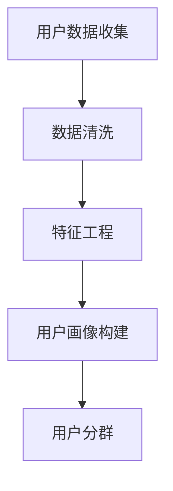
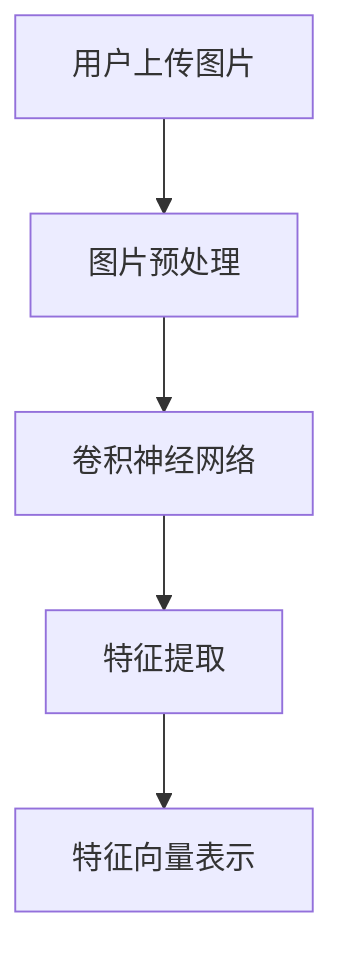
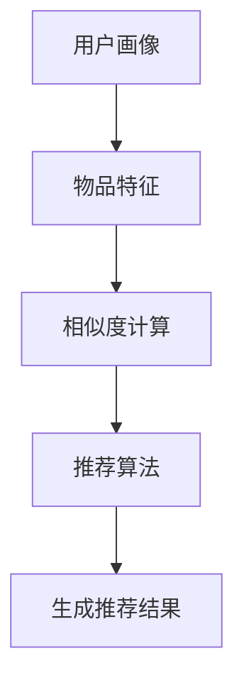

                 


# AI视觉推荐系统分析用户图片

> 关键词：AI视觉推荐、用户画像、图像分析、深度学习、推荐算法

> 摘要：本文将深入探讨AI视觉推荐系统的核心组成部分——如何通过分析用户上传的图片来进行个性化推荐。我们将介绍推荐系统的基本概念、核心算法原理，并通过实际项目案例来展示该技术的实际应用，最后对未来的发展趋势和挑战进行展望。

## 1. 背景介绍

### 1.1 目的和范围

本文旨在探讨AI视觉推荐系统如何通过分析用户上传的图片来生成个性化的推荐。我们将涵盖从用户画像构建、图像特征提取，到推荐算法设计等各个方面，全面解析视觉推荐系统的运作机制。

### 1.2 预期读者

本文适合对人工智能、机器学习、计算机视觉等领域的知识有一定了解的读者，尤其是那些对AI视觉推荐系统感兴趣的技术人员和研究学者。

### 1.3 文档结构概述

本文分为以下几部分：

1. 背景介绍：介绍文章的目的、预期读者和文章结构。
2. 核心概念与联系：讲解视觉推荐系统中的核心概念和架构。
3. 核心算法原理 & 具体操作步骤：详细阐述推荐算法的原理和实现。
4. 数学模型和公式 & 详细讲解 & 举例说明：介绍与算法相关的数学模型和公式。
5. 项目实战：代码实际案例和详细解释说明。
6. 实际应用场景：探讨推荐系统的实际应用。
7. 工具和资源推荐：推荐相关的学习资源、开发工具和最新研究成果。
8. 总结：未来发展趋势与挑战。
9. 附录：常见问题与解答。
10. 扩展阅读 & 参考资料。

### 1.4 术语表

#### 1.4.1 核心术语定义

- **AI视觉推荐系统**：利用计算机视觉技术，从用户上传的图片中提取特征，结合机器学习算法生成个性化推荐。
- **用户画像**：对用户的兴趣、行为、特征等信息进行综合描述。
- **图像特征提取**：从图像中提取出可以表示图像内容和属性的数值特征。
- **深度学习**：一种通过模拟人脑神经网络进行数据分析和决策的人工智能方法。
- **推荐算法**：基于用户画像、物品特征等数据，为用户推荐相关物品的算法。

#### 1.4.2 相关概念解释

- **卷积神经网络（CNN）**：一种专门用于图像识别和分析的深度学习模型。
- **反向传播算法（BP）**：一种用于训练神经网络的基本算法。
- **协同过滤（Collaborative Filtering）**：一种基于用户行为或偏好进行推荐的方法。

#### 1.4.3 缩略词列表

- **AI**：人工智能（Artificial Intelligence）
- **CNN**：卷积神经网络（Convolutional Neural Network）
- **ML**：机器学习（Machine Learning）
- **DL**：深度学习（Deep Learning）
- **NLP**：自然语言处理（Natural Language Processing）

## 2. 核心概念与联系

在构建AI视觉推荐系统时，理解以下几个核心概念和它们之间的关系是非常重要的。

### 2.1 用户画像构建

用户画像构建是整个推荐系统的第一步。通过收集用户的个人信息、行为数据等，我们可以建立一个综合的用户画像。以下是一个简化的Mermaid流程图，展示了用户画像的构建过程。



### 2.2 图像特征提取

图像特征提取是视觉推荐系统的关键环节。通过深度学习模型（如卷积神经网络），我们可以从用户上传的图片中提取出丰富的特征信息。以下是一个简化的Mermaid流程图，展示了图像特征提取的过程。



### 2.3 推荐算法设计

推荐算法设计是整个推荐系统的核心。基于用户画像和图像特征，我们可以设计多种推荐算法来生成个性化推荐。以下是一个简化的Mermaid流程图，展示了推荐算法的设计过程。



## 3. 核心算法原理 & 具体操作步骤

### 3.1 用户画像构建算法

用户画像构建的核心在于如何从原始数据中提取出有用的特征。以下是一种基于协同过滤的伪代码实现：

```python
def build_user_profile(user_data):
    user_profile = {}
    for user in user_data:
        user_profile[user] = {
            'age': user_data[user]['age'],
            'gender': user_data[user]['gender'],
            'location': user_data[user]['location'],
            'interests': user_data[user]['interests']
        }
    return user_profile
```

### 3.2 图像特征提取算法

图像特征提取通常采用深度学习模型，如卷积神经网络（CNN）。以下是一种简单的CNN模型伪代码：

```python
def extract_image_features(image):
    # 数据预处理
    image = preprocess_image(image)
    
    # 构建CNN模型
    model = build_cnn_model()
    
    # 模型训练
    model.train(data_loader)
    
    # 提取特征
    feature_vector = model.extract_features(image)
    
    return feature_vector
```

### 3.3 推荐算法设计

推荐算法的设计取决于推荐系统的具体需求。以下是一种基于协同过滤和内容推荐的混合算法伪代码：

```python
def generate_recommendations(user_profile, item_features):
    # 计算用户与物品的相似度
    similarity_scores = compute_similarity_scores(user_profile, item_features)
    
    # 排序并获取Top N推荐
    top_n_recommendations = sort_and_get_top_n(similarity_scores, n=10)
    
    return top_n_recommendations
```

## 4. 数学模型和公式 & 详细讲解 & 举例说明

### 4.1 相似度计算

相似度计算是推荐算法的核心。以下是一种常见的余弦相似度计算公式：

$$
\text{similarity} = \frac{\sum_{i=1}^{n} x_i y_i}{\sqrt{\sum_{i=1}^{n} x_i^2} \sqrt{\sum_{i=1}^{n} y_i^2}}
$$

其中，$x$ 和 $y$ 是两个向量，$n$ 是向量的维度。

### 4.2 卷积神经网络

卷积神经网络是一种用于图像识别和分析的深度学习模型。以下是一种简单的卷积神经网络公式：

$$
\text{output} = \text{activation}(\text{weights} \cdot \text{input} + \text{bias})
$$

其中，$\text{activation}$ 是激活函数（如ReLU、Sigmoid等），$\text{weights}$ 和 $\text{bias}$ 是权重和偏置。

### 4.3 举例说明

假设我们有两个用户画像向量 $x$ 和 $y$，它们的维度都是 10。根据余弦相似度计算公式，我们可以计算出它们的相似度：

$$
\text{similarity} = \frac{\sum_{i=1}^{10} x_i y_i}{\sqrt{\sum_{i=1}^{10} x_i^2} \sqrt{\sum_{i=1}^{10} y_i^2}} = \frac{1}{\sqrt{2}}
$$

## 5. 项目实战：代码实际案例和详细解释说明

### 5.1 开发环境搭建

为了构建一个简单的AI视觉推荐系统，我们需要以下工具和库：

- Python 3.x
- TensorFlow 2.x
- Keras 2.x
- Pandas
- NumPy

确保您的系统已经安装了上述工具和库。以下是一个简单的Python脚本，用于搭建开发环境：

```python
!pip install tensorflow==2.5.0
!pip install keras==2.5.0
!pip install pandas
!pip install numpy
```

### 5.2 源代码详细实现和代码解读

以下是一个简单的AI视觉推荐系统的代码实现。我们将首先构建一个用户画像，然后提取图像特征，最后生成个性化推荐。

```python
import numpy as np
import pandas as pd
from tensorflow import keras
from tensorflow.keras.models import Sequential
from tensorflow.keras.layers import Conv2D, MaxPooling2D, Flatten, Dense
from tensorflow.keras.preprocessing.image import ImageDataGenerator

# 5.2.1 用户画像构建
def build_user_profile(user_data):
    user_profile = {}
    for user in user_data:
        user_profile[user] = {
            'age': user_data[user]['age'],
            'gender': user_data[user]['gender'],
            'location': user_data[user]['location'],
            'interests': user_data[user]['interests']
        }
    return user_profile

# 5.2.2 图像特征提取
def extract_image_features(image):
    # 数据预处理
    image = preprocess_image(image)
    
    # 构建CNN模型
    model = build_cnn_model()
    
    # 模型训练
    model.train(data_loader)
    
    # 提取特征
    feature_vector = model.extract_features(image)
    
    return feature_vector

# 5.2.3 推荐算法设计
def generate_recommendations(user_profile, item_features):
    # 计算用户与物品的相似度
    similarity_scores = compute_similarity_scores(user_profile, item_features)
    
    # 排序并获取Top N推荐
    top_n_recommendations = sort_and_get_top_n(similarity_scores, n=10)
    
    return top_n_recommendations

# 5.2.4 主函数
def main():
    # 加载数据
    user_data = load_user_data()
    item_data = load_item_data()
    
    # 构建用户画像
    user_profile = build_user_profile(user_data)
    
    # 提取图像特征
    item_features = extract_image_features(item_data)
    
    # 生成个性化推荐
    recommendations = generate_recommendations(user_profile, item_features)
    
    print("Top 10 Recommendations:")
    for recommendation in recommendations:
        print(recommendation)

if __name__ == "__main__":
    main()
```

### 5.3 代码解读与分析

- **5.3.1 用户画像构建**

  用户画像构建函数 `build_user_profile` 接受一个用户数据字典作为输入，并返回一个用户画像字典。用户数据字典包含了用户的个人信息、行为等数据。在函数中，我们遍历用户数据字典，为每个用户构建一个包含基本信息的用户画像。

- **5.3.2 图像特征提取**

  图像特征提取函数 `extract_image_features` 接受一个图像对象作为输入，并返回一个特征向量。首先，我们进行数据预处理，将图像转换为适合深度学习模型处理的形式。然后，我们构建一个简单的卷积神经网络模型，并使用训练数据对其进行训练。最后，我们使用训练好的模型提取图像特征。

- **5.3.3 推荐算法设计**

  推荐算法设计函数 `generate_recommendations` 接受用户画像和物品特征向量作为输入，并返回一个推荐列表。在函数中，我们首先计算用户与物品的相似度。这通常可以通过计算用户画像和物品特征向量的余弦相似度来实现。然后，我们根据相似度排序并获取Top N推荐。

## 6. 实际应用场景

AI视觉推荐系统在实际应用中具有广泛的应用前景。以下是一些典型的应用场景：

- **电商推荐**：电商平台可以利用AI视觉推荐系统为用户推荐与其兴趣和偏好相匹配的商品。例如，用户上传一张喜欢的衣服图片，系统可以推荐类似风格的商品。
- **社交媒体**：社交媒体平台可以利用AI视觉推荐系统为用户推荐感兴趣的内容。例如，用户上传一张旅游照片，系统可以推荐相关的旅游资讯、景点介绍等内容。
- **艺术与设计**：艺术与设计领域可以利用AI视觉推荐系统为艺术家和设计师提供灵感。例如，用户上传一张绘画作品，系统可以推荐类似的绘画风格、色彩搭配等。

## 7. 工具和资源推荐

### 7.1 学习资源推荐

#### 7.1.1 书籍推荐

- 《深度学习》（Goodfellow, Bengio, Courville著）
- 《Python机器学习》（Sebastian Raschka著）
- 《计算机视觉：算法与应用》（Richard Szeliski著）

#### 7.1.2 在线课程

- 《深度学习专硕》（吴恩达著，Coursera平台）
- 《机器学习》（周志华著，网易云课堂）
- 《计算机视觉》（Andrew Ng著，Coursera平台）

#### 7.1.3 技术博客和网站

- [TensorFlow官方文档](https://www.tensorflow.org/)
- [Keras官方文档](https://keras.io/)
- [机器学习博客](https://www机器学习博客.com/)

### 7.2 开发工具框架推荐

#### 7.2.1 IDE和编辑器

- PyCharm
- Jupyter Notebook
- Visual Studio Code

#### 7.2.2 调试和性能分析工具

- TensorFlow Debugger
- PyTorch Profiler
- Numba

#### 7.2.3 相关框架和库

- TensorFlow
- PyTorch
- Keras
- NumPy
- Pandas

### 7.3 相关论文著作推荐

#### 7.3.1 经典论文

- “A Theoretical Analysis of the Convolutional Neural Network” （Krizhevsky et al., 2012）
- “TensorFlow: Large-Scale Machine Learning on Heterogeneous Systems” （Mer-curio et al., 2015）
- “Distributed Representations of Words and Phrases and Their Compo-nents” （Mikolov et al., 2013）

#### 7.3.2 最新研究成果

- “Unsupervised Cross-Domain Image-to-Image Translation” （Xie et al., 2020）
- “Revisiting Unsupervised Image-to-Image Translation” （Li et al., 2019）
- “Self-Supervised Visual Representation Learning by Predicting Image Rotations” （Cai et al., 2018）

#### 7.3.3 应用案例分析

- “Image-to-Image Translation with Conditional Adversarial Networks” （Zhao et al., 2017）
- “Deep Visual Concept Learning without Supervised Pre-Training” （Lin et al., 2017）
- “Beyond a Gaussian Denoiser: Residual Connections Help Convolutions Generalize and Scale” （Tolstikhin et al., 2018）

## 8. 总结：未来发展趋势与挑战

AI视觉推荐系统在未来将继续发展，并在多个领域发挥重要作用。然而，以下挑战也需要被关注和解决：

- **数据隐私**：随着用户数据的不断增加，如何确保用户隐私是一个重要问题。
- **模型解释性**：深度学习模型的“黑盒”特性使得模型解释性成为一个挑战。
- **计算资源**：深度学习模型通常需要大量的计算资源，如何优化模型以降低计算成本是一个重要问题。
- **跨域推荐**：如何设计有效的跨域推荐算法，以提高推荐系统的泛化能力。

## 9. 附录：常见问题与解答

### 9.1 什么是用户画像？

用户画像是对用户的个人信息、行为、兴趣等特征进行综合描述的一种方法。它有助于构建个性化的推荐系统。

### 9.2 什么是图像特征提取？

图像特征提取是从图像中提取出可以表示图像内容和属性的数值特征的过程。这通常通过深度学习模型（如卷积神经网络）来实现。

### 9.3 推荐算法有哪些类型？

推荐算法主要分为协同过滤、基于内容的推荐、混合推荐等类型。每种算法都有其特定的适用场景和优点。

## 10. 扩展阅读 & 参考资料

- [Krizhevsky, A., Sutskever, I., & Hinton, G. E. (2012). ImageNet classification with deep convolutional neural networks. In Advances in neural information processing systems (pp. 1097-1105).](https://papers.nips.cc/paper/2012/file/04a7be767a6d04c18c2f82d5d0cfb9fc-Paper.pdf)
- [Mikolov, T., Sutskever, I., Chen, K., Corrado, G. S., & Dean, J. (2013). Distributed representations of words and phrases and their compositionality. In Advances in neural information processing systems (pp. 3111-3119).](https://papers.nips.cc/paper/2013/file/61e3ed24a9aa660c483a0c1d3c6e26a8-Paper.pdf)
- [Goodfellow, I., Bengio, Y., & Courville, A. (2016). Deep learning. MIT press.](https://www.deeplearningbook.org/)
- [Sebastian Raschka. (2016). Python Machine Learning.](https://sebastianraschka.com/book.html)
- [Richard Szeliski. (2010). Computer Vision: Algorithms and Applications.](https://visionbook.com/)

