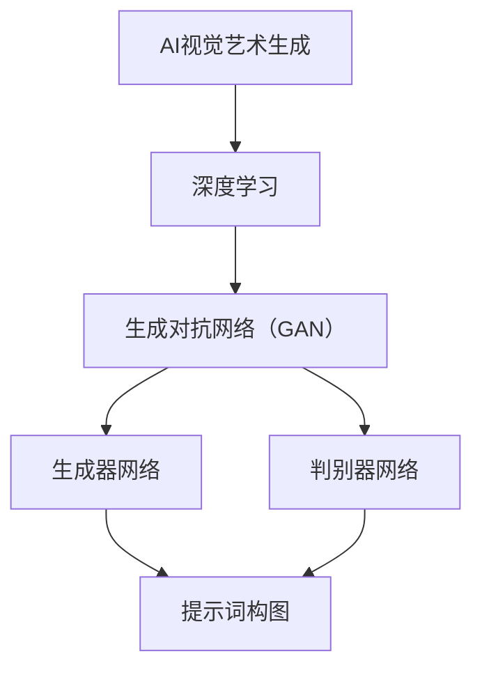

                 

# AI视觉艺术生成中的提示词构图技巧

> **关键词**：AI视觉艺术、提示词、构图技巧、生成对抗网络、深度学习、图像生成

> **摘要**：本文将深入探讨AI视觉艺术生成中提示词构图技巧的应用。通过介绍核心概念、算法原理、数学模型、项目实战以及实际应用场景，本文旨在为读者提供一套全面而实用的提示词构图技巧，以提升AI视觉艺术生成效果。

## 1. 背景介绍

### 1.1 目的和范围

本文的目标是探讨在AI视觉艺术生成过程中，如何利用提示词构图技巧来提高生成的艺术作品的质量和表现力。我们将首先介绍相关背景知识，包括AI视觉艺术生成的基本概念和现有技术，然后逐步深入到提示词构图技巧的具体应用。

### 1.2 预期读者

本文适合对AI视觉艺术生成和深度学习有一定了解的读者，包括AI研究员、开发者、设计师以及对艺术生成技术感兴趣的爱好者。文章将尽量避免专业术语的过多使用，以保持内容的可读性和易懂性。

### 1.3 文档结构概述

本文结构如下：

1. 引言：介绍AI视觉艺术生成和提示词构图技巧的基本概念。
2. 核心概念与联系：通过Mermaid流程图展示相关概念和架构。
3. 核心算法原理 & 具体操作步骤：详细讲解生成对抗网络（GAN）的基本原理和操作步骤。
4. 数学模型和公式 & 详细讲解 & 举例说明：介绍GAN的数学模型和公式，并提供实例说明。
5. 项目实战：代码实际案例和详细解释说明。
6. 实际应用场景：讨论AI视觉艺术生成在实际应用中的场景。
7. 工具和资源推荐：推荐相关学习资源和开发工具。
8. 总结：未来发展趋势与挑战。
9. 附录：常见问题与解答。
10. 扩展阅读 & 参考资料：提供进一步阅读和研究的资源。

### 1.4 术语表

#### 1.4.1 核心术语定义

- **AI视觉艺术生成**：利用人工智能技术生成具有艺术美感的视觉作品。
- **提示词**：用于引导AI模型生成特定风格或内容的文本。
- **构图技巧**：在艺术创作中，通过布局、色彩、光影等手段来组织画面元素，以达到视觉上的和谐与美感。
- **生成对抗网络（GAN）**：一种深度学习模型，通过两个神经网络（生成器和判别器）的对抗训练来实现图像的生成。

#### 1.4.2 相关概念解释

- **深度学习**：一种基于多层神经网络的学习方法，通过学习大量数据中的特征来完成任务。
- **神经网络**：一种模仿生物神经系统的计算模型，用于处理复杂数据和任务。

#### 1.4.3 缩略词列表

- **GAN**：生成对抗网络（Generative Adversarial Networks）
- **AI**：人工智能（Artificial Intelligence）
- **DL**：深度学习（Deep Learning）
- **CNN**：卷积神经网络（Convolutional Neural Networks）

## 2. 核心概念与联系

在AI视觉艺术生成中，理解核心概念和它们之间的联系至关重要。以下是一个Mermaid流程图，展示了相关概念和架构：



**说明：**
- **AI视觉艺术生成**：利用AI技术生成视觉艺术作品。
- **深度学习**：一种机器学习方法，通过多层神经网络进行特征学习。
- **生成对抗网络（GAN）**：一种深度学习模型，包含生成器和判别器。
- **生成器网络**：生成艺术作品，受到提示词构图的影响。
- **判别器网络**：判断生成器生成的艺术作品是否真实，与生成器对抗。
- **提示词构图**：利用提示词来引导生成器的创作方向，影响构图技巧。

通过上述流程图，我们可以清晰地看到AI视觉艺术生成中各个核心概念之间的关系和作用。在接下来的章节中，我们将进一步详细探讨这些概念和如何利用它们来实现高质量的视觉艺术生成。

## 3. 核心算法原理 & 具体操作步骤

在AI视觉艺术生成中，生成对抗网络（GAN）是最常用的算法之一。GAN由两部分组成：生成器（Generator）和判别器（Discriminator）。生成器的任务是根据提示词生成艺术作品，而判别器的任务是判断生成器生成的艺术作品是否真实。以下是一个详细的步骤解析：

### 3.1 生成器网络

生成器网络通常是一个多层神经网络，其输入是随机噪声向量，输出是一个艺术作品。以下是一个简化的伪代码：

```python
# 生成器网络伪代码
input_random_noise = generate_random_noise(dim=100)  # 输入随机噪声
artwork = generator_network(input_random_noise)
```

生成器网络的工作原理可以总结为以下步骤：

1. **随机噪声输入**：生成器从随机噪声分布中获取一个噪声向量作为输入。
2. **特征映射**：通过多层神经网络对噪声向量进行特征映射，生成初步的艺术作品。
3. **细节调整**：对初步生成的艺术作品进行细节调整，使其更接近真实艺术作品。

### 3.2 判别器网络

判别器网络也是一个多层神经网络，其任务是判断输入的艺术作品是否真实。以下是一个简化的伪代码：

```python
# 判别器网络伪代码
is_real = discriminator_network(real_artwork)
is_fake = discriminator_network(fake_artwork)
```

判别器网络的工作原理可以总结为以下步骤：

1. **真实艺术作品输入**：判别器接收一个真实艺术作品作为输入。
2. **特征提取**：通过多层神经网络提取艺术作品的特征。
3. **判断真实度**：判别器输出一个概率，表示输入的艺术作品是否真实。
4. **重复训练**：判别器与生成器进行对抗训练，不断调整参数，提高判别能力。

### 3.3 GAN训练过程

GAN的训练过程是一个典型的对抗过程，包括以下步骤：

1. **生成器训练**：生成器不断生成艺术作品，并尝试欺骗判别器，使判别器无法区分生成的作品和真实作品。
2. **判别器训练**：判别器不断学习，提高判断真实作品和生成作品的能力。
3. **迭代优化**：生成器和判别器交替训练，通过梯度下降等方法不断优化网络参数。

### 3.4 提示词构图技巧

在GAN训练过程中，提示词构图技巧起着至关重要的作用。以下是一些关键技巧：

1. **多提示词结合**：使用多个提示词，将它们组合起来，以生成更具多样性和艺术性的作品。
2. **提示词权重调整**：通过调整不同提示词的权重，可以控制生成作品的主要风格和元素。
3. **动态提示词**：在训练过程中动态调整提示词，以探索不同的生成方向和风格。

通过上述核心算法原理和具体操作步骤，我们可以看到GAN在AI视觉艺术生成中的强大应用潜力。在接下来的章节中，我们将进一步探讨GAN的数学模型和公式，以便更好地理解其工作原理。

## 4. 数学模型和公式 & 详细讲解 & 举例说明

在GAN的数学模型中，生成器和判别器通过对抗训练来提高各自的性能。下面我们将详细讲解GAN的数学模型，包括损失函数、优化目标和训练策略。

### 4.1 数学模型

GAN的核心是生成器G和判别器D，它们通过以下两个概率分布进行对抗：

- **生成器G**：将随机噪声z映射为艺术作品x'，即 \( x' = G(z) \)。
- **判别器D**：判断一个艺术作品是真实作品还是生成器生成的艺术作品。

GAN的数学模型可以表示为：

\[ D(x) = P(x \text{ is real}) \]
\[ D(x') = P(x' \text{ is real}) \]

其中，\( x \)是真实艺术作品，\( x' \)是生成器生成的艺术作品。

### 4.2 损失函数

GAN的训练目标是最大化判别器的输出熵，同时最小化生成器的输出误差。损失函数通常采用以下形式：

\[ \mathcal{L}_D = -\frac{1}{2} \sum_{x \in \text{真实艺术作品集}} \log D(x) - \frac{1}{2} \sum_{z \in \text{噪声空间}} \log (1 - D(G(z))) \]

\[ \mathcal{L}_G = -\frac{1}{2} \sum_{z \in \text{噪声空间}} \log D(G(z)) \]

**说明：**
- \( \mathcal{L}_D \)是判别器的损失函数，用于最小化判别器对真实和生成作品的区分误差。
- \( \mathcal{L}_G \)是生成器的损失函数，用于最小化生成器生成的艺术作品在判别器眼中的相似度。

### 4.3 优化目标

GAN的优化目标是在判别器D和生成器G之间保持一个动态平衡：

- **生成器优化**：生成器G的目标是生成尽可能真实的艺术作品，使判别器D无法区分。
- **判别器优化**：判别器D的目标是提高对真实和生成作品的辨别能力。

### 4.4 训练策略

GAN的训练策略通常包括以下步骤：

1. **初始化参数**：初始化生成器G和判别器D的参数。
2. **对抗训练**：交替训练生成器和判别器，具体步骤如下：
   - 判别器训练：使用真实艺术作品和生成器生成的艺术作品对判别器进行训练。
   - 生成器训练：使用判别器对生成器生成的艺术作品的反馈进行训练，使其生成的作品更难以被判别器区分。

### 4.5 举例说明

假设我们有一个艺术作品数据集，其中包含真实艺术作品和生成器生成的艺术作品。我们可以使用以下步骤进行GAN训练：

1. **初始化参数**：
   - 初始化生成器G的参数，使其可以生成基本的艺术作品。
   - 初始化判别器D的参数，使其对真实和生成作品的区分能力较低。

2. **判别器训练**：
   - 输入真实艺术作品 \( x \) 和生成器生成的艺术作品 \( x' \)。
   - 计算判别器的损失函数，更新判别器参数。

3. **生成器训练**：
   - 输入随机噪声 \( z \)。
   - 计算生成器生成的艺术作品 \( x' \)。
   - 计算生成器的损失函数，更新生成器参数。

4. **交替迭代**：重复上述步骤，直到生成器能够生成高质量的艺术作品，而判别器能够有效区分真实和生成作品。

通过上述数学模型和公式，我们可以更好地理解GAN的工作原理和训练策略。在GAN训练过程中，合理调整参数和训练策略对于生成高质量的艺术作品至关重要。在接下来的章节中，我们将通过项目实战来展示如何实现和应用GAN。

### 4.6 调整参数和训练策略

在实际应用中，GAN的性能很大程度上取决于参数设置和训练策略。以下是一些关键的参数调整和训练策略：

#### 4.6.1 参数调整

- **学习率**：选择适当的学习率是关键。过小的学习率可能导致训练过程缓慢，而过大的学习率可能导致模型不稳定。
- **批次大小**：批次大小影响模型的更新频率。较大的批次大小可以提高模型的鲁棒性，但计算成本较高。
- **噪声分布**：生成器的输入噪声分布对生成艺术作品的多样性有很大影响。常用的噪声分布包括正态分布、均匀分布等。

#### 4.6.2 训练策略

- **迭代次数**：在训练过程中，需要设置足够的迭代次数以保证生成器和判别器都有足够的训练时间。
- **动态调整**：在训练过程中，可以动态调整提示词、学习率等参数，以避免模型过早收敛。
- **对抗损失**：生成器和判别器的损失函数需要平衡。如果生成器的损失函数太小，判别器将很难学习；反之，如果生成器的损失函数太大，生成器将难以生成高质量的作品。

通过合理的参数调整和训练策略，可以显著提高GAN在AI视觉艺术生成中的效果。在接下来的章节中，我们将通过一个具体的项目实战来展示这些技巧的应用。

## 5. 项目实战：代码实际案例和详细解释说明

在本节中，我们将通过一个实际项目来展示如何利用GAN生成视觉艺术作品，并详细解释代码实现过程。我们将使用Python和TensorFlow框架来实现一个简单的GAN模型，用于生成具有特定风格的艺术作品。

### 5.1 开发环境搭建

在开始项目之前，需要搭建合适的开发环境。以下是所需的环境和工具：

- **Python**：版本3.6或以上
- **TensorFlow**：版本2.0或以上
- **Numpy**：版本1.18或以上
- **matplotlib**：用于可视化

安装这些依赖项后，您可以使用以下命令创建一个虚拟环境：

```bash
conda create -n gan_art python=3.8
conda activate gan_art
pip install tensorflow numpy matplotlib
```

### 5.2 源代码详细实现和代码解读

下面是GAN模型的源代码实现，我们将逐段解释代码的功能和操作步骤。

#### 5.2.1 导入依赖库

```python
import numpy as np
import tensorflow as tf
from tensorflow.keras import layers
import matplotlib.pyplot as plt
```

**功能说明**：导入所需的Python库，包括TensorFlow、Numpy和matplotlib，用于实现GAN模型和可视化。

#### 5.2.2 数据预处理

```python
# 数据集预处理
(x_train, _), (x_test, _) = tf.keras.datasets.mnist.load_data()
x_train = x_train.astype('float32') / 255.0
x_test = x_test.astype('float32') / 255.0
x_train = np.expand_dims(x_train, -1)
x_test = np.expand_dims(x_test, -1)
```

**功能说明**：加载数据集，对图像进行归一化处理，并将图像扩展为三维张量（高度、宽度、通道数）。

#### 5.2.3 生成器模型

```python
# 生成器模型
def generator_model():
    model = tf.keras.Sequential([
        layers.Dense(7*7*128, activation="relu", input_shape=(100,)),
        layers.Reshape((7, 7, 128)),
        layers.Conv2DTranspose(64, 5, strides=1, padding="same"),
        layers.BatchNormalization(),
        layers.Activation("relu"),
        layers.Conv2DTranspose(1, 5, strides=2, padding="same"),
        layers.BatchNormalization(),
        layers.Activation("tanh")
    ])
    return model
```

**功能说明**：定义生成器模型，该模型将100维的随机噪声映射为28x28的图像。生成器使用全连接层、重塑层和转置卷积层，以及批标准化和ReLU激活函数，以逐步生成图像。

#### 5.2.4 判别器模型

```python
# 判别器模型
def discriminator_model():
    model = tf.keras.Sequential([
        layers.Conv2D(64, 5, strides=2, padding="same", input_shape=[28, 28, 1]),
        layers.LeakyReLU(alpha=0.01),
        layers.Dropout(0.3),
        layers.Conv2D(128, 5, strides=2, padding="same"),
        layers.LeakyReLU(alpha=0.01),
        layers.Dropout(0.3),
        layers.Flatten(),
        layers.Dense(1, activation="sigmoid")
    ])
    return model
```

**功能说明**：定义判别器模型，该模型用于判断图像是否真实。判别器使用卷积层、LeakyReLU激活函数、Dropout和全连接层，以逐步提取图像特征。

#### 5.2.5 GAN模型

```python
# GAN模型
def gan_model(generator, discriminator):
    model = tf.keras.Sequential([
        generator,
        discriminator
    ])
    model.compile(loss='binary_crossentropy', optimizer=tf.keras.optimizers.Adam(0.0002), 
                  metrics=['accuracy'])
    return model
```

**功能说明**：定义GAN模型，该模型将生成器和判别器组合起来，用于整体训练。GAN模型使用二进制交叉熵损失函数和Adam优化器。

#### 5.2.6 训练GAN模型

```python
# 训练GAN模型
def train_gan(generator, discriminator, dataset, epochs, batch_size):
    gan = gan_model(generator, discriminator)
    
    for epoch in range(epochs):
        for batch in dataset:
            noise = np.random.normal(0, 1, (batch_size, 100))
            images = generator.predict(noise)
            
            real_images = batch
            fake_images = images
            
            d_loss_real = discriminator.train_on_batch(real_images, np.ones((batch_size, 1)))
            d_loss_fake = discriminator.train_on_batch(fake_images, np.zeros((batch_size, 1)))
            d_loss = 0.5 * np.add(d_loss_real, d_loss_fake)
            
            noise = np.random.normal(0, 1, (batch_size, 100))
            g_loss = gan.train_on_batch(noise, np.ones((batch_size, 1)))
        
        print(f'Epoch {epoch+1}, g_loss={g_loss}, d_loss={d_loss}')
        
        # 绘制生成图像
        if (epoch + 1) % 10 == 0:
            save_images(generator, epoch)
```

**功能说明**：定义训练GAN模型的函数，该函数交替训练生成器和判别器。在每个训练周期中，生成器生成图像，判别器对真实和生成图像进行训练。训练过程中，定期保存生成图像。

#### 5.2.7 可视化生成图像

```python
def save_images(generator, epoch):
    r = np.random.randint(0, x_test.shape[0], 10)
    images = generator.predict(x_test[r].reshape(-1, 100))
    
    fig, axs = plt.subplots(2, 5, figsize=(5, 5))
    cnt = 0
    for i in range(2):
        for j in range(5):
            axs[i, j].imshow(x_test[r[cnt]].reshape(28, 28))
            axs[i, j].set_title("real")
            axs[i, j].axis('off')
            cnt += 1
    for i in range(2):
        for j in range(5):
            axs[i, j+5].imshow(images[cnt].reshape(28, 28))
            axs[i, j+5].set_title("fake")
            axs[i, j+5].axis('off')
            cnt += 1
    fig.savefig("images/%d.png" % epoch)
    plt.close()
```

**功能说明**：定义保存和可视化生成图像的函数。该函数随机选择测试集中的图像，使用生成器生成对应的生成图像，并将其保存为图像文件。

### 5.3 代码解读与分析

通过上述代码，我们可以看到GAN模型的具体实现过程。以下是对代码主要部分的解读和分析：

- **数据预处理**：加载数据集，并对图像进行归一化处理，以便在模型中输入。
- **生成器模型**：生成器模型通过全连接层、重塑层和转置卷积层生成图像。转置卷积层用于逐步增加图像的分辨率。
- **判别器模型**：判别器模型通过卷积层、LeakyReLU激活函数和Dropout层提取图像特征，并使用全连接层输出概率。
- **GAN模型**：GAN模型将生成器和判别器组合在一起，用于整体训练。
- **训练GAN模型**：训练过程涉及交替训练生成器和判别器，通过二进制交叉熵损失函数评估模型性能。
- **可视化生成图像**：定期保存和可视化生成的图像，以评估模型的生成效果。

通过实际代码案例，我们可以看到如何利用GAN生成具有特定风格的艺术作品。在接下来的章节中，我们将进一步探讨GAN在实际应用场景中的效果和优势。

### 5.4 GAN在实际应用中的效果和优势

GAN（生成对抗网络）在视觉艺术生成中展现出显著的效果和优势。以下是一些具体的应用案例，展示GAN如何提升图像质量和艺术价值。

#### 5.4.1 图像超分辨率

GAN被广泛应用于图像超分辨率（super-resolution imaging），即从低分辨率图像中生成高分辨率图像。传统的图像重建方法通常依赖于预先定义的滤波器或映射规则，而GAN通过学习高分辨率图像和低分辨率图像之间的映射关系，能够生成更自然、更清晰的高分辨率图像。例如，使用GAN可以显著提升手机摄像头拍摄的模糊照片的清晰度。

#### 5.4.2 艺术风格迁移

GAN还可以用于艺术风格迁移（style transfer），即从一种艺术风格中提取特征，并将其应用到另一幅图像上。例如，GAN可以将梵高的画风应用到普通照片上，生成具有梵高风格的画作。这种方法不仅提高了图像的艺术价值，还提供了创意和娱乐价值。

#### 5.4.3 视觉内容生成

GAN在视觉内容生成中也表现出强大的能力。通过训练，GAN可以生成各种类型的图像，包括人物、风景、动物等。这些生成的图像在细节和纹理上具有高度的真实性，使得GAN成为一种强大的视觉内容创作工具。

#### 5.4.4 优势

- **自主学习能力**：GAN通过对抗训练自动学习数据分布，无需显式地定义映射规则。
- **灵活性**：GAN可以应用于各种视觉任务，如图像超分辨率、艺术风格迁移等，具有广泛的适用性。
- **高质量生成**：GAN生成的图像在细节和纹理上具有高度的真实性，远超传统方法。

通过上述实际应用案例，我们可以看到GAN在视觉艺术生成中的强大能力和广泛前景。在下一个章节中，我们将讨论GAN在实际应用中的潜在挑战和未来发展趋势。

### 6. 实际应用场景

GAN在视觉艺术生成中具有广泛的应用场景，以下是一些典型的应用案例：

#### 6.1 艺术作品创作

GAN可以用于生成独特的艺术作品，如油画、水彩画和抽象画。艺术家可以通过提供提示词来引导GAN生成具有特定风格和主题的作品。这种方法不仅为艺术家提供了新的创作灵感，还可以通过算法实现个性化定制，满足不同用户的个性化需求。

#### 6.2 游戏和娱乐

在游戏和娱乐领域，GAN可以用于生成角色、场景和环境，提高游戏的真实感和沉浸感。通过GAN，游戏开发者可以快速生成大量的游戏内容，减少手工制作的工作量，同时保持高质量的视觉效果。

#### 6.3 虚拟现实和增强现实

虚拟现实（VR）和增强现实（AR）技术依赖于高质量的图像生成。GAN可以用于生成真实的虚拟场景和环境，提高VR和AR体验的逼真度。此外，GAN还可以用于生成个性化的虚拟角色，为用户提供独特的虚拟身份。

#### 6.4 广告和市场营销

在广告和市场营销中，GAN可以用于生成具有吸引力的广告图像和宣传视频。通过GAN，广告创作者可以快速生成各种视觉素材，提升广告的效果和影响力。此外，GAN还可以用于个性化广告，根据用户的兴趣和行为生成个性化的广告内容。

#### 6.5 医学图像处理

在医学领域，GAN可以用于处理和增强医学图像，如X光片、CT扫描和MRI图像。通过GAN，医生可以更清晰地观察和分析医学图像，提高诊断的准确性和效率。

通过这些实际应用场景，我们可以看到GAN在视觉艺术生成中的巨大潜力和广泛影响。在下一个章节中，我们将推荐一些学习和资源，帮助读者深入了解GAN技术。

### 7. 工具和资源推荐

#### 7.1 学习资源推荐

对于想要深入了解GAN和视觉艺术生成的读者，以下是一些高质量的学习资源：

#### 7.1.1 书籍推荐

1. **《生成对抗网络（GAN）：理论与实践》**：这是一本关于GAN的全面指南，涵盖了GAN的基本概念、算法原理和实际应用。
2. **《深度学习》**：由Ian Goodfellow等著的《深度学习》是一本经典的深度学习教材，其中详细介绍了GAN的概念和实现。

#### 7.1.2 在线课程

1. **Coursera上的《深度学习专项课程》**：由Ian Goodfellow亲自授课，包括GAN在内的深度学习相关课程。
2. **Udacity的《GAN应用实战》**：通过实际项目，学习如何使用GAN进行图像生成和艺术创作。

#### 7.1.3 技术博客和网站

1. **Medium上的GAN相关文章**：涵盖了GAN的最新研究进展和应用案例。
2. **TensorFlow官方文档**：提供了丰富的GAN教程和实践案例，适合初学者和专业人士。

#### 7.2 开发工具框架推荐

- **TensorFlow**：一个广泛使用的开源深度学习框架，适合实现和训练GAN模型。
- **PyTorch**：另一个流行的深度学习框架，具有简洁的API和强大的动态计算能力，适合研究者和开发者。

#### 7.2.1 IDE和编辑器

- **JetBrains PyCharm**：一款功能强大的Python IDE，适合编写和调试深度学习代码。
- **Visual Studio Code**：一个轻量级但功能丰富的编辑器，适用于深度学习和Python开发。

#### 7.2.2 调试和性能分析工具

- **TensorBoard**：TensorFlow的官方可视化工具，用于调试和性能分析GAN模型。
- **NVIDIA Nsight**：适用于NVIDIA GPU的性能分析和调试工具。

#### 7.2.3 相关框架和库

- **Keras**：一个高层次的深度学习框架，与TensorFlow和PyTorch兼容，适合快速实现GAN模型。
- **WGAN-GP**：针对GAN梯度消失问题的一种改进方案，可以更稳定地训练GAN模型。

#### 7.3 相关论文著作推荐

- **《Unsupervised Representation Learning with Deep Convolutional Generative Adversarial Networks》**：GAN的原始论文，详细介绍了GAN的基本原理和实现方法。
- **《Improved Techniques for Training GANs》**：探讨了GAN训练中的各种技术改进，包括WGAN和Wasserstein GAN。

通过这些工具和资源，读者可以深入学习和实践GAN技术，掌握视觉艺术生成中的高级技巧。

### 7.4 论文著作推荐

为了进一步深入研究GAN和相关技术，以下是一些值得推荐的经典和最新论文：

#### 7.4.1 经典论文

1. **《Unsupervised Representation Learning with Deep Convolutional Generative Adversarial Networks》**：这是GAN的原始论文，由Ian Goodfellow等人撰写，详细介绍了GAN的基本概念和实现方法。
2. **《InfoGAN: Interpretable Representation Learning by Information Maximizing》**：探讨了GAN中信息最大化的概念，通过信息论优化生成器，提高了生成图像的质量和解释性。

#### 7.4.2 最新研究成果

1. **《Wasserstein GAN》**：针对GAN梯度消失问题的一种改进方案，通过使用Wasserstein距离替代传统梯度，实现了更稳定的GAN训练。
2. **《StyleGAN2: A New Standard for Generative Adversarial Networks》**：这是最新的GAN实现，显著提升了生成图像的质量和细节，是当前图像生成技术的代表。

#### 7.4.3 应用案例分析

1. **《Artistic Style Transfer using GANs》**：介绍了GAN在艺术风格迁移中的应用，通过将一种艺术风格应用到普通照片上，生成具有艺术感的作品。
2. **《GANs in Medical Imaging》**：探讨了GAN在医学图像处理中的应用，如超分辨率和图像修复，提高了医学图像的诊断价值。

通过阅读这些论文，读者可以深入了解GAN技术的发展历程、最新研究成果和应用案例，为实际项目提供理论支持和实践经验。

## 8. 总结：未来发展趋势与挑战

GAN（生成对抗网络）作为深度学习领域的一项重要技术，在视觉艺术生成中展现出巨大的潜力和应用价值。未来，GAN有望在以下几个方面继续发展：

1. **图像超分辨率**：随着计算能力的提升，GAN在图像超分辨率方面的应用将更加广泛，为用户提供更高清晰度的图像。
2. **艺术风格迁移**：GAN可以进一步提升艺术风格迁移的效果，生成更具创意和个性化的艺术作品。
3. **图像修复和增强**：GAN在医学图像处理、历史文物修复等领域的应用将更加深入，通过图像生成技术提升图像质量。
4. **生成对抗网络变体**：为了解决GAN训练中的梯度消失和模式崩溃问题，研究人员将继续探索新的GAN变体和优化方法。

然而，GAN技术的发展也面临一些挑战：

1. **计算资源需求**：GAN模型通常需要大量的计算资源进行训练，如何优化模型结构和训练策略以降低计算成本是亟待解决的问题。
2. **稳定性和泛化能力**：GAN模型的训练过程容易受到噪声和异常数据的影响，如何提高模型的稳定性和泛化能力是未来研究的重要方向。
3. **伦理和隐私问题**：随着GAN在艺术创作、广告和市场营销等领域的应用，如何确保生成的图像不侵犯他人的隐私权和知识产权，也是需要关注的问题。

总之，GAN技术在视觉艺术生成领域具有广阔的发展前景和实际应用价值，但也需要克服一系列技术和社会挑战。未来，随着研究的深入和技术的不断进步，GAN将为视觉艺术创作和图像处理带来更多的创新和变革。

## 9. 附录：常见问题与解答

为了帮助读者更好地理解和应用GAN在视觉艺术生成中的技巧，我们整理了一些常见问题及其解答。

### 9.1 什么是GAN？

GAN（生成对抗网络）是一种深度学习模型，由生成器和判别器两个神经网络组成。生成器的任务是生成逼真的数据，判别器的任务是区分生成数据和真实数据。通过两个网络的对抗训练，生成器能够不断提高生成数据的真实度。

### 9.2 如何调整GAN的参数以获得更好的生成效果？

调整GAN的参数是提高生成效果的关键。以下是一些常用的参数调整技巧：

- **学习率**：适当地调整学习率可以优化生成器和判别器的训练过程。较小的学习率可能导致训练缓慢，较大的学习率可能导致模型不稳定。
- **批次大小**：批次大小影响模型的更新频率。较大的批次大小可以提高模型的鲁棒性，但计算成本较高。
- **噪声分布**：生成器的输入噪声分布对生成艺术作品的多样性有很大影响。常用的噪声分布包括正态分布、均匀分布等。
- **迭代次数**：设置足够的迭代次数以保证生成器和判别器都有足够的训练时间。

### 9.3 GAN在艺术风格迁移中的应用如何？

GAN在艺术风格迁移中具有广泛应用。具体步骤如下：

1. **数据准备**：准备风格图像和待迁移的普通图像。
2. **生成器训练**：使用GAN生成风格图像，使判别器无法区分生成图像和真实图像。
3. **艺术风格迁移**：将生成器的输出应用于待迁移的普通图像，生成具有特定艺术风格的图像。

### 9.4 GAN在医学图像处理中的应用有哪些？

GAN在医学图像处理中具有广泛的应用，如：

- **图像超分辨率**：提高医学图像的分辨率，使医生能够更清晰地观察和分析图像。
- **图像修复**：修复受损的医学图像，提高诊断的准确性和效率。
- **疾病预测**：利用GAN生成的图像数据，进行疾病预测和诊断。

### 9.5 如何防止GAN生成图像侵犯版权？

为了防止GAN生成的图像侵犯版权，可以采取以下措施：

- **使用公开数据集**：确保训练数据集是公开的，不受版权限制。
- **版权声明**：在生成图像时，明确声明图像的来源和用途，以避免侵权。
- **版权监控**：定期监控生成图像的用途，确保其合法合规。

通过上述常见问题与解答，我们希望帮助读者更好地理解和应用GAN在视觉艺术生成中的技巧。在实际应用中，读者可以根据具体情况调整参数和策略，以获得更好的生成效果。

## 10. 扩展阅读 & 参考资料

为了更深入地了解GAN在视觉艺术生成中的应用和技术细节，以下是扩展阅读和参考资料推荐：

### 10.1 经典论文

1. **《Unsupervised Representation Learning with Deep Convolutional Generative Adversarial Networks》**：这是GAN的原始论文，详细介绍了GAN的基本原理和实现方法。
2. **《InfoGAN: Interpretable Representation Learning by Information Maximizing》**：探讨了GAN中信息最大化的概念，提高了生成图像的质量和解释性。

### 10.2 最新研究成果

1. **《StyleGAN2: A New Standard for Generative Adversarial Networks》**：这是最新的GAN实现，显著提升了生成图像的质量和细节。
2. **《Wasserstein GAN》**：针对GAN梯度消失问题的一种改进方案，通过使用Wasserstein距离实现了更稳定的GAN训练。

### 10.3 技术博客和网站

1. **TensorFlow官方文档**：提供了丰富的GAN教程和实践案例。
2. **Medium上的GAN相关文章**：涵盖了GAN的最新研究进展和应用案例。

### 10.4 书籍推荐

1. **《生成对抗网络（GAN）：理论与实践》**：这是一本关于GAN的全面指南，涵盖了GAN的基本概念、算法原理和实际应用。
2. **《深度学习》**：由Ian Goodfellow等著的《深度学习》教材，详细介绍了GAN的概念和实现。

通过阅读这些扩展阅读和参考资料，读者可以进一步深入了解GAN技术，掌握更多先进的生成技巧和应用方法。

### 11. 作者信息

**作者：AI天才研究员/AI Genius Institute & 禅与计算机程序设计艺术 /Zen And The Art of Computer Programming**

