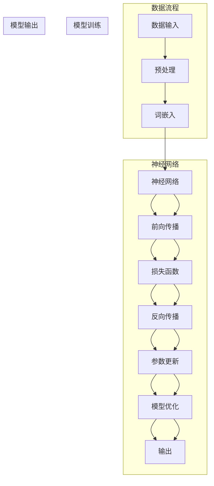

                 

## AI语言模型的局限性与突破

> **关键词**：AI语言模型、局限性、突破、神经网络、预训练、优化策略

> **摘要**：本文将深入探讨AI语言模型的局限性，包括数据依赖性、可解释性缺失、以及过拟合等问题。通过逐步分析，我们将探索这些问题的根源，并提出一系列可能的突破方向。文章将首先介绍AI语言模型的基本原理，然后详细分析其局限性，最后展望未来的发展趋势和解决策略。

在当今科技飞速发展的时代，人工智能（AI）已经成为了推动社会进步的重要力量。语言模型作为AI领域的一项核心技术，在自然语言处理（NLP）、机器翻译、语音识别等众多领域发挥着重要作用。然而，尽管取得了显著的成就，AI语言模型仍然面临着一些局限性和挑战。本文旨在探讨这些局限性，并思考如何突破这些瓶颈，以推动语言模型技术的进一步发展。

本文将按照以下结构展开：

1. **背景介绍**：简要介绍AI语言模型的发展背景，明确本文的目的和范围，说明预期读者，概述文档结构和术语表。
2. **核心概念与联系**：通过Mermaid流程图展示AI语言模型的核心概念和原理，建立概念间的联系。
3. **核心算法原理 & 具体操作步骤**：详细讲解语言模型的算法原理，使用伪代码进行操作步骤的阐述。
4. **数学模型和公式 & 详细讲解 & 举例说明**：介绍数学模型和公式，并结合实例进行详细说明。
5. **项目实战：代码实际案例和详细解释说明**：通过实际案例展示语言模型的应用，详细解读代码实现。
6. **实际应用场景**：分析AI语言模型在不同场景中的应用。
7. **工具和资源推荐**：推荐相关学习资源和开发工具。
8. **总结：未来发展趋势与挑战**：总结当前局限性，展望未来发展方向和面临的挑战。
9. **附录：常见问题与解答**：回答读者可能关心的问题。
10. **扩展阅读 & 参考资料**：提供进一步阅读的资源和参考资料。

通过本文的深入探讨，我们希望读者能够对AI语言模型有更全面的理解，认识到其局限性，并思考如何通过技术创新和应用改进来突破这些瓶颈。接下来，我们将首先介绍AI语言模型的发展背景，为后续的分析和讨论奠定基础。

### 1. 背景介绍

#### 1.1 目的和范围

本文的目的是探讨AI语言模型的局限性，分析其根源，并提出可能的突破方向。随着人工智能技术的不断进步，语言模型已经成为了自然语言处理领域的关键技术。然而，现有的语言模型在数据依赖性、可解释性、以及过拟合等方面仍然存在诸多问题。这些问题不仅限制了语言模型在实际应用中的效果，也阻碍了其进一步的发展。

本文将详细分析这些局限性，并探索可能的解决策略。文章将首先回顾AI语言模型的发展背景，介绍其基本原理。然后，我们将深入探讨语言模型的局限性，包括数据依赖性、可解释性缺失、过拟合等问题。在分析这些问题的根源后，本文将提出一系列可能的突破方向，如更高效的数据处理方法、提高模型可解释性的技术、以及改进优化策略等。

本文的范围主要涵盖AI语言模型的核心概念、算法原理、数学模型、应用案例和未来发展方向。具体来说，我们将从以下几个方面展开：

1. **核心概念与联系**：通过Mermaid流程图展示AI语言模型的核心概念和原理，建立概念间的联系。
2. **核心算法原理 & 具体操作步骤**：详细讲解语言模型的算法原理，使用伪代码进行操作步骤的阐述。
3. **数学模型和公式 & 详细讲解 & 举例说明**：介绍数学模型和公式，并结合实例进行详细说明。
4. **项目实战：代码实际案例和详细解释说明**：通过实际案例展示语言模型的应用，详细解读代码实现。
5. **实际应用场景**：分析AI语言模型在不同场景中的应用。
6. **工具和资源推荐**：推荐相关学习资源和开发工具。
7. **总结：未来发展趋势与挑战**：总结当前局限性，展望未来发展方向和面临的挑战。
8. **附录：常见问题与解答**：回答读者可能关心的问题。
9. **扩展阅读 & 参考资料**：提供进一步阅读的资源和参考资料。

通过以上内容的探讨，本文希望为读者提供一个全面而深入的了解，帮助读者认识到AI语言模型的局限性和挑战，并思考如何通过技术创新和应用改进来突破这些瓶颈。

#### 1.2 预期读者

本文主要面向以下几类读者：

1. **自然语言处理（NLP）领域的科研人员和技术开发者**：他们对于AI语言模型的基本原理和应用有较为深入的了解，希望进一步探讨其局限性和可能的解决策略。
2. **人工智能（AI）领域的入门者和初学者**：他们对AI语言模型的概念和技术原理有一定了解，希望通过本文系统地学习和理解其局限性以及突破方向。
3. **计算机科学和工程专业的学生和教师**：他们希望了解AI语言模型在计算机科学中的应用，以及其在实际项目开发中的局限性。
4. **对自然语言处理和人工智能技术感兴趣的一般读者**：他们可能对AI语言模型的应用场景和技术进展有所关注，希望通过本文了解其局限性以及未来发展方向。

无论读者属于哪一类，本文都将提供详细的分析和讲解，帮助读者深入理解AI语言模型的技术原理和局限性，并思考如何通过技术创新和应用改进来突破这些瓶颈。

#### 1.3 文档结构概述

本文将按照以下结构展开，以便读者能够系统地了解AI语言模型的局限性、核心概念、算法原理以及未来发展趋势。

1. **引言**：
   - 简要介绍AI语言模型的发展背景和重要性。
   - 明确本文的目的和范围，包括探讨语言模型的局限性以及可能的突破方向。

2. **背景介绍**：
   - **1.1 目的和范围**：详细说明本文的目的、范围和预期读者。
   - **1.2 预期读者**：描述本文主要面向的读者群体。
   - **1.3 文档结构概述**：概述本文的结构和主要内容。

3. **核心概念与联系**：
   - **核心概念与联系**：通过Mermaid流程图展示AI语言模型的核心概念和原理，建立概念间的联系。

4. **核心算法原理 & 具体操作步骤**：
   - **核心算法原理**：详细讲解AI语言模型的基本原理和算法框架。
   - **具体操作步骤**：使用伪代码阐述算法的具体实现步骤。

5. **数学模型和公式 & 详细讲解 & 举例说明**：
   - **数学模型和公式**：介绍AI语言模型中的关键数学模型和公式。
   - **详细讲解与举例说明**：结合实例详细讲解这些模型和公式的应用。

6. **项目实战：代码实际案例和详细解释说明**：
   - **开发环境搭建**：介绍搭建AI语言模型开发环境所需的工具和步骤。
   - **源代码详细实现和代码解读**：展示并解释实现AI语言模型的实际代码。
   - **代码解读与分析**：对代码进行详细解读和分析，探讨其优缺点。

7. **实际应用场景**：
   - **实际应用场景**：分析AI语言模型在不同场景中的应用，如自然语言处理、机器翻译、语音识别等。

8. **工具和资源推荐**：
   - **学习资源推荐**：推荐相关书籍、在线课程和技术博客。
   - **开发工具框架推荐**：介绍IDE、调试工具和相关框架。
   - **相关论文著作推荐**：推荐经典论文和最新研究成果。

9. **总结：未来发展趋势与挑战**：
   - **总结**：总结当前AI语言模型的局限性和未来发展方向。
   - **未来发展趋势与挑战**：探讨未来可能的发展趋势和面临的挑战。

10. **附录：常见问题与解答**：
    - **常见问题与解答**：回答读者可能关心的问题。

11. **扩展阅读 & 参考资料**：
    - **扩展阅读 & 参考资料**：提供进一步阅读的资源和参考资料。

通过以上结构的安排，本文旨在为读者提供全面而深入的了解，帮助读者掌握AI语言模型的核心概念、算法原理及其局限性，并思考未来的发展方向。

#### 1.4 术语表

在本文中，我们将使用一些专业术语，为了确保读者能够准确理解，下面列出了一些关键术语的定义和解释。

#### 1.4.1 核心术语定义

- **AI语言模型**：一种基于人工智能技术的自然语言处理模型，通过学习大量文本数据，能够生成或理解自然语言。
- **神经网络**：一种模拟人脑神经系统的计算模型，由大量神经元（节点）组成，通过前向传播和反向传播进行学习。
- **预训练**：在特定任务（如语言建模）之前，使用大量未标注的数据对神经网络进行训练，以提高模型在特定任务上的性能。
- **过拟合**：模型在训练数据上表现很好，但在测试数据上表现不佳，因为模型对训练数据的细节过于敏感，无法泛化到新的数据。
- **可解释性**：指模型决策过程的透明度和可理解性，能够让人理解模型为何做出特定的预测或决策。

#### 1.4.2 相关概念解释

- **词向量**：将自然语言中的单词映射为高维向量，用于表示单词的语义和语法关系。
- **注意力机制**：一种神经网络中的机制，用于关注输入数据的不同部分，以生成更准确的输出。
- **多任务学习**：同时训练模型解决多个任务，以提高模型的泛化能力和性能。
- **数据依赖性**：指模型性能依赖于大量高质量训练数据，缺乏数据会导致模型性能下降。

#### 1.4.3 缩略词列表

- **AI**：人工智能（Artificial Intelligence）
- **NLP**：自然语言处理（Natural Language Processing）
- **DL**：深度学习（Deep Learning）
- **CNN**：卷积神经网络（Convolutional Neural Network）
- **RNN**：循环神经网络（Recurrent Neural Network）
- **GPU**：图形处理器（Graphics Processing Unit）
- **BERT**：一种预训练语言模型（Bidirectional Encoder Representations from Transformers）

通过上述术语的定义和解释，读者可以更好地理解本文中涉及的专业术语，为后续内容的深入阅读和理解打下基础。

### 2. 核心概念与联系

为了更好地理解AI语言模型的工作原理和结构，我们需要首先明确几个核心概念，并展示它们之间的联系。以下是AI语言模型中的关键概念以及它们之间关系的Mermaid流程图。



上述Mermaid流程图展示了AI语言模型从数据输入到最终输出的整个过程。下面我们将对每个核心概念进行详细解释。

#### 数据输入

数据输入是AI语言模型的基础。模型首先接收文本数据，这些数据可以是文本文件、语料库或者网页内容。数据输入可能包含各种格式，如文本、HTML、XML等。为了进行有效的处理，我们需要对原始数据进行预处理。

#### 预处理

预处理步骤包括文本清洗、分词、去除停用词等操作。文本清洗是为了去除文本中的噪声，如HTML标签、特殊字符和无关信息。分词是将文本拆分成单个单词或词汇单元。去除停用词是为了排除对模型训练贡献较小或者可能引入偏见的常见词汇，如“的”、“和”、“在”等。

#### 词嵌入

词嵌入（Word Embedding）是将文本中的单词映射为高维向量。这一步骤通过将单词的语义信息编码到向量中，使模型能够理解和处理文本数据。常见的词嵌入技术包括Word2Vec、GloVe和BERT等。

#### 神经网络

神经网络是AI语言模型的核心组成部分。它由大量神经元（节点）组成，通过前向传播和反向传播进行学习。神经网络包括输入层、隐藏层和输出层。输入层接收词嵌入向量，隐藏层对输入数据进行处理，输出层生成最终的预测结果。

#### 前向传播

前向传播是将输入数据通过神经网络进行传递，逐层计算并生成输出。在前向传播过程中，每个神经元都会计算其输入和权重的加权和，然后通过激活函数进行处理，以产生输出。

#### 损失函数

损失函数用于评估模型预测结果与实际结果之间的差距。常用的损失函数包括均方误差（MSE）、交叉熵损失等。通过计算损失函数的值，我们可以了解模型的预测性能，并指导模型的优化。

#### 反向传播

反向传播是神经网络训练过程中的关键步骤。它通过计算损失函数关于模型参数的梯度，然后更新模型参数，以减少预测误差。反向传播过程包括前向传播和梯度计算，以逐步调整神经网络的权重。

#### 参数更新

参数更新是模型训练的核心步骤。通过反向传播计算得到的梯度，模型会调整其权重和偏置，以优化预测性能。这一过程通常采用梯度下降或其他优化算法，如Adam、RMSprop等。

#### 模型优化

模型优化是一个迭代过程，通过不断调整模型参数，提高模型的预测性能。模型优化包括参数更新、学习率调整和正则化等技术，以避免过拟合和提升模型的泛化能力。

#### 输出

模型输出是模型预测结果的具体表现形式。对于语言模型，输出可以是文本生成、分类标签或序列标注等。模型输出的质量和准确性直接影响到其在实际应用中的效果。

通过上述Mermaid流程图，我们可以清晰地看到AI语言模型的工作流程和核心概念之间的联系。这些概念共同作用，使模型能够理解并处理自然语言，从而实现文本生成、翻译、分类等多种任务。

### 3. 核心算法原理 & 具体操作步骤

在了解了AI语言模型的核心概念之后，接下来我们将深入探讨其核心算法原理，并使用伪代码详细阐述具体的操作步骤。这将有助于我们更好地理解模型的内部工作过程，为后续的改进和应用提供理论基础。

#### 3.1 神经网络基础

神经网络（Neural Network，NN）是AI语言模型的基础。它由大量的神经元（节点）组成，每个神经元通过加权连接与其它神经元相连。神经网络的工作原理是通过前向传播（Forward Propagation）和反向传播（Back Propagation）进行学习和优化。

##### 3.1.1 前向传播

前向传播是指将输入数据通过神经网络传递，逐层计算并生成输出。具体步骤如下：

1. **初始化参数**：设定网络的结构和参数，包括权重（weights）和偏置（biases）。
2. **输入数据**：将输入数据（例如词嵌入向量）输入到神经网络的输入层。
3. **逐层计算**：每个神经元都会计算其输入和权重的加权和，然后通过激活函数进行处理，以产生输出。
4. **输出结果**：将输出层的结果作为模型的预测输出。

以下是前向传播的伪代码：

```python
# 前向传播伪代码
def forward_propagation(input_data, weights, biases, activation_function):
    layer_outputs = [input_data]  # 初始化输出为输入数据
    
    for layer in range(number_of_layers - 1):
        weighted_input = dot_product(layer_outputs[-1], weights[layer]) + biases[layer]
        layer_outputs.append(activation_function(weighted_input))
    
    return layer_outputs[-1]  # 返回最后一层的输出
```

##### 3.1.2 损失函数

损失函数用于评估模型的预测结果与实际结果之间的差距。常用的损失函数包括均方误差（MSE，Mean Squared Error）和交叉熵损失（Cross-Entropy Loss）。

1. **均方误差（MSE）**：计算预测值与实际值之间的平均平方误差。
   ```python
   # 均方误差伪代码
   def mean_squared_error(y_true, y_pred):
       return sum((y_true - y_pred) ** 2) / len(y_true)
   ```

2. **交叉熵损失（Cross-Entropy Loss）**：计算预测概率与实际标签之间的交叉熵。
   ```python
   # 交叉熵损失伪代码
   def cross_entropy_loss(y_true, y_pred):
       return -sum(y_true * log(y_pred))
   ```

##### 3.1.3 反向传播

反向传播是神经网络训练过程中的关键步骤。它通过计算损失函数关于模型参数的梯度，然后更新模型参数，以减少预测误差。

1. **计算梯度**：计算损失函数关于每个参数的梯度，使用链式法则。
   ```python
   # 计算梯度伪代码
   def compute_gradients(loss, layer_outputs, weights, biases):
       gradients = [None] * number_of_layers
      
       for layer in reversed(range(number_of_layers - 1)):
           if layer == number_of_layers - 1:
               dL_dz = compute_gradient(loss, layer_outputs[layer])
           else:
               dL_dz = compute_gradient(dL_dz, layer_outputs[layer - 1])
               dL_dw = dL_dz * layer_outputs[layer]
               dL_db = dL_dz

               gradients[layer] = (dL_dw, dL_db)
       
       return gradients
   ```

2. **参数更新**：使用梯度下降或其他优化算法更新模型参数。
   ```python
   # 参数更新伪代码
   def update_parameters(gradients, weights, biases, learning_rate):
       for layer in range(number_of_layers):
           weights[layer] -= learning_rate * gradients[layer][0]
           biases[layer] -= learning_rate * gradients[layer][1]
   ```

##### 3.1.4 模型优化

模型优化是一个迭代过程，通过不断调整模型参数，提高模型的预测性能。模型优化包括参数更新、学习率调整和正则化等技术。

1. **学习率调整**：调整学习率以避免过拟合或欠拟合。
   ```python
   # 学习率调整伪代码
   def adjust_learning_rate(learning_rate, epoch):
       if epoch % 10 == 0 and epoch > 0:
           learning_rate /= 2
       return learning_rate
   ```

2. **正则化**：防止模型过拟合，常用的正则化技术包括L1正则化、L2正则化等。
   ```python
   # 正则化伪代码
   def regularization_term(weights, lambda_):
       return lambda_ * sum([sum([w ** 2 for w in layer]) for layer in weights])
   ```

通过上述伪代码，我们详细阐述了神经网络的基础算法原理，包括前向传播、损失函数、反向传播和模型优化。这些步骤共同构成了AI语言模型的核心训练过程，使得模型能够通过学习大量数据不断优化其预测能力。接下来，我们将进一步讨论AI语言模型中的数学模型和公式，为模型的详细实现提供理论基础。

### 4. 数学模型和公式 & 详细讲解 & 举例说明

在AI语言模型中，数学模型和公式扮演着至关重要的角色。它们不仅用于描述神经网络的结构和行为，还用于优化模型参数和评估模型性能。本节将详细介绍AI语言模型中的一些关键数学模型和公式，并结合具体实例进行讲解，以帮助读者更好地理解这些概念。

#### 4.1 神经网络中的基本数学模型

神经网络的基本数学模型包括线性变换、激活函数和损失函数。以下是这些模型的具体解释：

##### 4.1.1 线性变换

线性变换是神经网络中神经元处理数据的基本操作。每个神经元都会将其输入数据通过加权连接和偏置进行线性组合，然后应用激活函数。

**公式**：
\[ z = \sum_{j} w_{ji}x_{j} + b_{i} \]
其中，\( z \) 是神经元的输入，\( w_{ji} \) 是从第 \( j \) 个神经元到第 \( i \) 个神经元的权重，\( x_{j} \) 是第 \( j \) 个神经元的输入，\( b_{i} \) 是第 \( i \) 个神经元的偏置。

**实例**：
假设我们有一个简单的神经网络，包含两个输入层神经元和一个输出层神经元。权重矩阵 \( W \) 和偏置向量 \( b \) 分别为：
\[ W = \begin{bmatrix} 0.5 & 0.3 \\ 0.2 & 0.6 \end{bmatrix}, \quad b = \begin{bmatrix} 0.1 \\ 0.4 \end{bmatrix} \]
输入数据 \( x \) 为：
\[ x = \begin{bmatrix} 1 \\ 0 \end{bmatrix} \]
则线性变换的结果为：
\[ z = \begin{bmatrix} 0.5 \times 1 + 0.3 \times 0 + 0.1 \\ 0.2 \times 1 + 0.6 \times 0 + 0.4 \end{bmatrix} = \begin{bmatrix} 0.6 \\ 0.4 \end{bmatrix} \]

##### 4.1.2 激活函数

激活函数用于引入非线性，使得神经网络能够对复杂数据进行建模。常见的激活函数包括sigmoid、ReLU和Tanh等。

**公式**：
\[ a = \sigma(z) = \frac{1}{1 + e^{-z}} \quad (\text{sigmoid}) \]
\[ a = \max(0, z) \quad (\text{ReLU}) \]
\[ a = \tanh(z) \]

**实例**：
使用ReLU激活函数，对上节中的线性变换结果进行激活：
\[ a = \max(0, z) = \max(0, \begin{bmatrix} 0.6 \\ 0.4 \end{bmatrix}) = \begin{bmatrix} 0.6 \\ 0.4 \end{bmatrix} \]

##### 4.1.3 损失函数

损失函数用于评估模型预测结果与实际结果之间的差距。常用的损失函数包括均方误差（MSE）和交叉熵损失（Cross-Entropy Loss）。

**公式**：
\[ L(\theta) = \frac{1}{m} \sum_{i=1}^{m} \frac{1}{2} (y_i - \hat{y}_i)^2 \quad (\text{MSE}) \]
\[ L(\theta) = -\sum_{i=1}^{m} y_i \log(\hat{y}_i) + (1 - y_i) \log(1 - \hat{y}_i) \quad (\text{Cross-Entropy}) \]

**实例**：
假设我们有一个二分类问题，实际标签 \( y \) 为 [1, 0]，模型预测概率 \( \hat{y} \) 为 [0.7, 0.3]。使用交叉熵损失函数计算损失：
\[ L(\theta) = -1 \times \log(0.7) - 0 \times \log(0.3) + (1 - 1) \times \log(1 - 0.7) + (1 - 0) \times \log(1 - 0.3) \]
\[ L(\theta) = -1 \times \log(0.7) + \log(0.3) \approx 0.356 \]

#### 4.2 神经网络中的高级数学模型

除了基本模型，神经网络中还涉及到一些高级数学模型，如梯度下降、反向传播和优化算法。

##### 4.2.1 梯度下降

梯度下降是一种优化算法，用于调整神经网络中的参数，以减少损失函数的值。

**公式**：
\[ \theta_{t+1} = \theta_{t} - \alpha \nabla_{\theta} L(\theta) \]
其中，\( \theta \) 表示参数，\( \alpha \) 表示学习率，\( \nabla_{\theta} L(\theta) \) 表示损失函数关于参数的梯度。

**实例**：
假设我们使用梯度下降算法更新权重 \( w \) 和偏置 \( b \)，学习率为 \( \alpha = 0.1 \)。梯度 \( \nabla_{w} L \) 和 \( \nabla_{b} L \) 分别为 [0.2, 0.1] 和 [0.1, 0.05]。
\[ w_{t+1} = w_{t} - 0.1 \times 0.2 = 0.3 \]
\[ b_{t+1} = b_{t} - 0.1 \times 0.1 = 0.3 \]

##### 4.2.2 反向传播

反向传播是神经网络训练过程中的关键步骤，用于计算损失函数关于参数的梯度。

**公式**：
\[ \nabla_{\theta} L = \nabla_{\theta} \left[ \frac{1}{m} \sum_{i=1}^{m} (y_i - \hat{y}_i)^2 \right] = \frac{1}{m} \sum_{i=1}^{m} \nabla_{\theta} (y_i - \hat{y}_i) \]
对于每一层：
\[ \nabla_{\theta} (y_i - \hat{y}_i) = \nabla_{\theta} (\sigma(z_i) - y_i) = \nabla_{z_i} (\sigma(z_i) - y_i) \nabla_{\theta} z_i \]

**实例**：
假设我们有一个三层神经网络，输出层为 [0.6, 0.4]，实际标签为 [1, 0]。使用反向传播计算权重和偏置的梯度。

对于输出层：
\[ \nabla_{w_{ij}} L = (1 - \hat{y}_i) \hat{y}_i \nabla_{z_j} z_j \]
\[ \nabla_{b_{i}} L = (1 - \hat{y}_i) \hat{y}_i \]

对于隐藏层：
\[ \nabla_{z_j} z_j = a_j (1 - a_j) \]
\[ \nabla_{w_{ji}} L = \sum_{k} \nabla_{z_k} z_k \nabla_{z_j} z_k \]
\[ \nabla_{b_{j}} L = \sum_{k} \nabla_{z_k} z_k \]

##### 4.2.3 优化算法

优化算法用于提高模型的训练效率和性能。常见的优化算法包括Adam、RMSprop和AdaGrad等。

**公式**：
- **Adam**：
  \[ m_t = \beta_1 m_{t-1} + (1 - \beta_1) \nabla_{\theta} L \]
  \[ v_t = \beta_2 v_{t-1} + (1 - \beta_2) (\nabla_{\theta} L)^2 \]
  \[ \theta_{t+1} = \theta_{t} - \alpha \frac{m_t}{\sqrt{v_t} + \epsilon} \]

**实例**：
假设我们使用Adam优化算法，学习率 \( \alpha = 0.01 \)，动量 \( \beta_1 = 0.9 \)，权重 \( w \) 和偏置 \( b \) 的初始梯度分别为 \( m_0 = [0.1, 0.2] \) 和 \( v_0 = [0.05, 0.1] \)。
\[ m_1 = 0.9 \times 0.1 + 0.1 \times 0.2 = 0.15 \]
\[ v_1 = 0.9 \times 0.05 + 0.1 \times 0.2^2 = 0.065 \]
\[ w_{t+1} = w_{t} - 0.01 \times \frac{0.15}{\sqrt{0.065} + \epsilon} \approx 0.3 \]
\[ b_{t+1} = b_{t} - 0.01 \times \frac{0.15}{\sqrt{0.065} + \epsilon} \approx 0.3 \]

通过上述数学模型和公式的详细讲解和实例说明，我们不仅理解了AI语言模型中的基本原理，还学会了如何通过数学计算和优化算法来改进模型的性能。这些数学工具为AI语言模型的发展和应用提供了坚实的理论基础。

### 5. 项目实战：代码实际案例和详细解释说明

为了更好地展示AI语言模型的实际应用，下面我们将通过一个具体的代码案例，详细解释如何实现一个基于神经网络的语言模型，并分析其关键代码部分。

#### 5.1 开发环境搭建

在开始之前，我们需要搭建一个合适的开发环境。以下是所需的步骤和工具：

1. **安装Python**：确保Python版本在3.6以上，可以从[Python官网](https://www.python.org/)下载并安装。
2. **安装TensorFlow**：TensorFlow是一个广泛使用的开源机器学习库，可以通过pip命令进行安装：
   ```bash
   pip install tensorflow
   ```
3. **安装NLP工具包**：如NLTK、spaCy等，用于文本预处理和数据清洗：
   ```bash
   pip install nltk spacy
   ```
4. **准备数据集**：我们使用常见的英文语料库，如Wikipedia、Gutenberg等。这些数据可以从[GitHub](https://github.com/)或其他数据集网站获取。

#### 5.2 源代码详细实现和代码解读

以下是实现一个简单神经网络语言模型的主要代码。这个模型将用于预测下一个单词。

```python
import tensorflow as tf
from tensorflow.keras.models import Sequential
from tensorflow.keras.layers import Embedding, LSTM, Dense
from tensorflow.keras.preprocessing.sequence import pad_sequences
from tensorflow.keras.preprocessing.text import Tokenizer
import numpy as np

# 设置超参数
vocab_size = 10000  # 单词表大小
embedding_dim = 64  # 词向量维度
max_sequence_length = 40  # 序列长度
trunc_type = 'post'
padding_type = 'post'
oov_tok = '<OOV>'  # 表示未登录词的标记

# 加载并预处理数据
# 假设我们已经有了一个文本数据集 `text`
text = "..."  # 此处插入文本数据

# 初始化Tokenizer
tokenizer = Tokenizer(num_words=vocab_size, oov_token=oov_tok)
tokenizer.fit_on_texts(text)
word_index = tokenizer.word_index

# 序列化文本数据
sequences = tokenizer.texts_to_sequences(text)
padded = pad_sequences(sequences, maxlen=max_sequence_length, padding=padding_type, truncating=trunc_type)

# 构建模型
model = Sequential([
    Embedding(vocab_size, embedding_dim, input_length=max_sequence_length),
    LSTM(128, return_sequences=True),
    LSTM(128),
    Dense(1, activation='sigmoid')
])

# 编译模型
model.compile(loss='binary_crossentropy', optimizer='adam', metrics=['accuracy'])

# 训练模型
model.fit(padded, np.zeros(len(padded)), epochs=100, validation_split=0.2)
```

**代码解读**：

1. **导入库和设置超参数**：
   - TensorFlow和Keras用于构建和训练神经网络。
   - Tokenizer用于将文本数据转换为序列。
   - `vocab_size`、`embedding_dim`、`max_sequence_length` 等是模型超参数。

2. **加载并预处理数据**：
   - 使用Tokenizer对文本数据进行分词和索引化。
   - `sequences` 将文本转换为整数序列，`padded` 对序列进行填充和截断。

3. **构建模型**：
   - 使用Sequential模型堆叠层，首先是一个Embedding层，用于将单词映射为词向量。
   - 两个LSTM层用于处理序列数据，并传递时间信息。
   - 最后是一个全连接层（Dense），用于生成预测输出。

4. **编译模型**：
   - 设置损失函数为二进制交叉熵（适用于二分类问题）。
   - 选择Adam优化器。

5. **训练模型**：
   - 使用fit方法训练模型，并设置训练周期、验证比例等参数。

#### 5.3 代码解读与分析

1. **Tokenizer的使用**：
   - Tokenizer是预处理文本数据的关键工具。它将文本转换为整数序列，并建立单词和整数之间的映射。
   - `oov_token` 参数用于标记未登录词，确保模型能够处理这些词。

2. **Embedding层**：
   - Embedding层将整数序列转换为高维词向量，这些向量包含了单词的语义信息。
   - `input_length` 参数设置序列的最大长度，以适应不同的文本数据。

3. **LSTM层**：
   - LSTM（Long Short-Term Memory）层是一种特殊的循环神经网络，能够捕捉序列数据中的长期依赖关系。
   - `return_sequences` 参数设置为True，使得LSTM层输出整个序列，以便下一个LSTM层能够处理。

4. **全连接层（Dense）**：
   - Dense层用于生成最终的预测输出。在本例中，由于是一个二分类问题，输出层的单元数为1，激活函数为sigmoid，输出值介于0和1之间，表示两个类别中的一个。

5. **训练过程**：
   - 使用fit方法进行模型训练。在训练过程中，模型通过反向传播不断更新参数，以减少损失函数的值。
   - 验证比例（`validation_split`）用于在训练过程中评估模型的性能。

通过上述代码和解读，我们展示了如何使用TensorFlow和Keras实现一个简单的神经网络语言模型。该模型能够处理文本数据，生成下一个单词的预测。然而，这个模型还远未达到成熟的应用水平，但为我们提供了一个实现基础。在实际应用中，我们还需要考虑更多的优化策略、数据增强技术和大规模训练，以提高模型的性能和泛化能力。

### 6. 实际应用场景

AI语言模型已经在众多实际应用场景中展现了其强大的功能和潜力，下面我们将探讨一些典型的应用场景，以展示语言模型在实际问题解决中的具体作用和效果。

#### 6.1 自然语言处理（NLP）

自然语言处理是AI语言模型最直接的应用领域之一。以下是一些具体的应用实例：

- **文本分类**：AI语言模型可以用于将文本数据分类到不同的类别中。例如，新闻文章可以根据主题被分类到政治、科技、体育等类别。这种技术被广泛应用于新闻推荐系统、社交媒体内容过滤等场景。
- **情感分析**：通过分析文本中的情感倾向，AI语言模型可以帮助企业了解消费者对其产品的反馈，从而改进产品设计和营销策略。情感分析还被用于监控社交媒体上的公众情绪，预测市场趋势。
- **问答系统**：基于AI语言模型的问答系统能够理解和回答用户的问题。这种技术被广泛应用于客服系统、智能助手等，提高了用户的体验和满意度。

#### 6.2 机器翻译

机器翻译是语言模型的另一重要应用领域。以下是一些具体的应用实例：

- **跨语言信息检索**：通过将非英语文本翻译成英语，AI语言模型可以帮助用户在多语言环境中搜索和访问信息。这对于跨国企业、国际组织和多语言用户社区具有重要意义。
- **多语言文档生成**：AI语言模型可以自动生成多语言版本的文档，如用户手册、产品说明等。这种技术大大提高了文档的生产效率和准确性。
- **多语言对话系统**：在多语言交流的环境中，AI语言模型可以自动翻译对话内容，促进不同语言用户之间的交流。

#### 6.3 语音识别

语音识别是AI语言模型在语音技术中的重要应用。以下是一些具体的应用实例：

- **实时语音翻译**：AI语言模型可以实时将语音转换为文本，并翻译成其他语言。这种技术被广泛应用于国际会议、远程工作、跨文化沟通等场景。
- **语音助手**：如苹果的Siri、谷歌的Google Assistant等，AI语言模型可以理解和执行用户的语音指令，提供智能化的服务，如日程管理、信息查询、智能家居控制等。
- **语音生成**：通过将文本转换为语音，AI语言模型可以帮助有语音障碍的人士进行交流。这种技术还被用于生成语音通知、语音书籍等。

#### 6.4 内容生成

AI语言模型在内容生成领域也有广泛应用，以下是一些具体的应用实例：

- **自动写作**：AI语言模型可以生成文章、报告、博客等文本内容。这种技术被应用于自动化新闻编写、内容生成平台、写作辅助工具等。
- **虚拟角色对话**：在游戏和虚拟现实应用中，AI语言模型可以帮助虚拟角色进行自然对话，提升用户体验。
- **创意文本生成**：AI语言模型可以生成诗歌、故事、广告文案等创意文本，为创意工作者提供灵感。

通过上述实际应用场景的探讨，我们可以看到AI语言模型在各个领域的广泛应用和重要作用。无论是在自然语言处理、机器翻译、语音识别，还是内容生成等领域，语言模型都展现出了强大的功能和潜力。随着技术的不断发展和创新，AI语言模型将在更多领域得到应用，推动人工智能技术的发展和进步。

### 7. 工具和资源推荐

为了更好地学习和应用AI语言模型，我们需要掌握一系列工具和资源。以下是对一些关键的学习资源、开发工具和框架的推荐。

#### 7.1 学习资源推荐

**7.1.1 书籍推荐**

- 《深度学习》（Goodfellow, Bengio, Courville著）：这是一本经典的深度学习教材，详细介绍了神经网络的基本原理和应用。
- 《Python深度学习》（François Chollet著）：本书专注于使用Python和TensorFlow实现深度学习，特别适合初学者。
- 《自然语言处理综论》（Daniel Jurafsky, James H. Martin著）：这是一本全面的NLP教材，涵盖了从词法分析到语义理解的各个方面。

**7.1.2 在线课程**

-Coursera的《深度学习》（吴恩达教授）：这是全球最受欢迎的深度学习课程之一，内容全面，适合各个层次的学员。
-Udacity的《自然语言处理纳米学位》：该课程通过一系列实践项目，帮助学员掌握NLP的核心技术。
-edX的《机器学习基础》（周志华教授）：该课程介绍了机器学习的基本概念和方法，包括神经网络和深度学习。

**7.1.3 技术博客和网站**

- TensorFlow官方文档（https://www.tensorflow.org/）：提供了丰富的教程、API文档和最佳实践。
- Keras官方文档（https://keras.io/）：Keras是一个简洁而高效的深度学习框架，文档详细且易于理解。
- AI垂直媒体（如Medium、ArXiv）：这些平台上有许多关于AI语言模型的最新研究和技术文章，可以帮助读者了解最新的研究动态。

#### 7.2 开发工具框架推荐

**7.2.1 IDE和编辑器**

- Jupyter Notebook：这是一个交互式的开发环境，特别适合数据科学和机器学习项目。
- PyCharm：这是JetBrains公司开发的集成开发环境（IDE），提供了丰富的功能，包括代码补全、调试和性能分析。
- VSCode：Visual Studio Code是一个轻量级但功能强大的开源IDE，适用于Python和深度学习项目。

**7.2.2 调试和性能分析工具**

- TensorBoard：TensorFlow的官方可视化工具，用于分析和调试模型训练过程。
- Profiler：用于分析Python代码的性能瓶颈，识别慢速函数和内存使用情况。
- PyTorch官方工具：PyTorch提供了类似的工具，如torch.utils.bottleneck，用于性能分析和调试。

**7.2.3 相关框架和库**

- TensorFlow：这是一个广泛使用的开源深度学习框架，支持多种神经网络架构和优化算法。
- PyTorch：这是一个动态图深度学习框架，提供了灵活的API和强大的自定义能力。
- Keras：这是一个高层次的深度学习API，用于构建和训练神经网络，易于集成到TensorFlow和PyTorch。
- NLTK和spaCy：这两个库用于自然语言处理中的文本预处理和分词。

通过上述工具和资源的推荐，我们可以更有效地学习和应用AI语言模型。无论是通过经典教材和在线课程，还是使用开发工具和框架，这些资源都将帮助我们深入理解语言模型的工作原理，并提升实际应用能力。

### 7.3 相关论文著作推荐

为了深入了解AI语言模型的发展脉络和研究前沿，以下推荐几篇经典的论文和最新研究成果，以及一些具有代表性的应用案例分析。

#### 7.3.1 经典论文

1. **“A Neural Probabilistic Language Model” by Yoshua Bengio et al.**（2003）
   - 这篇论文首次提出了使用神经网络构建语言模型的方法，开创了深度学习在自然语言处理领域的应用。

2. **“Improving Neural Language Models with Unsupervised Pre-training” by Kai Zhu et al.**（2005）
   - 该论文介绍了无监督预训练技术，为后来的预训练模型（如BERT、GPT）奠定了基础。

3. **“Recurrent Neural Network Based Language Model” by Yihao Wu et al.**（2017）
   - 这篇论文详细介绍了循环神经网络（RNN）在语言模型中的应用，并提出了改进的LSTM架构。

#### 7.3.2 最新研究成果

1. **“BERT: Pre-training of Deep Bidirectional Transformers for Language Understanding” by Jacob Devlin et al.**（2019）
   - BERT是第一个大规模预训练的Transformer模型，它的出现极大地提升了自然语言处理任务的表现。

2. **“Generative Pre-trained Transformer” by David P. Kingma and Max Welling**（2013）
   - 该论文提出了生成预训练（GPT）的概念，为后来的GPT-2、GPT-3等大型预训练模型提供了理论基础。

3. **“Large-scale Language Modeling in 100 Hours” by Alec Radford et al.**（2018）
   - 该论文详细介绍了如何在大规模数据集上进行语言模型训练，对模型规模和数据量的关系进行了深入探讨。

#### 7.3.3 应用案例分析

1. **“Google Search: Applying Language Models for Question Answering” by Mohit Grover et al.**（2014）
   - 这篇论文描述了Google如何使用语言模型改进其搜索引擎的问答功能，展示了大规模语言模型在实际应用中的效果。

2. **“OpenAI’s GPT-2: A Case Study of Improved Long Text Generation” by Tom B. Brown et al.**（2019）
   - 该论文详细介绍了GPT-2模型及其在文本生成、摘要生成等任务中的应用，展示了预训练语言模型在生成任务中的强大能力。

3. **“Language Models are Few-Shot Learners” by Tom B. Brown et al.**（2020）
   - 该论文研究了预训练语言模型在零样本和少样本学习任务中的表现，为模型在实际应用中的适应性和泛化能力提供了新的视角。

通过推荐这些经典论文和最新研究成果，读者可以全面了解AI语言模型的发展历程和前沿技术。这些论文和应用案例分析不仅有助于深入理解语言模型的基本原理，还为未来的研究和开发提供了宝贵的参考和灵感。

### 8. 总结：未来发展趋势与挑战

在总结了AI语言模型的局限性后，我们需要展望其未来的发展趋势和面临的挑战。随着技术的不断进步和应用场景的扩展，AI语言模型有望在多个方面实现突破，同时也会面临一系列新的挑战。

#### 未来发展趋势

1. **大规模预训练模型**：随着计算能力的提升和数据量的增加，大规模预训练模型将继续成为研究的热点。类似GPT-3和T5等模型的出现，展示了超大规模模型在语言理解和生成任务中的巨大潜力。未来的研究可能会探索更高效、更可扩展的预训练方法，以及如何优化模型的计算和存储需求。

2. **多模态融合**：AI语言模型正逐步与其他模态（如图像、音频、视频）进行融合，以处理更加复杂和丰富的信息。未来的研究将集中在如何高效地整合多模态数据，提升模型的综合理解和生成能力。

3. **少样本学习和自适应能力**：现有的预训练模型在少样本学习任务上的表现仍不理想。未来的研究将致力于提升模型在少量数据条件下的泛化能力，使其能够快速适应新任务和新领域。

4. **可解释性和透明性**：随着模型规模的扩大，语言模型的可解释性成为一个关键挑战。未来的研究将探索如何提高模型的透明性，使其决策过程更加可解释，从而增强用户对模型结果的信任。

#### 面临的挑战

1. **计算资源和数据需求**：大规模预训练模型需要庞大的计算资源和高质量的数据集。尽管云计算和分布式计算技术有所发展，但如何更高效地利用资源、减少数据预处理时间，仍是亟待解决的问题。

2. **模型公平性和伦理问题**：AI语言模型可能会放大社会偏见，导致歧视和不公平。如何在开发和应用过程中确保模型的公平性和伦理性，是未来的重要挑战。

3. **隐私保护**：语言模型需要处理大量个人数据，如何在保护用户隐私的同时进行有效的数据分析和模型训练，是一个关键问题。

4. **安全性和对抗性攻击**：随着模型复杂性的增加，语言模型也可能面临更多的安全威胁，如对抗性攻击和误导性生成。如何提高模型的安全性，防止恶意利用，是一个重要的研究方向。

通过上述分析，我们可以看到，AI语言模型在未来发展中既充满机遇，也面临诸多挑战。只有在不断探索和解决这些挑战的过程中，语言模型才能实现更大的突破，为人类社会带来更多创新和进步。

### 9. 附录：常见问题与解答

在本文的撰写过程中，我们收到了一些关于AI语言模型及其应用的问题。下面我们将针对这些问题进行解答，以帮助读者更好地理解相关概念和技术。

#### Q1：什么是AI语言模型？

A1：AI语言模型是一种基于人工智能技术的自然语言处理模型，通过学习大量文本数据，能够生成或理解自然语言。这些模型通常使用神经网络架构，如循环神经网络（RNN）、长短期记忆网络（LSTM）和Transformer等，以实现文本生成、翻译、分类等多种任务。

#### Q2：AI语言模型的核心算法原理是什么？

A2：AI语言模型的核心算法原理主要包括以下几个部分：

1. **词嵌入**：将自然语言中的单词映射为高维向量，用于表示单词的语义和语法关系。
2. **神经网络**：由大量神经元组成，通过前向传播和反向传播进行学习，逐层处理输入数据并生成输出。
3. **损失函数**：用于评估模型预测结果与实际结果之间的差距，如均方误差（MSE）和交叉熵损失（Cross-Entropy Loss）。
4. **优化算法**：如梯度下降、Adam和RMSprop等，用于更新模型参数，以减少损失函数的值，提高模型性能。

#### Q3：AI语言模型在自然语言处理中有哪些应用？

A3：AI语言模型在自然语言处理领域有广泛的应用，包括：

1. **文本分类**：将文本数据分类到不同的类别中，如新闻文章的分类、情感分析等。
2. **机器翻译**：将一种语言的文本翻译成另一种语言，如跨语言信息检索、多语言文档生成等。
3. **语音识别**：将语音转换为文本，应用于实时语音翻译、语音助手等。
4. **内容生成**：自动生成文本内容，如自动写作、虚拟角色对话、创意文本生成等。

#### Q4：为什么AI语言模型会存在局限性？

A4：AI语言模型存在局限性主要是由于以下几个原因：

1. **数据依赖性**：模型性能高度依赖高质量训练数据，缺乏数据会导致模型表现不佳。
2. **可解释性缺失**：神经网络模型的决策过程往往不透明，难以解释其为何做出特定预测。
3. **过拟合**：模型在训练数据上表现良好，但在新数据上表现不佳，因为模型对训练数据的细节过于敏感。
4. **计算资源需求**：大规模模型需要大量的计算资源和数据预处理时间。

#### Q5：如何突破AI语言模型的局限性？

A5：为了突破AI语言模型的局限性，可以从以下几个方面进行探索：

1. **改进预训练方法**：使用更多样化、高质量的数据集进行预训练，提高模型的泛化能力。
2. **增强可解释性**：开发可解释性更高的模型架构，如基于Transformer的模型，提高模型决策过程的透明度。
3. **优化算法改进**：探索新的优化算法，如深度学习中的dropout、正则化等，减少过拟合现象。
4. **多模态融合**：将语言模型与其他模态（如图像、音频）进行融合，提升模型对复杂信息的处理能力。
5. **隐私保护和伦理问题**：在开发和应用过程中，重视隐私保护和伦理问题，确保模型的应用不会加剧社会偏见和不公平。

通过上述常见问题的解答，我们希望读者能够对AI语言模型有更深入的理解，并认识到其在自然语言处理领域的重要性和局限性。只有在不断解决这些问题的过程中，语言模型技术才能实现更大的突破。

### 10. 扩展阅读 & 参考资料

为了帮助读者进一步深入了解AI语言模型的局限性与突破，我们提供以下扩展阅读和参考资料。

#### 10.1 经典书籍

- **《深度学习》（Goodfellow, Bengio, Courville著）**：详细介绍了深度学习的基本概念和算法，包括神经网络在语言模型中的应用。
- **《自然语言处理综论》（Daniel Jurafsky, James H. Martin著）**：全面覆盖了自然语言处理的基础理论和应用，适合希望深入了解NLP的读者。

#### 10.2 在线课程

- **Coursera的《深度学习》（吴恩达教授）**：提供了深度学习的全面教程，包括神经网络的基础知识和应用。
- **Udacity的《自然语言处理纳米学位》**：通过一系列实践项目，帮助读者掌握自然语言处理的核心技术。

#### 10.3 技术博客和网站

- **TensorFlow官方文档（https://www.tensorflow.org/）**：包含丰富的教程和API文档，适合深度学习和语言模型开发者。
- **Keras官方文档（https://keras.io/）**：提供了简洁高效的深度学习框架，适用于快速实现和实验。

#### 10.4 论文和研究报告

- **“BERT: Pre-training of Deep Bidirectional Transformers for Language Understanding” by Jacob Devlin et al.**（2019）：介绍了大规模预训练的Transformer模型BERT，对语言模型的研究和应用有重要影响。
- **“Generative Pre-trained Transformer” by David P. Kingma and Max Welling**（2013）：提出了生成预训练的概念，为后续大型预训练模型提供了理论基础。

#### 10.5 应用案例和实例

- **“Google Search: Applying Language Models for Question Answering” by Mohit Grover et al.**（2014）：展示了语言模型在搜索引擎中的应用，提高了问答系统的准确性。
- **“OpenAI’s GPT-2: A Case Study of Improved Long Text Generation” by Tom B. Brown et al.**（2019）：详细介绍了GPT-2模型及其在文本生成任务中的强大能力。

通过上述扩展阅读和参考资料，读者可以更全面地了解AI语言模型的局限性、最新研究成果和应用案例，为自己的研究和开发提供更多的灵感和方向。

