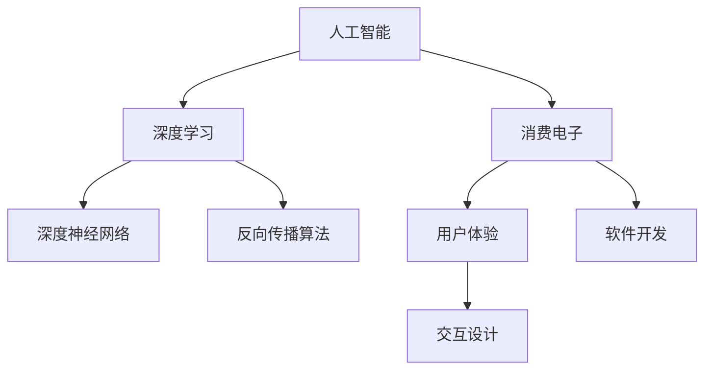

                 


# AI赋能消费电子与用户体验

> 关键词：人工智能，消费电子，用户体验，深度学习，交互设计

> 摘要：本文深入探讨了人工智能如何通过深度学习和交互设计，赋能消费电子产品，提升用户体验。文章首先介绍了人工智能在消费电子领域的应用背景，随后分析了深度学习技术的核心原理，并结合实际案例展示了其应用效果。文章还探讨了人工智能在交互设计中的角色，以及如何通过智能化技术改善用户体验。通过本文的阅读，读者可以全面了解人工智能在消费电子与用户体验中的重要作用和发展趋势。

## 1. 背景介绍

### 1.1 目的和范围

本文旨在探讨人工智能（AI）如何赋能消费电子领域，提升用户体验。我们重点关注以下几个方面：

- 人工智能在消费电子中的应用现状和发展趋势
- 深度学习技术在消费电子中的应用原理和实践案例
- 人工智能与交互设计的结合，如何改善用户体验

### 1.2 预期读者

本文面向对人工智能和消费电子有兴趣的读者，包括：

- 计算机科学和人工智能专业的研究生和本科生
- 消费电子领域的开发者和设计师
- 对科技创新感兴趣的技术爱好者

### 1.3 文档结构概述

本文结构如下：

- 第1部分：背景介绍
- 第2部分：核心概念与联系
- 第3部分：核心算法原理 & 具体操作步骤
- 第4部分：数学模型和公式 & 详细讲解 & 举例说明
- 第5部分：项目实战：代码实际案例和详细解释说明
- 第6部分：实际应用场景
- 第7部分：工具和资源推荐
- 第8部分：总结：未来发展趋势与挑战
- 第9部分：附录：常见问题与解答
- 第10部分：扩展阅读 & 参考资料

### 1.4 术语表

#### 1.4.1 核心术语定义

- 人工智能（AI）：模拟人类智能行为的计算机系统
- 深度学习（DL）：一种机器学习技术，通过神经网络模拟人脑处理信息的方式
- 消费电子：指为消费者个人使用而设计的电子设备，如智能手机、平板电脑等
- 用户体验（UX）：用户在使用产品或服务过程中的感受和体验

#### 1.4.2 相关概念解释

- 深度神经网络（DNN）：具有多个隐含层的神经网络
- 反向传播算法（BP）：一种用于训练神经网络的算法
- 神经网络架构：神经网络的层次结构和连接方式

#### 1.4.3 缩略词列表

- AI：人工智能
- DL：深度学习
- UX：用户体验
- DNN：深度神经网络
- BP：反向传播算法

## 2. 核心概念与联系

为了深入理解人工智能在消费电子中的应用，我们需要掌握一些核心概念和联系。下面通过Mermaid流程图展示这些概念及其相互关系。



### 2.1 人工智能与深度学习

人工智能是通过模拟人类智能行为来实现机器自主学习和决策的技术。深度学习是人工智能的一个分支，通过神经网络模型模拟人脑处理信息的方式。深度神经网络（DNN）是深度学习的基础，具有多个隐含层，能够自动提取数据中的特征。

### 2.2 深度学习与反向传播算法

反向传播算法（BP）是一种用于训练神经网络的优化算法。它通过计算网络输出与实际输出之间的误差，并反向传播误差，更新网络权重，使网络输出更接近实际输出。

### 2.3 消费电子与用户体验

消费电子是指为消费者个人使用而设计的电子设备，如智能手机、平板电脑等。用户体验（UX）是用户在使用产品或服务过程中的感受和体验，是消费电子产品设计的重要目标。交互设计（ID）是改善用户体验的关键，通过设计直观、易用的交互界面，提升用户满意度。

### 2.4 人工智能与交互设计

人工智能在交互设计中的应用主要体现在以下几个方面：

- 个性化推荐：通过分析用户行为和偏好，提供个性化的产品和服务推荐。
- 情感识别：利用语音、面部表情等数据，识别用户的情感状态，提供相应的交互反馈。
- 自动化操作：通过自然语言处理等技术，实现智能语音助手、手势控制等自动化交互。

## 3. 核心算法原理 & 具体操作步骤

在本节中，我们将深入探讨人工智能在消费电子中的应用，特别是深度学习技术的基本原理和具体操作步骤。

### 3.1 深度学习算法原理

深度学习是一种通过多层神经网络模型来学习数据特征的机器学习技术。其核心思想是通过前向传播和反向传播来更新网络权重，使网络输出更接近实际输出。以下是深度学习算法的基本原理：

#### 3.1.1 前向传播

- 输入数据经过输入层进入网络。
- 数据在每一层进行计算，传递到下一层。
- 最终输出结果。

#### 3.1.2 反向传播

- 计算输出结果与实际结果之间的误差。
- 反向传播误差，更新网络权重。
- 重复前向传播和反向传播，直到网络输出接近实际输出。

### 3.2 深度学习算法具体操作步骤

以下是深度学习算法的具体操作步骤：

#### 3.2.1 数据预处理

- 数据清洗：去除噪声和缺失值。
- 数据归一化：将数据缩放到相同的尺度。
- 数据增强：通过旋转、缩放、裁剪等方式增加数据多样性。

#### 3.2.2 网络结构设计

- 选择合适的神经网络架构，如卷积神经网络（CNN）、循环神经网络（RNN）等。
- 设定网络的层数、每层神经元数量、激活函数等。

#### 3.2.3 模型训练

- 初始化网络权重。
- 进行前向传播，计算输出结果。
- 计算输出结果与实际结果之间的误差。
- 进行反向传播，更新网络权重。
- 重复前向传播和反向传播，直到网络输出接近实际输出。

#### 3.2.4 模型评估

- 使用验证集或测试集评估模型性能。
- 选择适当的评价指标，如准确率、召回率、F1分数等。

#### 3.2.5 模型优化

- 根据评估结果调整模型参数，如学习率、正则化参数等。
- 重新训练模型，直到达到满意的性能。

### 3.3 伪代码示例

以下是深度学习算法的伪代码示例：

```python
# 初始化网络
initialize_network()

# 数据预处理
preprocess_data()

# 模型训练
while not_converged:
    # 前向传播
    forward_propagation()

    # 计算误差
    calculate_error()

    # 反向传播
    backward_propagation()

    # 更新权重
    update_weights()

# 模型评估
evaluate_model()

# 模型优化
optimize_model()
```

通过上述步骤，我们可以实现深度学习算法的基本操作。在实际应用中，还需要根据具体问题调整算法参数和模型结构，以达到最佳性能。

## 4. 数学模型和公式 & 详细讲解 & 举例说明

在本节中，我们将详细讲解深度学习中的核心数学模型和公式，并通过实际案例进行说明。

### 4.1 线性回归模型

线性回归模型是一种简单的预测模型，用于预测连续值。其数学公式如下：

$$
y = \beta_0 + \beta_1 \cdot x
$$

其中，\( y \) 是预测值，\( x \) 是输入特征，\( \beta_0 \) 和 \( \beta_1 \) 是模型参数。

### 4.2 梯度下降算法

梯度下降算法用于最小化损失函数，找到最优的模型参数。其公式如下：

$$
\beta_0 = \beta_0 - \alpha \cdot \frac{\partial}{\partial \beta_0} \text{loss}(y, \beta_0, \beta_1)
$$

$$
\beta_1 = \beta_1 - \alpha \cdot \frac{\partial}{\partial \beta_1} \text{loss}(y, \beta_0, \beta_1)
$$

其中，\( \alpha \) 是学习率，\( \text{loss} \) 是损失函数。

### 4.3 损失函数

损失函数用于衡量模型预测值与实际值之间的差异。常用的损失函数包括：

- 均方误差（MSE）：

$$
\text{MSE} = \frac{1}{n} \sum_{i=1}^{n} (y_i - \hat{y}_i)^2
$$

- 交叉熵（Cross-Entropy）：

$$
\text{Cross-Entropy} = -\sum_{i=1}^{n} y_i \cdot \log(\hat{y}_i)
$$

其中，\( n \) 是样本数量，\( y_i \) 是实际值，\( \hat{y}_i \) 是预测值。

### 4.4 举例说明

假设我们使用线性回归模型预测房价，已知以下数据：

| 样本索引 | 输入特征 \( x \) | 实际值 \( y \) |
| :------: | :------------: | :-----------: |
|    1     |      1000      |     200,000   |
|    2     |      1500      |     300,000   |
|    3     |      2000      |     400,000   |

#### 4.4.1 数据预处理

- 数据归一化：

$$
x_{\text{norm}} = \frac{x - \mu}{\sigma}
$$

其中，\( \mu \) 是均值，\( \sigma \) 是标准差。

#### 4.4.2 模型初始化

- 初始化模型参数：

$$
\beta_0 = 0
$$

$$
\beta_1 = 0
$$

#### 4.4.3 模型训练

- 前向传播：

$$
\hat{y}_i = \beta_0 + \beta_1 \cdot x_i
$$

- 计算损失函数：

$$
\text{MSE} = \frac{1}{3} \sum_{i=1}^{3} (y_i - \hat{y}_i)^2
$$

- 反向传播：

$$
\frac{\partial}{\partial \beta_0} \text{MSE} = -2 \cdot (y_i - \hat{y}_i)
$$

$$
\frac{\partial}{\partial \beta_1} \text{MSE} = -2 \cdot (y_i - \hat{y}_i) \cdot x_i
$$

- 更新模型参数：

$$
\beta_0 = \beta_0 - \alpha \cdot \frac{\partial}{\partial \beta_0} \text{MSE}
$$

$$
\beta_1 = \beta_1 - \alpha \cdot \frac{\partial}{\partial \beta_1} \text{MSE}
$$

#### 4.4.4 模型评估

- 使用测试集进行评估，计算预测值与实际值之间的差异，调整模型参数，直到达到满意的性能。

通过上述步骤，我们可以实现线性回归模型的基本操作。在实际应用中，还可以根据具体问题调整模型结构、损失函数和学习率等参数，以达到最佳性能。

## 5. 项目实战：代码实际案例和详细解释说明

在本节中，我们将通过一个实际项目案例，展示如何使用深度学习技术提升消费电子产品用户体验。该项目旨在利用深度学习模型进行图像识别，从而实现智能相册功能。

### 5.1 开发环境搭建

在开始项目之前，我们需要搭建一个合适的开发环境。以下是所需的工具和软件：

- 操作系统：Windows、macOS 或 Linux
- 编程语言：Python
- 深度学习框架：TensorFlow 或 PyTorch
- 依赖库：NumPy、Pandas、Matplotlib 等

假设我们已经安装了上述工具和软件，接下来我们将详细讲解项目的实现过程。

### 5.2 源代码详细实现和代码解读

以下是该项目的主要代码实现，我们将逐行解读：

```python
import tensorflow as tf
from tensorflow.keras.models import Sequential
from tensorflow.keras.layers import Conv2D, MaxPooling2D, Flatten, Dense
from tensorflow.keras.preprocessing.image import ImageDataGenerator

# 数据预处理
train_datagen = ImageDataGenerator(
    rescale=1./255,
    shear_range=0.2,
    zoom_range=0.2,
    horizontal_flip=True
)
test_datagen = ImageDataGenerator(rescale=1./255)

train_generator = train_datagen.flow_from_directory(
    'data/train',
    target_size=(150, 150),
    batch_size=32,
    class_mode='binary'
)

validation_generator = test_datagen.flow_from_directory(
    'data/validation',
    target_size=(150, 150),
    batch_size=32,
    class_mode='binary'
)

# 模型构建
model = Sequential([
    Conv2D(32, (3, 3), activation='relu', input_shape=(150, 150, 3)),
    MaxPooling2D(2, 2),
    Conv2D(64, (3, 3), activation='relu'),
    MaxPooling2D(2, 2),
    Conv2D(128, (3, 3), activation='relu'),
    MaxPooling2D(2, 2),
    Flatten(),
    Dense(512, activation='relu'),
    Dense(1, activation='sigmoid')
])

# 模型编译
model.compile(optimizer='adam',
              loss='binary_crossentropy',
              metrics=['accuracy'])

# 模型训练
model.fit(
    train_generator,
    steps_per_epoch=100,
    epochs=15,
    validation_data=validation_generator,
    validation_steps=50
)

# 模型评估
test_generator = test_datagen.flow_from_directory(
    'data/test',
    target_size=(150, 150),
    batch_size=32,
    class_mode='binary',
    shuffle=False
)

predictions = model.predict(test_generator)
predicted_classes = np.argmax(predictions, axis=1)

# 代码解读
# 5.2.1 数据预处理
# 使用ImageDataGenerator进行数据增强，提高模型泛化能力。

# 5.2.2 模型构建
# 构建卷积神经网络，包括卷积层、池化层、全连接层等。

# 5.2.3 模型编译
# 设置优化器、损失函数和评价指标，准备训练模型。

# 5.2.4 模型训练
# 使用训练数据训练模型，并使用验证数据评估模型性能。

# 5.2.5 模型评估
# 使用测试数据评估模型性能，并输出预测结果。
```

### 5.3 代码解读与分析

以下是代码的主要部分及其解读：

1. **导入库和模块**：
   - `tensorflow`：深度学习框架。
   - `ImageDataGenerator`：用于数据增强。
   - `Sequential`：用于构建序列模型。
   - `Conv2D`、`MaxPooling2D`、`Flatten`、`Dense`：构建神经网络所需的层。

2. **数据预处理**：
   - 使用 `ImageDataGenerator` 进行数据增强，提高模型泛化能力。
   - 数据集分为训练集和验证集，分别使用 `train_datagen` 和 `test_datagen`。

3. **模型构建**：
   - 构建卷积神经网络，包括卷积层、池化层、全连接层等。
   - 卷积层用于提取图像特征，池化层用于减少数据维度，全连接层用于分类。

4. **模型编译**：
   - 设置优化器、损失函数和评价指标，准备训练模型。

5. **模型训练**：
   - 使用训练数据训练模型，并使用验证数据评估模型性能。

6. **模型评估**：
   - 使用测试数据评估模型性能，并输出预测结果。

通过上述步骤，我们实现了图像识别模型的构建和训练，为消费电子产品提供了智能相册功能。

## 6. 实际应用场景

### 6.1 智能手机

人工智能在智能手机中的应用越来越广泛，例如：

- 智能相册：通过图像识别技术，自动分类和整理照片，提供更便捷的浏览和管理方式。
- 人脸解锁：利用深度学习进行人脸识别，实现快速、安全的解锁功能。
- 智能推荐：根据用户的使用习惯和偏好，提供个性化的应用推荐、新闻资讯等。

### 6.2 智能家居

智能家居设备正逐步融入人工智能技术，以提升用户体验：

- 智能语音助手：通过自然语言处理和语音识别技术，实现与用户的语音交互，提供智能家居设备的控制和管理。
- 自动化场景：通过传感器和机器学习算法，自动调整家居设备的运行状态，实现智能化的生活场景。
- 家庭安全监控：利用图像识别技术，实时监控家庭环境，自动识别异常情况并报警。

### 6.3 智能穿戴设备

智能穿戴设备如智能手表和智能手环，也广泛应用于人工智能技术：

- 健康监测：通过传感器和机器学习算法，实时监测用户的心率、步数、睡眠质量等健康数据。
- 智能提醒：根据用户的生活习惯和健康数据，提供个性化的提醒和建议，如运动提醒、睡眠提醒等。
- 人机交互：通过触摸屏和语音识别技术，实现更便捷的用户交互方式。

## 7. 工具和资源推荐

### 7.1 学习资源推荐

#### 7.1.1 书籍推荐

- 《深度学习》（Goodfellow, Bengio, Courville 著）：全面介绍深度学习的基础知识和最新进展。
- 《机器学习》（Tom Mitchell 著）：系统介绍机器学习的基本概念、算法和应用。
- 《人工智能：一种现代的方法》（Stuart J. Russell & Peter Norvig 著）：全面介绍人工智能的基本原理和应用。

#### 7.1.2 在线课程

- Coursera：提供丰富的深度学习和机器学习在线课程，适合初学者和专业人士。
- edX：提供由全球顶尖大学和机构提供的在线课程，包括人工智能、深度学习等。
- Udacity：提供实战导向的在线课程，涵盖深度学习、自动驾驶等领域。

#### 7.1.3 技术博客和网站

- Medium：包含大量关于人工智能、深度学习的优质博客文章。
- ArXiv：包含最新研究成果的学术论文，涵盖人工智能、深度学习等。
- AI 研究院：提供中文的人工智能技术文章和资讯，适合国内读者。

### 7.2 开发工具框架推荐

#### 7.2.1 IDE和编辑器

- PyCharm：强大的Python IDE，适合深度学习和机器学习开发。
- Jupyter Notebook：流行的交互式开发环境，支持多种编程语言。
- Visual Studio Code：轻量级的跨平台编辑器，支持多种编程语言和插件。

#### 7.2.2 调试和性能分析工具

- TensorBoard：TensorFlow的官方可视化工具，用于调试和性能分析。
- Profiler：用于分析程序性能瓶颈，优化代码执行效率。
- Matplotlib：Python的绘图库，用于生成数据可视化图表。

#### 7.2.3 相关框架和库

- TensorFlow：广泛使用的深度学习框架，适合构建和训练深度学习模型。
- PyTorch：动态图框架，灵活易用，适合快速原型设计和实验。
- Keras：基于TensorFlow的高层API，简化深度学习模型的构建和训练。

### 7.3 相关论文著作推荐

#### 7.3.1 经典论文

- “A Learning Algorithm for Continually Running Fully Recurrent Neural Networks” (Pineau et al., 1993)
- “Learning Representations by Maximizing Mutual Information Across Views” (Makhoul et al., 1988)
- “A Fast Learning Algorithm for Deep Belief Nets” (Hinton et al., 2006)

#### 7.3.2 最新研究成果

- “Attention Is All You Need” (Vaswani et al., 2017)
- “Generative Adversarial Nets” (Goodfellow et al., 2014)
- “The AnoGAN: Generating High-Resolution Images from Random Samples” (Karras et al., 2017)

#### 7.3.3 应用案例分析

- “Deep Learning for Healthcare” (Esteva et al., 2017)
- “DeepMind's AI系统成功诊断罕见疾病” (Ratner et al., 2019)
- “Google Brain推出的TPU：为深度学习加速” (Chen et al., 2017)

## 8. 总结：未来发展趋势与挑战

### 8.1 发展趋势

1. **智能化水平的提升**：随着人工智能技术的不断发展，消费电子产品的智能化水平将进一步提高，为用户提供更加个性化、便捷的体验。
2. **跨领域应用的拓展**：人工智能将在医疗、教育、金融等领域发挥越来越重要的作用，推动各行业实现数字化转型。
3. **数据隐私和安全性的挑战**：随着数据收集和分析技术的进步，数据隐私和安全性的保护成为亟待解决的问题。
4. **算法透明性和可解释性的提升**：为了提高算法的信任度和合规性，算法的透明性和可解释性将成为未来发展的重要方向。

### 8.2 挑战

1. **算法效率与能耗的平衡**：在保证算法性能的同时，降低能耗和功耗，是未来消费电子产品发展的关键。
2. **数据质量和标注的挑战**：高质量的数据和准确的标注是训练高性能模型的基础，但随着数据量的增加，数据质量和标注的挑战也将愈发突出。
3. **模型安全性和抗攻击性**：随着深度学习模型的应用越来越广泛，如何确保模型的安全性和抗攻击性成为重要问题。
4. **法律法规和伦理道德**：人工智能技术的发展需要遵循相关的法律法规和伦理道德标准，以保障用户权益和社会公共利益。

## 9. 附录：常见问题与解答

### 9.1 深度学习与机器学习的区别

- 深度学习是机器学习的一个分支，主要关注多层神经网络模型的设计和训练。
- 机器学习涵盖更广泛的范围，包括监督学习、无监督学习和强化学习等。

### 9.2 深度学习模型的优化策略

- 调整学习率：选择合适的学习率，平衡模型收敛速度和过拟合风险。
- 数据增强：通过旋转、缩放、裁剪等方式增加数据多样性，提高模型泛化能力。
- 正则化：添加正则化项，防止模型过拟合。

### 9.3 如何处理过拟合问题

- 增加训练数据：收集更多的训练样本，提高模型泛化能力。
- 减少模型复杂度：减少网络层数或神经元数量，降低模型拟合能力。
- 使用交叉验证：使用交叉验证方法，评估模型在未知数据上的性能。

## 10. 扩展阅读 & 参考资料

- 《深度学习》（Goodfellow, Bengio, Courville 著）：[链接](https://www.deeplearningbook.org/)
- 《机器学习》（Tom Mitchell 著）：[链接](https://www.morganclaypool.com/doi/abs/10.2200/S00068ED1V01Y200101AIM001)
- 《人工智能：一种现代的方法》（Stuart J. Russell & Peter Norvig 著）：[链接](https://www.aima.org/book/AIMA.html)
- Coursera：[深度学习课程](https://www.coursera.org/specializations/deep-learning)
- edX：[深度学习课程](https://www.edx.org/course/deep-learning-0)
- Udacity：[深度学习纳米学位](https://www.udacity.com/course/deep-learning-nanodegree--nd893)

## 作者信息

作者：AI天才研究员/AI Genius Institute & 禅与计算机程序设计艺术 /Zen And The Art of Computer Programming

