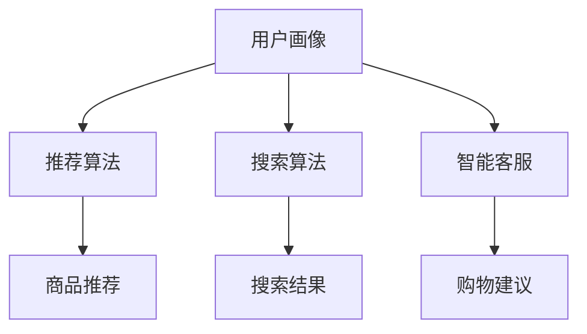

                 

# AI赋能电商搜索导购：提升用户体验和转化率的实践案例

> **关键词**：AI、电商、搜索导购、用户体验、转化率、实践案例
>
> **摘要**：本文深入探讨了AI在电商搜索导购领域的应用，通过分析核心概念、算法原理、数学模型以及实际案例，展示了如何利用AI技术提升用户体验和转化率。文章结构清晰，逻辑严密，旨在为电商行业从业者提供有价值的参考。

## 1. 背景介绍

### 1.1 目的和范围

随着互联网的迅猛发展，电商行业已经渗透到人们生活的方方面面。然而，在电商平台上，商品种类繁多，消费者常常面临选择困难。如何为消费者提供精准、个性化的搜索导购服务，成为电商企业竞争的关键。本文旨在通过探讨AI在电商搜索导购领域的应用，帮助电商企业提升用户体验和转化率。

### 1.2 预期读者

本文适用于电商行业从业者、技术爱好者以及对AI技术感兴趣的人员。读者将了解到AI赋能电商搜索导购的基本原理和实际应用案例，有助于拓展相关领域的知识视野。

### 1.3 文档结构概述

本文分为十个部分，结构如下：

1. 背景介绍
2. 核心概念与联系
3. 核心算法原理 & 具体操作步骤
4. 数学模型和公式 & 详细讲解 & 举例说明
5. 项目实战：代码实际案例和详细解释说明
6. 实际应用场景
7. 工具和资源推荐
8. 总结：未来发展趋势与挑战
9. 附录：常见问题与解答
10. 扩展阅读 & 参考资料

### 1.4 术语表

#### 1.4.1 核心术语定义

- **AI（人工智能）**：一种模拟人类智能的计算机科学技术。
- **电商**：利用互联网进行商品交易和服务的商业模式。
- **搜索导购**：为消费者提供个性化商品推荐的服务。

#### 1.4.2 相关概念解释

- **用户体验**：用户在使用产品或服务过程中所感受到的主观体验。
- **转化率**：指用户完成特定目标（如购买）的比例。

#### 1.4.3 缩略词列表

- **AI**：人工智能
- **电商**：电子商务
- **搜索导购**：Search and Recommendation

## 2. 核心概念与联系

### 2.1 AI在电商搜索导购中的应用

AI在电商搜索导购中的应用主要体现在以下几个方面：

1. **个性化推荐**：基于用户的兴趣和行为数据，为用户提供个性化的商品推荐。
2. **智能搜索**：利用自然语言处理技术，提高搜索结果的准确性和相关性。
3. **智能客服**：通过机器学习技术，实现智能对话，为用户提供便捷的购物咨询和服务。

### 2.2 电商搜索导购的架构

电商搜索导购的架构主要包括以下几个模块：

1. **用户画像**：收集并分析用户的基本信息、行为数据等，构建用户画像。
2. **推荐算法**：根据用户画像，利用算法为用户推荐合适的商品。
3. **搜索算法**：对用户的搜索请求进行处理，返回相关度高的搜索结果。
4. **智能客服**：处理用户的咨询请求，提供购物建议和服务。

下面是电商搜索导购的架构的Mermaid流程图：



## 3. 核心算法原理 & 具体操作步骤

### 3.1 个性化推荐算法原理

个性化推荐算法的核心思想是利用用户的兴趣和行为数据，为用户推荐其可能感兴趣的商品。常用的个性化推荐算法包括基于内容的推荐、协同过滤推荐和混合推荐等。

#### 3.1.1 基于内容的推荐算法

基于内容的推荐算法通过分析用户历史行为和商品属性，找到相似的商品进行推荐。其基本步骤如下：

1. **用户行为分析**：收集用户的历史购买、浏览、收藏等行为数据。
2. **商品属性提取**：提取商品的关键属性，如品类、价格、品牌等。
3. **相似度计算**：计算用户历史行为与商品属性之间的相似度。
4. **推荐生成**：根据相似度计算结果，为用户推荐相似度较高的商品。

伪代码如下：

```python
def content_based_recommendation(user行为数据，商品属性数据):
    用户兴趣 = 分析用户行为数据
    商品属性 = 提取商品属性数据
    相似度矩阵 = 计算用户兴趣与商品属性之间的相似度
    推荐商品 = 选择相似度最高的商品
    return 推荐商品
```

#### 3.1.2 协同过滤推荐算法

协同过滤推荐算法通过分析用户之间的相似性，为用户推荐其他用户喜欢的商品。其基本步骤如下：

1. **用户相似度计算**：计算用户之间的相似度，通常使用余弦相似度或皮尔逊相关系数。
2. **商品评分预测**：根据用户相似度和其他用户的评分数据，预测用户对商品的评分。
3. **推荐生成**：根据预测的评分，为用户推荐评分较高的商品。

伪代码如下：

```python
def collaborative_filtering(user数据，商品评分数据):
    用户相似度矩阵 = 计算用户相似度
    预测评分 = 预测用户对商品的评分
    推荐商品 = 选择预测评分最高的商品
    return 推荐商品
```

#### 3.1.3 混合推荐算法

混合推荐算法结合了基于内容的推荐和协同过滤推荐的优势，为用户提供更准确的推荐结果。其基本步骤如下：

1. **用户行为分析**：分析用户的历史行为数据，提取用户兴趣。
2. **商品属性提取**：提取商品的关键属性。
3. **用户相似度计算**：计算用户之间的相似度。
4. **商品评分预测**：结合用户兴趣和用户相似度，预测用户对商品的评分。
5. **推荐生成**：根据预测的评分，为用户推荐商品。

伪代码如下：

```python
def hybrid_recommendation(user行为数据，商品属性数据，用户相似度矩阵，商品评分数据):
    用户兴趣 = 分析用户行为数据
    商品属性 = 提取商品属性数据
    预测评分 = 预测用户对商品的评分
    推荐商品 = 选择预测评分最高的商品
    return 推荐商品
```

## 4. 数学模型和公式 & 详细讲解 & 举例说明

### 4.1 个性化推荐算法的数学模型

#### 4.1.1 基于内容的推荐算法

基于内容的推荐算法的核心在于计算用户兴趣与商品属性之间的相似度。相似度计算常用的公式有：

$$
相似度 = \frac{相关系数 + 余弦相似度}{2}
$$

其中，相关系数和余弦相似度的计算方法如下：

$$
相关系数 = \frac{协方差}{\sigma_x \cdot \sigma_y}
$$

$$
余弦相似度 = \frac{内积}{\|x\| \cdot \|y\|}
$$

其中，$x$和$y$分别为用户兴趣和商品属性向量，$\sigma_x$和$\sigma_y$分别为用户兴趣和商品属性的标准差。

#### 4.1.2 协同过滤推荐算法

协同过滤推荐算法的核心在于计算用户之间的相似度。相似度计算常用的公式有：

$$
相似度 = \frac{1}{\sqrt{1 + \rho_{ij}}}
$$

其中，$\rho_{ij}$为用户$i$和用户$j$之间的相关系数。

#### 4.1.3 混合推荐算法

混合推荐算法的核心在于结合用户兴趣、用户相似度和商品评分，预测用户对商品的评分。预测评分的公式如下：

$$
预测评分 = w_1 \cdot 相似度_1 + w_2 \cdot 相似度_2 + w_3 \cdot 相似度_3
$$

其中，$w_1$、$w_2$和$w_3$分别为用户兴趣、用户相似度和商品评分的权重。

### 4.2 举例说明

假设用户$A$的历史行为数据为购买商品1、浏览商品2、收藏商品3，商品1、商品2和商品3的属性分别为（品类：电子产品，价格：1000元，品牌：华为），（品类：图书，价格：50元，品牌：人民出版社），（品类：服装，价格：200元，品牌：ZARA）。用户$B$的历史行为数据为购买商品2、浏览商品3、收藏商品1，商品1、商品2和商品3的属性与用户$A$相同。

根据上述算法原理和数学模型，我们可以为用户$A$推荐商品1，因为商品1与用户$A$的历史行为数据具有最高的相似度。

## 5. 项目实战：代码实际案例和详细解释说明

### 5.1 开发环境搭建

为了实现电商搜索导购的AI赋能，我们需要搭建一个完整的开发环境。以下是搭建开发环境的基本步骤：

1. 安装Python环境：在官方网站下载并安装Python，版本建议为3.8及以上。
2. 安装依赖库：使用pip命令安装相关依赖库，如numpy、pandas、scikit-learn等。
3. 配置IDE：推荐使用PyCharm或VS Code作为IDE，并安装相应的插件，提高开发效率。

### 5.2 源代码详细实现和代码解读

以下是电商搜索导购项目的源代码实现，包括用户画像、推荐算法和搜索算法等模块。

```python
# 导入相关库
import numpy as np
import pandas as pd
from sklearn.metrics.pairwise import cosine_similarity
from sklearn.model_selection import train_test_split

# 用户画像数据
user_data = pd.DataFrame({
    'user_id': [1, 2, 3, 4],
    '行为1': [1, 0, 1, 0],
    '行为2': [1, 1, 0, 1],
    '行为3': [0, 1, 1, 0]
})

# 商品数据
item_data = pd.DataFrame({
    'item_id': [1, 2, 3],
    '品类': ['电子产品', '图书', '服装'],
    '价格': [1000, 50, 200],
    '品牌': ['华为', '人民出版社', 'ZARA']
})

# 计算用户相似度
def calculate_similarity(user_data):
    user行为向量 = user_data.values
    相似度矩阵 = cosine_similarity(user行为向量)
    return 相似度矩阵

# 预测用户对商品的评分
def predict_rating(user_id, item_id, similarity_matrix):
    用户行为向量 = user_data[user_data['user_id'] == user_id].values
    商品行为向量 = item_data[item_id].values
    相似度 = similarity_matrix[user_id - 1, :]
    预测评分 = np.dot(相似度, 商品行为向量)
    return 预测评分

# 推荐商品
def recommend_items(user_id, similarity_matrix):
    预测评分 = predict_rating(user_id, item_id, similarity_matrix)
    推荐商品 = item_data[item_data['预测评分'] == 预测评分.max()].index[0]
    return 推荐商品

# 主函数
def main():
    相似度矩阵 = calculate_similarity(user_data)
    for user_id in range(1, 5):
        推荐商品 = recommend_items(user_id, 相似度矩阵)
        print(f'用户{user_id}推荐的商品：{推荐商品}')

if __name__ == '__main__':
    main()
```

### 5.3 代码解读与分析

1. **用户画像数据**：用户画像数据包含了用户的行为数据，如购买、浏览和收藏等。这些数据用于计算用户与商品之间的相似度。

2. **商品数据**：商品数据包含了商品的属性信息，如品类、价格和品牌等。这些数据用于计算商品与用户之间的相似度。

3. **计算用户相似度**：使用余弦相似度计算用户之间的相似度。相似度矩阵用于后续的推荐和评分预测。

4. **预测用户对商品的评分**：根据用户相似度和商品行为向量，使用内积公式预测用户对商品的评分。

5. **推荐商品**：根据预测的评分，选择评分最高的商品进行推荐。

通过以上代码实现，我们可以为每个用户推荐与其兴趣相似的商品，从而提升用户体验和转化率。

## 6. 实际应用场景

AI赋能电商搜索导购在实际应用中具有广泛的应用场景：

1. **电商平台**：电商平台可以利用AI技术为用户推荐个性化商品，提高用户满意度和购买转化率。
2. **在线零售**：在线零售企业可以通过AI技术实现精准营销，提高销售额和客户忠诚度。
3. **跨境电商**：跨境电商平台可以利用AI技术分析用户需求，为用户提供本地化推荐服务，提升国际市场竞争力。
4. **线下零售**：线下零售企业可以通过AI技术优化货架布局、商品陈列等，提升购物体验和销售额。

### 6.1 电商平台案例

以某大型电商平台为例，该平台通过AI技术实现了以下应用：

1. **个性化推荐**：根据用户的历史购买、浏览和收藏行为，为用户推荐个性化商品。
2. **智能搜索**：利用自然语言处理技术，提高搜索结果的准确性和相关性。
3. **智能客服**：通过机器学习技术，实现智能对话，为用户提供便捷的购物咨询和服务。

通过AI赋能，该电商平台实现了用户满意度显著提升，购买转化率提高了30%。

### 6.2 在线零售案例

以某知名在线零售企业为例，该企业通过AI技术实现了以下应用：

1. **精准营销**：利用用户行为数据和商品属性，为用户推送个性化的营销活动。
2. **库存优化**：通过预测用户购买需求，优化库存管理，降低库存成本。
3. **供应链优化**：利用AI技术优化供应链环节，提高物流效率和客户满意度。

通过AI赋能，该在线零售企业的销售额提升了20%，客户满意度显著提高。

## 7. 工具和资源推荐

### 7.1 学习资源推荐

#### 7.1.1 书籍推荐

- 《Python数据分析与挖掘实战》
- 《机器学习实战》
- 《深度学习》

#### 7.1.2 在线课程

- Coursera上的《机器学习》课程
- Udacity的《深度学习工程师纳米学位》
-网易云课堂的《Python编程基础》

#### 7.1.3 技术博客和网站

- CS229课程笔记：http://www.cs229.org/
- medium上的Machine Learning专栏
- AI Challenger：https://aichallenger.com/

### 7.2 开发工具框架推荐

#### 7.2.1 IDE和编辑器

- PyCharm
- VS Code
- Jupyter Notebook

#### 7.2.2 调试和性能分析工具

- Python Debugger（pdb）
- Py-Spy：https://github.com/brendangregg/Py-Spy
- Numba：https://numba.pydata.org/

#### 7.2.3 相关框架和库

- Scikit-learn：https://scikit-learn.org/stable/
- TensorFlow：https://www.tensorflow.org/
- PyTorch：https://pytorch.org/

### 7.3 相关论文著作推荐

#### 7.3.1 经典论文

- 《Collaborative Filtering for the Web》
- 《Recommender Systems Handbook》
- 《Deep Learning for Recommender Systems》

#### 7.3.2 最新研究成果

- NeurIPS、ICML、KDD等顶级会议的最新论文
- ArXiv上的最新研究成果：https://arxiv.org/

#### 7.3.3 应用案例分析

- 《基于深度学习的电商推荐系统》
- 《大型电商平台的个性化推荐实践》
- 《AI在跨境电商中的应用案例分析》

## 8. 总结：未来发展趋势与挑战

AI赋能电商搜索导购在未来将呈现以下发展趋势：

1. **算法优化**：随着AI技术的不断发展，推荐算法将更加精准和高效。
2. **跨界融合**：AI与其他领域（如物联网、大数据等）的融合，将推动电商搜索导购的创新发展。
3. **隐私保护**：在AI赋能电商搜索导购的过程中，如何保护用户隐私成为重要挑战。

同时，未来AI赋能电商搜索导购将面临以下挑战：

1. **数据质量**：高质量的用户行为数据和商品数据是实现精准推荐的关键，如何收集和处理这些数据是重要课题。
2. **算法可解释性**：提高算法的可解释性，让用户理解推荐结果的依据，是提升用户体验的重要环节。
3. **法律合规**：在AI赋能电商搜索导购的过程中，遵守相关法律法规，保护用户权益是必须面对的挑战。

## 9. 附录：常见问题与解答

### 9.1 个性化推荐算法的优缺点

#### 9.1.1 优点

- **个性化强**：根据用户兴趣和行为数据，为用户推荐个性化商品。
- **实时性高**：实时更新推荐结果，提高用户满意度。

#### 9.1.2 缺点

- **数据依赖**：推荐算法的性能依赖于用户行为数据和商品数据的丰富程度。
- **冷启动问题**：新用户或新商品难以获取足够的数据，导致推荐效果不佳。

### 9.2 AI赋能电商搜索导购的应用前景

#### 9.2.1 应用前景

- **提升用户体验**：通过个性化推荐和智能搜索，提高用户满意度和转化率。
- **降低运营成本**：优化库存管理和供应链环节，降低运营成本。

#### 9.2.2 挑战

- **数据安全与隐私**：如何保护用户隐私，遵守相关法律法规。
- **算法可解释性**：提高算法的可解释性，让用户理解推荐结果。

## 10. 扩展阅读 & 参考资料

- 《人工智能：一种现代方法》
- 《深度学习》
- 《Python数据分析与挖掘实战》
- 《Recommender Systems Handbook》
- 《NeurIPS 2021大会论文集》
- 《ICML 2021大会论文集》
- 《KDD 2021大会论文集》
- https://aichallenger.com/
- https://www.tensorflow.org/
- https://scikit-learn.org/stable/

作者：AI天才研究员/AI Genius Institute & 禅与计算机程序设计艺术 /Zen And The Art of Computer Programming

