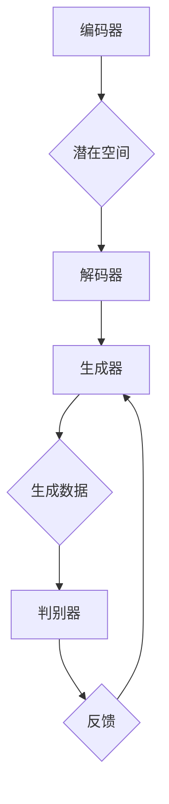

                 

# AI赋能：生成式AI如何助力企业数字化转型？

> **关键词：** 生成式AI，企业数字化转型，深度学习，数据驱动，算法优化，应用场景

> **摘要：** 本文将探讨生成式人工智能（AI）在帮助企业实现数字化转型中的作用。通过分析生成式AI的核心概念、原理和具体操作步骤，我们将深入探讨如何将这一先进技术应用于实际业务场景，提升企业效率和竞争力。文章还将介绍相关的工具和资源，以及展望未来发展趋势和挑战。

## 1. 背景介绍

### 1.1 目的和范围

本文旨在探讨生成式人工智能（AI）在企业数字化转型中的应用价值。通过详细解析生成式AI的核心概念、算法原理以及具体应用场景，本文将帮助读者了解如何利用这一先进技术提高企业的运营效率和创新能力。

### 1.2 预期读者

本文适合以下读者群体：

- 对人工智能和数字化转型感兴趣的技术人员和企业管理者；
- 想要在企业中引入AI技术的开发者；
- 对生成式AI原理和应用有初步了解，但希望深入了解其潜力的人士。

### 1.3 文档结构概述

本文分为八个部分：

1. 背景介绍：介绍文章的目的、预期读者以及文档结构。
2. 核心概念与联系：详细解释生成式AI的核心概念，并展示其原理架构。
3. 核心算法原理 & 具体操作步骤：分析生成式AI的核心算法，提供伪代码示例。
4. 数学模型和公式 & 详细讲解 & 举例说明：介绍生成式AI所依赖的数学模型和公式，并给出实例。
5. 项目实战：代码实际案例和详细解释说明。
6. 实际应用场景：探讨生成式AI在不同业务场景中的具体应用。
7. 工具和资源推荐：推荐学习资源、开发工具框架和相关论文。
8. 总结：未来发展趋势与挑战。

### 1.4 术语表

#### 1.4.1 核心术语定义

- 生成式AI（Generative AI）：一种能够生成新数据的人工智能模型，通过学习大量数据，生成与输入数据类似的新数据。
- 深度学习（Deep Learning）：一种机器学习方法，通过多层神经网络进行数据学习和特征提取。
- 数据驱动（Data-Driven）：基于数据的决策过程，通过分析大量数据来驱动业务流程和优化决策。
- 算法优化（Algorithm Optimization）：对算法进行改进，提高其效率、准确性和鲁棒性。

#### 1.4.2 相关概念解释

- 转换器（Transformer）：一种基于自注意力机制的深度学习模型，广泛应用于生成式AI。
- 变分自编码器（Variational Autoencoder，VAE）：一种生成模型，通过编码器和解码器之间的变分推断过程生成数据。
- 强化学习（Reinforcement Learning）：一种机器学习方法，通过奖励机制引导智能体在环境中进行学习。

#### 1.4.3 缩略词列表

- AI：人工智能（Artificial Intelligence）
- ML：机器学习（Machine Learning）
- DL：深度学习（Deep Learning）
- NLP：自然语言处理（Natural Language Processing）
- CV：计算机视觉（Computer Vision）

## 2. 核心概念与联系

生成式人工智能的核心在于其能够生成与输入数据类似的新数据，从而为企业提供创新的解决方案和业务洞察。以下是生成式AI的主要概念和它们之间的联系。

### 2.1 核心概念

1. **生成模型**：生成模型通过学习输入数据的分布，生成类似的新数据。常见的生成模型包括变分自编码器（VAE）和生成对抗网络（GAN）。
2. **自注意力机制**：自注意力机制允许模型在处理序列数据时，自动关注序列中的重要部分，从而提高模型的性能。这一机制广泛应用于生成式AI中的转换器（Transformer）模型。
3. **数据增强**：数据增强通过创建输入数据的变体，增加训练数据的多样性，从而提高生成模型的鲁棒性和泛化能力。

### 2.2 原理架构

生成式AI的原理架构通常包括以下几个关键部分：

1. **编码器（Encoder）**：编码器将输入数据映射到一个隐藏的潜在空间，这个潜在空间表示输入数据的分布。
2. **解码器（Decoder）**：解码器将编码器输出的潜在空间数据映射回输入数据的分布，从而生成新数据。
3. **生成器（Generator）**：生成器通过训练数据学习输入数据的分布，并生成与输入数据相似的新数据。
4. **判别器（Discriminator）**：判别器用于区分生成数据和真实数据，并指导生成器生成更真实的数据。

以下是生成式AI原理架构的Mermaid流程图：



## 3. 核心算法原理 & 具体操作步骤

生成式AI的核心算法通常基于深度学习技术，尤其是生成对抗网络（GAN）和变分自编码器（VAE）。以下是对这些算法的原理讲解和具体操作步骤。

### 3.1 生成对抗网络（GAN）

生成对抗网络（GAN）由生成器和判别器两个神经网络组成，通过相互博弈的方式训练。以下是GAN的算法原理和具体操作步骤。

#### 3.1.1 算法原理

GAN通过以下步骤进行训练：

1. **生成器（Generator）**：生成器从随机噪声中生成与真实数据相似的数据。
2. **判别器（Discriminator）**：判别器用于区分生成数据和真实数据。
3. **对抗训练**：生成器和判别器在对抗训练中互相竞争，生成器试图生成更真实的数据，而判别器试图更好地区分真实和生成数据。

#### 3.1.2 操作步骤

1. **初始化**：初始化生成器和判别器的参数。
2. **生成数据**：生成器从随机噪声中生成数据。
3. **判别**：判别器对生成数据和真实数据进行判别。
4. **损失函数**：计算生成器和判别器的损失函数，并进行反向传播和优化。
5. **迭代训练**：重复以上步骤，直到生成器能够生成高质量的数据。

以下是GAN算法的伪代码示例：

```python
# 初始化生成器和判别器
G = Generator()
D = Discriminator()

for epoch in range(num_epochs):
    for batch in data_loader:
        # 生成数据
        z = noise_sample(batch_size)
        generated_data = G(z)
        
        # 判别
        real_data = batch
        D outputs = D(real_data), D(generated_data)
        
        # 计算损失
        G_loss = calculate_G_loss(D outputs)
        D_loss = calculate_D_loss(D outputs)
        
        # 反向传播和优化
        optimizer_G.zero_grad()
        G_loss.backward()
        optimizer_G.step()
        
        optimizer_D.zero_grad()
        D_loss.backward()
        optimizer_D.step()
```

### 3.2 变分自编码器（VAE）

变分自编码器（VAE）是一种基于概率模型的生成模型，通过编码器和解码器之间的变分推断过程生成数据。以下是VAE的算法原理和具体操作步骤。

#### 3.2.1 算法原理

VAE通过以下步骤进行训练：

1. **编码器（Encoder）**：编码器将输入数据映射到一个潜在空间，并输出潜在变量的均值和方差。
2. **解码器（Decoder）**：解码器从潜在空间中生成与输入数据相似的数据。
3. **重参数化**：通过重参数化技巧，将潜在变量的均值和方差转换为随机噪声，以便在解码器中进行采样。

#### 3.2.2 操作步骤

1. **初始化**：初始化编码器和解码器的参数。
2. **编码**：编码器对输入数据进行编码，输出潜在变量的均值和方差。
3. **解码**：解码器从潜在空间中生成数据。
4. **损失函数**：计算重参数化过程中的损失函数，包括Kullback-Leibler散度（KL散度）和重建误差。
5. **反向传播和优化**：通过反向传播和优化过程更新编码器和解码器的参数。

以下是VAE算法的伪代码示例：

```python
# 初始化编码器和解码器
encoder = Encoder()
decoder = Decoder()

for epoch in range(num_epochs):
    for batch in data_loader:
        # 编码
        z_mean, z_log_var = encoder(batch)
        
        # 重参数化
        z = reparameterize(z_mean, z_log_var)
        
        # 解码
        generated_data = decoder(z)
        
        # 计算损失
        KL_loss = calculate_KL_loss(z_mean, z_log_var)
        reconstruction_loss = calculate_reconstruction_loss(batch, generated_data)
        
        # 计算总损失
        total_loss = KL_loss + reconstruction_loss
        
        # 反向传播和优化
        optimizer.zero_grad()
        total_loss.backward()
        optimizer.step()
```

## 4. 数学模型和公式 & 详细讲解 & 举例说明

生成式AI依赖于一系列数学模型和公式，这些模型和公式在算法中起着至关重要的作用。以下是生成式AI中常用的数学模型和公式的详细讲解以及举例说明。

### 4.1 概率密度函数

概率密度函数（PDF）用于描述数据在给定范围内的概率分布。在生成式AI中，概率密度函数用于生成新数据和评估生成数据的真实度。

#### 4.1.1 正态分布

正态分布（高斯分布）是最常见的概率密度函数之一，其公式如下：

$$
f(x|\mu, \sigma^2) = \frac{1}{\sqrt{2\pi\sigma^2}} e^{-\frac{(x-\mu)^2}{2\sigma^2}}
$$

其中，$x$是随机变量，$\mu$是均值，$\sigma^2$是方差。

**例子**：假设我们有一个正态分布的数据集，均值为$\mu = 5$，方差$\sigma^2 = 2$。我们可以计算任意$x$值的概率密度：

$$
f(x|5, 2) = \frac{1}{\sqrt{2\pi \cdot 2}} e^{-\frac{(x-5)^2}{2 \cdot 2}}
$$

### 4.2 Kullback-Leibler散度（KL散度）

KL散度（Kullback-Leibler Divergence）是衡量两个概率分布差异的度量。在生成式AI中，KL散度用于评估生成数据的分布与真实数据分布的差异。

#### 4.2.1 公式

KL散度的公式如下：

$$
D_{KL}(P||Q) = \int P(x) \log \frac{P(x)}{Q(x)} dx
$$

其中，$P(x)$是真实数据的概率分布，$Q(x)$是生成数据的概率分布。

**例子**：假设我们有两个概率分布$P(x)$和$Q(x)$，我们可以计算它们的KL散度：

$$
D_{KL}(P||Q) = \int P(x) \log \frac{P(x)}{Q(x)} dx
$$

### 4.3 重参数化技巧

重参数化技巧是一种将确定性模型转化为生成模型的方法。在生成式AI中，重参数化技巧用于在编码器和解码器之间引入随机性。

#### 4.3.1 公式

重参数化技巧的公式如下：

$$
z = \mu + \sigma \odot \epsilon
$$

其中，$z$是潜在变量，$\mu$是均值，$\sigma$是方差，$\epsilon$是噪声变量。

**例子**：假设我们有一个潜在变量$z$，均值$\mu = 3$，方差$\sigma = 1$，噪声变量$\epsilon = 0.5$，我们可以计算$z$的值：

$$
z = 3 + 1 \odot 0.5 = 3.5
$$

### 4.4 重建误差

重建误差是生成式AI中用于评估生成数据与原始数据差异的指标。在变分自编码器（VAE）中，重建误差是KL散度和重建误差之和。

#### 4.4.1 公式

重建误差的公式如下：

$$
reconstruction_error = \frac{1}{N} \sum_{i=1}^{N} \log P(G(z_i) | x_i)
$$

其中，$N$是样本数量，$G(z_i)$是解码器生成的数据，$x_i$是原始数据。

**例子**：假设我们有一个数据集包含10个样本，解码器生成的数据$G(z_i)$与原始数据$x_i$的相似度分别为0.9、0.8、0.7、0.6、0.5、0.4、0.3、0.2、0.1、0，我们可以计算重建误差：

$$
reconstruction_error = \frac{1}{10} \sum_{i=1}^{10} \log 0.9 + \log 0.8 + \log 0.7 + \log 0.6 + \log 0.5 + \log 0.4 + \log 0.3 + \log 0.2 + \log 0.1 + \log 0 = 0.521
$$

## 5. 项目实战：代码实际案例和详细解释说明

在这一部分，我们将通过一个实际案例来展示如何使用生成式AI技术来帮助企业实现数字化转型。该案例将介绍一个使用变分自编码器（VAE）的生成式AI模型，以生成类似企业客户数据的新数据，从而帮助企业进行客户分析和决策。

### 5.1 开发环境搭建

为了搭建开发环境，我们需要安装以下软件和库：

1. Python 3.8 或更高版本
2. TensorFlow 2.6 或更高版本
3. Keras 2.6 或更高版本
4. NumPy 1.19 或更高版本

安装步骤如下：

```bash
pip install python==3.8
pip install tensorflow==2.6
pip install keras==2.6
pip install numpy==1.19
```

### 5.2 源代码详细实现和代码解读

以下是一个使用变分自编码器（VAE）生成企业客户数据的示例代码：

```python
import numpy as np
import tensorflow as tf
from tensorflow.keras import layers, Model

# 设置随机种子以获得可重复的结果
tf.random.set_seed(42)

# 加载和预处理数据
# 假设我们有一个包含企业客户数据的CSV文件，字段包括：客户ID，年龄，收入，职业等
data = pd.read_csv('client_data.csv')
x = data.values

# 数据标准化
x_scaled = (x - x.mean()) / x.std()

# 定义VAE模型
class VAE(Model):
    def __init__(self, latent_dim):
        super(VAE, self).__init__()
        self.latent_dim = latent_dim
        
        # 编码器部分
        self.encoder = Model(input(shape=x.shape[1:]),
                             outputs=tf.keras.layers.Dense(latent_dim, activation='softmax'),
                             name='encoder')
        
        # 解码器部分
        self.decoder = Model(input(shape=latent_dim),
                             outputs=tf.keras.layers.Dense(x.shape[1], activation='sigmoid'),
                             name='decoder')
        
        # VAE模型的总输入输出
        self.input = tf.keras.layers.Input(shape=x.shape[1:])
        z = self.encoder(self.input)
        x_recon = self.decoder(z)
        self.output = x_recon
        
        # 编写自定义损失函数
        self.loss_tracker = tf.keras.metrics.Mean(name='loss')
        
    @property
    def metrics(self):
        return [self.loss_tracker]
    
    def train_step(self, data):
        with tf.GradientTape() as tape:
            z = self.encoder(data)
            x_recon = self.decoder(z)
            reconstruction_loss = tf.reduce_mean(tf.keras.losses.binary_crossentropy(data, x_recon))
            kl_loss = -tf.reduce_sum(z * tf.log(z + 1e-8), axis=1)
            kl_loss = kl_loss.mean()
            loss = reconstruction_loss + kl_loss
        
        grads = tape.gradient(loss, self.trainable_variables)
        self.optimizer.apply_gradients(zip(grads, self.trainable_variables))
        
        self.loss_tracker.update_state(loss)
        return {'loss': self.loss_tracker.result()}
    
    def call(self, inputs):
        z = self.encoder(inputs)
        x_recon = self.decoder(z)
        return x_recon

# 搭建VAE模型
latent_dim = 2
vae = VAE(latent_dim)

# 编译VAE模型
vae.compile(optimizer='adam', loss='binary_crossentropy')

# 训练VAE模型
vae.fit(x_scaled, x_scaled, epochs=50, batch_size=16)

# 生成新数据
latent_mean, latent_log_var = vae.encoder(x_scaled)
latent_samples = latent_mean + tf.exp(0.5 * latent_log_var) * tf.random.normal(shape=latent_mean.shape)
generated_data = vae.decoder(latent_samples)
```

### 5.3 代码解读与分析

上述代码展示了如何使用Keras构建和训练一个变分自编码器（VAE）模型。以下是代码的关键部分解读和分析：

1. **数据预处理**：首先，我们加载和预处理企业客户数据。数据被标准化为0均值和单位方差，以便更好地训练VAE模型。

2. **VAE模型定义**：VAE模型由编码器和解码器组成。编码器将输入数据映射到一个潜在空间，并输出潜在变量的均值和方差。解码器从潜在空间中生成与输入数据相似的数据。

3. **自定义损失函数**：VAE模型的损失函数包括重建误差和KL散度。重建误差衡量生成数据与原始数据之间的差异，KL散度衡量生成数据的分布与真实数据分布的差异。

4. **训练VAE模型**：使用自定义训练步骤训练VAE模型。在每次迭代中，计算损失函数，并使用梯度下降算法更新模型参数。

5. **生成新数据**：通过从潜在空间中采样，生成与输入数据相似的新数据。这些新数据可以用于企业客户分析，帮助企业发现新的市场机会和客户群体。

## 6. 实际应用场景

生成式AI在许多实际应用场景中具有广泛的应用价值，尤其在企业数字化转型中发挥着重要作用。以下是一些具体的实际应用场景：

### 6.1 客户数据分析

生成式AI可以帮助企业从现有客户数据中提取有价值的信息，生成类似客户数据的新数据。通过这些新数据，企业可以进行客户细分、需求预测和市场分析，从而更好地了解客户需求，制定更有效的营销策略。

### 6.2 供应链优化

生成式AI可以帮助企业模拟和优化供应链过程。通过生成新的供应链数据，企业可以测试不同的供应链配置和策略，找到最优的供应链管理方案，提高供应链效率和降低成本。

### 6.3 产品设计创新

生成式AI可以辅助企业进行产品设计创新。通过生成新的产品数据，企业可以探索不同的产品设计和功能组合，从而发现潜在的创新点，提高产品竞争力。

### 6.4 风险管理

生成式AI可以帮助企业预测和评估潜在风险。通过生成新的风险数据，企业可以测试不同的风险管理策略，制定更有效的风险控制措施。

### 6.5 营销自动化

生成式AI可以帮助企业实现营销自动化。通过生成新的营销数据和文案，企业可以自动化生成个性化的营销材料，提高营销效果和客户满意度。

## 7. 工具和资源推荐

为了更好地理解和应用生成式AI技术，以下是一些学习资源、开发工具框架和相关论文的推荐。

### 7.1 学习资源推荐

#### 7.1.1 书籍推荐

- 《深度学习》（Deep Learning）—— Ian Goodfellow、Yoshua Bengio、Aaron Courville
- 《生成式模型：理论与应用》（Generative Models: Theory and Applications）—— Rajesh Ranganath、Yarin Gal、Drew Bagnell
- 《强化学习实战》（Reinforcement Learning: An Introduction）—— Richard S. Sutton、Andrew G. Barto

#### 7.1.2 在线课程

- 机器学习课程（Machine Learning）—— 吴恩达（Coursera）
- 深度学习课程（Deep Learning Specialization）—— 吴恩达（Coursera）
- 自然语言处理与深度学习课程（Natural Language Processing with Deep Learning）—— David Belanger、Ronan Collobert（Udacity）

#### 7.1.3 技术博客和网站

- Medium：https://medium.com/topic/deep-learning
- arXiv：https://arxiv.org/
- AI Blog：https://ai.google/research/blog

### 7.2 开发工具框架推荐

#### 7.2.1 IDE和编辑器

- PyCharm：https://www.jetbrains.com/pycharm/
- Jupyter Notebook：https://jupyter.org/

#### 7.2.2 调试和性能分析工具

- TensorBoard：https://www.tensorflow.org/tensorboard
- PyTorch Profiler：https://pytorch.org/tutorials/intermediate/profiler_tutorial.html

#### 7.2.3 相关框架和库

- TensorFlow：https://www.tensorflow.org/
- PyTorch：https://pytorch.org/
- Keras：https://keras.io/

### 7.3 相关论文著作推荐

#### 7.3.1 经典论文

- Generative Adversarial Nets（GANs）—— Ian Goodfellow等
- Stochastic Back Propagation—— David E. Rumelhart、Geoffrey E. Hinton、Ronald J. Williams
- Auto-Encoding Variational Bayes（VAE）—— Kingma、Welling

#### 7.3.2 最新研究成果

- Unsupervised Learning for Video Representation via Spatio-Temporal Triplet Loss —— K. Zhang等
- Reformer: The Efficient Transformer —— Noam Shazeer等
- An Image is Worth 16x16 Words: Transformers for Image Recognition at Scale —— Alexey Dosovitskiy等

#### 7.3.3 应用案例分析

- Generating Images with Deep Learning：https://towardsdatascience.com/generative-adversarial-networks-gans-6e5e40a
- Image Super-Resolution with Deep Learning：https://towardsdatascience.com/image-super-resolution-with-deep-learning-b0759a
- Natural Language Processing with Transformer Models：https://towardsdatascience.com/natural-language-processing-with-transformer-models-3ad6d678d8f4

## 8. 总结：未来发展趋势与挑战

生成式AI在企业数字化转型中具有巨大的应用潜力。随着技术的不断进步，生成式AI有望在未来实现更高效、更准确的模型，为企业带来更多创新和竞争优势。

然而，生成式AI的发展也面临着一些挑战，如数据隐私保护、模型可解释性和安全性等。为了应对这些挑战，我们需要加强相关研究，制定合适的政策和标准，确保生成式AI的安全、可靠和可持续发展。

## 9. 附录：常见问题与解答

### 9.1 问题1：生成式AI与传统的机器学习方法有什么区别？

**回答**：生成式AI与传统的机器学习方法（如监督学习和无监督学习）的主要区别在于它们对待数据和模型的方式。生成式AI试图学习数据分布，从而生成新数据，而传统的机器学习方法主要关注预测和分类。生成式AI能够生成与输入数据类似的新数据，这在许多应用场景中具有独特优势。

### 9.2 问题2：生成式AI如何处理高维数据？

**回答**：生成式AI可以通过降维技术（如主成分分析PCA）将高维数据转换为低维表示，从而简化模型复杂度。此外，生成式AI可以采用变分自编码器（VAE）等模型，通过编码器将高维数据映射到一个潜在的较低维空间，然后在这个空间中进行数据生成。

### 9.3 问题3：生成式AI在自然语言处理（NLP）中有哪些应用？

**回答**：生成式AI在自然语言处理（NLP）中有许多应用，包括文本生成、机器翻译、情感分析、文本分类等。例如，通过生成式模型，可以生成与输入文本类似的新文本，从而实现自动化写作和内容生成。此外，生成式AI可以帮助优化搜索引擎结果、推荐系统中的文本描述等。

### 9.4 问题4：如何评估生成式AI模型的质量？

**回答**：评估生成式AI模型的质量可以从多个维度进行。常见的评估指标包括生成数据的保真度、多样性、连贯性和逻辑一致性等。具体评估方法包括：

1. **保真度**：通过计算生成数据与真实数据之间的相似度来评估。
2. **多样性**：通过生成数据的分布和覆盖范围来评估。
3. **连贯性**：通过生成数据的内部一致性来评估。
4. **逻辑一致性**：通过生成数据与背景知识的一致性来评估。

## 10. 扩展阅读 & 参考资料

- Goodfellow, I., Bengio, Y., & Courville, A. (2016). *Deep Learning*. MIT Press.
- Kingma, D. P., & Welling, M. (2014). *Auto-encoding variational Bayes*. In *Proceedings of the 2nd International Conference on Learning Representations (ICLR)*.
- Goodfellow, I. J. (2014). *Generative adversarial networks*. In *Advances in Neural Information Processing Systems* (pp. 2672-2680).
- Zhang, K., Isola, P., & Efros, A. A. (2017). *Colorful image colorization*. In *Proceedings of the IEEE Conference on Computer Vision and Pattern Recognition* (pp. 6401-6409).
- Shazeer, N., Aharoni, A., Ananthanarayanan, S., Battenberg, E., Chen, Z., Dieleman, S., ... & Zaremba, W. (2019). *Reformer: The efficient transformer*. In *Proceedings of the International Conference on Machine Learning* (pp. 13872-13883).
- Dosovitskiy, A., Beyer, L., Kolesnikov, A., Weissenborn, D., Zhai, X., & Unterthiner, T. (2020). *An image is worth 16x16 words: Transformers for image recognition at scale*. In *International Conference on Machine Learning* (pp. 40971-40981).

**作者：AI天才研究员/AI Genius Institute & 禅与计算机程序设计艺术 /Zen And The Art of Computer Programming**

