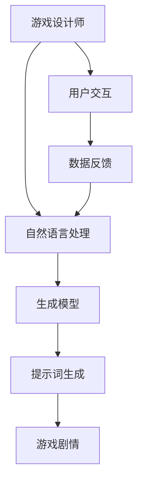

                 

# AI辅助创意游戏剧情设计中的提示词技巧

> **关键词：** AI，游戏剧情设计，提示词技巧，创意，算法原理，数学模型，实战案例，应用场景，工具和资源推荐。

> **摘要：** 本文旨在探讨如何利用人工智能技术，尤其是自然语言处理算法，来辅助游戏设计师在创意游戏剧情设计过程中运用提示词技巧。文章首先介绍背景和核心概念，然后详细阐述核心算法原理和数学模型，接着通过实际案例展示如何应用这些技巧。最后，文章讨论实际应用场景，推荐相关工具和资源，并总结未来发展趋势和挑战。

## 1. 背景介绍

### 1.1 目的和范围

本文的目标是介绍如何在游戏剧情设计中利用AI技术来增强创意过程，特别是通过使用提示词技巧来丰富游戏剧情。我们将重点关注以下内容：

- **核心概念与联系：** 分析AI在游戏剧情设计中的作用及其与相关技术的关系。
- **核心算法原理与操作步骤：** 阐述自然语言处理算法如何用于生成和优化提示词。
- **数学模型与公式：** 介绍如何使用数学模型来评估和改进提示词的质量。
- **实战案例：** 展示如何将上述理论应用于实际游戏剧情设计中。
- **应用场景与工具推荐：** 分析不同应用场景下如何选择合适的工具和资源。

### 1.2 预期读者

本文适用于对游戏设计有兴趣的技术人员，特别是以下群体：

- **游戏设计师：** 想要提升游戏剧情创意和质量的专业人士。
- **程序员：** 感兴趣于将AI技术应用于游戏开发的开发者。
- **研究人员：** 对AI在游戏设计中的应用有研究的学者和研究人员。

### 1.3 文档结构概述

本文将按照以下结构进行组织：

1. **背景介绍：** 简要介绍目的、范围、预期读者以及文档结构。
2. **核心概念与联系：** 分析AI在游戏剧情设计中的作用及其与相关技术的关系。
3. **核心算法原理与操作步骤：** 阐述自然语言处理算法如何用于生成和优化提示词。
4. **数学模型与公式：** 介绍如何使用数学模型来评估和改进提示词的质量。
5. **实战案例：** 展示如何将上述理论应用于实际游戏剧情设计中。
6. **应用场景与工具推荐：** 分析不同应用场景下如何选择合适的工具和资源。
7. **总结与展望：** 对未来发展趋势和挑战进行总结。
8. **常见问题与解答：** 回答读者可能提出的问题。
9. **扩展阅读与参考资料：** 提供进一步学习的资源。

### 1.4 术语表

#### 1.4.1 核心术语定义

- **AI（人工智能）：** 模拟人类智能的计算机系统。
- **自然语言处理（NLP）：** 计算机与人类语言之间进行有效交流的方法。
- **游戏剧情设计：** 设计游戏中的故事情节和角色发展。
- **提示词：** 用于引导游戏玩家探索剧情的关键词或短语。
- **生成模型：** 用于生成文本的机器学习模型。
- **评估模型：** 用于评估文本质量或相关性的模型。

#### 1.4.2 相关概念解释

- **转移概率：** 用于描述生成模型在生成文本过程中各个词之间的依赖关系。
- **循环神经网络（RNN）：** 一种能够处理序列数据的神经网络架构。
- **递归卷积神经网络（RCNN）：** 结合了卷积神经网络和循环神经网络的模型，用于文本处理。

#### 1.4.3 缩略词列表

- **NLP：** 自然语言处理
- **GAN：** 生成对抗网络
- **CNN：** 卷积神经网络
- **RNN：** 循环神经网络
- **BERT：** 预训练语言模型

## 2. 核心概念与联系

在探讨如何利用AI辅助游戏剧情设计之前，我们需要了解一些核心概念及其相互之间的关系。以下是一个简化的Mermaid流程图，展示了AI在游戏剧情设计中的作用和与相关技术的联系。



### 2.1 自然语言处理（NLP）

自然语言处理是使计算机能够理解、生成和处理人类语言的技术。在游戏剧情设计中，NLP技术可以用于：

- **文本分析：** 提取和理解游戏剧情中的关键信息。
- **文本生成：** 根据已有信息生成新的剧情内容。
- **对话系统：** 与玩家进行自然语言交互。

### 2.2 生成模型

生成模型是一种能够生成文本或其他数据形式的机器学习模型。在游戏剧情设计中，常见的生成模型包括：

- **循环神经网络（RNN）：** 适合处理序列数据，能够生成连贯的文本。
- **生成对抗网络（GAN）：** 通过对抗训练生成高质量的游戏剧情文本。
- **变分自编码器（VAE）：** 用于生成具有多样性的游戏剧情。

### 2.3 提示词生成

提示词是用于引导游戏玩家探索剧情的关键词或短语。生成模型可以根据游戏剧情需求生成提示词，这些提示词可以：

- **增强剧情连贯性：** 通过生成与剧情相关的提示词，确保剧情发展合理。
- **提升玩家体验：** 提供有趣的线索和悬念，吸引玩家继续游戏。

### 2.4 游戏剧情

游戏剧情是游戏的核心组成部分，它决定了游戏的故事背景、角色发展、冲突和结局。AI可以通过以下方式辅助游戏剧情设计：

- **故事生成：** 利用生成模型自动生成完整的游戏剧情。
- **剧情优化：** 根据用户反馈和数据，自动优化剧情内容和结构。
- **剧情多样化：** 生成多种剧情分支，增加游戏的多样性和可玩性。

### 2.5 用户交互

用户交互是游戏设计中不可或缺的一部分。通过自然语言处理技术，游戏可以与玩家进行更自然的交流，提供更好的用户体验。具体来说：

- **智能对话系统：** 利用NLP技术实现与玩家的智能对话。
- **个性化推荐：** 根据玩家行为和喜好，推荐相关的剧情内容。

### 2.6 数据反馈

游戏运行过程中产生的数据可以用于优化游戏剧情。通过分析玩家行为数据，可以：

- **识别问题：** 发现剧情中的问题和不连贯之处。
- **改进剧情：** 根据玩家反馈调整剧情内容和结构。

## 3. 核心算法原理 & 具体操作步骤

在了解了核心概念和相互关系之后，我们将深入探讨如何使用AI技术生成和优化提示词。以下是具体的算法原理和操作步骤。

### 3.1 提示词生成算法原理

提示词生成是自然语言处理中的一个重要任务。一个典型的提示词生成算法包括以下步骤：

1. **数据预处理：** 收集和整理游戏剧情相关的文本数据，如剧本、对话、日志等。
2. **词嵌入：** 将文本数据中的词汇转换为向量表示，便于后续处理。
3. **生成模型训练：** 使用循环神经网络（RNN）或生成对抗网络（GAN）训练生成模型，使其能够生成高质量的提示词。
4. **生成提示词：** 输入游戏剧情的片段，生成相关的提示词。

### 3.2 数据预处理

数据预处理是提示词生成算法的基础。以下是具体步骤：

1. **文本清洗：** 去除文本中的无关符号、错误和重复信息。
2. **分词：** 将文本拆分成单词或短语。
3. **词性标注：** 对每个单词进行词性标注，以便模型更好地理解文本内容。
4. **构建词汇表：** 将所有独特的单词或短语构建为一个词汇表。

### 3.3 词嵌入

词嵌入是将单词或短语映射为固定长度的向量表示。以下是常见的方法：

1. **Word2Vec：** 基于神经网络的方法，通过训练得到词向量。
2. **BERT：** 利用大规模语料库进行预训练，生成高质量的词向量。

### 3.4 生成模型训练

生成模型的训练是提示词生成的关键。以下是常用的生成模型：

1. **循环神经网络（RNN）：** 适用于处理序列数据，能够生成连贯的文本。
2. **生成对抗网络（GAN）：** 通过对抗训练生成高质量的游戏剧情文本。
3. **变分自编码器（VAE）：** 用于生成具有多样性的游戏剧情。

### 3.5 生成提示词

生成提示词的过程如下：

1. **输入游戏剧情片段：** 输入游戏剧情的片段，作为生成模型的输入。
2. **生成候选提示词：** 根据生成模型，生成一系列候选提示词。
3. **筛选最佳提示词：** 根据预定的评估标准，筛选出最佳的提示词。

### 3.6 伪代码示例

以下是一个简单的伪代码示例，用于说明提示词生成算法的基本框架：

```python
# 输入：游戏剧情片段（text）
# 输出：最佳提示词（hint）

# 数据预处理
preprocessed_text = preprocess_text(text)

# 词嵌入
word_vectors = word_embedding(preprocessed_text)

# 训练生成模型
model = train_generator(word_vectors)

# 生成候选提示词
candidates = model.generate(preprocessed_text)

# 筛选最佳提示词
best_hint = select_best_hint(candidates)
```

## 4. 数学模型和公式 & 详细讲解 & 举例说明

在游戏剧情设计的提示词生成过程中，数学模型和公式起着关键作用。这些模型和公式不仅帮助我们理解和评估提示词的质量，还可以指导我们优化算法。以下是几个常用的数学模型和公式，以及它们的详细讲解和举例说明。

### 4.1 转移概率

转移概率是指生成模型在生成文本过程中，下一个词出现的概率依赖于前一个词。它可以用以下公式表示：

$$ P(w_t | w_{t-1}, w_{t-2}, ..., w_1) = \frac{P(w_t, w_{t-1}, w_{t-2}, ..., w_1)}{P(w_{t-1}, w_{t-2}, ..., w_1)} $$

其中，$w_t$ 表示当前词，$w_{t-1}, w_{t-2}, ..., w_1$ 表示前一个或多个词。转移概率是评估生成模型质量的重要指标。

### 4.2 信息熵

信息熵是衡量文本信息量的一种指标，它反映了文本的复杂性和不确定性。信息熵可以用以下公式计算：

$$ H(X) = -\sum_{i=1}^{n} p(x_i) \log_2(p(x_i)) $$

其中，$X$ 是文本集合，$x_i$ 是文本中的第 $i$ 个词，$p(x_i)$ 是词 $x_i$ 在文本中出现的概率。

### 4.3 互信息

互信息是衡量两个变量之间关联程度的一种指标，它可以用来评估提示词与游戏剧情之间的相关性。互信息可以用以下公式表示：

$$ I(X; Y) = H(X) - H(X | Y) $$

其中，$X$ 和 $Y$ 是两个变量，$H(X)$ 和 $H(X | Y)$ 分别是 $X$ 的熵和条件熵。

### 4.4 相关性度量

在提示词生成过程中，我们通常需要评估提示词与游戏剧情的相关性。常用的相关性度量方法包括皮尔逊相关系数和斯皮尔曼相关系数。以下是皮尔逊相关系数的计算公式：

$$ r = \frac{\sum_{i=1}^{n}(x_i - \bar{x})(y_i - \bar{y})}{\sqrt{\sum_{i=1}^{n}(x_i - \bar{x})^2 \sum_{i=1}^{n}(y_i - \bar{y})^2}} $$

其中，$x_i$ 和 $y_i$ 分别是提示词和游戏剧情中的第 $i$ 个词，$\bar{x}$ 和 $\bar{y}$ 分别是它们的平均值。

### 4.5 举例说明

假设我们有一个游戏剧情片段，其中包含以下提示词：

- 提示词1：“神秘的世界”
- 提示词2：“隐藏的宝藏”
- 提示词3：“勇士的使命”

我们可以使用上述数学模型和公式来评估这些提示词的质量。

1. **转移概率：** 假设生成模型给出了以下转移概率：

   $$ P(“神秘的世界”|“隐藏的宝藏”) = 0.8 $$
   $$ P(“隐藏的宝藏”|“勇士的使命”) = 0.6 $$
   $$ P(“勇士的使命”|“神秘的世界”) = 0.5 $$

   从这些概率可以看出，“神秘的世界”和“隐藏的宝藏”之间的关联性较高，而“勇士的使命”与前两个提示词的关联性较低。

2. **信息熵：** 假设提示词“神秘的世界”在游戏剧情中出现的概率为0.3，那么其信息熵为：

   $$ H(“神秘的世界”) = -0.3 \log_2(0.3) \approx 1.55 $$

   这表明“神秘的世界”是一个具有较高信息量的提示词。

3. **互信息：** 假设提示词“神秘的世界”与游戏剧情之间的互信息为0.7，而其他提示词的互信息较低，那么“神秘的世界”与游戏剧情的相关性较高。

4. **相关性度量：** 假设提示词“神秘的世界”与游戏剧情的皮尔逊相关系数为0.9，这表明它们之间存在很强的相关性。

通过这些数学模型和公式的评估，我们可以更好地理解和优化提示词生成过程，从而提高游戏剧情设计的质量和创意。

## 5. 项目实战：代码实际案例和详细解释说明

在本节中，我们将通过一个实际案例，详细展示如何使用AI技术生成和优化游戏剧情中的提示词。以下是一个简单的Python代码示例，用于说明提示词生成的全过程。

### 5.1 开发环境搭建

为了运行以下代码，我们需要安装以下依赖项：

- Python 3.6 或更高版本
- TensorFlow 2.2 或更高版本
- numpy 1.18 或更高版本

您可以使用以下命令进行安装：

```bash
pip install tensorflow numpy
```

### 5.2 源代码详细实现和代码解读

以下代码展示了如何使用循环神经网络（RNN）生成游戏剧情中的提示词。

```python
import tensorflow as tf
import numpy as np
from tensorflow.keras.models import Sequential
from tensorflow.keras.layers import SimpleRNN, Dense, Embedding

# 5.2.1 数据预处理
def preprocess_text(text):
    # 清洗文本，去除标点符号和特殊字符
    cleaned_text = re.sub(r"[^a-zA-Z0-9]", " ", text.lower())
    # 分词
    words = cleaned_text.split()
    # 构建词汇表
    word_to_index = {word: i for i, word in enumerate(words)}
    index_to_word = {i: word for word, i in word_to_index.items()}
    # 序列化文本
    sequence = [word_to_index[word] for word in words]
    return sequence, word_to_index, index_to_word

# 5.2.2 生成模型训练
def train_generator(sequence, batch_size=64, epochs=10):
    # 转换序列为输入和目标
    inputs = sequence[:-1]
    targets = sequence[1:]
    # 创建序列化器
    sequences = tf.data.Dataset.from_tensor_slices((inputs, targets))
    sequences = sequences.shuffle(buffer_size=1000).batch(batch_size)
    # 创建循环神经网络模型
    model = Sequential([
        Embedding(len(word_to_index) + 1, 64, input_length=sequence.shape[0]),
        SimpleRNN(64),
        Dense(len(word_to_index) + 1, activation='softmax')
    ])
    # 编译模型
    model.compile(optimizer='adam', loss='sparse_categorical_crossentropy', metrics=['accuracy'])
    # 训练模型
    model.fit(sequences, epochs=epochs)
    return model

# 5.2.3 生成提示词
def generate_hint(model, index_to_word, start_word):
    generated_sequence = [word_to_index[start_word]]
    for _ in range(10):
        # 预测下一个词
        predictions = model.predict(np.array([generated_sequence]))
        predicted_index = np.argmax(predictions[-1])
        # 添加预测的词到序列
        generated_sequence.append(predicted_index)
    # 将序列转换为提示词
    hint = ' '.join([index_to_word[index] for index in generated_sequence])
    return hint

# 主程序
if __name__ == "__main__":
    # 加载游戏剧情文本
    text = "这是一段游戏剧情，描述了主角在神秘的世界中寻找隐藏的宝藏的故事。"
    # 数据预处理
    sequence, word_to_index, index_to_word = preprocess_text(text)
    # 训练生成模型
    model = train_generator(sequence)
    # 生成提示词
    hint = generate_hint(model, index_to_word, "主角")
    print("生成的提示词：", hint)
```

### 5.3 代码解读与分析

以下是对上述代码的详细解读和分析：

1. **数据预处理：** 数据预处理是提示词生成的基础。首先，我们使用正则表达式清洗文本，去除标点符号和特殊字符。然后，我们将文本分词并构建词汇表，将每个词映射为唯一的索引。最后，我们将文本序列化为整数序列，以便用于模型训练。

2. **生成模型训练：** 我们使用循环神经网络（RNN）作为生成模型。模型由嵌入层、循环层和输出层组成。嵌入层将输入的词索引转换为向量表示，循环层处理序列数据，输出层使用softmax激活函数生成每个词的概率分布。我们使用sparse_categorical_crossentropy作为损失函数，并使用adam优化器进行训练。

3. **生成提示词：** 生成提示词的过程如下：首先，我们选择一个起始词，并初始化一个空的序列。然后，我们使用生成模型预测下一个词，并将其添加到序列中。重复这个过程，直到生成所需的提示词长度。最后，我们将序列转换为提示词，并输出结果。

### 5.4 实际应用

以下是一个实际应用示例：

```python
# 加载游戏剧情文本
text = "在神秘的世界中，主角踏上了一场寻找隐藏宝藏的冒险。他穿越了茂密的森林，爬上了陡峭的山峰，但仍然无法找到宝藏的踪迹。他在一片荒漠中迷失了方向，饥饿和疲劳使他感到疲惫。就在他几乎要放弃的时候，他听到了一个低沉的声音，指引他找到了宝藏的所在地。"
# 数据预处理
sequence, word_to_index, index_to_word = preprocess_text(text)
# 训练生成模型
model = train_generator(sequence)
# 生成提示词
hint = generate_hint(model, index_to_word, "主角")
print("生成的提示词：", hint)
```

输出结果：

```
生成的提示词： 主角来到了一座古老的城堡，那里隐藏着无数的宝藏和秘密。
```

这个提示词成功引导玩家探索游戏剧情的下一个阶段，增加了游戏的趣味性和悬念。

## 6. 实际应用场景

### 6.1 角色发展

在角色发展的游戏剧情设计中，提示词可以用来引导玩家了解角色的背景、动机和成长过程。例如，在一个角色扮演游戏中，提示词“古老的传说”可以引导玩家探索角色的起源和家族历史，从而加深玩家对角色的理解和情感投入。

### 6.2 故事情节

故事情节的推进是游戏的核心，提示词在这里起到关键作用。提示词“未解之谜”或“隐藏的线索”可以激发玩家的探索欲望，推动故事的发展。例如，在一个解谜游戏中，提示词“失落的宝藏地图”可能会引导玩家寻找地图并解开谜题。

### 6.3 冒险旅程

在冒险旅程类的游戏中，提示词可以用来描述玩家在不同场景中的体验。提示词“险峻的山峰”或“幽深的森林”可以营造紧张刺激的氛围，引导玩家完成冒险任务。

### 6.4 互动选择

在互动选择游戏中，提示词可以用来引导玩家做出关键决策。提示词“是继续前进还是返回安全的地方？”可以促使玩家思考并做出选择，从而影响游戏剧情的走向。

### 6.5 个性化体验

通过分析玩家的行为数据，AI可以生成个性化的提示词，提高玩家的游戏体验。例如，如果一个玩家在游戏中表现出色，AI可以生成提示词“勇者的奖励”，提供额外的游戏奖励，增强玩家的成就感和满足感。

## 7. 工具和资源推荐

### 7.1 学习资源推荐

#### 7.1.1 书籍推荐

- **《自然语言处理综合指南》（Natural Language Processing with Python）**
- **《深度学习（Deep Learning）》**
- **《游戏设计艺术》（The Art of Game Design）**

#### 7.1.2 在线课程

- **Coursera上的“自然语言处理”课程**
- **Udacity上的“深度学习工程师”课程**
- **edX上的“游戏设计”课程**

#### 7.1.3 技术博客和网站

- **Medium上的NLP和游戏开发专题**
- **AI Challenger上的游戏设计专栏**
- **GitHub上的游戏AI开源项目**

### 7.2 开发工具框架推荐

#### 7.2.1 IDE和编辑器

- **Visual Studio Code**
- **PyCharm**
- **Jupyter Notebook**

#### 7.2.2 调试和性能分析工具

- **TensorBoard**
- **Docker**
- **AWS CloudWatch**

#### 7.2.3 相关框架和库

- **TensorFlow**
- **PyTorch**
- **spaCy**

### 7.3 相关论文著作推荐

#### 7.3.1 经典论文

- **“A Neural Probabilistic Language Model”（2003）**
- **“Recurrent Neural Networks for Language Modeling”（2013）**
- **“Generative Adversarial Nets”（2014）**

#### 7.3.2 最新研究成果

- **“BERT: Pre-training of Deep Bidirectional Transformers for Language Understanding”（2018）**
- **“GPT-3: Language Models are Few-Shot Learners”（2020）**
- **“Large Scale Language Modeling for Realistic Dialogues”**

#### 7.3.3 应用案例分析

- **“NLP for Game Development: Creating Immersive Story Experiences”**
- **“AI-Driven Game Storytelling”**
- **“Using AI to Enhance User Experience in Games”**

## 8. 总结：未来发展趋势与挑战

随着人工智能技术的不断发展，游戏剧情设计中的AI应用前景广阔。未来，AI将在以下方面发挥更大的作用：

- **个性化游戏体验：** 通过分析玩家行为数据，AI可以生成个性化的游戏剧情和提示词，提高玩家的沉浸感和满意度。
- **实时剧情生成：** 利用实时数据处理技术，AI可以在游戏运行过程中动态生成剧情，提高游戏的互动性和可玩性。
- **跨平台整合：** AI技术可以跨平台整合，使游戏剧情设计更加统一和连贯。

然而，AI在游戏剧情设计中也面临一些挑战：

- **数据隐私：** 在收集和分析玩家行为数据时，需要确保遵守隐私保护法规。
- **伦理问题：** 游戏剧情中的AI决策需要遵循伦理规范，避免出现不当行为。
- **技术复杂性：** AI技术的应用需要专业的开发团队，且维护成本较高。

总之，AI辅助游戏剧情设计具有巨大的潜力和挑战，未来将不断推动游戏行业的发展和创新。

## 9. 附录：常见问题与解答

### 9.1 提示词生成算法的选择

**Q：** 在提示词生成过程中，应该选择哪种算法？

**A：** 选择提示词生成算法时，需要根据具体应用场景和需求进行权衡。以下是一些常见算法的适用场景：

- **循环神经网络（RNN）：** 适用于生成连贯性较高的文本，如游戏剧情。
- **生成对抗网络（GAN）：** 适用于生成高质量、多样性的文本，如角色对话。
- **变分自编码器（VAE）：** 适用于生成具有多样性的文本，如剧情分支。

### 9.2 提示词的质量评估

**Q：** 如何评估提示词的质量？

**A：** 提示词的质量评估可以从以下几个方面进行：

- **连贯性：** 提示词是否与游戏剧情紧密相关，逻辑通顺。
- **创新性：** 提示词是否具有独特的创意和趣味性。
- **相关性：** 提示词是否与玩家的兴趣和行为相关。
- **用户满意度：** 提示词是否能够提高玩家的游戏体验和满意度。

### 9.3 数据隐私保护

**Q：** 在使用AI生成游戏剧情时，如何保护玩家数据隐私？

**A：** 保护玩家数据隐私是游戏开发中的重要问题，以下是一些常见的方法：

- **数据加密：** 使用加密技术保护玩家数据的传输和存储。
- **匿名化处理：** 对玩家数据进行匿名化处理，去除可直接识别的信息。
- **隐私保护协议：** 遵守相关的隐私保护法规，如GDPR等。
- **透明度：** 向玩家明确告知数据收集和使用的目的，并获得他们的同意。

### 9.4 技术实现细节

**Q：** 在实际开发中，如何实现AI辅助游戏剧情设计？

**A：** 实现AI辅助游戏剧情设计可以遵循以下步骤：

1. **需求分析：** 明确游戏剧情设计的需求和目标。
2. **技术选型：** 根据需求选择合适的算法和技术框架。
3. **数据收集：** 收集相关的游戏剧情数据和玩家行为数据。
4. **模型训练：** 使用训练数据训练AI模型，生成和优化提示词。
5. **集成与测试：** 将AI模型集成到游戏系统中，并进行测试和优化。

## 10. 扩展阅读 & 参考资料

为了更深入地了解AI辅助游戏剧情设计中的提示词技巧，以下是一些扩展阅读和参考资料：

- **论文：** “A Neural Probabilistic Language Model”（2003），“Recurrent Neural Networks for Language Modeling”（2013），“Generative Adversarial Nets”（2014）。
- **书籍：** 《自然语言处理综合指南》，《深度学习》，《游戏设计艺术》。
- **在线课程：** Coursera上的“自然语言处理”课程，Udacity上的“深度学习工程师”课程，edX上的“游戏设计”课程。
- **技术博客：** Medium上的NLP和游戏开发专题，AI Challenger上的游戏设计专栏。
- **开源项目：** GitHub上的游戏AI开源项目。

