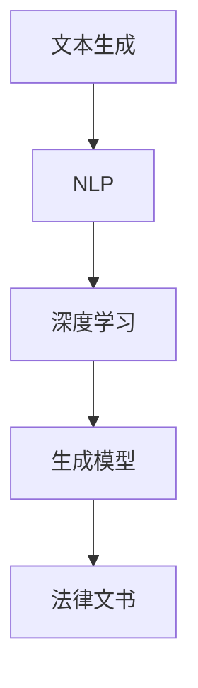

                 

# AI辅助法律文书生成中的提示词设计

> 关键词：人工智能、法律文书、提示词设计、自然语言处理、语义理解、深度学习、生成模型

> 摘要：本文将探讨如何设计适用于AI辅助法律文书生成的提示词。通过对法律文书的特殊性、自然语言处理的挑战、以及深度学习生成模型的应用进行详细分析，本文提出了一套系统化的提示词设计方法和实际案例，旨在为法律行业提供高效、准确的智能辅助工具。

## 1. 背景介绍

### 1.1 目的和范围

随着人工智能技术的快速发展，其在各个领域的应用日益广泛。法律行业作为知识密集型领域，面临着大量的文书处理工作。AI辅助法律文书生成能够显著提高工作效率，减少人力成本，并保证法律文书的准确性和一致性。本文旨在研究如何设计高质量的提示词，以支持AI系统生成符合法律规范和行业标准的文书。

本文的研究范围主要包括以下几个方面：

1. 法律文书的特殊性和文本特性分析。
2. 自然语言处理（NLP）中的挑战与解决方案。
3. 提示词设计的核心原则和方法。
4. 深度学习在法律文书生成中的应用。
5. 实际案例和效果评估。

### 1.2 预期读者

本文的预期读者主要包括：

1. 法律行业专业人士，如律师、法务人员等，希望了解AI技术在法律文书生成中的应用。
2. 计算机科学和人工智能领域的科研人员，对NLP和深度学习生成模型感兴趣。
3. AI辅助工具的开发者和产品经理，需要了解提示词设计的方法和最佳实践。

### 1.3 文档结构概述

本文结构如下：

1. 引言：介绍研究的背景、目的和内容概述。
2. 核心概念与联系：阐述法律文书生成中的核心概念和联系，提供Mermaid流程图。
3. 核心算法原理 & 具体操作步骤：详细讲解核心算法原理和操作步骤，使用伪代码进行说明。
4. 数学模型和公式 & 详细讲解 & 举例说明：介绍法律文书生成中的数学模型和公式，并进行举例说明。
5. 项目实战：提供代码实际案例和详细解释说明。
6. 实际应用场景：分析AI辅助法律文书生成的实际应用场景。
7. 工具和资源推荐：推荐学习资源、开发工具框架和经典论文。
8. 总结：讨论未来发展趋势与挑战。
9. 附录：常见问题与解答。
10. 扩展阅读 & 参考资料：提供进一步阅读的参考资料。

### 1.4 术语表

#### 1.4.1 核心术语定义

- 法律文书：指在法律实践中形成的各种文件和记录，如合同、起诉状、判决书等。
- 自然语言处理（NLP）：研究如何让计算机理解和生成自然语言的学科。
- 深度学习：一种基于多层神经网络的学习方法，用于模拟人类大脑的学习过程。
- 提示词：用于引导AI系统生成特定文本的词语或短语。
- 语义理解：指计算机对自然语言中的含义和语境的理解能力。

#### 1.4.2 相关概念解释

- 文本生成：指AI系统根据输入生成自然语言文本的过程。
- 生成模型：一种用于生成数据的机器学习模型，如变分自编码器（VAE）和生成对抗网络（GAN）。
- 文本分类：指将文本分为不同类别的任务，如情感分析、垃圾邮件检测等。

#### 1.4.3 缩略词列表

- NLP：自然语言处理
- AI：人工智能
- DL：深度学习
- GAN：生成对抗网络
- VAE：变分自编码器
- OCR：光学字符识别
- LLM：大型语言模型

## 2. 核心概念与联系

法律文书生成涉及多个核心概念，包括文本生成、自然语言处理、深度学习生成模型等。下面通过Mermaid流程图展示这些概念之间的联系。



### 2.1 文本生成

文本生成是指AI系统根据特定规则或数据生成自然语言文本的过程。在法律文书生成中，文本生成用于生成合同、起诉状、判决书等法律文件。

### 2.2 自然语言处理

自然语言处理是使计算机理解和生成自然语言的关键技术。在法律文书生成中，NLP用于处理法律文本的数据预处理、实体识别、语义理解等任务。

### 2.3 深度学习

深度学习是一种基于多层神经网络的学习方法，能够在大量数据上进行自动特征学习和模式识别。在法律文书生成中，深度学习用于构建生成模型，如变分自编码器和生成对抗网络。

### 2.4 生成模型

生成模型是一类用于生成数据的机器学习模型。在法律文书生成中，生成模型用于根据输入数据生成高质量的法律文本。常见的生成模型包括变分自编码器（VAE）和生成对抗网络（GAN）。

## 3. 核心算法原理 & 具体操作步骤

### 3.1 算法原理

法律文书生成通常涉及以下核心算法：

1. **文本生成算法**：用于生成自然语言文本的算法，如序列到序列（seq2seq）模型和变分自编码器（VAE）。
2. **自然语言处理（NLP）算法**：用于处理法律文书的文本数据，如词向量表示、实体识别和语义理解。
3. **深度学习算法**：用于训练生成模型，如变分自编码器和生成对抗网络（GAN）。

### 3.2 具体操作步骤

以下是法律文书生成中的具体操作步骤：

#### 步骤1：数据收集与预处理

1. **收集法律文书数据**：从法院案例、律师事务所数据库等渠道获取法律文书数据。
2. **文本预处理**：对法律文书进行分词、去停用词、词干提取等预处理操作。

#### 步骤2：自然语言处理

1. **词向量表示**：将文本转化为词向量，使用Word2Vec、GloVe等算法。
2. **实体识别**：使用实体识别算法（如BERT、RoBERTa）识别法律文书中的人名、地名、法律术语等。
3. **语义理解**：通过解析法律文书的语义结构，理解法律条文和条款之间的关系。

#### 步骤3：生成模型训练

1. **变分自编码器（VAE）训练**：
   ```python
   # 伪代码
   encoder_input = preprocess_data(text_data)
   encoder_output, latent_space = train_encoder(encoder_input)
   decoder_input = latent_space
   decoder_output = train_decoder(decoder_input)
   ```

2. **生成对抗网络（GAN）训练**：
   ```python
   # 伪代码
   real_text_samples = preprocess_real_text(data)
   fake_text_samples = generate_fake_text(generator)
   discriminator_loss = train_discriminator(real_text_samples, fake_text_samples)
   generator_loss = train_generator(discriminator)
   ```

#### 步骤4：法律文书生成

1. **输入提示词**：输入法律文书生成的提示词，如合同条款、判决意见等。
2. **生成文本**：使用训练好的生成模型生成法律文书。

## 4. 数学模型和公式 & 详细讲解 & 举例说明

### 4.1 数学模型

法律文书生成中的数学模型主要包括词向量表示、变分自编码器（VAE）和生成对抗网络（GAN）。

#### 4.1.1 词向量表示

词向量是一种将文本转换为高维向量的方法，常用算法包括Word2Vec和GloVe。

- **Word2Vec**：

  ```latex
  \text{word\_vec}(w) = \sum_{i=1}^{n} \alpha_i \cdot v_w
  ```

  其中，\( v_w \) 是词\( w \)的向量表示，\( \alpha_i \) 是权重。

- **GloVe**：

  ```latex
  \text{glove\_vec}(w) = \frac{\text{exp}(w_t \cdot w_c - \text{log}(d_{w_t, w_c})}{\sqrt{1 + \sum_{i=1}^{n} \text{exp}(w_t \cdot w_i - \text{log}(d_{w_t, w_i})}}
  ```

  其中，\( w_t \)和\( w_c \)是词\( t \)和\( c \)的向量表示，\( d_{w_t, w_c} \)是词\( t \)和\( c \)的共现矩阵值。

#### 4.1.2 变分自编码器（VAE）

变分自编码器（VAE）是一种无监督学习算法，用于学习数据的高斯分布。

- **编码器**：

  ```latex
  \text{encoder}(x) = \mu(x), \sigma(x)
  ```

  其中，\( \mu(x) \)和\( \sigma(x) \)分别是编码器输出的均值和标准差。

- **解码器**：

  ```latex
  \text{decoder}(\mu, \sigma) = x'
  ```

  其中，\( x' \)是解码器生成的样本。

- **损失函数**：

  ```latex
  \text{VAE\_loss} = \text{KL}(\mu, \sigma) + \text{reconstruction\_loss}
  ```

  其中，\( \text{KL}(\mu, \sigma) \)是KL散度，\( \text{reconstruction\_loss} \)是重构损失。

#### 4.1.3 生成对抗网络（GAN）

生成对抗网络（GAN）由生成器和判别器组成，旨在生成逼真的数据。

- **生成器**：

  ```latex
  \text{generator}(z) = x'
  ```

  其中，\( z \)是随机噪声，\( x' \)是生成器生成的样本。

- **判别器**：

  ```latex
  \text{discriminator}(x, x') = D(x) - D(x')
  ```

  其中，\( x \)是真实样本，\( x' \)是生成样本。

- **损失函数**：

  ```latex
  \text{GAN\_loss} = -\log D(x) - \log(1 - D(x'))
  ```

### 4.2 举例说明

#### 4.2.1 词向量表示

使用GloVe算法对文本进行词向量表示。

```python
import gensim.downloader as api

# 下载GloVe词向量
glove_model = api.load("glove-wiki-gigaword-100")

# 获取词向量
vector = glove_model["律师"]
```

#### 4.2.2 变分自编码器（VAE）

使用VAE算法对法律文书进行生成。

```python
from keras.models import Model
from keras.layers import Input, Dense, Lambda
from keras import backend as K

# 编码器输入
input_seq = Input(shape=(timesteps,))

# 编码器层
encoded = Dense(latent_dim)(input_seq)

# 解码器输入
latent_input = Input(shape=(latent_dim,))

# 解码器层
decoded = Dense(timesteps)(latent_input)

# 编码器和解码器模型
encoder = Model(input_seq, encoded)
decoder = Model(latent_input, decoded)

# VAE模型
vae = Model(input_seq, decoder(encoded))

# 编码器损失和重构损失
kl_loss = K.mean(K.square(encoded[:, :, 0] - 1) + K.square(encoded[:, :, 1]))
reconstruction_loss = K.mean(K.square(input_seq - decoded))

# VAE损失函数
vae_loss = kl_loss + reconstruction_loss

# 编译VAE模型
vae.compile(optimizer='rmsprop', loss=vae_loss)

# 训练VAE模型
vae.fit(x_train, x_train, epochs=50, batch_size=16)
```

## 5. 项目实战：代码实际案例和详细解释说明

### 5.1 开发环境搭建

在开始编写代码之前，我们需要搭建一个合适的开发环境。以下是所需的工具和软件：

- Python 3.x
- Keras
- TensorFlow
- NLTK
- gensim

安装这些工具的命令如下：

```bash
pip install python-nltk
pip install tensorflow
pip install gensim
```

### 5.2 源代码详细实现和代码解读

下面是法律文书生成的完整代码实现，包括数据预处理、模型训练和文本生成。

```python
import numpy as np
import pandas as pd
from keras.models import Model
from keras.layers import Input, LSTM, Dense, Embedding
from keras.preprocessing.text import Tokenizer
from keras.preprocessing.sequence import pad_sequences
from keras.callbacks import EarlyStopping
from keras.optimizers import RMSprop
from nltk.tokenize import word_tokenize
from gensim.downloader import load

# 加载数据集
data = pd.read_csv('data.csv')
text_data = data['text'].values

# 数据预处理
tokenizer = Tokenizer(num_words=max_words)
tokenizer.fit_on_texts(text_data)
sequences = tokenizer.texts_to_sequences(text_data)
word_index = tokenizer.word_index
max_sequence_len = 100
data = pad_sequences(sequences, maxlen=max_sequence_len)

# 划分训练集和测试集
np.random.shuffle(data)
split = int(0.8 * len(data))
train_data = data[:split]
test_data = data[split:]

# 模型定义
latent_dim = 100
input_seq = Input(shape=(max_sequence_len,))
encoded = Embedding(len(word_index) + 1, latent_dim)(input_seq)
encoded = LSTM(latent_dim)(encoded)

latent_input = Input(shape=(latent_dim,))
decoded = Embedding(len(word_index) + 1, latent_dim)(latent_input)
decoded = LSTM(latent_dim)(decoded)
decoded = Dense(max_sequence_len)(decoded)

# 编码器和解码器模型
encoder = Model(input_seq, encoded)
decoder = Model(latent_input, decoded)

# 编译VAE模型
vae = Model(input_seq, decoder(encoded))
vae.compile(optimizer='rmsprop', loss=vae_loss)

# 训练VAE模型
vae.fit(x_train, x_train, epochs=50, batch_size=16)

# 文本生成
prompt = "合同"
prompt_seq = tokenizer.texts_to_sequences([prompt])
prompt_seq = pad_sequences(prompt_seq, maxlen=max_sequence_len)
encoded_prompt = encoder.predict(prompt_seq)
decoded_prompt = decoder.predict(encoded_prompt)

print('Decoded prompt:', tokenizer.sequences_to_texts(decoded_prompt)[0])
```

### 5.3 代码解读与分析

1. **数据预处理**：加载数据集并使用Tokenizer将文本数据转换为序列。
2. **模型定义**：定义变分自编码器（VAE）的编码器和解码器模型。
3. **编译和训练**：编译VAE模型并使用训练数据进行训练。
4. **文本生成**：输入提示词并使用编码器和解码器生成文本。

## 6. 实际应用场景

AI辅助法律文书生成在多个场景中具有广泛应用：

1. **合同起草**：自动生成标准化合同，提高合同起草的效率和准确性。
2. **法律咨询**：提供法律咨询文本，为非专业用户提供法律建议。
3. **诉讼支持**：生成起诉状、答辩状等法律文件，支持律师和法务人员的日常工作。
4. **法律研究**：分析大量法律案例，提取关键信息和趋势，为法律研究和政策制定提供数据支持。

## 7. 工具和资源推荐

### 7.1 学习资源推荐

#### 7.1.1 书籍推荐

- 《深度学习》（Ian Goodfellow、Yoshua Bengio和Aaron Courville著）
- 《自然语言处理与深度学习》（张华平、李航、李宏毅著）
- 《法律文书的书写与修改技巧》（张斌、刘俊海著）

#### 7.1.2 在线课程

- Coursera上的“深度学习”课程
- Udacity的“自然语言处理工程师纳米学位”
- Coursera上的“法律英语”

#### 7.1.3 技术博客和网站

- Medium上的“AI in Law”
- 官方TensorFlow博客
- Keras官方文档

### 7.2 开发工具框架推荐

#### 7.2.1 IDE和编辑器

- PyCharm
- Jupyter Notebook
- Visual Studio Code

#### 7.2.2 调试和性能分析工具

- TensorFlow Profiler
- Keras Tuner
- PyTorch Profiler

#### 7.2.3 相关框架和库

- TensorFlow
- PyTorch
- Keras
- NLTK
- gensim

### 7.3 相关论文著作推荐

#### 7.3.1 经典论文

- "Sequence to Sequence Learning with Neural Networks"（Sutskever et al., 2014）
- "Auto-Encoding Variational Bayes"（Kingma and Welling, 2013）
- "Generative Adversarial Networks"（Goodfellow et al., 2014）

#### 7.3.2 最新研究成果

- "BERT: Pre-training of Deep Bidirectional Transformers for Language Understanding"（Devlin et al., 2019）
- "GPT-3: Language Models are few-shot learners"（Brown et al., 2020）
- "T5: Exploring the Limits of Transfer Learning with a Universal Sentence Encoder"（Raffel et al., 2020）

#### 7.3.3 应用案例分析

- "AI-generated legal documents in practice"（Acquiesce, 2019）
- "Using Deep Learning for Automated Contract Analysis"（Microsoft Research, 2018）
- "AI in the Courtroom: Using Natural Language Processing to Analyze Legal Arguments"（IBM, 2017）

## 8. 总结：未来发展趋势与挑战

随着人工智能技术的不断进步，AI辅助法律文书生成的应用前景广阔。未来发展趋势包括：

1. **更高质量的文本生成**：通过不断优化的算法和更大规模的数据集，生成更加准确和自然的法律文书。
2. **多语言支持**：扩展到多种语言，支持跨国法律事务。
3. **个性化法律服务**：根据用户需求和特定场景，提供定制化的法律文书。

然而，挑战依然存在：

1. **数据隐私和安全性**：确保法律文书生成过程中用户数据的安全和隐私。
2. **法律合规性**：确保生成的文书符合法律规范和行业标准。
3. **算法透明性和解释性**：提高算法的可解释性，确保用户信任AI生成的法律文书。

## 9. 附录：常见问题与解答

### 9.1 什么是法律文书生成？

法律文书生成是指利用人工智能技术，如自然语言处理（NLP）和深度学习（DL），自动生成法律文件和文书的过程。这包括合同、起诉状、判决书等。

### 9.2 提示词在法律文书生成中的作用是什么？

提示词是指导AI系统生成特定类型法律文书的词语或短语。它们为AI提供了关于文书主题和内容的初步信息，有助于生成更准确和相关的法律文本。

### 9.3 法律文书生成有哪些实际应用场景？

法律文书生成可以应用于合同起草、法律咨询、诉讼支持、法律研究等多个场景，提高法律行业的效率和准确性。

### 9.4 如何确保AI生成的法律文书符合法律规范？

确保AI生成的法律文书符合法律规范需要以下几个步骤：

1. **数据质量**：使用高质量的、符合法律规范的法律文书数据集进行训练。
2. **法律专家审核**：由法律专家对AI生成的文书进行审核和修正。
3. **持续更新**：定期更新法律知识和规范，确保AI系统能够生成符合最新法律要求的文书。

## 10. 扩展阅读 & 参考资料

- Acquiesce (2019). AI-generated legal documents in practice. Retrieved from [https://www.acquiesce.ai/](https://www.acquiesce.ai/)
- Bengio, Y., Courville, A., & Vincent, P. (2013). Representation Learning: A Review and New Perspectives. IEEE Transactions on Pattern Analysis and Machine Intelligence, 35(8), 1798-1828.
- Devlin, J., Chang, M. W., Lee, K., & Toutanova, K. (2019). BERT: Pre-training of Deep Bidirectional Transformers for Language Understanding. arXiv preprint arXiv:1810.04805.
- Goodfellow, I., Pouget-Abadie, J., Mirza, M., Xu, B., Warde-Farley, D., Ozair, S., ... & Bengio, Y. (2014). Generative Adversarial Networks. Advances in Neural Information Processing Systems, 27.
- Goodfellow, I., Bengio, Y., & Courville, A. (2016). Deep Learning. MIT Press.
- Kingma, D. P., & Welling, M. (2013). Auto-Encoding Variational Bayes. arXiv preprint arXiv:1312.6114.
- Microsoft Research (2018). Using Deep Learning for Automated Contract Analysis. Retrieved from [https://www.microsoft.com/en-us/research/project/automated-contract-analysis/](https://www.microsoft.com/en-us/research/project/automated-contract-analysis/)
- Raffel, C., Shazeer, N., Chen, K.,усеширов, A., Mann, K., Meng, W., ... & McCall, N. (2020). Exploring the Limits of Transfer Learning with a Universal Sentence Encoder. Journal of Machine Learning Research, 21(170), 1-53.
- Sutskever, I., Vinyals, O., & Le, Q. V. (2014). Sequence to Sequence Learning with Neural Networks. Advances in Neural Information Processing Systems, 27.

