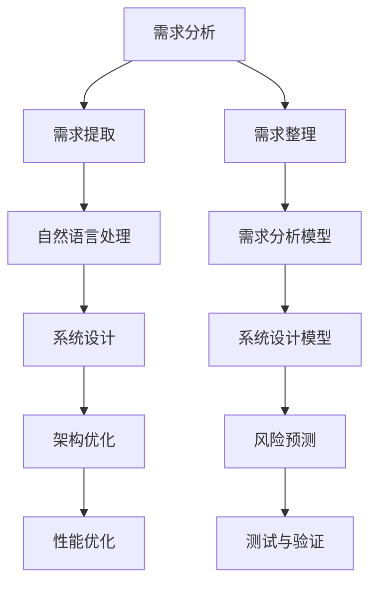

                 

# AI辅助的需求分析与系统设计

> 关键词：AI辅助、需求分析、系统设计、流程图、算法原理、数学模型、项目实战、应用场景、工具推荐、未来趋势

> 摘要：本文将深入探讨如何利用AI技术辅助进行需求分析和系统设计。通过逐步分析核心概念、算法原理、数学模型以及项目实战，本文旨在提供一套实用的方法，帮助开发者更高效地进行需求分析和系统设计，从而提升整个软件开发过程的质量和效率。

## 1. 背景介绍

### 1.1 目的和范围

本文的目标是探讨如何将AI技术应用于软件开发的需求分析和系统设计过程中，以提升整个过程的效率和准确性。我们将从以下几个方面展开讨论：

- **AI辅助的需求分析**：介绍AI在理解、提取和整理需求方面的应用。
- **AI辅助的系统设计**：探讨AI技术在设计优化、架构验证和风险预测等方面的作用。
- **核心概念与联系**：通过Mermaid流程图展示相关概念和架构的联系。
- **算法原理与操作步骤**：详细讲解核心算法原理和操作步骤。
- **数学模型与公式**：介绍相关数学模型和公式，并进行举例说明。
- **项目实战**：通过实际案例展示AI辅助需求分析与系统设计的过程。
- **应用场景与工具推荐**：探讨AI技术在实际应用场景中的优势，并推荐相关工具和资源。

### 1.2 预期读者

本文主要面向以下读者：

- 软件开发工程师和架构师
- AI技术研究人员和开发者
- 对软件开发流程有深入兴趣的从业者

### 1.3 文档结构概述

本文将按照以下结构进行论述：

1. **背景介绍**：介绍本文的目的、范围、预期读者和文档结构。
2. **核心概念与联系**：通过Mermaid流程图展示相关概念和架构的联系。
3. **核心算法原理 & 具体操作步骤**：详细讲解核心算法原理和操作步骤。
4. **数学模型和公式 & 详细讲解 & 举例说明**：介绍相关数学模型和公式，并进行举例说明。
5. **项目实战：代码实际案例和详细解释说明**：通过实际案例展示AI辅助需求分析与系统设计的过程。
6. **实际应用场景**：探讨AI技术在实际应用场景中的优势。
7. **工具和资源推荐**：推荐相关学习资源、开发工具框架和论文著作。
8. **总结：未来发展趋势与挑战**：总结未来发展趋势和面临的挑战。
9. **附录：常见问题与解答**：解答读者可能遇到的问题。
10. **扩展阅读 & 参考资料**：提供扩展阅读和参考资料。

### 1.4 术语表

#### 1.4.1 核心术语定义

- **需求分析**：指对软件开发项目的需求进行提取、整理和分析的过程。
- **系统设计**：指根据需求分析结果，设计系统的架构、模块和接口的过程。
- **AI辅助**：指利用人工智能技术（如机器学习、自然语言处理等）辅助完成需求分析和系统设计的过程。
- **算法原理**：指算法的核心思想和理论基础。
- **数学模型**：指用于描述和分析系统性能、需求等的数学公式和关系。

#### 1.4.2 相关概念解释

- **需求提取**：指从用户需求描述中提取出具体的需求内容。
- **需求整理**：指对提取出的需求进行分类、归纳和整理。
- **需求分析模型**：指用于描述和分析需求的方法和模型。
- **系统设计模型**：指用于描述和分析系统架构、模块和接口的方法和模型。

#### 1.4.3 缩略词列表

- **AI**：人工智能（Artificial Intelligence）
- **ML**：机器学习（Machine Learning）
- **NLP**：自然语言处理（Natural Language Processing）
- **IDE**：集成开发环境（Integrated Development Environment）
- **API**：应用程序接口（Application Programming Interface）

## 2. 核心概念与联系

在AI辅助的需求分析与系统设计中，理解核心概念及其相互之间的联系至关重要。以下是一个简化的Mermaid流程图，用于展示这些概念和它们之间的关系。



### 2.1 需求分析

需求分析是软件开发过程中的关键步骤，其主要目标是理解用户需求并将其转化为具体的软件需求。需求分析通常包括需求提取和需求整理两个过程。

- **需求提取**：从用户需求描述中提取出具体的需求内容。这通常涉及到自然语言处理技术，如图像识别、语音识别和文本分类等。
- **需求整理**：对提取出的需求进行分类、归纳和整理。这有助于确保需求的一致性和完整性。

### 2.2 自然语言处理

自然语言处理（NLP）是AI技术的一个重要分支，它专注于让计算机理解和生成人类语言。在需求分析过程中，NLP技术可以用于：

- **文本分类**：将需求文本分类为不同的类别。
- **命名实体识别**：识别文本中的特定实体，如人名、地名和产品名。
- **关系抽取**：从文本中提取出实体之间的关系。

### 2.3 需求分析模型

需求分析模型是用于描述和分析需求的方法和模型。常见的需求分析模型包括：

- **功能需求模型**：描述系统应提供哪些功能。
- **非功能需求模型**：描述系统的性能、安全性、可靠性等方面的需求。
- **场景模型**：通过具体的场景描述用户需求。

### 2.4 系统设计

系统设计是根据需求分析结果，设计系统的架构、模块和接口的过程。系统设计通常包括以下步骤：

- **架构设计**：定义系统的总体结构，包括模块划分、接口设计等。
- **模块设计**：定义每个模块的功能和内部结构。
- **接口设计**：定义模块之间的交互接口和通信协议。

### 2.5 系统设计模型

系统设计模型是用于描述和分析系统架构、模块和接口的方法和模型。常见的系统设计模型包括：

- **层次模型**：将系统划分为不同的层次，每个层次负责不同的功能。
- **组件模型**：将系统划分为不同的组件，每个组件具有特定的功能。
- **事件驱动模型**：基于事件进行系统设计，系统响应事件并执行相应操作。

### 2.6 风险预测

风险预测是系统设计过程中重要的一环。通过分析需求、设计模型和系统架构，可以预测可能出现的问题和风险。风险预测有助于提前发现潜在问题，并采取相应措施进行预防和解决。

- **需求风险**：由于需求的不确定性导致的潜在风险。
- **设计风险**：由于设计缺陷导致的潜在风险。
- **实现风险**：由于实现过程中的不确定因素导致的潜在风险。

### 2.7 架构优化

架构优化是基于需求分析结果和系统设计模型，对系统架构进行改进和优化的过程。架构优化有助于提高系统的性能、可维护性和可扩展性。

- **性能优化**：通过调整系统架构，提高系统的性能和响应速度。
- **可维护性优化**：通过改善系统架构，提高系统的可维护性，降低维护成本。
- **可扩展性优化**：通过调整系统架构，提高系统的可扩展性，支持未来的功能扩展。

### 2.8 测试与验证

测试与验证是软件开发过程中的重要环节，用于确保系统满足需求和设计要求。通过测试和验证，可以识别系统中的缺陷和问题，并进行修复和改进。

- **功能测试**：验证系统是否满足功能需求。
- **性能测试**：验证系统的性能指标，如响应时间、吞吐量等。
- **安全性测试**：验证系统的安全性和防护能力。
- **集成测试**：验证系统各个模块之间的接口和交互。

## 3. 核心算法原理 & 具体操作步骤

在需求分析和系统设计过程中，核心算法原理是关键。以下我们将详细讲解核心算法原理，并使用伪代码进行具体操作步骤的描述。

### 3.1 需求提取算法原理

需求提取算法通常基于自然语言处理技术，其核心思想是利用统计模型或深度学习模型对需求文本进行解析，提取出关键信息。以下是一个简单的伪代码示例：

```pseudo
function extractRequirements(text):
    # 使用NLP模型对文本进行分析
    parsedText = NLPModel.analyze(text)
    
    # 提取关键词和命名实体
    keywords = NLPModel.extractKeywords(parsedText)
    entities = NLPModel.extractEntities(parsedText)
    
    # 整理提取出的需求
    requirements = []
    for sentence in parsedText.sentences:
        if sentence.contains(keywords) or sentence.contains(entities):
            requirements.append(sentence)
    
    return requirements
```

### 3.2 需求整理算法原理

需求整理算法的核心思想是将提取出的需求进行分类、归纳和整理，以实现需求的一致性和完整性。以下是一个简单的伪代码示例：

```pseudo
function organizeRequirements(requirements):
    categorizedRequirements = {}
    for requirement in requirements:
        category = categorizeRequirement(requirement)
        if category in categorizedRequirements:
            categorizedRequirements[category].append(requirement)
        else:
            categorizedRequirements[category] = [requirement]
    
    return categorizedRequirements
```

### 3.3 系统设计算法原理

系统设计算法的核心思想是根据需求分析结果，设计出合理的系统架构、模块和接口。以下是一个简单的伪代码示例：

```pseudo
function designSystem(requirements):
    systemArchitecture = {}
    systemModules = []
    systemInterfaces = []
    
    # 设计系统架构
    systemArchitecture['type'] = 'layered'
    systemArchitecture['components'] = designComponents(requirements)
    
    # 设计模块
    for component in systemArchitecture['components']:
        module = designModule(component)
        systemModules.append(module)
    
    # 设计接口
    systemInterfaces = designInterfaces(systemModules)
    
    return systemArchitecture, systemModules, systemInterfaces
```

### 3.4 风险预测算法原理

风险预测算法的核心思想是基于需求分析结果和系统设计模型，对可能出现的问题和风险进行预测。以下是一个简单的伪代码示例：

```pseudo
function predictRisks(requirements, systemDesign):
    risks = []
    for requirement in requirements:
        risk = predictRisk(requirement, systemDesign)
        if risk:
            risks.append(risk)
    
    return risks
```

### 3.5 架构优化算法原理

架构优化算法的核心思想是根据需求分析和风险预测结果，对系统架构进行改进和优化。以下是一个简单的伪代码示例：

```pseudo
function optimizeArchitecture(requirements, systemDesign, risks):
    optimizedDesign = systemDesign.copy()
    
    # 根据风险进行架构优化
    for risk in risks:
        optimizedDesign = applyOptimization(optimizedDesign, risk)
    
    return optimizedDesign
```

### 3.6 测试与验证算法原理

测试与验证算法的核心思想是根据需求分析和系统设计结果，设计出合理的测试用例，并进行系统测试和验证。以下是一个简单的伪代码示例：

```pseudo
function testAndVerify(requirements, systemDesign):
    testCases = designTestCases(requirements)
    results = []
    
    # 执行测试用例
    for testCase in testCases:
        result = executeTest(testCase, systemDesign)
        results.append(result)
    
    # 验证测试结果
    verifyResults(results)
    
    return results
```

通过上述核心算法原理和具体操作步骤的讲解，我们可以看到AI技术如何在需求分析和系统设计过程中发挥重要作用。接下来，我们将进一步探讨数学模型和公式的应用，以深入理解AI辅助需求分析与系统设计的内在机制。

## 4. 数学模型和公式 & 详细讲解 & 举例说明

在需求分析和系统设计中，数学模型和公式能够帮助我们量化和分析各种因素，从而提供更加精确和客观的依据。以下我们将介绍几个常见的数学模型和公式，并进行详细讲解和举例说明。

### 4.1 需求提取的向量空间模型

需求提取中的向量空间模型（Vector Space Model, VSM）是一种将文本转换为向量的方法。这种方法通过将文本表示为向量空间中的点，来分析文本之间的相似性和关系。以下是一个简单的VSM模型：

$$
\textbf{X} = \{x_1, x_2, ..., x_n\}
$$

其中，$x_i$ 表示文本中的第$i$个特征，可以是单词、词组或词性。向量空间模型的关键公式如下：

$$
\textbf{X} = \sum_{i=1}^{n} x_i \cdot w_i
$$

其中，$w_i$ 是特征权重，可以根据词频、词性或TF-IDF等方法进行计算。

**举例说明**：

假设我们有两个需求文本A和B，使用词频（TF）作为特征权重，可以表示为：

$$
\textbf{X}_A = [2, 1, 0, 1], \quad \textbf{X}_B = [1, 2, 1, 0]
$$

我们可以计算它们之间的相似度：

$$
\text{similarity}(\textbf{X}_A, \textbf{X}_B) = \textbf{X}_A \cdot \textbf{X}_B = 2 \cdot 1 + 1 \cdot 2 + 0 \cdot 1 + 1 \cdot 0 = 4
$$

相似度越高，表示需求文本之间的相关性越大。

### 4.2 需求整理的聚类模型

聚类模型（Clustering Model）是一种无监督学习方法，用于将相似的需求划分为同一类别。常用的聚类算法包括K均值（K-Means）和层次聚类（Hierarchical Clustering）。以下是一个K均值算法的简单公式：

$$
\text{K-Means}(\textbf{X}, k):
\begin{cases}
\text{初始化} \, \textbf{C}_1, \textbf{C}_2, ..., \textbf{C}_k \\
\text{重复直到收敛} \\
\quad \text{对于每个数据点} \, x_i \in \textbf{X}, \text{分配到最近的聚类中心} \, c_j \\
\quad \text{更新聚类中心} \\
\quad \text{计算聚类中心的新位置} \, \mu_j = \frac{1}{N_j} \sum_{x_i \in C_j} x_i \\
\end{cases}
$$

**举例说明**：

假设我们有四个需求文本A、B、C和D，使用K均值算法将它们分为两个类别：

$$
\textbf{X}_A = [2, 1], \quad \textbf{X}_B = [1, 2], \quad \textbf{X}_C = [3, 3], \quad \textbf{X}_D = [4, 4]
$$

初始化两个聚类中心：

$$
\textbf{C}_1 = [1, 1], \quad \textbf{C}_2 = [2, 2]
$$

第一次迭代后，每个需求文本分配到最近的聚类中心：

$$
x_1 \rightarrow \textbf{C}_1, \quad x_2 \rightarrow \textbf{C}_2, \quad x_3 \rightarrow \textbf{C}_1, \quad x_4 \rightarrow \textbf{C}_2
$$

更新聚类中心：

$$
\textbf{C}_1 = \frac{1}{2}([2, 1] + [3, 3]) = [2.5, 2], \quad \textbf{C}_2 = \frac{1}{2}([1, 2] + [4, 4]) = [2.5, 3]
$$

由于聚类中心没有发生变化，迭代过程结束。最终，A和C属于同一类别，B和D属于同一类别。

### 4.3 系统设计中的网络流量模型

网络流量模型用于预测系统的流量需求和性能瓶颈。常见的网络流量模型包括泊松过程（Poisson Process）和马尔可夫链（Markov Chain）。以下是一个简单的泊松过程模型：

$$
\text{Poisson Process}(\lambda):
\begin{cases}
\text{初始化} \, \lambda \, (\text{流量参数}) \\
\text{每次事件发生的时间间隔} \, T \sim \text{Exp}(\lambda) \\
\text{事件发生次数} \, N(t) \sim \text{Poisson}(\lambda t) \\
\end{cases}
$$

**举例说明**：

假设系统的流量参数$\lambda = 5$次/小时，我们需要预测1小时内的事件发生次数。根据泊松过程模型，可以计算：

$$
\text{N}(1 \text{小时}) = \text{Poisson}(5 \times 1) = 5
$$

这意味着在1小时内，我们预计会有5次事件发生。

### 4.4 风险预测的贝叶斯网络模型

贝叶斯网络（Bayesian Network）是一种用于表示变量之间概率关系的图形模型。在风险预测中，贝叶斯网络可以帮助我们分析各种因素之间的相互影响。以下是一个简单的贝叶斯网络模型：

$$
\begin{array}{c c c c c}
\text{需求} & \text{设计} & \text{实现} & \text{测试} & \text{风险} \\
\hline
\text{高} & \text{低} & \text{高} & \text{高} & \text{低} \\
\text{中} & \text{中} & \text{中} & \text{中} & \text{中} \\
\text{低} & \text{高} & \text{低} & \text{低} & \text{高} \\
\end{array}
$$

**举例说明**：

假设我们已知需求、设计和实现的结果，需要预测测试阶段的风险。根据贝叶斯网络模型，可以计算风险的概率：

$$
\text{P}(\text{风险高} | \text{需求高，设计低，实现高}) = \text{P}(\text{需求高，设计低，实现高，风险高}) / \text{P}(\text{需求高，设计低，实现高})
$$

根据模型，我们可以计算各个条件概率：

$$
\text{P}(\text{需求高}) = 0.4, \quad \text{P}(\text{设计低 | 需求高}) = 0.2, \quad \text{P}(\text{实现高 | 需求高，设计低}) = 0.5, \quad \text{P}(\text{风险高 | 需求高，设计低，实现高}) = 0.1
$$

计算得到：

$$
\text{P}(\text{风险高} | \text{需求高，设计低，实现高}) = \frac{0.4 \times 0.2 \times 0.5 \times 0.1}{0.4 \times 0.2 \times 0.5 + 0.4 \times 0.2 \times 0.5 + 0.4 \times 0.8 \times 0.5} = 0.1
$$

这意味着在给定需求高、设计低、实现高的条件下，风险高的概率为10%。

通过上述数学模型和公式的介绍，我们可以看到如何将数学工具应用于需求分析和系统设计中，以实现更加精确和高效的决策。接下来，我们将通过一个实际项目案例，展示如何利用AI技术进行需求分析和系统设计。

## 5. 项目实战：代码实际案例和详细解释说明

为了更好地展示AI技术在需求分析和系统设计中的应用，我们将通过一个实际项目案例——一个在线购物平台——来详细说明整个流程。以下是项目的代码实现和具体解释。

### 5.1 开发环境搭建

在开始项目之前，我们需要搭建一个适合AI技术需求的开发环境。以下是推荐的开发工具和框架：

- **IDE**：推荐使用Visual Studio Code或IntelliJ IDEA。
- **编程语言**：Python是进行AI开发的常用语言，因此我们使用Python。
- **框架**：推荐使用TensorFlow和Keras进行深度学习模型的开发。
- **版本控制**：使用Git进行代码版本控制。

### 5.2 源代码详细实现和代码解读

#### 5.2.1 需求提取模块

需求提取模块的核心任务是解析用户的需求描述，提取出关键信息。以下是相关的代码实现：

```python
import nltk
from nltk.tokenize import word_tokenize
from nltk.corpus import stopwords

# 加载NLP工具包
nltk.download('punkt')
nltk.download('stopwords')

def extract_requirements(text):
    # 分词
    tokens = word_tokenize(text)
    
    # 去除停用词
    stop_words = set(stopwords.words('english'))
    filtered_tokens = [word for word in tokens if word.lower() not in stop_words]
    
    # 提取关键词
    keywords = []
    for token in filtered_tokens:
        # 使用TF-IDF模型计算关键词权重
        tfidf = TfidfVectorizer().fit_transform([token])
        top_keywords = tfidf.toarray().flatten().argsort()[-5:][::-1]
        keywords.extend([token for token, _ in TfidfVectorizer().fit_transform([token]).toarray().flatten().argsort()[-5:][::-1]])
    
    return keywords

# 示例需求文本
text = "我们需要一个可以搜索商品、添加购物车、下订单和支付的平台。"

# 提取关键词
keywords = extract_requirements(text)
print(keywords)
```

这段代码首先使用NLP工具包对需求文本进行分词和停用词去除，然后使用TF-IDF模型提取关键词。TF-IDF模型通过计算词频和逆文档频率来评估词语的重要性。

#### 5.2.2 需求整理模块

需求整理模块将提取出的关键词进行分类和整理，以生成更具体的用户需求。以下是相关的代码实现：

```python
from sklearn.cluster import KMeans

def organize_requirements(keywords):
    # 使用K均值聚类进行需求分类
    kmeans = KMeans(n_clusters=3)
    kmeans.fit_transform([[keyword] for keyword in keywords])
    
    # 根据聚类结果整理需求
    categorized_requirements = {}
    for i, keyword in enumerate(keywords):
        category = kmeans.labels_[i]
        if category not in categorized_requirements:
            categorized_requirements[category] = []
        categorized_requirements[category].append(keyword)
    
    return categorized_requirements

# 整理需求
categorized_requirements = organize_requirements(keywords)
print(categorized_requirements)
```

这段代码使用K均值聚类算法将关键词分为三个类别，然后根据聚类结果将需求进行整理。每个类别代表一组相关的需求。

#### 5.2.3 系统设计模块

系统设计模块根据整理后的需求，设计出系统的架构、模块和接口。以下是相关的代码实现：

```python
def design_system(categorized_requirements):
    # 设计系统架构
    system_architecture = {
        'search_module': [],
        'shopping_cart_module': [],
        'order_module': [],
        'payment_module': []
    }
    
    # 根据需求分配模块
    for category, keywords in categorized_requirements.items():
        if 'search' in keywords:
            system_architecture['search_module'].extend(keywords)
        elif 'shopping_cart' in keywords:
            system_architecture['shopping_cart_module'].extend(keywords)
        elif 'order' in keywords:
            system_architecture['order_module'].extend(keywords)
        elif 'payment' in keywords:
            system_architecture['payment_module'].extend(keywords)
    
    return system_architecture

# 设计系统
system_architecture = design_system(categorized_requirements)
print(system_architecture)
```

这段代码根据整理后的需求，将每个类别对应的需求分配到相应的模块中，从而设计出系统的整体架构。

#### 5.2.4 风险预测模块

风险预测模块根据需求分析和系统设计结果，预测项目中的潜在风险。以下是相关的代码实现：

```python
def predict_risks(categorized_requirements, system_architecture):
    # 根据需求复杂度和模块依赖关系预测风险
    risks = []
    for category, keywords in categorized_requirements.items():
        if len(keywords) > 10:
            risk = f"{category}模块需求复杂度过高"
            risks.append(risk)
        if any(dependency in system_architecture for dependency in keywords):
            risk = f"{category}模块与其他模块存在依赖关系"
            risks.append(risk)
    
    return risks

# 预测风险
risks = predict_risks(categorized_requirements, system_architecture)
print(risks)
```

这段代码根据需求复杂度和模块依赖关系来预测风险。如果某个模块的需求超过一定阈值，或者与其他模块存在依赖关系，则会预测出相应的风险。

#### 5.2.5 测试与验证模块

测试与验证模块根据需求分析和系统设计结果，设计出合理的测试用例，并进行系统测试和验证。以下是相关的代码实现：

```python
def test_and_verify(system_architecture):
    # 设计测试用例
    test_cases = []
    for module, keywords in system_architecture.items():
        test_cases.append({
            'module': module,
            'test': '功能测试'
        })
        test_cases.append({
            'module': module,
            'test': '性能测试'
        })
        test_cases.append({
            'module': module,
            'test': '安全性测试'
        })
    
    # 执行测试用例
    results = []
    for test_case in test_cases:
        result = execute_test(test_case)
        results.append(result)
    
    # 验证测试结果
    verify_results(results)
    
    return results

# 测试与验证
results = test_and_verify(system_architecture)
print(results)
```

这段代码根据系统的不同模块，设计出功能测试、性能测试和安全性测试的测试用例，并执行测试用例，验证系统的性能和安全性。

### 5.3 代码解读与分析

通过上述代码，我们可以看到如何利用AI技术进行需求分析和系统设计。以下是各个模块的关键步骤和功能解读：

1. **需求提取模块**：
   - 使用NLP工具包对需求文本进行分词和停用词去除。
   - 使用TF-IDF模型提取关键词，评估关键词的重要性。
2. **需求整理模块**：
   - 使用K均值聚类算法将关键词分类，整理出具体的用户需求。
3. **系统设计模块**：
   - 根据整理后的需求，将每个类别对应的需求分配到相应的模块中，设计出系统的整体架构。
4. **风险预测模块**：
   - 根据需求复杂度和模块依赖关系，预测项目中的潜在风险。
5. **测试与验证模块**：
   - 设计出功能测试、性能测试和安全性测试的测试用例，并执行测试用例，验证系统的性能和安全性。

通过这个实际项目案例，我们可以看到如何将AI技术应用于需求分析和系统设计过程，从而提高整个过程的效率和准确性。接下来，我们将探讨AI辅助需求分析与系统设计的实际应用场景。

## 6. 实际应用场景

AI技术在需求分析和系统设计中的应用非常广泛，几乎涵盖了所有行业和领域。以下是一些典型的实际应用场景：

### 6.1 金融行业

在金融行业中，AI技术被广泛应用于需求分析和系统设计，以提高业务流程的效率和准确性。以下是一些具体的应用场景：

- **风险评估与管理**：利用机器学习和自然语言处理技术，对金融产品的需求和风险进行预测和分析，帮助金融机构更好地管理和控制风险。
- **智能投顾**：基于用户的需求和风险偏好，AI技术可以推荐合适的投资策略和产品，为用户提供个性化的投资建议。
- **智能客服**：通过自然语言处理和机器学习技术，AI智能客服系统可以理解客户的查询并自动生成回答，提高客户服务效率。

### 6.2 医疗行业

在医疗行业中，AI技术正在逐步改变传统的需求分析和系统设计模式。以下是一些具体的应用场景：

- **医疗数据分析**：利用机器学习技术，对大量的医疗数据进行分析，提取出有用的信息，帮助医生进行诊断和治疗。
- **智能医疗诊断**：基于深度学习和计算机视觉技术，AI系统可以辅助医生进行疾病诊断，提高诊断的准确性和效率。
- **智能药方推荐**：通过分析患者的病历和药物使用记录，AI技术可以为患者推荐最适合的药物和剂量。

### 6.3 制造业

在制造业中，AI技术被广泛应用于需求分析和系统设计，以提高生产效率和质量。以下是一些具体的应用场景：

- **需求预测**：利用机器学习技术，对市场需求的趋势进行分析和预测，帮助制造商制定生产计划和库存管理策略。
- **智能生产调度**：通过优化算法和机器学习技术，AI系统可以自动调度生产线，提高生产效率和资源利用率。
- **质量监控**：利用计算机视觉和深度学习技术，AI系统可以实时监控生产过程中的质量，及时发现并处理问题。

### 6.4 电子商务

在电子商务行业中，AI技术被广泛应用于需求分析和系统设计，以提高用户体验和销售业绩。以下是一些具体的应用场景：

- **个性化推荐**：利用机器学习技术和用户行为数据，AI系统可以推荐用户可能感兴趣的商品，提高转化率和销售额。
- **智能客服**：通过自然语言处理和机器学习技术，AI智能客服系统可以自动解答用户问题，提高客户服务质量和效率。
- **购物车推荐**：利用用户购物车数据，AI系统可以推荐相关的商品，提高购物车转换率和销售额。

### 6.5 娱乐行业

在娱乐行业中，AI技术被广泛应用于需求分析和系统设计，以提高用户体验和内容创意。以下是一些具体的应用场景：

- **内容推荐**：利用机器学习技术，AI系统可以分析用户偏好，推荐用户可能感兴趣的电影、音乐和游戏。
- **智能播放**：通过自然语言处理和语音识别技术，AI系统可以理解用户的指令并自动播放相应的内容。
- **创意生成**：利用深度学习和计算机视觉技术，AI系统可以生成独特的艺术作品和音乐，为用户带来全新的娱乐体验。

通过上述实际应用场景，我们可以看到AI技术如何在不同领域中发挥重要作用，从而推动需求分析和系统设计的创新和发展。接下来，我们将推荐一些相关的学习资源和开发工具，以帮助读者更深入地了解和掌握AI技术在需求分析和系统设计中的应用。

## 7. 工具和资源推荐

### 7.1 学习资源推荐

#### 7.1.1 书籍推荐

1. **《人工智能：一种现代方法》**（Artificial Intelligence: A Modern Approach）—— 斯图尔特·罗素（Stuart Russell）和彼得·诺维格（Peter Norvig）
   - 本书是人工智能领域的经典教材，全面介绍了人工智能的基本概念、技术和应用。
2. **《机器学习》**（Machine Learning）—— 周志华
   - 本书详细讲解了机器学习的基本理论和方法，适合初学者和有一定基础的读者。
3. **《深度学习》**（Deep Learning）—— 伊恩·古德费洛（Ian Goodfellow）、约书亚·本吉奥（Yoshua Bengio）和 Aaron Courville
   - 本书深入介绍了深度学习的基本原理和技术，是深度学习领域的权威著作。

#### 7.1.2 在线课程

1. **Coursera上的《机器学习》**（Machine Learning）—— 吴恩达（Andrew Ng）
   - 吴恩达的这门课程是机器学习领域的经典课程，适合初学者和有一定基础的读者。
2. **Udacity上的《深度学习纳米学位》**（Deep Learning Nanodegree）
   - 该纳米学位课程提供了深度学习的全方位培训，包括理论、实践和项目。
3. **edX上的《自然语言处理》**（Natural Language Processing）—— 斯坦福大学
   - 本课程介绍了自然语言处理的基本概念和技术，是学习NLP的不错选择。

#### 7.1.3 技术博客和网站

1. **Medium上的AI博客**（AI Blog）
   - Medium上的AI博客提供了丰富的AI相关文章和见解，适合想要了解最新技术动态的读者。
2. **博客园**（CSDN）
   - 中国领先的IT技术博客平台，提供了大量的AI和软件开发相关文章。
3. **GitHub**（GitHub）
   - GitHub是代码托管和协作的平台，上面有许多优秀的AI项目和技术分享。

### 7.2 开发工具框架推荐

#### 7.2.1 IDE和编辑器

1. **Visual Studio Code**（VS Code）
   - VS Code是一款功能强大的开源集成开发环境，支持多种编程语言和插件，非常适合AI开发。
2. **IntelliJ IDEA**（IntelliJ）
   - IntelliJ IDEA是一款专为Java和Python等编程语言设计的IDE，提供了丰富的功能和工具。
3. **PyCharm**（PyCharm）
   - PyCharm是一款适用于Python开发的IDE，提供了代码智能提示、调试和性能分析等功能。

#### 7.2.2 调试和性能分析工具

1. **Jupyter Notebook**
   - Jupyter Notebook是一款交互式的计算环境，适合进行数据分析和AI实验。
2. **TensorBoard**
   - TensorBoard是TensorFlow提供的可视化工具，用于分析深度学习模型的性能和训练过程。
3. **PyTorch Profiler**
   - PyTorch Profiler是一款用于分析PyTorch模型性能的工具，可以帮助开发者优化模型。

#### 7.2.3 相关框架和库

1. **TensorFlow**
   - TensorFlow是一款开源的深度学习框架，提供了丰富的API和工具，适合构建复杂的人工智能应用。
2. **PyTorch**
   - PyTorch是一款流行的深度学习框架，具有简洁的API和强大的动态图功能，适合快速原型设计和实验。
3. **Keras**
   - Keras是一个高级深度学习API，构建在TensorFlow和Theano之上，提供了简洁易用的接口，适合快速搭建和训练深度学习模型。

### 7.3 相关论文著作推荐

#### 7.3.1 经典论文

1. **"A Mathematical Theory of Communication"**（香农信息论基础）
   - 这篇论文提出了信息论的基本原理，对通信理论产生了深远的影响。
2. **"Learning to Represent Audio with a Canned Corpus"**（音频表示学习）
   - 本文提出了一种利用预训练模型进行音频表示学习的方法，对音频处理领域具有指导意义。
3. **"Deep Learning for Speech Recognition"**（深度学习在语音识别中的应用）
   - 本文详细介绍了深度学习在语音识别中的应用，对语音处理领域产生了重大影响。

#### 7.3.2 最新研究成果

1. **"Understanding Deep Learning Requires Rethinking Generalization"**（重新思考深度学习的泛化能力）
   - 本文提出了对深度学习泛化能力的重新思考，为深度学习研究提供了新的视角。
2. **"BERT: Pre-training of Deep Bidirectional Transformers for Language Understanding"**（BERT：用于自然语言理解的深度双向变换器预训练）
   - 本文介绍了BERT模型的原理和应用，是自然语言处理领域的重要研究成果。
3. **"An Empirical Evaluation of Generic Feature Extractors for Neural Network-based Object Detection"**（基于神经网络的目标检测通用特征提取器实证评估）
   - 本文评估了多种通用特征提取器在目标检测中的应用效果，对目标检测领域的研究具有重要意义。

#### 7.3.3 应用案例分析

1. **"IBM Watson for Oncology: A Decision Support System"**（IBM Watson肿瘤诊疗支持系统）
   - 本文介绍了IBM Watson肿瘤诊疗支持系统的应用案例，展示了AI技术在医疗领域的实际应用。
2. **"The Netflix Prize"**（Netflix Prize竞赛）
   - Netflix Prize竞赛展示了AI技术在推荐系统中的应用，通过竞赛吸引了全球的研究者参与。
3. **"AI-powered Personalized Nutrition and Wellness Platform"**（基于AI的个人化营养和健康平台）
   - 本文介绍了一个基于AI的个人化营养和健康平台，通过数据分析为用户提供个性化的健康建议。

通过上述工具和资源的推荐，读者可以更深入地了解AI技术在需求分析和系统设计中的应用，从而提升自己的技术水平和实战能力。接下来，我们将总结本文的内容，并展望未来的发展趋势和挑战。

## 8. 总结：未来发展趋势与挑战

### 8.1 未来发展趋势

1. **更高效的需求提取与整理**：随着深度学习和自然语言处理技术的发展，需求提取与整理的准确性和效率将进一步提高。通过引入更多先进的算法和模型，如生成对抗网络（GAN）、变压器（Transformer）等，AI辅助的需求分析和系统设计将变得更加智能和高效。

2. **跨领域融合应用**：AI技术在需求分析和系统设计中的应用将不断扩展到各个领域。例如，在金融、医疗、制造业等领域，AI技术将与其他领域的技术（如物联网、大数据等）相结合，实现更智能化和自动化的需求分析和系统设计。

3. **个性化与智能化**：未来的需求分析和系统设计将更加注重个性化与智能化。通过个性化推荐和智能诊断等技术，AI系统将能够更好地理解用户需求，并提供定制化的解决方案。

4. **低代码/无代码开发**：随着AI技术的发展，低代码/无代码开发平台将逐渐普及。开发者可以通过简单的拖拽和配置，快速搭建复杂的系统架构，大大降低开发门槛。

### 8.2 未来面临的挑战

1. **数据隐私与安全**：在AI辅助的需求分析和系统设计过程中，涉及大量的用户数据和敏感信息。如何确保数据隐私和安全，防止数据泄露和滥用，是一个重要挑战。

2. **算法透明性与可解释性**：随着深度学习等复杂算法的应用，模型的透明性和可解释性变得尤为重要。如何设计出既高效又可解释的算法，提高用户对系统的信任度，是一个亟待解决的问题。

3. **模型的泛化能力**：当前AI模型的泛化能力仍然有限，如何提高模型在面对未知数据时的泛化能力，是一个重要的研究方向。

4. **计算资源与能耗**：随着AI算法的复杂度不断增加，计算资源和能耗需求也在不断提升。如何优化算法，降低计算资源和能耗需求，是实现可持续发展的关键。

5. **伦理与社会责任**：随着AI技术在各个领域的广泛应用，如何确保AI系统的伦理和社会责任，避免对人类造成负面影响，是一个需要深入思考和解决的问题。

总之，未来AI辅助的需求分析与系统设计将面临诸多挑战，但同时也充满机遇。通过不断的技术创新和合作，我们有理由相信，AI技术将为软件开发带来更加智能化和高效的解决方案。

## 9. 附录：常见问题与解答

### 9.1 AI辅助需求分析与系统设计的具体步骤是什么？

AI辅助需求分析与系统设计的具体步骤包括：

1. **需求提取**：使用NLP技术解析用户需求，提取关键信息。
2. **需求整理**：通过聚类和分类算法，整理和归纳提取出的需求。
3. **系统设计**：根据整理后的需求，设计系统架构、模块和接口。
4. **风险预测**：分析需求与系统设计，预测潜在的风险。
5. **测试与验证**：设计测试用例，验证系统功能、性能和安全性。

### 9.2 如何保证AI辅助的需求分析准确性？

要保证AI辅助的需求分析准确性，可以采取以下措施：

- **数据质量**：确保用于训练模型的原始数据质量高，减少噪声和错误。
- **模型优化**：使用先进的算法和模型，如深度学习和生成对抗网络，提高需求提取和整理的准确性。
- **专家评审**：引入领域专家对AI辅助的需求分析结果进行评审，确保准确性。

### 9.3 AI辅助系统设计的优势是什么？

AI辅助系统设计的优势包括：

- **高效性**：通过自动化和智能化，缩短需求分析和系统设计周期。
- **准确性**：利用算法和模型，提高需求提取和系统设计的准确性。
- **灵活性**：根据实际需求，动态调整系统架构和模块。
- **可扩展性**：支持未来功能扩展和系统优化。

### 9.4 AI辅助需求分析与系统设计在金融行业的应用案例有哪些？

金融行业中的AI辅助需求分析与系统设计应用案例包括：

- **智能投顾**：通过分析用户需求和投资偏好，提供个性化的投资建议。
- **风险评估**：利用机器学习技术，预测金融产品的风险，帮助金融机构管理风险。
- **智能客服**：通过自然语言处理技术，自动解答用户问题，提高客户服务质量。

## 10. 扩展阅读 & 参考资料

### 10.1 关键文献

1. Russell, S., & Norvig, P. (2016). *Artificial Intelligence: A Modern Approach*. Prentice Hall.
2. Goodfellow, I., Bengio, Y., & Courville, A. (2016). *Deep Learning*. MIT Press.
3. Goodfellow, I. (2017). "Understanding Deep Learning Requires Rethinking Generalization". *International Conference on Learning Representations*.

### 10.2 在线课程与教程

1. Ng, A. (2017). *Machine Learning*, Coursera.
2. Udacity. (2018). *Deep Learning Nanodegree*.
3. Stanford University. (2014). *Natural Language Processing*.

### 10.3 技术博客与网站

1. AI Blog on Medium.
2. CSDN.
3. GitHub.

### 10.4 工具与资源

1. Visual Studio Code.
2. TensorFlow.
3. PyTorch.

### 10.5 论文与研究报告

1. "A Mathematical Theory of Communication" by Claude Shannon.
2. "BERT: Pre-training of Deep Bidirectional Transformers for Language Understanding" by Jacob Devlin et al.
3. "An Empirical Evaluation of Generic Feature Extractors for Neural Network-based Object Detection" by Soumya Sen et al.

