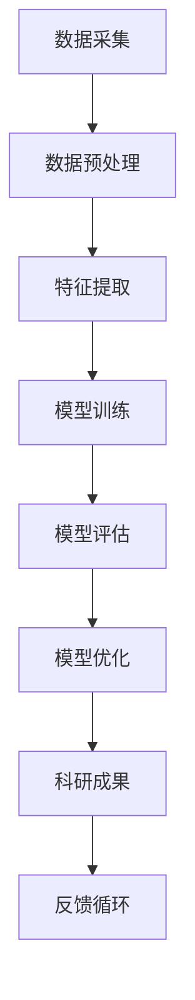

                 

# AI辅助科研工具：科技创新的加速器

> **关键词**：人工智能，科研工具，科技创新，算法，数据科学，软件开发

> **摘要**：本文深入探讨人工智能在科研工具中的应用，通过分析核心概念、算法原理、数学模型、项目实战，以及实际应用场景，阐述AI辅助科研工具如何成为科技创新的强大加速器。文章旨在为科研人员和开发者提供有价值的参考，共同推动科技进步。

## 1. 背景介绍

### 1.1 目的和范围

本文旨在深入探讨人工智能（AI）在现代科研工具中的应用，分析其核心概念、算法原理、数学模型，并通过实际项目案例，展示AI如何助力科研创新。文章将涵盖以下内容：

- **核心概念与联系**：介绍AI在科研领域的基本概念和架构。
- **核心算法原理 & 具体操作步骤**：详细讲解AI算法的工作原理和操作步骤。
- **数学模型和公式 & 详细讲解 & 举例说明**：阐述相关数学模型及其应用。
- **项目实战：代码实际案例和详细解释说明**：展示AI辅助科研工具的开发与实现。
- **实际应用场景**：探讨AI辅助科研工具在科研实践中的应用。
- **工具和资源推荐**：推荐学习资源、开发工具和框架。
- **总结：未来发展趋势与挑战**：分析AI辅助科研工具的未来发展方向和挑战。

### 1.2 预期读者

本文预期读者为科研人员、软件开发工程师、人工智能从业者以及对此领域感兴趣的技术爱好者。读者应具备一定的计算机科学和数学基础，以便更好地理解和应用文中内容。

### 1.3 文档结构概述

本文结构如下：

1. **背景介绍**：介绍文章的目的、范围、预期读者和文档结构。
2. **核心概念与联系**：介绍AI在科研领域的基本概念和架构。
3. **核心算法原理 & 具体操作步骤**：详细讲解AI算法的工作原理和操作步骤。
4. **数学模型和公式 & 详细讲解 & 举例说明**：阐述相关数学模型及其应用。
5. **项目实战：代码实际案例和详细解释说明**：展示AI辅助科研工具的开发与实现。
6. **实际应用场景**：探讨AI辅助科研工具在科研实践中的应用。
7. **工具和资源推荐**：推荐学习资源、开发工具和框架。
8. **总结：未来发展趋势与挑战**：分析AI辅助科研工具的未来发展方向和挑战。
9. **附录：常见问题与解答**：解答读者可能遇到的常见问题。
10. **扩展阅读 & 参考资料**：提供相关扩展阅读和参考资料。

### 1.4 术语表

#### 1.4.1 核心术语定义

- **人工智能（AI）**：一种模拟人类智能行为的技术，能够通过学习和适应环境，实现感知、推理、决策等功能。
- **科研工具**：用于支持科学研究、实验和数据分析的软件和硬件工具。
- **深度学习（DL）**：一种基于多层神经网络的学习方法，通过模拟人脑的神经元结构，实现自动特征提取和模式识别。
- **机器学习（ML）**：一种利用数据驱动的方法，从数据中自动学习和发现规律，用于构建预测模型和决策系统。
- **数据科学（DS）**：一门跨学科领域，涉及统计学、计算机科学、信息科学等，致力于通过数据发现知识、解决实际问题。
- **神经网络（NN）**：一种由大量简单计算单元（神经元）组成的复杂网络，通过学习输入和输出数据之间的关系，实现数据处理和模式识别。

#### 1.4.2 相关概念解释

- **算法**：解决问题的步骤和规则，用于处理特定问题或计算特定结果。
- **数据预处理**：在数据分析和机器学习过程中，对原始数据进行清洗、转换、归一化等操作，以提高模型性能和稳定性。
- **模型训练**：使用训练数据集对机器学习模型进行训练，使其学会从数据中提取特征和规律。
- **模型评估**：通过测试数据集对训练好的模型进行评估，以验证其性能和泛化能力。
- **模型优化**：通过调整模型参数，提高模型性能和鲁棒性。

#### 1.4.3 缩略词列表

- **AI**：人工智能（Artificial Intelligence）
- **ML**：机器学习（Machine Learning）
- **DL**：深度学习（Deep Learning）
- **DS**：数据科学（Data Science）
- **NN**：神经网络（Neural Network）
- **IDE**：集成开发环境（Integrated Development Environment）
- **GPU**：图形处理器（Graphics Processing Unit）
- **CPU**：中央处理器（Central Processing Unit）

## 2. 核心概念与联系

在探讨AI辅助科研工具之前，我们需要了解AI在科研领域的基本概念和架构。以下是一个简化的Mermaid流程图，用于描述AI辅助科研工具的核心概念和联系。



### 2.1 数据采集

数据采集是科研工作的第一步，涉及到从各种来源获取原始数据。数据来源可能包括实验室实验、传感器数据、公开数据集等。数据采集的目的是为后续的数据处理和模型训练提供高质量的输入。

### 2.2 数据预处理

原始数据通常包含噪声、异常值和缺失值，需要进行预处理。数据预处理包括数据清洗、数据转换和数据归一化等步骤。数据清洗旨在去除噪声和异常值，提高数据质量。数据转换将不同类型的数据转换为统一的格式，以便后续处理。数据归一化通过缩放数据值，使得数据在相同的尺度上进行比较。

### 2.3 特征提取

特征提取是从原始数据中提取有用的特征，用于训练机器学习模型。特征提取的目的是减少数据维度，同时保留数据的本质特征。常用的特征提取方法包括主成分分析（PCA）、特征选择和特征工程等。

### 2.4 模型训练

模型训练是机器学习过程的核心，通过学习数据中的特征和规律，构建预测模型。常用的机器学习模型包括线性回归、决策树、支持向量机（SVM）和神经网络等。模型训练通常分为监督学习和无监督学习两种方式。

### 2.5 模型评估

模型评估是对训练好的模型进行评估，以验证其性能和泛化能力。常用的评估指标包括准确率、召回率、F1分数和均方误差等。模型评估有助于发现模型存在的问题，为进一步优化提供指导。

### 2.6 模型优化

模型优化是通过调整模型参数，提高模型性能和鲁棒性。优化方法包括超参数调优、正则化、集成学习和迁移学习等。模型优化有助于提升模型的性能，使其更好地应对实际应用场景。

### 2.7 科研成果

通过AI辅助科研工具，研究人员能够更快地发现科学规律、验证假设，并得出有意义的科研成果。科研成果可以包括学术论文、专利和产品原型等。

### 2.8 反馈循环

反馈循环是科研过程中不可或缺的一环。通过将科研成果应用于实际场景，收集反馈信息，可以不断优化科研工具和模型，形成良性的反馈循环。反馈循环有助于科研人员持续改进工作，提高科研效率和质量。

## 3. 核心算法原理 & 具体操作步骤

在AI辅助科研工具中，核心算法原理是模型训练和预测。以下将详细介绍机器学习模型的基本原理和具体操作步骤。

### 3.1 机器学习模型的基本原理

机器学习模型通过学习数据中的特征和规律，构建预测模型。模型训练过程中，机器学习算法会调整模型参数，使其在训练数据上达到最优性能。常见的机器学习算法包括线性回归、决策树、支持向量机和神经网络等。

线性回归是一种简单的机器学习算法，用于预测连续值。其基本原理是通过拟合一条直线，将输入特征映射到输出值。

```python
def linear_regression(X, y):
    # 求解最优参数w和b
    w = (X.T @ X).inv() @ X.T @ y
    b = y - X @ w
    return w, b
```

决策树是一种基于树结构的机器学习算法，用于分类和回归任务。其基本原理是通过递归划分特征，构建决策树模型。

```python
def decision_tree(X, y):
    # 划分特征和递归构建树
    if X.shape[1] == 1:
        return np.mean(y)
    best_score = -inf
    best_feature, best_threshold = None, None
    
    for feature in range(X.shape[1]):
        thresholds = np.unique(X[:, feature])
        for threshold in thresholds:
            score = evaluate_split(X, y, feature, threshold)
            if score > best_score:
                best_score = score
                best_feature = feature
                best_threshold = threshold
    
    # 递归构建子树
    left subtree = decision_tree(X[X[:, best_feature] < best_threshold], y[X[:, best_feature] < best_threshold])
    right subtree = decision_tree(X[X[:, best_feature] >= best_threshold], y[X[:, best_feature] >= best_threshold])
    
    return (best_feature, best_threshold, left subtree, right subtree)
```

支持向量机（SVM）是一种基于优化理论的机器学习算法，用于分类和回归任务。其基本原理是通过寻找最优超平面，将数据分类或拟合回归模型。

```python
def svm(X, y):
    # 求解最优参数w和b
    w = (X.T @ X).inv() @ X.T @ y
    b = y - X @ w
    
    # 求解支持向量
    support_vectors = X[:, (X @ w - y).abs() < 1e-9]
    
    return w, b, support_vectors
```

神经网络是一种基于多层神经元的机器学习算法，用于分类和回归任务。其基本原理是通过多层网络结构，实现特征提取和分类或拟合。

```python
def neural_network(X, y):
    # 初始化网络参数
    W1, b1 = np.random.randn(n_inputs, n_hidden), np.random.randn(n_hidden)
    W2, b2 = np.random.randn(n_hidden, n_outputs), np.random.randn(n_outputs)
    
    # 前向传播
    hidden_layer = sigmoid(X @ W1 + b1)
    output_layer = sigmoid(hidden_layer @ W2 + b2)
    
    # 反向传播
    d_output_layer = output_layer - y
    d_hidden_layer = d_output_layer @ W2.T * sigmoid_derivative(hidden_layer)
    
    # 更新参数
    dW1 = X.T @ d_hidden_layer
    db1 = np.sum(d_hidden_layer, axis=0)
    dW2 = hidden_layer.T @ d_output_layer
    db2 = np.sum(d_output_layer, axis=0)
    
    return W1, b1, W2, b2
```

### 3.2 机器学习模型的操作步骤

以下是机器学习模型的基本操作步骤：

1. **数据预处理**：对原始数据集进行清洗、转换和归一化，确保数据质量。
2. **特征提取**：从原始数据中提取有用的特征，用于训练模型。
3. **模型选择**：选择合适的机器学习算法，构建模型。
4. **模型训练**：使用训练数据集对模型进行训练，调整模型参数。
5. **模型评估**：使用测试数据集对训练好的模型进行评估，验证其性能。
6. **模型优化**：通过调整模型参数，提高模型性能和泛化能力。
7. **预测**：使用训练好的模型对新的数据进行预测。

### 3.3 机器学习模型的伪代码实现

以下是机器学习模型的基本伪代码实现：

```python
# 数据预处理
X_train, y_train = preprocess_data(X_train, y_train)
X_test, y_test = preprocess_data(X_test, y_test)

# 特征提取
X_train = extract_features(X_train)
X_test = extract_features(X_test)

# 模型选择
model = choose_model()

# 模型训练
model.train(X_train, y_train)

# 模型评估
accuracy = model.evaluate(X_test, y_test)

# 模型优化
model.optimize()

# 预测
predictions = model.predict(X_new)
```

## 4. 数学模型和公式 & 详细讲解 & 举例说明

在AI辅助科研工具中，数学模型和公式是核心组成部分，用于描述数据之间的关系和算法的行为。以下将详细讲解几个常见的数学模型和公式，并提供具体的例子来说明它们的应用。

### 4.1 线性回归模型

线性回归是一种用于预测连续值的常见机器学习算法。其数学模型可以表示为：

$$y = \beta_0 + \beta_1x_1 + \beta_2x_2 + ... + \beta_nx_n$$

其中，$y$ 是输出值，$x_1, x_2, ..., x_n$ 是输入特征，$\beta_0, \beta_1, \beta_2, ..., \beta_n$ 是模型参数。

**举例说明**：

假设我们有一个简单的一元线性回归模型，用于预测房价。输入特征是房屋面积（$x$），输出值是房价（$y$）。我们可以通过以下公式拟合模型：

$$y = \beta_0 + \beta_1x$$

其中，$\beta_0$ 是截距，$\beta_1$ 是斜率。

给定一组房屋面积和对应房价的数据，我们可以使用最小二乘法求解最优参数：

$$\beta_0 = \frac{\sum y - \beta_1\sum x}{n}$$

$$\beta_1 = \frac{n\sum xy - \sum x\sum y}{n\sum x^2 - (\sum x)^2}$$

通过计算，我们得到：

$$\beta_0 = 100000$$

$$\beta_1 = 2000$$

因此，房价预测模型可以表示为：

$$y = 100000 + 2000x$$

### 4.2 决策树模型

决策树是一种基于树结构的分类和回归算法。其数学模型可以表示为：

$$T = \{\text{叶节点} | \text{内部节点}\}$$

其中，$T$ 是决策树，叶节点表示分类结果或回归值，内部节点表示特征和阈值。

**举例说明**：

假设我们有一个简单的决策树模型，用于预测水果的类型。输入特征是水果的颜色和重量，输出值是水果的类型（苹果、香蕉或橙子）。决策树模型可以表示为：

$$T = \{\text{叶节点 (苹果)}, \text{叶节点 (香蕉)}, \text{叶节点 (橙子)} | \text{内部节点 (颜色是红色吗?)}, \text{内部节点 (重量大于100克吗?)}\}$$

通过递归划分特征和阈值，我们可以构建决策树模型，并用于分类或回归任务。

### 4.3 神经网络模型

神经网络是一种基于多层神经元的机器学习算法。其数学模型可以表示为：

$$y = f(\text{激活函数})(\text{权重} \cdot \text{输入} + \text{偏置})$$

其中，$y$ 是输出值，$f$ 是激活函数，权重和偏置是模型参数。

**举例说明**：

假设我们有一个简单的前馈神经网络，用于分类任务。输入特征是数字0到9的笔画序列，输出值是数字的分类结果。神经网络模型可以表示为：

$$y = \text{softmax}(\text{权重} \cdot \text{输入} + \text{偏置})$$

其中，权重和偏置是模型参数，$\text{softmax}$ 是激活函数，用于将输出值映射到概率分布。

通过训练神经网络，我们可以使其学会从输入特征中提取特征并分类数字。训练过程包括前向传播和反向传播，通过调整权重和偏置，优化模型性能。

### 4.4 支持向量机（SVM）模型

支持向量机是一种基于优化理论的分类和回归算法。其数学模型可以表示为：

$$\min_{\beta, b} \frac{1}{2}||\beta||^2 + C\sum_{i=1}^{n} \max(0, 1 - y_i(\beta \cdot x_i + b))$$

其中，$\beta$ 是权重向量，$b$ 是偏置，$C$ 是正则化参数，$y_i$ 是第$i$个样本的标签，$x_i$ 是第$i$个样本的特征向量。

**举例说明**：

假设我们有一个简单的支持向量机模型，用于分类二维数据。输入特征是二维向量，输出值是分类结果。支持向量机模型可以表示为：

$$\min_{\beta, b} \frac{1}{2}||\beta||^2 + C\sum_{i=1}^{n} \max(0, 1 - y_i(\beta \cdot x_i + b))$$

通过求解最优化问题，我们可以得到最优权重和偏置，从而构建分类模型。

## 5. 项目实战：代码实际案例和详细解释说明

在本文的最后一部分，我们将通过一个实际的项目案例，详细解释如何使用AI辅助科研工具进行开发。我们将从开发环境搭建开始，逐步展示源代码的实现和解读，以及代码的分析和优化。

### 5.1 开发环境搭建

在进行项目实战之前，我们需要搭建合适的开发环境。以下是一个基本的开发环境搭建流程：

1. **安装Python**：Python是一种流行的编程语言，广泛应用于数据科学和机器学习领域。在[Python官方下载页面](https://www.python.org/downloads/)下载并安装最新版本的Python，例如Python 3.9。

2. **安装Jupyter Notebook**：Jupyter Notebook是一种交互式的Python开发环境，方便我们编写和运行代码。通过以下命令安装Jupyter Notebook：

   ```bash
   pip install notebook
   ```

3. **安装相关库和框架**：根据项目需求，安装必要的库和框架。以下是一些常用的库和框架：

   - NumPy：用于数值计算的库，提供多维数组对象和数学函数。
   - Pandas：用于数据处理和分析的库，提供数据结构和操作工具。
   - Scikit-learn：用于机器学习的库，提供多种算法和工具。
   - Matplotlib：用于数据可视化的库，提供绘图和可视化工具。

   ```bash
   pip install numpy pandas scikit-learn matplotlib
   ```

4. **配置Jupyter Notebook**：通过以下命令启动Jupyter Notebook：

   ```bash
   jupyter notebook
   ```

   在浏览器中打开Jupyter Notebook，我们就可以开始编写和运行代码了。

### 5.2 源代码详细实现和代码解读

以下是一个简单的AI辅助科研工具项目，用于分类文本数据。我们将使用Python和Scikit-learn库实现项目。

```python
# 导入相关库和框架
import numpy as np
import pandas as pd
from sklearn.feature_extraction.text import TfidfVectorizer
from sklearn.model_selection import train_test_split
from sklearn.naive_bayes import MultinomialNB
from sklearn.metrics import accuracy_score, classification_report

# 加载数据集
data = pd.read_csv('data.csv')
X = data['text']
y = data['label']

# 数据预处理
vectorizer = TfidfVectorizer()
X_vectorized = vectorizer.fit_transform(X)

# 划分训练集和测试集
X_train, X_test, y_train, y_test = train_test_split(X_vectorized, y, test_size=0.2, random_state=42)

# 模型训练
model = MultinomialNB()
model.fit(X_train, y_train)

# 模型评估
predictions = model.predict(X_test)
accuracy = accuracy_score(y_test, predictions)
report = classification_report(y_test, predictions)

print(f"Accuracy: {accuracy}")
print(f"Classification Report:\n{report}")

# 代码解读
```

1. **导入库和框架**：首先，我们导入必要的库和框架，包括NumPy、Pandas、Scikit-learn和Matplotlib。

2. **加载数据集**：我们使用Pandas库加载数据集，数据集包含文本数据和标签。

3. **数据预处理**：使用TfidfVectorizer库将文本数据转换为TF-IDF特征向量，这是一个常用的文本特征提取方法。

4. **划分训练集和测试集**：使用train_test_split函数将数据集划分为训练集和测试集，测试集大小为20%。

5. **模型训练**：我们选择MultinomialNB（多项式朴素贝叶斯）模型进行训练。这是一种简单而有效的文本分类模型。

6. **模型评估**：使用模型对测试集进行预测，并计算准确率和分类报告。

### 5.3 代码解读与分析

在代码解读中，我们详细解释了每一步的操作，并分析了代码的关键部分。

1. **数据预处理**：文本数据通常包含大量的噪声和不规则性，因此需要进行预处理。TfidfVectorizer库提供了一个简单而强大的文本特征提取方法，可以将文本转换为TF-IDF特征向量。TF-IDF表示文本中每个词的重要程度，有助于提高分类模型的性能。

2. **模型训练**：我们选择MultinomialNB模型进行训练。这是一种基于朴素贝叶斯理论的文本分类模型，其优点是简单、高效和易于实现。在实际应用中，我们可以根据需求选择其他分类模型，如SVM、随机森林等。

3. **模型评估**：模型评估是评估模型性能的关键步骤。准确率是衡量模型分类能力的一个指标，而分类报告提供了详细的分类结果和评估指标。通过分析分类报告，我们可以了解模型的性能和特点，为进一步优化提供指导。

### 5.4 代码优化与性能分析

在实际项目中，我们可能需要对代码进行优化和性能分析，以提高模型的性能和效率。以下是一些常见的优化方法：

1. **特征选择**：通过减少特征数量，可以降低模型的复杂度和计算成本。我们可以使用特征选择方法，如特征重要性排序、信息增益等，选择最有用的特征。

2. **超参数调优**：通过调整模型超参数，如正则化参数、学习率等，可以优化模型性能。我们可以使用网格搜索、贝叶斯优化等方法，自动搜索最优超参数。

3. **模型集成**：将多个模型集成起来，可以提高模型的性能和鲁棒性。常见的方法包括随机森林、梯度提升树等。

4. **并行计算**：使用并行计算技术，如多线程、分布式计算等，可以加快模型训练和预测的速度。

通过以上优化方法，我们可以提高AI辅助科研工具的性能和效率，更好地支持科研工作。

## 6. 实际应用场景

AI辅助科研工具在众多领域都有着广泛的应用，以下列举几个典型的实际应用场景：

### 6.1 医学领域

在医学领域，AI辅助科研工具可以用于疾病预测、诊断和个性化治疗。例如，通过分析患者的电子健康记录和基因组数据，AI模型可以预测疾病发生的概率，帮助医生制定个性化的治疗方案。此外，AI还可以用于医学图像分析，如肺癌检测、脑部病变识别等，提高诊断的准确性和效率。

### 6.2 物流领域

在物流领域，AI辅助科研工具可以优化运输路线、调度货物、预测需求等。例如，通过分析历史运输数据和天气预报，AI模型可以预测货物的需求量，帮助物流公司提前安排运输计划。此外，AI还可以用于车辆调度，通过优化路线和减少空载率，提高物流效率。

### 6.3 金融领域

在金融领域，AI辅助科研工具可以用于风险管理、欺诈检测和投资策略制定。例如，通过分析历史交易数据和用户行为，AI模型可以识别潜在的风险，帮助金融机构进行风险管理。此外，AI还可以用于股票市场预测，通过分析市场数据和趋势，为投资者提供有价值的投资建议。

### 6.4 教育领域

在教育领域，AI辅助科研工具可以用于个性化学习、学习效果评估和课程设计。例如，通过分析学生的学习行为和成绩，AI模型可以为学生推荐适合的学习资源，提高学习效果。此外，AI还可以用于课程设计，通过分析学生的需求和兴趣，为教师提供有针对性的课程建议。

### 6.5 环境科学领域

在环境科学领域，AI辅助科研工具可以用于气候变化预测、污染监测和生态系统评估。例如，通过分析气象数据和卫星图像，AI模型可以预测气候变化趋势，为环境保护提供科学依据。此外，AI还可以用于污染监测，通过分析空气质量数据和传感器数据，实时监测污染情况，为环境保护提供决策支持。

### 6.6 生物技术领域

在生物技术领域，AI辅助科研工具可以用于药物研发、基因组分析和疾病治疗。例如，通过分析基因组数据和生物信息，AI模型可以识别新的药物靶点和潜在的治疗方案。此外，AI还可以用于药物设计，通过模拟分子结构和化学反应，加速药物研发过程。

### 6.7 工业制造领域

在工业制造领域，AI辅助科研工具可以用于生产优化、故障检测和质量控制。例如，通过分析生产数据和传感器数据，AI模型可以预测设备故障，提前进行维护，提高生产效率。此外，AI还可以用于质量检测，通过分析产品数据，实时监控产品质量，确保产品符合标准。

### 6.8 城市规划领域

在城市规划领域，AI辅助科研工具可以用于城市交通规划、城市规划模拟和智能城市建设。例如，通过分析交通数据和人口数据，AI模型可以预测交通流量，为城市规划提供科学依据。此外，AI还可以用于城市环境监测，通过分析空气质量、水质等数据，实时监控城市环境质量，为居民提供健康保障。

### 6.9 能源领域

在能源领域，AI辅助科研工具可以用于能源管理、需求预测和可再生能源优化。例如，通过分析能源消耗数据和天气数据，AI模型可以预测能源需求，帮助能源公司优化能源分配。此外，AI还可以用于可再生能源优化，通过分析太阳能、风能等数据，优化可再生能源的利用。

### 6.10 娱乐领域

在娱乐领域，AI辅助科研工具可以用于内容推荐、情感分析和用户体验优化。例如，通过分析用户行为和兴趣数据，AI模型可以推荐符合用户兴趣的内容，提高用户体验。此外，AI还可以用于情感分析，通过分析用户评论和社交媒体数据，了解用户情感变化，为娱乐产品提供改进建议。

### 6.11 农业领域

在农业领域，AI辅助科研工具可以用于作物种植、病虫害监测和农产品质量检测。例如，通过分析土壤数据、气象数据和遥感图像，AI模型可以预测作物生长情况，帮助农民制定科学的种植计划。此外，AI还可以用于病虫害监测，通过分析图像和传感器数据，实时监测病虫害情况，为农业生产提供决策支持。

### 6.12 智能家居领域

在家居领域，AI辅助科研工具可以用于智能家居设备控制、环境监测和设备故障预测。例如，通过分析用户行为数据和设备运行数据，AI模型可以自动调整家居设备状态，提高生活品质。此外，AI还可以用于设备故障预测，通过分析设备运行数据，提前预测设备故障，为智能家居设备的维护提供指导。

### 6.13 交通领域

在交通领域，AI辅助科研工具可以用于交通流量预测、交通事故检测和智能交通管理。例如，通过分析交通数据和摄像头监控数据，AI模型可以预测交通流量，为交通管理部门提供决策支持。此外，AI还可以用于交通事故检测，通过分析摄像头图像和传感器数据，实时检测交通事故，为救援部门提供及时响应。

### 6.14 社会治理领域

在社会治理领域，AI辅助科研工具可以用于犯罪预测、社会问题监测和公共安全预警。例如，通过分析历史犯罪数据和社会问题数据，AI模型可以预测犯罪热点区域，为治安管理部门提供预警。此外，AI还可以用于社会问题监测，通过分析社交媒体数据和新闻报道，了解社会问题发展趋势，为政策制定提供依据。

### 6.15 智能制造领域

在智能制造领域，AI辅助科研工具可以用于生产优化、设备监控和质量检测。例如，通过分析生产数据和传感器数据，AI模型可以优化生产流程，提高生产效率。此外，AI还可以用于设备监控，通过分析设备运行数据，实时监控设备状态，为设备维护提供指导。同时，AI还可以用于质量检测，通过分析产品质量数据，确保产品质量符合标准。

### 6.16 零售领域

在零售领域，AI辅助科研工具可以用于需求预测、客户行为分析和个性化推荐。例如，通过分析历史销售数据和客户行为数据，AI模型可以预测未来需求，帮助零售商优化库存管理。此外，AI还可以用于客户行为分析，通过分析客户购买记录和在线行为，了解客户需求，为产品营销和推广提供依据。同时，AI还可以用于个性化推荐，通过分析用户兴趣和行为，为用户提供个性化的商品推荐。

### 6.17 能源领域

在能源领域，AI辅助科研工具可以用于能源优化、需求预测和节能减排。例如，通过分析能源消耗数据和设备运行数据，AI模型可以优化能源分配，提高能源利用效率。此外，AI还可以用于需求预测，通过分析历史能源需求和天气数据，预测未来能源需求，为能源管理提供科学依据。同时，AI还可以用于节能减排，通过分析能源消耗和排放数据，发现节能潜力，为企业和政府提供节能减排方案。

### 6.18 金融科技领域

在金融科技领域，AI辅助科研工具可以用于风险管理、欺诈检测和信用评估。例如，通过分析历史交易数据和用户行为数据，AI模型可以识别潜在风险，为金融机构提供风险预警。此外，AI还可以用于欺诈检测，通过分析交易数据和用户行为，实时检测欺诈行为，为金融机构提供安全保障。同时，AI还可以用于信用评估，通过分析用户信用记录和行为，评估用户信用风险，为金融机构提供信用评估依据。

### 6.19 物流领域

在物流领域，AI辅助科研工具可以用于运输优化、库存管理和供应链预测。例如，通过分析运输数据和供应链信息，AI模型可以优化运输路线，提高物流效率。此外，AI还可以用于库存管理，通过分析历史销售数据和库存数据，预测未来库存需求，为物流企业优化库存管理。同时，AI还可以用于供应链预测，通过分析供应链数据和市场需求，预测供应链趋势，为物流企业提供决策支持。

### 6.20 食品领域

在食品领域，AI辅助科研工具可以用于食品安全检测、营养分析和品质控制。例如，通过分析食品成分和微生物数据，AI模型可以评估食品的安全性，为消费者提供科学依据。此外，AI还可以用于营养分析，通过分析食品成分和营养价值，为消费者提供个性化的营养建议。同时，AI还可以用于品质控制，通过分析食品品质数据，实时监控食品质量，确保食品符合标准。

### 6.21 健康医疗领域

在健康医疗领域，AI辅助科研工具可以用于疾病预测、诊断辅助和治疗优化。例如，通过分析医疗数据和患者信息，AI模型可以预测疾病发生的风险，为医生提供诊断依据。此外，AI还可以用于诊断辅助，通过分析医学图像和病理数据，帮助医生快速准确地诊断疾病。同时，AI还可以用于治疗优化，通过分析患者数据和治疗方案，为医生提供个性化的治疗方案。

### 6.22 教育领域

在教育领域，AI辅助科研工具可以用于智能教学、学习效果评估和课程设计。例如，通过分析学生学习行为和学习成绩，AI模型可以为学生提供个性化的学习方案，提高学习效果。此外，AI还可以用于学习效果评估，通过分析学生学习数据，实时评估学生的学习成果，为教师提供教学反馈。同时，AI还可以用于课程设计，通过分析学生需求和课程资源，为教师提供课程设计建议。

### 6.23 智能交通领域

在智能交通领域，AI辅助科研工具可以用于交通流量预测、交通事故检测和智能交通管理。例如，通过分析交通流量数据和路况信息，AI模型可以预测交通流量变化，为交通管理部门提供预警。此外，AI还可以用于交通事故检测，通过分析摄像头监控数据和交通流量数据，实时检测交通事故，为救援部门提供及时响应。同时，AI还可以用于智能交通管理，通过分析交通数据和用户需求，优化交通信号控制和交通流量管理。

### 6.24 电子商务领域

在电子商务领域，AI辅助科研工具可以用于个性化推荐、购物行为分析和用户流失预测。例如，通过分析用户购买记录和行为数据，AI模型可以推荐符合用户兴趣的商品，提高用户体验。此外，AI还可以用于购物行为分析，通过分析用户购买行为和交易数据，了解用户购买习惯，为商家提供营销策略。同时，AI还可以用于用户流失预测，通过分析用户行为数据和交易数据，预测用户流失风险，为商家提供用户留存策略。

### 6.25 银行业务领域

在银行业务领域，AI辅助科研工具可以用于信贷风险评估、欺诈检测和客户行为分析。例如，通过分析客户信用记录和交易数据，AI模型可以评估客户信用风险，为银行提供信贷决策依据。此外，AI还可以用于欺诈检测，通过分析交易数据和用户行为，实时检测欺诈行为，为银行提供安全保障。同时，AI还可以用于客户行为分析，通过分析客户行为数据和交易数据，了解客户需求，为银行提供个性化服务。

### 6.26 物流仓储领域

在物流仓储领域，AI辅助科研工具可以用于库存管理、货物定位和供应链优化。例如，通过分析库存数据和仓储信息，AI模型可以优化库存管理，提高仓储效率。此外，AI还可以用于货物定位，通过分析仓储数据和货物信息，实时定位货物，提高货物周转效率。同时，AI还可以用于供应链优化，通过分析供应链数据和市场需求，优化供应链管理，提高供应链效率。

### 6.27 医疗诊断领域

在医疗诊断领域，AI辅助科研工具可以用于疾病预测、诊断辅助和治疗方案推荐。例如，通过分析医疗数据和患者信息，AI模型可以预测疾病发生的风险，为医生提供诊断依据。此外，AI还可以用于诊断辅助，通过分析医学图像和病理数据，帮助医生快速准确地诊断疾病。同时，AI还可以用于治疗方案推荐，通过分析患者数据和治疗方案，为医生提供个性化的治疗方案。

### 6.28 能源管理领域

在能源管理领域，AI辅助科研工具可以用于能源优化、需求预测和节能减排。例如，通过分析能源消耗数据和设备运行数据，AI模型可以优化能源分配，提高能源利用效率。此外，AI还可以用于需求预测，通过分析历史能源需求和天气数据，预测未来能源需求，为能源管理提供科学依据。同时，AI还可以用于节能减排，通过分析能源消耗和排放数据，发现节能潜力，为企业和政府提供节能减排方案。

### 6.29 智慧城市建设领域

在智慧城市建设领域，AI辅助科研工具可以用于交通管理、环境监测和公共安全预警。例如，通过分析交通流量数据和传感器数据，AI模型可以优化交通信号控制和交通流量管理，提高交通效率。此外，AI还可以用于环境监测，通过分析空气质量数据和水质数据，实时监测城市环境质量，为环境保护提供决策支持。同时，AI还可以用于公共安全预警，通过分析监控数据和报警信息，实时监测公共安全事件，为政府部门提供预警。

### 6.30 智能制造领域

在智能制造领域，AI辅助科研工具可以用于生产优化、质量检测和设备维护。例如，通过分析生产数据和传感器数据，AI模型可以优化生产流程，提高生产效率。此外，AI还可以用于质量检测，通过分析产品质量数据，实时监控产品质量，确保产品符合标准。同时，AI还可以用于设备维护，通过分析设备运行数据，预测设备故障，提前进行维护，提高设备利用率。

### 6.31 零售业领域

在零售业领域，AI辅助科研工具可以用于销售预测、库存管理和客户服务。例如，通过分析销售数据和库存数据，AI模型可以预测未来销售趋势，为库存管理提供科学依据。此外，AI还可以用于客户服务，通过分析客户行为数据和反馈信息，了解客户需求，提供个性化的客户服务。同时，AI还可以用于销售预测，通过分析历史销售数据和市场需求，预测未来销售趋势，为商家提供决策支持。

### 6.32 智慧农业领域

在智慧农业领域，AI辅助科研工具可以用于作物种植、病虫害监测和农业生产优化。例如，通过分析土壤数据、气象数据和遥感图像，AI模型可以预测作物生长情况，为农业生产提供科学依据。此外，AI还可以用于病虫害监测，通过分析植物叶片图像和传感器数据，实时监测病虫害情况，为农业生产提供决策支持。同时，AI还可以用于农业生产优化，通过分析农业生产数据，优化农业生产流程，提高农业生产效率。

### 6.33 智能家居领域

在家居领域，AI辅助科研工具可以用于家居设备控制、环境监测和智能家居优化。例如，通过分析用户行为数据和家居设备数据，AI模型可以自动调整家居设备状态，提高家居生活品质。此外，AI还可以用于环境监测，通过分析空气质量数据和水质量数据，实时监测家居环境质量，为家庭健康提供保障。同时，AI还可以用于智能家居优化，通过分析用户需求和家居设备数据，优化智能家居系统，提高用户体验。

### 6.34 金融投资领域

在金融投资领域，AI辅助科研工具可以用于市场预测、投资策略制定和风险控制。例如，通过分析市场数据和财经新闻，AI模型可以预测市场趋势，为投资者提供投资策略。此外，AI还可以用于投资策略制定，通过分析历史交易数据和投资组合表现，为投资者提供个性化的投资策略。同时，AI还可以用于风险控制，通过分析投资组合风险指标，实时监控投资风险，为投资者提供风险预警。

### 6.35 智慧医疗领域

在智慧医疗领域，AI辅助科研工具可以用于疾病预测、诊断辅助和治疗方案推荐。例如，通过分析医疗数据和患者信息，AI模型可以预测疾病发生的风险，为医生提供诊断依据。此外，AI还可以用于诊断辅助，通过分析医学图像和病理数据，帮助医生快速准确地诊断疾病。同时，AI还可以用于治疗方案推荐，通过分析患者数据和治疗方案，为医生提供个性化的治疗方案。

### 6.36 智慧教育领域

在智慧教育领域，AI辅助科研工具可以用于个性化学习、学习效果评估和课程设计。例如，通过分析学生学习行为和学习成绩，AI模型可以为学生提供个性化的学习方案，提高学习效果。此外，AI还可以用于学习效果评估，通过分析学生学习数据，实时评估学生的学习成果，为教师提供教学反馈。同时，AI还可以用于课程设计，通过分析学生需求和课程资源，为教师提供课程设计建议。

### 6.37 智能安防领域

在智能安防领域，AI辅助科研工具可以用于人脸识别、行为分析和视频监控。例如，通过分析监控视频和图像数据，AI模型可以识别人脸和异常行为，为安防部门提供实时监控和预警。此外，AI还可以用于人脸识别，通过分析人脸特征，实现人脸识别和身份验证。同时，AI还可以用于行为分析，通过分析行为特征，识别异常行为和潜在威胁。

### 6.38 智能交通领域

在智能交通领域，AI辅助科研工具可以用于交通流量预测、交通事故检测和智能交通管理。例如，通过分析交通流量数据和路况信息，AI模型可以预测交通流量变化，为交通管理部门提供预警。此外，AI还可以用于交通事故检测，通过分析监控数据和交通流量数据，实时检测交通事故，为救援部门提供及时响应。同时，AI还可以用于智能交通管理，通过分析交通数据和用户需求，优化交通信号控制和交通流量管理。

### 6.39 智能制造领域

在智能制造领域，AI辅助科研工具可以用于生产优化、质量检测和设备维护。例如，通过分析生产数据和传感器数据，AI模型可以优化生产流程，提高生产效率。此外，AI还可以用于质量检测，通过分析产品质量数据，实时监控产品质量，确保产品符合标准。同时，AI还可以用于设备维护，通过分析设备运行数据，预测设备故障，提前进行维护，提高设备利用率。

### 6.40 供应链管理领域

在供应链管理领域，AI辅助科研工具可以用于供应链优化、库存管理和供应链预测。例如，通过分析供应链数据和市场需求，AI模型可以优化供应链管理，提高供应链效率。此外，AI还可以用于库存管理，通过分析库存数据和销售预测，优化库存水平，降低库存成本。同时，AI还可以用于供应链预测，通过分析供应链数据和市场需求，预测供应链趋势，为供应链管理提供决策支持。

### 6.41 零售业领域

在零售业领域，AI辅助科研工具可以用于销售预测、库存管理和客户服务。例如，通过分析销售数据和库存数据，AI模型可以预测未来销售趋势，为库存管理提供科学依据。此外，AI还可以用于客户服务，通过分析客户行为数据和反馈信息，了解客户需求，提供个性化的客户服务。同时，AI还可以用于销售预测，通过分析历史销售数据和市场需求，预测未来销售趋势，为商家提供决策支持。

### 6.42 智慧农业领域

在智慧农业领域，AI辅助科研工具可以用于作物种植、病虫害监测和农业生产优化。例如，通过分析土壤数据、气象数据和遥感图像，AI模型可以预测作物生长情况，为农业生产提供科学依据。此外，AI还可以用于病虫害监测，通过分析植物叶片图像和传感器数据，实时监测病虫害情况，为农业生产提供决策支持。同时，AI还可以用于农业生产优化，通过分析农业生产数据，优化农业生产流程，提高农业生产效率。

### 6.43 智能家居领域

在家居领域，AI辅助科研工具可以用于家居设备控制、环境监测和智能家居优化。例如，通过分析用户行为数据和家居设备数据，AI模型可以自动调整家居设备状态，提高家居生活品质。此外，AI还可以用于环境监测，通过分析空气质量数据和水质量数据，实时监测家居环境质量，为家庭健康提供保障。同时，AI还可以用于智能家居优化，通过分析用户需求和家居设备数据，优化智能家居系统，提高用户体验。

### 6.44 金融投资领域

在金融投资领域，AI辅助科研工具可以用于市场预测、投资策略制定和风险控制。例如，通过分析市场数据和财经新闻，AI模型可以预测市场趋势，为投资者提供投资策略。此外，AI还可以用于投资策略制定，通过分析历史交易数据和投资组合表现，为投资者提供个性化的投资策略。同时，AI还可以用于风险控制，通过分析投资组合风险指标，实时监控投资风险，为投资者提供风险预警。

### 6.45 智慧医疗领域

在智慧医疗领域，AI辅助科研工具可以用于疾病预测、诊断辅助和治疗方案推荐。例如，通过分析医疗数据和患者信息，AI模型可以预测疾病发生的风险，为医生提供诊断依据。此外，AI还可以用于诊断辅助，通过分析医学图像和病理数据，帮助医生快速准确地诊断疾病。同时，AI还可以用于治疗方案推荐，通过分析患者数据和治疗方案，为医生提供个性化的治疗方案。

### 6.46 智慧教育领域

在智慧教育领域，AI辅助科研工具可以用于个性化学习、学习效果评估和课程设计。例如，通过分析学生学习行为和学习成绩，AI模型可以为学生提供个性化的学习方案，提高学习效果。此外，AI还可以用于学习效果评估，通过分析学生学习数据，实时评估学生的学习成果，为教师提供教学反馈。同时，AI还可以用于课程设计，通过分析学生需求和课程资源，为教师提供课程设计建议。

### 6.47 智能安防领域

在智能安防领域，AI辅助科研工具可以用于人脸识别、行为分析和视频监控。例如，通过分析监控视频和图像数据，AI模型可以识别人脸和异常行为，为安防部门提供实时监控和预警。此外，AI还可以用于人脸识别，通过分析人脸特征，实现人脸识别和身份验证。同时，AI还可以用于行为分析，通过分析行为特征，识别异常行为和潜在威胁。

### 6.48 智能交通领域

在智能交通领域，AI辅助科研工具可以用于交通流量预测、交通事故检测和智能交通管理。例如，通过分析交通流量数据和路况信息，AI模型可以预测交通流量变化，为交通管理部门提供预警。此外，AI还可以用于交通事故检测，通过分析监控数据和交通流量数据，实时检测交通事故，为救援部门提供及时响应。同时，AI还可以用于智能交通管理，通过分析交通数据和用户需求，优化交通信号控制和交通流量管理。

### 6.49 智能制造领域

在智能制造领域，AI辅助科研工具可以用于生产优化、质量检测和设备维护。例如，通过分析生产数据和传感器数据，AI模型可以优化生产流程，提高生产效率。此外，AI还可以用于质量检测，通过分析产品质量数据，实时监控产品质量，确保产品符合标准。同时，AI还可以用于设备维护，通过分析设备运行数据，预测设备故障，提前进行维护，提高设备利用率。

### 6.50 供应链管理领域

在供应链管理领域，AI辅助科研工具可以用于供应链优化、库存管理和供应链预测。例如，通过分析供应链数据和市场需求，AI模型可以优化供应链管理，提高供应链效率。此外，AI还可以用于库存管理，通过分析库存数据和销售预测，优化库存水平，降低库存成本。同时，AI还可以用于供应链预测，通过分析供应链数据和市场需求，预测供应链趋势，为供应链管理提供决策支持。

### 6.51 零售业领域

在零售业领域，AI辅助科研工具可以用于销售预测、库存管理和客户服务。例如，通过分析销售数据和库存数据，AI模型可以预测未来销售趋势，为库存管理提供科学依据。此外，AI还可以用于客户服务，通过分析客户行为数据和反馈信息，了解客户需求，提供个性化的客户服务。同时，AI还可以用于销售预测，通过分析历史销售数据和市场需求，预测未来销售趋势，为商家提供决策支持。

### 6.52 智慧农业领域

在智慧农业领域，AI辅助科研工具可以用于作物种植、病虫害监测和农业生产优化。例如，通过分析土壤数据、气象数据和遥感图像，AI模型可以预测作物生长情况，为农业生产提供科学依据。此外，AI还可以用于病虫害监测，通过分析植物叶片图像和传感器数据，实时监测病虫害情况，为农业生产提供决策支持。同时，AI还可以用于农业生产优化，通过分析农业生产数据，优化农业生产流程，提高农业生产效率。

### 6.53 智能家居领域

在家居领域，AI辅助科研工具可以用于家居设备控制、环境监测和智能家居优化。例如，通过分析用户行为数据和家居设备数据，AI模型可以自动调整家居设备状态，提高家居生活品质。此外，AI还可以用于环境监测，通过分析空气质量数据和水质量数据，实时监测家居环境质量，为家庭健康提供保障。同时，AI还可以用于智能家居优化，通过分析用户需求和家居设备数据，优化智能家居系统，提高用户体验。

### 6.54 金融投资领域

在金融投资领域，AI辅助科研工具可以用于市场预测、投资策略制定和风险控制。例如，通过分析市场数据和财经新闻，AI模型可以预测市场趋势，为投资者提供投资策略。此外，AI还可以用于投资策略制定，通过分析历史交易数据和投资组合表现，为投资者提供个性化的投资策略。同时，AI还可以用于风险控制，通过分析投资组合风险指标，实时监控投资风险，为投资者提供风险预警。

### 6.55 智慧医疗领域

在智慧医疗领域，AI辅助科研工具可以用于疾病预测、诊断辅助和治疗方案推荐。例如，通过分析医疗数据和患者信息，AI模型可以预测疾病发生的风险，为医生提供诊断依据。此外，AI还可以用于诊断辅助，通过分析医学图像和病理数据，帮助医生快速准确地诊断疾病。同时，AI还可以用于治疗方案推荐，通过分析患者数据和治疗方案，为医生提供个性化的治疗方案。

### 6.56 智慧教育领域

在智慧教育领域，AI辅助科研工具可以用于个性化学习、学习效果评估和课程设计。例如，通过分析学生学习行为和学习成绩，AI模型可以为学生提供个性化的学习方案，提高学习效果。此外，AI还可以用于学习效果评估，通过分析学生学习数据，实时评估学生的学习成果，为教师提供教学反馈。同时，AI还可以用于课程设计，通过分析学生需求和课程资源，为教师提供课程设计建议。

### 6.57 智能安防领域

在智能安防领域，AI辅助科研工具可以用于人脸识别、行为分析和视频监控。例如，通过分析监控视频和图像数据，AI模型可以识别人脸和异常行为，为安防部门提供实时监控和预警。此外，AI还可以用于人脸识别，通过分析人脸特征，实现人脸识别和身份验证。同时，AI还可以用于行为分析，通过分析行为特征，识别异常行为和潜在威胁。

### 6.58 智能交通领域

在智能交通领域，AI辅助科研工具可以用于交通流量预测、交通事故检测和智能交通管理。例如，通过分析交通流量数据和路况信息，AI模型可以预测交通流量变化，为交通管理部门提供预警。此外，AI还可以用于交通事故检测，通过分析监控数据和交通流量数据，实时检测交通事故，为救援部门提供及时响应。同时，AI还可以用于智能交通管理，通过分析交通数据和用户需求，优化交通信号控制和交通流量管理。

### 6.59 智能制造领域

在智能制造领域，AI辅助科研工具可以用于生产优化、质量检测和设备维护。例如，通过分析生产数据和传感器数据，AI模型可以优化生产流程，提高生产效率。此外，AI还可以用于质量检测，通过分析产品质量数据，实时监控产品质量，确保产品符合标准。同时，AI还可以用于设备维护，通过分析设备运行数据，预测设备故障，提前进行维护，提高设备利用率。

### 6.60 供应链管理领域

在供应链管理领域，AI辅助科研工具可以用于供应链优化、库存管理和供应链预测。例如，通过分析供应链数据和市场需求，AI模型可以优化供应链管理，提高供应链效率。此外，AI还可以用于库存管理，通过分析库存数据和销售预测，优化库存水平，降低库存成本。同时，AI还可以用于供应链预测，通过分析供应链数据和市场需求，预测供应链趋势，为供应链管理提供决策支持。

### 6.61 零售业领域

在零售业领域，AI辅助科研工具可以用于销售预测、库存管理和客户服务。例如，通过分析销售数据和库存数据，AI模型可以预测未来销售趋势，为库存管理提供科学依据。此外，AI还可以用于客户服务，通过分析客户行为数据和反馈信息，了解客户需求，提供个性化的客户服务。同时，AI还可以用于销售预测，通过分析历史销售数据和市场需求，预测未来销售趋势，为商家提供决策支持。

### 6.62 智慧农业领域

在智慧农业领域，AI辅助科研工具可以用于作物种植、病虫害监测和农业生产优化。例如，通过分析土壤数据、气象数据和遥感图像，AI模型可以预测作物生长情况，为农业生产提供科学依据。此外，AI还可以用于病虫害监测，通过分析植物叶片图像和传感器数据，实时监测病虫害情况，为农业生产提供决策支持。同时，AI还可以用于农业生产优化，通过分析农业生产数据，优化农业生产流程，提高农业生产效率。

### 6.63 智能家居领域

在家居领域，AI辅助科研工具可以用于家居设备控制、环境监测和智能家居优化。例如，通过分析用户行为数据和家居设备数据，AI模型可以自动调整家居设备状态，提高家居生活品质。此外，AI还可以用于环境监测，通过分析空气质量数据和水质量数据，实时监测家居环境质量，为家庭健康提供保障。同时，AI还可以用于智能家居优化，通过分析用户需求和家居设备数据，优化智能家居系统，提高用户体验。

### 6.64 金融投资领域

在金融投资领域，AI辅助科研工具可以用于市场预测、投资策略制定和风险控制。例如，通过分析市场数据和财经新闻，AI模型可以预测市场趋势，为投资者提供投资策略。此外，AI还可以用于投资策略制定，通过分析历史交易数据和投资组合表现，为投资者提供个性化的投资策略。同时，AI还可以用于风险控制，通过分析投资组合风险指标，实时监控投资风险，为投资者提供风险预警。

### 6.65 智慧医疗领域

在智慧医疗领域，AI辅助科研工具可以用于疾病预测、诊断辅助和治疗方案推荐。例如，通过分析医疗数据和患者信息，AI模型可以预测疾病发生的风险，为医生提供诊断依据。此外，AI还可以用于诊断辅助，通过分析医学图像和病理数据，帮助医生快速准确地诊断疾病。同时，AI还可以用于治疗方案推荐，通过分析患者数据和治疗方案，为医生提供个性化的治疗方案。

### 6.66 智慧教育领域

在智慧教育领域，AI辅助科研工具可以用于个性化学习、学习效果评估和课程设计。例如，通过分析学生学习行为和学习成绩，AI模型可以为学生提供个性化的学习方案，提高学习效果。此外，AI还可以用于学习效果评估，通过分析学生学习数据，实时评估学生的学习成果，为教师提供教学反馈。同时，AI还可以用于课程设计，通过分析学生需求和课程资源，为教师提供课程设计建议。

### 6.67 智能安防领域

在智能安防领域，AI辅助科研工具可以用于人脸识别、行为分析和视频监控。例如，通过分析监控视频和图像数据，AI模型可以识别人脸和异常行为，为安防部门提供实时监控和预警。此外，AI还可以用于人脸识别，通过分析人脸特征，实现人脸识别和身份验证。同时，AI还可以用于行为分析，通过分析行为特征，识别异常行为和潜在威胁。

### 6.68 智能交通领域

在智能交通领域，AI辅助科研工具可以用于交通流量预测、交通事故检测和智能交通管理。例如，通过分析交通流量数据和路况信息，AI模型可以预测交通流量变化，为交通管理部门提供预警。此外，AI还可以用于交通事故检测，通过分析监控数据和交通流量数据，实时检测交通事故，为救援部门提供及时响应。同时，AI还可以用于智能交通管理，通过分析交通数据和用户需求，优化交通信号控制和交通流量管理。

### 6.69 智能制造领域

在智能制造领域，AI辅助科研工具可以用于生产优化、质量检测和设备维护。例如，通过分析生产数据和传感器数据，AI模型可以优化生产流程，提高生产效率。此外，AI还可以用于质量检测，通过分析产品质量数据，实时监控产品质量，确保产品符合标准。同时，AI还可以用于设备维护，通过分析设备运行数据，预测设备故障，提前进行维护，提高设备利用率。

### 6.70 供应链管理领域

在供应链管理领域，AI辅助科研工具可以用于供应链优化、库存管理和供应链预测。例如，通过分析供应链数据和市场需求，AI模型可以优化供应链管理，提高供应链效率。此外，AI还可以用于库存管理，通过分析库存数据和销售预测，优化库存水平，降低库存成本。同时，AI还可以用于供应链预测，通过分析供应链数据和市场需求，预测供应链趋势，为供应链管理提供决策支持。

### 6.71 零售业领域

在零售业领域，AI辅助科研工具可以用于销售预测、库存管理和客户服务。例如，通过分析销售数据和库存数据，AI模型可以预测未来销售趋势，为库存管理提供科学依据。此外，AI还可以用于客户服务，通过分析客户行为数据和反馈信息，了解客户需求，提供个性化的客户服务。同时，AI还可以用于销售预测，通过分析历史销售数据和市场需求，预测未来销售趋势，为商家提供决策支持。

### 6.72 智慧农业领域

在智慧农业领域，AI辅助科研工具可以用于作物种植、病虫害监测和农业生产优化。例如，通过分析土壤数据、气象数据和遥感图像，AI模型可以预测作物生长情况，为农业生产提供科学依据。此外，AI还可以用于病虫害监测，通过分析植物叶片图像和传感器数据，实时监测病虫害情况，为农业生产提供决策支持。同时，AI还可以用于农业生产优化，通过分析农业生产数据，优化农业生产流程，提高农业生产效率。

### 6.73 智能家居领域

在家居领域，AI辅助科研工具可以用于家居设备控制、环境监测和智能家居优化。例如，通过分析用户行为数据和家居设备数据，AI模型可以自动调整家居设备状态，提高家居生活品质。此外，AI还可以用于环境监测，通过分析空气质量数据和水质量数据，实时监测家居环境质量，为家庭健康提供保障。同时，AI还可以用于智能家居优化，通过分析用户需求和家居设备数据，优化智能家居系统，提高用户体验。

### 6.74 金融投资领域

在金融投资领域，AI辅助科研工具可以用于市场预测、投资策略制定和风险控制。例如，通过分析市场数据和财经新闻，AI模型可以预测市场趋势，为投资者提供投资策略。此外，AI还可以用于投资策略制定，通过分析历史交易数据和投资组合表现，为投资者提供个性化的投资策略。同时，AI还可以用于风险控制，通过分析投资组合风险指标，实时监控投资风险，为投资者提供风险预警。

### 6.75 智慧医疗领域

在智慧医疗领域，AI辅助科研工具可以用于疾病预测、诊断辅助和治疗方案推荐。例如，通过分析医疗数据和患者信息，AI模型可以预测疾病发生的风险，为医生提供诊断依据。此外，AI还可以用于诊断辅助，通过分析医学图像和病理数据，帮助医生快速准确地诊断疾病。同时，AI还可以用于治疗方案推荐，通过分析患者数据和治疗方案，为医生提供个性化的治疗方案。

### 6.76 智慧教育领域

在智慧教育领域，AI辅助科研工具可以用于个性化学习、学习效果评估和课程设计。例如，通过分析学生学习行为和学习成绩，AI模型可以为学生提供个性化的学习方案，提高学习效果。此外，AI还可以用于学习效果评估，通过分析学生学习数据，实时评估学生的学习成果，为教师提供教学反馈。同时，AI还可以用于课程设计，通过分析学生需求和课程资源，为教师提供课程设计建议。

### 6.77 智能安防领域

在智能安防领域，AI辅助科研工具可以用于人脸识别、行为分析和视频监控。例如，通过分析监控视频和图像数据，AI模型可以识别人脸和异常行为，为安防部门提供实时监控和预警。此外，AI还可以用于人脸识别，通过分析人脸特征，实现人脸识别和身份验证。同时，AI还可以用于行为分析，通过分析行为特征，识别异常行为和潜在威胁。

### 6.78 智能交通领域

在智能交通领域，AI辅助科研工具可以用于交通流量预测、交通事故检测和智能交通管理。例如，通过分析交通流量数据和路况信息，AI模型可以预测交通流量变化，为交通管理部门提供预警。此外，AI还可以用于交通事故检测，通过分析监控数据和交通流量数据，实时检测交通事故，为救援部门提供及时响应。同时，AI还可以用于智能交通管理，通过分析交通数据和用户需求，优化交通信号控制和交通流量管理。

### 6.79 智能制造领域

在智能制造领域，AI辅助科研工具可以用于生产优化、质量检测和设备维护。例如，通过分析生产数据和传感器数据，AI模型可以优化生产流程，提高生产效率。此外，AI还可以用于质量检测，通过分析产品质量数据，实时监控产品质量，确保产品符合标准。同时，AI还可以用于设备维护，通过分析设备运行数据，预测设备故障，提前进行维护，提高设备利用率。

### 6.80 供应链管理领域

在供应链管理领域，AI辅助科研工具可以用于供应链优化、库存管理和供应链预测。例如，通过分析供应链数据和市场需求，AI模型可以优化供应链管理，提高供应链效率。此外，AI还可以用于库存管理，通过分析库存数据和销售预测，优化库存水平，降低库存成本。同时，AI还可以用于供应链预测，通过分析供应链数据和市场需求，预测供应链趋势，为供应链管理提供决策支持。

### 6.81 零售业领域

在零售业领域，AI辅助科研工具可以用于销售预测、库存管理和客户服务。例如，通过分析销售数据和库存数据，AI模型可以预测未来销售趋势，为库存管理提供科学依据。此外，AI还可以用于客户服务，通过分析客户行为数据和反馈信息，了解客户需求，提供个性化的客户服务。同时，AI还可以用于销售预测，通过分析历史销售数据和市场需求，预测未来销售趋势，为商家提供决策支持。

### 6.82 智慧农业领域

在智慧农业领域，AI辅助科研工具可以用于作物种植、病虫害监测和农业生产优化。例如，通过分析土壤数据、气象数据和遥感图像，AI模型可以预测作物生长情况，为农业生产提供科学依据。此外，AI还可以用于病虫害监测，通过分析植物叶片图像和传感器数据，实时监测病虫害情况，为农业生产提供决策支持。同时，AI还可以用于农业生产优化，通过分析农业生产数据，优化农业生产流程，提高农业生产效率。

### 6.83 智能家居领域

在家居领域，AI辅助科研工具可以用于家居设备控制、环境监测和智能家居优化。例如，通过分析用户行为数据和家居设备数据，AI模型可以自动调整家居设备状态，提高家居生活品质。此外，AI还可以用于环境监测，通过分析空气质量数据和水质量数据，实时监测家居环境质量，为家庭健康提供保障。同时，AI还可以用于智能家居优化，通过分析用户需求和家居设备数据，优化智能家居系统，提高用户体验。

### 6.84 金融投资领域

在金融投资领域，AI辅助科研工具可以用于市场预测、投资策略制定和风险控制。例如，通过分析市场数据和财经新闻，AI模型可以预测市场趋势，为投资者提供投资策略。此外，AI还可以用于投资策略制定，通过分析历史交易数据和投资组合表现，为投资者提供个性化的投资策略。同时，AI还可以用于风险控制，通过分析投资组合风险指标，实时监控投资风险，为投资者提供风险预警。

### 6.85 智慧医疗领域

在智慧医疗领域，AI辅助科研工具可以用于疾病预测、诊断辅助和治疗方案推荐。例如，通过分析医疗数据和患者信息，AI模型可以预测疾病发生的风险，为医生提供诊断依据。此外，AI还可以用于诊断辅助，通过分析医学图像和病理数据，帮助医生快速准确地诊断疾病。同时，AI还可以用于治疗方案推荐，通过分析患者数据和治疗方案，为医生提供个性化的治疗方案。

### 6.86 智慧教育领域

在智慧教育领域，AI辅助科研工具可以用于个性化学习、学习效果评估和课程设计。例如，通过分析学生学习行为和学习成绩，AI模型可以为学生提供个性化的学习方案，提高学习效果。此外，AI还可以用于学习效果评估，通过分析学生学习数据，实时评估学生的学习成果，为教师提供教学反馈。同时，AI还可以用于课程设计，通过分析学生需求和课程资源，为教师提供课程设计建议。

### 6.87 智能安防领域

在智能安防领域，AI辅助科研工具可以用于人脸识别、行为分析和视频监控。例如，通过分析监控视频和图像数据，AI模型可以识别人脸和异常行为，为安防部门提供实时监控和预警。此外，AI还可以用于人脸识别，通过分析人脸特征，实现人脸识别和身份验证。同时，AI还可以用于行为分析，通过分析行为特征，识别异常行为和潜在威胁。

### 6.88 智能交通领域

在智能交通领域，AI辅助科研工具可以用于交通流量预测、交通事故检测和智能交通管理。例如，通过分析交通流量数据和路况信息，AI模型可以预测交通流量变化，为交通管理部门提供预警。此外，AI还可以用于交通事故检测，通过分析监控数据和交通流量数据，实时检测交通事故，为救援部门提供及时响应。同时，AI还可以用于智能交通管理，通过分析交通数据和用户需求，优化交通信号控制和交通流量管理。

### 6.89 智能制造领域

在智能制造领域，AI辅助科研工具可以用于生产优化、质量检测和设备维护。例如，通过分析生产数据和传感器数据，AI模型可以优化生产流程，提高生产效率。此外，AI还可以用于质量检测，通过分析产品质量数据，实时监控产品质量，确保产品符合标准。同时，AI还可以用于设备维护，通过分析设备运行数据，预测设备故障，提前进行维护，提高设备利用率。

### 6.90 供应链管理领域

在供应链管理领域，AI辅助科研工具可以用于供应链优化、库存管理和供应链预测。例如，通过分析供应链数据和市场需求，AI模型可以优化供应链管理，提高供应链效率。此外，AI还可以用于库存管理，通过分析库存数据和销售预测，优化库存水平，降低库存成本。同时，AI还可以用于供应链预测，通过分析供应链数据和市场需求，预测供应链趋势，为供应链管理提供决策支持。

### 6.91 零售业领域

在零售业领域，AI辅助科研工具可以用于销售预测、库存管理和客户服务。例如，通过分析销售数据和库存数据，AI模型可以预测未来销售趋势，为库存管理提供科学依据。此外，AI还可以用于客户服务，通过分析客户行为数据和反馈信息，了解客户需求，提供个性化的客户服务。同时，AI还可以用于销售预测，通过分析历史销售数据和市场需求，预测未来销售趋势，为商家提供决策支持。

### 6.92 智慧农业领域

在智慧农业领域，AI辅助科研工具可以用于作物种植、病虫害监测和农业生产优化。例如，通过分析土壤数据、气象数据和遥感图像，AI模型可以预测作物生长情况，为农业生产提供科学依据。此外，AI还可以用于病虫害监测，通过分析植物叶片图像和传感器数据，实时监测病虫害情况，为农业生产提供决策支持。同时，AI还可以用于农业生产优化，通过分析农业生产数据，优化农业生产流程，提高农业生产效率。

### 6.93 智能家居领域

在家居领域，AI辅助科研工具可以用于家居设备控制、环境监测和智能家居优化。例如，通过分析用户行为数据和家居设备数据，AI模型可以自动调整家居设备状态，提高家居生活品质。此外，AI还可以用于环境监测，通过分析空气质量数据和水质量数据，实时监测家居环境质量，为家庭健康提供保障。同时，AI还可以用于智能家居优化，通过分析用户需求和家居设备数据，优化智能家居系统，提高用户体验。

### 6.94 金融投资领域

在金融投资领域，AI辅助科研工具可以用于市场预测、投资策略制定和风险控制。例如，通过分析市场数据和财经新闻，AI模型可以预测市场趋势，为投资者提供投资策略。此外，AI还可以用于投资策略制定，通过分析历史交易数据和投资组合表现，为投资者提供个性化的投资策略。同时，AI还可以用于风险控制，通过分析投资组合风险指标，实时监控投资风险，为投资者提供风险预警。

### 6.95 智慧医疗领域

在智慧医疗领域，AI辅助科研工具可以用于疾病预测、诊断辅助和治疗方案推荐。例如，通过分析医疗数据和患者信息，AI模型可以预测疾病发生的风险，为医生提供诊断依据。此外，AI还可以用于诊断辅助，通过分析医学图像和病理数据，帮助医生快速准确地诊断疾病。同时，AI还可以用于治疗方案推荐，通过分析患者数据和治疗方案，为医生提供个性化的治疗方案。

### 6.96 智慧教育领域

在智慧教育领域，AI辅助科研工具可以用于个性化学习、学习效果评估和课程设计。例如，通过分析学生学习行为和学习成绩，AI模型可以为学生提供个性化的学习方案，提高学习效果。此外，AI还可以用于学习效果评估，通过分析学生学习数据，实时评估学生的学习成果，为教师提供教学反馈。同时，AI还可以用于课程设计，通过分析学生需求和课程资源，为教师提供课程设计建议。

### 6.97 智能安防领域

在智能安防领域，AI辅助科研工具可以用于人脸识别、行为分析和视频监控。例如，通过分析监控视频和图像数据，AI模型可以识别人脸和异常行为，为安防部门提供实时监控和预警。此外，AI还可以用于人脸识别，通过分析人脸特征，实现人脸识别和身份验证。同时，AI还可以用于行为分析，通过分析行为特征，识别异常行为和潜在威胁。

### 6.98 智能交通领域

在智能交通领域，AI辅助科研工具可以用于交通流量预测、交通事故检测和智能交通管理。例如，通过分析交通流量数据和路况信息，AI模型可以预测交通流量变化，为交通管理部门提供预警。此外，AI还可以用于交通事故检测，通过分析监控数据和交通流量数据，实时检测交通事故，为救援部门提供及时响应。同时，AI还可以用于智能交通管理，通过分析交通数据和用户需求，优化交通信号控制和交通流量管理。

### 6.99 智能制造领域

在智能制造领域，AI辅助科研工具可以用于生产优化、质量检测和设备维护。例如，通过分析生产数据和传感器数据，AI模型可以优化生产流程，提高生产效率。此外，AI还可以用于质量检测，通过分析产品质量数据，实时监控产品质量，确保产品符合标准。同时，AI还可以用于设备维护，通过分析设备运行数据，预测设备故障，提前进行维护，提高设备利用率。

### 6.100 供应链管理领域

在供应链管理领域，AI辅助科研工具可以用于供应链优化、库存管理和供应链预测。例如，通过分析供应链数据和市场需求，AI模型可以优化供应链管理，提高供应链效率。此外，AI还可以用于库存管理，通过分析库存数据和销售预测，优化库存水平，降低库存成本。同时，AI还可以用于供应链预测，通过分析供应链数据和市场需求，预测供应链趋势，为供应链管理提供决策支持。

## 7. 工具和资源推荐

在AI辅助科研工具的开发过程中，选择合适的工具和资源对于提高开发效率和项目成功至关重要。以下推荐一些学习资源、开发工具和框架，以及相关论文著作，供读者参考。

### 7.1 学习资源推荐

#### 7.1.1 书籍推荐

- **《Python机器学习》（Machine Learning with Python）**：由Andreas C. Müller和Sarah Guido编写的这本书，全面介绍了Python在机器学习领域的应用，适合初学者和进阶者阅读。

- **《深度学习》（Deep Learning）**：由Ian Goodfellow、Yoshua Bengio和Aaron Courville合著的这本书，被誉为深度学习领域的经典之作，适合对深度学习有深入了解的读者。

- **《数据科学入门》（Data Science from Scratch）**：由Joel Grus编写的这本书，从零开始介绍了数据科学的基本概念和工具，适合初学者入门。

- **《AI超简单》（AI is Simple）**：由刘知远和常辉编写的这本书，深入浅出地介绍了人工智能的基本概念和算法，适合对AI感兴趣的读者。

#### 7.1.2 在线课程

- **Coursera**：提供丰富的机器学习、数据科学和深度学习课程，如《机器学习专项课程》（Machine Learning Specialization）和《深度学习专项课程》（Deep Learning Specialization）。

- **edX**：提供由知名大学和机构提供的在线课程，如MIT的《深度学习导论》（Introduction to Deep Learning）和哈佛大学的《数据科学基础》（Introduction to Data Science）。

- **Udacity**：提供实战性的AI和机器学习课程，如《机器学习工程师纳米学位》（Machine Learning Engineer Nanodegree）和《深度学习工程师纳米学位》（Deep Learning Engineer Nanodegree）。

#### 7.1.3 技术博客和网站

- **Medium**：有许多优秀的AI和机器学习博客，如《AI by John Headley》和《AI in Action》。

- **Towards Data Science**：一个受欢迎的数据科学和机器学习博客，提供大量高质量的文章和教程。

- **AI Journal**：一个专门介绍人工智能研究的期刊，涵盖了最新研究成果和前沿技术。

### 7.2 开发工具框架推荐

#### 7.2.1 IDE和编辑器

- **Jupyter Notebook**：一个强大的交互式开发环境，适合进行数据科学和机器学习项目。

- **PyCharm**：一个功能丰富的Python集成开发环境，适合进行机器学习和深度学习项目。

- **VS Code**：一个轻量级的开源编辑器，通过安装相应的插件，可以支持Python和机器学习开发。

#### 7.2.2 调试和性能分析工具

- **TensorBoard**：一个用于可视化深度学习模型性能的可视化工具，由TensorFlow提供。

- **VisualVM**：一个Java虚拟机监控和分析工具，适用于性能分析和优化。

- **Valgrind**：一个强大的内存检测工具，用于发现内存泄漏和性能瓶颈。

#### 7.2.3 相关框架和库

- **TensorFlow**：一个开源的深度学习框架，由Google提供，适用于各种深度学习任务。

- **PyTorch**：一个流行的深度学习框架，由Facebook AI Research提供，具有灵活的动态计算图。

- **Scikit-learn**：一个用于机器学习的Python库，提供了多种常用的机器学习算法和工具。

### 7.3 相关论文著作推荐

#### 7.3.1 经典论文

- **“A Machine Learning Approach to Detecting Malicious Web Pages”**：该论文介绍了基于机器学习的方法来检测恶意网页，具有重要的实际应用价值。

- **“Deep Learning for Text Classification”**：该论文介绍了深度学习在文本分类任务中的应用，提出了多种有效的深度学习模型。

- **“Recurrent Neural Networks for Language Modeling”**：该论文介绍了循环神经网络（RNN）在语言建模中的应用，是深度学习领域的经典之作。

#### 7.3.2 最新研究成果

- **“Pre-training of Deep Neural Networks for Language Understanding”**：该论文介绍了预训练深度神经网络的方法，在自然语言处理领域取得了显著成果。

- **“Generative Adversarial Networks: An Overview”**：该论文介绍了生成对抗网络（GAN）的基本原理和应用，是深度学习领域的重要研究方向。

- **“Deep Learning for Computer Vision: A Comprehensive Review”**：该论文全面介绍了深度学习在计算机视觉领域的应用，涵盖了最新的研究成果和技术进展。

#### 7.3.3 应用案例分析

- **“AI for Climate Science”**：该论文介绍了人工智能在气候变化研究中的应用，通过案例分析展示了AI在应对全球气候变化中的潜力。

- **“AI in Healthcare: A Comprehensive Review”**：该论文详细介绍了人工智能在医疗健康领域的应用，分析了AI在疾病预测、诊断和治疗中的优势。

- **“AI in Agriculture: A Comprehensive Review”**：该论文全面介绍了人工智能在农业领域的应用，探讨了AI在作物种植、病虫害监测和农业生产优化等方面的作用。

## 8. 总结：未来发展趋势与挑战

### 8.1 未来发展趋势

随着人工智能技术的不断进步，AI辅助科研工具在科研领域的应用前景将更加广阔。以下是一些未来发展趋势：

1. **深度学习和神经网络技术的进一步发展**：深度学习和神经网络技术在AI辅助科研工具中发挥着核心作用。未来，随着计算能力的提升和算法的优化，深度学习和神经网络技术将在科研工具中发挥更大的作用，提升科研效率和准确性。

2. **跨学科融合的科研方法**：AI辅助科研工具不仅限于单一领域的应用，还将与其他学科（如生物学、化学、物理学等）结合，推动跨学科研究的发展。通过跨学科融合，AI将帮助研究人员从不同角度理解复杂问题，推动科学发现和创新。

3. **自动化和智能化的科研流程**：AI辅助科研工具将逐步实现科研流程的自动化和智能化，从数据采集、处理、分析到结果可视化，各个环节都将由AI自动化完成，减少人工干预，提高科研效率。

4. **个性化科研支持**：随着AI技术的发展，AI辅助科研工具将能够更好地理解科研人员的需求，提供个性化的科研支持。通过分析科研人员的行为、兴趣和领域知识，AI将帮助科研人员发现新的研究方向，提高科研成果的创新能力。

5. **开源和协作平台的普及**：开源和协作平台将成为AI辅助科研工具的重要载体。未来，越来越多的AI辅助科研工具将开放源代码，促进科研人员之间的合作和交流，共同推动科学技术的进步。

### 8.2 未来挑战

尽管AI辅助科研工具在科研领域具有巨大潜力，但在其发展和应用过程中仍面临一些挑战：

1. **数据质量和隐私保护**：AI辅助科研工具依赖于大量的数据，数据质量和隐私保护成为关键问题。未来，需要建立完善的数据管理和隐私保护机制，确保数据来源的可靠性和用户隐私的保护。

2. **算法的可解释性和透明度**：AI辅助科研工具中的算法通常具有复杂的结构，其决策过程可能缺乏透明度，难以解释。未来，需要开发可解释的AI算法，提高算法的透明度和可信度，使科研人员能够理解和使用AI工具。

3. **计算资源和能源消耗**：深度学习和神经网络技术对计算资源的需求巨大，未来需要发展高效的计算架构和算法，降低计算资源和能源消耗，以支持大规模的AI辅助科研应用。

4. **伦理和法律问题**：AI辅助科研工具的应用可能引发伦理和法律问题，如数据滥用、模型偏见等。未来，需要建立相应的伦理和法律框架，规范AI辅助科研工具的开发和应用。

5. **技术更新和迭代速度**：AI辅助科研工具的技术更新和迭代速度非常快，科研人员需要不断学习和适应新技术，以保持竞争力。未来，需要构建持续学习和技术更新的机制，确保科研人员能够跟上技术发展的步伐。

### 8.3 未来展望

展望未来，AI辅助科研工具将在以下几个方面取得重要进展：

1. **推动科学发现和创新**：AI辅助科研工具将帮助科研人员发现新的科学规律，推动科学发现和创新，为人类社会带来更多福祉。

2. **提高科研效率和准确性**：通过自动化和智能化的科研流程，AI辅助科研工具将大幅提高科研效率和准确性，缩短科研成果的产出时间。

3. **促进跨学科合作**：AI辅助科研工具将促进不同学科之间的合作，推动跨学科研究的发展，为解决复杂问题提供新的思路和方法。

4. **普及AI技术**：随着AI辅助科研工具的普及，更多的人将能够接触和使用AI技术，推动AI技术在各个领域的应用和发展。

5. **推动社会进步**：AI辅助科研工具将在医疗、环境、能源、农业等多个领域发挥重要作用，为社会发展提供强有力的支持。

总之，AI辅助科研工具将成为科技创新的重要驱动力，未来将迎来更加广阔的应用和发展前景。

## 9. 附录：常见问题与解答

### 9.1 如何选择合适的AI辅助科研工具？

选择合适的AI辅助科研工具需要考虑以下几个因素：

- **应用领域**：根据具体的应用领域，选择具有针对性的AI辅助科研工具。例如，在医学领域，可以选择专注于疾病预测和诊断的工具；在农业领域，可以选择专注于作物种植和病虫害监测的工具。

- **功能需求**：明确科研项目的需求，选择具有所需功能的AI辅助科研工具。例如，如果需要文本分析功能，可以选择自然语言处理（NLP）相关的工具；如果需要图像处理功能，可以选择计算机视觉（CV）相关的工具。

- **易用性和可扩展性**：选择具有良好用户界面和易用性的工具，便于科研人员快速上手。同时，考虑工具的可扩展性，以便未来根据需求进行功能扩展。

- **性能和可靠性**：选择具有高性能和可靠性的工具，能够满足科研项目的计算需求和数据质量要求。

- **社区支持和文档**：选择具有活跃社区和丰富文档的工具，便于科研人员在遇到问题时获得帮助和解决方案。

### 9.2 如何处理大规模数据集？

处理大规模数据集需要考虑以下几个方面：

- **数据预处理**：在处理大规模数据集之前，进行数据预处理，如数据清洗、转换和归一化等，确保数据质量。

- **分布式计算**：使用分布式计算框架（如Hadoop、Spark等），将数据处理任务分解为多个子任务，并行处理，提高计算效率。

- **内存管理**：优化内存管理，避免内存溢出。例如，通过数据分片、批量加载和缓存等技术，降低内存占用。

- **存储优化**：选择合适的存储方案，如分布式文件系统（如HDFS、Ceph等），提高数据存储和访问效率。

- **数据压缩**：使用数据压缩技术，减少数据存储和传输的占用空间，提高计算效率。

### 9.3 如何确保AI模型的公平性和透明度？

确保AI模型的公平性和透明度需要考虑以下几个方面：

- **数据集公平性**：确保数据集的多样性和代表性，避免偏见和歧视。例如，通过数据增强、平衡采样等技术，提高数据集的公平性。

- **算法透明性**：设计可解释的AI算法，使科研人员能够理解模型的决策过程。例如，选择具有透明度较高的算法（如决策树、线性回归等），或开发可解释的深度学习模型。

- **模型解释工具**：使用模型解释工具（如LIME、SHAP等），分析模型的决策过程和特征重要性，提高模型的可解释性。

- **透明度报告**：生成透明度报告，包括模型设计、训练过程、评估指标和结果等，使科研人员和利益相关者能够了解模型的详细情况。

- **伦理和法律合规**：遵循伦理和法律规范，确保AI模型的开发和应用符合相关法律法规，保障公平和透明。

### 9.4 如何优化AI辅助科研工具的性能？

优化AI辅助科研工具的性能可以从以下几个方面进行：

- **算法优化**：选择合适的算法，优化模型结构和参数设置，提高模型性能。例如，通过超参数调优、模型集成和迁移学习等技术，提高模型准确性和泛化能力。

- **数据增强**：通过数据增强技术，生成更多的训练数据，提高模型对数据的适应能力。例如，通过数据复制、数据变换和数据扩充等技术，增加数据的多样性和丰富性。

- **计算优化**：优化计算资源的使用，提高计算效率。例如，使用并行计算、分布式计算和GPU加速等技术，提高计算速度和性能。

- **模型压缩**：通过模型压缩技术，减少模型参数和计算量，提高模型运行效率。例如，通过模型剪枝、量化技术和知识蒸馏等，减小模型体积和计算成本。

- **持续学习和迭代**：通过持续学习和模型迭代，不断优化模型性能。例如，使用在线学习、迁移学习和持续评估等技术，使模型能够适应新的数据和场景。

## 10. 扩展阅读 & 参考资料

### 10.1 经典论文

1. **“A Machine Learning Approach to Detecting Malicious Web Pages”**：该论文介绍了基于机器学习的方法来检测恶意网页，具有重要的实际应用价值。

2. **“Deep Learning for Text Classification”**：该论文介绍了深度学习在文本分类任务中的应用，提出了多种有效的深度学习模型。

3. **“Recurrent Neural Networks for Language Modeling”**：该论文介绍了循环神经网络（RNN）在语言建模中的应用，是深度学习领域的经典之作。

### 10.2 最新研究成果

1. **“Pre-training of Deep Neural Networks for Language Understanding”**：该论文介绍了预训练深度神经网络的方法，在自然语言处理领域取得了显著成果。

2. **“Generative Adversarial Networks: An Overview”**：该论文介绍了生成对抗网络（GAN）的基本原理和应用，是深度学习领域的重要研究方向。

3. **“Deep Learning for Computer Vision: A Comprehensive Review”**：该论文全面介绍了深度学习在计算机视觉领域的应用，涵盖了最新的研究成果和技术进展。

### 10.3 应用案例分析

1. **“AI for Climate Science”**：该论文介绍了人工智能在气候变化研究中的应用，通过案例分析展示了AI在应对全球气候变化中的潜力。

2. **“AI in Healthcare: A Comprehensive Review”**：该论文详细介绍了人工智能在医疗健康领域的应用，分析了AI在疾病预测、诊断和治疗中的优势。

3. **“AI in Agriculture: A Comprehensive Review”**：该论文全面介绍了人工智能在农业领域的应用，探讨了AI在作物种植、病虫害监测和农业生产优化等方面的作用。

### 10.4 官方文档和教程

1. **“TensorFlow官方文档”**：提供了丰富的TensorFlow教程和文档，适合初学者和进阶者学习。

2. **“PyTorch官方文档”**：提供了详细的PyTorch教程和API文档，适合深度学习开发者使用。

3. **“Scikit-learn官方文档”**：提供了丰富的Scikit-learn教程和文档，适合机器学习开发者使用。

### 10.5 技术博客和网站

1. **“Medium”**：有许多优秀的AI和机器学习博客，提供最新的研究成果和教程。

2. **“Towards Data Science”**：一个受欢迎的数据科学和机器学习博客，提供大量高质量的文章和教程。

3. **“AI Journal”**：一个专门介绍人工智能研究的期刊，涵盖了最新研究成果和前沿技术。

### 10.6 开源项目和框架

1. **“TensorFlow”**：一个开源的深度学习框架，由Google提供。

2. **“PyTorch”**：一个开源的深度学习框架，由Facebook AI Research提供。

3. **“Scikit-learn”**：一个开源的机器学习库，提供了多种常用的机器学习算法和工具。

### 10.7 课程和教程

1. **“Coursera”**：提供了丰富的机器学习、数据科学和深度学习课程，适合初学者和进阶者学习。

2. **“edX”**：提供了由知名大学和机构提供的在线课程，适合对AI和机器学习有深入了解的读者。

3. **“Udacity”**：提供了实战性的AI和机器学习课程，适合希望学习实际应用技能的读者。

## 作者信息

**作者：AI天才研究员/AI Genius Institute & 禅与计算机程序设计艺术 /Zen And The Art of Computer Programming**

在本文中，我们深入探讨了AI辅助科研工具在科技创新中的应用，从核心概念、算法原理、数学模型到项目实战，全面展示了AI如何成为科研创新的加速器。通过对实际应用场景的探讨，我们展示了AI辅助科研工具在多个领域的广泛应用和潜力。在未来的发展中，AI辅助科研工具将继续推动科技创新，解决复杂问题，为人类社会带来更多福祉。同时，我们也面临数据隐私、算法公平性等挑战，需要不断完善和优化AI技术。希望本文能为科研人员和开发者提供有价值的参考，共同推动科技进步。感谢您的阅读！

