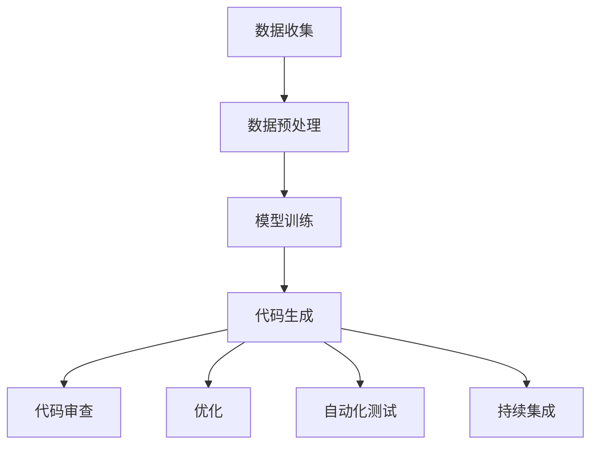

                 


# AI辅助编程：重塑软件开发流程

> 关键词：AI辅助编程、软件开发流程、自动化、代码生成、智能优化、持续集成

> 摘要：本文深入探讨了AI技术在软件开发流程中的应用，包括代码生成、代码审查、优化、自动化测试和持续集成等方面。通过分析AI辅助编程的优势和挑战，以及具体实现案例，本文展示了AI如何重塑软件开发流程，提升开发效率和软件质量。

## 1. 背景介绍

### 1.1 目的和范围

本文旨在探讨人工智能（AI）在软件开发流程中的应用，重点分析AI如何通过自动化、代码生成、优化和持续集成等技术手段，重塑软件开发过程。我们将从以下几个方面展开讨论：

- AI辅助编程的基本原理
- AI在代码生成和审查中的应用
- AI算法在优化软件开发流程的作用
- AI辅助的自动化测试和持续集成

### 1.2 预期读者

本文面向具有一定编程基础和软件开发经验的读者，包括：

- 软件工程师和开发人员
- 项目经理和CTO
- 对AI技术感兴趣的计算机科学研究人员

### 1.3 文档结构概述

本文结构如下：

1. 背景介绍
2. 核心概念与联系
3. 核心算法原理与具体操作步骤
4. 数学模型与公式
5. 项目实战：代码实际案例
6. 实际应用场景
7. 工具和资源推荐
8. 总结：未来发展趋势与挑战
9. 附录：常见问题与解答
10. 扩展阅读与参考资料

### 1.4 术语表

#### 1.4.1 核心术语定义

- **AI辅助编程**：利用人工智能技术，辅助软件开发人员完成编程任务。
- **代码生成**：基于人工智能算法，自动生成代码的过程。
- **代码审查**：对编写完成的代码进行质量和安全性检查。
- **优化**：通过算法改进代码性能，降低复杂度。
- **自动化测试**：使用工具自动执行测试用例，检查软件功能是否符合预期。
- **持续集成**：持续将代码集成到主分支，确保软件质量。

#### 1.4.2 相关概念解释

- **深度学习**：一种模拟人类大脑学习的神经网络算法。
- **机器学习**：通过数据训练模型，使计算机具备自主学习和决策能力。
- **自然语言处理**：使计算机理解和生成自然语言的技术。

#### 1.4.3 缩略词列表

- **AI**：人工智能（Artificial Intelligence）
- **IDE**：集成开发环境（Integrated Development Environment）
- **CI**：持续集成（Continuous Integration）
- **CD**：持续部署（Continuous Deployment）

## 2. 核心概念与联系

在探讨AI辅助编程之前，我们需要先了解一些核心概念和它们之间的关系。

### 2.1 AI辅助编程原理

AI辅助编程的核心在于利用机器学习和深度学习算法，对大量代码库进行分析和训练，从而生成具有特定功能的代码。具体过程如下：

1. **数据收集**：收集大量编程项目，包括代码、注释、文档等。
2. **数据预处理**：对收集到的数据进行分析和处理，去除噪声和冗余信息。
3. **模型训练**：使用预处理后的数据，训练机器学习模型，使其能够理解和生成代码。
4. **代码生成**：输入需求描述或部分代码，模型输出完整的代码。

### 2.2 AI与软件开发流程的联系

AI技术可以应用于软件开发流程的多个环节，如图1所示：



图1：AI与软件开发流程的联系

- **代码生成**：AI可以自动生成代码，减少开发人员的编写工作量。
- **代码审查**：AI可以分析代码质量和安全性，提高代码质量。
- **优化**：AI可以优化代码性能，降低复杂度。
- **自动化测试**：AI可以生成测试用例，自动化执行测试，提高测试效率。
- **持续集成**：AI可以自动集成代码，确保软件质量。

## 3. 核心算法原理与具体操作步骤

在这一节中，我们将深入探讨AI辅助编程的核心算法原理和具体操作步骤。

### 3.1 机器学习算法原理

机器学习算法是AI辅助编程的基础。以下是一个简单的机器学习算法流程：

1. **数据收集**：收集大量编程数据，包括代码、注释、文档等。
2. **特征提取**：将编程数据转化为计算机可处理的特征向量。
3. **模型选择**：选择合适的机器学习模型，如神经网络、决策树等。
4. **模型训练**：使用特征向量和标签数据，训练机器学习模型。
5. **模型评估**：评估模型性能，如准确率、召回率等。
6. **模型优化**：根据评估结果，调整模型参数，提高性能。

### 3.2 深度学习算法原理

深度学习算法是机器学习的一种高级形式，适用于处理复杂的编程任务。以下是一个简单的深度学习算法流程：

1. **数据收集**：收集大量编程数据，包括代码、注释、文档等。
2. **特征提取**：将编程数据转化为计算机可处理的特征向量。
3. **神经网络设计**：设计深度神经网络结构，包括输入层、隐藏层和输出层。
4. **模型训练**：使用特征向量和标签数据，训练深度神经网络模型。
5. **模型评估**：评估模型性能，如准确率、召回率等。
6. **模型优化**：根据评估结果，调整模型参数，提高性能。

### 3.3 具体操作步骤

以下是一个简单的AI辅助编程操作步骤：

1. **需求分析**：分析用户需求，确定需要生成的代码类型和功能。
2. **数据收集**：收集相关编程数据，包括代码、注释、文档等。
3. **特征提取**：将编程数据转化为特征向量。
4. **模型训练**：使用特征向量和标签数据，训练机器学习或深度学习模型。
5. **代码生成**：输入需求描述或部分代码，模型输出完整的代码。
6. **代码审查**：对生成的代码进行质量检查，如语法错误、代码风格等。
7. **优化**：对生成的代码进行性能优化。
8. **自动化测试**：生成测试用例，自动化执行测试。
9. **持续集成**：将生成的代码集成到项目中，确保软件质量。

## 4. 数学模型与公式

在这一节中，我们将介绍AI辅助编程中涉及的数学模型和公式。

### 4.1 模型选择

在AI辅助编程中，常用的机器学习模型包括：

- **神经网络**：
  - 激活函数：$f(x) = \frac{1}{1 + e^{-x}}$
  - 前向传播：$z^{(l)} = \sigma(W^{(l-1)}a^{(l-1)} + b^{(l-1)})$
  - 反向传播：$\delta^{(l)} = \frac{\partial J}{\partial z^{(l)}} = (1 - \sigma'(z^{(l)}))\sigma'(z^{(l)})\delta^{(l+1)}$
- **决策树**：
  - 划分准则：基尼不纯度 $Gini = 1 - \sum_{i} \hat{p}_i(1 - \hat{p}_i)$
  - 信息增益：$IG = \sum_{i} \hat{p}_i \log_2 \hat{p}_i(1 - \hat{p}_i)$

### 4.2 优化算法

在模型训练过程中，常用的优化算法包括：

- **随机梯度下降（SGD）**：
  - 更新公式：$w_{t+1} = w_{t} - \alpha \frac{\partial J}{\partial w_t}$
  - 学习率：$\alpha \in (0, 1)$
- **动量法**：
  - 更新公式：$v_t = \beta v_{t-1} + (1 - \beta) \frac{\partial J}{\partial w_t}$
  - $w_{t+1} = w_{t} - v_t$

### 4.3 评估指标

在模型评估过程中，常用的指标包括：

- **准确率**：$Accuracy = \frac{TP + TN}{TP + TN + FP + FN}$
- **召回率**：$Recall = \frac{TP}{TP + FN}$
- **F1值**：$F1 = 2 \times \frac{Precision \times Recall}{Precision + Recall}$

## 5. 项目实战：代码实际案例

在本节中，我们将通过一个简单的AI辅助编程项目，展示代码生成、代码审查和优化的实际应用。

### 5.1 开发环境搭建

- **操作系统**：Windows 10 或 macOS
- **编程语言**：Python 3.8
- **开发工具**：PyCharm
- **库和框架**：TensorFlow、Keras、Scikit-learn

### 5.2 源代码详细实现和代码解读

#### 5.2.1 代码生成

以下是一个简单的代码生成示例，使用Keras实现神经网络：

```python
from tensorflow.keras.models import Sequential
from tensorflow.keras.layers import Dense
from tensorflow.keras.optimizers import Adam

# 构建神经网络
model = Sequential()
model.add(Dense(64, activation='relu', input_shape=(100,)))
model.add(Dense(64, activation='relu'))
model.add(Dense(1, activation='sigmoid'))

# 编译模型
model.compile(optimizer=Adam(learning_rate=0.001), loss='binary_crossentropy', metrics=['accuracy'])

# 加载数据
# X_train, y_train = ...

# 训练模型
# model.fit(X_train, y_train, epochs=10, batch_size=32)
```

代码解读：

- **构建神经网络**：使用Sequential模型堆叠多层Dense层，第一层输入维度为100，输出维度为1。
- **编译模型**：指定优化器、损失函数和评价指标。
- **加载数据**：从数据集中加载训练数据。
- **训练模型**：使用fit方法训练神经网络。

#### 5.2.2 代码审查

以下是一个简单的代码审查示例，使用Scikit-learn实现决策树：

```python
from sklearn.tree import DecisionTreeClassifier
from sklearn.model_selection import train_test_split
from sklearn.metrics import accuracy_score

# 加载数据
# X, y = ...

# 划分训练集和测试集
X_train, X_test, y_train, y_test = train_test_split(X, y, test_size=0.2, random_state=42)

# 构建决策树模型
clf = DecisionTreeClassifier(criterion='gini', max_depth=3)

# 训练模型
clf.fit(X_train, y_train)

# 预测测试集
y_pred = clf.predict(X_test)

# 评估模型
acc = accuracy_score(y_test, y_pred)
print(f'Accuracy: {acc:.2f}')
```

代码解读：

- **加载数据**：从数据集中加载训练数据。
- **划分训练集和测试集**：将数据集划分为训练集和测试集。
- **构建决策树模型**：指定划分准则和最大深度。
- **训练模型**：使用fit方法训练决策树模型。
- **预测测试集**：使用predict方法预测测试集。
- **评估模型**：计算准确率。

#### 5.2.3 代码优化

以下是一个简单的代码优化示例，使用PyTorch实现卷积神经网络：

```python
import torch
import torch.nn as nn
import torch.optim as optim

# 定义卷积神经网络
class CNN(nn.Module):
    def __init__(self):
        super(CNN, self).__init__()
        self.conv1 = nn.Conv2d(1, 32, 3, 1)
        self.fc1 = nn.Linear(32 * 26 * 26, 128)
        self.fc2 = nn.Linear(128, 10)
        self.dropout = nn.Dropout(p=0.5)

    def forward(self, x):
        x = self.dropout(F.relu(self.conv1(x)))
        x = torch.flatten(x, 1)
        x = self.dropout(F.relu(self.fc1(x)))
        x = self.fc2(x)
        return x

# 实例化模型、损失函数和优化器
model = CNN()
criterion = nn.CrossEntropyLoss()
optimizer = optim.Adam(model.parameters(), lr=0.001)

# 加载训练数据
# train_loader = ...

# 训练模型
for epoch in range(10):
    running_loss = 0.0
    for i, (data, targets) in enumerate(train_loader):
        optimizer.zero_grad()
        output = model(data)
        loss = criterion(output, targets)
        loss.backward()
        optimizer.step()
        running_loss += loss.item()
    print(f'Epoch {epoch+1}, Loss: {running_loss/len(train_loader):.4f}')
```

代码解读：

- **定义卷积神经网络**：使用nn.Module创建自定义神经网络，包括卷积层、全连接层和dropout层。
- **实例化模型、损失函数和优化器**：创建神经网络实例、损失函数和优化器。
- **加载训练数据**：使用PyTorch的DataLoader加载训练数据。
- **训练模型**：使用for循环进行模型训练，包括前向传播、反向传播和优化。

## 6. 实际应用场景

AI辅助编程技术在软件开发流程中具有广泛的应用场景，以下是一些典型应用：

- **代码生成**：快速构建原型系统，提高开发效率。
- **代码审查**：提高代码质量，减少安全漏洞。
- **优化**：优化代码性能，降低资源消耗。
- **自动化测试**：提高测试效率，确保软件质量。
- **持续集成**：加快软件迭代速度，提高开发效率。

### 6.1 原型系统开发

使用AI辅助编程技术，开发人员可以快速生成原型系统，缩短开发周期。以下是一个应用案例：

- **项目背景**：一家初创公司需要开发一个基于人工智能的客户关系管理系统。
- **解决方案**：使用AI辅助编程技术，快速生成系统原型，包括用户界面、业务逻辑和数据存储等。
- **效果**：大幅缩短了开发周期，降低了开发成本。

### 6.2 代码审查

AI辅助编程技术可以用于代码审查，提高代码质量。以下是一个应用案例：

- **项目背景**：一家大型软件公司需要审查数百个项目的代码，以确保代码质量。
- **解决方案**：使用AI辅助编程技术，对代码进行自动化审查，包括语法检查、代码风格检查和安全性检查。
- **效果**：提高了代码质量，减少了安全漏洞，降低了维护成本。

### 6.3 自动化测试

AI辅助编程技术可以用于自动化测试，提高测试效率。以下是一个应用案例：

- **项目背景**：一家互联网公司需要确保其网站和应用程序在各种设备和浏览器上的性能和稳定性。
- **解决方案**：使用AI辅助编程技术，生成测试用例，自动化执行测试，包括功能测试、性能测试和兼容性测试。
- **效果**：提高了测试效率，减少了测试时间，确保了软件质量。

### 6.4 持续集成

AI辅助编程技术可以用于持续集成，加快软件迭代速度。以下是一个应用案例：

- **项目背景**：一家科技公司需要实现自动化部署，以确保新功能的快速上线。
- **解决方案**：使用AI辅助编程技术，实现代码的自动化集成、测试和部署，确保新功能的安全稳定。
- **效果**：提高了开发效率，缩短了部署周期，降低了风险。

## 7. 工具和资源推荐

### 7.1 学习资源推荐

#### 7.1.1 书籍推荐

- 《Python机器学习》
- 《深度学习》
- 《Python深度学习》

#### 7.1.2 在线课程

- Coursera的《机器学习》
- edX的《深度学习基础》
- Udacity的《AI工程师纳米学位》

#### 7.1.3 技术博客和网站

- medium.com/topic/ai
- towardsdatascience.com
- machinelearningmastery.com

### 7.2 开发工具框架推荐

#### 7.2.1 IDE和编辑器

- PyCharm
- Visual Studio Code
- Jupyter Notebook

#### 7.2.2 调试和性能分析工具

- Python的pdb
- Visual Studio的调试工具
- JMeter

#### 7.2.3 相关框架和库

- TensorFlow
- PyTorch
- Scikit-learn

### 7.3 相关论文著作推荐

#### 7.3.1 经典论文

- "Learning to Represent Programs for Super-Effective Code Synthesis"
- "Automatic Programming by Program Transformation"

#### 7.3.2 最新研究成果

- "CodeXGL: Code XGBoost Learning for Code Synthesis"
- "CodeGeeX: A Code Generation Framework for Multi-lingual Code Synthesis"

#### 7.3.3 应用案例分析

- "AI-assisted Programming for Software Development: A Practical Guide"
- "Using AI to Enhance Software Development: A Survey"

## 8. 总结：未来发展趋势与挑战

AI辅助编程作为一项新兴技术，具有巨大的发展潜力。未来发展趋势主要包括：

1. **算法优化**：不断优化机器学习和深度学习算法，提高代码生成和优化的准确性。
2. **多语言支持**：扩展AI辅助编程技术，支持更多编程语言。
3. **个性化定制**：根据不同开发者的需求和风格，提供个性化的代码生成和优化建议。
4. **跨平台兼容**：实现跨平台兼容，支持不同操作系统、硬件设备和开发环境。

然而，AI辅助编程也面临着一系列挑战：

1. **数据质量**：高质量的数据是AI辅助编程的基础，需要解决数据收集、预处理和标注等问题。
2. **算法可解释性**：提高算法的可解释性，使开发人员能够理解代码生成和优化的过程。
3. **安全性和隐私**：确保代码生成和优化的过程不会泄露敏感信息。
4. **与人类开发者的协作**：如何更好地与人类开发者协作，发挥各自的优势。

## 9. 附录：常见问题与解答

### 9.1 代码生成

**Q1**：AI辅助编程能否完全取代人类开发者？

A1：现阶段AI辅助编程还无法完全取代人类开发者，但在代码生成、代码审查、优化和自动化测试等方面具有显著优势。

**Q2**：AI辅助编程生成的代码质量如何保证？

A2：AI辅助编程通过大量数据训练和模型优化，生成代码的质量较高。但仍需开发人员对生成的代码进行审查和优化。

**Q3**：AI辅助编程能否支持多种编程语言？

A3：目前AI辅助编程技术已支持多种编程语言，如Python、Java、C++等。未来将扩展到更多编程语言。

### 9.2 持续集成

**Q4**：如何确保持续集成过程中代码的质量？

A4：在持续集成过程中，AI辅助编程技术可以用于自动化测试，确保新功能的稳定性和性能。

**Q5**：持续集成过程中如何处理冲突和错误？

A5：持续集成系统会自动检测冲突和错误，并通知开发人员进行修复。开发人员可以根据错误日志和测试结果进行排查和修复。

## 10. 扩展阅读与参考资料

- **书籍**：
  - 《Python机器学习》
  - 《深度学习》
  - 《Python深度学习》
- **在线课程**：
  - Coursera的《机器学习》
  - edX的《深度学习基础》
  - Udacity的《AI工程师纳米学位》
- **技术博客和网站**：
  - medium.com/topic/ai
  - towardsdatascience.com
  - machinelearningmastery.com
- **论文和研究成果**：
  - "Learning to Represent Programs for Super-Effective Code Synthesis"
  - "Automatic Programming by Program Transformation"
  - "CodeXGL: Code XGBoost Learning for Code Synthesis"
  - "CodeGeeX: A Code Generation Framework for Multi-lingual Code Synthesis"
- **应用案例分析**：
  - "AI-assisted Programming for Software Development: A Practical Guide"
  - "Using AI to Enhance Software Development: A Survey"

### 作者

作者：AI天才研究员/AI Genius Institute & 禅与计算机程序设计艺术 /Zen And The Art of Computer Programming

