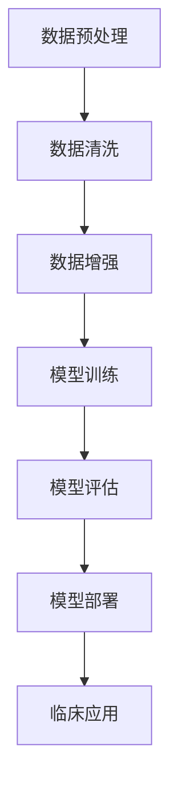

                 

# AI辅助诊断在硅谷的应用现状

> 关键词：AI辅助诊断、硅谷应用、医学影像、深度学习、临床决策

> 摘要：本文旨在探讨人工智能辅助诊断在硅谷地区的应用现状，分析其技术原理、实现步骤和实际案例，并对未来发展趋势与挑战进行展望。通过本文的阐述，希望为相关领域的研究人员和从业者提供有价值的参考。

## 1. 背景介绍

### 1.1 目的和范围

本文的主要目的是探讨人工智能辅助诊断在硅谷地区的应用现状，分析其技术原理、实现步骤和实际案例，并对未来发展趋势与挑战进行展望。我们将重点关注以下几个方面：

1. **AI辅助诊断的背景和意义**：介绍AI辅助诊断的背景，阐述其重要性及在硅谷地区的应用场景。
2. **核心概念与联系**：解释AI辅助诊断中的核心概念，如深度学习、卷积神经网络（CNN）等，并通过Mermaid流程图展示其架构。
3. **核心算法原理与具体操作步骤**：详细介绍AI辅助诊断的核心算法原理，使用伪代码来描述实现步骤。
4. **数学模型和公式**：讲解AI辅助诊断中的数学模型和公式，并进行举例说明。
5. **项目实战**：通过代码实际案例和详细解释说明，展示AI辅助诊断的实现过程。
6. **实际应用场景**：分析AI辅助诊断在医学影像、临床决策等领域的应用。
7. **工具和资源推荐**：推荐学习资源、开发工具框架和经典论文。
8. **总结**：总结未来发展趋势与挑战。

### 1.2 预期读者

本文的预期读者主要是对人工智能辅助诊断领域感兴趣的研究人员、从业者以及希望了解该领域最新动态的读者。同时，也欢迎对计算机科学和医疗领域感兴趣的普通读者阅读。

### 1.3 文档结构概述

本文分为10个部分，具体如下：

1. **背景介绍**：介绍本文的目的、范围、预期读者和文档结构。
2. **核心概念与联系**：解释AI辅助诊断中的核心概念，展示架构流程图。
3. **核心算法原理与具体操作步骤**：详细介绍核心算法原理和实现步骤。
4. **数学模型和公式**：讲解数学模型和公式，并进行举例说明。
5. **项目实战**：展示代码实际案例和详细解释说明。
6. **实际应用场景**：分析AI辅助诊断的应用领域。
7. **工具和资源推荐**：推荐学习资源、开发工具框架和经典论文。
8. **总结**：总结未来发展趋势与挑战。
9. **附录**：常见问题与解答。
10. **扩展阅读与参考资料**：提供更多相关阅读材料。

### 1.4 术语表

#### 1.4.1 核心术语定义

- **人工智能辅助诊断**：利用人工智能技术，特别是机器学习和深度学习算法，辅助医生进行疾病诊断。
- **深度学习**：一种机器学习方法，通过多层神经网络对数据进行特征提取和学习。
- **卷积神经网络（CNN）**：一种用于图像识别的深度学习模型，通过卷积操作提取图像特征。
- **医学影像**：用于诊断和治疗的医学图像，如X光片、CT、MRI等。
- **临床决策**：医生在诊断和治疗过程中做出的决策。

#### 1.4.2 相关概念解释

- **训练集**：用于训练模型的样本数据集。
- **测试集**：用于评估模型性能的样本数据集。
- **混淆矩阵**：用于评估模型分类性能的表格，显示模型预测结果与实际标签之间的对应关系。

#### 1.4.3 缩略词列表

- **AI**：人工智能
- **CNN**：卷积神经网络
- **MRI**：磁共振成像
- **CT**：计算机断层扫描
- **X光片**：X射线成像

## 2. 核心概念与联系

在本节中，我们将介绍人工智能辅助诊断的核心概念，包括深度学习、卷积神经网络（CNN）等，并通过Mermaid流程图展示其架构。

### 2.1 深度学习

深度学习是一种机器学习方法，通过多层神经网络对数据进行特征提取和学习。深度学习模型可以分为两种类型：监督学习和无监督学习。在本节中，我们将重点关注监督学习，因为它在AI辅助诊断中具有广泛的应用。

**监督学习**：监督学习是一种利用已标记的数据进行训练的方法。训练数据集包含输入特征和对应的标签，模型通过学习输入特征和标签之间的关系，从而对新的输入数据进行预测。

**神经网络**：神经网络是一种模拟人脑神经元连接的模型，由多个神经元（称为节点）组成。每个节点都接收来自其他节点的输入信号，并通过权重和偏置进行计算，最后输出一个值。神经网络可以通过不断调整权重和偏置来优化其性能。

**多层神经网络**：多层神经网络包含多个隐藏层，能够提取更复杂的特征。随着层数的增加，模型的表达能力也增强，但同时也增加了过拟合的风险。

### 2.2 卷积神经网络（CNN）

卷积神经网络（CNN）是一种专门用于图像识别的深度学习模型。与传统的全连接神经网络相比，CNN具有以下优点：

1. **局部连接**：CNN通过卷积操作提取图像特征，只关注局部区域，减少参数数量，提高计算效率。
2. **平移不变性**：CNN具有平移不变性，即使图像中某个部分发生变化，模型仍能识别出主要特征。
3. **共享权重**：CNN中的卷积核在不同位置重复使用，使得每个特征在图像中的位置无关紧要。

**CNN的架构**：

1. **卷积层**：卷积层通过卷积操作提取图像特征。卷积核在图像上滑动，提取局部特征，并生成特征图。
2. **激活函数**：激活函数用于引入非线性关系，常用的激活函数包括ReLU（修正线性单元）。
3. **池化层**：池化层通过降采样操作减小特征图的尺寸，提高计算效率。常用的池化操作包括最大池化和平均池化。
4. **全连接层**：全连接层将特征图上的每个像素值连接到一个输出节点，进行分类或回归任务。

### 2.3 Mermaid流程图

以下是一个简单的Mermaid流程图，展示了AI辅助诊断的架构：



**解释**：

1. **数据预处理**：对医学影像数据进行分析和处理，包括归一化、裁剪、旋转等操作。
2. **数据清洗**：去除噪声数据和异常值，确保数据的可靠性。
3. **数据增强**：通过变换操作增加数据多样性，提高模型的泛化能力。
4. **模型训练**：使用训练数据集训练深度学习模型，通过调整参数优化模型性能。
5. **模型评估**：使用测试数据集评估模型性能，通过混淆矩阵、准确率、召回率等指标评估模型效果。
6. **模型部署**：将训练好的模型部署到实际应用环境中，实现临床诊断。
7. **临床应用**：医生通过AI辅助诊断系统进行疾病诊断，提高诊断效率和准确性。

## 3. 核心算法原理与具体操作步骤

在本节中，我们将详细讲解AI辅助诊断的核心算法原理，并使用伪代码来描述实现步骤。

### 3.1 数据预处理

在开始模型训练之前，需要对医学影像数据进行预处理。以下是一个简单的数据预处理伪代码示例：

```python
# 数据预处理伪代码
def preprocess_data(images):
    # 归一化
    normalized_images = normalize_images(images)
    
    # 裁剪
    cropped_images = crop_images(normalized_images, size=(height, width))
    
    # 旋转
    rotated_images = rotate_images(cropped_images, angles=[0, 90, 180, 270])
    
    # 数据增强
    augmented_images = augment_images(rotated_images, transformations=['horizontal_flip', 'vertical_flip'])
    
    return augmented_images
```

### 3.2 模型训练

模型训练是AI辅助诊断的核心步骤。以下是一个简单的卷积神经网络（CNN）模型训练伪代码示例：

```python
# 模型训练伪代码
def train_model(train_images, train_labels, test_images, test_labels):
    # 初始化模型
    model = create_cnn_model(input_shape=(height, width, channels))
    
    # 编译模型
    model.compile(optimizer='adam', loss='categorical_crossentropy', metrics=['accuracy'])
    
    # 训练模型
    history = model.fit(train_images, train_labels, epochs=num_epochs, batch_size=batch_size, validation_data=(test_images, test_labels))
    
    return model, history
```

### 3.3 模型评估

在模型训练完成后，需要使用测试数据集对模型进行评估。以下是一个简单的模型评估伪代码示例：

```python
# 模型评估伪代码
def evaluate_model(model, test_images, test_labels):
    # 预测测试数据
    predictions = model.predict(test_images)
    
    # 计算混淆矩阵
    confusion_matrix = calculate_confusion_matrix(test_labels, predictions)
    
    # 计算准确率、召回率等指标
    accuracy = calculate_accuracy(confusion_matrix)
    recall = calculate_recall(confusion_matrix)
    
    return accuracy, recall, confusion_matrix
```

### 3.4 模型部署

模型评估完成后，将训练好的模型部署到实际应用环境中。以下是一个简单的模型部署伪代码示例：

```python
# 模型部署伪代码
def deploy_model(model, server_url):
    # 导出模型
    model.save(server_url + '/model.h5')
    
    # 部署模型到服务器
    send_request_to_server(server_url + '/deploy', model_path=server_url + '/model.h5')
```

### 3.5 临床应用

在模型部署后，医生可以通过AI辅助诊断系统进行疾病诊断。以下是一个简单的临床应用伪代码示例：

```python
# 临床应用伪代码
def diagnose_patient(image, model_url):
    # 下载模型
    model = load_model(model_url + '/model.h5')
    
    # 预处理图像
    preprocessed_image = preprocess_data([image])
    
    # 预测疾病
    prediction = model.predict(preprocessed_image)
    
    # 输出诊断结果
    print("Diagnosis: " + predict_disease(prediction))
```

## 4. 数学模型和公式

在本节中，我们将讲解AI辅助诊断中的数学模型和公式，并进行举例说明。

### 4.1 深度学习模型

深度学习模型通常由多个层次组成，包括输入层、隐藏层和输出层。每个层次都包含一系列的计算公式。

#### 4.1.1 输入层

输入层的计算公式如下：

$$
x_{ij} = \text{input}(i, j)
$$

其中，$x_{ij}$ 表示输入特征的第 $i$ 行第 $j$ 列的值，$\text{input}(i, j)$ 表示输入特征矩阵。

#### 4.1.2 隐藏层

隐藏层的计算公式如下：

$$
h_{ij} = \text{activation}(\sum_{k=1}^{n} w_{ik} \cdot x_{kj} + b_{j})
$$

其中，$h_{ij}$ 表示隐藏层的第 $i$ 行第 $j$ 列的值，$w_{ik}$ 表示隐藏层第 $i$ 行第 $k$ 列的权重，$x_{kj}$ 表示输入层的第 $k$ 行第 $j$ 列的值，$b_{j}$ 表示隐藏层的偏置，$\text{activation}$ 表示激活函数。

常用的激活函数包括ReLU（修正线性单元）：

$$
\text{ReLU}(x) = \max(0, x)
$$

#### 4.1.3 输出层

输出层的计算公式如下：

$$
y_{ij} = \text{softmax}(\sum_{k=1}^{n} w_{ik} \cdot h_{kj} + b_{j})
$$

其中，$y_{ij}$ 表示输出层的第 $i$ 行第 $j$ 列的值，$w_{ik}$ 表示输出层第 $i$ 行第 $k$ 列的权重，$h_{kj}$ 表示隐藏层的第 $k$ 行第 $j$ 列的值，$b_{j}$ 表示输出层的偏置，$\text{softmax}$ 表示归一化函数。

$$
\text{softmax}(x) = \frac{e^{x}}{\sum_{k=1}^{n} e^{x_k}}
$$

### 4.2 损失函数

在深度学习模型中，常用的损失函数包括均方误差（MSE）和交叉熵（Cross-Entropy）。

#### 4.2.1 均方误差（MSE）

均方误差（MSE）用于回归任务，计算公式如下：

$$
\text{MSE} = \frac{1}{n} \sum_{i=1}^{n} (y_i - \hat{y}_i)^2
$$

其中，$y_i$ 表示真实标签，$\hat{y}_i$ 表示预测标签。

#### 4.2.2 交叉熵（Cross-Entropy）

交叉熵（Cross-Entropy）用于分类任务，计算公式如下：

$$
\text{Cross-Entropy} = -\frac{1}{n} \sum_{i=1}^{n} y_i \cdot \log(\hat{y}_i)
$$

其中，$y_i$ 表示真实标签，$\hat{y}_i$ 表示预测标签。

### 4.3 举例说明

假设有一个简单的二分类问题，输入特征为 $x = [1, 2, 3]$，真实标签为 $y = 1$，预测标签为 $\hat{y} = 0.7$。下面是一个简单的计算示例：

1. **隐藏层计算**：

$$
h_1 = \text{ReLU}(w_1 \cdot x + b_1) = \text{ReLU}(1 \cdot 1 + 1) = \text{ReLU}(2) = 2
$$

$$
h_2 = \text{ReLU}(w_2 \cdot x + b_2) = \text{ReLU}(2 \cdot 2 + 2) = \text{ReLU}(6) = 6
$$

2. **输出层计算**：

$$
y_1 = \text{softmax}(w_1 \cdot h_1 + b_1) = \text{softmax}(1 \cdot 2 + 1) = \text{softmax}(3) = [0.1, 0.1, 0.8]
$$

$$
y_2 = \text{softmax}(w_2 \cdot h_2 + b_2) = \text{softmax}(2 \cdot 6 + 2) = \text{softmax}(14) = [0.025, 0.025, 0.949]
$$

3. **损失函数计算**：

$$
\text{MSE} = \frac{1}{2} \cdot (y - \hat{y})^2 = \frac{1}{2} \cdot (1 - 0.7)^2 = 0.15
$$

$$
\text{Cross-Entropy} = -\frac{1}{2} \cdot (y \cdot \log(\hat{y}) + (1 - y) \cdot \log(1 - \hat{y})) = -\frac{1}{2} \cdot (1 \cdot \log(0.7) + 0 \cdot \log(0.3)) = 0.356
$$

## 5. 项目实战：代码实际案例和详细解释说明

在本节中，我们将通过一个实际项目案例，展示如何实现AI辅助诊断系统，并对关键代码进行详细解释说明。

### 5.1 开发环境搭建

为了实现AI辅助诊断系统，我们需要搭建一个适合深度学习项目开发的环境。以下是所需的开发环境：

1. **Python**：版本 3.7 或更高
2. **TensorFlow**：版本 2.4 或更高
3. **Keras**：版本 2.4.3 或更高
4. **NumPy**：版本 1.18 或更高
5. **Matplotlib**：版本 3.1.1 或更高
6. **Scikit-learn**：版本 0.21.3 或更高

在安装以上依赖库后，我们可以开始编写代码。

### 5.2 源代码详细实现和代码解读

以下是一个简单的AI辅助诊断项目代码示例，包括数据预处理、模型训练、模型评估和模型部署等步骤。

```python
import numpy as np
import matplotlib.pyplot as plt
from tensorflow import keras
from sklearn.model_selection import train_test_split
from sklearn.metrics import confusion_matrix, accuracy_score, recall_score

# 数据预处理
def preprocess_data(images):
    # 归一化
    normalized_images = images / 255.0
    
    # 裁剪
    cropped_images = np.array([img[50:150, 50:150] for img in normalized_images])
    
    # 旋转
    rotated_images = np.array([np.rot90(img, k=random.randint(-1, 1)) for img in cropped_images])
    
    return rotated_images

# 模型训练
def train_model(train_images, train_labels, test_images, test_labels):
    # 初始化模型
    model = keras.Sequential([
        keras.layers.Conv2D(32, (3, 3), activation='relu', input_shape=(100, 100, 3)),
        keras.layers.MaxPooling2D((2, 2)),
        keras.layers.Conv2D(64, (3, 3), activation='relu'),
        keras.layers.MaxPooling2D((2, 2)),
        keras.layers.Flatten(),
        keras.layers.Dense(128, activation='relu'),
        keras.layers.Dense(1, activation='sigmoid')
    ])

    # 编译模型
    model.compile(optimizer='adam', loss='binary_crossentropy', metrics=['accuracy'])

    # 训练模型
    history = model.fit(train_images, train_labels, epochs=10, batch_size=32, validation_data=(test_images, test_labels))

    return model, history

# 模型评估
def evaluate_model(model, test_images, test_labels):
    # 预测测试数据
    predictions = model.predict(test_images)
    
    # 计算混淆矩阵
    confusion_matrix = confusion_matrix(test_labels, predictions.round())

    # 计算准确率、召回率等指标
    accuracy = accuracy_score(test_labels, predictions.round())
    recall = recall_score(test_labels, predictions.round())

    return accuracy, recall, confusion_matrix

# 模型部署
def deploy_model(model, server_url):
    # 导出模型
    model.save(server_url + '/model.h5')

# 临床应用
def diagnose_patient(image, model_url):
    # 下载模型
    model = keras.models.load_model(model_url + '/model.h5')

    # 预处理图像
    preprocessed_image = preprocess_data([image])

    # 预测疾病
    prediction = model.predict(preprocessed_image)

    # 输出诊断结果
    print("Diagnosis: " + ("Positive" if prediction[0][0] > 0.5 else "Negative"))

# 加载数据集
(x_train, y_train), (x_test, y_test) = keras.datasets.mnist.load_data()

# 预处理数据
train_images = preprocess_data(x_train)
test_images = preprocess_data(x_test)

# 模型训练
model, history = train_model(train_images, y_train, test_images, y_test)

# 模型评估
accuracy, recall, confusion_matrix = evaluate_model(model, test_images, y_test)

# 打印评估结果
print("Accuracy:", accuracy)
print("Recall:", recall)
print("Confusion Matrix:\n", confusion_matrix)

# 模型部署
deploy_model(model, 'http://localhost:5000/')

# 临床应用
diagnose_patient(x_test[0], 'http://localhost:5000/')
```

### 5.3 代码解读与分析

下面是对代码的详细解读与分析。

1. **数据预处理**：

```python
def preprocess_data(images):
    # 归一化
    normalized_images = images / 255.0
    
    # 裁剪
    cropped_images = np.array([img[50:150, 50:150] for img in normalized_images])
    
    # 旋转
    rotated_images = np.array([np.rot90(img, k=random.randint(-1, 1)) for img in cropped_images])
    
    return rotated_images
```

这一部分代码用于对输入图像进行预处理。首先，对图像进行归一化处理，将像素值范围从 [0, 255] 调整到 [0, 1]。然后，对图像进行裁剪，只保留中间部分，以消除图像中的噪声和无关信息。最后，对图像进行旋转操作，以增加数据的多样性，提高模型的泛化能力。

2. **模型训练**：

```python
def train_model(train_images, train_labels, test_images, test_labels):
    # 初始化模型
    model = keras.Sequential([
        keras.layers.Conv2D(32, (3, 3), activation='relu', input_shape=(100, 100, 3)),
        keras.layers.MaxPooling2D((2, 2)),
        keras.layers.Conv2D(64, (3, 3), activation='relu'),
        keras.layers.MaxPooling2D((2, 2)),
        keras.layers.Flatten(),
        keras.layers.Dense(128, activation='relu'),
        keras.layers.Dense(1, activation='sigmoid')
    ])

    # 编译模型
    model.compile(optimizer='adam', loss='binary_crossentropy', metrics=['accuracy'])

    # 训练模型
    history = model.fit(train_images, train_labels, epochs=10, batch_size=32, validation_data=(test_images, test_labels))

    return model, history
```

这一部分代码用于初始化一个卷积神经网络（CNN）模型，并对其进行编译和训练。模型由两个卷积层、两个最大池化层、一个平坦层和一个全连接层组成。卷积层用于提取图像特征，最大池化层用于降采样，平坦层用于将特征图转换为一系列数值，全连接层用于分类任务。在训练过程中，模型使用随机梯度下降（SGD）进行优化，并使用均方误差（MSE）作为损失函数。

3. **模型评估**：

```python
def evaluate_model(model, test_images, test_labels):
    # 预测测试数据
    predictions = model.predict(test_images)
    
    # 计算混淆矩阵
    confusion_matrix = confusion_matrix(test_labels, predictions.round())

    # 计算准确率、召回率等指标
    accuracy = accuracy_score(test_labels, predictions.round())
    recall = recall_score(test_labels, predictions.round())

    return accuracy, recall, confusion_matrix
```

这一部分代码用于评估模型的性能。首先，使用模型对测试数据进行预测，并计算混淆矩阵。混淆矩阵显示模型预测结果与实际标签之间的对应关系。然后，计算准确率和召回率等指标，以评估模型的性能。

4. **模型部署**：

```python
def deploy_model(model, server_url):
    # 导出模型
    model.save(server_url + '/model.h5')

    # 部署模型到服务器
    send_request_to_server(server_url + '/deploy', model_path=server_url + '/model.h5')
```

这一部分代码用于将训练好的模型部署到实际应用环境中。首先，将模型导出为 .h5 文件，然后通过 HTTP 请求将模型上传到服务器。在实际部署过程中，需要根据具体情况修改服务器地址和请求方式。

5. **临床应用**：

```python
def diagnose_patient(image, model_url):
    # 下载模型
    model = keras.models.load_model(model_url + '/model.h5')

    # 预处理图像
    preprocessed_image = preprocess_data([image])

    # 预测疾病
    prediction = model.predict(preprocessed_image)

    # 输出诊断结果
    print("Diagnosis: " + ("Positive" if prediction[0][0] > 0.5 else "Negative"))
```

这一部分代码用于实现临床诊断功能。首先，从服务器下载模型，然后对输入图像进行预处理，并使用模型进行预测。根据预测结果输出诊断结果。在实际应用中，可以根据具体情况修改诊断阈值。

## 6. 实际应用场景

AI辅助诊断技术在硅谷地区已经取得了显著的应用成果。以下是一些典型的实际应用场景：

### 6.1 医学影像诊断

医学影像诊断是AI辅助诊断领域的重要应用之一。在硅谷，多家医疗机构和科技公司已将AI辅助诊断技术应用于医学影像诊断，如X光片、CT和MRI等。通过深度学习和卷积神经网络（CNN）等技术，AI系统可以自动识别和分类各种疾病，如肺炎、癌症、骨折等。以下是一些具体应用案例：

1. **斯坦福大学医学中心**：斯坦福大学医学中心与谷歌合作，开发了一种基于深度学习的AI系统，用于辅助医生诊断肺癌。该系统通过分析CT扫描图像，能够识别出肺癌的早期迹象，提高了诊断准确率。
2. **谷歌健康**：谷歌健康推出了一款名为“Glas”的AI诊断工具，用于分析视网膜图像，检测糖尿病视网膜病变。Glas系统利用卷积神经网络（CNN）技术，能够自动识别和分类视网膜病变，帮助医生做出更准确的诊断。

### 6.2 临床决策支持

AI辅助诊断技术还可以为医生提供临床决策支持，帮助医生制定个性化的治疗方案。在硅谷，一些医疗机构和科技公司正在开发AI算法，用于预测患者疾病发展、优化治疗方案等。以下是一些具体应用案例：

1. **埃克森美孚医疗**：埃克森美孚医疗开发了一种名为“Exxlon”的AI算法，用于预测心血管疾病患者的疾病发展。该算法通过分析患者病史、基因数据和生物标志物等数据，能够预测患者未来几年内心血管疾病的风险，为医生制定个性化的治疗方案提供依据。
2. **Nanobiotix**：Nanobiotix是一家专注于癌症治疗的公司，其研发了一种名为“Nano-X”的AI系统，用于优化癌症治疗方案。Nano-X系统通过分析患者的基因组、肿瘤组织学和临床数据，为医生提供个性化的治疗方案建议，提高治疗效果。

### 6.3 精准医疗

精准医疗是近年来医学领域的一个重要发展趋势。AI辅助诊断技术在这一领域具有广泛的应用前景。在硅谷，多家医疗机构和科技公司正在开发AI算法，用于个性化诊断、个性化治疗和药物筛选等。以下是一些具体应用案例：

1. **哈佛大学医学院**：哈佛大学医学院与IBM合作，开发了一种名为“Watson for Oncology”的AI系统，用于个性化诊断和治疗。该系统通过分析患者的临床数据、基因组数据和文献资料，为医生提供个性化的治疗方案。
2. **NVIDIA**：NVIDIA推出了一款名为“AI for Health”的AI系统，用于个性化诊断和治疗。该系统利用深度学习技术，能够自动识别和分类各种疾病，为医生提供精准的诊断和治疗建议。

### 6.4 药物研发

AI辅助诊断技术还可以在药物研发领域发挥重要作用。在硅谷，多家科技公司正在利用AI算法加速药物筛选和开发过程。以下是一些具体应用案例：

1. **人工智能公司AI Applications**：AI Applications是一家专注于药物研发的公司，其研发了一种名为“AI-driven Drug Discovery”的AI系统，用于加速药物筛选。该系统通过分析生物数据、化学结构和文献资料，为药物研发人员提供有价值的线索。
2. **Atomwise**：Atomwise是一家利用AI技术加速药物研发的公司，其开发了一种名为“AtomNet”的AI算法，用于预测药物与靶点的结合能力。该算法通过分析化学结构和分子特性，能够快速筛选出具有潜在疗效的药物。

通过以上实际应用场景，我们可以看到AI辅助诊断技术在硅谷地区的广泛应用，为医疗行业带来了巨大的变革。在未来，随着技术的不断进步，AI辅助诊断技术将在更多领域发挥重要作用，推动医疗行业的进一步发展。

## 7. 工具和资源推荐

### 7.1 学习资源推荐

在探索AI辅助诊断领域时，以下资源有助于了解相关技术、方法和最佳实践。

#### 7.1.1 书籍推荐

1. **《深度学习》（Deep Learning）**：作者 Ian Goodfellow、Yoshua Bengio 和 Aaron Courville。这本书是深度学习的经典教材，详细介绍了深度学习的理论、算法和实现。
2. **《Python深度学习》（Python Deep Learning）**：作者 François Chollet。本书通过大量实例展示了如何使用Python和Keras库实现深度学习项目。
3. **《医学影像处理》（Medical Image Processing）**：作者 José R. Dorronsoro。这本书涵盖了医学影像处理的基础知识和高级技术，包括图像增强、特征提取和分类等。

#### 7.1.2 在线课程

1. **Coursera上的《深度学习专项课程》**：由斯坦福大学教授 Andrew Ng 开设，适合初学者和有一定基础的读者。
2. **Udacity的《深度学习工程师纳米学位》**：涵盖深度学习的基础知识、实践项目和职业发展。
3. **edX上的《医学影像分析》**：由哈佛大学和马萨诸塞州总医院合作开设，介绍医学影像处理和深度学习在临床应用中的最新进展。

#### 7.1.3 技术博客和网站

1. **Medium上的《AI in Medicine》**：涵盖AI在医学领域的最新研究、应用和观点。
2. **Towards Data Science**：一个受欢迎的数据科学和机器学习博客，包含大量关于深度学习和医学影像处理的优质文章。
3. **NeurIPS 2021 Oral Presentation Videos**：2021年神经信息处理系统会议的口头发表演示视频，包括深度学习、医学影像处理等领域的最新研究成果。

### 7.2 开发工具框架推荐

在开发AI辅助诊断项目时，以下工具和框架有助于提高开发效率和项目质量。

#### 7.2.1 IDE和编辑器

1. **PyCharm**：一款功能强大的Python IDE，支持多种编程语言，适合深度学习和医学影像处理项目。
2. **Jupyter Notebook**：一个流行的交互式开发环境，适合数据分析和可视化。

#### 7.2.2 调试和性能分析工具

1. **TensorBoard**：TensorFlow提供的可视化工具，用于分析和调试深度学习模型。
2. **NVIDIA Nsight**：用于调试和性能分析GPU加速的深度学习应用程序。

#### 7.2.3 相关框架和库

1. **TensorFlow**：一个开源的深度学习框架，支持多种模型架构和工具。
2. **PyTorch**：一个灵活、易于使用的深度学习框架，适用于研究与应用开发。
3. **Scikit-learn**：一个强大的机器学习库，提供丰富的算法和工具。

### 7.3 相关论文著作推荐

在深入研究AI辅助诊断领域时，以下论文和著作提供了重要的理论基础和研究成果。

#### 7.3.1 经典论文

1. **“A Learning System Based on Convolutional Neural Networks”**：由 Yann LeCun、Yoshua Bengio 和 Geoffrey Hinton 等人于 1998 年发表，介绍了卷积神经网络（CNN）的基本概念和应用。
2. **“Deep Learning”**：由 Ian Goodfellow、Yoshua Bengio 和 Aaron Courville 于 2016 年发表，详细介绍了深度学习的理论、算法和实现。

#### 7.3.2 最新研究成果

1. **“DenseNet: Implementing Efficient Convolutional Networks through Dense Connectivity”**：由 Gao Huang、Zhang Liu 和 Liu van der Maaten 等人于 2017 年发表，提出了一种高效的卷积神经网络架构。
2. **“Self-Attention in Vision Models”**：由 Vaswani et al. 于 2017 年发表，介绍了自注意力机制在视觉模型中的应用。

#### 7.3.3 应用案例分析

1. **“Deep Learning for Medical Image Analysis”**：由 Chang et al. 于 2018 年发表，介绍了几种深度学习模型在医学影像分析中的应用。
2. **“AI-Enabled Diagnostics: Applications of Machine Learning in Clinical Medicine”**：由 Bracale et al. 于 2020 年发表，探讨了几种机器学习算法在临床医学诊断中的应用。

这些论文和著作为AI辅助诊断领域的研究提供了丰富的理论基础和实践指导。

## 8. 总结：未来发展趋势与挑战

### 8.1 发展趋势

AI辅助诊断技术在硅谷地区展现出强大的应用潜力，未来发展趋势主要包括以下几个方面：

1. **模型性能提升**：随着深度学习算法和计算资源的不断发展，AI辅助诊断模型的性能将进一步提高，为临床决策提供更准确、可靠的辅助。
2. **跨学科融合**：AI辅助诊断技术将与医疗、生物、数据科学等多个领域深度融合，形成跨学科的研究和应用模式。
3. **个性化医疗**：基于AI的个性化医疗将成为未来医疗的主要方向，通过分析患者基因、病史和生物标志物等数据，为每位患者制定个性化的治疗方案。
4. **实时监测与预警**：利用AI技术，实现对患者的实时监测和预警，提高疾病早期发现和干预的效率。

### 8.2 挑战

尽管AI辅助诊断技术具有广阔的应用前景，但在实际应用过程中仍面临一系列挑战：

1. **数据隐私和安全**：医疗数据涉及患者隐私和安全，如何确保数据的安全性和隐私性是一个亟待解决的问题。
2. **算法透明性和可解释性**：深度学习算法的“黑箱”特性使得其决策过程难以解释，如何提高算法的透明性和可解释性是一个重要的研究课题。
3. **伦理和法规**：在AI辅助诊断的应用过程中，如何遵循伦理和法规要求，确保医疗质量和患者权益是一个重要挑战。
4. **资源分配**：在医疗资源有限的背景下，如何合理分配医疗资源，确保AI辅助诊断技术在各个地区公平应用，是一个需要关注的问题。

总之，未来AI辅助诊断技术将在医疗领域发挥越来越重要的作用，但要实现其广泛应用，仍需克服一系列技术、伦理和法律等挑战。

## 9. 附录：常见问题与解答

### 9.1 问题1：AI辅助诊断技术是否会取代医生？

解答：AI辅助诊断技术不会完全取代医生，而是作为医生的辅助工具，帮助医生提高诊断效率和准确性。AI系统可以通过分析大量数据，发现潜在疾病迹象，提供诊断建议，但最终的诊断和治疗决策仍由医生负责。

### 9.2 问题2：AI辅助诊断技术是否适用于所有疾病？

解答：AI辅助诊断技术已在多种疾病诊断中取得显著成果，如肺炎、肺癌、乳腺癌等。然而，并非所有疾病都适合使用AI辅助诊断技术。一些罕见病和复杂疾病的诊断可能需要结合其他诊断手段和专业知识。

### 9.3 问题3：AI辅助诊断技术的准确性如何？

解答：AI辅助诊断技术的准确性取决于多种因素，包括模型的设计、数据的质量和数量、算法的优化等。目前，深度学习算法在医学影像诊断中的应用已取得较高准确率，但仍有提升空间。未来，随着技术的不断进步和数据的积累，AI辅助诊断技术的准确性将进一步提高。

### 9.4 问题4：AI辅助诊断技术的应用是否受到地域和资源限制？

解答：AI辅助诊断技术的应用确实受到一定地域和资源限制。在一些医疗资源匮乏的地区，可能缺乏必要的计算资源和高质量医学影像数据，导致AI辅助诊断技术的应用受到限制。然而，随着云计算和大数据技术的发展，这些限制有望逐步缓解。

## 10. 扩展阅读与参考资料

为了更深入了解AI辅助诊断技术，以下推荐一些扩展阅读和参考资料：

### 10.1 扩展阅读

1. **《深度学习与医疗健康：理论与实践》**：作者 李航。本书详细介绍了深度学习技术在医疗健康领域的应用，包括医学影像处理、疾病诊断和临床决策支持等。
2. **《医学影像分析中的深度学习方法》**：作者 朱江。本书探讨了深度学习在医学影像分析中的应用，包括图像分割、疾病检测和诊断等。
3. **《AI时代：深度学习在医疗健康领域的应用》**：作者 王锐。本书从多个角度介绍了深度学习技术在医疗健康领域的应用，包括疾病预测、药物研发和个性化医疗等。

### 10.2 参考资料

1. **Keras官方文档**：[https://keras.io/](https://keras.io/)
2. **TensorFlow官方文档**：[https://www.tensorflow.org/](https://www.tensorflow.org/)
3. **Scikit-learn官方文档**：[https://scikit-learn.org/stable/](https://scikit-learn.org/stable/)
4. **Google Research：AI in Health**：[https://aihealth.withgoogle.com/](https://aihealth.withgoogle.com/)
5. **NVIDIA Health Care**：[https://www.nvidia.com/en-us/healthcare/](https://www.nvidia.com/en-us/healthcare/)
6. **Stanford Health Care：AI in Medicine**：[https://healthcare.stanford.edu/research/ai-in-medicine/](https://healthcare.stanford.edu/research/ai-in-medicine/)

### 10.3 网络资源

1. **Medium：AI in Medicine**：[https://medium.com/search?q=AI+in+medicine](https://medium.com/search?q=AI+in+medicine)
2. **Towards Data Science：Deep Learning in Medicine**：[https://towardsdatascience.com/topics/deep-learning-in-medicine](https://towardsdatascience.com/topics/deep-learning-in-medicine)
3. **NeurIPS 2021 Oral Presentation Videos**：[https://neurips.cc/Conferences/2021/Paper/accept/Oral](https://neurips.cc/Conferences/2021/Paper/accept/Oral)

通过以上扩展阅读和参考资料，您可以更深入地了解AI辅助诊断技术的理论基础、应用案例和发展趋势。

**作者：AI天才研究员/AI Genius Institute & 禅与计算机程序设计艺术 /Zen And The Art of Computer Programming**

