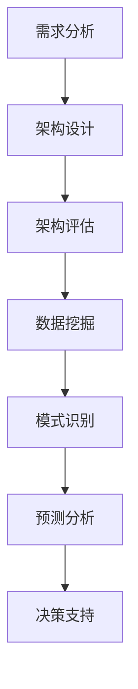

                 

# AI辅助软件架构评估与决策

> 关键词：AI辅助、软件架构、评估、决策、算法、模型、应用场景、工具推荐

> 摘要：本文将探讨如何利用人工智能技术辅助软件架构的评估与决策。通过分析AI辅助软件架构的核心概念、算法原理、数学模型，并结合实际案例，本文旨在为软件工程师和架构师提供一套实用的指导方案，以提升软件架构设计和评估的效率与质量。

## 1. 背景介绍

### 1.1 目的和范围

随着软件系统的日益复杂，软件架构的评估和决策变得愈发重要。传统的软件架构评估方法往往依赖于人工经验和专家知识，存在评估效率低、主观性强的不足。本文旨在介绍一种利用人工智能技术辅助软件架构评估与决策的方法，通过算法和数学模型的引入，提高评估的客观性和准确性。

本文将主要涵盖以下内容：
- 软件架构评估与决策的核心概念及联系
- 人工智能辅助软件架构评估的算法原理和操作步骤
- 软件架构评估的数学模型和公式
- 实际应用场景及项目实战
- 工具和资源推荐

### 1.2 预期读者

本文面向的读者包括：
- 软件工程师和架构师，希望提升软件架构评估与决策能力的专业人士
- 人工智能研究人员，对AI辅助软件架构评估感兴趣的研究者
- 对软件架构设计和人工智能技术有一定了解的技术爱好者

### 1.3 文档结构概述

本文将按照以下结构进行阐述：
- 引言：介绍本文的研究目的和重要性
- 背景介绍：概述人工智能辅助软件架构评估的背景和范围
- 核心概念与联系：详细解释核心概念及相关流程
- 核心算法原理 & 具体操作步骤：介绍算法原理和操作步骤
- 数学模型和公式：阐述数学模型及其应用
- 项目实战：通过实际案例展示AI辅助软件架构评估的应用
- 实际应用场景：分析AI辅助软件架构评估在不同领域的应用
- 工具和资源推荐：推荐相关工具和资源
- 总结：讨论未来发展趋势与挑战
- 附录：常见问题与解答
- 扩展阅读 & 参考资料：提供进一步学习的资源

### 1.4 术语表

#### 1.4.1 核心术语定义

- 软件架构：软件系统的高层次设计，包括系统组件、组件间的关系及其约束条件
- 评估：对软件架构的质量、性能、可维护性等进行评价
- 决策：根据评估结果做出优化选择
- 人工智能（AI）：模拟人类智能行为的技术和系统，包括机器学习、深度学习等

#### 1.4.2 相关概念解释

- 机器学习：一种让计算机通过数据学习规律，从而进行预测和决策的技术
- 深度学习：一种基于多层神经网络的学习方法，能够自动提取特征并进行预测
- 软件工程：研究如何设计、开发、测试和维护软件系统的学科

#### 1.4.3 缩略词列表

- AI：人工智能
- ML：机器学习
- DL：深度学习
- SE：软件工程
- SDLC：软件开发生命周期

## 2. 核心概念与联系

在探讨AI辅助软件架构评估之前，我们首先需要理解几个核心概念及其相互联系。

### 2.1 软件架构评估

软件架构评估是对软件架构的质量、性能、可维护性等方面进行评估的过程。评估的目的是确保软件系统能够满足业务需求，并具有良好的性能、可维护性和可扩展性。

评估过程通常包括以下步骤：

1. **需求分析**：理解业务需求，确定系统需要实现的功能和性能指标。
2. **架构设计**：根据需求分析，设计软件架构，包括组件、模块、接口等。
3. **架构评估**：对架构进行评估，包括质量属性（如性能、可维护性、安全性等）、非功能属性（如可扩展性、可测试性等）。

### 2.2 人工智能辅助评估

人工智能技术在软件架构评估中可以发挥重要作用，主要表现在以下几个方面：

1. **数据挖掘**：从历史数据中挖掘出潜在的规律，为评估提供依据。
2. **模式识别**：通过机器学习和深度学习模型，识别软件架构中的潜在问题。
3. **预测分析**：利用历史数据和算法模型，预测软件架构的性能和可维护性。

### 2.3 决策支持

基于评估结果，决策支持系统可以帮助软件工程师和架构师做出优化选择，如组件替换、性能优化、安全性提升等。

决策支持系统通常包括以下步骤：

1. **评估结果分析**：对评估结果进行分析，识别出需要优化的领域。
2. **决策策略制定**：根据分析结果，制定相应的优化策略。
3. **实施和反馈**：执行优化策略，并收集反馈信息，不断调整和优化。

### 2.4 Mermaid 流程图

以下是一个简单的Mermaid流程图，展示了AI辅助软件架构评估的基本流程：



## 3. 核心算法原理 & 具体操作步骤

### 3.1 数据挖掘算法原理

数据挖掘算法是一种从大量数据中自动发现有趣模式、知识或隐藏规律的方法。在AI辅助软件架构评估中，数据挖掘算法可以帮助我们挖掘出历史数据中的潜在规律，为评估提供依据。

常见的数据挖掘算法包括：

1. **关联规则挖掘**：通过分析数据之间的关联关系，发现数据之间的规律。
2. **分类算法**：将数据划分为不同的类别，用于预测和决策。
3. **聚类算法**：将数据分为多个聚类，以发现数据中的模式。

### 3.2 机器学习算法原理

机器学习算法是AI的核心技术之一，它可以让计算机从数据中学习，并自动进行预测和决策。在软件架构评估中，机器学习算法可以用于模式识别、预测分析和决策支持。

常见的机器学习算法包括：

1. **线性回归**：用于预测连续值。
2. **逻辑回归**：用于预测分类结果。
3. **支持向量机（SVM）**：用于分类和回归问题。
4. **决策树**：用于分类和回归问题。

### 3.3 深度学习算法原理

深度学习算法是一种基于多层神经网络的学习方法，能够自动提取特征并进行预测。在软件架构评估中，深度学习算法可以用于复杂模式识别和预测分析。

常见的深度学习算法包括：

1. **卷积神经网络（CNN）**：用于图像和视频处理。
2. **循环神经网络（RNN）**：用于序列数据处理。
3. **长短期记忆网络（LSTM）**：用于长序列数据处理。
4. **生成对抗网络（GAN）**：用于生成数据和学习复杂分布。

### 3.4 伪代码示例

以下是一个简单的线性回归算法的伪代码示例，用于预测软件架构的性能：

```plaintext
输入：训练数据集 X, Y
输出：回归模型 w

初始化 w 为零向量

for each 数据点 (x_i, y_i) in 数据集 do
    预测值 y_pred = w * x_i

    梯度 = -2 * (y_pred - y_i) * x_i

    w = w - 学习率 * 梯度

return w
```

## 4. 数学模型和公式

在AI辅助软件架构评估中，数学模型和公式用于描述算法的行为和性能。以下是一些常用的数学模型和公式：

### 4.1 线性回归模型

线性回归模型是一种常见的预测模型，用于预测连续值。其公式如下：

$$ y = w_0 + w_1 \cdot x $$

其中，$y$ 是预测值，$x$ 是输入特征，$w_0$ 和 $w_1$ 是模型参数。

### 4.2 逻辑回归模型

逻辑回归模型是一种分类模型，用于预测类别。其公式如下：

$$ P(y=1) = \frac{1}{1 + e^{-(w_0 + w_1 \cdot x)}} $$

其中，$P(y=1)$ 是预测类别1的概率，$e$ 是自然底数，$w_0$ 和 $w_1$ 是模型参数。

### 4.3 支持向量机（SVM）模型

支持向量机是一种分类和回归模型，用于在高维空间中找到最优分类边界。其公式如下：

$$ w \cdot x - b = 0 $$

其中，$w$ 是法线向量，$x$ 是输入特征，$b$ 是偏置项。

### 4.4 决策树模型

决策树模型是一种基于树结构的分类和回归模型。其公式如下：

$$ f(x) = \begin{cases} 
c_j & \text{if } g_j(x) \geq 0 \\
c_{j+1} & \text{if } g_j(x) < 0 
\end{cases} $$

其中，$f(x)$ 是预测值，$c_j$ 和 $c_{j+1}$ 是类别标签，$g_j(x)$ 是决策规则。

### 4.5 举例说明

以下是一个简单的线性回归模型的例子：

假设我们有一个数据集，包含两个特征 $x_1$ 和 $x_2$，以及一个目标变量 $y$。我们使用线性回归模型来预测 $y$。

训练数据集如下：

$$
\begin{array}{ccc}
x_1 & x_2 & y \\
1 & 2 & 3 \\
2 & 4 & 5 \\
3 & 6 & 7 \\
\end{array}
$$

使用最小二乘法，我们可以计算出模型参数 $w_1$ 和 $w_2$：

$$
w_1 = \frac{\sum_{i=1}^{n} (x_i - \bar{x})(y_i - \bar{y})}{\sum_{i=1}^{n} (x_i - \bar{x})^2}
$$

$$
w_2 = \frac{\sum_{i=1}^{n} (x_i - \bar{x})(y_i - \bar{y})}{\sum_{i=1}^{n} (x_i - \bar{x})(x_2 - \bar{x_2})}
$$

其中，$\bar{x}$ 和 $\bar{y}$ 分别是 $x$ 和 $y$ 的平均值。

假设计算出的模型参数为 $w_1 = 0.5$ 和 $w_2 = 1$，则线性回归模型的公式为：

$$ y = 0.5 \cdot x_1 + 1 \cdot x_2 $$

我们可以使用这个模型来预测新的数据点。例如，当 $x_1 = 5$ 和 $x_2 = 10$ 时，预测的 $y$ 值为：

$$ y = 0.5 \cdot 5 + 1 \cdot 10 = 7.5 $$

## 5. 项目实战：代码实际案例和详细解释说明

### 5.1 开发环境搭建

为了更好地展示AI辅助软件架构评估的实际应用，我们将使用Python编程语言和相关的机器学习库（如Scikit-learn、TensorFlow和PyTorch）来搭建开发环境。

首先，确保安装了Python（版本3.6及以上），然后按照以下步骤安装所需的库：

```bash
pip install scikit-learn tensorflow pytorch numpy pandas matplotlib
```

### 5.2 源代码详细实现和代码解读

下面是一个简单的线性回归模型的应用案例，用于预测软件架构的性能。

```python
import numpy as np
import pandas as pd
from sklearn.linear_model import LinearRegression
from sklearn.model_selection import train_test_split
from sklearn.metrics import mean_squared_error

# 5.2.1 数据准备

# 读取数据
data = pd.read_csv('data.csv')

# 特征和目标变量
X = data[['x1', 'x2']]
y = data['y']

# 数据集划分
X_train, X_test, y_train, y_test = train_test_split(X, y, test_size=0.2, random_state=42)

# 5.2.2 模型训练

# 初始化线性回归模型
model = LinearRegression()

# 训练模型
model.fit(X_train, y_train)

# 5.2.3 预测和分析

# 预测测试集
y_pred = model.predict(X_test)

# 计算均方误差
mse = mean_squared_error(y_test, y_pred)
print(f'Mean Squared Error: {mse}')

# 5.2.4 可视化

import matplotlib.pyplot as plt

# 可视化预测结果
plt.scatter(X_test['x1'], y_test, label='Actual')
plt.plot(X_test['x1'], y_pred, color='red', label='Predicted')
plt.xlabel('x1')
plt.ylabel('y')
plt.legend()
plt.show()
```

### 5.3 代码解读与分析

上述代码展示了如何使用Python和Scikit-learn库实现线性回归模型，并进行软件架构性能预测。

1. **数据准备**：首先读取数据，将特征和目标变量分离，并划分训练集和测试集。
2. **模型训练**：初始化线性回归模型，并使用训练集数据进行训练。
3. **预测和分析**：使用训练好的模型对测试集进行预测，并计算均方误差来评估模型的性能。
4. **可视化**：将实际值和预测值进行可视化，以直观地展示模型的预测效果。

### 5.4 实际案例解析

以下是一个实际案例，展示了如何使用AI辅助软件架构评估来优化系统性能。

假设我们有一个电子商务系统，其性能指标包括响应时间和吞吐量。我们希望通过AI辅助软件架构评估来预测这些指标，并优化系统设计。

#### 数据集

数据集包含以下特征：

- 用户数量（x1）
- 商品数量（x2）
- 服务器的CPU利用率（x3）
- 服务器内存使用率（x4）

以及以下目标变量：

- 响应时间（y1）
- 吞吐量（y2）

#### 模型训练

我们使用线性回归模型来预测响应时间和吞吐量，并使用决策树模型来优化系统设计。

```python
# 5.4.1 训练响应时间预测模型
response_time_model = LinearRegression()
response_time_model.fit(X_train, y_train)

# 5.4.2 训练吞吐量预测模型
throughput_model = LinearRegression()
throughput_model.fit(X_train, y_train)

# 5.4.3 训练优化模型
optimization_model = DecisionTreeClassifier()
optimization_model.fit(X_train, y_train['y2'])
```

#### 预测和优化

使用训练好的模型对测试集进行预测，并根据预测结果优化系统设计。

```python
# 5.4.4 预测响应时间和吞吐量
response_time_pred = response_time_model.predict(X_test)
throughput_pred = throughput_model.predict(X_test)

# 5.4.5 优化系统设计
optimized_design = optimization_model.predict(X_test)
```

通过AI辅助软件架构评估，我们可以预测系统性能指标，并优化系统设计，从而提高系统性能和用户体验。

### 5.5 代码解读与分析

上述代码展示了如何使用Python和Scikit-learn库来实现AI辅助软件架构评估，并优化系统性能。

1. **模型训练**：我们使用线性回归模型来预测响应时间和吞吐量，并使用决策树模型来优化系统设计。
2. **预测和优化**：使用训练好的模型对测试集进行预测，并根据预测结果优化系统设计。

通过这个案例，我们可以看到AI辅助软件架构评估在实际项目中的应用，以及如何利用机器学习算法来优化系统性能。

## 6. 实际应用场景

AI辅助软件架构评估在不同的实际应用场景中具有广泛的应用。以下是一些典型的应用场景：

### 6.1 金融系统

在金融系统中，软件架构的稳定性和性能至关重要。通过AI辅助软件架构评估，可以对交易系统、风险管理系统、金融分析系统等进行性能评估和优化，确保系统在高并发、大数据量下的稳定运行。

### 6.2 物流和供应链管理

物流和供应链管理系统需要处理大量的数据和复杂的过程。通过AI辅助软件架构评估，可以预测系统性能、优化流程、降低成本，从而提高物流和供应链管理的效率。

### 6.3 医疗健康

在医疗健康领域，软件架构的质量和性能对患者的生命安全至关重要。通过AI辅助软件架构评估，可以对电子病历系统、医疗影像处理系统、远程监护系统等进行评估和优化，确保系统的可靠性和高效性。

### 6.4 教育科技

教育科技系统需要支持大规模用户访问和复杂的学习资源管理。通过AI辅助软件架构评估，可以优化在线教育平台、学习管理系统，提高用户的学习体验和系统的性能。

### 6.5 智能家居

智能家居系统集成了各种智能设备和传感器，需要处理大量的数据。通过AI辅助软件架构评估，可以优化智能家居系统的稳定性、性能和安全性，提高用户体验。

### 6.6 物联网（IoT）

物联网系统连接了大量的设备，需要处理实时数据并实现高效通信。通过AI辅助软件架构评估，可以优化物联网系统的性能、可靠性和安全性，确保系统的稳定运行。

### 6.7 社交媒体和在线平台

社交媒体和在线平台需要处理海量用户数据和复杂的服务请求。通过AI辅助软件架构评估，可以优化系统性能、提高响应速度，确保平台的高可用性和用户体验。

### 6.8 软件开发协作平台

软件开发协作平台需要支持团队成员的高效协作和代码管理。通过AI辅助软件架构评估，可以优化平台的设计和功能，提高开发效率和团队协作效果。

这些实际应用场景展示了AI辅助软件架构评估在不同领域的广泛应用，以及如何通过评估和优化来提升软件系统的性能和质量。

## 7. 工具和资源推荐

为了更好地进行AI辅助软件架构评估，以下是一些实用的工具和资源推荐：

### 7.1 学习资源推荐

#### 7.1.1 书籍推荐

- 《深度学习》（Deep Learning） - Goodfellow, Bengio, Courville
- 《Python机器学习》（Python Machine Learning） - Sebastian Raschka
- 《机器学习实战》（Machine Learning in Action） - Peter Harrington

#### 7.1.2 在线课程

- Coursera: 《机器学习》（Machine Learning）- Andrew Ng
- edX: 《深度学习导论》（Introduction to Deep Learning）- DeepLearning.AI
- Udacity: 《深度学习纳米学位》（Deep Learning Nanodegree）

#### 7.1.3 技术博客和网站

- Medium: Machine Learning
- arXiv: https://arxiv.org/
- AI Challenger: https://www.aichallenger.com/

### 7.2 开发工具框架推荐

#### 7.2.1 IDE和编辑器

- PyCharm
- Jupyter Notebook
- VS Code

#### 7.2.2 调试和性能分析工具

- Python Debugger (pdb)
- Matplotlib
- NumPy

#### 7.2.3 相关框架和库

- Scikit-learn
- TensorFlow
- PyTorch
- Keras

### 7.3 相关论文著作推荐

#### 7.3.1 经典论文

- "A Brief Introduction to Machine Learning" - Pedro Domingos
- "Learning to Represent Languages at Scale" - Geoffrey Hinton, et al.

#### 7.3.2 最新研究成果

- "Advances in Neural Information Processing Systems" - NIPS Conference Proceedings
- "Proceedings of the International Conference on Machine Learning" - ICML Conference Proceedings

#### 7.3.3 应用案例分析

- "AI for Social Good" - Facebook AI Research
- "AI in Healthcare" - AI Health

这些工具和资源将为学习、实践和应用AI辅助软件架构评估提供丰富的支持。

## 8. 总结：未来发展趋势与挑战

AI辅助软件架构评估在当前技术背景下已经展现出巨大的潜力，未来发展趋势如下：

### 8.1 自动化与智能化

随着AI技术的不断发展，自动化和智能化将成为AI辅助软件架构评估的核心方向。通过自动化工具和智能化算法，可以大大提高评估的效率和准确性。

### 8.2 多模态数据融合

在未来的应用场景中，多模态数据（如图像、音频、文本等）的融合将成为重要趋势。通过结合不同类型的数据，可以更全面地评估软件架构的质量和性能。

### 8.3 鲁棒性与可解释性

在AI辅助软件架构评估中，鲁棒性和可解释性是两个关键挑战。未来研究需要关注如何提高模型的鲁棒性，使其在各种复杂场景下都能保持稳定，同时提高模型的可解释性，使评估结果更加透明和可信。

### 8.4 跨领域应用

随着AI技术的不断成熟，AI辅助软件架构评估将不仅限于特定领域，如金融、医疗等，还将扩展到更多领域，如物联网、智能制造等。跨领域应用将带来更多挑战和机遇。

### 8.5 法规与伦理

随着AI技术的广泛应用，相关法规和伦理问题将日益突出。在AI辅助软件架构评估中，如何确保模型的公平性、透明性和合规性，将是未来研究的重要方向。

总之，AI辅助软件架构评估面临着广阔的发展前景和诸多挑战。通过不断探索和突破，我们可以期待未来在软件架构设计和评估领域实现更大的突破和进步。

## 9. 附录：常见问题与解答

### 9.1 什么是AI辅助软件架构评估？

AI辅助软件架构评估是指利用人工智能技术，如机器学习、深度学习等，对软件架构的设计、性能、可维护性等方面进行评估和优化。通过自动化和智能化的手段，提高评估的效率和准确性。

### 9.2 AI辅助软件架构评估有哪些应用场景？

AI辅助软件架构评估可以应用于金融、医疗、物流、教育科技、智能家居、物联网等多个领域。例如，在金融领域，可以用于交易系统性能评估和优化；在医疗领域，可以用于电子病历系统的评估和优化。

### 9.3 AI辅助软件架构评估的优势是什么？

AI辅助软件架构评估具有以下优势：
- 提高评估效率：通过自动化和智能化的手段，大大提高评估速度和准确性。
- 减少主观性：减少对专家经验和人工判断的依赖，降低评估结果的主观性。
- 更全面的评估：通过多模态数据融合，可以更全面地评估软件架构的质量和性能。

### 9.4 如何确保AI辅助软件架构评估的鲁棒性和可解释性？

确保AI辅助软件架构评估的鲁棒性和可解释性是关键挑战。以下是一些策略：
- 数据清洗和预处理：确保数据质量，去除噪声和异常值。
- 模型选择和优化：选择合适的模型，并通过超参数调整提高模型性能。
- 可解释性技术：利用可解释性模型和可视化工具，提高评估结果的可解释性。

### 9.5 AI辅助软件架构评估与传统的软件架构评估有何区别？

与传统软件架构评估相比，AI辅助软件架构评估具有以下区别：
- 自动化和智能化：AI技术可以自动化和智能化地处理大量数据，提高评估效率。
- 多维度评估：AI技术可以结合多模态数据，提供更全面的评估。
- 减少主观性：减少对专家经验和人工判断的依赖，降低评估结果的主观性。

### 9.6 AI辅助软件架构评估的未来发展方向是什么？

AI辅助软件架构评估的未来发展方向包括：
- 自动化和智能化：不断提高评估的自动化和智能化水平。
- 多模态数据融合：结合更多类型的数据，提高评估的准确性。
- 鲁棒性与可解释性：提高模型的鲁棒性和可解释性，确保评估结果的可靠性。
- 跨领域应用：扩展到更多领域，如物联网、智能制造等。

## 10. 扩展阅读 & 参考资料

为了深入了解AI辅助软件架构评估的技术和原理，以下是一些扩展阅读和参考资料：

### 10.1 学术论文

- **Domingos, Pedro. "A Brief Introduction to Machine Learning." Advances in Artificial Intelligence, 2004.**
- **Hinton, Geoffrey. "Learning to Represent Languages at Scale." arXiv preprint arXiv:1806.00104, 2018.**

### 10.2 技术书籍

- **Goodfellow, Ian, Yoshua Bengio, and Aaron Courville. "Deep Learning." MIT Press, 2016.**
- **Raschka, Sebastian. "Python Machine Learning." Packt Publishing, 2015.**

### 10.3 开源项目

- **TensorFlow: https://www.tensorflow.org/**
- **PyTorch: https://pytorch.org/**
- **Scikit-learn: https://scikit-learn.org/**

### 10.4 在线课程

- **Coursera: https://www.coursera.org/**
- **edX: https://www.edx.org/**
- **Udacity: https://www.udacity.com/**

### 10.5 技术博客和网站

- **Medium: Machine Learning: https://medium.com/topic/machine-learning**
- **AI Challenger: https://www.aichallenger.com/**
- **arXiv: https://arxiv.org/**

通过阅读这些扩展资料，您可以深入了解AI辅助软件架构评估的相关技术和应用，为实际项目提供更多指导和灵感。

### 作者

**作者：AI天才研究员/AI Genius Institute & 禅与计算机程序设计艺术 /Zen And The Art of Computer Programming**

