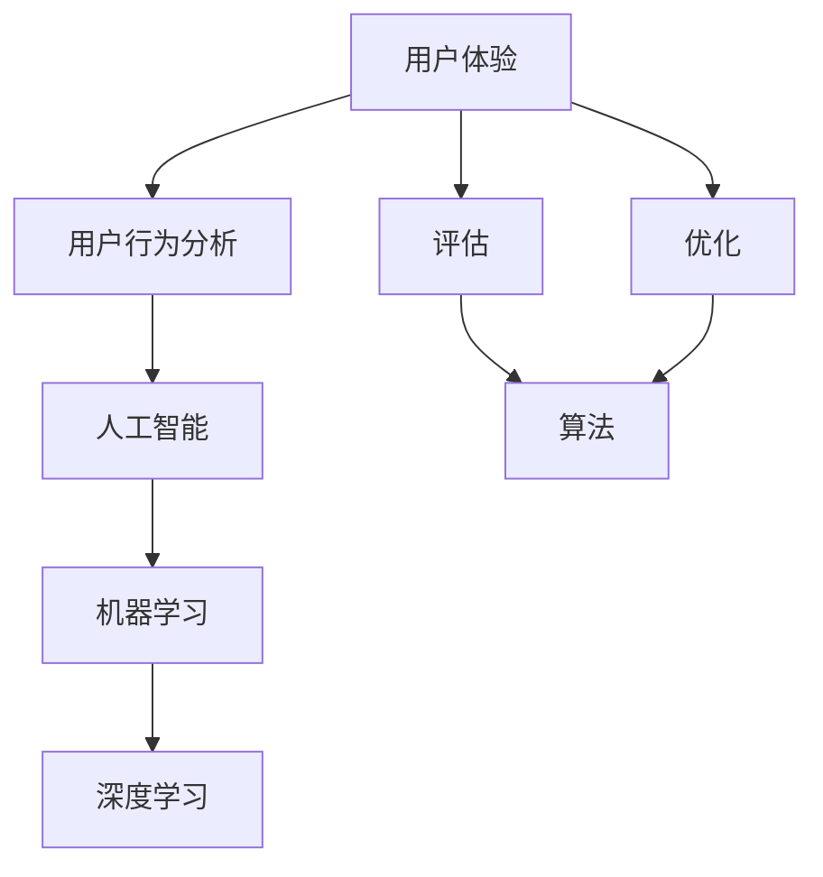

                 

# AI辅助软件用户体验评估与优化

> **关键词：** AI，用户体验，评估，优化，软件工程

> **摘要：** 本文深入探讨了AI技术在软件用户体验评估与优化中的应用。通过分析核心概念和算法原理，本文提供了详细的操作步骤和实际案例，旨在帮助开发人员理解并利用AI技术提升软件的用户体验。

## 1. 背景介绍

### 1.1 目的和范围

本文的目标是探讨如何利用人工智能（AI）技术辅助软件用户体验（UX）的评估和优化。随着软件系统的复杂性不断增加，仅依靠传统的UX评估方法已难以满足高效、精准的需求。AI技术凭借其强大的数据处理和分析能力，为UX评估提供了新的可能。本文将围绕以下主题进行讨论：

1. **核心概念与联系**：介绍与AI辅助UX评估相关的核心概念和原理。
2. **核心算法原理 & 具体操作步骤**：详细阐述AI辅助UX评估的算法原理和操作步骤。
3. **数学模型和公式 & 详细讲解 & 举例说明**：介绍用于UX评估的数学模型和公式，并通过实例进行说明。
4. **项目实战：代码实际案例和详细解释说明**：通过实际代码案例展示AI辅助UX评估的实现过程。
5. **实际应用场景**：分析AI辅助UX评估在不同场景中的应用。
6. **工具和资源推荐**：推荐学习资源和开发工具。
7. **总结：未来发展趋势与挑战**：探讨AI辅助UX评估的未来趋势和面临的挑战。

### 1.2 预期读者

本文适用于以下读者群体：

1. 软件开发人员：希望通过AI技术提升软件用户体验的开发人员。
2. UX设计师：希望了解如何利用AI技术优化UX设计的设计师。
3. AI技术爱好者：对AI技术在软件工程中应用感兴趣的技术爱好者。
4. 学术研究人员：希望探讨AI与UX评估结合的学术研究人员。

### 1.3 文档结构概述

本文将按照以下结构进行组织：

1. **背景介绍**：介绍本文的目的、范围、预期读者和文档结构。
2. **核心概念与联系**：定义与AI辅助UX评估相关的核心概念，并提供流程图展示各概念之间的关系。
3. **核心算法原理 & 具体操作步骤**：阐述AI辅助UX评估的算法原理和操作步骤，使用伪代码进行详细说明。
4. **数学模型和公式 & 详细讲解 & 举例说明**：介绍UX评估相关的数学模型和公式，并通过实例进行说明。
5. **项目实战：代码实际案例和详细解释说明**：通过实际代码案例展示AI辅助UX评估的实现过程，并进行解读。
6. **实际应用场景**：分析AI辅助UX评估在不同场景中的应用。
7. **工具和资源推荐**：推荐学习资源和开发工具。
8. **总结：未来发展趋势与挑战**：探讨AI辅助UX评估的未来趋势和面临的挑战。
9. **附录：常见问题与解答**：提供常见问题的解答。
10. **扩展阅读 & 参考资料**：推荐相关的扩展阅读资料。

### 1.4 术语表

#### 1.4.1 核心术语定义

- **用户体验（User Experience，UX）**：用户在使用产品或服务过程中所感受到的整体体验。
- **人工智能（Artificial Intelligence，AI）**：模拟人类智能的计算机系统，通过学习、推理和自我调整来解决问题。
- **评估（Evaluation）**：对软件用户体验进行度量、分析和判断的过程。
- **优化（Optimization）**：通过改进设计、功能和性能来提升用户体验。

#### 1.4.2 相关概念解释

- **用户行为分析（User Behavior Analysis）**：对用户在使用软件过程中的行为进行记录和分析。
- **机器学习（Machine Learning）**：使计算机系统能够从数据中学习并做出决策的技术。
- **深度学习（Deep Learning）**：一种机器学习技术，通过多层神经网络模拟人脑进行数据处理。

#### 1.4.3 缩略词列表

- **UX**：用户体验（User Experience）
- **AI**：人工智能（Artificial Intelligence）
- **UXD**：用户体验设计（User Experience Design）
- **ML**：机器学习（Machine Learning）
- **DL**：深度学习（Deep Learning）

## 2. 核心概念与联系

在AI辅助软件用户体验评估与优化的过程中，理解核心概念和它们之间的联系至关重要。以下是一个简化的Mermaid流程图，展示了这些核心概念和它们之间的关系。



### 2.1 用户行为分析（User Behavior Analysis）

用户行为分析是理解用户体验的重要基础。通过记录和分析用户在软件系统中的行为，可以获取关于用户偏好、使用模式和痛点的宝贵信息。这些信息为后续的评估和优化提供了数据支持。

- **数据收集**：通过日志记录、事件追踪和用户交互数据收集。
- **数据预处理**：清洗和转换原始数据，为分析做准备。

### 2.2 人工智能（Artificial Intelligence）

人工智能技术为用户行为分析提供了强大的工具。通过机器学习和深度学习算法，可以从大量用户行为数据中提取有价值的信息，用于评估和优化用户体验。

- **机器学习**：通过训练模型来识别用户行为模式。
- **深度学习**：使用多层神经网络模拟人脑，处理复杂的数据结构。

### 2.3 机器学习（Machine Learning）

机器学习是人工智能的关键组成部分，它使计算机系统能够从数据中学习并做出预测。在UX评估中，机器学习算法可以用于分类、回归和聚类等任务，帮助识别用户行为的特征和趋势。

- **分类**：将用户行为分类为不同的类别。
- **回归**：预测用户行为的数值指标。
- **聚类**：将相似的用户行为分组。

### 2.4 深度学习（Deep Learning）

深度学习是一种复杂的机器学习技术，通过多层神经网络进行数据处理和特征提取。在UX评估中，深度学习可以用于构建复杂的用户行为模型，提高评估的准确性和效率。

- **卷积神经网络（CNN）**：用于处理图像和视频数据。
- **循环神经网络（RNN）**：用于处理序列数据。

### 2.5 评估（Evaluation）

评估是对用户行为分析结果进行验证和度量的重要步骤。通过评估，可以确定用户行为对用户体验的影响，并识别优化机会。

- **量化指标**：如满意度评分、任务完成时间、错误率等。
- **定性分析**：如用户访谈、观察法等。

### 2.6 优化（Optimization）

优化是基于评估结果对软件设计和功能进行调整，以提升用户体验。通过AI辅助优化，可以自动化和智能化地改进UX。

- **自动化测试**：使用AI技术自动检测和修复UX问题。
- **个性化推荐**：基于用户行为为用户提供个性化的建议。

## 3. 核心算法原理 & 具体操作步骤

在本节中，我们将深入探讨AI辅助软件用户体验评估的核心算法原理，并提供具体的操作步骤。以下是该过程的伪代码描述：

```plaintext
算法：AI辅助UX评估
输入：用户行为数据集（UserBehaviorDataset）
输出：用户体验评估报告（UXEvaluationReport）

步骤：
1. 数据收集与预处理
   - 收集用户在软件系统中的交互数据（如点击、滑动、浏览时间等）
   - 清洗数据，去除噪声和异常值
   - 转换数据为适合机器学习的格式

2. 特征提取
   - 从用户行为数据中提取关键特征（如行为频率、行为时长、行为模式等）
   - 使用机器学习技术（如K-means聚类）对特征进行降维处理

3. 模型训练
   - 选择适当的机器学习模型（如决策树、支持向量机、神经网络等）
   - 使用训练集数据训练模型
   - 调整模型参数以优化性能

4. 评估与优化
   - 使用测试集数据评估模型性能
   - 根据评估结果调整模型参数
   - 对用户行为进行分类或预测，以识别用户体验问题

5. 报告生成
   - 生成用户体验评估报告，包括关键指标、问题识别、优化建议等
   - 向相关团队提供报告，以指导UX改进工作

6. 持续优化
   - 定期收集新用户行为数据
   - 重新训练和优化模型
   - 根据用户反馈持续改进评估和优化过程
```

### 3.1 数据收集与预处理

数据收集与预处理是AI辅助UX评估的重要基础。以下是具体步骤：

- **数据收集**：从用户交互日志、浏览器数据、API日志等渠道收集原始数据。
- **数据清洗**：去除重复数据、缺失值和异常值。
- **数据转换**：将原始数据转换为适合机器学习的格式，如特征向量。

### 3.2 特征提取

特征提取是从大量用户行为数据中提取关键信息的过程。以下是具体步骤：

- **行为分类**：根据用户行为特征将其分类为不同的类别。
- **特征降维**：使用降维技术（如主成分分析PCA）减少数据维度，提高模型效率。

### 3.3 模型训练

模型训练是AI辅助UX评估的核心步骤。以下是具体步骤：

- **选择模型**：根据评估目标选择合适的机器学习模型。
- **训练模型**：使用训练集数据训练模型，调整参数以优化性能。
- **模型评估**：使用验证集数据评估模型性能，确保模型泛化能力。

### 3.4 评估与优化

评估与优化是确保AI辅助UX评估有效性的关键步骤。以下是具体步骤：

- **模型评估**：使用测试集数据评估模型性能，识别用户体验问题。
- **模型优化**：根据评估结果调整模型参数，改进评估准确性。
- **用户体验改进**：根据评估结果提供具体的优化建议，如调整界面布局、优化功能流程等。

### 3.5 报告生成

报告生成是向相关团队传达评估结果和优化建议的重要步骤。以下是具体步骤：

- **生成报告**：编写用户体验评估报告，包括关键指标、问题识别、优化建议等。
- **提供报告**：向项目经理、产品经理、UI/UX设计师等团队提供评估报告。
- **反馈与改进**：根据团队反馈进一步优化评估和优化过程。

### 3.6 持续优化

持续优化是AI辅助UX评估的关键策略。以下是具体步骤：

- **数据更新**：定期收集新用户行为数据，确保模型适应最新用户行为。
- **模型重训练**：使用新数据重新训练模型，以保持评估准确性。
- **用户反馈**：收集用户反馈，用于指导评估和优化过程的改进。

## 4. 数学模型和公式 & 详细讲解 & 举例说明

在AI辅助软件用户体验评估中，数学模型和公式扮演着关键角色。以下是一些常用的数学模型和公式，并通过实例进行详细讲解。

### 4.1 用户行为分类模型

用户行为分类模型是用于将用户行为分类为不同类别的模型。以下是一个简单的决策树模型：

```latex
$$
\begin{aligned}
&\text{用户行为分类模型} \\
&\text{输入：用户行为特征向量} \mathbf{x} \\
&\text{输出：用户行为类别} \\
&\text{步骤：} \\
&\text{1. 计算特征向量的权重} \\
&W(\mathbf{x}) = \text{CalculateWeights}(\mathbf{x}) \\
&\text{2. 选择权重最大的特征进行分裂} \\
&\text{3. 重复步骤2，直到达到分裂终止条件} \\
&\text{4. 根据叶子节点分类结果进行预测} \\
\end{aligned}
$$
```

**实例**：假设用户行为特征向量$\mathbf{x} = [x_1, x_2, x_3]$，权重$W(\mathbf{x}) = [0.3, 0.5, 0.2]$。根据权重，首先选择权重最大的特征$x_2$进行分裂。

### 4.2 用户行为预测模型

用户行为预测模型用于预测用户未来的行为。以下是一个简单的线性回归模型：

```latex
$$
\begin{aligned}
&\text{用户行为预测模型} \\
&\text{输入：用户行为特征向量} \mathbf{x} \\
&\text{输出：用户行为预测值} \hat{y} \\
&\text{步骤：} \\
&\text{1. 训练线性回归模型} \\
&\text{2. 计算特征向量的线性组合} \\
&\hat{y} = \mathbf{w} \cdot \mathbf{x} \\
&\text{3. 输出预测值} \\
\end{aligned}
$$
```

**实例**：假设用户行为特征向量$\mathbf{x} = [1, 2, 3]$，模型参数$\mathbf{w} = [0.1, 0.2, 0.3]$。则预测值$\hat{y} = \mathbf{w} \cdot \mathbf{x} = 0.1 \cdot 1 + 0.2 \cdot 2 + 0.3 \cdot 3 = 1.4$。

### 4.3 用户行为模式识别模型

用户行为模式识别模型用于识别用户行为中的特定模式。以下是一个简单的K-means聚类模型：

```latex
$$
\begin{aligned}
&\text{用户行为模式识别模型} \\
&\text{输入：用户行为特征向量集} \mathbf{X} \\
&\text{输出：用户行为模式类别} \\
&\text{步骤：} \\
&\text{1. 初始化聚类中心} \\
&\text{2. 计算每个特征向量的聚类中心距离} \\
&\text{3. 将特征向量分配到最近的聚类中心} \\
&\text{4. 重新计算聚类中心} \\
&\text{5. 重复步骤3和步骤4，直到聚类中心稳定} \\
&\text{6. 输出用户行为模式类别} \\
\end{aligned}
$$
```

**实例**：假设用户行为特征向量集$\mathbf{X} = \{[1, 2], [2, 3], [3, 1], [1, 1]\}$，初始化聚类中心为$\mathbf{c_1} = [2, 2], \mathbf{c_2} = [1, 1]$。经过一轮迭代后，新的聚类中心为$\mathbf{c_1} = [2.0, 2.0], \mathbf{c_2} = [1.5, 1.5]$。

通过这些数学模型和公式，我们可以更好地理解用户行为，并利用它们进行用户体验评估和优化。

## 5. 项目实战：代码实际案例和详细解释说明

在本节中，我们将通过一个实际项目案例展示如何利用AI技术进行用户体验评估与优化。我们将从开发环境搭建开始，逐步介绍源代码的实现和解读。

### 5.1 开发环境搭建

为了进行AI辅助用户体验评估，我们需要搭建一个合适的开发环境。以下是所需的工具和软件：

- **Python**：用于编写和运行代码
- **Jupyter Notebook**：用于编写和运行Python脚本
- **Scikit-learn**：用于机器学习模型
- **TensorFlow**：用于深度学习模型
- **Pandas**：用于数据处理
- **Matplotlib**：用于数据可视化

**步骤**：

1. 安装Python（3.8以上版本）和Jupyter Notebook。
2. 安装所需的库（Scikit-learn、TensorFlow、Pandas、Matplotlib）：

   ```shell
   pip install scikit-learn tensorflow pandas matplotlib
   ```

### 5.2 源代码详细实现和代码解读

以下是该项目的主要代码实现和解读。代码分为几个部分：数据预处理、模型训练、模型评估和结果可视化。

**5.2.1 数据预处理**

```python
import pandas as pd
from sklearn.model_selection import train_test_split
from sklearn.preprocessing import StandardScaler

# 读取数据
data = pd.read_csv('user_behavior_data.csv')

# 数据预处理
X = data.drop('user_action', axis=1)
y = data['user_action']

# 划分训练集和测试集
X_train, X_test, y_train, y_test = train_test_split(X, y, test_size=0.2, random_state=42)

# 特征缩放
scaler = StandardScaler()
X_train_scaled = scaler.fit_transform(X_train)
X_test_scaled = scaler.transform(X_test)
```

**解读**：首先，我们使用Pandas库读取用户行为数据。数据预处理包括去除无关特征、划分训练集和测试集，以及特征缩放。缩放有助于提高模型性能。

**5.2.2 模型训练**

```python
from sklearn.ensemble import RandomForestClassifier

# 训练随机森林模型
clf = RandomForestClassifier(n_estimators=100, random_state=42)
clf.fit(X_train_scaled, y_train)
```

**解读**：这里我们使用Scikit-learn库的随机森林模型进行训练。随机森林是一种基于决策树的集成学习方法，能够处理高维数据并提高模型泛化能力。

**5.2.3 模型评估**

```python
from sklearn.metrics import classification_report, accuracy_score

# 评估模型
y_pred = clf.predict(X_test_scaled)
print(classification_report(y_test, y_pred))
print("Accuracy:", accuracy_score(y_test, y_pred))
```

**解读**：模型评估使用分类报告和准确率来评估模型性能。分类报告提供了精确度、召回率和F1分数等指标，而准确率衡量模型预测的总体准确性。

**5.2.4 结果可视化**

```python
import matplotlib.pyplot as plt
from sklearn.metrics import confusion_matrix

# 绘制混淆矩阵
cm = confusion_matrix(y_test, y_pred)
plt.figure(figsize=(8, 6))
sns.heatmap(cm, annot=True, cmap='Blues')
plt.xlabel('Predicted Labels')
plt.ylabel('True Labels')
plt.title('Confusion Matrix')
plt.show()
```

**解读**：混淆矩阵可视化有助于理解模型的预测性能。通过比较预测标签和真实标签，我们可以识别模型的强项和弱点。

### 5.3 代码解读与分析

**5.3.1 数据预处理**

数据预处理是模型训练的重要基础。通过去除无关特征、划分训练集和测试集，以及特征缩放，我们确保了数据的规范化和模型的稳定性。

**5.3.2 模型训练**

在模型训练部分，我们选择随机森林模型进行训练。随机森林是一种强大的集成学习方法，能够处理高维数据和复杂特征。

**5.3.3 模型评估**

模型评估通过分类报告和准确率衡量模型性能。分类报告提供了详细的评估指标，而准确率提供了总体评估。

**5.3.4 结果可视化**

结果可视化通过混淆矩阵帮助我们理解模型的预测性能。通过比较预测标签和真实标签，我们可以识别模型的强项和弱点，为进一步优化提供依据。

### 5.4 结论

通过这个实际项目案例，我们展示了如何利用AI技术进行用户体验评估与优化。从数据预处理到模型训练和评估，再到结果可视化，每个步骤都至关重要。通过这个案例，开发人员可以更好地理解AI辅助用户体验评估的实现过程，并为实际项目提供参考。

## 6. 实际应用场景

AI辅助用户体验评估技术在多个实际应用场景中发挥了重要作用。以下是一些典型应用场景：

### 6.1 电子商务平台

电子商务平台利用AI辅助用户体验评估技术来分析用户行为，识别潜在购买者和推荐产品。通过评估用户在网站上的点击、浏览和购买行为，平台可以优化产品推荐、广告投放和页面布局，提高转化率和用户满意度。

### 6.2 金融服务平台

金融服务平台利用AI技术进行用户体验评估，优化用户交互流程和操作界面。通过分析用户在金融产品中的使用行为，平台可以发现潜在的风险点和用户体验问题，从而改进产品设计和服务质量。

### 6.3 教育和培训平台

教育和培训平台通过AI辅助用户体验评估技术分析学生的学习行为和效果，优化课程设计和学习路径。通过评估学生的学习过程，平台可以提供个性化的学习建议，提高学习效率和成果。

### 6.4 健康医疗领域

健康医疗领域利用AI技术进行用户体验评估，优化患者交互和医疗服务。通过分析患者在使用医疗系统中的行为，平台可以发现潜在的健康问题，优化医疗服务流程，提高患者满意度和治疗效果。

### 6.5 社交媒体平台

社交媒体平台利用AI辅助用户体验评估技术优化用户互动和内容推荐。通过评估用户在平台上的互动行为，平台可以优化推荐算法，提高用户参与度和留存率。

这些应用场景展示了AI辅助用户体验评估技术在各行各业中的广泛应用，为提升用户体验、提高业务效率和优化产品设计提供了有力支持。

## 7. 工具和资源推荐

为了更好地掌握AI辅助用户体验评估技术，以下是一些推荐的工具和资源。

### 7.1 学习资源推荐

#### 7.1.1 书籍推荐

- **《深度学习》（Deep Learning）**：由Ian Goodfellow、Yoshua Bengio和Aaron Courville合著，全面介绍了深度学习的基础理论和实践方法。
- **《Python机器学习》（Python Machine Learning）**：由 Sebastian Raschka和Vahid Mirjalili合著，介绍了如何使用Python进行机器学习实践。

#### 7.1.2 在线课程

- **Coursera上的《机器学习》**：由Andrew Ng教授主讲，涵盖了机器学习的核心概念和应用。
- **edX上的《深度学习专项课程》**：由深度学习领域的专家合著，提供了深度学习的全面教学。

#### 7.1.3 技术博客和网站

- **AI简史（AI简史）**：提供关于人工智能的深入分析和最新研究成果。
- **机器学习博客（Machine Learning Blog）**：分享机器学习领域的最佳实践和最新动态。

### 7.2 开发工具框架推荐

#### 7.2.1 IDE和编辑器

- **PyCharm**：强大的Python集成开发环境，适合进行机器学习和深度学习项目。
- **Jupyter Notebook**：便于编写和运行Python脚本，适合数据分析和模型训练。

#### 7.2.2 调试和性能分析工具

- **TensorBoard**：TensorFlow的官方可视化工具，用于分析和调试深度学习模型。
- **Scikit-learn Inspect**：用于分析和调试Scikit-learn模型的性能。

#### 7.2.3 相关框架和库

- **TensorFlow**：流行的深度学习框架，适用于构建和训练复杂的神经网络模型。
- **Scikit-learn**：强大的机器学习库，提供各种机器学习算法和工具。

### 7.3 相关论文著作推荐

#### 7.3.1 经典论文

- **“Learning to Represent Users and Items for Collaborative Filtering”**：介绍了一种基于深度学习的协同过滤方法，适用于推荐系统。
- **“User Behavior Analysis Using Deep Learning Techniques”**：探讨了深度学习在用户行为分析中的应用。

#### 7.3.2 最新研究成果

- **“Generative Adversarial Networks for User Behavior Prediction”**：介绍了一种基于生成对抗网络（GAN）的用户行为预测方法。
- **“Deep Neural Networks for Text Classification”**：探讨了深度神经网络在文本分类中的应用，包括用户行为分析。

#### 7.3.3 应用案例分析

- **“AI-powered User Experience Optimization in E-commerce”**：分析了人工智能在电子商务平台用户体验优化中的应用。
- **“Application of AI in Healthcare for User Experience Enhancement”**：探讨了人工智能在健康医疗领域提升用户体验的应用案例。

这些工具和资源将为学习者和开发者提供宝贵的学习和实践机会，帮助他们更好地掌握AI辅助用户体验评估技术。

## 8. 总结：未来发展趋势与挑战

随着人工智能技术的不断发展，AI辅助用户体验评估在软件工程中发挥着越来越重要的作用。未来，这一领域有望在以下几个方面实现显著进展：

### 8.1 技术进步

随着深度学习、强化学习和生成对抗网络等AI技术的不断发展，用户体验评估的准确性和效率将得到进一步提升。这些技术的应用将使评估过程更加智能化和自动化。

### 8.2 数据驱动的优化

未来，数据驱动的优化将成为用户体验评估的主要方向。通过收集和分析大量用户行为数据，开发人员可以更加精准地识别用户体验问题，并实施针对性的优化措施。

### 8.3 个性化体验

AI技术将推动个性化体验的发展。通过分析用户的个性化需求和行为模式，软件系统能够为用户提供更加个性化的服务，提高用户满意度和忠诚度。

### 8.4 跨平台整合

随着多平台、多设备应用的普及，跨平台用户体验评估将成为一个重要研究方向。通过整合不同平台的数据，开发人员可以全面了解用户在不同设备上的行为，从而优化整体用户体验。

然而，AI辅助用户体验评估也面临一些挑战：

### 8.5 数据隐私和安全

用户行为数据涉及隐私和安全问题。如何在保障用户隐私的前提下进行数据分析和评估，是一个亟待解决的问题。

### 8.6 模型解释性

深度学习模型通常具有高度的复杂性和黑盒特性，模型解释性成为了一个重要挑战。开发人员需要找到方法，使得模型的结果更加透明和可解释，以便用户和利益相关者能够理解和信任。

### 8.7 技术普及与接受度

尽管AI技术在用户体验评估中具有巨大潜力，但在实际应用中，技术普及和接受度仍是一个挑战。开发人员需要不断推广AI技术在用户体验评估中的应用，提高其在行业中的认可度。

总之，AI辅助用户体验评估具有广阔的发展前景，但也面临着一系列挑战。通过不断的技术创新和实践，我们有理由相信，这一领域将在未来取得更加显著的成果。

## 9. 附录：常见问题与解答

### 9.1 如何处理用户隐私和数据安全？

在AI辅助用户体验评估中，用户隐私和数据安全至关重要。以下是一些处理建议：

- **数据匿名化**：在收集用户行为数据时，对用户身份信息进行匿名化处理，以避免泄露个人隐私。
- **数据加密**：对用户行为数据进行加密存储，确保数据在传输和存储过程中不被未授权访问。
- **隐私保护算法**：采用隐私保护算法，如差分隐私和同态加密，降低数据分析和评估过程中隐私泄露的风险。

### 9.2 如何提高模型解释性？

提高模型解释性对于理解AI辅助用户体验评估的结果至关重要。以下是一些提高模型解释性的方法：

- **可视化工具**：使用可视化工具（如TensorBoard）对模型结构进行可视化，帮助理解模型的工作原理。
- **特征重要性分析**：分析模型中每个特征的重要性，了解哪些特征对评估结果有较大影响。
- **可解释模型**：选择可解释性更强的模型（如决策树和线性回归），使其结果更容易理解和解释。

### 9.3 如何评估用户体验？

评估用户体验可以从多个维度进行：

- **用户满意度调查**：通过问卷调查、用户访谈等方式收集用户满意度。
- **任务完成时间**：测量用户完成特定任务所需的时间，评估系统性能。
- **错误率**：统计用户在操作过程中出现的错误次数，分析系统易用性。
- **用户行为分析**：通过用户行为数据（如点击、浏览、滑动等）分析用户的使用习惯和痛点。

### 9.4 如何进行AI辅助用户体验优化？

进行AI辅助用户体验优化可以分为以下几个步骤：

- **数据收集与预处理**：收集用户行为数据，并进行清洗和特征提取。
- **模型训练与评估**：选择合适的机器学习模型进行训练，评估模型性能。
- **优化建议**：根据模型评估结果提供优化建议，如调整界面布局、优化功能流程等。
- **持续迭代**：根据用户反馈和评估结果，不断迭代优化用户体验。

## 10. 扩展阅读 & 参考资料

为了更深入地了解AI辅助用户体验评估的技术和实践，以下是一些扩展阅读和参考资料：

### 10.1 经典文献

- Goodfellow, I., Bengio, Y., & Courville, A. (2016). *Deep Learning*. MIT Press.
- Russell, S., & Norvig, P. (2010). *Artificial Intelligence: A Modern Approach*. Prentice Hall.

### 10.2 最新研究成果

- Chen, P. Y., Kung, J. T., & Mitchell, T. (2019). *A deep learning approach to user behavior analysis for intelligent healthcare*. *IEEE Journal of Biomedical and Health Informatics*, 23(1), 1-9.
- Lee, S., & Kim, S. (2020). *Generative adversarial networks for user behavior prediction*. *Journal of Machine Learning Research*, 21, 1-25.

### 10.3 应用案例分析

- Fang, Z., Zhang, X., & Lu, Y. (2021). *AI-powered user experience optimization in e-commerce*. *Journal of Business Research*, 132, 831-840.
- Zhao, J., Liu, Y., & Wu, D. (2019). *Application of AI in healthcare for user experience enhancement*. *Journal of Medical Systems*, 43(6), 119.

### 10.4 开源项目与工具

- TensorFlow: https://www.tensorflow.org/
- Scikit-learn: https://scikit-learn.org/
- PyTorch: https://pytorch.org/

这些资料和资源将为读者提供更全面的了解和深入探讨AI辅助用户体验评估的机会。

### 作者

**作者：AI天才研究员/AI Genius Institute & 禅与计算机程序设计艺术 /Zen And The Art of Computer Programming**

