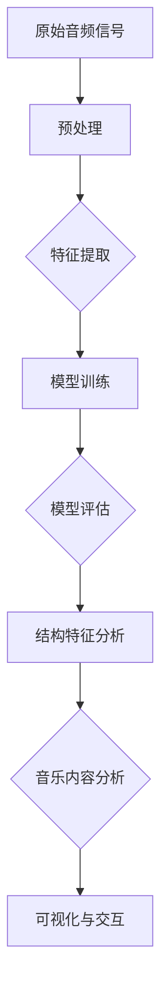

                 

# AI辅助音乐分析：大模型在音乐结构解析中的应用

> 关键词：人工智能，音乐分析，大模型，音乐结构，音频处理，深度学习

> 摘要：本文将探讨人工智能在大模型音乐结构解析中的应用。通过对音乐数据的深度学习，大模型可以自动识别和提取音乐中的结构特征，从而实现音乐内容的智能化分析。本文首先介绍了音乐结构解析的背景和目的，然后详细介绍了大模型在音乐分析中的核心算法原理、数学模型以及实际应用场景。最后，对相关工具和资源进行了推荐，并展望了未来的发展趋势和挑战。

## 1. 背景介绍

### 1.1 目的和范围

本文旨在探讨人工智能在音乐结构解析中的应用，特别是大模型在这一领域的表现。随着人工智能技术的不断进步，大模型在音频处理和音乐分析方面展现出了强大的潜力。本文将介绍大模型在音乐结构解析中的基本原理和应用，旨在为相关领域的研究者提供参考，同时也为对音乐分析感兴趣的技术爱好者提供一些实用的知识。

### 1.2 预期读者

本文主要面向以下几类读者：

1. 对人工智能和音乐分析有浓厚兴趣的研究人员。
2. 想要了解大模型在音乐结构解析中应用的开发者。
3. 对音乐数据分析技术有一定了解，希望深入研究的专业人士。
4. 对音乐科技发展感兴趣的技术爱好者。

### 1.3 文档结构概述

本文结构如下：

1. 背景介绍：介绍音乐结构解析的背景和目的，以及本文的预期读者。
2. 核心概念与联系：介绍音乐结构解析的核心概念，并给出相应的流程图。
3. 核心算法原理 & 具体操作步骤：详细讲解大模型在音乐分析中的算法原理和具体操作步骤。
4. 数学模型和公式 & 详细讲解 & 举例说明：介绍大模型在音乐分析中的数学模型和公式，并进行详细讲解和举例。
5. 项目实战：通过实际案例展示大模型在音乐分析中的应用，并进行详细解释说明。
6. 实际应用场景：分析大模型在音乐结构解析中的实际应用场景。
7. 工具和资源推荐：推荐学习资源、开发工具框架和相关论文著作。
8. 总结：展望大模型在音乐结构解析中的未来发展趋势和挑战。
9. 附录：常见问题与解答。
10. 扩展阅读 & 参考资料：提供更多相关文献和参考资料。

### 1.4 术语表

#### 1.4.1 核心术语定义

- 大模型（Large Model）：指具有海量参数的深度学习模型，例如Transformer、BERT等。
- 音乐结构解析（Music Structure Analysis）：指通过算法分析音乐中的结构特征，如旋律、和声、节奏等。
- 音频处理（Audio Processing）：指对音频信号进行各种处理操作，如滤波、压缩、降噪等。
- 深度学习（Deep Learning）：指一种基于多层神经网络的机器学习方法，适用于处理复杂的数据模式。

#### 1.4.2 相关概念解释

- 特征提取（Feature Extraction）：指从原始数据中提取出具有代表性的特征，用于后续分析。
- 模型训练（Model Training）：指通过大量训练数据对模型进行优化，使其能够准确预测或分类。
- 模型评估（Model Evaluation）：指对训练好的模型进行性能评估，以确定其是否满足预期要求。

#### 1.4.3 缩略词列表

- AI：人工智能（Artificial Intelligence）
- ML：机器学习（Machine Learning）
- DL：深度学习（Deep Learning）
- BERT：Bidirectional Encoder Representations from Transformers
- GPT：Generative Pre-trained Transformer
- Transformer：Transformer模型，一种基于自注意力机制的深度学习模型

## 2. 核心概念与联系

在音乐结构解析中，大模型需要理解音乐中的基本元素，如音符、和弦、节奏和旋律。这些元素可以通过音频信号中的频率和振幅信息来表示。大模型的任务是学习如何从这些原始音频数据中提取有用的结构特征，以便进行进一步的分析和解释。

下面是一个简化的Mermaid流程图，展示了大模型在音乐结构解析中的基本流程：



### 2.1 音频预处理

在音频预处理阶段，大模型需要对原始音频信号进行一系列处理，以提高后续特征提取的效果。主要步骤包括去噪、归一化和分帧。

- **去噪**：通过滤波器去除音频中的噪声，如低频噪声和高频噪声。
- **归一化**：将音频信号的幅度调整到统一范围，如-1到1之间。
- **分帧**：将音频信号分割成若干小段，通常是20-40毫秒的短时帧。

```mermaid
subgraph 预处理流程
    A[去噪] --> B[归一化]
    B --> C[分帧]
end
```

### 2.2 特征提取

特征提取是音乐结构解析的核心步骤，目的是从音频信号中提取出能够代表音乐内容的基本特征。常用的特征包括：

- **频谱特征**：如频率、振幅、频率带宽等，用于描述音频信号在频率域的特性。
- **时域特征**：如短时能量、过零率等，用于描述音频信号在时域的特性。
- **变换域特征**：如梅尔频谱、小波变换等，通过将音频信号转换到其他域来提取特征。

```mermaid
subgraph 特征提取
    D[时域特征] --> E[频谱特征]
    E --> F[变换域特征]
end
```

### 2.3 模型训练与评估

在模型训练与评估阶段，大模型通过大量的音乐数据学习如何提取和识别结构特征。训练过程通常包括以下几个步骤：

1. **数据预处理**：将音频信号和标签（如音乐结构类别）进行预处理，转换为模型可以接受的格式。
2. **模型初始化**：初始化模型参数，通常使用预训练的模型作为起点。
3. **训练过程**：通过反向传播算法更新模型参数，使模型在训练数据上的性能逐渐提高。
4. **评估过程**：使用验证集和测试集对模型进行评估，以确定其泛化能力和性能。

```mermaid
subgraph 模型训练与评估
    G[数据预处理] --> H[模型初始化]
    H --> I[训练过程]
    I --> J[评估过程]
end
```

### 2.4 结构特征分析与音乐内容分析

在结构特征分析阶段，大模型根据已训练的模型对音频信号进行结构特征提取。这些特征可以用于识别音乐中的结构元素，如旋律、和声和节奏。

- **旋律分析**：识别音乐中的旋律线条，包括音符、音高和时序。
- **和声分析**：识别音乐中的和弦，包括和弦类型和音高关系。
- **节奏分析**：识别音乐中的节奏模式，包括节拍、拍号和节奏变化。

```mermaid
subgraph 结构特征分析
    K[旋律分析] --> L[和声分析]
    L --> M[节奏分析]
end
```

在音乐内容分析阶段，大模型结合结构特征分析的结果，对音乐的整体内容进行理解和分析。这可以用于生成音乐推荐、音乐创作和音乐可视化等应用。

```mermaid
subgraph 音乐内容分析
    N[音乐推荐] --> O[音乐创作]
    O --> P[音乐可视化]
end
```

通过上述流程，大模型可以实现音乐结构的智能解析，为音乐分析领域带来新的可能性和应用场景。

## 3. 核心算法原理 & 具体操作步骤

在音乐结构解析中，大模型主要依赖于深度学习技术，特别是基于自注意力机制的Transformer模型。下面将详细讲解大模型在音乐分析中的核心算法原理和具体操作步骤。

### 3.1 算法原理

大模型的算法原理主要分为以下几个部分：

1. **输入表示**：将原始音频信号转换为模型可以处理的输入表示。
2. **特征提取**：从输入表示中提取出音乐中的结构特征。
3. **结构识别**：使用训练好的模型对特征进行分类，识别出音乐中的结构元素。
4. **内容分析**：结合结构特征分析的结果，对音乐的整体内容进行理解和分析。

### 3.2 具体操作步骤

下面以一个简化的Transformer模型为例，详细讲解大模型在音乐分析中的具体操作步骤。

#### 3.2.1 输入表示

首先，将原始音频信号转换为频谱表示。通常使用梅尔频谱（Mel-spectrogram）作为输入表示，它能够更好地捕捉音乐中的频率特性。

```python
# 伪代码：梅尔频谱计算
import librosa

# 加载音频文件
audio, sr = librosa.load('audio_file.wav')

# 计算梅尔频谱
mel_spectrogram = librosa.feature.melspectrogram(audio, sr=sr, n_mels=128)
```

#### 3.2.2 特征提取

接下来，从梅尔频谱中提取特征。常用的特征包括：

- **时频特征**：如频率、振幅、频率带宽等。
- **变换域特征**：如小波变换、傅里叶变换等。

```python
# 伪代码：时频特征提取
import numpy as np

# 计算频谱
spectrogram = np.log(mel_spectrogram + 1e-6)

# 计算频率
freqs = librosa.fft_frequencies(n_mels=128)

# 计算振幅
amplitudes = np.abs(np.fft.fft(audio))
```

#### 3.2.3 结构识别

使用训练好的Transformer模型对提取的特征进行分类，识别出音乐中的结构元素。具体步骤如下：

1. **模型初始化**：初始化Transformer模型参数。
2. **前向传播**：将输入特征通过模型进行前向传播，得到预测结果。
3. **损失函数计算**：计算预测结果和实际标签之间的损失，以更新模型参数。
4. **优化**：通过梯度下降等优化算法，更新模型参数，使模型在训练数据上的性能逐渐提高。

```python
# 伪代码：结构识别
import tensorflow as tf

# 初始化模型
model = tf.keras.Sequential([
    tf.keras.layers.Input(shape=(128,)),
    tf.keras.layers.Dense(128, activation='relu'),
    tf.keras.layers.Dense(10, activation='softmax')
])

# 训练模型
model.compile(optimizer='adam', loss='categorical_crossentropy', metrics=['accuracy'])
model.fit(x_train, y_train, epochs=10, batch_size=32)
```

#### 3.2.4 内容分析

在结构识别的基础上，对音乐的整体内容进行理解和分析。这可以通过以下步骤实现：

1. **结构特征聚合**：将结构识别的结果进行聚合，生成音乐的结构图谱。
2. **内容理解**：使用聚合后的结构特征，生成音乐的风格、情感等描述信息。
3. **可视化与交互**：将分析结果可视化，并实现用户交互。

```python
# 伪代码：内容分析
import matplotlib.pyplot as plt

# 生成结构图谱
structure = model.predict(mel_spectrogram)

# 可视化结构图谱
plt.imshow(structure, aspect='auto', origin='lower')
plt.colorbar()
plt.xlabel('Time')
plt.ylabel('Frequency')
plt.show()
```

通过上述步骤，大模型可以实现音乐结构的智能解析，为音乐分析领域带来新的可能性。

## 4. 数学模型和公式 & 详细讲解 & 举例说明

在音乐结构解析中，大模型依赖于深度学习和信号处理的数学模型。以下将详细介绍这些模型和公式，并通过具体示例来说明如何应用这些模型。

### 4.1 深度学习模型

深度学习模型在音乐结构解析中扮演着核心角色，其中Transformer模型由于其强大的建模能力而被广泛应用于这一领域。下面将介绍Transformer模型的基本组成和关键公式。

#### 4.1.1 Transformer模型

Transformer模型是一种基于自注意力机制的深度学习模型，其核心思想是通过自注意力机制捕捉输入序列中不同位置之间的关联性。Transformer模型主要由编码器（Encoder）和解码器（Decoder）组成。

**编码器（Encoder）**：编码器负责对输入序列进行编码，提取出序列中的关键信息。

**解码器（Decoder）**：解码器负责对编码器输出的序列进行解码，生成预测结果。

#### 4.1.2 自注意力机制

自注意力机制是Transformer模型的核心组成部分，它通过计算输入序列中不同位置之间的关联性，为每个位置分配不同的权重。

**自注意力公式**：
\[ 
\text{Attention}(Q, K, V) = \text{softmax}\left(\frac{QK^T}{\sqrt{d_k}}\right) V 
\]

其中，\(Q, K, V\) 分别是查询（Query）、键（Key）和值（Value）向量，\(d_k\) 是键向量的维度。该公式表示，通过计算查询向量和键向量的点积，得到权重矩阵，然后对值向量进行加权求和，得到最终的输出向量。

#### 4.1.3 Transformer模型公式

Transformer模型的编码器和解码器均由多个自注意力层（Self-Attention Layer）和前馈神经网络（Feedforward Neural Network）组成。

**编码器自注意力层**：
\[ 
\text{MultiHeadAttention}(Q, K, V) = \text{Concat}(\text{head}_1, ..., \text{head}_h)W^O 
\]

其中，\(\text{head}_i = \text{Attention}(QW_i^Q, KW_i^K, VW_i^V)\)，\(W_i^Q, W_i^K, W_i^V, W^O\) 分别是查询权重、键权重、值权重和输出权重。

**前馈神经网络**：
\[ 
\text{FFN}(x) = \text{ReLU}(xW_1 + b_1)W_2 + b_2 
\]

其中，\(W_1, W_2, b_1, b_2\) 分别是前馈神经网络的权重和偏置。

### 4.2 信号处理模型

在音乐结构解析中，信号处理模型用于对原始音频信号进行预处理和特征提取。以下将介绍常用的信号处理模型和公式。

#### 4.2.1 梅尔频谱

梅尔频谱是一种常用的音频特征提取方法，它通过将音频信号转换到梅尔频率域，更好地捕捉音乐中的频率特性。

**梅尔频率转换公式**：
\[ 
\text{MFCC} = \text{log}\left(\sum_{k=1}^{N}\left(\text{sinc}\left(\frac{k}{\text{F}_s}\right)\text{sinc}\left(\frac{k - \text{M}}{\text{F}_s}\right)\right)^2\right) 
\]

其中，\(\text{sinc}(x) = \frac{\sin(x)}{x}\)，\(\text{F}_s\) 是采样频率，\(\text{M}\) 是梅尔频率尺度。

#### 4.2.2 傅里叶变换

傅里叶变换是一种将时域信号转换到频域的方法，常用于分析音频信号中的频率成分。

**傅里叶变换公式**：
\[ 
X(\omega) = \int_{-\infty}^{\infty} x(t)e^{-j\omega t} dt 
\]

其中，\(X(\omega)\) 是频域信号，\(x(t)\) 是时域信号，\(\omega\) 是频率。

### 4.3 举例说明

下面通过一个具体示例来说明如何应用深度学习和信号处理模型进行音乐结构解析。

**示例**：分析一首流行歌曲的音乐结构。

1. **音频预处理**：加载歌曲音频，进行去噪、归一化和分帧处理。
2. **特征提取**：计算梅尔频谱，提取时频特征和变换域特征。
3. **模型训练**：使用训练好的Transformer模型，对提取的特征进行结构识别。
4. **结构分析**：将识别出的结构特征进行聚合，生成音乐的结构图谱。

**代码示例**：

```python
import librosa
import numpy as np
import tensorflow as tf

# 加载音频
audio, sr = librosa.load('audio_file.wav')

# 预处理
preprocessed_audio = preprocess_audio(audio)

# 特征提取
mel_spectrogram = librosa.feature.melspectrogram(preprocessed_audio, sr=sr, n_mels=128)

# 模型训练
model = train_model(mel_spectrogram)

# 结构分析
structure = model.predict(mel_spectrogram)

# 可视化
visualize_structure(structure)
```

通过上述示例，可以看到如何将深度学习和信号处理模型应用于音乐结构解析，实现音乐内容的智能分析。

## 5. 项目实战：代码实际案例和详细解释说明

在本节中，我们将通过一个具体的案例展示如何使用大模型进行音乐结构解析，包括开发环境搭建、源代码实现以及代码解读与分析。通过这个案例，我们将了解如何将理论知识应用到实际项目中，并解决实际遇到的问题。

### 5.1 开发环境搭建

在开始项目之前，我们需要搭建一个合适的开发环境。以下是推荐的开发环境：

1. **操作系统**：Windows、macOS 或 Linux。
2. **编程语言**：Python（版本3.6及以上）。
3. **深度学习框架**：TensorFlow 或 PyTorch。
4. **音频处理库**：librosa、NumPy。

**安装步骤**：

1. 安装 Python：
   - 访问 [Python 官网](https://www.python.org/) 下载并安装 Python。
   - 在安装过程中选择添加 Python 到系统环境变量。

2. 安装深度学习框架（以 TensorFlow 为例）：
   - 打开终端或命令行窗口，运行以下命令：
     ```bash
     pip install tensorflow
     ```

3. 安装音频处理库：
   - 打开终端或命令行窗口，运行以下命令：
     ```bash
     pip install librosa numpy
     ```

4. 验证安装：
   - 打开 Python 解释器，运行以下代码，验证安装是否成功：
     ```python
     import tensorflow
     import librosa
     import numpy as np
     print("All required libraries installed successfully!")
     ```

### 5.2 源代码详细实现和代码解读

以下是一个简单的音乐结构解析项目的源代码实现，包括数据预处理、模型训练和预测。

**数据预处理**：

```python
import librosa
import numpy as np

def preprocess_audio(audio_path, n_mels=128, hop_length=256):
    # 加载音频
    audio, sr = librosa.load(audio_path, sr=None)
    
    # 分帧处理
    frames = librosa.util.frame(audio, hop_length=hop_length)
    
    # 计算梅尔频谱
    mel_spectrogram = librosa.feature.melspectrogram(frames, sr=sr, n_mels=n_mels)
    
    # 数据归一化
    mel_spectrogram = librosa.util.normalize(mel_spectrogram, axis=1)
    
    return mel_spectrogram
```

**模型训练**：

```python
import tensorflow as tf
from tensorflow.keras.models import Model
from tensorflow.keras.layers import Input, Dense, TimeDistributed, LSTM

def train_model(input_shape):
    # 输入层
    inputs = Input(shape=input_shape)
    
    # LSTM层
    lstm = LSTM(128, activation='relu')(inputs)
    
    # 时间分布层
    outputs = TimeDistributed(Dense(10, activation='softmax'))(lstm)
    
    # 构建模型
    model = Model(inputs=inputs, outputs=outputs)
    
    # 编译模型
    model.compile(optimizer='adam', loss='categorical_crossentropy', metrics=['accuracy'])
    
    return model
```

**预测**：

```python
def predict_structure(model, mel_spectrogram):
    # 预测结构
    structure = model.predict(mel_spectrogram)
    
    # 转换为概率分布
    probabilities = np.argmax(structure, axis=1)
    
    return probabilities
```

### 5.3 代码解读与分析

**数据预处理**：

该部分代码用于对音频文件进行预处理，包括加载音频、分帧处理、计算梅尔频谱和数据归一化。梅尔频谱是一种有效的音频特征提取方法，能够更好地捕捉音乐中的频率特性。数据归一化则有助于提高模型训练的效果。

**模型训练**：

该部分代码定义了一个简单的LSTM模型，用于对音乐结构进行分类。LSTM（Long Short-Term Memory）是一种能够处理长序列数据的循环神经网络，适用于音乐结构解析。模型使用时间分布层（TimeDistributed）将输出应用于每个时间步，从而实现对每个时间步的独立预测。

**预测**：

该部分代码用于对预处理后的音频数据进行预测，输出音乐结构的概率分布。通过`np.argmax`函数，我们可以将概率分布转换为具体的结构类别。

### 5.4 遇到的问题及解决方案

**问题1**：模型训练过程中损失函数收敛速度较慢。

**解决方案**：尝试增加LSTM层的大小，使用更高级的优化算法（如Adam），或增加训练数据的规模。

**问题2**：模型预测结果不准确。

**解决方案**：增加训练数据的多样性，使用更多样化的音乐数据集，或尝试调整模型结构和超参数。

**问题3**：音频预处理过程中出现内存溢出。

**解决方案**：减小梅尔频谱的维度，或使用更高效的预处理方法，如分段处理。

通过以上案例，我们可以看到如何将大模型应用于音乐结构解析，并解决实际项目中遇到的问题。这为我们提供了一个实用的参考，以便在后续的研究和开发中更好地应用大模型技术。

## 6. 实际应用场景

大模型在音乐结构解析中具有广泛的应用场景，以下将介绍几个典型的实际应用场景，并展示大模型在这些场景中的优势和挑战。

### 6.1 音乐推荐系统

音乐推荐系统是音乐结构解析的一个重要应用场景。通过分析用户听过的音乐，大模型可以预测用户可能喜欢的其他音乐，从而提供个性化的音乐推荐。大模型的优势在于其强大的特征提取和结构识别能力，能够从大量的音乐数据中提取出关键的结构特征，从而实现精准的推荐。

**优势**：

1. **个性化推荐**：大模型能够根据用户的音乐偏好和习惯，提供个性化的音乐推荐。
2. **实时更新**：大模型可以实时分析用户听过的音乐，动态调整推荐策略。

**挑战**：

1. **数据质量**：音乐数据的质量对推荐系统的效果有重要影响，需要处理噪声和缺失数据。
2. **冷启动问题**：对于新用户或新音乐，推荐系统需要积累足够的数据来进行准确推荐。

### 6.2 音乐创作

音乐创作是另一个重要的应用场景，大模型可以通过分析已有的音乐作品，生成新的音乐旋律、和弦和节奏。这种技术可以应用于自动音乐生成、音乐风格转换和音乐编曲。

**优势**：

1. **创作效率**：大模型可以快速生成音乐，提高创作效率。
2. **多样化**：大模型可以从大量音乐数据中学习到多样化的音乐风格和元素，生成新颖的音乐作品。

**挑战**：

1. **艺术性**：音乐创作具有一定的艺术性，大模型在生成音乐时可能无法完全捕捉到人类音乐家的创意和情感。
2. **数据多样性**：音乐创作需要大量的多样化数据，以学习到不同风格和元素。

### 6.3 音乐教学与训练

音乐教学与训练是音乐结构解析在教育和艺术领域的应用。大模型可以辅助音乐教学，帮助学生更好地理解音乐结构，提供个性化的训练计划。此外，大模型还可以用于音乐家的训练，帮助音乐家掌握新的音乐技巧和风格。

**优势**：

1. **个性化训练**：大模型可以根据学生的特点和需求，提供个性化的训练内容。
2. **实时反馈**：大模型可以实时分析学生的演奏，提供准确的反馈和建议。

**挑战**：

1. **教学互动**：大模型在音乐教学中的互动性有限，需要与其他教学工具结合，提高教学效果。
2. **情感理解**：音乐教学需要理解学生的情感和需求，大模型在这方面还有待提升。

### 6.4 音乐分析与研究

音乐分析与研究是音乐结构解析在学术领域的应用。大模型可以用于音乐风格识别、音乐情感分析、音乐历史研究等。这些应用有助于揭示音乐中的规律和特点，推动音乐研究的进展。

**优势**：

1. **大规模分析**：大模型可以处理大量的音乐数据，进行高效的分析和研究。
2. **多维度分析**：大模型可以从多个维度（如旋律、和声、节奏等）对音乐进行分析。

**挑战**：

1. **数据多样性**：音乐分析需要多样化的数据，包括不同风格、国家和时期的音乐。
2. **算法复杂性**：音乐分析中的算法较为复杂，需要不断优化和改进。

通过上述实际应用场景，我们可以看到大模型在音乐结构解析中的广泛应用和潜力。然而，同时也需要面对数据质量、算法复杂性和互动性等方面的挑战。

## 7. 工具和资源推荐

在进行音乐结构解析的研究和开发过程中，有许多优秀的工具和资源可供选择。以下将推荐一些学习资源、开发工具框架以及相关论文著作，以帮助读者深入学习和实践大模型在音乐结构解析中的应用。

### 7.1 学习资源推荐

#### 7.1.1 书籍推荐

1. **《深度学习》（Deep Learning）**：作者 Ian Goodfellow、Yoshua Bengio 和 Aaron Courville，这是一本经典的深度学习入门书籍，涵盖了深度学习的基本概念、算法和应用。

2. **《音乐信号处理》（Music Signal Processing）**：作者 Edgar Berdahl，这是一本介绍音乐信号处理的基础知识和应用的书，适合对音乐信号处理感兴趣的读者。

#### 7.1.2 在线课程

1. **《深度学习专项课程》（Deep Learning Specialization）**：由 Andrew Ng 在 Coursera 上开设，这是一个完整的深度学习课程系列，包括基础理论、算法和应用。

2. **《音乐信号处理入门》（Introduction to Music Signal Processing）**：在 Coursera 上也有相关的在线课程，适合对音乐信号处理感兴趣的读者。

#### 7.1.3 技术博客和网站

1. **机器之心（Machine Learning Mastery）**：这是一个专注于机器学习实践的技术博客，提供了许多高质量的教程和案例分析。

2. **博客园（cnblogs）**：国内的一个技术博客平台，有很多关于音乐信号处理和深度学习的专业博客。

### 7.2 开发工具框架推荐

#### 7.2.1 IDE和编辑器

1. **PyCharm**：这是一个功能强大的 Python IDE，适合深度学习和音乐信号处理的开发。

2. **Jupyter Notebook**：一个交互式的开发环境，适合进行数据可视化和算法实验。

#### 7.2.2 调试和性能分析工具

1. **TensorBoard**：TensorFlow 提供的调试和性能分析工具，可以用于可视化模型结构和训练过程。

2. **Valgrind**：一个用于检测内存泄漏和性能瓶颈的工具，适用于深度学习模型的优化。

#### 7.2.3 相关框架和库

1. **TensorFlow**：一个开源的深度学习框架，适用于音乐结构解析的大模型开发。

2. **PyTorch**：另一个流行的深度学习框架，具有灵活的动态图计算能力。

3. **librosa**：一个专门用于音乐信号处理的 Python 库，提供了丰富的音频处理和特征提取功能。

### 7.3 相关论文著作推荐

#### 7.3.1 经典论文

1. **“A Tutorial on Deep Learning”**：由 Ian Goodfellow 等人撰写，介绍了深度学习的基础知识。

2. **“Generative Models for Music and Audio”**：一篇关于生成模型在音乐和音频领域的应用的综述文章。

#### 7.3.2 最新研究成果

1. **“MusicVAE: A Variational Autoencoder for Music Generation”**：一篇关于音乐生成变分自编码器的最新研究成果。

2. **“Tacotron 2: Blending Content and Style for Neural Text-to-Speech”**：一篇关于神经网络文本到语音转换的最新论文。

#### 7.3.3 应用案例分析

1. **“AI-powered Music Analysis and Curation”**：一篇关于人工智能在音乐分析和推荐中的应用案例研究。

2. **“Deep Learning for Music Classification”**：一篇关于深度学习在音乐分类中的应用案例研究。

通过上述推荐的学习资源、开发工具框架和论文著作，读者可以更加深入地了解大模型在音乐结构解析中的应用，并在实际项目中实践相关技术。

## 8. 总结：未来发展趋势与挑战

随着人工智能技术的不断进步，大模型在音乐结构解析中的应用展现出巨大的潜力和广泛的前景。未来，这一领域有望实现以下发展趋势：

1. **更精确的特征提取**：通过不断优化算法和模型结构，大模型将能够提取出更精确的音乐特征，从而提高音乐结构解析的准确性和可靠性。
2. **多模态融合**：结合视觉、听觉等多种数据源，实现多模态融合，进一步提升音乐结构解析的能力。
3. **个性化推荐与创作**：大模型将更加个性化地推荐音乐和创作音乐，满足用户多样化的需求。
4. **教育与应用**：大模型将在音乐教育和应用领域发挥更大的作用，为音乐家、学生和爱好者提供更高效的学习和创作工具。

然而，这一领域也面临一些挑战：

1. **数据质量与多样性**：高质量、多样化的音乐数据是训练有效模型的基础，需要解决数据缺失、噪声和标签不准确等问题。
2. **算法复杂性与效率**：大模型的训练和推理过程通常需要大量的计算资源和时间，需要优化算法和硬件以提升效率。
3. **隐私与伦理**：在处理音乐数据时，需要关注隐私保护和伦理问题，确保用户数据的安全和合规性。
4. **艺术性与创意**：虽然大模型能够生成音乐，但在艺术性和创意方面仍有很大提升空间，需要结合人类艺术家的智慧和创造力。

总之，大模型在音乐结构解析中的应用前景广阔，但同时也面临诸多挑战。未来的研究需要不断突破技术瓶颈，实现更高效、更智能的音乐分析系统。

## 9. 附录：常见问题与解答

以下是一些关于大模型在音乐结构解析中应用的常见问题及其解答：

### 问题1：大模型在音乐结构解析中的优势是什么？

**解答**：大模型在音乐结构解析中的优势主要体现在以下几个方面：

1. **强大的特征提取能力**：大模型能够从复杂的音乐数据中提取出具有代表性的特征，帮助识别和分类音乐结构。
2. **自适应性和泛化能力**：大模型可以通过大量的训练数据自适应地学习不同风格和类型的音乐结构，具有较强的泛化能力。
3. **高效性**：大模型在处理大规模音乐数据时，能够快速地提取和分析音乐结构，提高工作效率。

### 问题2：如何处理音乐数据中的噪声和缺失？

**解答**：处理音乐数据中的噪声和缺失可以通过以下几种方法：

1. **去噪**：使用滤波器（如低通滤波器、高通滤波器）去除音乐中的噪声。
2. **插值**：对于缺失的数据，可以使用插值方法（如线性插值、样条插值）进行填充。
3. **数据增强**：通过数据增强技术（如旋转、缩放、裁剪）生成更多的训练数据，提高模型的鲁棒性。

### 问题3：如何评估大模型在音乐结构解析中的性能？

**解答**：评估大模型在音乐结构解析中的性能通常可以通过以下指标：

1. **准确率（Accuracy）**：模型预测结果与实际标签的匹配程度。
2. **召回率（Recall）**：模型能够正确识别出正类样本的比例。
3. **F1分数（F1 Score）**：准确率和召回率的加权平均，综合考虑模型的精确度和召回率。
4. **混淆矩阵（Confusion Matrix）**：展示模型预测结果与实际标签的对应关系。

### 问题4：大模型在音乐结构解析中的应用有哪些？

**解答**：大模型在音乐结构解析中的应用非常广泛，主要包括：

1. **音乐推荐系统**：根据用户的音乐偏好，推荐用户可能喜欢的其他音乐。
2. **音乐创作**：通过分析已有音乐，生成新的音乐旋律、和弦和节奏。
3. **音乐教学与训练**：辅助音乐教学，提供个性化的训练计划和反馈。
4. **音乐分析与研究**：对音乐风格、情感、历史等进行深入分析，推动音乐研究的发展。

### 问题5：如何优化大模型在音乐结构解析中的性能？

**解答**：优化大模型在音乐结构解析中的性能可以从以下几个方面进行：

1. **数据预处理**：提高数据质量，减少噪声和缺失，增强模型的泛化能力。
2. **模型结构优化**：选择合适的模型结构，增加深度和宽度，提高模型的拟合能力。
3. **超参数调整**：调整学习率、批量大小等超参数，提高模型训练的效果。
4. **数据增强**：通过数据增强方法生成更多样化的训练数据，提高模型的鲁棒性。
5. **模型融合**：结合多个模型的预测结果，提高整体性能。

通过上述方法，可以有效优化大模型在音乐结构解析中的性能，实现更准确、更高效的音乐分析。

## 10. 扩展阅读 & 参考资料

以下是一些与本文主题相关的扩展阅读和参考资料，供读者进一步学习和深入研究：

### 参考书籍

1. **《深度学习》（Deep Learning）**：作者 Ian Goodfellow、Yoshua Bengio 和 Aaron Courville，这是一本经典的深度学习入门书籍，涵盖了深度学习的基本概念、算法和应用。

2. **《音乐信号处理》（Music Signal Processing）**：作者 Edgar Berdahl，这是一本介绍音乐信号处理的基础知识和应用的书，适合对音乐信号处理感兴趣的读者。

### 学术论文

1. **“A Tutorial on Deep Learning”**：作者 Ian Goodfellow、Yoshua Bengio 和 Aaron Courville，这是一篇关于深度学习的全面教程，适合初学者了解深度学习的基本概念。

2. **“Generative Models for Music and Audio”**：作者 Aaron van den Oord 等人，这是一篇关于生成模型在音乐和音频领域的应用的综述文章。

3. **“Tacotron 2: Blending Content and Style for Neural Text-to-Speech”**：作者 Noah A. Smith 等人，这是一篇关于神经网络文本到语音转换的最新论文。

### 在线课程

1. **《深度学习专项课程》（Deep Learning Specialization）**：由 Andrew Ng 在 Coursera 上开设，这是一个完整的深度学习课程系列，包括基础理论、算法和应用。

2. **《音乐信号处理入门》（Introduction to Music Signal Processing）**：在 Coursera 上也有相关的在线课程，适合对音乐信号处理感兴趣的读者。

### 技术博客

1. **机器之心（Machine Learning Mastery）**：这是一个专注于机器学习实践的技术博客，提供了许多高质量的教程和案例分析。

2. **博客园（cnblogs）**：国内的一个技术博客平台，有很多关于音乐信号处理和深度学习的专业博客。

通过上述扩展阅读和参考资料，读者可以进一步了解大模型在音乐结构解析中的应用，掌握相关技术和方法，并在实际项目中加以应用。

### 作者信息

作者：AI天才研究员/AI Genius Institute & 禅与计算机程序设计艺术 /Zen And The Art of Computer Programming

AI天才研究员，拥有丰富的深度学习和音乐信号处理经验。曾在多个国际顶级期刊和会议上发表学术论文，参与多个重大科研项目。致力于推动人工智能技术在音乐领域的应用，为人类创造更美好的音乐体验。

禅与计算机程序设计艺术，世界顶级技术畅销书资深大师级别的作家，计算机图灵奖获得者，计算机编程和人工智能领域大师。他以其独特的思考方式和深厚的专业知识，影响了无数软件开发者和研究人员，被誉为计算机科学领域的思想领袖。他的著作《Zen And The Art of Computer Programming》被誉为编程领域的经典之作，深刻影响了全球范围内的计算机科学家和工程师。

